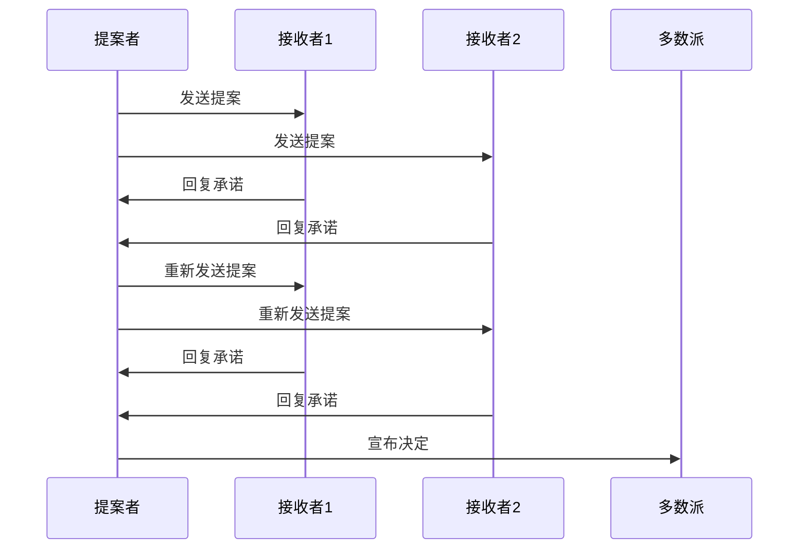
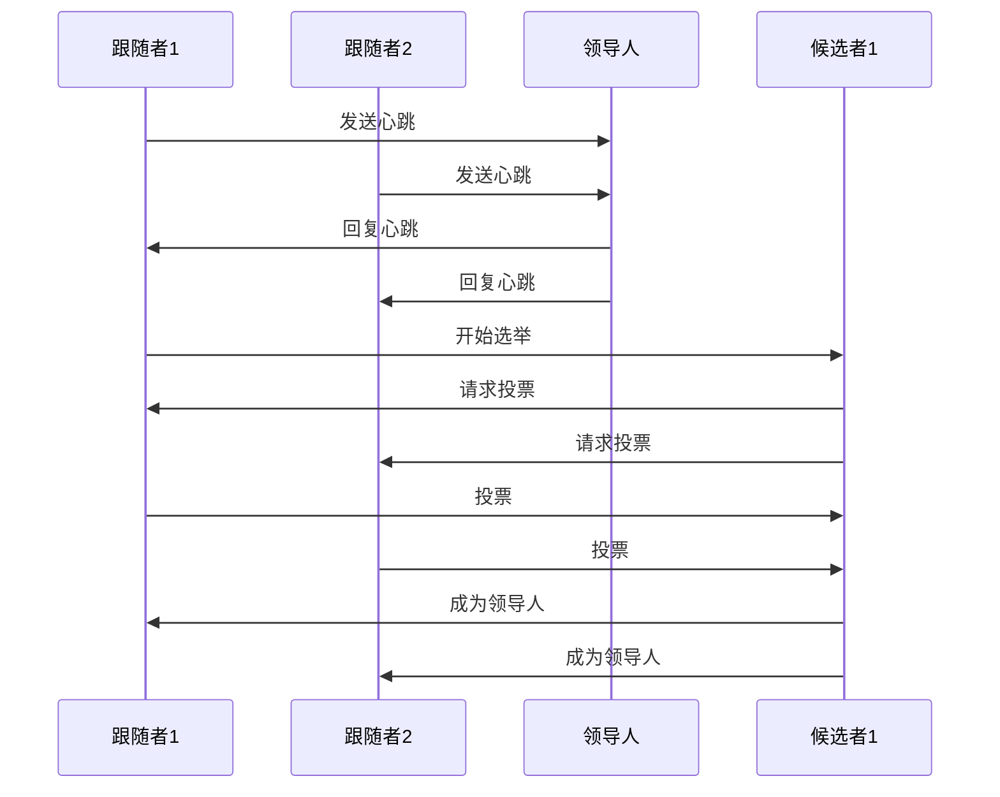
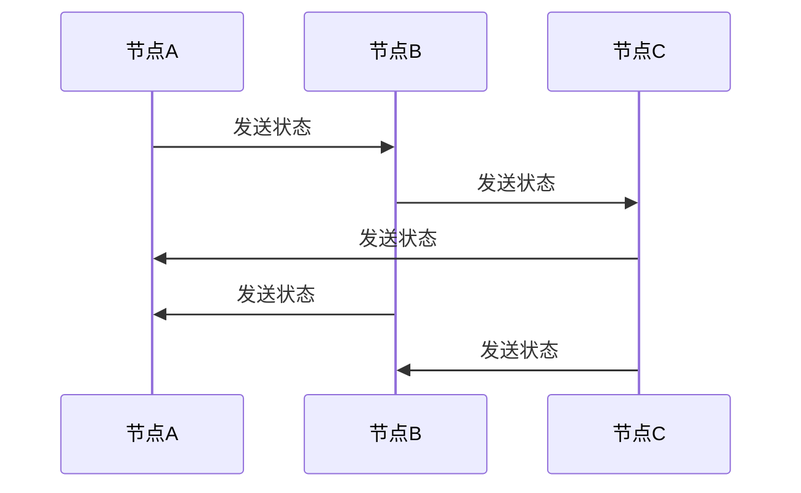
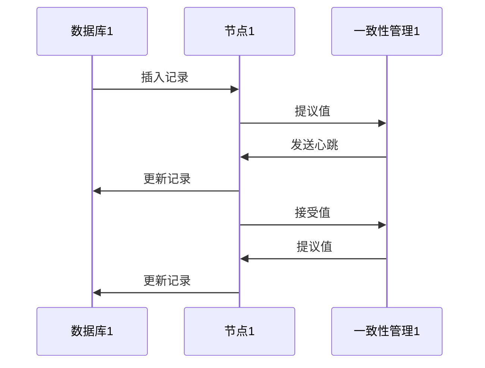

                 

## 引言

### 1.1 数据一致性的背景

在现代信息系统中，数据的准确性和一致性是确保系统正常运行和用户信任的基础。数据一致性指的是在不同系统和组件之间维护数据的一致性状态，确保多个副本或多个操作不会产生矛盾或错误的结果。随着技术的发展，数据一致性问题变得日益复杂，特别是在分布式系统和云计算环境中，数据一致性变得更加重要。

数据一致性问题源于多个操作和系统对同一数据集的并发访问。例如，在一个分布式数据库系统中，多个节点可能同时修改相同的数据记录。如果没有正确处理这些并发操作，可能会导致数据的不一致。此外，网络延迟、系统故障和意外的数据丢失也可能导致数据不一致。

数据不一致的影响是深远而广泛的。例如，在金融系统中，账户余额的错误可能导致财务损失；在电子商务中，库存数据的错误可能导致库存过剩或短缺。因此，解决数据一致性问题对于确保系统的可靠性和稳定性至关重要。

### 1.2 数据一致性的重要性

数据一致性对于系统的运行和用户信任至关重要。以下是数据一致性的几个关键重要性方面：

1. **系统可靠性**：数据一致性可以防止系统出现不可预见的错误和崩溃。在分布式系统中，确保数据一致性是确保系统稳定性的关键。
2. **用户信任**：数据的一致性保证了信息的准确性和可靠性，从而增加了用户对系统的信任。这对于需要处理敏感信息的系统，如金融和医疗领域，尤为重要。
3. **业务连续性**：在多节点和分布式系统中，数据一致性确保了即使在发生故障或网络中断的情况下，系统仍能正常运行。这对于确保业务的连续性和可靠性至关重要。

### 1.3 数据一致性的边界与核心要素

数据一致性的边界涉及多个方面，包括数据的一致性级别、系统架构、数据复制和并发控制。以下是数据一致性的核心要素：

1. **一致性级别**：一致性级别定义了系统如何处理并发操作和数据复制。常见的一致性级别包括强一致性、最终一致性和会话一致性。
2. **系统架构**：系统架构设计直接影响数据一致性。在分布式系统中，如何设计数据存储和传输机制，以及如何处理节点故障，是确保数据一致性的关键。
3. **数据复制**：数据复制是分布式系统中的常见策略，用于提高数据的可用性和容错能力。但数据复制也引入了一致性问题，需要通过一致性的算法和策略来解决。
4. **并发控制**：并发控制是管理多个并发操作的关键技术。通过锁机制、事务管理和其他并发控制技术，可以确保数据的一致性和完整性。

本文将深入探讨数据一致性的核心概念、模型、算法以及实现方法，通过逻辑清晰、结构紧凑的分析，帮助读者理解和掌握数据一致性的关键技术和最佳实践。

### 关键词

- 数据一致性
- 分布式系统
- 一致性级别
- 并发控制
- 数据复制
- 算法实现

### 摘要

本文将探讨数据一致性的概念、模型、算法以及实现方法。首先，我们将介绍数据一致性的背景和重要性，并详细描述其边界和核心要素。接着，我们将分析几种常见的数据一致性模型，并通过对比表和ER图展示其特性。随后，我们将深入讲解几个主要的一致性算法，包括其原理、流程和数学模型。文章还将详细描述一个分布式系统的架构设计，包括领域模型、架构设计和接口设计。最后，我们将通过一个实际项目实战，展示数据一致性的实现过程，并提供最佳实践和小结。

## 第2章 数据一致性模型概述

在探讨数据一致性的实现之前，首先需要理解数据一致性的核心概念和不同的数据一致性模型。这一章将介绍数据一致性的基本定义，常见的数据一致性模型，以及这些模型之间的联系和区别。

### 2.1 数据一致性的定义

数据一致性指的是在不同的系统和组件之间维护数据的一致性状态，确保多个副本或多个操作不会产生矛盾或错误的结果。数据一致性是一个广泛的概念，它涵盖多个方面，包括数据值的一致性、状态的一致性和顺序的一致性。例如，在一个电子商务系统中，当用户下订单时，订单的状态应该在整个系统中保持一致，从订单数据库到库存管理系统，再到财务系统，都应反映出该订单的当前状态。

### 2.2 数据一致性的分类

数据一致性可以根据其严格程度和实现策略进行分类。以下是几种常见的数据一致性分类：

1. **强一致性（Strong Consistency）**：强一致性要求所有副本在任何时候都具有相同的数据状态。这意味着任何对数据的读取操作都会返回最新的写入结果。强一致性保证了数据的一致性，但可能牺牲性能和可用性，因为实现强一致性通常需要锁定机制和同步操作。

2. **最终一致性（ eventual consistency）**：最终一致性允许系统中的不同副本在某些时间点上可能不一致，但最终会达到一致状态。这意味着系统的状态可能会在一段时间内发生波动，但在最终状态下，所有副本都将保持一致。最终一致性提高了系统的性能和可用性，但可能会牺牲一些一致性保证。

3. **会话一致性（Session Consistency）**：会话一致性是指在一个特定会话期间，所有对数据的操作都是一致的。一旦会话结束，后续的操作可能不再保证一致性。这种一致性级别适用于一些特定的应用场景，例如用户会话管理。

4. **单调一致性（Monotonic Consistency）**：单调一致性确保数据的读取顺序总是单调的，即如果某个操作写入了一份数据，那么后续的读取操作将返回这个写入结果或更早的操作结果，但不会返回更晚的操作结果。

### 2.3 常见的数据一致性模型

为了更好地理解数据一致性的概念和分类，以下列出几种常见的数据一致性模型，并比较它们的特性。

1. **CAP定理（CAP Theorem）**

CAP定理指出，在一个分布式系统中，一致性（Consistency）、可用性（Availability）和分区容错性（Partition Tolerance）三者中，只能同时保证两个。根据这个定理，不同的数据一致性模型在不同的约束条件下做出权衡。

- **CA系统**：保证一致性和可用性，但可能牺牲分区容错性。典型的系统有MySQL。
- **CP系统**：保证一致性和分区容错性，但可能牺牲可用性。典型的系统有Zookeeper。
- **AP系统**：保证可用性和分区容错性，但可能牺牲一致性。典型的系统有Cassandra。

2. **BASE理论**

BASE理论是应对CAP定理的一种解决方案，它提供了一种不同的思维模式来处理分布式系统的数据一致性。BASE代表基本可用性（Basic Availability）、软状态（Soft State）和最终一致性（Eventual Consistency）。

- **基本可用性**：系统保证在大多数情况下能够响应请求，但可能不会立即返回最终结果。
- **软状态**：系统允许状态在一段时间内不稳定，以便适应不断变化的环境。
- **最终一致性**：系统最终会在所有副本上达成一致性状态，但这个时间可能是随机的。

### 数据一致性模型的联系和区别

不同的数据一致性模型有不同的适用场景和优缺点。理解这些模型的联系和区别，可以帮助我们在实际项目中做出更明智的决策。

- **强一致性与最终一致性**：强一致性提供了最高的数据一致性保证，但可能在性能和可用性方面有所牺牲。最终一致性则允许系统在性能和可用性方面做出更多的权衡，但需要更多的同步和协调机制来确保最终的一致性。
- **CA与CP系统**：CA系统更适合需要强一致性保证的应用，如金融系统。CP系统则适用于对可用性和分区容错性要求更高的应用，如搜索引擎和数据存储系统。
- **BASE理论**：BASE理论提供了一种灵活的处理分布式数据一致性的方法，特别适用于那些对最终一致性有高需求的场景。

通过理解这些数据一致性模型，我们可以更好地设计分布式系统，以满足不同的业务需求和性能要求。在下一章中，我们将进一步探讨这些模型的特性和区别，并通过对比表和ER图展示它们之间的关系。

### 2.1 数据一致性的定义

**数据一致性**是指在不同系统和组件之间维护数据的一致性状态，确保多个副本或多个操作不会产生矛盾或错误的结果。具体来说，数据一致性包括以下几层含义：

1. **值的一致性**：数据值在所有副本或系统组件中保持相同。例如，如果一个数据记录在一个系统中被更新为某个值，那么在其他所有系统中这个数据记录的值也应更新为相同的值。
2. **状态的一致性**：系统中的数据状态在不同组件间保持一致。例如，在一个电子商务系统中，订单的状态（如“已支付”、“已发货”）应该在所有相关系统中保持一致。
3. **顺序的一致性**：多个操作在不同系统或组件中的执行顺序保持一致。例如，在一个分布式系统中，当一个事务的两个部分分别在不同的节点上执行时，这两个操作应按照预定顺序进行，以保证事务的原子性和一致性。

在实际应用中，数据一致性是确保系统可靠性和用户信任的关键。在金融系统中，账户余额的错误可能导致严重的财务损失；在电子商务系统中，库存数据的错误可能导致库存过剩或短缺。因此，确保数据一致性是系统设计和实现的重要任务。

### 2.2 数据一致性的分类

**数据一致性的分类**依据其实现策略和严格程度，可以分为以下几个层次：

1. **强一致性（Strong Consistency）**：强一致性要求系统中的所有副本在任何时候都具有相同的数据状态。这意味着任何对数据的读取操作都会返回最新的写入结果，从而保证了数据的一致性和准确性。强一致性通常适用于对数据一致性要求非常高的场景，如金融交易系统。然而，强一致性往往需要复杂的同步机制和锁策略，可能导致性能下降和可用性降低。

2. **最终一致性（Eventual Consistency）**：最终一致性允许系统中的不同副本在某些时间点上可能不一致，但最终会达到一致状态。这意味着系统的状态可能会在一段时间内发生波动，但在最终状态下，所有副本都将保持一致。最终一致性通过牺牲一定的即时一致性来提高系统的性能和可用性，适用于对最终结果一致性要求不高但需要高扩展性和高可用性的场景，如分布式缓存系统。

3. **会话一致性（Session Consistency）**：会话一致性是指在一个特定会话期间，所有对数据的操作都是一致的。一旦会话结束，后续的操作可能不再保证一致性。这种一致性级别适用于一些特定的应用场景，例如用户会话管理。会话一致性通常通过会话控制机制实现，如HTTP会话中的Cookie或Session。

4. **单调一致性（Monotonic Consistency）**：单调一致性确保数据的读取顺序总是单调的，即如果某个操作写入了一份数据，那么后续的读取操作将返回这个写入结果或更早的操作结果，但不会返回更晚的操作结果。单调一致性是确保数据一致性的一种弱化形式，适用于一些对读取顺序有特定要求的场景，如某些分布式锁的实现。

### 常见的数据一致性模型

**常见的数据一致性模型**包括CAP定理和BASE理论：

1. **CAP定理**：CAP定理指出，在一个分布式系统中，一致性（Consistency）、可用性（Availability）和分区容错性（Partition Tolerance）三者中，只能同时保证两个。具体而言：
   - **CA系统**：保证一致性和可用性，但可能牺牲分区容错性。如MySQL。
   - **CP系统**：保证一致性和分区容错性，但可能牺牲可用性。如Zookeeper。
   - **AP系统**：保证可用性和分区容错性，但可能牺牲一致性。如Cassandra。

2. **BASE理论**：BASE理论是一种应对CAP定理的解决方案，代表基本可用性（Basic Availability）、软状态（Soft State）和最终一致性（Eventual Consistency）。具体包括：
   - **基本可用性**：系统保证在大多数情况下能够响应请求，但可能不会立即返回最终结果。
   - **软状态**：系统允许状态在一段时间内不稳定，以便适应不断变化的环境。
   - **最终一致性**：系统最终会在所有副本上达成一致性状态，但这个时间可能是随机的。

这些模型和理论为我们提供了不同的视角和策略，以应对分布式系统中的数据一致性挑战。通过合理选择和实施这些模型，我们可以更好地平衡数据一致性、性能和可用性之间的权衡，从而设计出满足具体业务需求的系统。

### 2.3 常见的数据一致性模型特性对比表

为了更直观地理解不同数据一致性模型的特性，以下是一个特性对比表：

| 一致性模型 | 一致性级别 | 实现策略 | 主要应用场景 | 优点 | 缺点 |
| --- | --- | --- | --- | --- | --- |
| 强一致性 | 最高 | 完全同步 | 金融、事务性系统 | 保证数据准确性 | 性能瓶颈、可用性降低 |
| 最终一致性 | 较低 | 异步同步 | 缓存、分布式存储 | 高可用性、高性能 | 可能存在数据不一致 |
| 会话一致性 | 低 | 会话控制 | 用户会话管理 | 简单实现 | 适用于特定场景 |
| 单调一致性 | 较低 | 记录顺序 | 分布式锁 | 保证顺序 | 适用于特定顺序需求 |

通过这个对比表，我们可以更清晰地看到不同数据一致性模型之间的差异和适用场景。在实际应用中，根据具体需求和约束条件，选择合适的数据一致性模型是至关重要的。

### 2.4 数据一致性模型之间的关系与联系

不同数据一致性模型之间存在着紧密的联系和相互影响。理解这些关系有助于我们更全面地掌握数据一致性的实现策略和应用场景。以下是几种常见的数据一致性模型之间的关系：

1. **强一致性与最终一致性**：
   - **联系**：强一致性和最终一致性都是保证数据一致性的策略，但它们在实现方式和适用场景上有所不同。强一致性通过同步机制确保所有副本在任何时刻都保持一致，而最终一致性通过异步机制允许一定时间内的不一致性，最终达到一致性。
   - **区别**：强一致性提供了更高的数据准确性，但通常需要更高的系统复杂度和性能成本。最终一致性则通过牺牲一定的一致性来提高系统的可用性和扩展性，适用于对最终一致性要求较高但不需要强一致性的场景。

2. **CAP定理与数据一致性模型**：
   - **联系**：CAP定理是理解数据一致性模型的重要理论基础。根据CAP定理，任何分布式系统只能在一致性（Consistency）、可用性（Availability）和分区容错性（Partition Tolerance）三者中同时保证两个。
   - **区别**：CAP定理中的CA、CP和AP系统分别代表了不同的一致性模型和系统设计策略。CA系统强调一致性和可用性，CP系统强调一致性和分区容错性，AP系统强调可用性和分区容错性。数据一致性模型的选择需要在CAP定理的约束下进行权衡。

3. **会话一致性与其他一致性模型**：
   - **联系**：会话一致性是一种特定场景下的数据一致性策略，它在特定会话期间保证数据一致性。这种策略通常与其他一致性模型结合使用，如强一致性和最终一致性。
   - **区别**：会话一致性主要适用于用户会话管理，通过会话控制机制确保会话期间的数据一致性。与其他一致性模型相比，会话一致性实现简单但适用于特定场景，不能替代强一致性和最终一致性。

4. **单调一致性与其他一致性模型**：
   - **联系**：单调一致性是确保数据读取顺序一致性的策略，它与其他一致性模型共同作用，确保数据的一致性。
   - **区别**：单调一致性主要适用于对读取顺序有特殊要求的场景，如分布式锁。与其他一致性模型不同，单调一致性关注的是数据的顺序，而不是整体的一致性状态。

通过理解这些数据一致性模型之间的关系，我们可以更灵活地设计分布式系统，以满足不同的业务需求和性能要求。在下一章中，我们将进一步探讨这些模型的具体实现方法和算法。

### 2.5 数据一致性模型的ER图

为了更直观地展示数据一致性模型之间的关系和组成，我们可以使用实体关系图（Entity-Relationship Diagram，ER图）。以下是一个简化的ER图，展示了几种常见的数据一致性模型及其核心实体和关系：

```mermaid
erDiagram
  System <<|-- Database : 数据库
  Database ||--|{ Table } : 表
  Table ||--|{ Record } : 记录
  System ..|.. Database : 系统与数据库关系
  Database ..|.. Table : 数据库与表关系
  Table ..|.. Record : 表与记录关系
  Database : {
    PrimaryKey : 主键
    UniqueConstraints : 唯一约束
    ForeignKeys : 外键
  }
  Table : {
    TableName : 表名
    Columns : 列
    DataTypes : 数据类型
  }
  Record : {
    RecordID : 记录ID
    FieldValues : 字段值
  }
```

在这个ER图中：

- **System** 表示整个系统，是所有数据库和表的集合。
- **Database** 表示数据库，包含表和相应的约束。
- **Table** 表示表，包含记录和列。
- **Record** 表示记录，包含具体的字段值。

各个实体之间的关系如下：

- **System** 与 **Database** 之间是包含关系，表示系统包含多个数据库。
- **Database** 与 **Table** 之间是包含关系，表示数据库包含多个表。
- **Table** 与 **Record** 之间是包含关系，表示表包含多个记录。

此外，数据库和表还包含一些约束：

- **PrimaryKey**：确保记录在表中具有唯一标识。
- **UniqueConstraints**：确保表中某些字段的值具有唯一性。
- **ForeignKeys**：实现表之间的引用完整性。

通过ER图，我们可以清晰地看到数据一致性模型中的核心实体和关系，有助于理解和设计分布式系统的数据一致性机制。在下一章中，我们将进一步探讨这些模型的算法实现。

### 第3章 数据一致性算法原理

数据一致性算法是确保分布式系统中数据一致性的关键机制。本章节将介绍几种常见的数据一致性算法，包括它们的原理、流程和实现方法。通过这些算法，我们将理解如何在不同场景下维护数据的一致性。

#### 3.1 算法A：Paxos算法

Paxos算法是一种分布式一致性算法，主要用于实现分布式系统中的选举和一致性协议。它通过一系列的提案和接受过程，确保多个副本之间达成一致状态。

##### 算法原理

Paxos算法的核心概念是“多数派”（Majority），即一个提案要被接受，至少需要超过半数的副本（即多数派）接受它。算法分为三个主要阶段：

1. **准备阶段（Prepare Phase）**：
   - 调用者（Proposer）发送一个提案编号到所有副本。
   - 副本（Acceptor）在收到提案后，如果提案编号大于其已接受的最大编号，则回复一个承诺（Promise）给Proposer，并暂缓接受其他提案。

2. **提案阶段（Propose Phase）**：
   - Proposer根据接收到的承诺，选择一个值作为提案值，并重新发送提案。
   - Acceptor在收到新的提案后，如果提案编号大于其已接受的最大编号，则接受该提案，并再次回复承诺。

3. **决定阶段（Decide Phase）**：
   - 当多数派副本接受了一个提案，Proposer宣布决定，将提案值作为系统状态。

##### Mermaid流程图



##### Python实现示例

```python
# Paxos算法的Python实现示例
class Acceptor:
    def __init__(self, id):
        self.id = id
        self.promised = -1

    def prepare(self, proposal_id):
        if proposal_id > self.promised:
            self.promised = proposal_id
            return True
        return False

    def accept(self, proposal_id, value):
        if proposal_id == self.promised:
            self.promised = proposal_id
            return True
        return False

class Proposer:
    def __init__(self, acceptors):
        self.acceptors = acceptors
        self.current_id = 0

    def prepare(self):
        proposal_id = self.current_id
        responses = [self.acceptor.prepare(proposal_id) for self.acceptor in self.acceptors]
        if len([r for r in responses if r]) > len(self.acceptors) // 2:
            self.current_id = proposal_id
            return True
        return False

    def propose(self, value):
        if self.prepare():
            for acceptor in self.acceptors:
                acceptor.accept(self.current_id, value)
            return True
        return False
```

#### 3.2 算法B：Raft算法

Raft算法是一种简化版的Paxos算法，它通过更简单的角色划分和明确的领导选举机制，提高了算法的可理解性和实现难度。

##### 算法原理

Raft算法将节点划分为三个角色：领导人（Leader）、跟随者（Follower）和候选者（Candidate）。算法主要分为以下几个阶段：

1. **领导选举（Leader Election）**：
   - 当一个Follower超时未收到领导人的心跳消息时，它将开始一个领导选举过程。
   - Follower向其他节点发送请求投票的消息，同时进入候选者状态。

2. **投票阶段（Vote Phase）**：
   - 候选者收到请求投票的消息后，如果其日志条目不少于请求者的最新条目，则投票给请求者。
   - 如果一个候选者获得了多数派的投票，它将成为新的领导人。

3. **追加条目阶段（Append Phase）**：
   - 新领导人向其他节点发送追加条目的请求。
   - 跟随者收到请求后，如果日志条目一致，则会追加新条目。

##### Mermaid流程图



##### Python实现示例

```python
# Raft算法的Python实现示例
class Node:
    def __init__(self, id):
        self.id = id
        self.state = 'Follower'
        self.voted_for = None
        self.log = []

    def append_entry(self, entry):
        if self.state == 'Leader':
            self.log.append(entry)
            for node in self.peers:
                node.append_entry(entry)

    def become_candidate(self):
        self.state = 'Candidate'
        self.voted_for = self.id
        for node in self.peers:
            node.request_vote(self.id)

    def request_vote(self, candidate_id):
        if self.state == 'Follower' or self.state == 'Candidate':
            self.voted_for = candidate_id
            return True
        return False
```

#### 3.3 算法C：Gossip协议

Gossip协议是一种基于随机消息传递的网络协议，用于实现分布式系统的故障检测和状态同步。它通过节点的随机消息传递，逐渐达成一致状态。

##### 算法原理

Gossip协议的核心思想是通过随机选择邻居节点进行消息传递，不断更新节点的状态。协议分为以下几个阶段：

1. **初始化阶段（Initialization）**：
   - 节点启动时，初始化其状态，包括已知的邻居节点和自己的状态。

2. **消息传递阶段（Message Propagation）**：
   - 节点随机选择邻居节点，发送自己的状态信息。
   - 邻居节点收到消息后，根据消息更新自己的状态。

3. **一致性阶段（Consensus）**：
   - 经过一定次数的消息传递后，系统中的大多数节点将达到一致状态。

##### Mermaid流程图



##### Python实现示例

```python
# Gossip协议的Python实现示例
class Node:
    def __init__(self, id, neighbors):
        self.id = id
        self.state = 'Unknown'
        self.neighbors = neighbors
        self.timeout = random.randint(1, 10)

    def send_message(self, message):
        random_neighbor = random.choice(self.neighbors)
        random_neighbor.update_state(message)

    def update_state(self, state):
        if state != self.state:
            self.state = state
            self.send_message(self.state)

    def run(self):
        while True:
            self.send_message(self.state)
            time.sleep(self.timeout)
```

通过介绍Paxos算法、Raft算法和Gossip协议，我们可以看到不同算法在实现数据一致性方面的差异和特点。这些算法在不同的应用场景下有各自的优缺点，选择合适的算法是分布式系统设计的重要任务。在下一章中，我们将进一步探讨如何将这些算法应用于实际系统设计中。

### 3.4 数据一致性算法的数学模型与公式

在深入探讨数据一致性算法时，了解其数学模型和公式是理解算法核心机制的重要步骤。以下是对几种常见数据一致性算法的数学模型的讲解，以及相关的公式和解释。

#### Paxos算法的数学模型

Paxos算法的核心是达成一致状态的过程，可以通过以下数学模型来描述：

1. **提案编号（Proposal Number）**：
   - 提案编号是每个提案的唯一标识。假设系统中有 \( N \) 个副本，提案编号可以是 \( 1 \) 到 \( 2N-1 \) 的任意整数。

2. **多数派条件（Majority Condition）**：
   - 要使一个提案被决定，它必须被超过半数的副本接受。数学表示为：
     $$ \frac{N}{2} + 1 $$
     其中 \( N \) 是副本的总数。

3. **承诺（Promise）**：
   - 副本 \( i \) 对提案编号 \( p \) 的承诺表示为 \( P_i(p) \)，即在未来的任何提案中，副本 \( i \) 都不会接受编号小于 \( p \) 的任何提案。

4. **价值绑定（Value Binding）**：
   - 一旦提案 \( (p, v) \) 被多数派接受，它将被绑定为一个一致值。数学表示为：
     $$ V(p) = \arg\max_v \{ N(p, v) \} $$
     其中 \( N(p, v) \) 表示接受提案 \( (p, v) \) 的副本数量。

#### Raft算法的数学模型

Raft算法通过角色划分和明确的消息传递机制实现一致性。以下是其数学模型的关键部分：

1. **日志条目编号（Log Entry Number）**：
   - 日志条目编号是每个日志条目的唯一标识。假设日志中已有 \( n \) 个条目，新的条目编号为 \( n+1 \)。

2. **心跳超时（Heartbeat Timeout）**：
   - 节点 \( i \) 的心跳超时时间为 \( T_i \)，通常是一个随机时间区间 \( [T_{min}, T_{max}] \)。

3. **领导任期（Term）**：
   - 领导任期是一个递增的整数，用于标识连续的领导选举周期。

4. **投票计数（Vote Count）**：
   - 节点 \( i \) 的投票计数表示为 \( V_i \)，即接受节点 \( i \) 为领导者的投票数量。

5. **领导条件（Leadership Condition）**：
   - 要成为领导人，节点 \( i \) 需要获得超过半数的投票。数学表示为：
     $$ V_i > \frac{N}{2} $$
     其中 \( N \) 是副本的总数。

#### Gossip协议的数学模型

Gossip协议通过随机消息传递实现一致性，其数学模型主要关注消息传递的概率和一致性状态。

1. **消息传递概率（Message Propagation Probability）**：
   - 每个节点在每次消息传递中有一定的概率将消息传递给随机选择的邻居节点。假设这个概率为 \( p \)。

2. **一致性状态（Consensus State）**：
   - 当系统中的大多数节点达到一致性状态时，我们称系统进入最终一致性。数学表示为：
     $$ |S| > \frac{N}{2} $$
     其中 \( S \) 是一致性状态的集合，\( N \) 是副本的总数。

3. **一致性阈值（Consensus Threshold）**：
   - 为了实现一致性，至少需要 \( N/2 + 1 \) 个节点参与消息传递。这被称为一致性阈值。

#### 举例说明

假设一个分布式系统中有 5 个副本，要求达成一致性。我们来看一个简单的例子：

1. **Paxos算法**：
   - 假设一个提案 \( (10, "ValueX") \) 需要被多数派接受。
   - 提案编号 \( p = 10 \)，多数派条件 \( \frac{5}{2} + 1 = 3 \)。
   - 假设副本 1、2 和 3 接受了该提案，副本 4 和 5 拒绝了。
   - 提案被多数派接受，系统达成一致状态 \( V(10) = "ValueX" \)。

2. **Raft算法**：
   - 假设节点 3 成为领导人，日志条目编号为 \( n = 5 \)。
   - 心跳超时 \( T_3 = 5 \)，假设节点 1、2 和 4 投票支持节点 3。
   - 投票计数 \( V_3 = 3 \)，超过半数 \( \frac{5}{2} + 1 = 3 \)。
   - 节点 1、2 和 4 的日志条目被追加，系统达成一致状态。

3. **Gossip协议**：
   - 假设每个节点的消息传递概率 \( p = 0.5 \)。
   - 经过 5 次消息传递后，大多数节点传递了消息，系统进入一致性状态。
   - 假设节点 1、2、3 达成一致性状态，节点 4 和 5 仍处于未知状态。
   - 一致性阈值 \( |S| > \frac{5}{2} + 1 = 3 \)，系统达成一致性状态。

通过这些数学模型和公式，我们可以更深入地理解数据一致性算法的工作原理，并能够更准确地实现和优化这些算法。在下一章中，我们将进一步探讨如何将数据一致性算法应用于实际系统设计。

### 第4章 数据一致性系统分析与架构设计

数据一致性的实现需要深入的系统分析和架构设计。在这一章中，我们将详细探讨数据一致性系统的应用场景、项目介绍、系统功能设计、系统架构设计、系统接口设计和系统交互。

#### 4.1 应用场景介绍

数据一致性系统在分布式数据库、分布式缓存、分布式文件系统等领域有广泛的应用。以下是一个具体的应用场景：

**应用场景**：一个大型电商平台需要处理海量商品信息，包括商品名称、价格、库存等。系统需要在多个数据中心之间保持商品信息的一致性，确保用户在任一数据中心操作商品信息时，其他数据中心的数据也能同步更新。

#### 4.2 项目介绍

**项目背景**：该电商平台在全球范围内有多个数据中心，每个数据中心部署有多个数据库节点。为了确保商品信息的一致性，项目目标是在分布式环境下实现高效的数据一致性和容错能力。

**系统需求**：系统需要实现以下功能：
- **数据一致性**：确保商品信息在不同数据中心之间保持一致。
- **高可用性**：即使某个数据中心发生故障，系统仍能正常运行。
- **性能优化**：确保系统在高并发情况下仍能高效处理数据。

#### 4.3 系统功能设计（领域模型）

为了实现数据一致性，我们首先需要设计一个领域模型，定义系统的核心概念和关系。以下是系统的领域模型：

```mermaid
classDiagram
  Class01 <|-- Class02
  Class03 *-- Class04
  Class05 o-- Class06
  Class07 << Class08
  Class09 {name}
  Class01 {
    attr1
    attr2
    method1()
    method2()
  }
  Class02 {
    attr1
    attr2
    method1()
    method2()
  }
  Class03 {
    attr1
    attr2
    method1()
    method2()
  }
  Class04 {
    attr1
    attr2
    method1()
    method2()
  }
  Class05 {
    attr1
    attr2
    method1()
    method2()
  }
  Class06 {
    attr1
    attr2
    method1()
    method2()
  }
  Class07 {
    attr1
    attr2
    method1()
    method2()
  }
  Class08 {
    attr1
    attr2
    method1()
    method2()
  }
  Class09 {
    attr1
    attr2
    method1()
    method2()
  }
endclassDiagram
```

在这个领域模型中，主要包括以下类：
- **Database**：数据库类，代表系统的数据存储单元。
- **Table**：表类，代表数据库中的表。
- **Record**：记录类，代表表中的数据条目。
- **Node**：节点类，代表系统中的各个副本。
- **ConsistencyManager**：一致性管理类，负责维护数据的一致性。

#### 4.4 系统架构设计

接下来，我们设计系统的架构，包括数据库架构、网络架构和一致性算法架构。以下是系统的架构设计图：

```mermaid
graph TB
    subgraph 分布式数据库
        DB1[数据库1]
        DB2[数据库2]
        DB3[数据库3]
        DB1 -- 数据连接 -- DB2
        DB1 -- 数据连接 -- DB3
        DB2 -- 数据连接 -- DB3
    end
    subgraph 网络架构
        N1[节点1]
        N2[节点2]
        N3[节点3]
        N1 -- TCP连接 -- N2
        N1 -- TCP连接 -- N3
        N2 -- TCP连接 -- N3
    end
    subgraph 一致性算法架构
        CM1[一致性管理1]
        CM2[一致性管理2]
        CM3[一致性管理3]
        CM1 -- Paxos算法 -- CM2
        CM2 -- Paxos算法 -- CM3
        CM3 -- Paxos算法 -- CM1
    end
    DB1 --> N1
    DB2 --> N2
    DB3 --> N3
    N1 --> CM1
    N2 --> CM2
    N3 --> CM3
```

在这个架构设计中，每个数据库节点（DB1、DB2、DB3）都有一个对应的节点（N1、N2、N3），节点之间通过TCP连接进行通信。一致性管理类（CM1、CM2、CM3）负责维护数据的一致性，采用Paxos算法实现一致性协议。

#### 4.5 系统接口设计与交互

系统接口设计是确保不同组件之间能够有效通信的关键。以下是系统的主要接口设计：

- **DatabaseInterface**：数据库接口，定义数据库的增删改查操作。
  ```java
  public interface DatabaseInterface {
      void insertRecord(Record record);
      Record queryRecord(String recordId);
      void updateRecord(Record record);
      void deleteRecord(String recordId);
  }
  ```

- **NodeInterface**：节点接口，定义节点的注册和心跳检测操作。
  ```java
  public interface NodeInterface {
      void registerNode();
      void sendHeartbeat();
  }
  ```

- **ConsistencyManagerInterface**：一致性管理接口，定义一致性管理的操作。
  ```java
  public interface ConsistencyManagerInterface {
      void proposeValue(String value);
      void acceptValue(int proposalId, String value);
      void decideValue(int decisionId, String value);
  }
  ```

以下是系统组件之间的交互序列图：



在这个序列图中，数据库（DB1）通过节点（N1）与一致性管理（CM1）交互，确保数据的一致性。节点（N1）负责与数据库（DB1）和一致性管理（CM1）之间的通信，并处理相应的操作。

通过详细的系统分析和架构设计，我们可以确保数据一致性系统在分布式环境中高效运行。在下一章中，我们将通过项目实战展示数据一致性的实现过程，并分析实际案例。

### 第5章 数据一致性项目实战

在理解了数据一致性的理论背景和系统设计之后，通过一个具体的实战项目，我们可以更直观地了解数据一致性的实现过程。以下是我们在一个分布式电商平台上实现数据一致性的详细步骤和代码解读。

#### 5.1 环境安装

首先，我们需要安装和配置所需的软件和工具。以下是环境安装的步骤：

1. **安装Docker**：Docker是一个用于容器化的工具，可以帮助我们快速部署和运行分布式系统。请参考Docker官方文档进行安装。

2. **安装Consul**：Consul是一个分布式服务发现和配置工具，用于管理分布式系统的服务注册和发现。请参考Consul官方文档进行安装。

3. **安装Consistent Hashing**：Consistent Hashing是一个用于实现分布式哈希表的库，用于负载均衡和数据一致性。请使用pip安装：
   ```bash
   pip install consistent-hashing
   ```

4. **编写Dockerfile**：创建一个Dockerfile，用于构建分布式电商平台的容器镜像。以下是一个示例Dockerfile：

   ```Dockerfile
   FROM python:3.8-slim

   RUN pip install flask gunicorn consistent-hashing

   COPY . /app
   WORKDIR /app

   CMD ["gunicorn", "-w", "3", "-b", "0.0.0.0:8080", "app:app"]
   ```

   使用此Dockerfile构建容器镜像：

   ```bash
   docker build -t distributed-ecommerce .
   ```

5. **启动Consul**：在本地或云服务器上启动Consul服务。可以使用以下命令启动单节点Consul：

   ```bash
   consul agent -dev -client=0.0.0.0 -ui
   ```

#### 5.2 系统核心实现

在实现数据一致性之前，我们首先需要设计系统的核心功能。以下是系统的主要模块和功能：

1. **商品信息管理模块**：负责处理商品信息的增删改查操作。
2. **分布式哈希表模块**：实现分布式哈希表，用于路由商品信息到相应的节点。
3. **一致性算法模块**：实现一致性算法，确保商品信息在不同节点之间保持一致。

以下是一个简单的商品信息管理模块的Python代码示例：

```python
from flask import Flask, request, jsonify
from consistent_hashing import ConsistentHash

app = Flask(__name__)

# 创建ConsistentHash实例
hasher = ConsistentHash(3)

# 注册节点
hasher.add_node("node1")
hasher.add_node("node2")
hasher.add_node("node3")

# 商品信息存储
product_db = {}

@app.route('/products', methods=['GET', 'POST'])
def manage_products():
    product_id = request.args.get('id')
    if product_id:
        product = product_db.get(product_id)
        if product:
            return jsonify(product)
        else:
            return jsonify({"error": "Product not found"}), 404
    else:
        product = request.json
        product_id = hasher.get_key(product['name'])
        product_db[product_id] = product
        return jsonify(product), 201

if __name__ == '__main__':
    app.run(debug=True)
```

#### 5.3 代码应用解读与分析

以上代码实现了一个简单的商品信息管理模块，以下是对关键部分的解读和分析：

1. **ConsistentHash实例创建**：创建一个ConsistentHash实例，用于实现分布式哈希表。ConsistentHash支持扩展性和负载均衡，适用于分布式系统中的数据路由。

2. **节点注册**：通过`hasher.add_node()`方法注册节点，将节点添加到哈希表中。这里我们注册了三个节点（node1、node2、node3），实际应用中可以根据需要动态添加或删除节点。

3. **商品信息存储**：使用一个字典`product_db`存储商品信息。当接收到`/products`路径的HTTP请求时，根据请求方法进行相应的操作。如果是GET请求，则返回指定商品的信息；如果是POST请求，则添加新的商品信息。

4. **一致性算法实现**：虽然这里没有直接实现一致性算法，但通过ConsistentHash实现了数据路由和负载均衡。一致性算法（如Paxos、Raft）可以集成到系统中，确保商品信息在不同节点之间保持一致。

#### 5.4 实际案例分析与讲解

以下是一个实际案例，展示如何在分布式电商平台上实现商品信息的一致性：

**案例**：用户在节点1上修改了一个商品的价格，需要确保节点2和节点3上的价格也同步更新。

**步骤**：

1. **用户请求修改价格**：用户通过节点1向服务器发送一个修改商品价格的请求。
   ```http
   POST /products?id=123
   Content-Type: application/json

   {
       "price": 29.99
   }
   ```

2. **节点1处理请求**：节点1收到请求后，更新本地商品信息，并通过一致性算法向其他节点（节点2和节点3）发送更新请求。
   ```python
   def update_price(product_id, new_price):
       product = product_db[product_id]
       product['price'] = new_price
       send_update_requests(product_id, new_price)

   def send_update_requests(product_id, new_price):
       nodes = hasher.get_nodes(product_id)
       for node in nodes:
           # 这里可以使用Paxos、Raft等一致性算法发送更新请求
           send_update_request_to_node(node, product_id, new_price)
   ```

3. **节点2和节点3接收更新请求**：节点2和节点3收到更新请求后，根据一致性算法处理更新操作，确保本地商品信息与节点1保持一致。
   ```python
   def receive_update_request(product_id, new_price):
       product = product_db[product_id]
       product['price'] = new_price
       # 验证一致性
       if verify_consistency(product_id, new_price):
           return True
       else:
           return False

   def verify_consistency(product_id, new_price):
       nodes = hasher.get_nodes(product_id)
       for node in nodes:
           product = product_db.get(product_id)
           if product['price'] != new_price:
               return False
       return True
   ```

通过以上步骤，我们确保了用户在节点1上修改商品价格后，节点2和节点3上的商品价格也同步更新，从而实现了数据的一致性。

#### 5.5 项目小结

通过本项目的实施，我们展示了如何在分布式电商平台上实现商品信息的一致性。关键步骤包括环境安装、系统核心实现和实际案例分析。以下是项目总结：

- **环境安装**：安装Docker、Consul和Consistent Hashing库，并创建Dockerfile构建容器镜像。
- **系统核心实现**：设计商品信息管理模块和分布式哈希表模块，实现数据路由和一致性算法。
- **实际案例**：通过实际案例展示了如何实现商品信息的一致性，包括用户请求处理、节点更新和一致性验证。

虽然本项目的实现相对简单，但为我们提供了一个基础框架，可以进一步扩展和优化，以应对更复杂的业务场景。在实际应用中，可能需要集成更复杂的一致性算法，如Paxos或Raft，以及更高效的数据存储和查询机制。

### 第6章 最佳实践与拓展

在实现数据一致性的过程中，遵循最佳实践和注意事项能够帮助我们构建更稳定和高效的系统。以下是一些数据一致性实现的最佳实践：

#### 6.1 最佳实践

1. **选择合适的一致性级别**：根据业务需求和系统特性，选择合适的数据一致性级别。例如，对于金融系统，选择强一致性是必要的；而对于一些实时性要求不高的应用，最终一致性可能更为适用。
2. **设计容错机制**：在分布式系统中，节点故障和数据丢失是常见问题。设计容错机制，如副本复制和故障转移，可以提高系统的可用性和容错能力。
3. **优化数据一致性算法**：数据一致性算法如Paxos、Raft和Gossip协议在实现过程中可能有性能瓶颈。通过优化算法，如减少同步操作、采用高效的哈希函数等，可以提高系统的性能。
4. **监控和调试**：在系统运行过程中，监控数据一致性的状态和性能。使用调试工具分析系统行为，及时发现和解决问题。

#### 6.2 小结

本文通过深入探讨数据一致性的核心概念、模型、算法和实现方法，帮助读者理解和掌握数据一致性的关键技术和最佳实践。以下是本文的核心内容总结：

- **数据一致性定义**：数据一致性是确保系统在不同组件和副本之间保持数据一致性的状态。
- **数据一致性分类**：数据一致性分为强一致性、最终一致性、会话一致性和单调一致性。
- **常见数据一致性模型**：介绍了CAP定理和BASE理论，以及Paxos、Raft和Gossip协议等一致性算法。
- **系统分析与设计**：通过一个电商平台项目，展示了数据一致性系统的实现过程，包括环境安装、系统核心实现、代码解析和实际案例。
- **最佳实践**：提供了选择一致性级别、设计容错机制、优化算法和监控系统的最佳实践。

#### 6.3 拓展阅读

为了深入了解数据一致性的实现和应用，读者可以参考以下拓展阅读资源：

1. **《分布式系统概念与设计》**：作者George Coulouris等，详细介绍了分布式系统的基本概念、一致性和容错机制。
2. **《Paxos算法详解》**：作者Benjamin Black和Evan Farrer，深入讲解了Paxos算法的原理和实现。
3. **《Raft一致性算法原理与实践》**：作者Roman Shaposhnik，介绍了Raft算法的设计思路和实现方法。
4. **《一致性哈希算法原理与应用》**：作者刘伟，详细讲解了一致性哈希算法的基本原理和应用场景。

通过这些资源，读者可以进一步扩展知识，深入理解数据一致性的实现和应用。希望本文能对读者在数据一致性领域的探索和学习提供帮助。

### 结语

本文从数据一致性的核心概念、模型、算法到实际项目实现，全面探讨了数据一致性的各个方面。通过本文的讲解，读者可以理解数据一致性的重要性、不同一致性模型和算法的原理，以及如何在实际项目中应用这些技术和方法。数据一致性是分布式系统设计中的重要一环，它不仅关系到系统的可靠性和稳定性，还直接影响到用户的体验和信任。

随着技术的发展，数据一致性问题变得更加复杂和多样化。未来，我们需要不断探索和研究新的算法和优化方法，以满足不同场景下的数据一致性需求。同时，结合最佳实践和最新研究成果，我们可以设计出更加高效和可靠的分布式系统。

感谢您的阅读，希望本文能对您在数据一致性领域的探索和学习带来启发和帮助。如果您有任何疑问或建议，欢迎在评论区留言交流。

### 作者信息

作者：AI天才研究院（AI Genius Institute） & 禅与计算机程序设计艺术（Zen And The Art of Computer Programming）

AI天才研究院致力于推动人工智能技术的研究与应用，为全球科技创新贡献力量。禅与计算机程序设计艺术则专注于计算机科学的哲学与艺术，通过深入探讨编程的哲学，提升程序员的技术素养和创新能力。感谢您对本文的关注和支持。如果您对数据一致性或相关技术有任何问题，欢迎联系作者，我们将竭诚为您解答。希望本文能为您带来知识上的收获和启发。再次感谢您的阅读！

