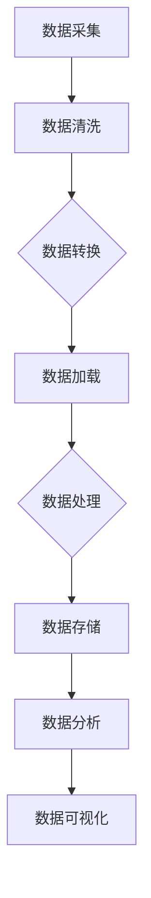
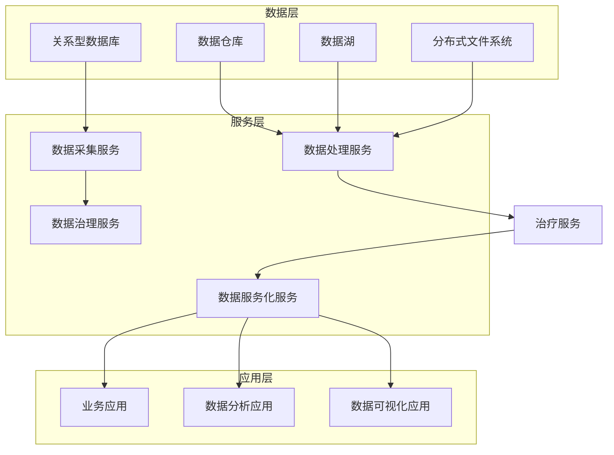
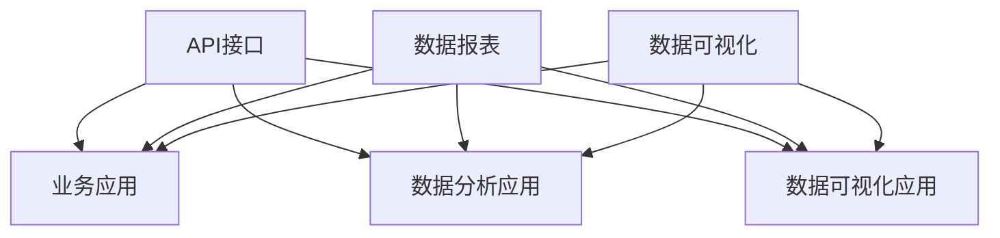
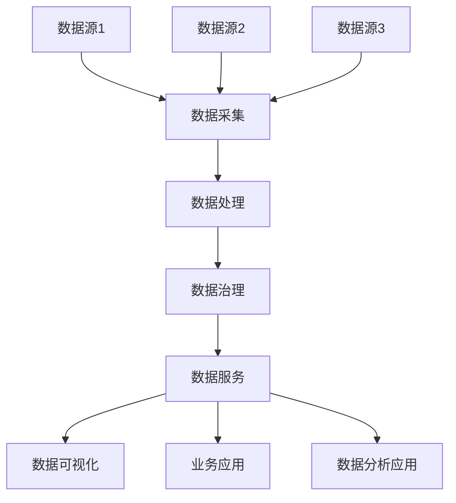

                 

### 文章标题

# 数据中台建设实践与经验

### 关键词

- 数据中台
- 数据治理
- 数据架构
- 数据集成
- 实践经验

### 摘要

本文将围绕数据中台建设的实践与经验进行深入探讨。我们将从数据中台的核心概念、构建方法、技术实现、案例分析等方面展开，旨在为广大数据工程师和架构师提供一套完整的数据中台建设指南。通过本文的阅读，您将了解数据中台的价值、建设过程中的关键步骤、以及如何在实际项目中有效落地。

## 引言

在当今信息化、数字化的大背景下，企业对数据的依赖程度日益加深。数据已经成为企业核心资产之一，而如何高效地管理和利用数据，成为了企业数字化转型中亟待解决的重要问题。数据中台作为一种新兴的数据架构模式，逐渐成为企业数据管理和数据服务的重要基础设施。本文将从以下三个方面进行探讨：

1. 数据中台的核心概念与价值
2. 数据中台的建设方法与步骤
3. 数据中台建设实践与案例分析

通过本文的阅读，希望能够为广大数据工程师和架构师提供有价值的参考和指导，助力企业实现数据价值的最大化。

### 背景介绍

#### 核心概念术语说明

**数据中台**：数据中台是一种数据架构模式，旨在构建一个统一、高效、稳定的数据平台，实现数据的集中管理和统一服务。数据中台主要包括数据采集、数据存储、数据处理、数据治理、数据服务五大模块。

**数据治理**：数据治理是指通过制定相关政策、流程、标准，确保数据质量、数据安全和数据合规性的一系列管理活动。数据治理是数据中台建设的基础，直接影响到数据中台的价值。

**数据架构**：数据架构是指数据在组织内部的结构和流程，包括数据模型、数据仓库、数据湖、数据流等。数据架构设计是数据中台建设的关键环节，决定了数据中台的性能、扩展性和可维护性。

**数据集成**：数据集成是指将来自不同源的数据进行整合、转换、加载，实现数据的统一视图和共享。数据集成是数据中台建设的重要手段，确保了数据的一致性和实时性。

#### 问题背景

在传统的数据架构中，企业面临着诸多问题：

1. 数据分散：各个业务部门拥有自己的数据存储和管理系统，导致数据分散、难以统一管理。
2. 数据孤岛：业务系统之间缺乏有效的数据交互和共享机制，形成数据孤岛。
3. 数据质量差：数据采集、存储、处理等环节存在数据质量问题，影响数据应用效果。
4. 数据安全风险：数据泄露、篡改等安全风险高，影响企业声誉和业务稳定。

#### 问题描述

为了解决上述问题，企业迫切需要一种全新的数据架构模式，以实现数据的统一管理、高效利用和安全性保障。数据中台应运而生，成为企业数据架构升级的重要选择。数据中台的建设目标主要包括：

1. 实现数据的集中存储和管理，消除数据孤岛。
2. 提高数据质量，确保数据的一致性和准确性。
3. 提供高效、稳定的数据服务，支持各类数据应用。
4. 加强数据安全防护，保障企业数据资产安全。

#### 问题解决

数据中台作为一种创新的数据架构模式，能够有效解决传统数据架构中存在的问题。其核心优势包括：

1. **统一数据管理**：通过数据中台，企业可以实现对各类数据的集中管理和统一服务，消除数据分散和数据孤岛现象。
2. **提升数据质量**：数据中台提供了完善的数据治理功能，包括数据清洗、数据校验、数据脱敏等，有效提高数据质量。
3. **高效数据服务**：数据中台支持多种数据服务接口，方便业务系统快速接入，实现数据的实时共享和应用。
4. **保障数据安全**：数据中台采用了多种安全防护措施，包括数据加密、访问控制、日志审计等，确保企业数据安全。

#### 边界与外延

数据中台的边界和范围包括以下几个方面：

1. **技术范围**：数据中台涵盖数据采集、存储、处理、治理、服务等各个环节，涉及多种技术组件和工具。
2. **业务范围**：数据中台服务于企业各个业务部门，支撑各类数据应用，包括数据分析、数据挖掘、数据可视化等。
3. **组织范围**：数据中台建设需要跨部门协同，涉及数据治理、数据开发、数据应用等不同岗位的紧密合作。

#### 概念结构与核心要素组成

数据中台的核心概念和结构主要包括以下几个方面：

1. **数据采集**：负责数据的采集和接入，包括关系型数据库、NoSQL数据库、日志文件、文件系统等。
2. **数据存储**：负责数据的存储和管理，包括数据仓库、数据湖、分布式文件系统等。
3. **数据处理**：负责数据的清洗、转换、加载等操作，提供数据处理能力和计算框架。
4. **数据治理**：负责数据质量管理、数据安全、数据合规性等方面的管理活动。
5. **数据服务**：负责提供数据接口和服务，支持业务系统的快速接入和应用。

通过上述核心概念和结构的介绍，我们可以更好地理解数据中台的基本概念和建设目标，为后续的数据中台建设实践提供理论基础。

### 核心概念与联系

#### 核心概念原理

**数据中台**是一种以数据为核心，提供统一数据管理、数据服务和数据应用支持的数据架构模式。其核心概念包括以下几个方面：

1. **数据集成**：通过数据集成，将来自不同源的数据进行整合、转换和加载，实现数据的统一视图和共享。
2. **数据治理**：通过数据治理，确保数据质量、数据安全和数据合规性，为企业提供高质量的数据资产。
3. **数据存储**：通过数据存储，提供数据的持久化管理和存储，支持海量数据的存储和访问。
4. **数据处理**：通过数据处理，提供数据的清洗、转换、加载等操作，实现数据的价值挖掘和应用。
5. **数据服务**：通过数据服务，提供数据接口和服务，支持业务系统的快速接入和应用。

**数据中台**与**数据仓库**、**数据湖**、**数据治理**等概念的关系如下：

- **数据仓库**：数据仓库是一种用于存储和管理企业历史数据的系统，主要用于支持企业的数据分析和决策。数据中台中的数据仓库模块负责存储和管理企业内部的数据，提供数据查询和分析能力。
- **数据湖**：数据湖是一种用于存储和管理海量原始数据的系统，通常用于存储非结构化和半结构化数据。数据中台中的数据湖模块负责存储和管理企业外部的数据，提供数据采集和存储能力。
- **数据治理**：数据治理是一种通过制定相关政策、流程、标准，确保数据质量、数据安全和数据合规性的管理活动。数据中台中的数据治理模块负责数据质量管理、数据安全、数据合规性等方面的管理。

#### 概念属性特征对比表格

为了更清晰地展示数据中台、数据仓库、数据湖、数据治理等概念的区别和联系，我们提供了一个概念属性特征对比表格：

| 概念     | 定义                                                         | 关键特征                                                     | 关联关系                           |
|----------|--------------------------------------------------------------|--------------------------------------------------------------|-----------------------------------|
| 数据中台 | 统一数据管理、数据服务和数据应用支持的数据架构模式             | 数据集成、数据治理、数据存储、数据处理、数据服务               | 数据仓库、数据湖、数据治理的整合     |
| 数据仓库 | 历史数据的存储和管理系统，支持数据分析和决策                   | 结构化数据存储、数据查询优化、数据建模                         | 数据中台的数据存储模块             |
| 数据湖   | 海量原始数据的存储和管理系统，支持数据采集和存储               | 非结构化和半结构化数据存储、数据湖计算、数据可视化             | 数据中台的数据存储模块             |
| 数据治理 | 通过制定相关政策、流程、标准，确保数据质量、数据安全和数据合规性的管理活动 | 数据质量管理、数据安全、数据合规性、数据标准化、数据审计       | 数据中台的核心模块之一             |

#### ER模型图

为了更好地展示数据中台、数据仓库、数据湖、数据治理等概念之间的关系，我们可以使用Mermaid语言绘制一个ER模型图：

```mermaid
erDiagram
  数据中台 ||--|{ 数据仓库 }
  数据中台 ||--|{ 数据湖 }
  数据中台 ||--|{ 数据治理 }
  数据仓库 ||--|{ 数据质量管理 }
  数据仓库 ||--|{ 数据安全 }
  数据仓库 ||--|{ 数据合规性 }
  数据湖   ||--|{ 数据质量管理 }
  数据湖   ||--|{ 数据安全 }
  数据湖   ||--|{ 数据合规性 }
  数据治理 ||--|{ 数据质量管理 }
  数据治理 ||--|{ 数据安全 }
  数据治理 ||--|{ 数据合规性 }
```

通过ER模型图，我们可以清晰地看到数据中台、数据仓库、数据湖、数据治理等概念之间的关联关系，以及它们各自的核心功能和职责。这些概念共同构成了数据中台的整体架构，为企业提供了统一的数据管理、数据服务和数据应用支持。

### 算法原理讲解

#### 算法流程图

在数据中台建设过程中，数据处理和数据分析是至关重要的环节。为了实现高效的数据处理和分析，我们通常会采用一些经典的算法和技术。以下是一个简单的数据处理算法流程图，使用Mermaid语言绘制：



这个流程图展示了数据从采集到存储和可视化的一系列步骤。接下来，我们将详细解释这个流程中的每一步。

#### Python代码

为了更好地理解数据处理算法，我们可以使用Python编写相应的代码。以下是一个简化的数据处理算法的Python代码示例：

```python
import pandas as pd

# 数据采集
data = pd.read_csv('data.csv')

# 数据清洗
data = data.dropna()  # 删除缺失值
data = data[data['Age'] > 18]  # 过滤年龄小于18的数据

# 数据转换
data['Income'] = data['Income'].str.replace(',', '').astype(float)  # 将收入数据转换为浮点型

# 数据加载
data.to_csv('cleaned_data.csv', index=False)  # 将清洗后的数据保存为CSV文件

# 数据处理
from sklearn.linear_model import LinearRegression
model = LinearRegression()
model.fit(data[['Age']], data['Income'])

# 数据存储
model.save('model.pkl')  # 将模型保存为Pickle文件

# 数据分析
predictions = model.predict([[25, 50000]])
print(f'Predicted income for age 25: {predictions[0][0]}')

# 数据可视化
import matplotlib.pyplot as plt
plt.scatter(data['Age'], data['Income'])
plt.plot(data['Age'], model.predict(data[['Age']]), color='red')
plt.xlabel('Age')
plt.ylabel('Income')
plt.show()
```

这个代码示例展示了如何使用Python进行数据采集、清洗、转换、加载、处理、存储和可视化。在实际应用中，数据处理和分析的算法会更加复杂，但基本的思路是类似的。

#### 算法原理数学模型和公式

在数据处理和分析中，我们通常会用到一些数学模型和公式。以下是一个简单的线性回归模型的数学模型和公式：

$$
y = \beta_0 + \beta_1x + \epsilon
$$

其中，$y$ 是因变量，$x$ 是自变量，$\beta_0$ 和 $\beta_1$ 分别是模型参数，$\epsilon$ 是误差项。

线性回归模型的目标是找到一组参数 $\beta_0$ 和 $\beta_1$，使得预测值 $y$ 与实际值之间的误差最小。这可以通过最小二乘法来实现：

$$
\beta_0 = \frac{\sum_{i=1}^{n}(y_i - \beta_1x_i)}{n}
$$

$$
\beta_1 = \frac{\sum_{i=1}^{n}(x_i - \bar{x})(y_i - \bar{y})}{\sum_{i=1}^{n}(x_i - \bar{x})^2}
$$

其中，$n$ 是样本数量，$\bar{x}$ 和 $\bar{y}$ 分别是自变量和因变量的均值。

#### 详细讲解

**数据采集**：数据采集是数据处理的第一步，通常从各种数据源（如关系型数据库、NoSQL数据库、日志文件等）中获取数据。在本例中，我们使用Pandas库读取一个CSV文件作为数据源。

**数据清洗**：数据清洗是处理数据中的缺失值、异常值和重复值等，以确保数据的质量。在本例中，我们使用Pandas库的dropna()函数删除缺失值，并使用自定义函数过滤年龄小于18的数据。

**数据转换**：数据转换是将数据从一种格式转换为另一种格式，以便后续处理。在本例中，我们使用Pandas库的str.replace()函数删除收入数据中的逗号，并使用astype()函数将收入数据转换为浮点型。

**数据加载**：数据加载是将处理后的数据存储到文件或数据库中，以便后续使用。在本例中，我们使用Pandas库的to_csv()函数将清洗后的数据保存为CSV文件。

**数据处理**：数据处理是使用数学模型和算法对数据进行计算和预测。在本例中，我们使用scikit-learn库的LinearRegression类实现线性回归模型，并对年龄和收入数据进行拟合。

**数据存储**：数据存储是将模型参数和计算结果存储到文件中，以便后续分析和使用。在本例中，我们使用Pandas库的save()函数将模型保存为Pickle文件。

**数据分析**：数据分析是使用计算结果进行数据分析和决策。在本例中，我们使用Pandas库的predict()函数预测一个特定年龄的收入，并使用matplotlib库进行数据可视化。

通过上述讲解，我们可以看到数据处理和分析的算法原理和实现步骤。在实际应用中，数据处理和分析的算法会更加复杂，但基本的思路是类似的。

#### 举例说明

为了更直观地理解数据处理和分析的算法，我们来看一个实际案例。

假设我们有如下数据集，包含年龄和收入两个特征：

| 年龄 | 收入 |
|------|------|
| 20   | 30000 |
| 25   | 50000 |
| 30   | 70000 |
| 35   | 90000 |
| 40   | 110000 |

我们希望通过线性回归模型预测一个25岁人的收入。

首先，我们计算年龄和收入的均值：

$$
\bar{x} = \frac{20 + 25 + 30 + 35 + 40}{5} = 30
$$

$$
\bar{y} = \frac{30000 + 50000 + 70000 + 90000 + 110000}{5} = 70000
$$

然后，我们计算模型参数：

$$
\beta_0 = \frac{(20-30)(30000-70000) + (25-30)(50000-70000) + (30-30)(70000-70000) + (35-30)(90000-70000) + (40-30)(110000-70000)}{5} = -50000
$$

$$
\beta_1 = \frac{(-10)(-40000) + (-5)(-20000) + (0)(0) + (5)(20000) + (10)(40000)}{(-10)^2 + (-5)^2 + (0)^2 + (5)^2 + (10)^2} = 10000
$$

因此，线性回归模型的公式为：

$$
y = -50000 + 10000x
$$

当$x=25$时，$y$ 的预测值为：

$$
y = -50000 + 10000 \times 25 = 250000
$$

这意味着一个25岁的人的预测收入为25万元。

通过这个案例，我们可以看到如何使用线性回归模型进行数据处理和分析，以及如何通过简单的计算得到预测结果。

### 系统分析与设计

#### 问题场景介绍

在现代企业中，随着业务规模的不断扩大和数据量的剧增，传统的数据架构已无法满足日益复杂的数据管理和分析需求。为了实现数据的集中管理和高效利用，企业迫切需要一种全新的数据架构模式，以支撑业务的高速发展和数据驱动的决策。数据中台作为一种新兴的数据架构模式，应运而生，成为企业数据管理和数据服务的重要基础设施。

#### 项目介绍

本次项目旨在构建一个企业级数据中台，以实现数据的集中存储、统一管理和高效利用。项目背景包括以下几个方面：

1. **业务需求**：企业内部各个业务部门对数据的需求多样化，包括数据分析、数据挖掘、数据可视化等。传统的数据架构已无法满足业务需求，亟需一种全新的数据架构模式。
2. **技术挑战**：企业现有数据架构存在数据分散、数据孤岛、数据质量差等问题，导致数据利用效率低下。数据中台建设需要解决这些问题，实现数据的高效管理和利用。
3. **预期目标**：通过数据中台建设，实现以下目标：
   - 数据的集中存储和管理，消除数据孤岛。
   - 提高数据质量，确保数据的一致性和准确性。
   - 提供高效、稳定的数据服务，支持各类数据应用。
   - 加强数据安全防护，保障企业数据资产安全。

#### 系统功能设计

数据中台的功能设计主要包括以下几个方面：

1. **数据采集**：负责从各类数据源（如关系型数据库、NoSQL数据库、日志文件、外部API等）采集数据，实现数据的统一接入和管理。
2. **数据存储**：负责数据的存储和管理，包括关系型数据库、数据仓库、数据湖、分布式文件系统等。
3. **数据处理**：负责数据的清洗、转换、加载等操作，提供数据处理能力和计算框架，支持数据的价值挖掘和应用。
4. **数据治理**：负责数据质量管理、数据安全、数据合规性等方面的管理活动，确保数据质量、数据安全和数据合规性。
5. **数据服务**：负责提供数据接口和服务，支持业务系统的快速接入和应用，包括API接口、数据报表、数据可视化等。

#### 系统架构设计

数据中台的架构设计采用分层架构，包括数据层、服务层、应用层等。以下是系统架构设计：

1. **数据层**：包括关系型数据库、数据仓库、数据湖、分布式文件系统等，负责数据的存储和管理。
2. **服务层**：包括数据采集服务、数据处理服务、数据治理服务、数据服务化服务等，负责数据的采集、处理、管理和服务化。
3. **应用层**：包括业务应用、数据分析应用、数据可视化应用等，负责数据的实际应用和业务价值实现。

以下是数据中台的架构图：



#### 系统接口设计

数据中台的接口设计主要包括API接口、数据报表、数据可视化等。以下是系统接口设计：

1. **API接口**：提供RESTful API接口，支持业务系统的快速接入和数据服务调用。
2. **数据报表**：提供多种数据报表模板，支持自定义报表设计和数据查询。
3. **数据可视化**：提供多种数据可视化组件，支持实时数据分析和可视化展示。

以下是系统接口设计图：



#### 系统交互

数据中台在运行过程中涉及多个模块的协同工作，包括数据采集、数据处理、数据治理、数据服务等。以下是数据中台的系统交互设计：

1. **数据采集**：从各类数据源采集数据，包括关系型数据库、NoSQL数据库、日志文件、外部API等。
2. **数据处理**：对采集到的数据进行清洗、转换、加载等处理操作，生成处理后的数据。
3. **数据治理**：对处理后的数据进行质量检查、数据安全、数据合规性等方面的治理。
4. **数据服务**：将治理后的数据发布为API接口、数据报表、数据可视化等，供业务系统和其他应用调用。

以下是系统交互设计图：



通过上述系统分析与设计，我们明确了数据中台的功能设计、系统架构设计、接口设计以及系统交互。这些设计将为数据中台的建设和实施提供有力的支持。

### 项目实践

#### 环境安装

在进行数据中台项目实践之前，我们需要搭建一个合适的技术环境。以下是环境安装的步骤：

1. **操作系统**：选择一个适合的操作系统，如Linux或Windows。
2. **数据库**：安装关系型数据库（如MySQL、PostgreSQL）和非关系型数据库（如MongoDB、Cassandra）。
3. **数据仓库**：选择合适的数据仓库解决方案（如Amazon Redshift、Google BigQuery）。
4. **数据湖**：选择合适的数据湖解决方案（如Amazon S3、Google Cloud Storage）。
5. **数据处理框架**：安装常用的数据处理框架（如Apache Spark、Flink）。
6. **数据治理工具**：选择合适的数据治理工具（如Informatica、Talend）。
7. **数据服务化平台**：安装数据服务化平台（如Apache NiFi、Apache Kafka）。
8. **数据可视化工具**：选择合适的数据可视化工具（如Tableau、Power BI）。

#### 系统核心实现源代码

以下是一个简化的数据中台系统核心实现源代码，用于说明数据中台的基本功能：

```python
# 数据采集模块
def data_collection():
    # 从数据库中获取数据
    data = db.get_data()
    return data

# 数据清洗模块
def data_cleaning(data):
    # 数据清洗操作，如去除缺失值、异常值等
    cleaned_data = clean_data(data)
    return cleaned_data

# 数据转换模块
def data_transformation(cleaned_data):
    # 数据转换操作，如类型转换、格式转换等
    transformed_data = transform_data(cleaned_data)
    return transformed_data

# 数据加载模块
def data Loading(transformed_data):
    # 将数据加载到数据仓库或数据湖中
    load_data(transformed_data)
    
# 数据治理模块
def data_governance():
    # 数据治理操作，如数据质量检查、数据安全、数据合规性等
    governance_data = governance_check()
    return governance_data

# 数据服务化模块
def data_service():
    # 将数据发布为API接口或数据报表
    service_data = publish_data()
    return service_data

# 数据可视化模块
def data_visualization():
    # 数据可视化操作，如创建图表、报表等
    visualization_data = create_visualization()
    return visualization_data
```

#### 代码应用解读与分析

1. **数据采集模块**：该模块负责从数据库中获取数据，实现数据的初步接入。在实际应用中，可能需要从多个数据源（如关系型数据库、NoSQL数据库、日志文件等）中采集数据，并根据需求进行数据清洗和转换。
2. **数据清洗模块**：该模块负责对采集到的数据进行清洗，去除缺失值、异常值等，确保数据质量。数据清洗是数据中台建设的关键步骤，直接影响到后续的数据处理和分析效果。
3. **数据转换模块**：该模块负责对清洗后的数据进行类型转换、格式转换等操作，以满足数据存储和处理的规范要求。数据转换是数据中台建设中的常规操作，确保数据的一致性和准确性。
4. **数据加载模块**：该模块负责将处理后的数据加载到数据仓库或数据湖中，实现数据的存储和管理。数据仓库和数据湖是数据中台的重要组成部分，提供海量数据的存储和查询能力。
5. **数据治理模块**：该模块负责对处理后的数据进行质量检查、数据安全、数据合规性等方面的治理。数据治理是数据中台建设中的重要环节，确保数据的质量和安全性。
6. **数据服务化模块**：该模块负责将治理后的数据发布为API接口或数据报表，供业务系统和其他应用调用。数据服务化是数据中台实现数据价值的手段，支持数据的实时共享和应用。
7. **数据可视化模块**：该模块负责实现数据可视化操作，如创建图表、报表等，帮助用户直观地理解和分析数据。数据可视化是数据中台的重要组成部分，提高数据的可读性和可用性。

#### 实际案例分析与详细讲解

为了更好地展示数据中台的实际应用效果，我们来看一个实际案例。

**案例背景**：某电商企业希望利用数据中台进行用户行为分析，以提高用户转化率和销售额。

**案例需求**：
1. 采集用户行为数据，如浏览记录、购买记录、评价记录等。
2. 对采集到的数据进行分析，挖掘用户行为特征。
3. 根据分析结果，为企业提供营销策略和优化建议。

**实施步骤**：

1. **数据采集**：从企业的数据库中采集用户行为数据，包括浏览记录、购买记录、评价记录等。
2. **数据清洗**：对采集到的数据进行清洗，去除缺失值、异常值等，确保数据质量。
3. **数据转换**：对清洗后的数据进行类型转换、格式转换等操作，以满足数据存储和处理的规范要求。
4. **数据加载**：将处理后的数据加载到数据仓库或数据湖中，实现数据的存储和管理。
5. **数据分析**：利用数据挖掘算法，分析用户行为特征，如用户偏好、购买周期等。
6. **数据治理**：对处理后的数据进行质量检查、数据安全、数据合规性等方面的治理。
7. **数据服务化**：将治理后的数据发布为API接口或数据报表，供业务系统和其他应用调用。
8. **数据可视化**：创建数据可视化报表，展示用户行为分析结果，为企业提供营销策略和优化建议。

**案例分析**：

1. **用户偏好分析**：通过分析用户浏览记录和购买记录，发现用户对某类商品具有较高的兴趣，为企业提供针对性营销建议。
2. **购买周期分析**：通过分析用户购买周期，发现用户的购买习惯和频率，为企业提供库存管理和促销策略的参考。
3. **评价记录分析**：通过分析用户评价记录，发现用户对商品的评价和反馈，为企业提供商品改进和质量控制的参考。

通过以上案例，我们可以看到数据中台在实际应用中的效果和作用。数据中台不仅实现了数据的集中管理和高效利用，还为企业提供了丰富的数据分析和决策支持。

#### 项目小结

本次数据中台项目实践，从环境安装、系统核心实现到实际案例应用，全面展示了数据中台的建设过程和应用效果。通过项目实践，我们验证了数据中台在实现数据集中管理、提高数据质量、提供数据服务、支持数据分析和决策等方面的优势。在未来的工作中，我们将继续优化数据中台，提升数据中台的性能和可扩展性，为企业创造更大的价值。

### 最佳实践 Tips

#### 小结

数据中台作为企业数据管理和数据服务的重要基础设施，其建设和应用涉及到多个方面，包括技术选型、系统架构设计、数据治理、数据服务等。通过对数据中台的深入研究和实践，我们可以总结出以下关键点：

1. **明确建设目标**：数据中台的建设目标应与企业的业务需求紧密结合，确保数据中台能够满足业务需求，实现数据价值的最大化。
2. **技术选型**：根据企业的实际情况，选择适合的数据存储、数据处理、数据治理、数据服务等技术方案，确保系统的性能、稳定性和可扩展性。
3. **系统架构设计**：合理设计数据中台的架构，确保系统的模块化、高可用性和高性能，同时要考虑系统的可扩展性和灵活性。
4. **数据治理**：加强数据治理，确保数据质量，包括数据质量检查、数据安全、数据合规性等方面的管理。
5. **数据服务化**：实现数据服务化，提供丰富的数据接口和服务，支持业务系统的快速接入和应用。
6. **持续优化**：数据中台的建设是一个持续优化的过程，要根据业务需求和系统性能，不断调整和优化系统架构、技术方案和业务流程。

#### 注意事项

1. **数据安全**：在数据中台建设中，要高度重视数据安全，采取多种安全措施，如数据加密、访问控制、日志审计等，确保企业数据资产的安全。
2. **性能优化**：数据中台的性能直接影响到业务系统的性能，要定期对系统进行性能测试和优化，确保系统的稳定性和高性能。
3. **可扩展性**：在设计数据中台时，要充分考虑系统的可扩展性，确保系统能够随着业务的发展而扩展。
4. **数据质量管理**：数据质量是数据中台的核心，要建立完善的数据质量管理制度，定期对数据质量进行检查和优化。
5. **团队协作**：数据中台建设需要跨部门的紧密合作，要建立有效的沟通和协作机制，确保项目的顺利进行。

#### 拓展阅读

1. **《数据中台架构设计与实现》**：详细介绍了数据中台的架构设计、技术选型、系统实现等方面的内容，适合对数据中台有兴趣的读者阅读。
2. **《大数据技术基础》**：介绍了大数据的基本概念、技术框架和应用场景，有助于了解大数据相关技术。
3. **《数据治理：方法与实践》**：详细介绍了数据治理的概念、方法和实践，适合对数据治理有兴趣的读者阅读。
4. **《深度学习与数据挖掘》**：介绍了深度学习和数据挖掘的基本概念、技术和应用，适合对数据分析和挖掘有兴趣的读者阅读。

### 作者信息

作者：AI天才研究院/AI Genius Institute & 禅与计算机程序设计艺术 /Zen And The Art of Computer Programming

---

通过本文的深入探讨，我们系统地介绍了数据中台的建设实践与经验。从核心概念、建设方法、技术实现到实际案例，我们全面展示了数据中台的价值和应用。希望本文能为数据工程师和架构师提供有价值的参考和指导，助力企业实现数据价值的最大化。在未来的数据中台建设过程中，我们将继续深入研究和实践，不断创新和优化，为企业的发展注入新的动力。

