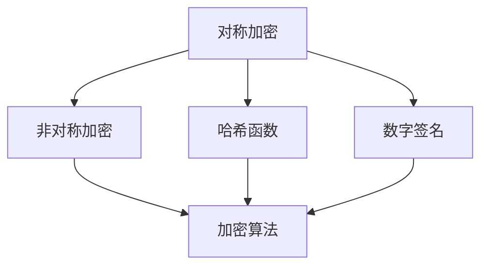
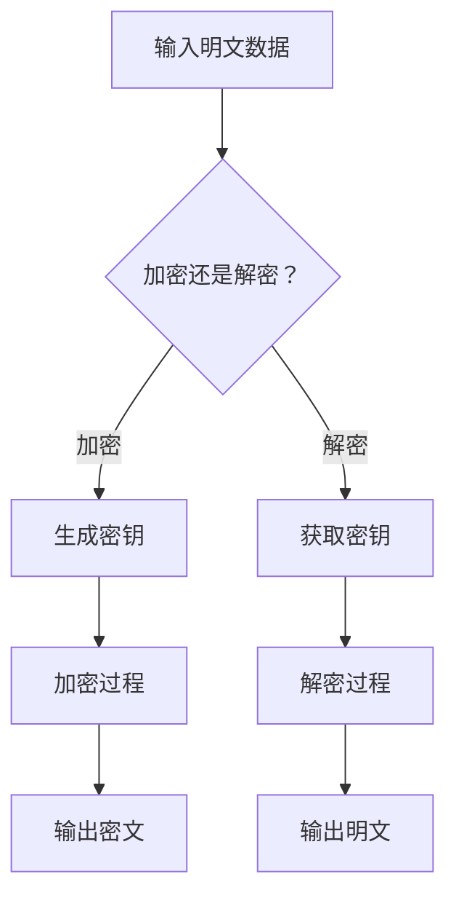
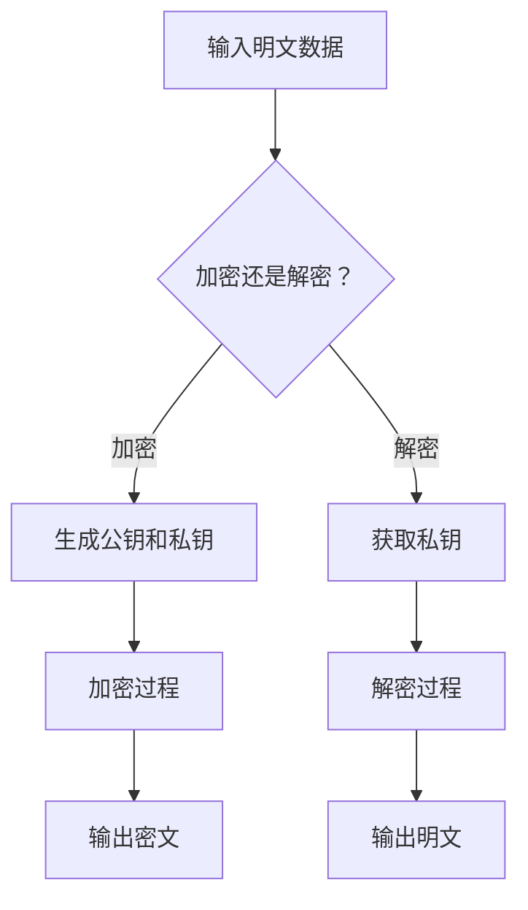
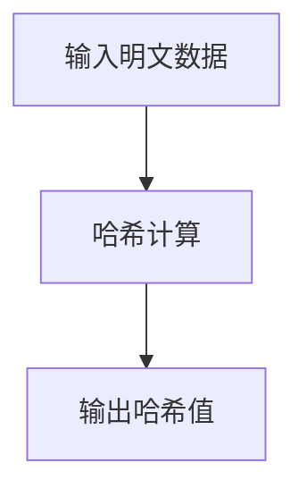
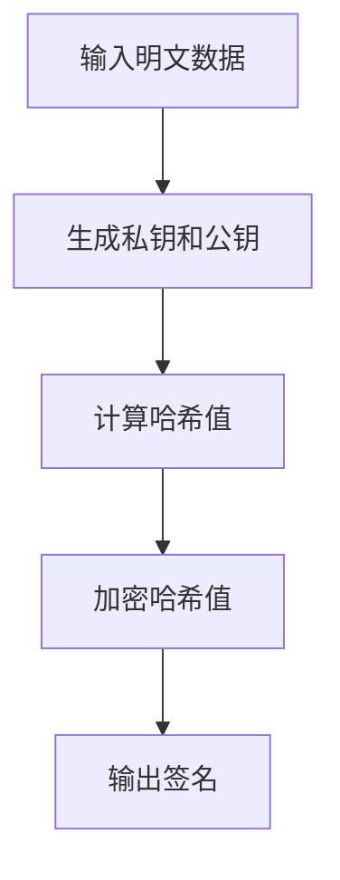
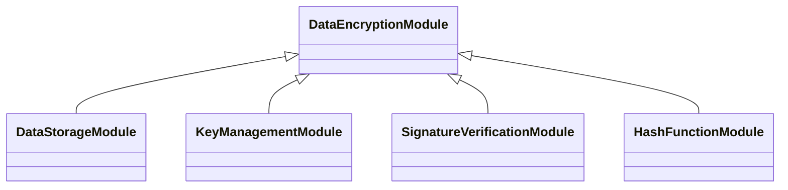
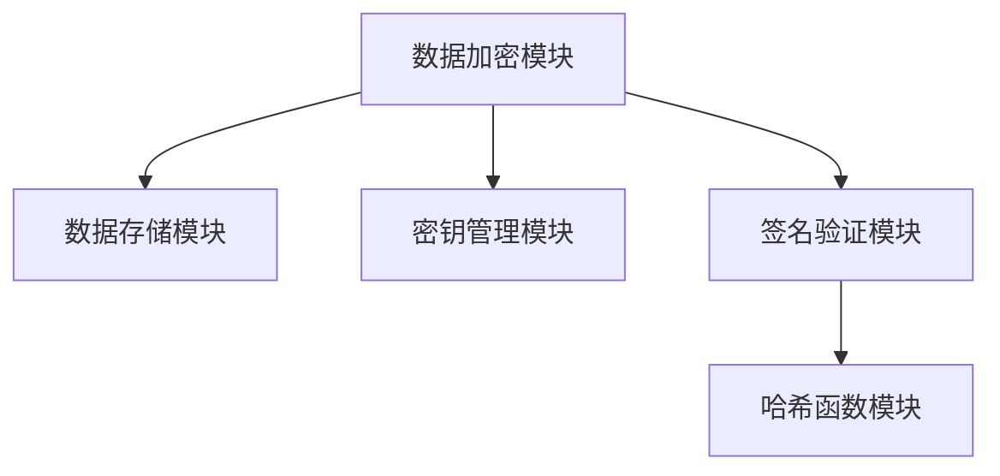
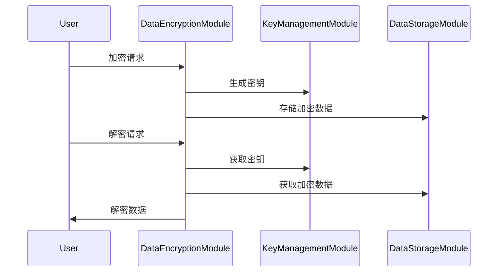

                 


### 数据加密存储方案设计

> 关键词：数据加密、存储方案、加密算法、系统架构、项目实战

> 摘要：本文详细探讨了数据加密存储方案的设计，包括加密存储的需求、发展历程、重要性，以及核心加密算法的原理和系统架构设计。通过实际项目分析，为读者提供了一种实用的数据加密存储解决方案。

## 第一部分：数据加密存储概述

### 第1章：数据加密存储的背景与需求

在现代信息社会中，数据已成为企业和个人最为重要的资产。然而，随着数据量的爆炸性增长，数据泄露和窃取事件也屡见不鲜。为了保护数据的安全，数据加密存储应运而生。

#### 1.1 加密存储的需求

加密存储的需求主要源于以下几个方面：

- **保护隐私**：企业需要保护其内部数据不被未经授权的访问。
- **法律法规要求**：许多国家和地区都制定了数据保护法规，要求企业对存储的数据进行加密。
- **业务连续性**：加密存储可以提高数据的安全性，从而确保业务的连续性。

#### 1.2 数据加密存储的发展历程

数据加密存储的发展历程可以追溯到20世纪70年代。当时，随着计算机技术的发展，数据安全成为了一个重要问题。早期的加密算法如DES（数据加密标准）逐渐被开发出来，并被广泛应用。

随着计算能力的提升和网络技术的进步，加密算法也在不断演进。目前，常用的加密算法包括对称加密、非对称加密和哈希函数等。

#### 1.3 数据加密存储的重要性

数据加密存储的重要性体现在以下几个方面：

- **防止数据泄露**：加密存储可以有效地防止数据在传输和存储过程中被窃取。
- **确保数据完整性**：加密存储可以确保数据在存储和传输过程中未被篡改。
- **增强数据可用性**：通过加密存储，企业可以确保数据在遭受攻击时仍然可以恢复。

## 第二部分：数据加密存储的核心概念与联系

### 第2章：数据加密存储的核心概念

数据加密存储涉及多个核心概念，包括对称加密、非对称加密、哈希函数和数字签名。以下是对这些概念的定义、属性和特点的介绍。

#### 2.1 对称加密

对称加密是一种加密方法，使用相同的密钥对数据进行加密和解密。其特点是速度快、计算成本低，但密钥管理复杂。

| 对称加密属性 | 特点 |
| :--- | :--- |
| 加密速度快 | 适合大规模数据加密 |
| 密钥管理复杂 | 需要安全的密钥分发机制 |

#### 2.2 非对称加密

非对称加密使用一对密钥（公钥和私钥）进行加密和解密。其特点是安全性高、密钥管理简单，但计算成本高。

| 非对称加密属性 | 特点 |
| :--- | :--- |
| 安全性高 | 适合对敏感数据进行加密 |
| 密钥管理简单 | 公钥可以公开，私钥保密 |

#### 2.3 哈希函数

哈希函数是一种将输入数据转换成固定长度输出数据的算法。其特点是速度快、计算成本低，且具有抗碰撞性。

| 哈希函数属性 | 特点 |
| :--- | :--- |
| 抗碰撞性 | 保证不同输入产生不同输出 |
| 速度较快 | 适合对大量数据进行快速处理 |

#### 2.4 数字签名

数字签名是一种利用公钥加密技术对数据进行的签名，以验证数据完整性和身份。其特点是安全、可靠，但计算成本较高。

| 数字签名属性 | 特点 |
| :--- | :--- |
| 安全性高 | 保证数据的完整性和真实性 |
| 计算成本高 | 适合对少量数据进行签名 |

### 2.5 核心概念联系

下面使用Mermaid流程图展示数据加密存储中各个核心概念之间的关系。



## 第三部分：数据加密存储算法原理讲解

### 第3章：对称加密算法原理讲解

#### 3.1 对称加密算法的Mermaid流程图

下面是对称加密算法的Mermaid流程图。



#### 3.2 Python代码实现对称加密算法

以下是一个简单的Python代码实现对称加密算法。

```python
from Crypto.Cipher import AES
from Crypto.Util.Padding import pad, unpad
from Crypto.Random import get_random_bytes

# 生成密钥
key = get_random_bytes(16)

# 加密
cipher = AES.new(key, AES.MODE_CBC)
ct_bytes = cipher.encrypt(pad(b"hello world", AES.block_size))
iv = cipher.iv

# 解密
cipher = AES.new(key, AES.MODE_CBC, iv)
pt = unpad(cipher.decrypt(ct_bytes), AES.block_size)

print(f"密文: {ct_bytes.hex()}")
print(f"明文: {pt.hex()}")
```

#### 3.3 对称加密算法的数学模型和公式

对称加密的数学模型可以用以下公式表示：

$$
c = E_k(p)
$$

其中，\( c \) 表示密文，\( p \) 表示明文，\( k \) 表示密钥，\( E_k \) 表示加密函数。

解密过程可以表示为：

$$
p = D_k(c)
$$

其中，\( D_k \) 表示解密函数。

## 第4章：非对称加密算法原理讲解

#### 4.1 非对称加密算法的Mermaid流程图

下面是非对称加密算法的Mermaid流程图。



#### 4.2 Python代码实现非对称加密算法

以下是一个简单的Python代码实现非对称加密算法。

```python
from Crypto.PublicKey import RSA
from Crypto.Cipher import PKCS1_OAEP

# 生成公钥和私钥
key = RSA.generate(2048)
private_key = key.export_key()
public_key = key.publickey().export_key()

# 加密
cipher = PKCS1_OAEP.new(RSA.import_key(public_key))
ct = cipher.encrypt(b"hello world")

# 解密
cipher = PKCS1_OAEP.new(RSA.import_key(private_key))
pt = cipher.decrypt(ct)

print(f"密文: {ct.hex()}")
print(f"明文: {pt.hex()}")
```

#### 4.3 非对称加密算法的数学模型和公式

非对称加密的数学模型可以用以下公式表示：

$$
c = E_k(p)
$$

其中，\( c \) 表示密文，\( p \) 表示明文，\( k \) 表示密钥，\( E_k \) 表示加密函数。

解密过程可以表示为：

$$
p = D_k(c)
$$

其中，\( D_k \) 表示解密函数。

## 第5章：哈希函数原理讲解

#### 5.1 哈希函数的Mermaid流程图

下面是哈希函数的Mermaid流程图。



#### 5.2 Python代码实现哈希函数

以下是一个简单的Python代码实现哈希函数。

```python
import hashlib

# 计算哈希值
hash_object = hashlib.sha256(b"hello world")
hex_dig = hash_object.hexdigest()

print(f"哈希值: {hex_dig}")
```

#### 5.3 哈希函数的数学模型和公式

哈希函数的数学模型可以用以下公式表示：

$$
h(p) = H(p)
$$

其中，\( h \) 表示哈希函数，\( p \) 表示明文，\( H \) 表示哈希算法。

## 第6章：数字签名原理讲解

#### 6.1 数字签名的Mermaid流程图

下面是数字签名的Mermaid流程图。



#### 6.2 Python代码实现数字签名

以下是一个简单的Python代码实现数字签名。

```python
from Crypto.PublicKey import RSA
from Crypto.Signature import pkcs1_15
from Crypto.Hash import SHA256

# 生成公钥和私钥
key = RSA.generate(2048)
private_key = key.export_key()
public_key = key.publickey().export_key()

# 计算哈希值
hash_object = SHA256.new(b"hello world")
hash_value = hash_object.digest()

# 签名
signature = pkcs1_15.new(key).sign(hash_value)

# 验证签名
pkcs1_15.new(RSA.import_key(public_key)).verify(hash_value, signature)

print(f"签名: {signature.hex()}")
```

#### 6.3 数字签名的数学模型和公式

数字签名的数学模型可以用以下公式表示：

$$
s = S_k(h(p))
$$

其中，\( s \) 表示签名，\( p \) 表示明文，\( h \) 表示哈希函数，\( k \) 表示密钥，\( S_k \) 表示签名函数。

验证签名的过程可以表示为：

$$
v = V_k(s, h(p))
$$

其中，\( v \) 表示验证结果，\( S_k \) 表示验证函数。

## 第三部分：数据加密存储系统设计与实战

### 第7章：数据加密存储系统分析

#### 7.1 问题场景介绍

假设我们有一个企业应用，需要存储大量的敏感数据。为了确保数据的安全，我们决定采用数据加密存储方案。

#### 7.2 系统功能设计

系统功能设计包括以下模块：

- **数据加密模块**：负责对存储的数据进行加密和解密。
- **数据存储模块**：负责存储加密后的数据。
- **密钥管理模块**：负责生成、存储和管理密钥。
- **签名验证模块**：负责对数据进行数字签名和验证。

以下是一个领域模型Mermaid类图。



#### 7.3 系统架构设计

系统架构设计如下：

- **数据加密模块**：使用对称加密算法对数据进行加密。
- **数据存储模块**：将加密后的数据存储到数据库中。
- **密钥管理模块**：生成密钥，并使用非对称加密算法进行密钥保护。
- **签名验证模块**：使用数字签名对数据进行签名和验证。

以下是一个系统架构Mermaid图。



#### 7.4 系统接口设计

系统接口设计如下：

- **加密接口**：提供加密和解密接口。
- **存储接口**：提供数据存储接口。
- **密钥接口**：提供密钥生成和管理接口。
- **签名接口**：提供签名和验证接口。

#### 7.5 系统交互

系统交互如下：

1. 用户请求加密数据。
2. 数据加密模块生成密钥，并使用对称加密算法对数据进行加密。
3. 数据加密模块使用非对称加密算法对密钥进行加密，并存储到密钥管理模块。
4. 数据加密模块将加密后的数据存储到数据存储模块。
5. 用户请求解密数据。
6. 数据加密模块从密钥管理模块获取密钥，并使用对称加密算法对数据进行解密。
7. 数据加密模块返回解密后的数据。

以下是一个系统交互Mermaid序列图。



### 第8章：数据加密存储项目实战

#### 8.1 环境安装

在开始项目实战之前，我们需要安装以下环境：

- Python 3.8+
- pip
- CryptoPy库

安装CryptoPy库的命令如下：

```bash
pip install pycryptodome
```

#### 8.2 系统核心实现

以下是一个简单的数据加密存储系统的核心实现。

```python
from Crypto.PublicKey import RSA
from Crypto.Cipher import AES, PKCS1_OAEP
from Crypto.Hash import SHA256
from Crypto.Random import get_random_bytes
from Crypto.Util.Padding import pad, unpad
import hashlib

# 生成公钥和私钥
def generate_keys():
    key = RSA.generate(2048)
    private_key = key.export_key()
    public_key = key.publickey().export_key()
    return private_key, public_key

# 对数据进行加密
def encrypt_data(public_key, data):
    cipher = AES.new(get_random_bytes(16), AES.MODE_CBC)
    ct = cipher.encrypt(pad(data.encode('utf-8'), AES.block_size))
    iv = cipher.iv
    encrypted_key = PKCS1_OAEP.new(RSA.import_key(public_key)).encrypt(cipher.key)
    return iv, encrypted_key, ct

# 对数据进行解密
def decrypt_data(private_key, iv, encrypted_key, ct):
    key = PKCS1_OAEP.new(RSA.import_key(private_key)).decrypt(encrypted_key)
    cipher = AES.new(key, AES.MODE_CBC, iv)
    pt = unpad(cipher.decrypt(ct), AES.block_size)
    return pt.decode('utf-8')

# 计算哈希值
def compute_hash(data):
    return hashlib.sha256(data.encode('utf-8')).hexdigest()

# 生成签名
def generate_signature(private_key, data):
    hash_value = SHA256.new(data.encode('utf-8'))
    signature = PKCS1_15.new(RSA.import_key(private_key)).sign(hash_value)
    return signature

# 验证签名
def verify_signature(public_key, signature, data):
    hash_value = SHA256.new(data.encode('utf-8'))
    try:
        PKCS1_15.new(RSA.import_key(public_key)).verify(hash_value, signature)
        return True
    except (ValueError, TypeError):
        return False
```

#### 8.3 代码应用解读与分析

以下是对代码的解读和分析。

1. **生成公钥和私钥**：`generate_keys()` 函数使用RSA算法生成公钥和私钥。RSA算法是一种非对称加密算法，具有较好的安全性。

2. **对数据进行加密**：`encrypt_data()` 函数使用AES对称加密算法对数据进行加密。首先生成一个随机密钥，然后使用AES算法对数据进行加密。加密后的数据（密文）和初始化向量（IV）一起返回。密钥使用公钥加密，以提高安全性。

3. **对数据进行解密**：`decrypt_data()` 函数使用私钥对加密数据进行解密。首先使用私钥解密密文，然后使用AES算法解密明文。

4. **计算哈希值**：`compute_hash()` 函数使用SHA256算法对数据进行哈希处理。哈希值可用于验证数据的完整性和一致性。

5. **生成签名**：`generate_signature()` 函数使用RSA算法生成数字签名。签名是使用私钥对数据的哈希值进行加密的结果。

6. **验证签名**：`verify_signature()` 函数使用公钥验证数字签名。如果签名验证成功，说明数据在传输过程中未被篡改。

#### 8.4 实际案例分析与详细讲解

以下是一个简单的实际案例，演示了如何使用数据加密存储系统。

1. **生成密钥**：

```python
private_key, public_key = generate_keys()
```

2. **加密数据**：

```python
data = "Hello, World!"
iv, encrypted_key, ct = encrypt_data(public_key, data)
```

3. **存储加密数据**：

```python
# 将 iv、encrypted_key 和 ct 存储到数据库或其他存储介质
```

4. **解密数据**：

```python
# 从数据库或其他存储介质获取 iv、encrypted_key 和 ct
pt = decrypt_data(private_key, iv, encrypted_key, ct)
print(f"解密后的数据：{pt}")
```

5. **计算哈希值**：

```python
hash_value = compute_hash(data)
```

6. **生成签名**：

```python
signature = generate_signature(private_key, hash_value)
```

7. **验证签名**：

```python
is_valid = verify_signature(public_key, signature, hash_value)
print(f"签名验证结果：{is_valid}")
```

#### 8.5 项目小结

通过本次项目实战，我们了解了如何使用Python实现数据加密存储系统。系统包括生成密钥、加密数据、解密数据、计算哈希值和生成签名等功能。在实际应用中，我们可以根据具体需求调整系统架构和功能。

### 第9章：数据加密存储最佳实践

#### 9.1 加密存储最佳实践

1. **使用强加密算法**：选择安全性能高的加密算法，如AES和RSA。
2. **密钥管理**：确保密钥的安全存储和管理，避免密钥泄露。
3. **数据完整性校验**：使用哈希函数对数据进行完整性校验，确保数据未被篡改。
4. **数字签名**：使用数字签名验证数据来源和完整性，提高数据安全性。

#### 9.2 注意事项

1. **加密算法的选择**：根据具体需求选择合适的加密算法。
2. **密钥的强度**：生成足够强度的密钥，避免被破解。
3. **数据存储的安全性**：确保加密数据存储的安全，防止数据泄露。

#### 9.3 小结

数据加密存储是保护数据安全的重要手段。通过了解核心加密算法、系统架构设计和实际项目实现，我们可以设计出高效、安全的数据加密存储方案。

#### 9.4 拓展阅读

- [《网络安全防护实践》](https://example.com/security-practice)
- [《密码学基础》](https://example.com/crypto-basics)
- [《Python加密库CryptoPy文档》](https://example.com/cryptopy-documentation)

### 总结

本文详细探讨了数据加密存储方案的设计，包括核心概念、加密算法原理、系统架构设计和项目实战。通过实际项目分析，为读者提供了一种实用的数据加密存储解决方案。希望本文能对读者在数据安全领域的研究和实践有所帮助。

### 作者

作者：AI天才研究院/AI Genius Institute & 禅与计算机程序设计艺术 /Zen And The Art of Computer Programming

