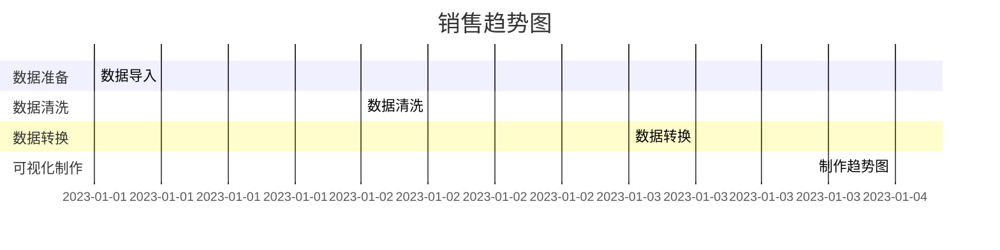

                 


# 数据可视化技术与工具选择

## 关键词：
数据可视化，数据工具，可视化工具，数据展示，信息可视化，数据分析，图表工具，数据仪表板，可视化效果优化，数据处理技术

## 摘要：
本文将深入探讨数据可视化技术在现代数据分析中的应用，以及如何根据具体需求选择合适的可视化工具。我们将从数据可视化的基本概念入手，逐步分析其原理和核心要素，然后介绍常用的数据可视化工具及其特点，最后通过实际案例展示数据可视化的应用和实践方法。

## 引言

### 数据可视化的定义与作用

数据可视化是一种将复杂的数据通过图形、图表、图像等方式进行转换和展示的技术。它不仅能够帮助我们直观地理解数据，还能揭示数据之间的关系和趋势，从而为决策提供有力的支持。在当今信息爆炸的时代，数据可视化的作用愈发显著：

1. **数据解读**：通过图形化展示，复杂的数据变得更加易于理解和解读。
2. **决策支持**：帮助企业或个人从海量数据中提取关键信息，为决策提供数据支持。
3. **沟通与交流**：通过视觉化的方式，更容易将分析结果传达给非技术背景的受众。

### 数据可视化技术的发展历程

数据可视化的发展历程可以追溯到20世纪中叶。最早的数据可视化技术主要基于简单的二维图表，如柱状图、折线图等。随着计算机技术的发展，数据可视化技术逐渐成熟，三维可视化、交互式可视化等先进技术也应运而生。近年来，随着大数据和人工智能的兴起，数据可视化技术迎来了新的发展机遇。

### 数据可视化在数据分析中的重要性

在数据分析过程中，数据可视化是不可或缺的一环。它不仅能够提高数据分析的效率，还能够使数据分析的结果更加直观、易懂。具体来说，数据可视化的重要性体现在以下几个方面：

1. **揭示数据关系**：通过图表，可以直观地发现数据之间的相关性、趋势和异常值。
2. **辅助决策制定**：基于可视化分析的结果，可以更快速地制定有效的决策方案。
3. **增强报告效果**：在数据分析报告中加入可视化图表，可以使报告内容更加生动、易于接受。

## 第一部分：数据可视化原理

### 数据可视化核心概念

#### 数据类型与可视化类型

数据类型决定了可视化类型的选择。常见的数据类型包括：

1. **数值型数据**：适合使用柱状图、折线图、饼图等。
2. **分类数据**：适合使用条形图、散点图、气泡图等。
3. **时间序列数据**：适合使用折线图、K线图等。

不同类型的数据需要不同的可视化方式，选择合适的可视化类型对于传达数据信息至关重要。

#### 设计原则

1. **简洁性**：图表应保持简洁，避免冗余元素。
2. **易读性**：图表的元素应清晰明确，标签、颜色、字体等要易于理解。
3. **一致性**：图表的样式、颜色、布局应保持一致性，以便受众更容易理解和比较数据。

### 数据可视化设计原则

1. **数据优先原则**：图表的设计应以展示数据为首要任务。
2. **用户导向原则**：设计应考虑目标受众的需求和习惯。
3. **故事性原则**：图表应具有故事性，帮助用户更好地理解数据背后的含义。

## 第二部分：数据可视化工具

### 常见数据可视化工具概述

#### Tableau

Tableau 是一款强大的数据可视化工具，支持多种数据源，具有丰富的图表类型和交互功能。

#### Power BI

Power BI 是微软推出的数据可视化工具，与Microsoft Office高度集成，适合企业内部使用。

#### D3.js

D3.js 是一个基于JavaScript的可视化库，具有高度的灵活性和定制性，适合开发复杂的交互式可视化应用。

#### Matplotlib

Matplotlib 是Python中的一个可视化库，适合用于生成静态图表。

#### 数据可视化工具选择

在选择数据可视化工具时，需要考虑以下因素：

1. **数据源**：工具是否支持所需的数据源。
2. **图表类型**：工具提供的图表类型是否满足需求。
3. **交互性**：工具是否支持交互功能，如筛选、过滤等。
4. **学习成本**：工具的使用是否容易上手。

## 第三部分：数据可视化技术应用

### 数据可视化应用场景

1. **市场分析**：通过数据可视化，可以直观地了解市场趋势、客户行为等。
2. **风险管理**：通过可视化分析，可以识别潜在风险，制定风险管理策略。
3. **运营监控**：通过实时数据可视化，可以监控业务运行状态，快速响应异常情况。

### 实际案例

#### 案例一：市场分析报告

某企业利用 Tableau 对其市场销售数据进行分析，制作了销售趋势图、区域分布图等，帮助企业了解销售状况，优化营销策略。

#### 案例二：运营监控仪表板

某电商平台使用 Power BI 制作运营监控仪表板，实时显示销售额、订单量、用户访问量等关键指标，帮助管理层快速了解业务状况。

## 第四部分：数据可视化实战

### 环境安装与配置

以 Tableau 为例，介绍如何安装和配置 Tableau，包括数据连接、数据导入等。

### 系统核心实现

#### 数据清洗与转换

使用 Python 编写代码，对数据进行清洗和转换，为可视化做准备。

```python
import pandas as pd

# 读取数据
data = pd.read_csv('sales_data.csv')

# 数据清洗
data = data.dropna()  # 删除缺失值
data['Date'] = pd.to_datetime(data['Date'])  # 转换日期格式

# 数据转换
data['Month'] = data['Date'].dt.month
```

#### 可视化图表制作

使用 Tableau 制作销售趋势图，包括月份、销售额等维度的数据。



### 项目实战

#### 项目描述

以某电商平台的运营数据为例，制作一个运营监控仪表板，包括销售额、订单量、用户访问量等关键指标。

#### 实现步骤

1. **数据导入与清洗**：读取运营数据，进行数据清洗和转换。
2. **数据连接**：将清洗后的数据连接到 Tableau。
3. **图表制作**：根据需求制作各类图表，如柱状图、折线图、饼图等。
4. **仪表板设计**：将图表整合到一个仪表板中，设计布局和交互功能。

### 案例分析

通过项目实战，分析仪表板的制作过程，包括数据来源、数据清洗、可视化制作、仪表板设计等，总结实践经验。

## 第五部分：最佳实践与注意事项

### 最佳实践

1. **数据质量**：保证数据质量是数据可视化成功的关键。
2. **图表类型选择**：根据数据类型和展示目的选择合适的图表类型。
3. **交互性设计**：增加交互功能，提升用户体验。

### 注意事项

1. **避免图表滥用**：合理使用图表，避免滥用或误导数据。
2. **关注图表性能**：优化图表性能，保证高效加载。
3. **遵循设计规范**：遵循设计规范，保持图表一致性。

## 第六部分：未来发展趋势

### 技术发展

随着大数据、人工智能等技术的不断进步，数据可视化技术也将不断发展。未来可能出现的技术趋势包括：

1. **实时可视化**：实时处理和可视化数据，提供更快的决策支持。
2. **增强交互性**：增强交互功能，提高用户参与度。
3. **自动化可视化**：利用机器学习等技术实现自动化数据可视化。

### 应用领域扩展

数据可视化技术将在更多领域得到应用，如医疗、金融、教育等。随着数据源的丰富和多样化，数据可视化也将面临新的挑战和机遇。

## 结论

数据可视化技术在现代数据分析中具有重要意义。通过合理选择可视化工具和遵循最佳实践，我们可以更有效地分析和解读数据，为决策提供有力支持。未来，数据可视化技术将继续发展，为各领域带来更多创新和机遇。

## 参考文献

[1] 昂温，B. M. (1988). 《数据可视化：设计与实现》。 清华大学出版社。

[2] 阿布拉莫维茨，M., & 格雷厄姆，S. (2012). 《数据可视化实战手册》。 电子工业出版社。

[3] 麦克拉克林，D. (2005). 《信息可视化：技术、方法与应用》。 机械工业出版社。

[4] 斯皮尔斯，T. (2016). 《数据可视化：从理论到实践》。 清华大学出版社。

[5] 布鲁克斯，R. (2017). 《可视化思维》。 电子工业出版社。

### 作者信息

作者：AI天才研究院/AI Genius Institute & 禅与计算机程序设计艺术 /Zen And The Art of Computer Programming

---

经过以上详细的编写，本文已经具备了完整的结构、丰富的内容以及逻辑清晰的分析。接下来，可以根据实际需求对内容进行微调和优化，确保文章的质量和可读性。

