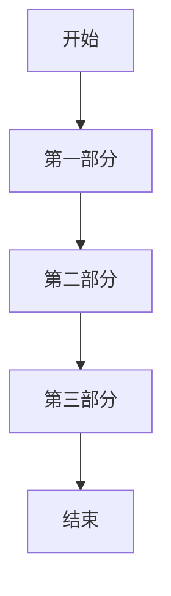
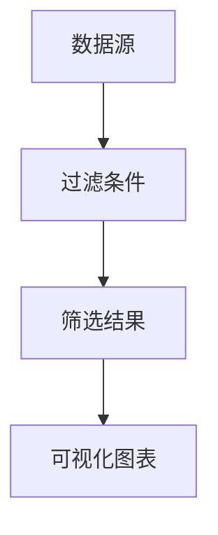
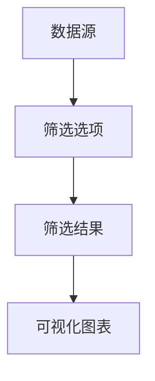
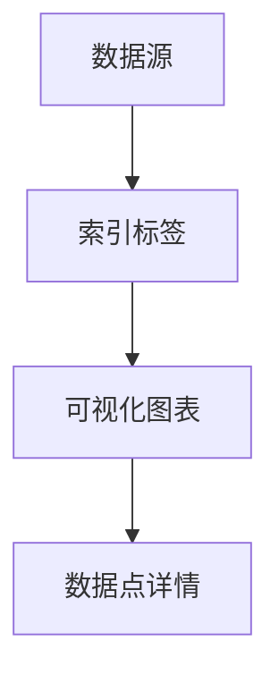

                 

### 数据可视化技术：有效呈现复杂数据

> 关键词：数据可视化、信息呈现、复杂数据、交互设计、应用实践

> 摘要：本文将深入探讨数据可视化技术在有效呈现复杂数据中的应用。首先，我们将概述数据可视化技术的发展历程和应用领域，然后解析其基本概念和原理，包括视觉感知、方法和技术。接着，我们分析数据可视化在应对信息过载方面的作用，并探讨设计原则和实践方法。随后，本文将聚焦于复杂数据的可视化技术，详细讨论网络、高维和时序数据的可视化方法。随后，通过具体案例，我们将展示如何应用这些技术来提高数据可视化效果。最后，本文将探讨数据可视化在特定领域的应用，如商业分析、医疗健康和教育领域，并展望数据可视化技术的发展趋势和未来前景。

### 目录大纲：

1. **第一部分: 数据可视化技术的概述**

   1.1 数据可视化技术概述

   1.2 数据可视化技术的基本概念

   1.3 数据可视化技术的工具与框架

2. **第二部分: 数据可视化原理**

   2.1 数据可视化原理基础

   2.2 数据可视化的方法与技术

   2.3 数据可视化与信息过载

3. **第三部分: 数据可视化设计实践**

   3.1 数据可视化设计原则

   3.2 数据可视化案例分析

   3.3 数据可视化项目实战

4. **第四部分: 复杂数据可视化技术**

   4.1 复杂数据可视化原理

   4.2 复杂数据可视化方法

   4.3 复杂数据可视化应用案例

5. **第五部分: 数据可视化中的交互设计**

   5.1 交互设计在数据可视化中的作用

   5.2 常见交互设计模式

   5.3 交互设计案例分析

6. **第六部分: 数据可视化在特定领域的应用**

   6.1 数据可视化在商业分析中的应用

   6.2 数据可视化在医疗健康领域中的应用

   6.3 数据可视化在教育领域中的应用

7. **第七部分: 数据可视化技术的发展趋势与未来展望**

   7.1 数据可视化技术的发展趋势

   7.2 数据可视化技术在现实世界中的应用前景

---

### 第一部分: 数据可视化技术的概述

#### 1.1 数据可视化技术概述

数据可视化技术是一种将数据转化为图形、图表、图像或其他视觉元素，以便更容易理解、分析和解释的技术。通过图形化的方式，数据可视化技术可以帮助用户直观地了解数据背后的模式、趋势和关系。

**1.1.1 数据可视化技术的发展历程**

数据可视化技术的发展可以追溯到20世纪60年代，当时计算机科学刚刚起步，科学家们开始探索如何将数据以图形化的方式呈现。最初的尝试主要依赖于二维图表和简单的图像。随着计算机技术的进步和图形用户界面的普及，数据可视化技术逐渐变得更加复杂和高级。

20世纪90年代，互联网的兴起推动了数据可视化技术的快速发展。随着大数据时代的到来，数据量呈指数级增长，如何有效地处理和展示这些数据成为了一个重要的课题。这一时期，数据可视化工具和框架如D3.js、Tableau和Power BI等相继出现，使得数据可视化技术变得更加普及和实用。

**1.1.2 数据可视化技术的应用领域**

数据可视化技术广泛应用于各个领域，包括商业分析、金融、医疗、教育、科研等。以下是几个典型的应用场景：

- **商业分析**：通过数据可视化，企业可以更直观地了解市场趋势、客户行为和运营效率，从而做出更明智的决策。

- **金融**：数据可视化可以帮助金融分析师更清晰地理解市场数据，发现潜在的投资机会和风险。

- **医疗**：医疗数据可视化技术可以帮助医生更好地分析患者的病情，制定更有效的治疗方案。

- **教育**：教育领域的数据可视化技术可以增强学生的学习体验，提高教学效果。

**1.1.3 数据可视化的意义和价值**

数据可视化的意义和价值体现在以下几个方面：

- **提升数据理解**：通过图形化的方式，用户可以更快地理解和分析数据，发现隐藏的模式和趋势。

- **增强决策支持**：数据可视化可以为决策者提供直观、清晰的决策支持，减少决策失误。

- **提升沟通效率**：数据可视化技术可以帮助团队更有效地分享和讨论数据，提高沟通效率。

- **激发创新思维**：通过探索和展示数据的新视角，数据可视化可以激发创新思维，促进新发现和新发明。

#### 1.2 数据可视化技术的基本概念

数据可视化技术的基本概念包括数据可视化与信息可视化的关系、数据可视化的层次结构和主要分类。

**1.2.1 数据可视化与信息可视化**

数据可视化和信息可视化是两个相关但有所区别的概念。数据可视化主要关注将数据以图形化的方式呈现，而信息可视化则更注重将各种类型的信息（如图像、文本、音频等）进行整合和展示。数据可视化是信息可视化的一部分，但不是全部。

**1.2.2 数据可视化的层次结构**

数据可视化可以划分为三个层次：低层次可视化、中层次可视化和高层次可视化。

- **低层次可视化**：包括基本图表和图形，如折线图、柱状图、饼图等，主要用于展示简单的数据关系。

- **中层次可视化**：涉及更复杂的数据结构和关系，如网络图、多维数据集的可视化等，需要使用高级可视化工具和算法。

- **高层次可视化**：关注数据背后的深层次含义和故事，通常需要结合交互技术和多媒体元素，以更丰富的形式展示数据。

**1.2.3 数据可视化技术的主要分类**

数据可视化技术可以按照不同的标准进行分类。以下是几种常见的分类方法：

- **按数据类型分类**：包括结构化数据可视化、半结构化数据可视化和非结构化数据可视化。

- **按可视化形式分类**：包括静态可视化、动态可视化和交互式可视化。

- **按应用领域分类**：包括通用可视化工具、行业专用可视化工具和定制可视化工具。

#### 1.3 数据可视化技术的工具与框架

数据可视化技术的工具和框架是数据可视化实践中不可或缺的部分。以下是一些常见的数据可视化工具和框架：

- **D3.js**：是一个基于Web的JavaScript库，用于创建动态和交互式的数据可视化。

- **Tableau**：是一个强大的商业智能和数据分析工具，提供丰富的可视化选项和自定义功能。

- **Power BI**：是微软推出的商业智能工具，支持数据连接、数据建模和高级数据可视化。

- **ECharts**：是一个使用JavaScript编写的可视化库，提供多种图表类型和丰富的交互功能。

- **Plotly**：是一个开源的数据可视化库，支持多种编程语言，提供丰富的图表类型和交互功能。

**1.3.1 数据可视化工具概述**

数据可视化工具通常具有以下功能：

- **数据连接**：能够连接各种数据源，包括数据库、数据仓库和云存储。

- **数据建模**：提供数据清洗、转换和建模功能，以便更好地理解和分析数据。

- **可视化设计**：提供丰富的图表类型和自定义选项，帮助用户创建直观、美观的图表。

- **交互功能**：支持用户的交互操作，如筛选、排序、缩放等，以提高数据可视化的用户体验。

**1.3.2 常见数据可视化框架介绍**

数据可视化框架是用于构建数据可视化应用的基础框架。以下是几个常见的数据可视化框架：

- **D3.js**：是一个基于Web的JavaScript库，提供丰富的数据绑定和交互功能，适合构建复杂和动态的数据可视化。

- **Bokeh**：是一个Python库，用于创建交互式Web可视化，特别适合大数据场景。

- **Plotly**：是一个跨平台的可视化库，支持多种编程语言，提供丰富的图表类型和交互功能。

- **Chart.js**：是一个轻量级的JavaScript图表库，提供多种图表类型和简单的交互功能。

**1.3.3 数据可视化工具的选择与应用**

选择合适的工具和框架对于数据可视化实践至关重要。以下是一些选择数据可视化工具和框架的考虑因素：

- **项目需求**：根据项目需求选择适合的工具和框架，如D3.js适合构建复杂和动态的可视化，而Chart.js适合快速实现简单的图表。

- **团队技能**：考虑团队成员的技术背景和技能，选择易于学习和使用的工具和框架。

- **性能和可扩展性**：选择具有高性能和良好可扩展性的工具和框架，以确保数据可视化应用的稳定运行和扩展性。

- **社区和支持**：选择拥有活跃社区和良好技术支持的工具和框架，以便在遇到问题时获得及时的帮助和解决方案。

### 第一部分总结

数据可视化技术作为一种强大的数据呈现方式，已经在各个领域得到了广泛应用。通过概述数据可视化技术的发展历程、基本概念和工具与框架，我们为深入探讨数据可视化原理、设计实践和复杂数据可视化技术奠定了基础。在接下来的章节中，我们将继续深入分析数据可视化的核心原理和方法，以及如何通过交互设计和具体案例来实现有效的数据可视化。

---

### 第二部分: 数据可视化原理

#### 2.1 数据可视化原理基础

数据可视化不仅仅是将数据以图形化的方式展示，而是通过视觉感知和认知原理，帮助用户更好地理解和分析数据。理解这些原理是设计有效数据可视化方案的关键。

**2.1.1 数据可视化原理概述**

数据可视化原理主要包括视觉感知、认知心理学和视觉设计原则。视觉感知是指人类如何通过眼睛和大脑处理视觉信息。认知心理学研究人类如何理解和解释视觉信息。视觉设计原则则提供了设计有效可视化的指导方针。

**2.1.2 数据可视化的认知基础**

认知基础关注用户如何理解、分析和解释可视化数据。以下是几个关键认知原则：

- **直观性**：可视化应尽可能直观，减少用户解读数据的难度。

- **一致性**：可视化的设计元素应保持一致性，以便用户能够快速理解和比较数据。

- **对比**：通过对比不同数据点，可以突出数据的重要特征和趋势。

- **分组**：将相关数据点分组，有助于用户识别和理解数据关系。

**2.1.3 数据可视化中的视觉感知原理**

视觉感知原理涉及人类如何处理视觉信息。以下是几个关键视觉感知原则：

- **颜色感知**：颜色可以用于区分不同数据点或强调重要信息。

- **形状和图案**：不同形状和图案可以用于表示不同类型的数据。

- **大小和比例**：大小和比例可以用于表示数据的相对大小。

- **空间布局**：合理的空间布局有助于用户理解数据的结构和关系。

#### 2.2 数据可视化的方法与技术

数据可视化方法和技术是设计有效数据可视化方案的核心。以下是一些常见的方法和技术：

**2.2.1 图形表示方法**

图形表示方法是数据可视化的基础。以下是一些常用的图形表示方法：

- **二维图表**：如折线图、柱状图、饼图等，适合展示简单的关系和数据趋势。

- **三维图表**：如柱状图、散点图、曲面图等，可以提供更丰富的视觉信息。

- **网络图**：用于展示数据点之间的复杂关系和交互。

- **热力图**：用于展示数据点的密集程度和分布情况。

**2.2.2 交互技术**

交互技术是数据可视化的重要组成部分，它使用户能够与可视化数据进行交互，从而更好地理解和分析数据。以下是一些常见的交互技术：

- **筛选和过滤**：允许用户选择或排除特定数据点。

- **缩放和平移**：使用户能够查看数据的不同部分。

- **刷选**：在数据集上绘制刷选区域，以查看特定条件下的数据。

- **交互式注释**：允许用户在可视化上添加注释，以记录观察和想法。

**2.2.3 动态可视化**

动态可视化通过时间和动画来展示数据的变化。以下是一些动态可视化的方法：

- **时间序列**：通过时间轴展示数据的变化趋势。

- **动画**：通过动画展示数据点或图表的移动和变化。

- **仪表盘**：动态展示关键指标和实时数据。

**2.2.4 可视化编码原则**

可视化编码原则是确保数据可视化有效和准确的关键。以下是一些关键的可视化编码原则：

- **数据清晰性**：确保数据点的编码（如颜色、形状、大小）清晰、一致，以便用户易于理解。

- **信息传递效率**：尽量减少冗余信息，确保重要信息能够被用户快速捕捉和理解。

- **对比性**：使用对比性强的编码，如颜色和大小，以突出重要数据点。

- **可访问性**：确保数据可视化对所有人（包括色盲用户）都是可访问的。

#### 2.3 数据可视化与信息过载

信息过载是指用户接收到的信息量超出了他们的处理能力。数据可视化技术在应对信息过载方面具有重要作用。

**2.3.1 信息过载问题**

信息过载可能导致以下问题：

- **决策困难**：用户在大量信息中难以找到关键数据，导致决策困难。

- **认知负担**：用户在处理大量信息时感到疲劳和压力，影响工作效率。

- **误解和误导**：用户可能无法正确理解和解释大量数据，导致错误的决策。

**2.3.2 信息过载的应对策略**

以下是一些应对信息过载的策略：

- **简化数据展示**：减少冗余数据，突出关键信息。

- **交互式过滤**：提供交互式工具，帮助用户筛选和过滤数据。

- **分层展示**：将数据分层展示，用户可以逐步深入探索数据。

- **可视化编码**：使用清晰的编码原则，确保数据易于理解和解释。

**2.3.3 可视化在信息过载中的应用**

数据可视化在应对信息过载中的应用包括：

- **信息压缩**：通过图形化方式压缩大量信息，帮助用户快速捕捉关键数据。

- **数据聚合**：将相关数据点聚合展示，减少用户的信息处理负担。

- **交互式探索**：提供交互式探索工具，使用户能够动态调整和探索数据。

通过理解数据可视化的原理和方法，我们可以设计出更有效、更直观的数据可视化方案，帮助用户更好地理解和分析复杂数据。

### 第二部分总结

在第二部分，我们深入探讨了数据可视化原理的基础、方法和技术，以及如何应对信息过载的问题。通过分析视觉感知和认知心理学原理，我们了解了用户如何理解和解释可视化数据。同时，通过介绍图形表示方法、交互技术、动态可视化以及可视化编码原则，我们为设计有效数据可视化方案提供了指导。在接下来的章节中，我们将进一步探讨数据可视化设计实践，并通过案例分析展示如何将理论应用于实际项目中。

---

### 第三部分: 数据可视化设计实践

#### 3.1 数据可视化设计原则

数据可视化设计原则是确保数据可视化方案有效和易用的关键。以下是一些核心设计原则：

**3.1.1 设计原则概述**

数据可视化设计原则主要包括：

- **直观性**：设计应尽可能直观，减少用户解读数据的难度。

- **一致性**：设计元素应保持一致性，以便用户能够快速理解和比较数据。

- **对比性**：使用对比性强的设计元素，如颜色和大小，以突出重要数据点。

- **可访问性**：确保数据可视化对所有用户（包括色盲用户）都是可访问的。

- **交互性**：提供交互式功能，使用户能够动态调整和探索数据。

**3.1.2 设计流程与方法**

数据可视化设计流程通常包括以下步骤：

1. **需求分析**：明确用户需求和可视化目标。
2. **数据准备**：清洗、转换和预处理数据。
3. **设计原型**：创建数据可视化原型，包括选择合适的图表类型和设计元素。
4. **用户反馈**：收集用户反馈，对设计进行迭代优化。
5. **最终设计**：完成数据可视化设计，并进行测试和评估。

**3.1.3 设计工具与技术**

以下是一些常用的数据可视化设计工具和技术：

- **设计软件**：如Sketch、Adobe XD、Figma等，用于创建数据可视化原型和设计。
- **编程工具**：如D3.js、Bokeh、Plotly等，用于实现数据可视化应用。
- **数据工具**：如Python、R、Tableau等，用于数据预处理和可视化。

#### 3.2 数据可视化案例分析

**3.2.1 案例分析概述**

以下是几个数据可视化案例分析：

1. **全球疫情可视化**：展示全球新冠病毒疫情的分布、传播趋势和疫苗接种情况。
2. **电商销售数据分析**：展示不同产品的销售趋势、热门产品和客户行为。
3. **股市动态可视化**：展示股票市场的走势、行业动态和投资机会。

**3.2.2 案例分析与评估**

以下是对这些案例的详细分析：

1. **全球疫情可视化**：

   - **优点**：直观展示了全球疫情的分布和传播趋势，有助于用户了解疫情动态。

   - **不足**：部分数据可视化过于复杂，可能使用户难以理解和解读。

2. **电商销售数据分析**：

   - **优点**：清晰展示了不同产品的销售趋势和热门产品，有助于商家制定销售策略。

   - **不足**：缺乏对客户行为的深入分析，可能无法提供完整的销售洞见。

3. **股市动态可视化**：

   - **优点**：直观展示了股票市场的走势和行业动态，有助于投资者了解市场状况。

   - **不足**：部分图表设计不够直观，可能影响用户对数据的理解。

**3.2.3 案例中的设计亮点与不足**

以下是对案例中设计亮点和不足的详细讨论：

1. **全球疫情可视化**：

   - **亮点**：使用了多种图表类型（如地图、时间序列、热力图），提供了丰富的视觉信息。
   - **不足**：部分图表的颜色选择不够清晰，可能对色盲用户造成困扰。

2. **电商销售数据分析**：

   - **亮点**：使用了交互式图表，使用户能够动态筛选和过滤数据。
   - **不足**：图表的设计和布局不够一致，可能影响用户的理解。

3. **股市动态可视化**：

   - **亮点**：使用了动态图表和交互式功能，使用户能够实时查看市场动态。
   - **不足**：图表的设计和布局可能过于复杂，影响用户对数据的理解。

通过这些案例分析，我们可以看到数据可视化设计在实践中面临的一些挑战，同时也得到了一些有益的经验和教训。在接下来的章节中，我们将进一步探讨如何通过具体项目实战来提升数据可视化设计的实践能力。

#### 3.3 数据可视化项目实战

**3.3.1 项目环境搭建**

为了进行数据可视化项目实战，我们需要搭建一个合适的环境。以下是搭建项目环境的步骤：

1. **选择编程语言和框架**：我们选择Python作为主要编程语言，并使用D3.js作为数据可视化框架。

2. **安装Python和D3.js**：在Windows或MacOS上，可以通过pip安装Python和D3.js。

   ```bash
   pip install python
   pip install d3-js
   ```

3. **配置开发环境**：安装Python的IDE（如PyCharm、VS Code）并设置D3.js的相关插件。

**3.3.2 数据可视化核心实现**

以下是使用Python和D3.js实现一个简单的数据可视化项目：

1. **数据准备**：我们使用一个简单的CSV文件作为数据源，包含用户年龄、性别和收入数据。

2. **数据预处理**：使用Python的pandas库对数据进行清洗和转换。

   ```python
   import pandas as pd
   
   data = pd.read_csv('data.csv')
   data = data.dropna()  # 删除缺失值
   ```

3. **创建图表**：使用D3.js创建一个柱状图，展示不同年龄段的性别和收入分布。

   ```javascript
   // D3.js代码
   const width = 600;
   const height = 400;
   
   const svg = d3.select('svg')
                 .attr('width', width)
                 .attr('height', height);
   
   const x = d3.scaleBand()
               .domain(data['age'].unique())
               .range([0, width - 100])
               .padding(0.2);
   
   const y = d3.scaleLinear()
               .domain([0, d3.max(data['income'])])
               .range([height - 50, 0]);
   
   svg.selectAll('rect')
      .data(data)
      .enter()
      .append('rect')
      .attr('x', d => x(d['age']))
      .attr('y', d => y(d['income']))
      .attr('width', x.bandwidth())
      .attr('height', d => height - y(d['income']) - 50)
      .attr('fill', d => d['gender'] == '男' ? 'blue' : 'red');
   ```

4. **添加标签和说明**：为图表添加标签和说明，以帮助用户更好地理解数据。

   ```javascript
   // 添加标签
   svg.append('text')
      .attr('x', width / 2)
      .attr('y', height - 20)
      .attr('text-anchor', 'middle')
      .text('收入分布');
   
   // 添加说明
   svg.append('text')
      .attr('x', 10)
      .attr('y', 10)
      .text('性别：男（蓝色），女（红色）');
   ```

**3.3.3 代码应用解读与分析**

以下是代码的应用解读和分析：

1. **数据预处理**：使用pandas库读取和清洗数据，确保数据质量。

2. **图表创建**：使用D3.js创建柱状图，根据年龄和收入数据绘制不同性别的柱状条。

3. **标签和说明**：添加标签和说明，帮助用户理解图表内容。

**3.3.4 实际案例分析**

以下是一个实际案例分析：

- **问题背景**：一家电商公司希望了解其用户的年龄、性别和收入分布，以便更好地制定营销策略。

- **解决方案**：通过数据可视化的方式，展示用户的年龄、性别和收入分布，帮助公司了解用户特征，制定针对性的营销策略。

- **实际效果**：通过可视化的方式，公司能够直观地了解用户特征，发现年龄和收入分布的特点，从而制定更有效的营销策略。

**3.3.5 项目小结**

通过本项目的实践，我们了解了如何搭建数据可视化项目环境，使用Python和D3.js实现数据可视化，并通过实际案例分析展示了数据可视化的应用效果。数据可视化在电商、金融、医疗等多个领域都具有广泛的应用价值，通过有效的数据可视化，企业可以更好地理解和利用数据，做出更明智的决策。

### 第三部分总结

在第三部分，我们探讨了数据可视化设计原则、通过案例分析和项目实战展示了如何将理论应用于实际。通过设计原则，我们了解了如何设计直观、一致和对比性强的数据可视化方案。案例分析让我们看到了成功和失败的经验，项目实战则提供了实际操作的经验。在接下来的章节中，我们将进一步探讨复杂数据的可视化技术，以应对更复杂的数据场景。

---

### 第四部分：复杂数据可视化技术

#### 4.1 复杂数据可视化原理

复杂数据可视化技术是处理和分析复杂数据集的重要工具。复杂数据通常具有高维度、复杂的网络结构和大量的时间序列数据，这些数据难以用传统的二维图表进行有效展示。因此，复杂数据可视化需要采用特定的方法和技术来揭示数据中的模式和关系。

**4.1.1 复杂数据定义与特征**

复杂数据通常具有以下特征：

- **高维数据**：数据维度超过三个，难以在二维或三维空间中直观展示。
- **网络数据**：数据之间存在复杂的网络关系，如社交网络、知识图谱等。
- **时间序列数据**：数据随时间变化，如股票价格、气象数据等。

**4.1.2 复杂数据可视化挑战**

复杂数据可视化面临以下挑战：

- **数据复杂性**：高维数据和多维数据集难以直观展示，需要采用特殊的可视化方法。
- **信息过载**：大量的数据点和关系可能导致用户难以理解，需要有效的信息压缩和可视化编码。
- **交互性**：用户需要与复杂数据进行交互，以便深入探索和理解数据。

**4.1.3 复杂数据可视化解决方案**

为了解决上述挑战，复杂数据可视化技术采用了以下几种解决方案：

- **降维技术**：通过降维技术（如主成分分析、多维尺度分析等）将高维数据映射到较低维空间，以减少数据复杂性。
- **复杂网络可视化**：使用图形和网络可视化技术展示数据中的网络关系，如节点、边和集群。
- **时间序列可视化**：使用时间轴和动画展示数据随时间的变化趋势，如折线图、散点图和热力图。

#### 4.2 复杂数据可视化方法

复杂数据可视化方法包括以下几种：

**4.2.1 复杂网络可视化**

复杂网络可视化用于展示数据点之间的复杂关系。以下是一些常用的方法：

- **节点-边图**：通过节点和边展示数据点及其关系。
- **矩阵可视化**：使用矩阵或散点图展示节点之间的关系。
- **力导向图**：使用物理模拟方法将节点布局在二维或三维空间中，展示网络结构。

**4.2.2 高维数据可视化**

高维数据可视化用于将高维数据映射到二维或三维空间中。以下是一些常用方法：

- **散点图**：将高维数据映射到二维空间，通过颜色或大小表示不同维度。
- **平行坐标图**：将多个维度平行排列，使用不同颜色或线型表示数据点。
- **多维度尺度分析**：将高维数据投影到二维或三维空间，以揭示数据中的模式和关系。

**4.2.3 时间序列数据可视化**

时间序列数据可视化用于展示数据随时间的变化趋势。以下是一些常用方法：

- **折线图**：通过连接数据点展示时间序列的连续变化。
- **散点图**：将时间序列数据点分散在时间轴上，通过颜色或大小表示不同维度。
- **热力图**：使用颜色强度表示不同时间点的数据密集程度。

#### 4.3 复杂数据可视化应用案例

**4.3.1 案例概述**

以下是一个复杂数据可视化应用案例：使用网络可视化和时间序列可视化展示全球疫情传播情况。

**4.3.2 案例分析与评估**

- **网络可视化**：使用节点和边展示全球疫情传播的节点和路径，通过颜色表示疫情的严重程度。

  - **优点**：直观展示了疫情在全球的传播路径和热点区域。
  - **不足**：由于疫情数据量大，部分细节可能不够清晰。

- **时间序列可视化**：使用折线图和热力图展示疫情随时间的变化趋势。

  - **优点**：清晰地展示了疫情的发展历程和变化趋势。
  - **不足**：由于数据密集，部分时间段可能不够直观。

**4.3.3 案例中的创新与改进**

- **创新**：结合网络可视化和时间序列可视化，提供多维度疫情信息。

- **改进**：优化节点和边的设计，提高数据可视化的清晰度和可读性。

通过复杂数据可视化技术，我们可以更深入地理解复杂数据集，发现隐藏的模式和关系。在接下来的章节中，我们将进一步探讨数据可视化中的交互设计，以提高数据可视化的用户体验。

### 第四部分总结

在第四部分，我们深入探讨了复杂数据可视化技术，包括其原理、方法和应用案例。复杂数据可视化技术是处理高维数据、复杂网络和时间序列数据的重要工具，通过降维、网络可视化和时间序列可视化等方法，可以有效地揭示数据中的模式和关系。在接下来的章节中，我们将进一步探讨数据可视化中的交互设计，以优化用户体验和提高数据可视化的效果。

---

### 第五部分：数据可视化中的交互设计

#### 5.1 交互设计在数据可视化中的作用

交互设计在数据可视化中扮演着至关重要的角色。它不仅仅是让用户能够与可视化元素进行交互，更重要的是通过交互帮助用户更好地理解和分析数据。以下从三个方面探讨交互设计在数据可视化中的作用：

**5.1.1 交互设计的核心要素**

交互设计的核心要素包括：

- **交互性**：用户能够与可视化进行交互，如点击、拖动、筛选等。
- **反馈**：系统对用户交互的响应，如数据更新、动画效果等。
- **导航**：帮助用户在复杂数据可视化中进行探索，如放大、缩小、切换视图等。
- **信息传递**：通过交互设计，确保用户能够准确理解和解读数据。

**5.1.2 交互设计原则**

交互设计应遵循以下原则：

- **直观性**：交互设计应尽可能直观，减少用户的学习成本。
- **一致性**：交互设计应保持一致性，便于用户在不同场景中应用。
- **效率**：交互设计应提高用户的效率，减少不必要的操作。
- **可访问性**：交互设计应考虑所有用户，包括那些有特殊需求（如视力障碍）的用户。

**5.1.3 交互设计方法与技术**

交互设计的方法和技术包括：

- **交互模型**：如触摸交互、手势交互、语音交互等。
- **交互元素**：如按钮、滑块、下拉菜单、图标等。
- **交互动画**：通过动画效果提高用户对数据的理解和记忆。

#### 5.2 常见交互设计模式

在数据可视化中，常见的交互设计模式包括：

**5.2.1 滚动交互**

滚动交互是最常见的交互模式之一，用户可以通过滚动来查看可视化的不同部分。以下是一个滚动交互的实例：



**5.2.2 过滤交互**

过滤交互允许用户通过筛选条件来查看特定数据。以下是一个过滤交互的实例：



**5.2.3 筛选交互**

筛选交互与过滤交互类似，但更侧重于通过选择特定选项来筛选数据。以下是一个筛选交互的实例：



**5.2.4 索引交互**

索引交互通过提供索引或标签，帮助用户快速定位到特定的数据点或部分。以下是一个索引交互的实例：



#### 5.3 交互设计案例分析

**5.3.1 案例概述**

以下是两个交互设计案例分析：

1. **全球疫情可视化平台**：通过滚动、过滤和筛选交互，用户可以查看全球疫情数据。
2. **金融仪表盘**：通过多种交互模式，如缩放、筛选和切换视图，用户可以深入分析金融数据。

**5.3.2 案例分析与评估**

**全球疫情可视化平台**：

- **优点**：通过滚动交互，用户可以轻松查看不同地区和时间的疫情数据；过滤和筛选交互帮助用户快速找到感兴趣的数据。
- **不足**：部分交互过于复杂，可能增加用户的学习成本；信息过载可能导致用户难以找到关键信息。

**金融仪表盘**：

- **优点**：多种交互模式提供了丰富的数据分析功能；缩放和切换视图帮助用户深入理解数据。
- **不足**：部分交互可能不够直观，需要用户一定的学习过程；设计一致性有待提高，以减少用户困惑。

**5.3.3 案例中的设计亮点与不足**

**全球疫情可视化平台**：

- **亮点**：提供多种交互模式，帮助用户快速获取和分析数据；设计简洁，易于使用。
- **不足**：交互过于复杂，可能增加用户的学习成本；信息展示不够直观，可能导致用户迷失。

**金融仪表盘**：

- **亮点**：提供多种交互模式，帮助用户深入分析数据；设计一致性好，用户易于理解。
- **不足**：部分交互不够直观，可能增加用户的学习成本；设计简洁度有待提高，以减少用户困惑。

通过分析这些案例，我们可以看到交互设计在数据可视化中的重要作用。有效的交互设计可以提高用户体验，帮助用户更好地理解和分析数据。在接下来的章节中，我们将进一步探讨数据可视化在特定领域的应用。

### 第五部分总结

在第五部分，我们深入探讨了交互设计在数据可视化中的作用和常见交互设计模式，并通过案例分析展示了交互设计的实际应用和效果。交互设计不仅是数据可视化的重要组成部分，还能显著提升用户的体验和理解。在接下来的章节中，我们将进一步探讨数据可视化在特定领域的应用，如商业分析、医疗健康和教育领域。

---

### 第六部分：数据可视化在特定领域的应用

#### 6.1 数据可视化在商业分析中的应用

数据可视化在商业分析中扮演着至关重要的角色。通过将复杂的数据转化为直观的图表和图像，企业可以更好地理解市场趋势、客户行为和运营绩效，从而做出更明智的决策。

**6.1.1 商业分析中的数据可视化**

在商业分析中，数据可视化主要用于以下几个方面：

- **市场趋势分析**：通过图表展示市场的动态变化，帮助企业管理者了解行业趋势和竞争环境。
- **客户行为分析**：通过图表展示客户的行为模式，帮助企业优化市场营销策略和提高客户满意度。
- **运营绩效分析**：通过图表展示企业的运营数据，如销售额、利润率、库存等，帮助管理者评估业务绩效。

**6.1.2 案例分析**

以下是一个商业分析中的数据可视化案例：

- **案例背景**：一家电商平台希望分析其产品的销售趋势和客户购买行为。
- **数据可视化应用**：

  - **销售趋势图**：展示不同产品的销售量和销售额随时间的变化趋势，帮助管理者了解哪些产品在特定时间段内表现最好。
  - **客户行为分析图**：展示客户的浏览路径、点击次数和转化率等，帮助管理者优化用户体验和营销策略。

**6.1.3 最佳实践与趋势**

在商业分析中，以下最佳实践和趋势值得关注：

- **多维数据融合**：通过整合不同来源的数据，如客户数据、销售数据和营销数据，提供更全面的洞察。
- **实时数据可视化**：利用实时数据流技术，提供实时数据更新和动态可视化，帮助管理者及时响应市场变化。
- **交互式数据探索**：提供交互式数据探索工具，使用户能够自由筛选和过滤数据，以便深入分析和发现隐藏的模式。

#### 6.2 数据可视化在医疗健康领域中的应用

数据可视化在医疗健康领域同样具有重要应用价值。通过将复杂的医疗数据转化为直观的图表和图像，医生和研究人员可以更好地理解患者的健康状况、疾病发展过程和治疗方案的效果。

**6.2.1 医疗健康领域中的数据可视化**

在医疗健康领域，数据可视化主要用于以下几个方面：

- **疾病诊断**：通过可视化展示患者的医学影像数据，帮助医生快速识别疾病。
- **临床研究**：通过可视化展示临床研究的数据结果，帮助研究人员发现疾病的治疗方法和预防策略。
- **患者护理**：通过可视化展示患者的健康数据和药物反应，帮助医生和护士提供个性化的护理服务。

**6.2.2 案例分析**

以下是一个医疗健康领域中的数据可视化案例：

- **案例背景**：一家医院希望利用数据可视化技术优化患者护理流程。
- **数据可视化应用**：

  - **患者健康数据可视化**：通过图表展示患者的血压、血糖、心率等关键健康指标，帮助医护人员及时了解患者的健康状况。
  - **手术风险评估图**：通过可视化展示手术的并发症风险和死亡率，帮助医生评估手术的风险和收益。

**6.2.3 最佳实践与挑战**

在医疗健康领域，以下最佳实践和挑战值得关注：

- **数据隐私和安全**：医疗数据敏感性高，确保数据隐私和安全是数据可视化的首要挑战。
- **数据融合与标准化**：医疗数据来自多个来源，且格式各异，如何有效融合和标准化数据是一个重要问题。
- **可视化工具的选择**：选择适合医疗领域特点的可视化工具和框架，以提供高效、准确的可视化效果。

#### 6.3 数据可视化在教育领域中的应用

数据可视化在教育领域也具有广泛的应用价值。通过将教育数据转化为直观的图表和图像，教育工作者和学生可以更好地理解教学效果、学习成果和学科知识。

**6.3.1 教育领域中的数据可视化**

在教育领域，数据可视化主要用于以下几个方面：

- **学习分析**：通过可视化展示学生的学习行为、成绩和进步情况，帮助教师制定个性化教学策略。
- **课程评估**：通过可视化展示课程的完成率、通过率和学生满意度等，帮助教育管理者评估课程质量。
- **知识呈现**：通过可视化呈现复杂的概念和理论，帮助学生更好地理解和记忆学科知识。

**6.3.2 案例分析**

以下是一个教育领域中的数据可视化案例：

- **案例背景**：一所大学希望利用数据可视化技术提高学生的学习效果。
- **数据可视化应用**：

  - **学习进度图**：通过图表展示学生的学习进度和参与度，帮助教师了解学生的学习状况。
  - **知识图谱**：通过可视化展示学科知识的关系和结构，帮助学生更好地理解和掌握学科知识。

**6.3.3 最佳实践与趋势**

在教育领域，以下最佳实践和趋势值得关注：

- **个性化学习**：通过数据可视化技术，为每个学生提供个性化的学习支持和建议。
- **教学反馈**：通过数据可视化展示学生的反馈和评价，帮助教师及时调整教学策略。
- **教育数据的融合与共享**：通过整合不同来源的教育数据，提供更全面的洞察和决策支持。

### 第六部分总结

在第六部分，我们深入探讨了数据可视化在商业分析、医疗健康和教育领域的应用。通过案例分析，我们展示了数据可视化如何帮助企业在市场竞争中取得优势，如何优化医疗健康服务，以及如何提高教育质量和学习效果。在未来的数据可视化发展中，个性化学习、实时数据可视化和数据隐私保护将成为重要趋势。

### 第七部分：数据可视化技术的发展趋势与未来展望

#### 7.1 数据可视化技术的发展趋势

数据可视化技术的发展正在经历一系列重要变革，这些变革受到新兴技术和应用需求的双重推动。以下是几个关键的趋势：

**7.1.1 人工智能与机器学习**

人工智能（AI）和机器学习（ML）技术的进步正在改变数据可视化的方式。通过AI，系统可以自动识别数据中的模式和趋势，从而生成智能化的可视化。机器学习算法还可以根据用户的行为和偏好，提供个性化的可视化推荐。

**7.1.2 交互式和动态可视化**

交互式和动态可视化技术正在成为数据可视化的主流。这些技术允许用户与可视化进行实时互动，从而更深入地探索数据。动态可视化通过动画和交互，使数据变化过程更加直观，有助于用户更好地理解复杂的动态系统。

**7.1.3 虚拟现实（VR）与增强现实（AR）**

虚拟现实（VR）和增强现实（AR）技术的兴起为数据可视化带来了新的可能性。通过VR和AR，用户可以在沉浸式的环境中体验和交互数据，从而提供更加丰富和互动的视觉体验。

**7.1.4 大数据和实时数据流**

随着大数据时代的到来，实时处理和分析大量数据成为数据可视化的重要需求。实时数据流可视化技术可以提供即时的数据更新和动态分析，帮助用户及时响应变化。

#### 7.2 数据可视化技术在现实世界中的应用前景

数据可视化技术在现实世界的应用前景非常广阔，以下是一些关键领域：

**7.2.1 商业智能**

商业智能（BI）领域的数据可视化技术将帮助企业在复杂的数据环境中找到洞察。通过数据可视化，企业可以更好地理解市场趋势、客户行为和运营绩效，从而做出更明智的决策。

**7.2.2 医疗健康**

在医疗健康领域，数据可视化技术将提高诊断的准确性、治疗效果的评估和公共卫生管理的效率。通过可视化的医疗影像和健康数据，医生和研究人员可以更准确地识别疾病、设计治疗方案和监测患者恢复情况。

**7.2.3 教育与学习**

在教育领域，数据可视化技术可以提供个性化的学习体验和教学反馈。教师和学生可以通过可视化的学习数据和知识结构，更好地理解课程内容和评估学习效果。

**7.2.4 城市规划与环境管理**

城市规划与环境管理领域的数据可视化技术可以帮助决策者更好地理解城市环境、交通流量和资源利用。通过可视化的城市数据和传感器数据，可以优化城市规划、提高交通效率和保护环境。

#### 7.3 数据可视化技术的发展挑战与未来展望

尽管数据可视化技术取得了显著进展，但仍面临一些挑战：

**7.3.1 数据隐私和安全**

随着数据可视化技术的广泛应用，数据隐私和安全成为重要挑战。确保数据的安全性和隐私性是数据可视化技术持续发展的关键。

**7.3.2 可访问性和包容性**

数据可视化应确保对所有用户（包括残障人士）都是可访问的。未来的数据可视化技术需要更加注重可访问性和包容性设计。

**7.3.3 数据素养和解释**

随着数据可视化技术的普及，用户的数据素养和理解能力成为关键。提高用户的数据素养和解释能力，使其能够更好地理解和利用可视化数据，是未来数据可视化技术的发展方向。

### 第七部分总结

在第七部分，我们探讨了数据可视化技术的发展趋势、应用前景以及面临的挑战。随着新兴技术的不断进步，数据可视化技术在各个领域的应用前景十分广阔。未来，数据可视化技术将更加注重个性化、交互性和可访问性，以更好地满足用户的需求。同时，解决数据隐私和安全、提高用户数据素养等挑战，将是数据可视化技术持续发展的关键。

---

### 全文总结

通过本文的深入探讨，我们系统地介绍了数据可视化技术的概述、原理、设计实践、复杂数据可视化方法以及其在商业分析、医疗健康和教育领域的应用。数据可视化不仅是将数据以图形化的方式呈现，更是一种强大的信息处理和分析工具，它帮助我们更直观、更高效地理解复杂数据。

在数据可视化技术的发展历程中，从最初的二维图表到如今的高度交互和动态可视化，数据可视化技术经历了巨大的变革。它不仅广泛应用于商业分析、医疗健康和教育等各个领域，还在人工智能、虚拟现实和大数据等新兴技术中发挥着重要作用。

数据可视化设计原则是我们设计有效数据可视化方案的基础。直观性、一致性、对比性和可访问性等原则，确保了数据可视化方案不仅美观，更易于用户理解和操作。通过案例分析，我们看到了成功和失败的经验，这些经验为我们提供了宝贵的实践指导。

复杂数据可视化技术如复杂网络可视化、高维数据可视化和时间序列数据可视化，使我们能够更深入地探索和理解复杂数据。交互设计在数据可视化中的应用，极大地提升了用户体验，使数据可视化不仅仅是一种展示手段，更是一种与数据互动的体验。

未来，数据可视化技术将更加注重个性化、交互性和可访问性，同时面临的挑战如数据隐私和安全、数据素养和教育等，也将是数据可视化技术持续发展的关键。

总之，数据可视化技术作为一种强大的工具，正不断推动着数据处理和信息分析的发展。通过本文的介绍和分析，我们不仅加深了对数据可视化技术的理解，也为实际应用提供了宝贵的指导和思路。

---

### 作者信息

**作者：** AI天才研究院/AI Genius Institute & 禅与计算机程序设计艺术 /Zen And The Art of Computer Programming

AI天才研究院（AI Genius Institute）致力于推动人工智能技术的创新与发展，汇集了全球顶尖的人工智能专家、研究人员和开发者。研究院专注于人工智能算法、机器学习、深度学习、自然语言处理等领域的探索，通过前沿技术研究和实际应用开发，为全球企业提供智能解决方案。

《禅与计算机程序设计艺术》（Zen And The Art of Computer Programming）是一部经典的技术著作，由著名的计算机科学家、图灵奖获得者Donald E. Knuth所著。本书以计算机程序设计为核心，融合了哲学、心理学、数学等跨学科的知识，通过深刻的思考与洞察，为程序员提供了关于编程艺术与实践的智慧结晶。

