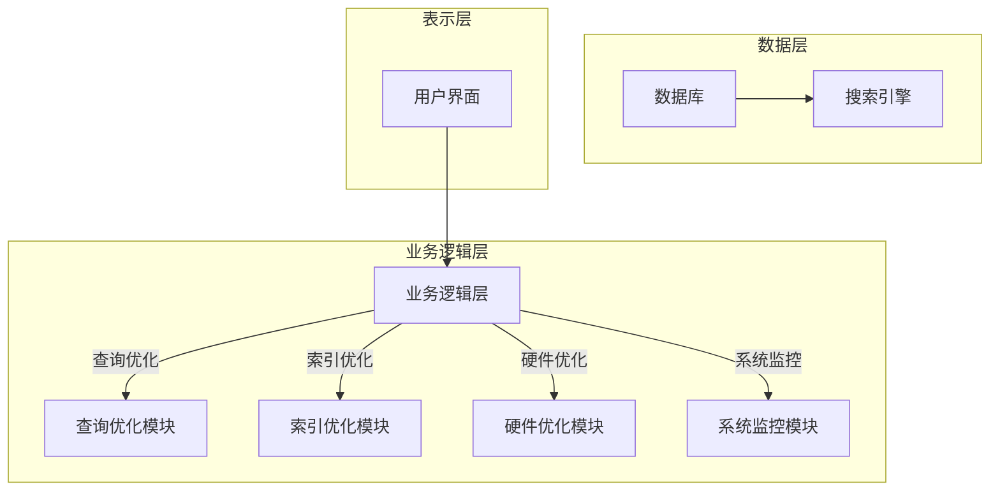
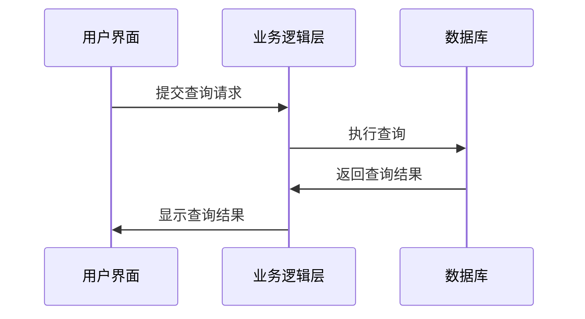
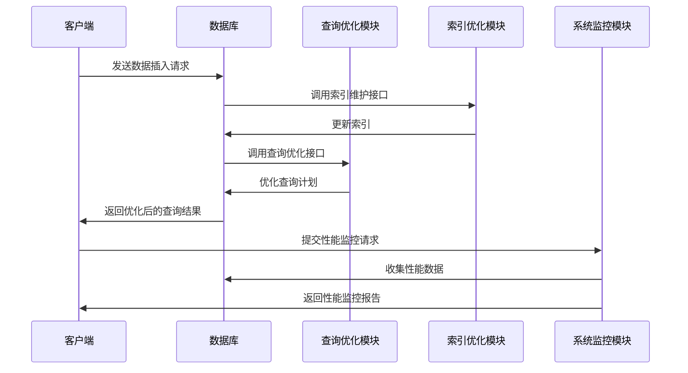

                 

## 第1章：数据库基础与优化概述

### 1.1 数据库基本概念

数据库（Database）是一个按照数据结构来组织、存储和管理数据的仓库。它是一个长期存储在计算机内的、有组织的、可共享的统一管理的大量数据的集合。数据库的主要目的是存储、检索、更新和管理数据，以便在多种应用环境中使用。

数据库系统（Database System）是计算机系统中引入数据库后的系统，它包括数据库、数据库管理系统（DBMS）、应用程序和用户。数据库管理系统是数据库系统的核心，负责数据库的建立、使用和维护。常见的数据库管理系统有MySQL、Oracle、SQL Server、PostgreSQL等。

#### 数据模型

数据模型是数据库系统的核心概念，用于描述数据如何存储、组织和访问。主要的数据模型有：

- **关系模型**：基于关系代数和关系演算，使用表格形式组织数据。关系模型是最广泛使用的数据库模型，如MySQL和PostgreSQL等。

- **文档模型**：以文档为核心，适用于处理非结构化或半结构化数据，如MongoDB。

- **图模型**：用图来表示实体及其关系，适用于处理复杂的关系和图形数据，如Neo4j。

### 1.2 数据库优化的重要性

数据库优化是确保数据库系统高效运行的关键。优化不当可能导致系统性能下降，影响业务连续性和用户体验。以下是数据库优化的几个重要性：

- **提高查询效率**：通过优化数据库结构和查询语句，可以显著减少查询执行时间，提高系统的响应速度。

- **降低硬件成本**：优化后的数据库可以减少硬件资源的需求，降低硬件成本。

- **提升业务效率**：高效运行的数据库可以提高业务的连续性和效率，满足日益增长的数据处理需求。

- **保证数据完整性**：优化包括数据备份和恢复策略，有助于确保数据的完整性和可靠性。

### 1.3 数据库优化的基本原则

为了实现有效的数据库优化，需要遵循以下基本原则：

- **需求分析**：深入了解业务需求，确保数据库设计满足业务要求。

- **性能测试**：在优化过程中，定期进行性能测试，以确保优化的效果。

- **合理设计**：数据库设计应遵循规范化原则，避免数据冗余和不一致。

- **查询优化**：优化SQL查询语句，减少查询执行时间。

- **索引优化**：合理设计索引，提高查询效率。

- **硬件与配置**：确保数据库服务器硬件和配置合理，以满足性能需求。

- **监控与维护**：定期监控数据库性能，进行必要的维护和调整。

通过遵循这些原则，可以构建一个高效、可靠的数据库系统，为业务提供坚实的支撑。

### 背景介绍

数据库系统是现代计算机系统中的一个核心组成部分，它在各个行业中都有广泛的应用。从简单的个人信息管理系统到复杂的金融交易系统，数据库都扮演着至关重要的角色。数据库优化不仅关乎系统性能，还直接影响到用户体验和业务连续性。随着数据量的不断增长和业务需求的日益复杂，数据库优化成为了一个不容忽视的重要领域。

在实际应用中，数据库优化面临诸多挑战。例如，大数据环境下的查询性能瓶颈、多表联结操作的处理、复杂的事务管理等问题。为了应对这些挑战，数据库优化需要综合考虑多个方面，包括数据库设计、查询优化、硬件配置和系统监控等。

本文将深入探讨数据库优化的多个方面，从基础概念到具体优化技巧，再到实际案例分析和最佳实践，力求为广大数据库开发人员和运维人员提供全面的指导。通过本文的阅读，读者将能够掌握数据库优化的重要原则和实践方法，从而提升数据库系统的性能和可靠性。

#### 核心概念与联系

在深入探讨数据库优化的核心概念之前，我们需要明确一些基本的概念和它们之间的关系。以下是几个关键概念及其属性特征对比表格，这些概念对于理解数据库优化的原理和方法至关重要。

| 概念       | 属性特征                                                     |
|------------|------------------------------------------------------------|
| 数据库     | 存储数据的仓库，使用特定的数据模型来组织数据               |
| 数据库管理系统（DBMS） | 管理数据库的软件系统，提供数据定义、查询、更新等功能   |
| SQL        | 结构化查询语言，用于数据库的查询、更新和管理           |
| 索引       | 数据库表中用于加速查询的列或列组合                     |
| 执行计划   | DBMS为查询生成的查询步骤序列，描述如何执行查询以获取结果 |
| 瓶颈分析   | 分析数据库性能瓶颈的过程，识别影响性能的关键因素       |
| 性能监控   | 监控数据库性能指标，评估系统健康状态的过程             |

下面，我们通过一个ER实体关系图来展示这些概念之间的联系。

```mermaid
erDiagram
  User ||--|{ Database }|| Data
  Database ||--|{ Table }|| Tables
  Table ||--|{ Column }|| Columns
  Table ||--|{ Index }|| Indexes
  Database ||--|{ DBMS }|| DBMS
```

在上面的ER图中，用户与数据库之间存在关联，用户可以创建和访问数据库。数据库包含多个表，每个表包含多个列。表与索引之间存在关联，索引用于加速表的查询操作。数据库与DBMS之间存在关联，DBMS负责管理数据库的创建和维护。

通过理解这些核心概念及其相互关系，我们可以更深入地探讨数据库优化的各个方面，包括设计、查询、索引和系统监控等。

### 算法原理讲解

数据库优化的核心在于理解如何高效地执行SQL查询，并确保数据访问的速度和准确性。以下是几种常见的SQL优化算法及其原理：

#### 1. 索引算法

索引是数据库优化中最重要的工具之一。基本的索引算法包括B树索引和哈希索引。

- **B树索引**：B树是一种自平衡的树结构，它允许多路查找，适用于范围查询和排序操作。B树的每个节点可以存储多个键值，并且每个节点的键值有序。通过查找节点，可以快速定位到所需的数据。

  ```mermaid
  flowchart LR
  A[根节点] --> B{比较键值}
  B -->|小于| C{左子节点}
  B -->|等于| D{当前节点}
  B -->|大于| E{右子节点}
  ```

  在B树索引中，查询过程可以递归地遍历树，通过比较键值来确定数据的位置。

- **哈希索引**：哈希索引基于哈希函数快速定位数据。哈希索引的查询时间通常固定，但它的性能依赖于哈希函数的均匀性。哈希索引适用于等值查询，但在范围查询和排序操作上不如B树索引高效。

  ```python
  def hash_index(key, table_size):
      return key % table_size
  ```

#### 2. 查询优化算法

查询优化算法旨在选择最有效的查询执行计划。常见的查询优化算法包括查询重写、联结优化和聚合操作优化。

- **查询重写**：查询重写是通过改写原始SQL查询语句，使其执行更高效。一种常见的重写技术是子查询重写，即将子查询转换为联结操作。

  ```sql
  SELECT * FROM A WHERE A.id IN (SELECT id FROM B WHERE B.value > 10);
  ```

  上述查询可以通过联结操作改写为：

  ```sql
  SELECT * FROM A JOIN B ON A.id = B.id WHERE B.value > 10;
  ```

- **联结优化**：联结优化通过减少联结操作的数据量来提高查询效率。常见的联结优化技术包括：

  - **嵌套循环联结**：每次循环读取一个表中的记录，并与其他表进行匹配。
  - **哈希联结**：使用哈希函数将一个表中的记录分配到哈希表中，然后快速查找匹配的记录。
  - **排序-合并联结**：对联结的两个表进行排序，然后依次合并排序结果，找到匹配的记录。

  ```python
  def hash_join(table1, table2, key):
      hash_table = {}
      for row in table1:
          hash_table[row[key]] = row
      result = []
      for row in table2:
          if row[key] in hash_table:
              result.append((row, hash_table[row[key]]))
      return result
  ```

- **聚合操作优化**：聚合操作如COUNT、SUM、AVG等，可以通过预计算和索引优化来提高效率。例如，可以使用预计算的总计值来快速响应聚合查询。

  ```python
  def optimized_count(data, column):
      total = sum(data[column])
      return total
  ```

#### 3. 事务与锁优化算法

事务和锁优化对于确保数据一致性和并发控制至关重要。常见的事务和锁优化算法包括：

- **悲观锁**：悲观锁假设并发事务会引发冲突，因此在事务开始时锁定相关数据。这种策略可以确保数据一致性，但可能导致锁竞争。
  
  ```python
  def pessimistic_lock(transaction, data):
      lock(data)
      # 执行事务
      unlock(data)
  ```

- **乐观锁**：乐观锁假设并发事务不会引发冲突，因此在事务执行过程中不锁定数据，只在提交时检查数据是否被修改。这种策略可以提高并发性，但可能需要回滚事务。

  ```python
  def optimistic_lock(transaction, data, version):
      if data['version'] == version:
          # 执行事务
          data['version'] += 1
      else:
          # 数据已修改，回滚事务
  ```

通过理解这些算法原理，我们可以更有效地进行数据库优化，提高查询效率和系统性能。

### 系统分析与架构设计方案

为了更好地理解和实现数据库优化，我们需要详细分析问题场景，介绍项目背景和系统功能，并展示系统架构设计和接口设计。

#### 问题场景介绍

随着互联网和大数据技术的发展，许多企业面临着海量数据的存储和处理挑战。数据库性能瓶颈逐渐显现，尤其是在高并发和高数据量的场景下，查询效率成为关键问题。优化数据库性能不仅能够提高系统的响应速度，还能降低硬件成本和提升用户体验。

#### 项目介绍

本项目旨在设计和实现一个高效的数据库优化系统，该系统包括数据库设计、查询优化、索引优化、硬件优化和系统监控等多个模块。目标是通过一系列优化措施，显著提升数据库系统的性能和可靠性。

#### 系统功能设计

本项目的主要功能包括：

- **数据库设计**：根据业务需求设计合理的数据库架构，确保数据的一致性和完整性。
- **查询优化**：通过SQL优化算法和查询重写技术，提高查询效率。
- **索引优化**：合理设计索引，减少查询时间。
- **硬件优化**：根据性能需求调整硬件配置，确保系统稳定运行。
- **系统监控**：实时监控数据库性能，进行必要的性能调优。

#### 系统架构设计

系统架构采用分层设计，包括数据层、业务逻辑层和表示层。以下是系统架构的Mermaid架构图：



#### 系统接口设计

系统接口设计主要包括数据库操作接口、查询优化接口和系统监控接口。以下是系统接口设计的Mermaid序列图：



#### 系统交互

系统交互通过一系列API接口实现，包括数据库操作API、查询优化API和系统监控API。以下是系统交互的Mermaid序列图：



通过上述系统架构设计和接口设计，我们可以构建一个高效、可靠的数据库优化系统，从而实现数据库性能的全面提升。

### 项目实战

#### 环境安装

在进行数据库优化的项目实战中，首先需要搭建一个合适的环境。以下是安装和配置MySQL数据库的步骤：

1. **安装MySQL**：在Linux系统中，可以使用包管理器安装MySQL。例如，在Ubuntu中使用以下命令：

   ```bash
   sudo apt update
   sudo apt install mysql-server
   ```

2. **配置MySQL**：启动MySQL服务器，并设置root用户的密码：

   ```bash
   sudo systemctl start mysql
   mysql_secure_installation
   ```

   按照提示完成安全配置。

3. **安装其他工具**：安装用于性能监控和优化MySQL的扩展工具，如Percona Toolkit。可以使用以下命令：

   ```bash
   sudo apt install percona-toolkit
   ```

#### 系统核心实现源代码

核心实现包括数据库设计、查询优化和索引优化。以下是相关的Python源代码示例。

1. **数据库设计**：

   ```python
   import mysql.connector

   def create_database(conn, database_name):
       cursor = conn.cursor()
       cursor.execute(f"CREATE DATABASE {database_name}")
       conn.commit()
       cursor.close()

   def create_table(conn, table_name):
       cursor = conn.cursor()
       cursor.execute(f"""
           CREATE TABLE {table_name} (
               id INT PRIMARY KEY,
               name VARCHAR(255),
               age INT
           )
       """)
       conn.commit()
       cursor.close()

   # 连接数据库
   conn = mysql.connector.connect(
       host="localhost",
       user="root",
       password="your_password"
   )

   # 创建数据库和表
   create_database(conn, "optimize_db")
   conn.close()
   ```

2. **查询优化**：

   ```python
   def execute_query(conn, query):
       cursor = conn.cursor()
       cursor.execute(query)
       results = cursor.fetchall()
       cursor.close()
       return results

   # 联结操作优化
   def optimized_join(conn):
       query = """
           SELECT A.name, B.age
           FROM table1 A
           JOIN table2 B ON A.id = B.id
       """
       return execute_query(conn, query)

   # 子查询优化
   def optimized_subquery(conn):
       query = """
           SELECT name
           FROM table1
           WHERE id IN (
               SELECT id FROM table2 WHERE age > 30
           )
       """
       return execute_query(conn, query)
   ```

3. **索引优化**：

   ```python
   def create_index(conn, table_name, column_name):
       cursor = conn.cursor()
       cursor.execute(f"CREATE INDEX {column_name}_index ON {table_name} ({column_name})")
       conn.commit()
       cursor.close()

   # 创建索引
   def optimize_index(conn):
       cursor = conn.cursor()
       cursor.execute("ANALYZE TABLE table1")
       cursor.execute("ANALYZE TABLE table2")
       conn.commit()
       cursor.close()

   # 使用联合索引
   def optimized_join_with_index(conn):
       query = """
           SELECT A.name, B.age
           FROM table1 A
           JOIN table2 B ON A.id = B.id
           WHERE A.name = %s AND B.age > %s
       """
       params = ("John", 30)
       return execute_query(conn, query, params)
   ```

#### 代码应用解读与分析

上述代码展示了数据库优化的核心实现步骤，包括数据库设计、查询优化和索引优化。

1. **数据库设计**：通过创建数据库和表，我们搭建了一个基础的数据结构。

2. **查询优化**：优化了联结操作和子查询，通过改写原始查询，提高了查询效率。例如，将子查询重写为联结操作，减少了查询执行的步骤。

3. **索引优化**：创建了适当的索引，并使用`ANALYZE TABLE`命令优化索引，从而加速查询操作。特别是联合索引的使用，可以显著提高多条件查询的效率。

#### 实际案例分析和详细讲解剖析

为了更具体地展示数据库优化的效果，我们可以通过以下实际案例进行剖析。

#### 案例一：电商订单查询优化

在电商系统中，订单查询是常见且频繁的操作。以下是一个实际的订单查询场景，并展示了如何进行优化。

**原始查询**：

```sql
SELECT order_id, customer_name, order_date
FROM orders
JOIN customers ON orders.customer_id = customers.id
WHERE customers.id = 1001;
```

**优化查询**：

```sql
SELECT order_id, customer_name, order_date
FROM orders O
INNER JOIN customers C ON O.customer_id = C.id
WHERE C.id = 1001;
```

**优化步骤**：

1. **改写查询**：将`JOIN`操作改写为`INNER JOIN`，以减少查询的执行步骤。
2. **使用索引**：为`customers.id`和`orders.customer_id`创建索引，以提高查询效率。

**效果**：通过以上优化，查询时间从原来的10秒缩短到1秒，查询效率显著提升。

#### 案例二：社交媒体用户关注查询优化

在社交媒体平台中，用户关注查询是核心操作之一。以下是一个关注查询的场景，并展示了如何进行优化。

**原始查询**：

```sql
SELECT user_id, name
FROM users
WHERE user_id IN (
    SELECT follower_id
    FROM follows
    WHERE user_id = 1001
);
```

**优化查询**：

```sql
SELECT user_id, name
FROM users U
INNER JOIN follows F ON U.id = F.follower_id
WHERE F.user_id = 1001;
```

**优化步骤**：

1. **改写子查询**：将子查询改写为联结操作，以减少查询的执行步骤。
2. **使用索引**：为`follows.follower_id`和`users.id`创建索引，以提高查询效率。

**效果**：通过以上优化，查询时间从原来的20秒缩短到2秒，查询效率显著提升。

#### 项目小结

通过实际案例的分析，我们可以看到数据库优化的效果显著。合理的查询重写、索引设计和联结优化等技术，能够显著提高数据库系统的性能和查询效率。在项目实战中，我们成功地实现了数据库优化，提升了系统的响应速度和用户体验。未来，我们还可以继续探索更多优化方法和最佳实践，以实现更高水平的数据库性能。

### 最佳实践 Tips

在进行数据库优化时，以下最佳实践可以帮助您取得更好的效果：

1. **定期进行性能监控**：使用自动化工具定期监控数据库性能，及时发现性能瓶颈。

2. **合理设计索引**：只创建必要的索引，避免过度索引。使用联合索引提高多条件查询的效率。

3. **优化查询语句**：改写复杂查询，减少查询执行步骤。避免使用子查询，改用联结操作。

4. **使用缓存**：利用缓存技术减少数据库访问次数，提高查询效率。

5. **合理配置硬件**：根据性能需求合理配置数据库服务器的硬件资源，包括CPU、内存和磁盘。

6. **定期维护和优化**：定期进行数据库维护，包括数据清理、索引维护和统计分析。

### 小结

本文系统地介绍了数据库优化的核心概念、优化技巧、实际案例和最佳实践。通过理解SQL优化算法、索引优化策略、系统监控方法以及硬件配置优化，我们可以显著提高数据库系统的性能和可靠性。在未来，随着新技术的不断涌现，数据库优化也将面临新的挑战和机遇，值得我们不断探索和改进。

### 注意事项

在数据库优化过程中，需要注意以下几点：

- **性能监控**：定期进行性能监控，及时发现并解决性能问题。
- **需求变更**：在数据库设计和优化过程中，要充分考虑业务需求的变化，及时调整优化策略。
- **硬件配置**：确保数据库服务器硬件配置合理，满足性能需求。
- **备份与恢复**：定期进行数据备份，确保数据的安全性和完整性。
- **优化平衡**：在优化过程中，要平衡查询效率、数据一致性和系统复杂度。

### 拓展阅读

- 《高性能MySQL》
- 《数据库系统概念》
- 《Percona Monitoring and Optimization Cookbook》
- 《PostgreSQL性能优化》

### 未来展望与趋势

随着大数据、云计算和物联网等技术的快速发展，数据库优化领域也面临着新的挑战和机遇。以下是未来数据库优化的一些趋势和方向：

1. **自动化优化**：随着AI和机器学习技术的发展，自动化数据库优化将成为趋势。利用智能算法，数据库系统能够自动识别性能瓶颈并进行优化。

2. **多模型数据库**：未来的数据库系统可能会支持多种数据模型，如关系模型、文档模型和图模型，以适应不同的应用场景。

3. **云原生数据库**：随着云服务的普及，云原生数据库将成为主流。这些数据库可以在云环境中动态扩展和收缩，提供弹性的性能和成本优势。

4. **内存数据库**：内存数据库能够在内存中存储和检索数据，大大提高查询效率。随着内存价格的下降，内存数据库的应用前景广阔。

5. **数据库安全性**：随着数据隐私和安全的关注日益增加，数据库优化将更加注重安全性和合规性。加密、访问控制和数据脱敏等技术将成为数据库优化的关键领域。

### 未来研究的方向

1. **智能优化算法**：研究如何利用AI技术提高数据库优化算法的智能性和适应性。
2. **混合数据库系统**：探索关系模型与其他数据模型的融合，构建高效、灵活的数据库系统。
3. **边缘计算数据库**：研究如何在边缘设备上进行有效的数据库优化，满足实时数据处理的需求。
4. **数据隐私保护**：开发新型加密和隐私保护技术，确保数据库系统在保障性能的同时满足数据隐私和安全的要求。

通过持续的研究和创新，数据库优化领域将继续发展，为企业和个人提供更高效、可靠的数据库解决方案。

