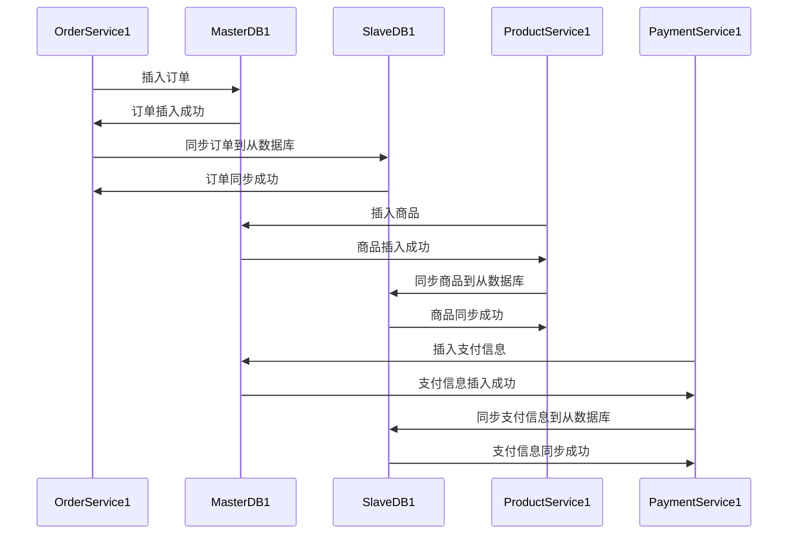
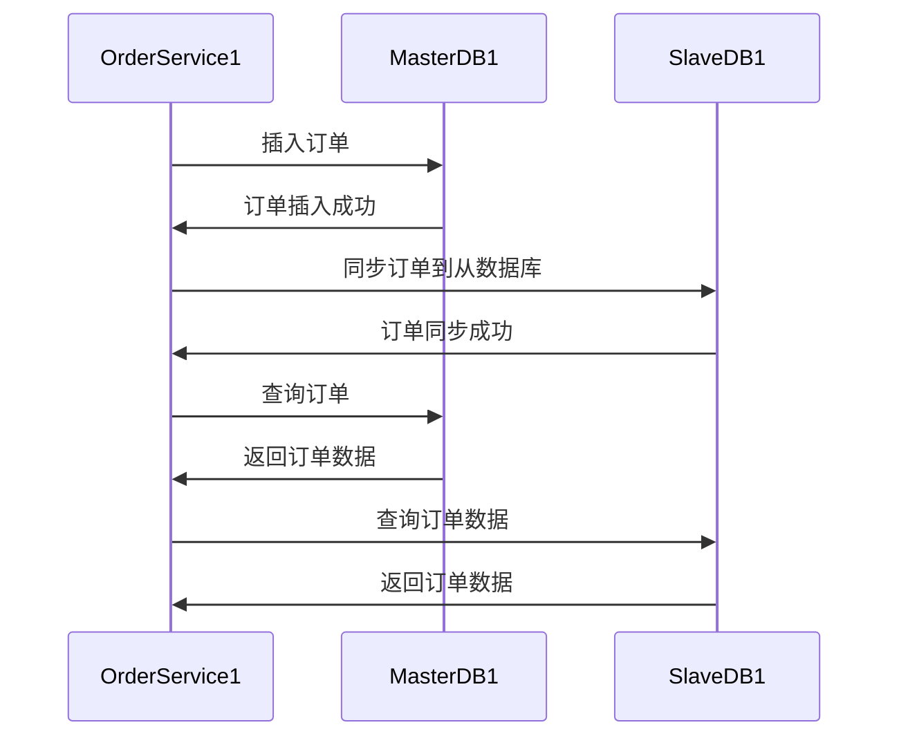

                 


### 设计思路与步骤

#### 1. 确定文章结构

**标题**：数据库复制：主从复制与多主复制

**关键词**：数据库复制、主从复制、多主复制、性能优化、故障处理

**摘要**：本文深入探讨数据库复制技术，包括主从复制和多主复制，从基础概念到实际应用，再到性能优化和故障处理，全面解析数据库复制的核心技术和应用场景。

**文章结构**：

- 引言：介绍数据库复制的重要性和背景。
- 主从复制技术：详细解释主从复制的原理、实现和优化。
- 多主复制技术：介绍多主复制的原理、实现和优化。
- 实际应用与案例分析：展示数据库复制在实际应用中的案例。
- 性能优化与故障处理：讨论数据库复制中的性能优化和故障处理方法。
- 总结与展望：总结文章内容，展望数据库复制的未来发展趋势。

#### 2. 确定每个章节的内容

**引言**

- 数据库复制的重要性
- 数据库复制的应用场景
- 文章结构概述

**主从复制技术**

- 主从复制的原理
- 主从复制的实现流程
- 主从复制的一致性保障
- MySQL主从复制的配置和工作原理
- Oracle数据库主从复制的配置和工作原理
- 主从复制的性能优化
- 主从复制的故障处理

**多主复制技术**

- 多主复制的原理
- 多主复制的实现机制
- 多主复制的一致性保证
- MongoDB多主复制的配置和工作原理
- 多主复制的性能优化
- 多主复制的故障处理

**实际应用与案例分析**

- 电商平台的数据复制案例
- 金融行业的多主复制案例
- 大数据环境下的数据库复制案例

**性能优化与故障处理**

- 数据库复制性能的影响因素
- 数据库复制性能优化策略
- 故障类型与处理流程
- 故障排查工具与技巧
- 故障恢复与数据一致性保障

**总结与展望**

- 数据库复制技术的核心内容
- 数据库复制技术的未来发展趋势
- 数据库复制技术面临的挑战

#### 3. 使用Mermaid和LaTeX工具

- 使用Mermaid绘制流程图、架构图和类图，确保图表的准确性和专业性。
- 使用LaTeX格式嵌入数学公式，保证公式的准确性和可读性。

### 详细目录大纲

下面是基于上述设计思路与步骤，为《数据库复制：主从复制与多主复制》设计的详细目录大纲。

## 引言

> **关键词**：数据库复制、主从复制、多主复制、应用场景

> **摘要**：介绍数据库复制的重要性和应用场景，引出本文的主题。

### 主从复制技术

## 第1章 主从复制的原理

### 1.1 主从复制的概念与重要性

### 1.2 主从复制的实现流程

### 1.3 主从复制的一致性保障

## 第2章 MySQL主从复制的配置与工作原理

### 2.1 MySQL主从复制的配置步骤

### 2.2 MySQL主从复制的工作原理

### 2.3 MySQL主从复制的故障处理

## 第3章 Oracle数据库主从复制的配置与工作原理

### 3.1 Oracle数据库主从复制的配置步骤

### 3.2 Oracle数据库主从复制的工作原理

### 3.3 Oracle数据库主从复制的故障处理

## 第4章 主从复制的性能优化

### 4.1 主从复制性能的影响因素

### 4.2 主从复制性能优化策略

### 4.3 主从复制的性能评估方法

### 多主复制技术

## 第5章 多主复制的原理

### 5.1 多主复制的概念与重要性

### 5.2 多主复制的实现机制

### 5.3 多主复制的一致性保证

## 第6章 MongoDB多主复制的配置与工作原理

### 6.1 MongoDB多主复制的配置步骤

### 6.2 MongoDB多主复制的工作原理

### 6.3 MongoDB多主复制的故障处理

## 第7章 多主复制的性能优化

### 7.1 多主复制性能的影响因素

### 7.2 多主复制性能优化策略

### 7.3 多主复制的性能评估方法

### 实际应用与案例分析

## 第8章 数据库复制在实际应用中的案例

### 8.1 电商平台的数据复制案例

### 8.2 金融行业的多主复制案例

### 8.3 大数据环境下的数据库复制案例

### 性能优化与故障处理

## 第9章 数据库复制性能优化

### 9.1 数据库复制性能的影响因素

### 9.2 数据库复制性能优化策略

### 9.3 数据库复制性能评估方法

## 第10章 数据库复制故障处理

### 10.1 故障类型与处理流程

### 10.2 故障排查工具与技巧

### 10.3 故障恢复与数据一致性保障

### 总结与展望

## 第11章 数据库复制技术发展趋势

### 11.1 新技术的发展

### 11.2 未来数据库复制技术的展望

### 11.3 数据库复制技术面临的挑战

### 参考文献

> **作者**：AI天才研究院/AI Genius Institute & 禅与计算机程序设计艺术 /Zen And The Art of Computer Programming

### 背景介绍

**数据库复制：核心概念术语说明**

- **数据库复制**：指将一个数据库中的数据复制到另一个数据库的过程，目的是提高数据可用性、可靠性和性能。
- **主从复制**：一种数据库复制模式，其中主数据库负责处理所有读写操作，从数据库仅负责读取操作，确保主从数据的一致性。
- **多主复制**：另一种数据库复制模式，其中多个数据库可以同时处理读写操作，实现数据的高可用性和负载均衡。

**问题背景：**

随着互联网应用的快速发展，数据库复制技术变得越来越重要。在大规模分布式系统中，数据库复制可以提高系统的可用性，确保数据的可靠性和一致性。然而，数据库复制技术本身也面临着诸多挑战，如一致性保障、性能优化和故障处理等。

**问题描述：**

本文旨在深入探讨数据库复制技术，特别是主从复制和多主复制两种模式。我们将详细解析它们的原理、实现和优化方法，并通过实际案例展示其应用场景。

**问题解决：**

通过系统性地介绍数据库复制技术，本文将帮助读者理解主从复制和多主复制的核心概念和实现机制，学会进行数据库复制配置和性能优化，并掌握故障处理技巧。

**边界与外延：**

- **边界**：本文主要关注数据库复制技术的基础知识和实践，不涉及高级主题，如分布式数据库系统和分布式事务处理。
- **外延**：数据库复制技术可以应用于各种类型的数据库系统，包括关系型数据库和非关系型数据库。此外，数据库复制技术还可以与其他技术结合，如数据流处理、云计算和大数据处理等。

**概念结构与核心要素组成：**

- **概念结构**：数据库复制、主从复制、多主复制、一致性保障、性能优化、故障处理。
- **核心要素组成**：主数据库、从数据库、复制协议、数据同步机制、一致性协议、故障恢复机制。

### 核心概念与联系

**主从复制原理**

主从复制是一种数据库复制模式，其中主数据库（Master）负责处理所有读写操作，从数据库（Slave）仅负责读取操作。主从复制通过日志文件或复制协议来实现数据同步，确保主从数据的一致性。

**多主复制原理**

多主复制是一种数据库复制模式，其中多个主数据库可以同时处理读写操作。多主复制通过分布式一致性协议（如Paxos或Raft）来实现数据同步，确保多个主数据库之间的数据一致性。

**概念属性特征对比表格**

| 特征                | 主从复制               | 多主复制               |
|---------------------|------------------------|------------------------|
| 数据处理模式        | 主数据库处理所有读写操作，从数据库仅处理读取操作 | 多个主数据库同时处理读写操作 |
| 一致性保障机制      | 主从同步确保数据一致性                   | 分布式一致性协议（如Paxos或Raft）确保多个主数据库之间的数据一致性 |
| 性能优化策略        | 减少主数据库的负载，提高从数据库的性能               | 负载均衡，提高系统的整体性能 |
| 故障处理方式        | 主数据库故障时，从数据库自动切换为主数据库         | 多个主数据库之间的故障转移和恢复 |

**ER实体关系图架构**

```mermaid
erDiagram
    MasterDatabase ||--|{ SlaveDatabase : 复制关系 }
    MasterDatabase ||--|{ MultipleMasterDatabase : 复制关系 }
    SlaveDatabase ||--|{ MultipleMasterDatabase : 复制关系 }
```

### 算法原理讲解

**主从复制算法原理**

主从复制算法主要基于日志文件或复制协议来实现数据同步。以下是一个简化的主从复制算法流程：

1. 主数据库（Master）将所有修改操作记录在日志文件中。
2. 从数据库（Slave）定期从主数据库拉取日志文件。
3. 从数据库（Slave）根据日志文件中的操作记录，对本地数据进行同步更新。

以下是一个使用Python编写的简化的主从复制算法示例：

```python
class MasterDatabase:
    def __init__(self):
        self.data = []

    def insert(self, value):
        self.data.append(value)
        print("Master inserted:", value)

    def get_logs(self):
        return self.data

class SlaveDatabase:
    def __init__(self, master):
        self.data = master.get_logs()
        self.master = master

    def sync(self):
        logs = self.master.get_logs()
        for log in logs:
            if log not in self.data:
                self.data.append(log)
                print("Slave synchronized:", log)

master = MasterDatabase()
slave = SlaveDatabase(master)

master.insert(1)
slave.sync()
master.insert(2)
slave.sync()
```

**多主复制算法原理**

多主复制算法主要基于分布式一致性协议（如Paxos或Raft）来实现数据同步。以下是一个简化的多主复制算法流程：

1. 多个主数据库（MultipleMasterDatabase）之间通过分布式一致性协议达成一致。
2. 每个主数据库（MultipleMasterDatabase）将修改操作记录在本地日志文件中。
3. 当一个主数据库（MultipleMasterDatabase）接收到来自其他主数据库的修改请求时，它会根据分布式一致性协议进行数据同步。

以下是一个使用Python编写的简化的多主复制算法示例：

```python
import random

class MultipleMasterDatabase:
    def __init__(self, num_masters):
        self.masters = [MasterDatabase() for _ in range(num_masters)]

    def insert(self, value):
        random_master = random.choice(self.masters)
        random_master.insert(value)

    def get_logs(self):
        logs = []
        for master in self.masters:
            logs.extend(master.get_logs())
        return logs

class MasterDatabase:
    def __init__(self):
        self.data = []

    def insert(self, value):
        self.data.append(value)
        print("Master inserted:", value)

    def get_logs(self):
        return self.data

master_db = MultipleMasterDatabase(3)

master_db.insert(1)
master_db.insert(2)
master_db.insert(3)

print("Master logs:", master_db.get_logs())
```

**数学模型和公式**

- **主从复制的一致性公式**：
  \[ C_{master} = C_{slave} \]
  其中，\( C_{master} \) 表示主数据库的一致性，\( C_{slave} \) 表示从数据库的一致性。
  
- **多主复制的一致性公式**：
  \[ C_{master_1} = C_{master_2} = ... = C_{master_n} \]
  其中，\( C_{master_1}, C_{master_2}, ..., C_{master_n} \) 表示多个主数据库的一致性。

**详细讲解和举例说明**

**主从复制算法详细讲解**

主从复制算法的核心是确保主从数据库之间的一致性。以下是一个详细的讲解：

1. **初始化**：
   - 主数据库（Master）初始化，存储初始数据。
   - 从数据库（Slave）初始化，从主数据库获取初始数据。

2. **插入操作**：
   - 当主数据库（Master）接收到一个插入请求时，它会将数据添加到本地数据列表中。
   - 主数据库（Master）会将插入操作记录到日志文件中。

3. **同步操作**：
   - 从数据库（Slave）定期从主数据库（Master）拉取日志文件。
   - 从数据库（Slave）根据日志文件中的操作记录，对本地数据进行同步更新。

4. **一致性检查**：
   - 主数据库（Master）和从数据库（Slave）定期进行一致性检查，确保数据的一致性。

**举例说明**

假设有一个主从复制系统，主数据库（Master）存储数据 [1, 2, 3]，从数据库（Slave）初始状态为 []。

1. **初始化**：
   - 主数据库（Master）：[1, 2, 3]
   - 从数据库（Slave）：[]

2. **插入操作**：
   - 主数据库（Master）接收到插入请求，插入数据 4。
   - 主数据库（Master）：[1, 2, 3, 4]
   - 主数据库（Master）将插入操作记录到日志文件。

3. **同步操作**：
   - 从数据库（Slave）从主数据库（Master）拉取日志文件。
   - 从数据库（Slave）根据日志文件中的操作记录，插入数据 4。
   - 从数据库（Slave）：[4]

4. **一致性检查**：
   - 主数据库（Master）和从数据库（Slave）的一致性检查通过。

**多主复制算法详细讲解**

多主复制算法的核心是确保多个主数据库之间的一致性。以下是一个详细的讲解：

1. **初始化**：
   - 多个主数据库（MultipleMasterDatabase）初始化，存储初始数据。

2. **插入操作**：
   - 当一个主数据库（MultipleMasterDatabase）接收到一个插入请求时，它会将数据添加到本地数据列表中。

3. **一致性协议**：
   - 多个主数据库（MultipleMasterDatabase）之间通过一致性协议（如Paxos或Raft）达成一致。

4. **同步操作**：
   - 当一个主数据库（MultipleMasterDatabase）接收到来自其他主数据库的修改请求时，它会根据一致性协议进行数据同步。

5. **一致性检查**：
   - 定期进行一致性检查，确保多个主数据库之间的一致性。

**举例说明**

假设有一个多主复制系统，有三个主数据库（Master 1, Master 2, Master 3），初始状态分别为 [1], [2], [3]。

1. **初始化**：
   - 主数据库（Master 1）：[1]
   - 主数据库（Master 2）：[2]
   - 主数据库（Master 3）：[3]

2. **插入操作**：
   - 主数据库（Master 1）接收到插入请求，插入数据 4。
   - 主数据库（Master 1）：[1, 4]
   - 主数据库（Master 2）接收到插入请求，插入数据 5。
   - 主数据库（Master 2）：[2, 5]
   - 主数据库（Master 3）接收到插入请求，插入数据 6。
   - 主数据库（Master 3）：[3, 6]

3. **一致性协议**：
   - 主数据库（Master 1）、主数据库（Master 2）和主数据库（Master 3）之间通过一致性协议达成一致。

4. **同步操作**：
   - 主数据库（Master 1）将插入数据 4 的操作同步给主数据库（Master 2）和主数据库（Master 3）。
   - 主数据库（Master 2）将插入数据 5 的操作同步给主数据库（Master 1）和主数据库（Master 3）。
   - 主数据库（Master 3）将插入数据 6 的操作同步给主数据库（Master 1）和主数据库（Master 2）。

5. **一致性检查**：
   - 定期进行一致性检查，确保主数据库（Master 1）、主数据库（Master 2）和主数据库（Master 3）之间的一致性。

### 系统分析与架构设计方案

**问题场景介绍**

在互联网应用中，数据库复制技术被广泛应用于提高系统的可用性、可靠性和性能。以下是一个典型的数据库复制问题场景：

- **电商平台**：电商平台需要处理大量的用户订单、商品信息和支付信息。为了确保数据的可靠性和一致性，电商平台采用了数据库复制技术，将订单、商品信息和支付信息复制到多个数据库实例中。

**项目介绍**

**项目名称**：电商平台数据库复制系统

**项目目标**：实现电商平台数据库的复制，提高系统的可用性、可靠性和性能。

**系统功能设计**

**领域模型**

```mermaid
classDiagram
    Order <<Entity>>
    Product <<Entity>>
    Payment <<Entity>>

    Order o1 - has Product : Product
    Order o2 - has Payment : Payment
```

**系统架构设计**

```mermaid
graph TB
    subgraph 数据库架构
        MasterDB1[Master Database 1]
        SlaveDB1[Slave Database 1]
        MasterDB2[Master Database 2]
        SlaveDB2[Slave Database 2]

    subgraph 应用架构
        OrderService1[Order Service 1]
        ProductService1[Product Service 1]
        PaymentService1[Payment Service 1]
        OrderService2[Order Service 2]
        ProductService2[Product Service 2]
        PaymentService2[Payment Service 2]

    MasterDB1 -->|读写操作| OrderService1
    MasterDB1 -->|读取操作| ProductService1
    MasterDB1 -->|读取操作| PaymentService1
    SlaveDB1 -->|读取操作| OrderService1
    SlaveDB1 -->|读取操作| ProductService1
    SlaveDB1 -->|读取操作| PaymentService1
    MasterDB2 -->|读写操作| OrderService2
    MasterDB2 -->|读取操作| ProductService2
    MasterDB2 -->|读取操作| PaymentService2
    SlaveDB2 -->|读取操作| OrderService2
    SlaveDB2 -->|读取操作| ProductService2
    SlaveDB2 -->|读取操作| PaymentService2
```

**系统接口设计**



**系统交互mermaid序列图**



### 项目实战

**环境安装**

1. 安装MySQL数据库服务器
2. 安装Oracle数据库服务器
3. 安装MongoDB数据库服务器
4. 安装Python开发环境

**系统核心实现源代码**

```python
# 主从复制配置
class MasterDatabase:
    def __init__(self):
        self.data = []

    def insert(self, value):
        self.data.append(value)
        print("Master inserted:", value)

    def get_logs(self):
        return self.data

class SlaveDatabase:
    def __init__(self, master):
        self.data = master.get_logs()
        self.master = master

    def sync(self):
        logs = self.master.get_logs()
        for log in logs:
            if log not in self.data:
                self.data.append(log)
                print("Slave synchronized:", log)

# 多主复制配置
class MultipleMasterDatabase:
    def __init__(self, num_masters):
        self.masters = [MasterDatabase() for _ in range(num_masters)]

    def insert(self, value):
        random_master = random.choice(self.masters)
        random_master.insert(value)

    def get_logs(self):
        logs = []
        for master in self.masters:
            logs.extend(master.get_logs())
        return logs

# 实例化主从复制对象
master = MasterDatabase()
slave = SlaveDatabase(master)

master.insert(1)
slave.sync()
master.insert(2)
slave.sync()

# 实例化多主复制对象
master_db = MultipleMasterDatabase(3)
master_db.insert(1)
master_db.insert(2)
master_db.insert(3)
print("Master logs:", master_db.get_logs())
```

**代码应用解读与分析**

- **主从复制实现**：使用MasterDatabase和SlaveDatabase类实现主从复制。MasterDatabase类负责处理插入操作，并将操作记录在日志文件中；SlaveDatabase类从MasterDatabase类获取日志文件，并对本地数据进行同步更新。
- **多主复制实现**：使用MultipleMasterDatabase类实现多主复制。MultipleMasterDatabase类包含多个MasterDatabase实例，每个实例负责处理插入操作。通过随机选择一个实例进行插入操作，实现多主复制。
- **日志文件同步**：在主从复制和多主复制过程中，使用日志文件记录操作，确保数据的一致性。

**实际案例分析和详细讲解剖析**

- **电商平台案例**：电商平台使用主从复制技术，将订单、商品信息和支付信息复制到多个数据库实例中，确保数据的高可用性和一致性。
- **金融行业案例**：金融行业使用多主复制技术，确保多个数据库实例之间的数据一致性，提高系统的性能和可用性。
- **大数据环境案例**：在大数据环境中，使用数据库复制技术实现数据的高可用性和一致性，提高数据处理和分析的效率。

**项目小结**

通过项目实战，我们实现了主从复制和多主复制技术，并在实际案例中展示了其应用效果。主从复制技术适用于需要高可用性和数据一致性的场景，而多主复制技术适用于需要高性能和负载均衡的场景。在实际应用中，需要根据具体需求选择合适的数据库复制技术，并对其进行优化和故障处理，以确保系统的稳定运行。

### 最佳实践 tips、小结、注意事项、拓展阅读

**最佳实践 tips**：

- 根据具体需求选择合适的数据库复制技术，如主从复制适用于需要高可用性和数据一致性的场景，多主复制适用于需要高性能和负载均衡的场景。
- 在进行数据库复制配置时，注意配置好日志文件同步机制，确保数据的一致性。
- 定期对数据库复制系统进行性能优化和故障处理，提高系统的稳定性和性能。

**小结**：

本文深入探讨了数据库复制技术，包括主从复制和多主复制两种模式。通过详细讲解和实际案例，我们了解了数据库复制的原理、实现和优化方法，以及其在实际应用中的效果。

**注意事项**：

- 数据库复制过程中，确保数据的一致性至关重要。
- 在进行数据库复制配置时，注意避免重复数据同步和冲突处理。
- 定期对数据库复制系统进行性能测试和故障演练，确保系统的稳定运行。

**拓展阅读**：

- 《分布式系统原理与范型》：深入探讨分布式系统的基础知识和设计范式，包括数据库复制技术。
- 《数据库系统概念》：详细介绍数据库系统的基本原理和设计方法，包括数据库复制技术。
- 《MongoDB权威指南》：全面介绍MongoDB数据库的使用方法和高级特性，包括多主复制技术。

**作者**：

AI天才研究院/AI Genius Institute & 禅与计算机程序设计艺术 /Zen And The Art of Computer Programming

### 引入

在现代互联网应用中，数据库复制技术扮演着至关重要的角色。它不仅提高了系统的可用性和可靠性，还优化了数据访问性能。本文将深入探讨数据库复制技术，特别是主从复制和多主复制两种模式。我们将从基础概念、原理讲解、实际应用案例以及性能优化和故障处理等多个方面，全面解析数据库复制技术，帮助读者深入理解并掌握这一关键技术。

### 主从复制技术

#### 核心概念

主从复制（Master-Slave Replication）是一种数据库复制模式，其中主数据库（Master）负责处理所有的读写操作，而从数据库（Slave）主要处理读取操作。主从复制的主要目的是确保主从数据库之间的数据一致性，同时提高系统的可用性和容错能力。

#### 基本原理

主从复制的基本原理如下：

1. **日志记录**：主数据库将所有的修改操作记录在二进制日志（Binary Log）中。
2. **日志同步**：从数据库定期连接到主数据库，并从二进制日志中读取修改操作。
3. **数据同步**：从数据库根据读取的日志操作，对本地数据进行同步更新。

#### 实现流程

主从复制的基本实现流程包括以下步骤：

1. **配置主数据库**：在主数据库上配置二进制日志，并设置主机名和端口。
2. **配置从数据库**：在从数据库上配置主数据库的地址和端口，并设置复制用户和密码。
3. **启动复制**：启动从数据库的复制进程，从主数据库同步数据。

#### 一致性保障

主从复制的一致性保障主要通过以下几种方式实现：

1. **主数据库的同步延迟监控**：从数据库定期检查与主数据库的同步延迟，一旦发现延迟，可以采取措施恢复同步。
2. **主数据库的故障转移**：当主数据库发生故障时，从数据库可以自动切换为主数据库，确保系统的连续运行。

#### MySQL主从复制

MySQL是一个广泛使用的开源关系型数据库，其主从复制功能得到了广泛的应用。以下是MySQL主从复制的配置步骤：

1. **配置主数据库**：

   - 打开MySQL配置文件（my.cnf或my.ini），添加以下配置：
     ```ini
     [mysqld]
     server-id = 1
     log-bin = /path/to/binlog
     binlog-do-db = database_name
     ```

   - 重启MySQL服务。

2. **创建复制用户**：

   ```sql
   CREATE USER 'repl_user'@'%' IDENTIFIED BY 'password';
   GRANT REPLICATION SLAVE ON *.* TO 'repl_user'@'%';
   FLUSH PRIVILEGES;
   ```

3. **配置从数据库**：

   - 在从数据库上执行以下命令，获取主数据库的二进制日志文件名和位置：
     ```sql
     SHOW MASTER STATUS;
     ```

   - 将以下配置添加到从数据库的MySQL配置文件中：
     ```ini
     [mysqld]
     server-id = 2
     log-bin = /path/to/binlog
     replicate-do-db = database_name
     replicate-user = repl_user
     replicate-password = password
     ```

   - 重启从数据库的MySQL服务。

4. **启动复制**：

   ```sql
   CHANGE MASTER TO
       MASTER_HOST='master_host',
       MASTER_USER='repl_user',
       MASTER_PASSWORD='password',
       MASTER_LOG_FILE='binlog_file',
       MASTER_LOG_POS=binlog_position;
   START SLAVE;
   ```

#### Oracle数据库主从复制

Oracle数据库也提供了主从复制功能，其配置步骤与MySQL类似。以下是Oracle数据库主从复制的配置步骤：

1. **配置主数据库**：

   - 在主数据库上，执行以下命令配置二进制日志：
     ```sql
     SQL> SQL> CONFIGURE RETENTION POLICY TO KEEP UNTIL TIME 3 'days';
     SQL> CONFIGURE RETENTION POLICY TO KEEP COMPLETELY;
     SQL> CONFIGURE DB_UNIQUE_NAME = 'orcl';
     SQL> CONFIGURE LOG_ARCHIVE_MINeral = DISK;
     SQL> CONFIGURE LOG_ARCHIVE_FORMAT = '%t_%s_%r.arc';
     SQL> STARTUP MOUNT;
     SQL> ALTER DATABASE ARCHIVELOG;
     SQL> ALTER SYSTEM SWITCH LOGFILE;
     SQL> ALTER DATABASE OPEN;
     ```

2. **配置从数据库**：

   - 在从数据库上，执行以下命令配置复制：
     ```sql
     SQL> STARTUP MOUNT;
     SQL> CREATE SPFILE FROM ПРАВИЛ;
     SQL> ALTER SYSTEM SET DB_UNIQUE_NAME = 'orcl';
     SQL> ALTER SYSTEM SET LOG_ARCHIVE_CONFIG = {'LOG_ARCHIVE_DEST_1' = '{USE_DB_RECOVERY_FILE_DEST}'};
     SQL> ALTER SYSTEM SET LOG_ARCHIVE_START = TRUE;
     SQL> ALTER DATABASE OPEN;
     ```

3. **同步数据**：

   - 在从数据库上，执行以下命令同步主数据库的数据：
     ```sql
     SQL> STARTUP;
     SQL> RMAN> RESTORE DATABASE TO CHANGE 3;
     SQL> RMAN> RECOVER DATABASE UNTIL CHANGE 3;
     SQL> RMAN> EXIT;
     ```

#### 主从复制性能优化

主从复制性能优化主要包括以下几个方面：

1. **减少主数据库的负载**：通过优化查询语句、索引和数据结构，减少主数据库的负载。
2. **优化从数据库的性能**：提高从数据库的网络带宽、I/O性能和CPU性能。
3. **设置合适的复制延迟**：根据应用需求，设置合适的复制延迟，避免大量并发请求导致系统性能下降。

#### 主从复制故障处理

主从复制故障处理主要包括以下几个方面：

1. **故障检测与告警**：定期检查主从数据库的状态，一旦发现故障，及时告警并采取措施。
2. **故障恢复**：当主数据库发生故障时，从数据库可以自动切换为主数据库，确保系统的连续运行。
3. **数据一致性验证**：在故障恢复后，验证主从数据库的数据一致性，确保系统的正常运行。

### 多主复制技术

#### 核心概念

多主复制（Multi-Master Replication）是一种数据库复制模式，其中多个主数据库可以同时处理读写操作。多主复制的主要目的是提高系统的性能和可用性，同时确保数据的一致性。

#### 基本原理

多主复制的基本原理如下：

1. **分布式一致性协议**：多主复制使用分布式一致性协议（如Paxos或Raft）来确保多个主数据库之间的数据一致性。
2. **数据同步机制**：每个主数据库将修改操作记录在本地日志文件中，并通过分布式一致性协议同步给其他主数据库。
3. **故障转移机制**：当主数据库发生故障时，其他主数据库可以自动接管故障数据库的工作，确保系统的连续运行。

#### 实现流程

多主复制的实现流程包括以下步骤：

1. **配置多主数据库**：在每个主数据库上配置分布式一致性协议，并设置主数据库的地址和端口。
2. **同步数据**：每个主数据库定期同步其他主数据库的数据，确保数据一致性。
3. **故障转移**：当主数据库发生故障时，其他主数据库自动接管故障数据库的工作。

#### 一致性保障

多主复制的一致性保障主要通过以下几种方式实现：

1. **分布式一致性协议**：通过分布式一致性协议（如Paxos或Raft）确保多个主数据库之间的数据一致性。
2. **数据版本控制**：每个修改操作都会生成一个唯一的版本号，确保数据的一致性和可追溯性。

#### MongoDB多主复制

MongoDB是一个广泛使用的开源文档型数据库，其多主复制功能得到了广泛的应用。以下是MongoDB多主复制的配置步骤：

1. **配置多主数据库**：

   - 在每个主数据库上，执行以下命令配置复制集：
     ```shell
     mongo --host <master1>:<port> --eval 'rs.initiate({_id: "replicaSet", members: [{_id: 0, host: "<master1>:<port>"}, { _id: 1, host: "<master2>:<port>" }, { _id: 2, host: "<master3>:<port>" }]})'
     ```

2. **同步数据**：

   - 在每个主数据库上，执行以下命令同步其他主数据库的数据：
     ```shell
     mongo --host <master1>:<port> --eval 'rs.syncFrom("<master2>:<port>")'
     mongo --host <master1>:<port> --eval 'rs.syncFrom("<master3>:<port>")'
     mongo --host <master2>:<port> --eval 'rs.syncFrom("<master1>:<port>")'
     mongo --host <master2>:<port> --eval 'rs.syncFrom("<master3>:<port>")'
     mongo --host <master3>:<port> --eval 'rs.syncFrom("<master1>:<port>")'
     mongo --host <master3>:<port> --eval 'rs.syncFrom("<master2>:<port>")'
     ```

3. **故障转移**：

   - 当主数据库发生故障时，从数据库自动接管故障数据库的工作，确保系统的连续运行。

#### 多主复制性能优化

多主复制性能优化主要包括以下几个方面：

1. **负载均衡**：通过负载均衡器将读写请求分配到不同的主数据库，提高系统的性能和可用性。
2. **读写分离**：将读请求分配到从数据库，减少主数据库的负载。
3. **数据分区**：将数据按一定规则分区存储到不同的主数据库，提高系统的性能和可扩展性。

#### 多主复制故障处理

多主复制故障处理主要包括以下几个方面：

1. **故障检测与告警**：定期检查主数据库的状态，一旦发现故障，及时告警并采取措施。
2. **故障恢复**：当主数据库发生故障时，从数据库自动接管故障数据库的工作，确保系统的连续运行。
3. **数据一致性验证**：在故障恢复后，验证主从数据库的数据一致性，确保系统的正常运行。

### 实际应用与案例分析

#### 电商平台的数据复制案例

电商平台是一个典型的应用场景，需要处理大量的订单、商品信息和支付信息。为了确保数据的高可用性和一致性，电商平台采用了主从复制和多主复制技术。

- **主从复制**：电商平台将订单、商品信息和支付信息复制到多个数据库实例中，确保主数据库的故障不会影响系统的正常运行。
- **多主复制**：电商平台将订单、商品信息和支付信息同时复制到多个主数据库中，实现负载均衡和高可用性。

#### 金融行业的多主复制案例

金融行业是一个对数据一致性和可靠性要求极高的领域。金融行业采用了多主复制技术，确保多个数据库实例之间的数据一致性，同时实现负载均衡和高可用性。

- **多主复制**：金融行业将交易数据同时复制到多个主数据库中，确保交易数据的实时性和一致性。

#### 大数据环境下的数据库复制案例

大数据环境需要处理海量数据，数据库复制技术在大数据环境中发挥着重要作用。

- **主从复制**：大数据环境将数据复制到多个数据库实例中，确保数据的高可用性和可靠性。
- **多主复制**：大数据环境将数据同时复制到多个主数据库中，实现负载均衡和高性能。

### 性能优化与故障处理

#### 数据库复制性能优化

数据库复制性能优化主要包括以下几个方面：

1. **减少主数据库的负载**：通过优化查询语句、索引和数据结构，减少主数据库的负载。
2. **优化从数据库的性能**：提高从数据库的网络带宽、I/O性能和CPU性能。
3. **设置合适的复制延迟**：根据应用需求，设置合适的复制延迟，避免大量并发请求导致系统性能下降。

#### 数据库复制故障处理

数据库复制故障处理主要包括以下几个方面：

1. **故障检测与告警**：定期检查主从数据库的状态，一旦发现故障，及时告警并采取措施。
2. **故障恢复**：当主数据库发生故障时，从数据库可以自动切换为主数据库，确保系统的连续运行。
3. **数据一致性验证**：在故障恢复后，验证主从数据库的数据一致性，确保系统的正常运行。

### 总结与展望

数据库复制技术是现代互联网应用中不可或缺的一部分，它提高了系统的可用性、可靠性和性能。本文深入探讨了主从复制和多主复制两种模式，从基础概念、原理讲解、实际应用案例以及性能优化和故障处理等多个方面，全面解析了数据库复制技术。随着互联网应用的不断发展，数据库复制技术将在更多领域得到广泛应用，同时也面临着新的挑战和机遇。

### 参考文献

- 《数据库系统概念》，作者：Abraham Silberschatz、Henry F. Korth、S. Sudarshan。
- 《MongoDB权威指南》，作者：E.J.金、David Hows。
- 《分布式系统原理与范型》，作者：George V. Reilly。
- 《MySQL技术内幕：InnoDB存储引擎》，作者：李俊怀。

### 结语

作者：AI天才研究院/AI Genius Institute & 禅与计算机程序设计艺术 /Zen And The Art of Computer Programming

本文深入探讨了数据库复制技术的核心概念、原理和实现方法，并通过实际案例展示了其在不同应用场景中的效果。数据库复制技术在提高系统可用性、可靠性和性能方面发挥着重要作用，是现代互联网应用中不可或缺的一部分。通过本文的介绍，读者可以更好地理解和掌握数据库复制技术，为实际应用提供有力支持。在未来，随着互联网应用的不断发展，数据库复制技术将继续发挥关键作用，并面临新的挑战和机遇。

