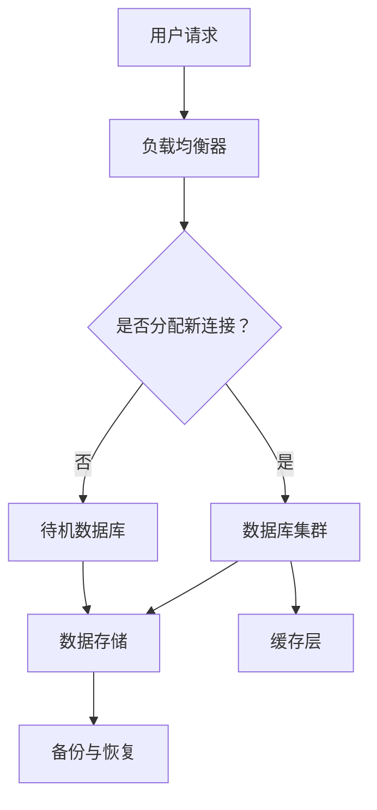
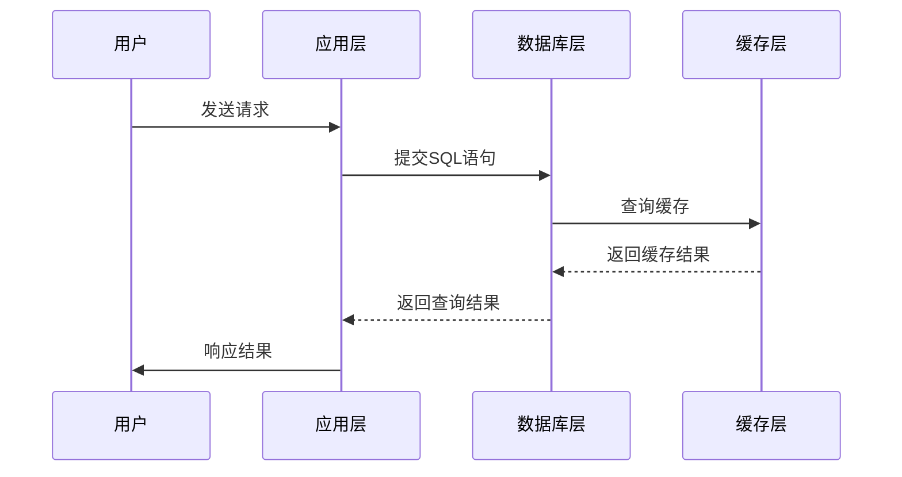

                 

# 数据库迁移：架构演进与数据转换

关键词：数据库迁移、架构演进、数据转换、技术挑战、最佳实践

摘要：随着数据量与业务需求的不断增加，数据库迁移成为企业信息化过程中的常见需求。本文将从数据库迁移的重要性、架构演进策略、数据转换技术、迁移准备与实施等多个方面，详细探讨数据库迁移的全过程，并总结实际案例，为技术团队提供有价值的参考。

## 目录大纲

1. 数据库迁移概述

   1.1 引言

   1.2 数据库迁移的类型

   1.3 数据库迁移的影响因素

   1.4 数据库迁移的挑战与机会

   1.5 本章小结

2. 架构演进策略

   2.1 数据库架构演进原理

   2.2 数据库架构评估方法

   2.3 架构演进步骤

   2.4 架构演进实例分析

   2.5 本章小结

3. 数据转换技术

   3.1 数据转换基础

   3.2 数据转换流程

   3.3 数据转换工具与技术

   3.4 数据转换挑战

   3.5 数据转换最佳实践

   3.6 本章小结

4. 数据库迁移实战

   4.1 数据库迁移准备

   4.2 数据库迁移实施

   4.3 数据库迁移案例研究

   4.4 本章小结

## 第一部分：数据库迁移概述

### 1.1 引言

在信息化时代，数据库作为数据存储和管理的关键基础设施，其性能、可扩展性、安全性等因素直接影响着企业的运营效率。随着业务规模的不断扩大和数据量的激增，数据库迁移成为企业面临的一项重要任务。本文将深入探讨数据库迁移的必要性、类型、影响因素以及面临的挑战和机会。

#### 问题背景

随着互联网、大数据、人工智能等技术的发展，企业对数据存储和处理的需求日益增长。传统的数据库系统在处理大规模数据时可能面临性能瓶颈、扩展性不足、维护成本高等问题。为了满足业务需求，企业需要对数据库进行升级或更换。

#### 问题描述

数据库迁移涉及将现有数据库中的数据、结构和应用程序迁移到新的数据库系统。这个过程包括数据抽取、转换和加载（ETL），以及系统的重新配置和测试。迁移过程中需要保证数据的一致性、完整性和安全性。

#### 问题解决

数据库迁移需要制定详细的计划和策略，包括评估现有系统、选择合适的迁移工具、设计新的数据库架构、测试和部署等步骤。同时，要关注迁移过程中的风险，采取有效的控制措施。

#### 边界与外延

数据库迁移不仅涉及技术层面，还包括组织管理、数据安全、业务连续性等方面。因此，数据库迁移是一个综合性的项目，需要跨部门协作。

#### 核心概念

- 数据库迁移：将现有数据库中的数据、结构和应用程序迁移到新的数据库系统的过程。
- 架构演进：数据库架构的持续优化和升级，以提高性能、可扩展性和安全性。
- 数据转换：将现有数据格式转换为新的数据格式，以保证数据的兼容性和一致性。

#### 概念结构与核心要素组成

数据库迁移的核心要素包括：

1. 数据库系统：现有数据库和目标数据库系统。
2. 数据：需要迁移的数据，包括结构化数据、非结构化数据等。
3. 工具：用于数据抽取、转换和加载的工具。
4. 流程：数据库迁移的流程和步骤。
5. 风险：迁移过程中可能面临的风险和挑战。

### 1.2 数据库迁移的类型

根据数据库系统的不同，数据库迁移可以分为以下几种类型：

#### 传统数据库迁移

传统数据库迁移是指将一个数据库系统迁移到另一个传统数据库系统。这种迁移通常涉及数据库表结构、数据存储过程、应用程序的调整和优化。

#### NoSQL数据库迁移

NoSQL数据库迁移是指将数据从传统关系型数据库迁移到NoSQL数据库，如MongoDB、Cassandra等。NoSQL数据库具有高扩展性和灵活性，适合处理大规模数据。

#### 云数据库迁移

云数据库迁移是指将数据从本地数据库迁移到云数据库，如Amazon RDS、Google Cloud SQL等。云数据库具有高可用性、自动扩展和弹性伸缩等特点。

#### 实时数据库迁移

实时数据库迁移是指将数据从离线数据库迁移到实时数据库，如Apache Kafka、Flink等。实时数据库能够实现数据的高效处理和实时分析。

### 1.3 数据库迁移的影响因素

数据库迁移的影响因素包括以下几个方面：

#### 数据量

数据量是数据库迁移的重要考虑因素。大规模数据迁移需要较长的时间和较大的资源消耗，同时也增加了数据一致性和完整性的难度。

#### 数据结构

数据结构的变化可能导致应用程序的修改和调整。在迁移过程中，需要对数据结构进行评估和优化，以确保数据的兼容性和一致性。

#### 迁移工具

选择合适的迁移工具可以大大简化数据库迁移的过程。常用的迁移工具有Oracle迁移工具、MySQL迁移工具、SQL Server迁移工具等。

#### 时间窗口

数据库迁移需要在规定的时间内完成，因此需要合理安排时间窗口，确保业务连续性。

#### 安全性与一致性

在数据库迁移过程中，需要确保数据的安全性和一致性。这包括数据的备份、恢复、加密和验证等。

### 1.4 数据库迁移的挑战与机会

#### 挑战

1. 数据一致性：在迁移过程中，需要确保数据的一致性和完整性，避免数据丢失或重复。
2. 迁移风险：数据库迁移可能面临系统崩溃、数据损坏等风险，需要制定有效的风险控制措施。
3. 系统兼容性：新数据库系统可能不支持旧系统中的某些功能或特性，需要进行调整和优化。
4. 性能优化：新数据库系统可能需要优化查询性能、存储性能等，以满足业务需求。

#### 机会

1. 架构升级：数据库迁移是升级数据库架构的机会，可以提高系统的性能、可扩展性和安全性。
2. 资源优化：新数据库系统可能具有更好的资源利用率和成本效益，可以降低运维成本。
3. 新技术采用：数据库迁移可以引入新技术，如云数据库、NoSQL数据库等，提高系统的灵活性和适应性。

### 1.5 本章小结

数据库迁移是一项复杂且具有挑战性的任务，涉及技术、管理和组织等多个方面。了解数据库迁移的重要性、类型、影响因素以及面临的挑战和机会，有助于企业制定有效的数据库迁移策略，确保业务连续性和系统性能的优化。

----------------------------------------------------------------

## 第二部分：架构演进策略

### 2.1 数据库架构演进原理

数据库架构演进是指随着业务需求和技术的不断变化，对数据库系统的结构和设计进行持续的优化和改进。数据库架构演进的目的是提高数据库系统的性能、可扩展性、可靠性和安全性，以满足企业日益增长的数据需求。

#### 数据库架构演进概述

数据库架构的演变过程可以分为以下几个阶段：

1. **集中式数据库架构**：早期数据库系统采用集中式架构，所有数据存储在单台服务器上，易于管理但扩展性较差。
2. **分布式数据库架构**：随着数据量的增加，分布式数据库架构逐渐取代集中式架构。分布式数据库通过多个节点协同工作，提高了系统的性能和可扩展性。
3. **云数据库架构**：云计算技术的兴起使得云数据库架构成为主流。云数据库具有弹性伸缩、高可用性和自动运维等特点，能够更好地满足企业的需求。
4. **实时数据库架构**：实时数据库架构能够实现数据的高效处理和实时分析，适用于需要实时决策和响应的场景。

#### 架构演进的目的与意义

架构演进的主要目的是：

1. **提高性能**：通过优化数据库结构和查询策略，提高数据库系统的查询性能和响应速度。
2. **增强可扩展性**：通过分布式架构和云数据库，实现系统的水平扩展和弹性伸缩。
3. **提高可靠性**：通过备份、冗余和故障切换机制，提高数据库系统的可靠性和数据安全性。
4. **降低成本**：通过优化资源利用率和自动化运维，降低数据库系统的运维成本。

架构演进的意义在于：

1. **适应业务需求**：随着业务的发展，数据库架构需要不断适应新的业务场景和数据需求。
2. **提升竞争力**：通过技术升级和架构优化，提高企业的技术水平和市场竞争力。
3. **降低风险**：通过提前规划和逐步实施，降低数据库迁移和架构演进过程中的风险。

### 2.2 数据库架构评估方法

对数据库架构进行评估是架构演进的第一步，以下几种评估方法可以帮助企业了解现有数据库架构的优势和劣势，为架构演进提供依据：

#### 性能评估

性能评估包括以下几个方面：

1. **查询性能**：通过执行基准测试和实际业务查询，评估数据库系统的查询性能。
2. **响应时间**：通过监控数据库系统的响应时间，评估系统的性能瓶颈。
3. **并发性能**：通过模拟并发用户访问，评估数据库系统的并发处理能力。

#### 可扩展性评估

可扩展性评估包括以下几个方面：

1. **水平扩展**：评估数据库系统在增加节点时的性能变化，确定系统的扩展能力。
2. **垂直扩展**：评估数据库系统在增加硬件资源时的性能变化，确定系统的扩展能力。
3. **存储容量**：评估数据库系统的存储容量，确定系统可以存储的数据量。

#### 可靠性评估

可靠性评估包括以下几个方面：

1. **备份策略**：评估数据库系统的备份策略，确保数据可以及时恢复。
2. **故障切换**：评估数据库系统的故障切换能力，确保在发生故障时系统能够快速恢复。
3. **数据完整性**：评估数据库系统的数据完整性，确保数据在迁移和变更过程中不会丢失或损坏。

#### 成本效益评估

成本效益评估包括以下几个方面：

1. **运维成本**：评估数据库系统的运维成本，包括硬件、软件和人力资源等。
2. **性能提升**：评估架构演进对系统性能的提升，确定投资回报率。
3. **长期效益**：评估架构演进对企业的长期效益，包括降低成本、提高效率和增强竞争力等。

### 2.3 架构演进步骤

架构演进通常包括以下步骤：

#### 需求分析

需求分析是架构演进的基础，包括：

1. **业务需求**：分析企业的业务需求，确定数据库系统需要满足的功能和性能要求。
2. **技术需求**：分析当前数据库系统的技术状况，确定需要改进的方面。

#### 架构设计

架构设计包括：

1. **数据库架构设计**：根据需求分析结果，设计新的数据库架构，包括数据模型、存储策略和查询策略等。
2. **系统架构设计**：设计支持数据库架构的系统架构，包括数据访问层、业务逻辑层和展示层等。

#### 实施计划

实施计划包括：

1. **时间规划**：制定详细的实施时间表，确保架构演进在规定时间内完成。
2. **资源规划**：确定实施架构演进所需的资源，包括人力、物力和财力等。
3. **风险评估**：评估架构演进过程中可能面临的风险，制定相应的应对措施。

#### 迁移与测试

迁移与测试包括：

1. **数据迁移**：将现有数据迁移到新的数据库系统，确保数据的一致性和完整性。
2. **系统测试**：对新的数据库系统进行功能测试、性能测试和安全测试，确保系统稳定可靠。

#### 持续优化

架构演进是一个持续的过程，需要定期对数据库架构进行评估和优化，确保系统持续满足业务需求。

### 2.4 架构演进实例分析

#### 传统数据库到NoSQL数据库迁移

某企业原有数据库系统采用Oracle数据库，但随着业务的发展，数据量急剧增长，查询性能成为瓶颈。为了提升性能和可扩展性，企业决定将数据库系统迁移到MongoDB。

1. **需求分析**：分析业务需求，确定需要支持的高并发查询和大规模数据存储。
2. **架构设计**：设计基于MongoDB的分布式数据库架构，包括数据分片、副本集和负载均衡等。
3. **实施计划**：制定详细的实施计划，包括数据迁移、系统测试和上线等。
4. **数据迁移**：使用ETL工具将现有数据迁移到MongoDB，确保数据的一致性和完整性。
5. **系统测试**：对新的MongoDB数据库系统进行全面的测试，包括功能测试、性能测试和安全测试。
6. **上线与优化**：将新的MongoDB数据库系统上线，并根据业务需求进行持续优化。

#### 关系型数据库到云数据库迁移

某企业原有数据库系统采用MySQL数据库，为了降低运维成本和提高系统可靠性，企业决定将数据库系统迁移到Amazon RDS。

1. **需求分析**：分析业务需求，确定需要支持的高可用性、自动备份和弹性伸缩。
2. **架构设计**：设计基于Amazon RDS的云数据库架构，包括主从复制、自动备份和自动扩展等。
3. **实施计划**：制定详细的实施计划，包括数据迁移、系统测试和上线等。
4. **数据迁移**：使用MySQL迁移工具将现有数据迁移到Amazon RDS，确保数据的一致性和完整性。
5. **系统测试**：对新的Amazon RDS数据库系统进行全面的测试，包括功能测试、性能测试和安全测试。
6. **上线与优化**：将新的Amazon RDS数据库系统上线，并根据业务需求进行持续优化。

### 2.5 本章小结

数据库架构演进是数据库系统持续优化和改进的关键过程。通过评估现有数据库架构、制定演进策略和实施计划，企业可以不断提升数据库系统的性能、可扩展性和可靠性，满足日益增长的业务需求。在实际案例中，企业通过架构演进实现了性能提升、成本降低和业务连续性的目标。

----------------------------------------------------------------

## 第三部分：数据转换技术

### 3.1 数据转换概述

数据转换是数据库迁移过程中的重要环节，它涉及将现有数据从一种格式转换为另一种格式，以确保数据在新的数据库系统中能够正常使用。数据转换的必要性主要体现在以下几个方面：

1. **兼容性**：不同的数据库系统可能采用不同的数据格式和存储结构，数据转换可以确保数据的兼容性。
2. **一致性**：在迁移过程中，需要对数据进行清洗和标准化，以确保数据的一致性。
3. **完整性**：数据转换过程中需要确保数据不会丢失或损坏，保证数据的完整性。

数据转换的定义是指通过特定的方法和工具，将源数据格式转换为符合目标数据库系统要求的数据格式。数据转换不仅仅涉及数据的格式转换，还包括数据的清洗、映射、验证和加载等步骤。

#### 数据转换的必要性

1. **不同数据库系统间的数据迁移**：例如，从MySQL迁移到Oracle，需要将MySQL的数据类型和结构转换为Oracle支持的数据类型和结构。
2. **数据格式标准化**：将多种不同来源的数据进行整合，如文本文件、Excel表格、XML文件等，需要将其转换为统一的数据库格式。
3. **数据处理与集成**：在数据处理和集成过程中，可能需要对数据进行格式转换，以满足特定的数据处理需求。

#### 数据转换的挑战

1. **数据质量**：原始数据可能存在格式不规范、缺失值、重复值等问题，需要进行数据清洗和预处理。
2. **数据映射复杂性**：不同数据库系统间的数据类型和结构差异较大，数据映射过程复杂，需要确保数据映射的准确性和完整性。
3. **数据同步与一致性**：在迁移过程中，需要确保源数据和目标数据的一致性，避免数据丢失或错误。

### 3.2 数据转换流程

数据转换通常包括以下几个主要步骤：

1. **数据抽取**：从源数据库中提取需要转换的数据，可以使用ETL工具或自定义脚本进行数据抽取。
2. **数据清洗**：对抽取的数据进行清洗，包括数据去重、缺失值处理、异常值检测和修正等。
3. **数据转换**：根据目标数据库的要求，对数据进行格式、类型、结构等的转换，包括数据映射、数据格式转换和数据结构转换等。
4. **数据加载**：将转换后的数据加载到目标数据库中，可以使用ETL工具或数据库导入命令进行数据加载。

#### 数据转换流程图


### 3.3 数据转换工具与技术

数据转换工具和技术是数据库迁移过程中不可或缺的组成部分。以下介绍几种常用的数据转换工具和技术：

1. **ETL工具**：ETL（Extract, Transform, Load）工具是数据转换过程中常用的工具，如Apache Kafka、Apache NiFi、Informatica等。这些工具提供了丰富的数据转换功能，包括数据抽取、清洗、转换和加载等。

2. **自定义脚本**：使用Python、Java等编程语言编写自定义脚本，可以实现复杂的数据转换任务。自定义脚本的优势在于灵活性和可定制性，可以根据具体需求进行开发。

3. **数据映射工具**：数据映射工具可以帮助用户定义源数据和目标数据之间的映射关系，如Talend、Informatica等。这些工具提供了直观的用户界面，用户可以通过图形化界面配置数据映射规则。

4. **数据库导入命令**：许多数据库系统提供了导入命令，如MySQL的`LOAD DATA INFILE`命令，可以用来将数据从文件导入数据库。这种方式简单直接，适用于小规模的数据转换任务。

#### 常见数据转换工具比较

| 工具          | 特点                                                         | 适用场景                          |
|---------------|--------------------------------------------------------------|----------------------------------|
| Apache Kafka  | 分布式、高吞吐量的消息队列系统，支持流数据处理               | 大规模实时数据转换                |
| Apache NiFi   | 流数据处理平台，提供数据抽取、转换和加载功能               | 企业级数据集成和迁移              |
| Informatica   | ETL工具，提供丰富的数据转换功能和图形化用户界面             | 数据集成和数据迁移项目            |
| Python        | 高级编程语言，灵活性强，可定制化                           | 复杂的数据转换任务                |
| MySQL导入命令 | 简单直接，适用于小规模数据导入                             | MySQL数据库的数据导入              |

### 3.4 数据转换挑战

在进行数据转换时，可能会遇到以下挑战：

1. **数据质量**：原始数据可能存在各种问题，如数据缺失、数据不一致、数据重复等。这些问题需要通过数据清洗和预处理来解决。

2. **数据映射复杂性**：不同数据库系统间的数据类型和结构差异较大，数据映射规则复杂。例如，源数据库中的文本字段可能需要映射到目标数据库中的日期字段。

3. **数据同步与一致性**：在迁移过程中，需要确保源数据和目标数据的一致性，避免数据丢失或错误。这需要采取数据备份和恢复策略，确保在数据转换过程中出现问题时能够及时恢复。

### 3.5 数据转换最佳实践

为了确保数据转换的成功，以下是一些最佳实践：

1. **数据质量检查**：在数据转换前，对原始数据进行质量检查，确保数据的完整性、一致性和规范性。

2. **逐步转换**：将数据转换分为多个阶段，逐步进行。在每个阶段结束后，进行数据验证，确保数据的正确性。

3. **备份与恢复**：在进行数据转换之前，备份源数据和目标数据库，确保在出现问题时可以及时恢复。

4. **数据映射策略**：制定明确的数据映射策略，确保源数据和目标数据之间的映射关系清晰、准确。

5. **测试与验证**：在数据转换完成后，对转换后的数据进行全面测试和验证，确保数据的正确性和完整性。

6. **文档记录**：记录数据转换的详细过程、参数设置和遇到的问题，以便后续参考和改进。

### 3.6 本章小结

数据转换是数据库迁移过程中至关重要的一环，它确保了数据在新的数据库系统中的正确性和一致性。通过了解数据转换的必要性、流程、工具和技术，以及应对数据转换过程中可能遇到的挑战，企业可以制定有效的数据转换策略，确保数据库迁移的成功。数据转换最佳实践则为技术团队提供了实用的指导，提高了数据转换的成功率和效率。

----------------------------------------------------------------

## 第四部分：数据库迁移实战

### 4.1 数据库迁移准备

数据库迁移是一项复杂且高风险的任务，因此充分的准备是确保迁移成功的关键。在正式开始迁移之前，需要进行全面的准备工作，包括系统评估、数据评估、迁移计划制定、环境搭建和风险控制。

#### 系统评估

系统评估是数据库迁移的第一步，旨在了解现有系统的现状和性能。以下是需要关注的关键点：

1. **硬件资源评估**：评估现有数据库服务器和存储设备的性能和容量，确保有足够的硬件资源支持迁移过程。
2. **软件环境评估**：检查现有数据库软件的版本、补丁和配置，确保与目标数据库系统兼容。
3. **网络环境评估**：评估网络带宽和延迟，确保网络环境能够支持数据传输。

#### 数据评估

数据评估是了解数据库中数据量和数据结构的过程。以下是需要关注的关键点：

1. **数据量评估**：统计现有数据库中的数据量，包括表的数量、行数和数据大小等。这有助于预估迁移所需的时间和资源。
2. **数据结构评估**：分析现有数据库的表结构、字段和数据类型，确保与目标数据库系统兼容。
3. **数据质量评估**：检查数据是否存在缺失、重复、不一致等问题，确保数据的完整性和准确性。

#### 迁移计划制定

制定详细的迁移计划是确保迁移过程顺利进行的保障。以下是需要关注的关键点：

1. **迁移目标**：明确迁移的目标和预期效果，例如性能提升、成本降低或业务扩展。
2. **迁移策略**：选择合适的迁移策略，例如全量迁移、增量迁移或并行迁移。
3. **时间表**：制定详细的迁移时间表，包括迁移前、迁移中和迁移后的各个阶段。
4. **团队组织**：组建专业的迁移团队，明确团队成员的职责和分工。

#### 环境搭建

在迁移之前，需要搭建迁移测试环境，以便进行测试和验证。以下是需要关注的关键点：

1. **迁移工具安装**：安装并配置迁移工具，如ETL工具、数据库迁移工具等。
2. **目标数据库配置**：配置目标数据库系统，包括数据库实例、用户权限、存储设置等。
3. **测试环境搭建**：搭建迁移测试环境，确保能够模拟实际迁移过程，并进行充分的测试。

#### 风险控制

迁移过程中可能面临各种风险，因此需要采取有效的风险控制措施。以下是需要关注的关键点：

1. **备份与恢复策略**：制定数据备份和恢复策略，确保在迁移过程中数据不会丢失或损坏。
2. **安全措施**：确保迁移过程中的数据安全，防止数据泄露或被攻击。
3. **应急计划**：制定应急计划，以应对迁移过程中可能出现的问题，例如系统故障、数据丢失等。

#### 迁移准备总结

完成上述准备工作后，可以总结迁移准备情况，包括：

1. **准备工作清单**：列出已完成的准备工作，确保所有关键点都得到关注。
2. **风险评估报告**：评估迁移过程中可能面临的风险，并提出相应的应对措施。
3. **迁移计划**：再次确认迁移计划，确保时间表、策略和团队组织等细节明确。

#### 风险控制

在数据库迁移过程中，需要特别关注以下风险：

1. **数据丢失或损坏**：在迁移过程中，数据可能会因为各种原因丢失或损坏。因此，在迁移前需要进行数据备份，并在迁移过程中采取数据验证和监控措施。
2. **系统兼容性问题**：新数据库系统可能与旧系统存在兼容性问题，导致应用程序无法正常运行。因此，在迁移前需要进行系统兼容性测试，并在迁移过程中进行必要的调整和优化。
3. **性能问题**：在迁移过程中，可能会因为数据量巨大或网络延迟等问题导致性能下降。因此，在迁移前需要进行性能评估和优化，并在迁移过程中进行监控和调整。
4. **安全性问题**：在迁移过程中，数据可能会面临安全威胁，例如数据泄露或被攻击。因此，需要采取有效的安全措施，确保数据安全。

为了降低这些风险，可以采取以下措施：

1. **备份与恢复**：在迁移前进行全面的数据备份，并在迁移过程中定期备份数据。在迁移完成后，进行数据验证和恢复测试，确保数据完整性。
2. **兼容性测试**：在迁移前对应用程序和数据库系统进行兼容性测试，确保所有组件都能在新数据库系统中正常运行。
3. **性能优化**：在迁移前对现有系统进行性能评估和优化，确保系统能够满足新数据库系统的性能要求。在迁移过程中，进行性能监控和调整，确保迁移后的系统能够保持高性能。
4. **安全措施**：在迁移过程中，采取加密、访问控制、监控和报警等安全措施，确保数据安全。

通过充分的准备和有效的风险控制措施，可以降低数据库迁移过程中的风险，确保迁移过程的顺利进行。

#### 迁移准备总结

完成上述准备工作后，可以总结迁移准备情况，包括：

1. **准备工作清单**：列出已完成的准备工作，确保所有关键点都得到关注。
2. **风险评估报告**：评估迁移过程中可能面临的风险，并提出相应的应对措施。
3. **迁移计划**：再次确认迁移计划，确保时间表、策略和团队组织等细节明确。

通过详细的准备和周密的风险控制，数据库迁移的基础得以夯实，为后续的迁移实施提供了坚实的保障。

----------------------------------------------------------------

### 4.2 数据库迁移实施

数据库迁移实施是整个迁移过程中最具挑战性的一环，需要严格按照制定的迁移计划和策略进行操作。以下是数据库迁移实施的详细步骤：

#### 4.2.1 数据抽取与清洗

数据抽取是迁移过程的第一步，即将现有数据库中的数据抽取到临时存储空间或目标数据库中。数据清洗则是为了保证数据的质量和一致性，对抽取的数据进行预处理。以下是关键步骤：

1. **数据抽取**：使用ETL工具或自定义脚本从源数据库中抽取数据。在抽取过程中，需要配置数据抽取规则，包括数据范围、字段映射等。
   
2. **数据清洗**：对抽取的数据进行清洗，包括去重、填补缺失值、去除异常值、数据格式转换等。清洗过程可以通过ETL工具实现，也可以通过自定义脚本进行。

3. **数据质量检查**：在清洗完成后，对数据进行质量检查，确保数据的完整性、一致性和准确性。

4. **备份**：在数据抽取和清洗过程中，定期备份数据，以防数据丢失或损坏。

#### 4.2.2 数据转换

数据转换是数据库迁移的核心环节，即将清洗后的数据进行格式、类型、结构的转换，以满足目标数据库系统的要求。以下是关键步骤：

1. **数据映射**：根据目标数据库的表结构，制定数据映射规则，确保源数据字段与目标数据库字段之间的对应关系。

2. **数据转换脚本编写**：编写数据转换脚本，实现数据类型的转换、字段重命名、数据格式化等操作。以下是一个简单的Python数据转换脚本示例：

```python
import pandas as pd

# 加载源数据
source_data = pd.read_csv('source_data.csv')

# 数据转换
source_data['date_column'] = pd.to_datetime(source_data['date_column'])
source_data['numeric_column'] = source_data['numeric_column'].astype(float)

# 保存转换后的数据
source_data.to_csv('converted_data.csv', index=False)
```

3. **数据验证**：在数据转换完成后，对转换后的数据进行检查，确保数据转换的准确性和完整性。

#### 4.2.3 数据加载

数据加载是将转换后的数据加载到目标数据库中。以下是关键步骤：

1. **目标数据库配置**：在目标数据库中创建表结构，配置字段和数据类型，以满足数据加载的需求。

2. **数据导入**：使用ETL工具或数据库导入命令将转换后的数据导入到目标数据库中。以下是一个简单的SQL导入命令示例：

```sql
LOAD DATA INFILE 'converted_data.csv'
INTO TABLE target_table
FIELDS TERMINATED BY ','
ENCLOSED BY '"'
LINES TERMINATED BY '\n'
IGNORE 1 LINES;
```

3. **数据验证**：在数据加载完成后，对加载后的数据进行验证，确保数据的准确性和完整性。

#### 4.2.4 迁移后的系统验证

在数据加载完成后，需要对迁移后的系统进行全面验证，以确保系统功能的正常运行。以下是关键步骤：

1. **功能测试**：对迁移后的系统进行功能测试，确保所有功能模块都能正常工作。

2. **性能测试**：对迁移后的系统进行性能测试，确保系统的响应时间和并发处理能力满足业务需求。

3. **安全性测试**：对迁移后的系统进行安全性测试，确保系统的安全性和数据保护。

4. **用户验证**：邀请用户进行验证，确保系统功能符合用户需求。

#### 4.2.5 迁移总结

在数据库迁移完成后，进行总结和评估，包括：

1. **迁移效果评估**：评估迁移后的系统性能、功能和安全等方面，与预期目标进行比较。

2. **经验总结**：总结迁移过程中的经验和教训，为未来的迁移提供参考。

3. **改进建议**：根据评估结果和经验总结，提出改进建议，以提高未来迁移的成功率。

#### 迁移效果评估

迁移效果评估是确保数据库迁移达到预期目标的重要环节。以下是评估过程中需要关注的关键指标：

1. **性能指标**：包括查询响应时间、并发处理能力、数据加载速度等。通过性能测试工具进行测量和比较。

2. **功能指标**：包括功能模块的正确性、用户体验、系统稳定性等。通过功能测试和用户反馈进行评估。

3. **安全性指标**：包括数据保护、访问控制、安全漏洞等。通过安全性测试进行评估。

4. **成本效益指标**：包括迁移成本、运维成本、投资回报率等。通过成本效益分析进行评估。

通过全面的评估，可以了解迁移后的系统性能和功能，发现潜在问题，为未来的优化提供依据。

#### 经验总结

数据库迁移是一个复杂的过程，需要积累丰富的经验。以下是迁移过程中的一些关键经验总结：

1. **计划与沟通**：制定详细的迁移计划，并确保与所有相关方保持良好的沟通，避免信息不对称。

2. **测试与验证**：在迁移过程中进行充分的测试和验证，确保数据的一致性、完整性和准确性。

3. **备份与恢复**：在迁移前进行数据备份，并在迁移过程中定期备份数据，确保数据安全。

4. **风险管理**：识别并评估迁移过程中的风险，制定相应的风险控制措施。

5. **团队协作**：组建专业的迁移团队，明确分工和职责，确保协作顺畅。

#### 改进建议

根据评估结果和经验总结，以下是一些建议，以提高未来数据库迁移的成功率：

1. **优化迁移策略**：根据实际需求，选择合适的迁移策略，如全量迁移、增量迁移或并行迁移。

2. **加强测试与验证**：在迁移过程中加强测试和验证，特别是对关键业务功能的验证。

3. **提高数据质量**：在迁移前对数据进行充分的清洗和预处理，提高数据质量。

4. **完善备份与恢复策略**：制定完善的备份和恢复策略，确保在迁移过程中数据安全。

5. **提高团队协作能力**：加强团队协作，提高沟通效率和问题解决能力。

通过以上改进建议，可以进一步优化数据库迁移流程，提高迁移成功率，确保业务连续性。

#### 本章小结

数据库迁移实施是整个迁移过程中的关键环节，需要严格按照制定的计划和策略进行操作。通过详细的步骤和有效的风险控制，可以确保迁移过程的顺利进行。完成迁移后，进行全面评估和总结，为未来的迁移提供宝贵的经验和改进建议。

----------------------------------------------------------------

### 4.3 数据库迁移案例研究

在本节中，我们将通过一个企业内部数据库迁移的案例，详细描述整个迁移过程，包括项目背景、系统功能设计、系统架构设计、系统接口设计、系统交互流程以及项目总结和经验教训。

#### 案例背景

某大型企业在其业务发展过程中，逐渐积累了大量的数据。最初，企业使用的是传统的关系型数据库（如MySQL），但随着数据量和业务复杂度的增加，原有的数据库系统在性能、扩展性和维护成本方面逐渐暴露出问题。为了满足日益增长的业务需求，企业决定将数据库系统迁移到云数据库（如Amazon RDS），以提高系统的性能、可扩展性和成本效益。

#### 项目介绍

本项目的主要目标是将企业的现有数据库系统（MySQL）迁移到云数据库（Amazon RDS），具体目标如下：

1. 提高性能：通过云数据库的高性能和自动扩展能力，提升系统响应速度和并发处理能力。
2. 增强可扩展性：支持企业业务规模的持续增长，实现弹性扩展。
3. 降低成本：通过云数据库的按需付费模式，降低运维成本。
4. 提高可靠性：利用云数据库的高可用性和备份恢复机制，提高数据安全性和系统可靠性。

#### 系统功能设计

在系统功能设计阶段，我们首先分析了企业的现有业务流程和需求，确定了迁移后的数据库系统需要支持的关键功能：

1. **数据存储与管理**：提供高效的数据存储和管理功能，包括数据插入、查询、更新和删除等操作。
2. **数据备份与恢复**：实现数据备份和恢复功能，确保数据的安全性和可靠性。
3. **性能监控与优化**：提供性能监控和优化工具，实时监控数据库性能，并根据业务需求进行优化。
4. **扩展性与兼容性**：确保系统能够兼容现有业务应用，并支持未来的扩展需求。

#### 系统架构设计

系统架构设计是数据库迁移的核心环节，决定了系统的高性能、高可用性和可扩展性。在系统架构设计阶段，我们采用了以下架构设计：

1. **云数据库架构**：采用Amazon RDS作为云数据库解决方案，利用其自动扩展、高可用性和备份恢复功能。
2. **分布式存储架构**：通过分布式存储架构，实现数据的高效存储和访问，提高系统的并发处理能力。
3. **缓存架构**：引入缓存层（如Redis），提高数据查询速度和系统响应时间。
4. **负载均衡架构**：通过负载均衡器（如AWS Elastic Load Balancer），实现流量分发，提高系统的可靠性和可扩展性。

以下是系统架构设计的Mermaid流程图：



#### 系统接口设计

系统接口设计是确保不同模块之间能够无缝协作的重要环节。在系统接口设计阶段，我们定义了以下接口：

1. **数据库操作接口**：提供标准的SQL接口，支持数据插入、查询、更新和删除等操作。
2. **备份接口**：提供备份和恢复接口，支持定时备份和手动备份功能。
3. **监控接口**：提供性能监控接口，支持实时监控和报警功能。
4. **扩展接口**：提供扩展接口，支持未来的功能扩展和系统升级。

以下是系统接口设计的Mermaid类图：

```mermaid
classDiagram
    Class1 --|> Class2: 使用关系
    Class1 --|> Class3: 使用关系
    Class4 <|-- Class3: 继承关系
    Class1 { +属性1 +属性2 }
    Class2 { +方法1 +方法2 }
    Class3 { +方法3 +方法4 }
    Class4 { +方法5 +方法6 }
```

#### 系统交互流程

系统交互流程描述了用户请求从接收、处理到响应的整个过程。以下是系统交互流程的Mermaid序列图：



#### 项目总结与经验教训

在项目总结阶段，我们对整个迁移过程进行了回顾和分析，总结了以下经验教训：

1. **充分准备**：在迁移前进行充分的系统评估、数据评估和风险评估，确保迁移计划的可行性。
2. **详细计划**：制定详细的迁移计划，包括迁移策略、时间表和团队分工，确保迁移过程有条不紊。
3. **逐步实施**：将迁移过程分为多个阶段，逐步进行，每个阶段结束后进行验证和测试，确保数据的一致性和完整性。
4. **备份与恢复**：在迁移过程中，定期备份数据，并制定数据恢复策略，确保在出现问题时能够快速恢复。
5. **性能优化**：在迁移后，对系统进行性能优化，包括查询优化、存储优化和缓存优化，提高系统的响应速度和并发处理能力。
6. **用户培训**：对用户进行系统操作和使用的培训，确保用户能够熟练使用新系统。

通过本项目，企业成功实现了数据库系统的迁移，不仅提升了系统的性能和可靠性，还降低了运维成本，为企业的持续发展提供了坚实的基础。

----------------------------------------------------------------

## 结束语

数据库迁移是企业信息化过程中的一项重要任务，它不仅涉及技术层面，还包括组织管理、数据安全、业务连续性等多个方面。本文从数据库迁移的重要性、架构演进策略、数据转换技术、迁移准备与实施等多个方面，详细探讨了数据库迁移的全过程，并总结了实际案例，为技术团队提供了有价值的参考。

通过本文的讨论，读者可以了解到数据库迁移的必要性和挑战，掌握架构演进和数据转换的核心技术，以及如何制定详细的迁移计划和实施策略。同时，本文还提供了数据库迁移的最佳实践，帮助读者在实际项目中降低风险、提高成功率。

在未来的数据库迁移项目中，技术团队应继续关注以下几个方向：

1. **技术创新**：紧跟数据库技术发展趋势，探索新的数据库架构和迁移工具，提高迁移效率和效果。
2. **数据安全**：加强数据安全防护，确保迁移过程中数据的安全性和隐私保护。
3. **自动化与智能化**：利用自动化工具和人工智能技术，提高数据库迁移的自动化程度和智能化水平。
4. **持续优化**：在迁移完成后，持续对系统进行性能优化和架构改进，以满足业务需求的持续增长。

最后，感谢读者对本文的关注，希望本文能够为您的数据库迁移实践提供指导和帮助。在数据库迁移的道路上，让我们共同探索、不断前行。

## 作者信息

作者：AI天才研究院/AI Genius Institute & 禅与计算机程序设计艺术 /Zen And The Art of Computer Programming

本文由AI天才研究院和禅与计算机程序设计艺术联合撰写，旨在分享数据库迁移的实践经验和技术见解。AI天才研究院专注于人工智能领域的前沿研究和应用，禅与计算机程序设计艺术则致力于计算机科学领域的哲学思考和技术探索。希望通过本文，为技术团队提供有价值的参考和启示。

