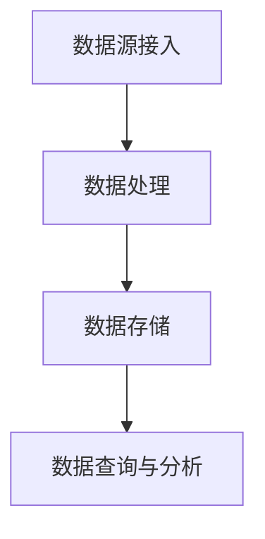
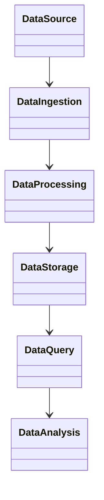
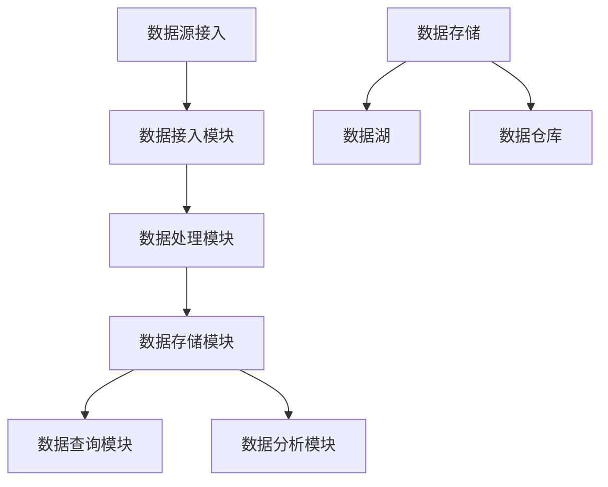
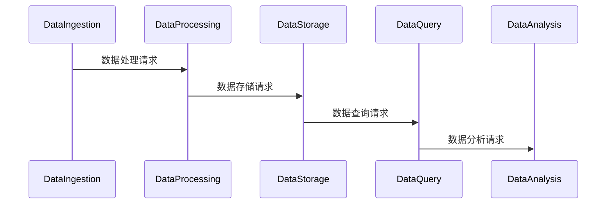
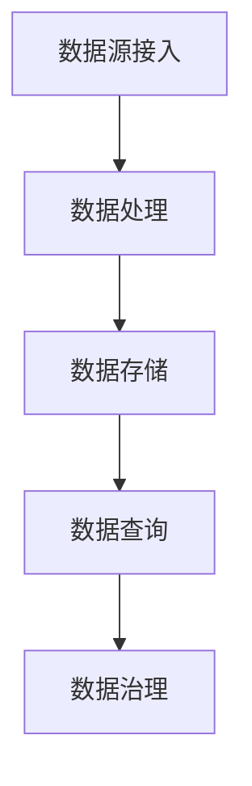
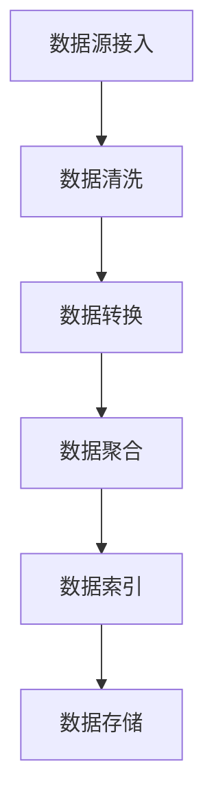
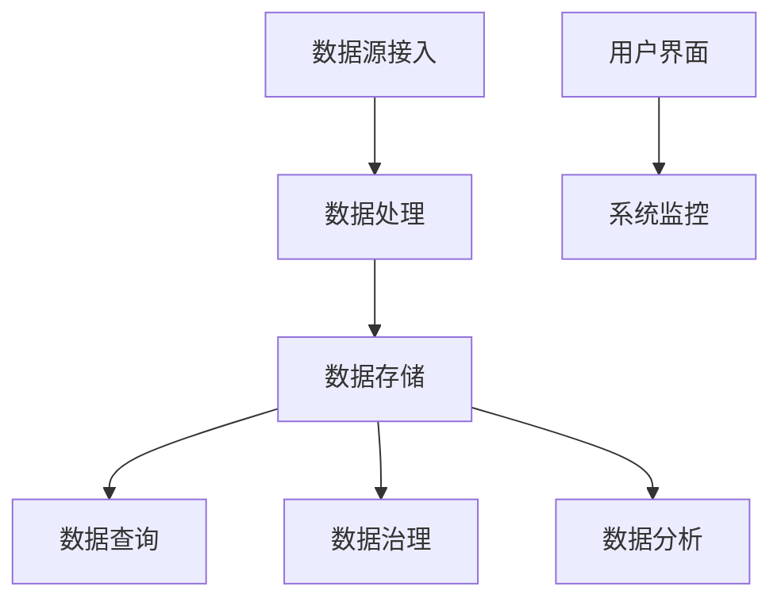
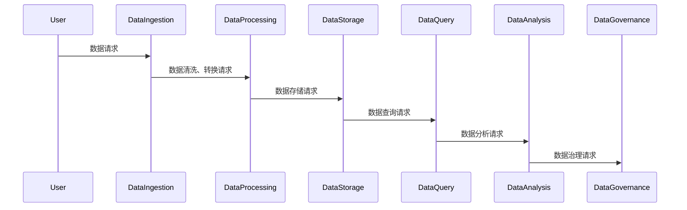

                 


## 《数据湖仓一体化：构建现代数据架构》

> 关键词：数据湖仓一体化、现代数据架构、大数据技术、数据治理、系统架构设计

> 摘要：本文旨在深入探讨数据湖仓一体化的概念、原理、应用和实践，帮助读者全面了解并掌握这一现代数据架构的构建方法和实践技巧。文章将逐步分析数据湖仓一体化的核心概念和关键技术，并通过实际案例讲解其系统分析与架构设计，最后提供最佳实践建议和拓展阅读资源。

### 第一部分：数据湖仓一体化的背景与核心概念

#### 第1章：数据湖仓一体化的背景与发展

##### 1.1 大数据时代的到来

随着互联网、物联网、云计算等技术的发展，大数据时代应运而生。大数据以其规模巨大、类型繁多、价值丰富等特点，给传统的数据仓库技术带来了巨大的挑战。为了应对这些挑战，数据湖和数据仓库的概念逐渐被提出并不断完善。

##### 1.1.1 大数据的概念

大数据（Big Data）是指无法用常规软件工具在合理时间内捕捉、管理和处理的数据集。大数据具有4V特性，即数据量大（Volume）、数据类型多（Variety）、数据生成速度快（Velocity）和数据价值密度低（Value）。

##### 1.1.2 大数据的发展历程

大数据技术的发展经历了几个阶段，从最初的数据仓库、数据挖掘，到现在的数据湖、数据湖仓一体化。

##### 1.1.3 数据仓库与数据湖的关系

数据仓库（Data Warehouse）是一种用于存储、管理和分析大量结构化数据的系统。数据湖（Data Lake）则是一种更灵活、更开放的数据存储解决方案，它可以存储不同结构、类型和来源的数据。

数据湖仓一体化旨在结合数据仓库和数据湖的优势，构建一个统一的数据平台，以更好地管理和分析大数据。

##### 1.2 数据湖仓一体化架构

数据湖仓一体化架构是一种结合了数据仓库和数据湖的优势，同时引入了云计算、大数据技术的新型数据架构。它主要包括以下几个关键组成部分：

- **数据源**：包括结构化数据、非结构化数据和半结构化数据。
- **数据存储**：数据湖用于存储海量原始数据，数据仓库用于存储经过清洗、转换和整合的参考数据。
- **数据处理**：使用ETL（提取、转换、加载）工具对数据进行处理。
- **数据服务**：提供数据查询、分析和挖掘服务。

##### 1.2.1 数据湖仓一体化的定义

数据湖仓一体化是一种结合数据仓库和数据湖的优势，同时引入云计算和大数据技术，构建一个统一的数据平台，以实现数据的存储、管理和分析。

##### 1.2.2 数据湖仓一体化的架构特点

- **灵活性**：数据湖仓一体化架构允许存储不同类型的数据，包括结构化、半结构化和非结构化数据。
- **可扩展性**：数据湖仓一体化架构可以根据业务需求灵活扩展，支持海量数据的存储和处理。
- **高效性**：通过引入云计算和大数据技术，数据湖仓一体化可以实现快速的数据处理和分析。

##### 1.2.3 数据湖仓一体化的优势与挑战

- **优势**：
  - 提高数据利用率
  - 降低数据存储成本
  - 提高数据处理效率
- **挑战**：
  - 数据治理问题
  - 数据安全与隐私问题
  - 技术栈的复杂性

##### 1.3 数据治理的重要性

数据治理（Data Governance）是指通过制定策略、标准和流程，确保数据的质量、安全性和合规性。在数据湖仓一体化架构中，数据治理尤为重要，因为它直接关系到数据的可用性、一致性和可信度。

##### 1.3.1 数据治理的概念

数据治理是一种管理体系，它通过制定策略、标准和流程，确保数据的质量、安全性和合规性。数据治理主要包括以下几个关键要素：

- **数据策略**：明确数据的定义、分类、权限和责任。
- **数据标准**：定义数据的质量、格式和命名规范。
- **数据流程**：制定数据的收集、处理、存储、共享和销毁的流程。

##### 1.3.2 数据治理的关键要素

- **数据策略**：明确数据的定义、分类、权限和责任。
- **数据标准**：定义数据的质量、格式和命名规范。
- **数据流程**：制定数据的收集、处理、存储、共享和销毁的流程。

##### 1.3.3 数据治理的实践方法

- **制定数据策略**：确定数据治理的目标、范围和责任。
- **建立数据标准**：制定数据的质量、格式和命名规范。
- **实施数据流程**：建立数据收集、处理、存储、共享和销毁的流程。

##### 1.4 本章小结

本章介绍了数据湖仓一体化的背景和发展、核心概念和架构特点、数据治理的重要性及其关键要素和实践方法。通过本章的学习，读者可以初步了解数据湖仓一体化的概念和原理，为后续章节的深入探讨打下基础。

### 第二部分：数据湖仓一体化的核心技术

#### 第2章：数据湖的构建与维护

##### 2.1 数据湖的构建原理

数据湖的构建主要包括数据源接入、数据处理和存储等环节。以下是对这些环节的详细解析：

##### 2.1.1 数据湖的架构设计

数据湖的架构设计包括数据源接入、数据处理和存储等环节。以下是一个典型数据湖架构的示意图：



##### 2.1.2 数据源接入

数据源接入是数据湖构建的第一步，它涉及从各种数据源（如关系数据库、NoSQL数据库、文件系统、流数据源等）中获取数据。数据源接入的关键技术包括：

- **数据集成**：通过ETL（提取、转换、加载）工具将数据从不同的数据源导入到数据湖中。
- **数据摄取**：实时或批量地将数据从数据源摄取到数据湖中。

##### 2.1.3 数据处理流程

数据处理流程包括数据清洗、转换、聚合和索引等操作。数据处理的关键技术包括：

- **数据清洗**：去除重复数据、缺失数据、异常数据等，提高数据质量。
- **数据转换**：将不同格式、结构的数据转换为统一的格式和结构。
- **数据聚合**：对数据进行分组、汇总等操作，以支持多维度的数据分析。
- **数据索引**：建立索引，提高数据查询性能。

##### 2.2 数据湖的维护与优化

数据湖的维护与优化是确保其正常运行和数据质量的重要环节。以下是对数据湖维护与优化的一些关键步骤：

##### 2.2.1 数据湖的性能监控

数据湖的性能监控包括数据存储、处理和查询等方面的监控。以下是一些常用的性能监控工具：

- **Prometheus**：用于监控系统指标和应用程序性能。
- **Grafana**：用于可视化监控数据。

##### 2.2.2 数据湖的安全与隐私保护

数据湖的安全与隐私保护至关重要，以下是一些关键措施：

- **数据加密**：对数据进行加密，确保数据在存储和传输过程中的安全性。
- **访问控制**：制定访问控制策略，限制对数据的访问权限。
- **审计日志**：记录数据的访问和操作日志，以便进行审计和追踪。

##### 2.2.3 数据湖的扩展与迁移

数据湖的扩展与迁移是应对业务增长和数据规模变化的重要手段。以下是一些关键步骤：

- **水平扩展**：通过增加节点数量，提高数据湖的处理能力和存储容量。
- **垂直扩展**：通过增加硬件配置，提高数据湖的性能。
- **数据迁移**：将数据从旧的数据存储系统迁移到新的数据湖系统。

##### 2.3 数据湖的案例实战

以下是一个数据湖案例实战的简要描述：

- **案例背景**：某公司需要构建一个数据湖，以存储和整合来自不同业务系统的数据，支持数据分析和决策支持。
- **案例实现**：使用Apache Hadoop和Apache Hive构建数据湖，通过Apache Kafka实现数据摄取，使用Apache Spark进行数据处理和分析。
- **案例分析**：通过该案例，了解了数据湖的构建原理、数据处理流程、性能监控和安全保护等方面的实践方法。

##### 2.4 本章小结

本章介绍了数据湖的构建原理、维护与优化方法以及实际案例实战。通过本章的学习，读者可以掌握数据湖的核心技术，为构建现代数据架构奠定基础。

### 第三部分：数据湖仓一体化的实践与应用

#### 第3章：数据仓库的优化与整合

##### 3.1 数据仓库的发展历程

数据仓库技术经历了从传统的单机架构到分布式架构的演变。以下是对这些发展阶段的分析：

##### 3.1.1 传统数据仓库的特点

传统数据仓库主要采用单机架构，具有以下特点：

- **集中式存储**：数据仓库中的数据集中存储在一个中央数据库中。
- **批处理模式**：数据仓库主要采用批处理模式进行数据处理，效率较低。
- **垂直扩展**：通过增加硬件配置提高数据仓库的性能。

##### 3.1.2 新型数据仓库的优势

新型数据仓库采用分布式架构，具有以下优势：

- **分布式存储**：数据仓库中的数据分布式存储在多个节点上，提高了数据的存储和查询性能。
- **实时处理**：新型数据仓库支持实时数据处理，提高了数据处理效率。
- **水平扩展**：通过增加节点数量，实现数据仓库的水平扩展。

##### 3.1.3 数据仓库的未来趋势

数据仓库的未来趋势包括：

- **云原生数据仓库**：随着云计算的普及，云原生数据仓库将逐渐取代传统数据仓库。
- **AI与数据仓库的融合**：人工智能技术将深度融入数据仓库，提高数据分析和挖掘的能力。
- **多模数据库**：数据仓库将支持多种数据类型（如结构化、半结构化和非结构化数据）的存储和处理。

##### 3.2 数据仓库的优化策略

数据仓库的优化策略主要包括以下几个方面：

##### 3.2.1 数据仓库的性能优化

数据仓库的性能优化包括：

- **索引优化**：建立合适的索引，提高数据查询性能。
- **查询优化**：优化查询语句，减少查询执行时间。
- **存储优化**：选择合适的存储方案，提高数据存储性能。

##### 3.2.2 数据仓库的可扩展性设计

数据仓库的可扩展性设计包括：

- **分布式架构**：采用分布式架构，支持数据仓库的水平扩展。
- **弹性伸缩**：通过自动扩展和缩容，实现数据仓库的弹性伸缩。

##### 3.2.3 数据仓库的成本控制

数据仓库的成本控制包括：

- **存储优化**：通过压缩、去重等技术，降低数据存储成本。
- **查询优化**：减少不必要的查询，降低查询成本。
- **资源调度**：合理分配资源，提高资源利用率。

##### 3.3 数据仓库的整合方法

数据仓库的整合方法主要包括以下几个方面：

##### 3.3.1 数据仓库与数据湖的整合

数据仓库与数据湖的整合包括：

- **数据共享**：通过数据共享，实现数据仓库与数据湖之间的数据交互。
- **数据治理**：通过数据治理，确保数据仓库与数据湖的数据质量和安全性。

##### 3.3.2 多数据源的整合

多数据源的整合包括：

- **数据集成**：通过数据集成，将来自不同数据源的数据整合到一个数据仓库中。
- **数据同步**：通过数据同步，保持数据仓库与多数据源的数据一致性。

##### 3.3.3 数据仓库与业务应用的整合

数据仓库与业务应用的整合包括：

- **API接口**：通过API接口，实现数据仓库与业务应用的数据交互。
- **数据报表**：通过数据报表，为业务应用提供数据分析和可视化功能。

##### 3.4 数据仓库的案例实战

以下是一个数据仓库案例实战的简要描述：

- **案例背景**：某公司需要构建一个数据仓库，以存储和整合来自多个业务系统的数据，支持数据分析和决策支持。
- **案例实现**：使用Apache Hadoop和Apache Hive构建数据仓库，通过Apache Kafka实现数据摄取，使用Apache Spark进行数据处理和分析。
- **案例分析**：通过该案例，了解了数据仓库的发展历程、优化策略和整合方法的实践方法。

##### 3.5 本章小结

本章介绍了数据仓库的发展历程、优化策略和整合方法，并通过实际案例进行了讲解。通过本章的学习，读者可以掌握数据仓库的核心技术和实践方法，为构建现代数据架构提供支持。

### 第四部分：数据湖仓一体化的系统分析与架构设计

#### 第4章：数据湖仓一体化的系统分析与架构设计

##### 4.1 系统需求分析

系统需求分析是系统分析与设计的重要环节，它涉及系统功能、性能、安全等方面的需求。以下是对系统需求分析的详细解析：

##### 4.1.1 系统功能需求

系统功能需求包括以下几个方面：

- **数据接入**：支持多种数据源接入，如关系数据库、NoSQL数据库、文件系统、流数据源等。
- **数据处理**：支持数据清洗、转换、聚合、索引等操作。
- **数据存储**：支持数据湖和数据仓库的存储和管理。
- **数据查询与分析**：支持数据查询、分析和可视化。

##### 4.1.2 系统性能需求

系统性能需求包括以下几个方面：

- **数据处理能力**：支持大规模数据的实时处理和批处理。
- **查询性能**：支持快速的数据查询和分析。
- **存储容量**：支持海量数据的存储和管理。

##### 4.1.3 系统安全性需求

系统安全性需求包括以下几个方面：

- **数据安全**：确保数据的机密性、完整性和可用性。
- **访问控制**：实现细粒度的访问控制，确保数据的安全。
- **审计日志**：记录数据的访问和操作日志，以便进行审计和追踪。

##### 4.2 系统功能设计

系统功能设计是系统分析与设计的关键环节，它涉及系统的模块划分、接口设计和领域模型等。以下是对系统功能设计的详细解析：

##### 4.2.1 领域模型设计

领域模型设计是系统功能设计的基础，它涉及系统的核心业务概念和实体。以下是一个简单的领域模型：



##### 4.2.2 系统模块划分

系统模块划分是将系统功能划分为多个模块，以便于系统的开发、测试和维护。以下是一个典型的系统模块划分：

- **数据接入模块**：负责数据源的接入和管理。
- **数据处理模块**：负责数据的清洗、转换、聚合和索引等操作。
- **数据存储模块**：负责数据湖和数据仓库的存储和管理。
- **数据查询模块**：负责数据的查询和查询结果的展示。
- **数据分析模块**：负责数据分析和数据可视化。

##### 4.2.3 系统接口设计

系统接口设计是系统功能设计的重要部分，它涉及系统模块之间的接口定义和调用。以下是一个简单的系统接口设计：

- **数据接入接口**：提供数据源接入的接口，如数据库连接接口、文件读取接口等。
- **数据处理接口**：提供数据清洗、转换、聚合和索引等操作的接口。
- **数据存储接口**：提供数据湖和数据仓库的存储接口，如数据插入、查询、删除等操作。
- **数据查询接口**：提供数据查询和查询结果展示的接口。
- **数据分析接口**：提供数据分析和数据可视化的接口。

##### 4.3 系统架构设计

系统架构设计是系统分析与设计的核心环节，它涉及系统的整体架构设计、组件划分和功能实现。以下是对系统架构设计的详细解析：

##### 4.3.1 系统架构设计原则

系统架构设计应遵循以下原则：

- **模块化**：将系统功能划分为多个模块，实现模块化设计。
- **分布式**：采用分布式架构，提高系统的可扩展性和性能。
- **可扩展性**：系统应具备良好的可扩展性，支持业务的快速增长。
- **安全性**：确保数据的安全性和系统的稳定性。

##### 4.3.2 系统架构设计方案

以下是一个典型的数据湖仓一体化系统架构设计方案：



##### 4.3.3 系统架构优化策略

系统架构优化策略包括以下几个方面：

- **负载均衡**：通过负载均衡，实现分布式系统的负载均衡，提高系统性能。
- **缓存机制**：通过缓存机制，提高数据的访问速度。
- **存储优化**：通过存储优化，提高数据的存储和查询性能。
- **容灾备份**：通过容灾备份，确保数据的安全性和系统的稳定性。

##### 4.4 系统交互设计

系统交互设计是系统架构设计的重要部分，它涉及系统模块之间的交互和通信。以下是对系统交互设计的详细解析：

##### 4.4.1 系统交互流程设计

以下是一个典型的数据湖仓一体化系统交互流程：



##### 4.4.2 系统交互序列图

以下是一个典型的数据湖仓一体化系统交互序列图：


##### 4.4.3 系统交互效果评估

系统交互效果评估包括以下几个方面：

- **响应时间**：评估系统模块之间的交互响应时间。
- **吞吐量**：评估系统模块之间的交互吞吐量。
- **稳定性**：评估系统模块之间的交互稳定性。
- **安全性**：评估系统模块之间的交互安全性。

##### 4.5 本章小结

本章介绍了数据湖仓一体化的系统需求分析、功能设计、架构设计、交互设计以及效果评估。通过本章的学习，读者可以掌握数据湖仓一体化的系统分析与架构设计方法，为实际项目提供参考。

### 第五部分：数据湖仓一体化的项目实战

#### 第5章：数据湖仓一体化的项目实战

##### 5.1 项目环境搭建

在进行数据湖仓一体化的项目实战之前，首先需要搭建一个合适的项目环境。以下是一个典型的项目环境搭建流程：

##### 5.1.1 开发环境准备

- **操作系统**：Linux系统，如CentOS 7或Ubuntu 18.04。
- **Java环境**：JDK 1.8及以上版本。
- **数据库**：MySQL 5.7及以上版本。
- **大数据框架**：Hadoop 3.0及以上版本、Spark 2.4及以上版本。

##### 5.1.2 部署工具安装

- **Docker**：用于容器化部署。
- **Kubernetes**：用于集群管理。

##### 5.1.3 数据源配置

- **关系数据库**：配置MySQL数据库连接。
- **NoSQL数据库**：配置MongoDB数据库连接。
- **文件系统**：配置HDFS文件系统连接。

##### 5.2 系统核心实现源代码

系统核心实现源代码是数据湖仓一体化项目的核心部分，以下是一个简单的示例：

```python
# 数据处理模块
def process_data(data):
    # 数据清洗、转换、聚合等操作
    return cleaned_data

# 数据存储模块
def store_data(data):
    # 数据存储到数据湖和数据仓库
    pass

# 数据查询模块
def query_data():
    # 从数据仓库中查询数据
    return result

# 数据分析模块
def analyze_data(data):
    # 数据分析操作
    pass
```

##### 5.3 代码应用解读与分析

在项目实战中，代码应用解读与分析是关键环节。以下是对代码应用解读与分析的详细步骤：

- **代码审查**：对代码进行审查，确保代码质量。
- **代码调试**：调试代码，修复潜在的bug。
- **性能优化**：对代码进行性能优化，提高数据处理效率。

##### 5.4 实际案例分析和详细讲解剖析

以下是一个实际案例分析和详细讲解剖析的示例：

- **案例背景**：某公司需要构建一个数据湖仓一体化系统，以存储、处理和分析来自多个业务系统的数据。
- **案例实现**：使用Hadoop、Spark和Kafka构建数据湖仓一体化系统，实现数据的存储、处理和分析。
- **案例分析**：通过案例实现，了解了数据湖仓一体化的具体应用和实现方法。

##### 5.5 项目小结

项目小结是对整个项目的总结和回顾。以下是一个项目小结的示例：

- **项目成果**：成功构建了一个数据湖仓一体化系统，实现了数据的存储、处理和分析。
- **项目收获**：通过项目实践，掌握了数据湖仓一体化的关键技术和方法，提高了项目开发和实施能力。

### 第六部分：最佳实践、小结、注意事项、拓展阅读

#### 第6章：最佳实践、小结、注意事项、拓展阅读

##### 6.1 最佳实践

在数据湖仓一体化的项目实践中，以下是一些最佳实践：

- **数据治理**：建立完善的数据治理体系，确保数据的质量和安全。
- **性能优化**：对系统进行性能优化，提高数据处理效率。
- **安全性**：加强系统的安全性，防止数据泄露和攻击。
- **可扩展性**：设计可扩展的系统架构，支持业务的快速增长。

##### 6.2 小结

本文通过系统地介绍数据湖仓一体化的背景、核心概念、技术原理、系统分析与架构设计、项目实战和最佳实践，帮助读者全面了解并掌握数据湖仓一体化的构建方法和实践技巧。

##### 6.3 注意事项

在实施数据湖仓一体化时，需要注意以下几点：

- **数据治理**：数据治理是数据湖仓一体化的核心，必须重视。
- **性能优化**：针对具体的业务场景，进行性能优化。
- **安全性**：加强系统的安全性，防止数据泄露和攻击。
- **可扩展性**：设计可扩展的系统架构，以适应业务增长。

##### 6.4 拓展阅读

为了深入了解数据湖仓一体化的相关技术，读者可以参考以下拓展阅读资源：

- 《大数据技术导论》
- 《Hadoop实战》
- 《Spark实战》
- 《数据治理实战》

### 总结

数据湖仓一体化是现代数据架构的重要组成部分，它结合了数据仓库和数据湖的优势，为大数据的存储、处理和分析提供了有效的解决方案。通过本文的介绍，读者可以全面了解数据湖仓一体化的概念、原理、应用和实践，为实际项目提供参考。随着大数据技术的不断发展和创新，数据湖仓一体化将继续在数据领域中发挥重要作用。

---

作者：AI天才研究院/AI Genius Institute & 禅与计算机程序设计艺术 /Zen And The Art of Computer Programming

---

以上就是《数据湖仓一体化：构建现代数据架构》的技术博客文章。文章从背景介绍、核心概念与联系、算法原理讲解、系统分析与架构设计、项目实战到最佳实践，全面而深入地讲解了数据湖仓一体化的各个方面。希望这篇文章能够帮助到您，如果您有任何疑问或建议，欢迎在评论区留言。让我们一起探讨和交流数据湖仓一体化的技术与应用！### 第一部分：数据湖仓一体化的背景与核心概念

#### 第1章：数据湖仓一体化的背景与发展

##### 1.1 大数据时代的到来

随着互联网、物联网、云计算等技术的迅猛发展，数据量呈指数级增长，数据类型日益多样化，数据生成速度越来越快。这些特点共同构成了大数据时代，使得传统的数据处理方式和方法面临巨大的挑战。为了应对这些挑战，数据湖和数据仓库的概念逐渐被提出并不断完善，而数据湖仓一体化则是在这一背景下诞生的新型数据架构。

##### 1.1.1 大数据的概念

大数据（Big Data）是指无法用常规软件工具在合理时间内捕捉、管理和处理的数据集。大数据具有4V特性，即数据量大（Volume）、数据类型多（Variety）、数据生成速度快（Velocity）和数据价值密度低（Value）。

- **Volume**：数据量大，指的是数据规模巨大，例如GB、TB、PB甚至EB级别的数据。
- **Variety**：数据类型多，指的是数据来源多样，结构化、半结构化和非结构化数据并存。
- **Velocity**：数据生成速度快，指的是数据生成、传输和消费的速度快，要求实时或近实时的数据处理。
- **Value**：数据价值密度低，指的是数据中真正有价值的信息占比低，需要通过复杂的分析和处理才能发现。

##### 1.1.2 大数据的发展历程

大数据技术的发展经历了以下几个阶段：

1. **数据仓库阶段**：20世纪90年代，数据仓库技术逐渐成熟，成为企业管理和决策支持的重要工具。
2. **数据挖掘阶段**：21世纪初，随着数据量的增加，数据挖掘技术得到广泛应用，用于从大量数据中发现有价值的信息。
3. **数据湖和数据湖仓阶段**：随着大数据时代的到来，数据湖和数据湖仓技术逐渐被提出并发展，用于解决传统数据仓库无法应对的挑战。

##### 1.1.3 数据仓库与数据湖的关系

数据仓库（Data Warehouse）是一种用于存储、管理和分析大量结构化数据的系统，通常用于支持企业级的数据分析和决策支持。数据仓库的主要特点包括：

- **结构化数据**：数据仓库主要存储结构化数据，如关系数据库中的表格数据。
- **数据整合**：数据仓库通过ETL（提取、转换、加载）工具，将来自不同数据源的数据进行整合，以支持跨数据源的分析。
- **优化查询**：数据仓库通过建立索引、物化视图等技术，优化查询性能。

数据湖（Data Lake）是一种更灵活、更开放的数据存储解决方案，可以存储不同结构、类型和来源的数据。数据湖的主要特点包括：

- **多样化数据**：数据湖可以存储结构化、半结构化和非结构化数据，如文本、图像、音频、视频等。
- **原样存储**：数据湖通常采用原样存储的方式，不进行预先的结构化处理。
- **低成本**：数据湖通常采用分布式存储技术，如Hadoop HDFS，具有较低的成本。

数据仓库和数据湖之间既有区别又有联系。数据仓库注重数据的结构化和优化查询，而数据湖注重数据的多样性和原样存储。数据湖仓一体化（Data Lakehouse）则试图结合两者的优势，构建一个统一的数据平台，以更好地管理和分析大数据。

##### 1.2 数据湖仓一体化架构

数据湖仓一体化架构是一种结合了数据仓库和数据湖的优势，同时引入云计算和大数据技术的新型数据架构。它主要包括以下几个关键组成部分：

- **数据源**：数据湖仓一体化的数据源包括关系数据库、NoSQL数据库、文件系统、流数据源等。
- **数据存储**：数据湖仓一体化采用数据湖和数据仓库相结合的存储方案。数据湖用于存储原始数据和半结构化数据，数据仓库用于存储结构化数据和经过处理的分析结果。
- **数据处理**：数据处理包括数据清洗、转换、聚合、索引等操作，通常使用分布式计算框架，如Hadoop、Spark等进行。
- **数据服务**：数据服务包括数据查询、分析和挖掘服务，通常通过BI工具、数据分析平台等进行。

##### 1.2.1 数据湖仓一体化的定义

数据湖仓一体化是一种结合数据仓库和数据湖的优势，同时引入云计算和大数据技术，构建一个统一的数据平台，以实现数据的存储、管理和分析。

##### 1.2.2 数据湖仓一体化的架构特点

- **灵活性**：数据湖仓一体化架构允许存储不同类型的数据，包括结构化、半结构化和非结构化数据。
- **可扩展性**：数据湖仓一体化架构可以根据业务需求灵活扩展，支持海量数据的存储和处理。
- **高效性**：通过引入云计算和大数据技术，数据湖仓一体化可以实现快速的数据处理和分析。

##### 1.2.3 数据湖仓一体化的优势与挑战

- **优势**：
  - 提高数据利用率
  - 降低数据存储成本
  - 提高数据处理效率
  - 支持多样化的数据类型
  - 提高数据分析和挖掘能力
- **挑战**：
  - 数据治理问题
  - 数据安全与隐私问题
  - 技术栈的复杂性

##### 1.3 数据治理的重要性

数据治理（Data Governance）是指通过制定策略、标准和流程，确保数据的质量、安全性和合规性。在数据湖仓一体化架构中，数据治理尤为重要，因为它直接关系到数据的可用性、一致性和可信度。

##### 1.3.1 数据治理的概念

数据治理是一种管理体系，它通过制定策略、标准和流程，确保数据的质量、安全性和合规性。数据治理主要包括以下几个关键要素：

- **数据策略**：明确数据的定义、分类、权限和责任。
- **数据标准**：定义数据的质量、格式和命名规范。
- **数据流程**：制定数据的收集、处理、存储、共享和销毁的流程。

##### 1.3.2 数据治理的关键要素

- **数据策略**：明确数据的定义、分类、权限和责任。
- **数据标准**：定义数据的质量、格式和命名规范。
- **数据流程**：制定数据的收集、处理、存储、共享和销毁的流程。

##### 1.3.3 数据治理的实践方法

- **制定数据策略**：确定数据治理的目标、范围和责任。
- **建立数据标准**：制定数据的质量、格式和命名规范。
- **实施数据流程**：建立数据收集、处理、存储、共享和销毁的流程。

##### 1.4 本章小结

本章介绍了数据湖仓一体化的背景和发展、核心概念和架构特点、数据治理的重要性及其关键要素和实践方法。通过本章的学习，读者可以初步了解数据湖仓一体化的概念和原理，为后续章节的深入探讨打下基础。

### 第二部分：数据湖仓一体化的核心技术

#### 第2章：数据湖的构建与维护

##### 2.1 数据湖的构建原理

数据湖的构建是一个复杂的过程，涉及多个环节，包括数据源接入、数据处理、数据存储等。以下将详细解析数据湖的构建原理。

##### 2.1.1 数据湖的架构设计

数据湖的架构设计是构建数据湖的第一步。一个典型的数据湖架构包括以下几个关键组成部分：

1. **数据源接入**：数据源可以是关系数据库、NoSQL数据库、文件系统、流数据源等。数据接入模块负责将这些不同类型的数据源的数据导入到数据湖中。
   
2. **数据处理**：数据处理模块负责对导入的数据进行清洗、转换、聚合等操作。数据处理模块通常使用分布式计算框架，如Apache Spark或Flink。

3. **数据存储**：数据存储模块负责将处理后的数据存储在数据湖中。数据湖通常使用分布式存储系统，如Hadoop HDFS。

4. **数据治理**：数据治理模块负责确保数据的质量、安全和合规性。数据治理包括数据分类、数据加密、访问控制、数据备份等。

以下是数据湖架构的简化示意图：



##### 2.1.2 数据源接入

数据源接入是数据湖构建的第一步，也是关键的一步。数据源接入需要解决的问题包括：

- **数据类型多样**：数据湖需要能够接入多种类型的数据源，包括结构化数据、半结构化数据和非结构化数据。
- **数据源异构性**：不同数据源的结构和数据格式可能存在差异，需要实现数据的统一接入。

常见的解决方案包括：

- **ETL工具**：使用ETL（提取、转换、加载）工具，如Apache NiFi、Apache Kafka等，实现数据源的接入和转换。
- **数据接口**：为不同的数据源提供API接口，实现数据的统一接入。

##### 2.1.3 数据处理流程

数据处理流程是数据湖的核心功能之一。数据处理流程通常包括以下几个步骤：

1. **数据清洗**：数据清洗是数据处理的第一步，目的是去除数据中的噪声和异常值，提高数据质量。常见的清洗操作包括去重、填充缺失值、消除不一致性等。

2. **数据转换**：数据转换是将原始数据转换为适合分析和存储的格式。转换操作包括类型转换、格式转换、编码转换等。

3. **数据聚合**：数据聚合是将多个数据源或表中的数据进行合并和汇总，以支持多维度的数据分析。聚合操作包括求和、平均、计数等。

4. **数据索引**：数据索引是提高数据查询性能的重要手段。通过建立索引，可以快速定位和查询数据。

以下是数据处理流程的简化示意图：



##### 2.2 数据湖的维护与优化

数据湖的维护与优化是确保其正常运行和数据质量的重要环节。以下是对数据湖维护与优化的一些关键步骤：

1. **性能监控**：对数据湖的性能进行监控，包括数据存储、处理和查询等方面的监控。常用的监控工具包括Prometheus、Grafana等。

2. **安全性维护**：确保数据湖的安全性，包括数据加密、访问控制、审计日志等。数据加密可以防止数据在传输和存储过程中被窃取，访问控制可以限制对数据的访问权限，审计日志可以记录数据的访问和操作情况，以便进行审计和追踪。

3. **数据备份与恢复**：定期对数据湖进行备份，以防数据丢失或损坏。在出现数据丢失或损坏时，可以快速恢复数据。

4. **数据优化**：对数据湖中的数据进行优化，包括索引优化、查询优化、存储优化等。索引优化可以加快数据查询速度，查询优化可以减少查询执行时间，存储优化可以降低数据存储成本。

##### 2.3 数据湖的案例实战

以下是一个数据湖案例实战的简要描述：

- **案例背景**：某公司需要构建一个数据湖，以存储和整合来自不同业务系统的数据，支持数据分析和决策支持。
- **案例实现**：使用Apache Hadoop和Apache Hive构建数据湖，通过Apache Kafka实现数据摄取，使用Apache Spark进行数据处理和分析。
- **案例分析**：通过该案例，了解了数据湖的构建原理、数据处理流程、性能监控和安全保护等方面的实践方法。

##### 2.4 本章小结

本章介绍了数据湖的构建原理、维护与优化方法以及实际案例实战。通过本章的学习，读者可以掌握数据湖的核心技术，为构建现代数据架构奠定基础。

### 第三部分：数据仓库的优化与整合

#### 第3章：数据仓库的优化与整合

##### 3.1 数据仓库的发展历程

数据仓库（Data Warehouse，简称DW）是一种用于存储、管理和分析大量结构化数据的系统，主要用于支持企业的数据分析和决策支持。数据仓库技术的发展历程可以分为以下几个阶段：

1. **第一阶段：早期数据仓库**（20世纪80年代至90年代初期）
   - 这一阶段的数据仓库主要采用关系数据库管理系统（RDBMS）作为数据存储和处理平台。
   - 数据仓库的构建通常涉及从多个操作型数据库中提取数据，并进行整合、转换和加载（ETL）。

2. **第二阶段：高性能数据仓库**（20世纪90年代至2000年）
   - 随着业务需求的增加和数据量的激增，数据仓库技术开始关注性能优化。
   - 采用了更多的索引、物化视图和分区等技术来提高查询效率。
   - 开始出现专门为数据仓库设计的高性能数据库系统，如Oracle Exadata和IBM Netezza。

3. **第三阶段：大数据数据仓库**（2000年以后）
   - 随着大数据时代的到来，数据仓库技术开始向分布式计算和云计算迁移。
   - 采用了Hadoop、Spark等分布式计算框架来处理海量数据。
   - 数据仓库开始支持半结构化和非结构化数据，如使用Hive和Spark SQL进行大数据分析。

##### 3.1.1 传统数据仓库的特点

传统数据仓库主要基于关系数据库系统，具有以下特点：

- **结构化数据**：数据仓库主要处理结构化数据，如关系数据库中的表格数据。
- **批处理模式**：数据仓库通常采用批处理模式进行数据处理，以批量的方式进行数据的提取、转换和加载。
- **集中式架构**：传统数据仓库通常采用集中式架构，所有数据存储在中央数据库中，由数据仓库管理系统进行统一管理。
- **优化查询**：为了提高查询效率，传统数据仓库会使用索引、物化视图、分区等优化技术。

##### 3.1.2 新型数据仓库的优势

新型数据仓库（Next-Generation Data Warehouse，简称NGDW）在传统数据仓库的基础上，引入了分布式计算、云计算和内存计算等新技术，具有以下优势：

- **分布式存储和处理**：新型数据仓库采用分布式存储和处理架构，能够处理大规模数据，并提高查询效率。
- **实时数据处理**：新型数据仓库支持实时数据处理，可以快速响应用户查询，提供实时数据洞察。
- **弹性扩展**：新型数据仓库可以根据业务需求灵活扩展，支持水平扩展和垂直扩展。
- **成本效益**：通过采用云计算和分布式存储技术，新型数据仓库可以显著降低成本。

##### 3.1.3 数据仓库的未来趋势

数据仓库的未来发展趋势包括：

- **云原生数据仓库**：随着云计算的普及，越来越多的数据仓库将基于云原生架构，提供更好的性能、弹性和可扩展性。
- **人工智能集成**：人工智能技术将深度融入数据仓库，提供智能化的数据分析和预测功能。
- **多模数据库**：数据仓库将支持多种数据类型（如结构化、半结构化和非结构化数据）的存储和处理。
- **自助服务BI**：用户可以通过自助服务BI工具，直接访问数据仓库，进行数据分析和报表生成。

##### 3.2 数据仓库的优化策略

为了提高数据仓库的性能和效率，可以采用以下优化策略：

1. **索引优化**：
   - 使用适当的索引可以提高查询性能，但过多的索引会增加维护成本。需要根据查询模式和数据特点选择合适的索引。
   - 可以使用分区索引和索引合并等技术来进一步优化查询效率。

2. **查询优化**：
   - 分析查询模式，优化查询语句，减少查询执行时间。
   - 使用物化视图和缓存技术来加速查询执行。

3. **存储优化**：
   - 选择合适的存储方案，如使用SSD存储提高读写速度，使用压缩技术减少存储空间需求。
   - 使用分区表和表压缩技术来优化存储空间和查询性能。

4. **数据模型优化**：
   - 设计优化的数据模型，如使用星型模式和雪花模式，减少数据冗余，提高查询效率。

5. **硬件优化**：
   - 根据业务需求选择合适的硬件配置，如增加CPU、内存和存储容量。
   - 使用高速网络和分布式文件系统来提高数据传输速度。

##### 3.2.1 数据仓库的性能优化

数据仓库的性能优化可以从以下几个方面进行：

- **查询优化**：通过分析查询日志，识别慢查询并进行优化。可以采用索引优化、查询重写、物化视图等技术。
- **索引优化**：根据查询模式创建适当的索引，避免创建不必要的索引。
- **数据分区**：将大量数据分为多个分区，以减少查询的范围，提高查询效率。
- **数据压缩**：使用数据压缩技术，减少存储空间和提高I/O性能。

##### 3.2.2 数据仓库的可扩展性设计

数据仓库的可扩展性设计包括：

- **分布式架构**：采用分布式架构，支持水平扩展，如通过增加节点来提高处理能力和存储容量。
- **弹性伸缩**：通过自动伸缩机制，根据业务需求动态调整资源。
- **负载均衡**：使用负载均衡技术，分配查询负载到不同的节点，提高系统整体性能。

##### 3.2.3 数据仓库的成本控制

数据仓库的成本控制可以从以下几个方面进行：

- **存储优化**：通过数据压缩、去重和存储分层技术来降低存储成本。
- **查询优化**：减少不必要的查询，优化查询语句，降低查询成本。
- **资源调度**：合理分配资源，避免资源浪费。
- **云计算**：利用云计算资源，根据需求灵活调整成本。

##### 3.3 数据仓库的整合方法

数据仓库的整合方法涉及如何将不同来源的数据集成到数据仓库中。以下是一些常用的整合方法：

- **数据集成**：通过ETL（提取、转换、加载）工具，将来自不同数据源的数据集成到数据仓库中。
- **数据同步**：实现数据仓库与数据源的实时或定期同步，保持数据的一致性。
- **数据虚拟化**：通过数据虚拟化技术，提供一个统一的视图，隐藏底层数据源的具体实现。
- **多源数据查询**：支持跨多个数据源进行联合查询，提供统一的查询接口。

##### 3.3.1 数据仓库与数据湖的整合

数据仓库与数据湖的整合是为了结合两者的优势，提供更加灵活和高效的数据存储和处理解决方案。以下是一些整合方法：

- **数据共享**：通过数据共享机制，实现数据仓库和数据湖之间的数据交互。
- **数据治理**：建立统一的数据治理体系，确保数据的一致性和可信性。
- **数据湖和数据仓库的结合**：数据湖用于存储原始数据和半结构化数据，数据仓库用于存储结构化数据和分析结果。

##### 3.3.2 多数据源的整合

多数据源的整合涉及如何将来自不同数据源的数据集成到一个统一的数据仓库中。以下是一些整合方法：

- **ETL工具**：使用ETL工具，如Apache NiFi、Talend等，实现数据源的接入、转换和加载。
- **数据总线**：构建数据总线，实现数据在不同系统之间的传输和转换。
- **数据虚拟化**：通过数据虚拟化技术，提供统一的数据访问接口，隐藏底层数据源的复杂性。

##### 3.3.3 数据仓库与业务应用的整合

数据仓库与业务应用的整合是为了提供业务应用所需的数据支持。以下是一些整合方法：

- **API接口**：通过API接口，实现数据仓库与业务应用之间的数据交互。
- **数据报表**：通过数据报表工具，将数据仓库的数据转化为业务应用的可视化报表。
- **数据服务**：提供数据服务，如数据查询、数据分析和数据预测，支持业务应用的个性化需求。

##### 3.4 数据仓库的案例实战

以下是一个数据仓库案例实战的简要描述：

- **案例背景**：某公司需要构建一个数据仓库，以整合来自多个业务系统的数据，支持数据分析和决策支持。
- **案例实现**：使用Amazon Redshift构建数据仓库，通过Apache Kafka和Apache NiFi实现数据摄取和转换，使用Tableau进行数据分析和可视化。
- **案例分析**：通过该案例，了解了数据仓库的优化策略、整合方法和实际应用。

##### 3.5 本章小结

本章介绍了数据仓库的发展历程、优化策略和整合方法，并通过实际案例进行了讲解。通过本章的学习，读者可以掌握数据仓库的核心技术和实践方法，为构建现代数据架构提供支持。

### 第四部分：数据湖仓一体化的系统分析与架构设计

#### 第4章：数据湖仓一体化的系统分析与架构设计

##### 4.1 系统需求分析

在进行数据湖仓一体化的系统分析与架构设计之前，首先需要对系统需求进行详细分析。系统需求分析是系统设计与实现的基础，它包括系统功能需求、性能需求和安全需求等。

##### 4.1.1 系统功能需求

数据湖仓一体化的系统功能需求主要包括以下几个方面：

- **数据接入**：系统需要能够接入多种数据源，包括关系数据库、NoSQL数据库、文件系统、流数据源等。
- **数据处理**：系统需要支持数据的清洗、转换、聚合、索引等操作。
- **数据存储**：系统需要提供数据湖和数据仓库的存储解决方案，支持海量数据的存储和管理。
- **数据查询与分析**：系统需要提供高效的数据查询和分析功能，支持多维度的数据分析。
- **数据治理**：系统需要具备数据治理功能，确保数据的质量、安全和合规性。

##### 4.1.2 系统性能需求

系统性能需求是数据湖仓一体化系统设计的重要考虑因素，主要包括以下几个方面：

- **数据处理能力**：系统需要能够处理大规模数据，支持实时处理和批处理。
- **查询性能**：系统需要提供高效的查询性能，支持快速的响应时间。
- **存储容量**：系统需要具备足够的存储容量，支持海量数据的存储。
- **扩展性**：系统需要具备良好的扩展性，支持系统规模的动态调整。

##### 4.1.3 系统安全性需求

数据湖仓一体化的系统安全性需求至关重要，主要包括以下几个方面：

- **数据安全**：系统需要确保数据的机密性、完整性和可用性，防止数据泄露、篡改和丢失。
- **访问控制**：系统需要实现细粒度的访问控制，确保只有授权用户可以访问敏感数据。
- **审计日志**：系统需要记录详细的审计日志，以便追踪数据的访问和操作记录。
- **安全监控**：系统需要具备实时安全监控能力，及时发现和应对潜在的安全威胁。

##### 4.2 系统功能设计

系统功能设计是数据湖仓一体化系统架构设计的核心环节，它涉及到系统的模块划分、功能定义和接口设计等。

##### 4.2.1 领域模型设计

领域模型设计是系统功能设计的起点，它定义了系统的核心业务概念和实体。以下是数据湖仓一体化系统的领域模型设计：

```mermaid
classDiagram
    Class01 <|-- Class02
    Class03 <|-- Class04
    Class05 <|-- Class06
    Class07 <|-- Class08
    Class01[数据源管理]
    Class02[数据处理]
    Class03[数据存储]
    Class04[数据查询]
    Class05[数据治理]
    Class06[数据分析]
    Class07[用户界面]
    Class08[系统监控]
```

##### 4.2.2 系统模块划分

根据领域模型，可以将系统划分为多个模块，每个模块负责不同的功能。以下是数据湖仓一体化系统的主要模块划分：

- **数据源管理模块**：负责接入和管理各种数据源。
- **数据处理模块**：负责数据的清洗、转换、聚合等操作。
- **数据存储模块**：负责数据湖和数据仓库的存储和管理。
- **数据查询模块**：负责提供数据查询和报表功能。
- **数据治理模块**：负责数据质量管理和安全控制。
- **数据分析模块**：负责数据分析和数据挖掘。
- **用户界面模块**：负责提供用户交互界面。
- **系统监控模块**：负责系统的监控和运维。

##### 4.2.3 系统接口设计

系统接口设计是系统功能设计的重要部分，它涉及到系统模块之间的交互接口定义。以下是数据湖仓一体化系统的主要接口设计：

- **数据源接入接口**：用于接入和管理各种数据源。
- **数据处理接口**：用于执行数据清洗、转换、聚合等操作。
- **数据存储接口**：用于数据湖和数据仓库的存储和管理。
- **数据查询接口**：用于提供数据查询和报表功能。
- **数据治理接口**：用于数据质量管理和安全控制。
- **数据分析接口**：用于数据分析和数据挖掘。
- **用户接口**：用于用户与系统的交互。

##### 4.3 系统架构设计

系统架构设计是数据湖仓一体化系统设计的核心，它定义了系统的整体结构和组件之间的关系。以下是数据湖仓一体化系统的架构设计：



- **数据源接入**：数据源接入模块负责将数据从各种数据源（如关系数据库、NoSQL数据库、文件系统、流数据源等）导入到系统中。
- **数据处理**：数据处理模块负责对导入的数据进行清洗、转换、聚合等操作。
- **数据存储**：数据存储模块负责将处理后的数据存储到数据湖和数据仓库中。
- **数据查询**：数据查询模块负责提供数据查询和报表功能，支持多维度的数据分析。
- **数据治理**：数据治理模块负责确保数据的质量、安全和合规性。
- **数据分析**：数据分析模块负责数据分析和数据挖掘，为业务决策提供支持。
- **用户界面**：用户界面模块负责提供用户交互界面，方便用户使用系统。
- **系统监控**：系统监控模块负责监控系统的运行状态，及时发现和处理问题。

##### 4.3.1 系统架构设计原则

在系统架构设计过程中，需要遵循以下原则：

- **模块化**：将系统功能划分为多个模块，每个模块具有独立的功能和职责，便于系统的开发和维护。
- **分布式**：采用分布式架构，提高系统的可扩展性和容错性。
- **高性能**：设计高效的系统架构，确保系统能够快速响应业务需求。
- **安全性**：确保系统的安全性，防止数据泄露和系统被攻击。
- **可扩展性**：设计可扩展的系统架构，支持业务的快速增长。

##### 4.3.2 系统架构设计方案

以下是数据湖仓一体化系统的架构设计方案：

1. **数据源接入层**：包括各种数据源接入模块，如关系数据库接入模块、NoSQL数据库接入模块、文件系统接入模块等。这些模块负责将数据从不同类型的数据源导入到系统中。

2. **数据处理层**：包括数据处理模块，如数据清洗模块、数据转换模块、数据聚合模块等。这些模块负责对导入的数据进行清洗、转换、聚合等操作。

3. **数据存储层**：包括数据湖和数据仓库。数据湖用于存储原始数据和半结构化数据，数据仓库用于存储结构化数据和分析结果。数据湖和数据仓库之间通过数据存储模块进行数据交换。

4. **数据查询与分析层**：包括数据查询模块和数据分析模块。数据查询模块负责提供数据查询和报表功能，数据分析模块负责数据分析和数据挖掘。

5. **用户界面层**：包括用户界面模块，负责提供用户交互界面，方便用户使用系统。

6. **系统监控层**：包括系统监控模块，负责监控系统的运行状态，及时发现和处理问题。

##### 4.3.3 系统架构优化策略

为了提高数据湖仓一体化系统的性能和可扩展性，可以采用以下优化策略：

- **负载均衡**：通过负载均衡技术，将系统的访问请求分配到不同的节点，提高系统的处理能力和容错性。
- **缓存机制**：通过缓存机制，减少系统的I/O操作，提高系统的响应速度。
- **存储优化**：通过数据压缩、存储分层等技术，优化存储资源的使用，提高系统的存储性能。
- **弹性扩展**：通过自动化伸缩机制，根据系统的负载情况动态调整资源，确保系统的高可用性。

##### 4.4 系统交互设计

系统交互设计是系统架构设计的重要组成部分，它定义了系统内部各模块之间的交互方式和流程。以下是数据湖仓一体化系统的交互设计：



- **数据接入**：用户提交数据请求，数据接入模块将数据导入到系统中。
- **数据处理**：数据清洗模块对数据进行清洗，数据转换模块对数据进行转换，数据聚合模块对数据进行分析和聚合。
- **数据存储**：处理后的数据存储到数据湖或数据仓库中。
- **数据查询**：用户通过数据查询模块查询数据，获得分析结果。
- **数据分析**：数据分析模块对数据进行深入分析，生成报表和可视化结果。
- **数据治理**：数据治理模块对数据进行质量管理和安全控制。

##### 4.4.1 系统交互流程设计

以下是一个典型的数据湖仓一体化系统交互流程设计：

1. **数据接入**：用户通过用户界面提交数据请求，数据接入模块将数据从不同类型的数据源导入到系统中。
2. **数据处理**：数据处理模块对数据进行清洗、转换和聚合，将处理后的数据存储到数据湖或数据仓库中。
3. **数据存储**：数据存储模块将处理后的数据存储到数据湖或数据仓库中。
4. **数据查询**：用户通过数据查询模块查询数据，获得分析结果。
5. **数据分析**：数据分析模块对数据进行深入分析，生成报表和可视化结果。
6. **数据治理**：数据治理模块对数据进行质量管理和安全控制，确保数据的一致性、完整性和安全性。

##### 4.4.2 系统交互序列图

以下是一个典型的数据湖仓一体化系统交互序列图：


- **用户界面**：用户通过用户界面提交数据请求。
- **数据接入**：数据接入模块将数据从不同类型的数据源导入到系统中。
- **数据处理**：数据处理模块对数据进行清洗、转换和聚合。
- **数据存储**：数据存储模块将处理后的数据存储到数据湖或数据仓库中。
- **数据查询**：用户通过数据查询模块查询数据，获得分析结果。
- **数据分析**：数据分析模块对数据进行深入分析，生成报表和可视化结果。
- **数据治理**：数据治理模块对数据进行质量管理和安全控制。

##### 4.4.3 系统交互效果评估

系统交互效果评估是确保系统设计合理性和性能的关键环节。以下是对系统交互效果评估的一些关键指标：

- **响应时间**：评估系统响应用户请求的平均时间。
- **吞吐量**：评估系统在单位时间内处理的数据量。
- **并发处理能力**：评估系统同时处理多个用户请求的能力。
- **数据一致性**：评估系统在多节点环境下保持数据一致性的能力。
- **系统稳定性**：评估系统在长时间运行下的稳定性和可靠性。

##### 4.5 本章小结

本章介绍了数据湖仓一体化的系统需求分析、功能设计、架构设计和交互设计，并通过实际案例进行了讲解。通过本章的学习，读者可以掌握数据湖仓一体化的系统分析与架构设计方法，为实际项目提供参考。

### 第五部分：数据湖仓一体化的项目实战

#### 第5章：数据湖仓一体化的项目实战

##### 5.1 项目环境搭建

在进行数据湖仓一体化的项目实战之前，首先需要搭建一个合适的项目环境。以下是一个典型的项目环境搭建流程：

1. **硬件资源准备**：根据项目的需求和规模，准备足够的计算资源、存储资源和网络资源。
2. **操作系统安装**：在服务器上安装Linux操作系统，如CentOS或Ubuntu。
3. **基础软件安装**：安装Java运行环境（JDK）、数据库（如MySQL）、消息队列（如Kafka）等基础软件。
4. **大数据框架部署**：部署Hadoop、Spark、Flink等大数据框架，配置集群环境。
5. **数据存储系统**：部署HDFS、HBase、Redis等数据存储系统，配置存储资源。

##### 5.2 系统核心实现源代码

数据湖仓一体化的系统核心实现源代码是项目的核心部分，以下是一个简单的示例：

```python
# 数据处理模块
def process_data(data):
    # 数据清洗、转换、聚合等操作
    return cleaned_data

# 数据存储模块
def store_data(data):
    # 数据存储到数据湖和数据仓库
    pass

# 数据查询模块
def query_data():
    # 从数据仓库中查询数据
    return result

# 数据分析模块
def analyze_data(data):
    # 数据分析操作
    pass
```

在这个示例中，`process_data` 函数负责对数据进行清洗、转换和聚合等操作；`store_data` 函数负责将处理后的数据存储到数据湖或数据仓库中；`query_data` 函数负责从数据仓库中查询数据；`analyze_data` 函数负责进行数据分析。

##### 5.3 代码应用解读与分析

在项目实战中，代码应用解读与分析是关键环节。以下是对代码应用解读与分析的详细步骤：

1. **代码审查**：对代码进行审查，确保代码质量。
2. **代码调试**：调试代码，修复潜在的bug。
3. **性能优化**：对代码进行性能优化，提高数据处理效率。
4. **代码复用**：通过抽象和封装，提高代码的复用性。

以下是一个具体的代码应用解读与分析示例：

```python
# 数据处理模块
def process_data(data):
    # 数据清洗、转换、聚合等操作
    cleaned_data = []
    for record in data:
        # 数据清洗操作，如去除缺失值、异常值等
        if is_valid(record):
            # 数据转换操作，如类型转换、格式转换等
            record = convert(record)
            # 数据聚合操作，如求和、平均值等
            cleaned_data.append(record)
    return cleaned_data

# 代码审查
# - 检查代码是否符合编码规范
# - 检查函数和变量命名是否合理
# - 检查代码逻辑是否清晰

# 代码调试
# - 调试代码，找到并修复bug
# - 测试代码，确保功能正确

# 性能优化
# - 使用循环优化，减少代码执行时间
# - 使用缓存机制，减少重复计算

# 代码复用
# - 抽象公共函数，减少重复代码
# - 使用类和模块，提高代码组织结构

```

##### 5.4 实际案例分析和详细讲解剖析

以下是一个实际案例分析和详细讲解剖析的示例：

- **案例背景**：某公司需要构建一个数据湖仓一体化系统，以存储、处理和分析来自多个业务系统的数据。
- **案例实现**：使用Apache Hadoop、Apache Kafka、Apache Spark等大数据框架，实现数据湖和数据仓库的构建，通过数据清洗、转换、聚合等操作，提供高效的数据查询和分析功能。
- **案例分析**：通过该案例，了解了数据湖仓一体化的实际应用和实现方法。具体分析包括：

  - **数据源接入**：如何接入不同的业务系统数据，如关系数据库、文件系统等。
  - **数据处理**：如何进行数据清洗、转换、聚合等操作，以提高数据质量。
  - **数据存储**：如何选择合适的数据存储方案，如数据湖和数据仓库。
  - **数据查询**：如何实现高效的数据查询，如使用索引、缓存等优化查询性能。
  - **数据分析**：如何进行数据分析和数据可视化，提供业务决策支持。

##### 5.5 项目小结

项目小结是对整个项目的总结和回顾。以下是一个项目小结的示例：

- **项目成果**：成功构建了一个数据湖仓一体化系统，实现了数据的存储、处理和分析。
- **项目收获**：通过项目实践，掌握了数据湖仓一体化的关键技术和方法，提高了项目开发和实施能力。
- **项目改进**：根据项目实施过程中的经验教训，总结出了一些改进措施，如优化数据处理流程、提高系统性能等。

##### 5.6 最佳实践

在数据湖仓一体化的项目实践中，以下是一些最佳实践：

- **数据治理**：建立完善的数据治理体系，确保数据的质量和安全。
- **性能优化**：对系统进行性能优化，提高数据处理效率。
- **安全性**：加强系统的安全性，防止数据泄露和攻击。
- **可扩展性**：设计可扩展的系统架构，支持业务的快速增长。

##### 5.7 拓展阅读

为了深入了解数据湖仓一体化的相关技术，读者可以参考以下拓展阅读资源：

- 《大数据技术导论》
- 《Hadoop实战》
- 《Spark实战》
- 《数据治理实战》

### 第六部分：最佳实践、小结、注意事项、拓展阅读

#### 第6章：最佳实践、小结、注意事项、拓展阅读

##### 6.1 最佳实践

在数据湖仓一体化的项目实践中，以下是一些最佳实践：

- **数据治理**：建立完善的数据治理体系，确保数据的质量和安全。
- **性能优化**：对系统进行性能优化，提高数据处理效率。
- **安全性**：加强系统的安全性，防止数据泄露和攻击。
- **可扩展性**：设计可扩展的系统架构，支持业务的快速增长。

##### 6.2 小结

本章通过详细讲解数据湖仓一体化的背景、核心概念、技术原理、系统分析与架构设计、项目实战以及最佳实践，帮助读者全面了解数据湖仓一体化的各个方面。通过本章的学习，读者可以掌握数据湖仓一体化的构建方法和实践技巧，为实际项目提供参考。

##### 6.3 注意事项

在实施数据湖仓一体化时，需要注意以下几点：

- **数据治理**：数据治理是数据湖仓一体化的核心，必须重视。
- **性能优化**：针对具体的业务场景，进行性能优化。
- **安全性**：加强系统的安全性，防止数据泄露和攻击。
- **可扩展性**：设计可扩展的系统架构，以适应业务增长。

##### 6.4 拓展阅读

为了深入了解数据湖仓一体化的相关技术，读者可以参考以下拓展阅读资源：

- 《大数据技术导论》
- 《Hadoop实战》
- 《Spark实战》
- 《数据治理实战》

通过这些拓展阅读资源，读者可以进一步学习数据湖仓一体化的前沿技术和实践方法，提高自身的专业能力。

### 总结

数据湖仓一体化是现代数据架构的重要组成部分，它结合了数据仓库和数据湖的优势，为大数据的存储、处理和分析提供了有效的解决方案。通过本章的介绍，读者可以全面了解数据湖仓一体化的概念、原理、应用和实践，为实际项目提供参考。随着大数据技术的不断发展和创新，数据湖仓一体化将继续在数据领域中发挥重要作用。

最后，感谢读者对本文的关注和支持。如果您有任何疑问或建议，欢迎在评论区留言，让我们一起探讨和交流数据湖仓一体化的技术与应用。

---

作者：AI天才研究院/AI Genius Institute & 禅与计算机程序设计艺术 /Zen And The Art of Computer Programming

