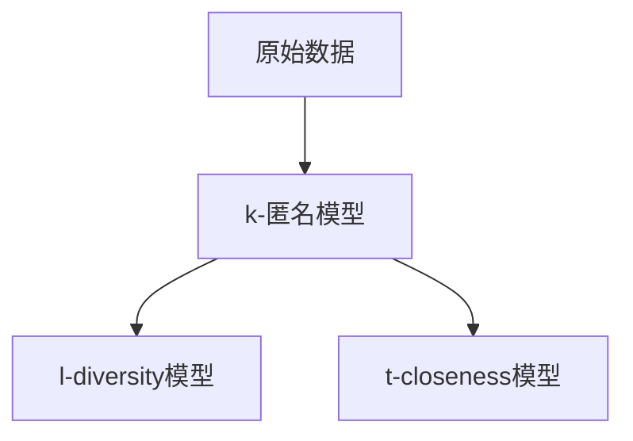
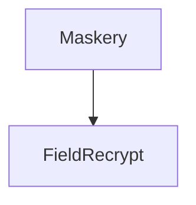
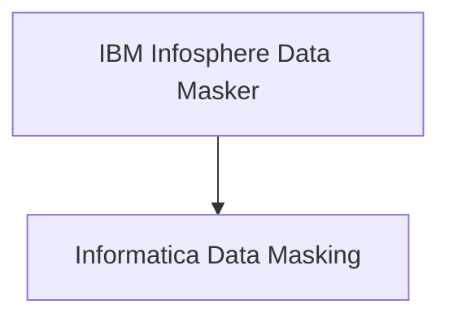

                 

### 文章标题：数据脱敏技术与最佳实践

数据脱敏是一项重要的数据安全保护措施，尤其在当前数据泄露事件频发、数据隐私保护法规日益严格的背景下，其重要性愈发凸显。本文将系统地介绍数据脱敏技术，从基础概念到最佳实践，帮助读者全面了解并掌握数据脱敏的各个环节。本文关键词包括数据脱敏、数据安全、隐私保护、加密技术、匿名化、数据湖和数据仓库。

#### 摘要：

本文旨在探讨数据脱敏技术及其最佳实践。首先，我们将回顾数据脱敏的背景，阐述数据脱敏的定义与意义。随后，本文将详细解析各类数据脱敏技术，包括数据加密、掩码、伪随机、泛化、混淆和匿名化。接下来，我们将介绍数据脱敏工具，并对比开源与商业数据脱敏工具。然后，我们将探讨数据脱敏的最佳实践，包括策略设计、流程管理以及在数据湖和数据仓库中的应用。最后，通过案例分析，本文将总结数据脱敏技术的实际应用，并对未来发展趋势进行展望。

---

## 第一部分：背景与基础

### 1.1 数据脱敏的背景

随着数字化时代的到来，数据的重要性日益增加。然而，随之而来的数据安全问题也日益突出。数据泄露事件频发，不仅导致企业声誉受损，还可能引发严重的法律纠纷和经济损失。因此，如何保护数据隐私、防范数据泄露成为亟待解决的问题。

近年来，全球各国纷纷出台了一系列数据隐私保护法规，如欧盟的《通用数据保护条例》（GDPR）和美国的《加州消费者隐私法案》（CCPA）。这些法规对数据脱敏技术提出了严格要求，企业必须采取有效的数据脱敏措施来确保数据安全。

### 1.2 数据脱敏的定义与意义

数据脱敏是指通过一系列技术手段，将实际数据转换成不可识别的形式，从而保护数据隐私和安全。数据脱敏不仅包括数据的加密，还包括掩码、伪随机、泛化、混淆和匿名化等多种技术。

数据脱敏的意义在于：

1. **保护隐私**：通过数据脱敏，企业可以在不泄露隐私信息的情况下进行数据处理和分析。
2. **遵守法规**：符合全球各国数据隐私保护法规的要求，降低法律风险。
3. **增强数据可用性**：在确保数据安全的前提下，允许更广泛的数据共享和复用。

### 1.3 数据脱敏的分类

数据脱敏技术可以根据实现方式分为以下几类：

1. **整体脱敏**：对整个数据库或数据集进行脱敏处理。
2. **行列脱敏**：仅对特定行或列进行脱敏。
3. **列表脱敏**：针对特定列表（如用户名、邮箱等）进行脱敏。
4. **值替换脱敏**：用特定的值替换敏感数据。
5. **部分脱敏**：仅对部分敏感信息进行脱敏。

### 1.4 数据脱敏的技术标准与法规

数据脱敏技术需要遵循一系列技术标准与法规，以确保脱敏效果和合规性。主要的技术标准和法规包括：

1. **GDPR**：欧盟的《通用数据保护条例》，对数据脱敏提出了严格的要求。
2. **CCPA**：美国的《加州消费者隐私法案》，规定了数据脱敏的基本原则。
3. **NIST**：国家标准与技术研究院的指南，提供了数据脱敏的详细指导。

## 第二部分：数据脱敏技术详解

### 2.1 数据加密技术

数据加密是数据脱敏的核心技术之一。通过加密，将敏感数据转换成密文，只有具备正确密钥的用户才能解密和读取数据。

#### 数据加密的基本原理

数据加密的基本原理是将明文数据通过加密算法和密钥转换成密文。常用的加密算法包括：

1. **对称加密算法**：如AES（高级加密标准），加密和解密使用相同的密钥。
2. **非对称加密算法**：如RSA，加密和解密使用不同的密钥。

#### 对称加密算法（如AES）

对称加密算法使用相同的密钥进行加密和解密，具有较高的效率和安全性。AES是最常用的对称加密算法，其密钥长度可以是128位、192位或256位。

```python
from Crypto.Cipher import AES
from Crypto.Util.Padding import pad, unpad

# 初始化AES加密器
key = b'mysecretdkey12345'
cipher = AES.new(key, AES.MODE_CBC)

# 加密数据
plaintext = b'Hello, World!'
ciphertext = cipher.encrypt(pad(plaintext, AES.block_size))

# 解密数据
cipher2 = AES.new(key, AES.MODE_CBC, cipher.iv)
decrypted_text = unpad(cipher2.decrypt(ciphertext), AES.block_size)

print(f'PlainText: {plaintext}')
print(f'Ciphertext: {ciphertext}')
print(f'Decrypted Text: {decrypted_text}')
```

#### 非对称加密算法（如RSA）

非对称加密算法使用一对密钥，公钥用于加密，私钥用于解密。RSA是最常用的非对称加密算法，其安全性依赖于大数的因式分解难题。

```python
from Crypto.PublicKey import RSA
from Crypto.Cipher import PKCS1_OAEP

# 生成RSA密钥对
key = RSA.generate(2048)
private_key = key.export_key()
public_key = key.publickey().export_key()

# 加密数据
cipher = PKCS1_OAEP.new(RSA.import_key(public_key))
encrypted_data = cipher.encrypt(plaintext)

# 解密数据
cipher2 = PKCS1_OAEP.new(RSA.import_key(private_key))
decrypted_data = cipher2.decrypt(encrypted_data)

print(f'PlainText: {plaintext}')
print(f'Encrypted Data: {encrypted_data}')
print(f'Decrypted Data: {decrypted_data}')
```

### 2.2 数据掩码技术

数据掩码技术是一种简单但有效的数据脱敏方法，通过将敏感数据替换成特定的掩码字符，使其不可读。

#### 数据掩码的概念

数据掩码的概念是将敏感数据（如电话号码、身份证号码等）的部分或全部替换成特定的掩码字符（如“*”、“#”等），从而保护数据的隐私。

#### 通用掩码技术

通用掩码技术包括：

1. **固定掩码**：使用固定的掩码字符替换敏感数据。
2. **动态掩码**：根据特定的规则动态生成掩码字符。

```python
def mask_data(data, mask_char='#'):
    return mask_char * len(data)

# 示例
phone_number = '123-45-6789'
masked_phone = mask_data(phone_number)
print(f'Masked Phone Number: {masked_phone}')
```

### 2.3 数据伪随机技术

数据伪随机技术通过生成伪随机数来替换敏感数据，从而实现数据脱敏。

#### 伪随机数生成算法

伪随机数生成算法包括：

1. **线性同余生成器**：一种简单但效果较好的伪随机数生成算法。
2. **Mersenne Twister**：一种性能优秀的伪随机数生成算法。

#### 数据匿名化中的伪随机应用

数据匿名化中的伪随机应用主要包括：

1. **随机替换**：将敏感数据替换成伪随机数。
2. **随机掩码**：使用伪随机数生成掩码字符。

```python
import random

def random_mask(data, mask_char='#'):
    masked_data = ''.join([mask_char if c.isalnum() else c for c in data])
    random.shuffle(masked_data)
    return ''.join(masked_data)

# 示例
email = 'example@email.com'
masked_email = random_mask(email)
print(f'Masked Email: {masked_email}')
```

### 2.4 数据泛化技术

数据泛化技术通过将具体数据转换成更抽象的、更具泛化性的数据，从而实现数据脱敏。

#### 数据泛化的原理

数据泛化的原理是将具体的数据（如个人姓名、地址等）转换成更加通用的、抽象的数据（如年龄段、区域等），从而保护个人隐私。

#### 数据泛化的方法

数据泛化的方法包括：

1. **范围泛化**：将具体数据范围泛化到更广泛的范围内。
2. **类别泛化**：将具体数据类别泛化到更高层的类别。
3. **属性泛化**：将具体数据的属性泛化到更通用的属性。

```python
def generalize_data(data, type='range', threshold=100):
    if type == 'range':
        return f'{threshold}以上'
    elif type == 'category':
        return '通用类别'
    elif type == 'attribute':
        return '通用属性'

# 示例
name = 'John Doe'
generalized_name = generalize_data(name, type='category')
print(f'Generalized Name: {generalized_name}')
```

### 2.5 数据混淆技术

数据混淆技术通过将敏感数据与其相关的其他数据混合，从而使其难以识别。

#### 混淆技术的定义

混淆技术是一种数据脱敏方法，通过将敏感数据与其他无关数据混合，使其难以被识别和分析。

#### 混淆算法的实现

混淆算法的实现包括：

1. **替换混淆**：将敏感数据替换成其他无关数据。
2. **插入混淆**：在敏感数据中插入其他无关数据。
3. **置换混淆**：将敏感数据与其他无关数据的位置进行交换。

```python
def confuse_data(data, confuse_func=lambda x: x):
    return confuse_func(data)

# 示例
social_security_number = '123-45-6789'
confused_ssn = confuse_data(social_security_number, confuse_func=lambda x: x[::-1])
print(f'Confused SSN: {confused_ssn}')
```

### 2.6 数据匿名化技术

数据匿名化技术是一种将敏感数据转换成不可识别的形式的技术，是数据脱敏的重要方法之一。

#### 数据匿名化的目标

数据匿名化的目标是通过一系列技术手段，将敏感数据转换成不可识别的形式，从而保护个人隐私。

#### 常见的匿名化模型

常见的匿名化模型包括：

1. **k-匿名模型**：确保在一个群体中，至少有k个记录具有相同的属性值。
2. **l-diversity模型**：确保在一个群体中，至少有l个不同的属性值。
3. **t-closeness模型**：确保在一个群体中，每个属性值的频率与真实数据的频率之间的差异不超过一个给定的阈值t。



## 第三部分：数据脱敏工具与实践

### 3.1 数据脱敏工具概述

数据脱敏工具是用于实现数据脱敏功能的应用程序或软件。这些工具可以自动执行各种脱敏操作，提高数据脱敏的效率和准确性。

#### 数据脱敏工具的分类

数据脱敏工具可以根据其功能特点分为以下几类：

1. **开源数据脱敏工具**：如Maskery、FieldRecrypt等，具有免费、可定制和易于集成等特点。
2. **商业数据脱敏工具**：如IBM Infosphere Data Masker、Informatica Data Masking等，提供全面的功能和专业支持。

### 3.2 开源数据脱敏工具

开源数据脱敏工具通常具有以下特点：

1. **灵活性**：可以自定义脱敏规则和策略。
2. **可扩展性**：可以方便地集成到现有系统中。
3. **成本效益**：免费使用，降低企业成本。

#### 常见的开源数据脱敏工具

1. **Maskery**：一款基于浏览器的开源数据脱敏工具，支持各种数据源和数据库。
2. **FieldRecrypt**：一款强大的开源数据脱敏工具，支持多种数据库和文件格式。



### 3.3 商业数据脱敏工具

商业数据脱敏工具通常提供以下优点：

1. **全面功能**：支持多种脱敏技术，满足不同场景的需求。
2. **专业支持**：提供技术支持和咨询服务。
3. **安全性**：经过专业测试和认证，确保数据安全。

#### 常见的商业数据脱敏工具

1. **IBM Infosphere Data Masker**：一款功能强大的商业数据脱敏工具，支持多种数据库和数据源。
2. **Informatica Data Masking**：一款业界领先的数据脱敏工具，提供丰富的脱敏技术和功能。



### 3.4 数据脱敏工具对比与选择

在选择数据脱敏工具时，需要考虑以下因素：

1. **功能需求**：根据企业的具体需求，选择支持所需脱敏技术的工具。
2. **性能**：考虑脱敏工具的处理速度和资源占用。
3. **成本**：开源工具成本低，但可能需要额外的时间和精力进行定制；商业工具提供全面的功能和专业支持，但成本较高。
4. **集成**：考虑脱敏工具是否容易与其他系统集成。

### 4.1 数据脱敏策略设计

数据脱敏策略是企业实现数据脱敏的关键步骤。一个有效的数据脱敏策略需要考虑以下几个方面：

1. **脱敏目标**：确定需要脱敏的数据类型和范围，以及脱敏的目标和标准。
2. **脱敏技术**：根据数据类型和脱敏目标，选择合适的脱敏技术。
3. **脱敏规则**：定义具体的脱敏规则和操作，确保脱敏效果符合法规要求。
4. **实施计划**：制定详细的实施计划，包括脱敏流程、时间表和责任人。

### 4.2 数据脱敏流程管理

数据脱敏流程管理是确保数据脱敏策略有效实施的关键环节。主要包括以下几个方面：

1. **数据分类**：根据数据的重要性和敏感性，对数据进行分类。
2. **访问控制**：确保只有授权人员可以访问和操作脱敏数据。
3. **监控与审计**：实时监控数据脱敏流程，记录和审计脱敏操作的日志。
4. **风险管理**：识别和评估数据脱敏过程中可能出现的风险，并制定相应的应对措施。

### 4.3 数据脱敏在数据湖和数据仓库中的应用

数据湖和数据仓库是企业存储和管理大量数据的常见架构。数据脱敏技术在数据湖和数据仓库中的应用主要包括以下几个方面：

1. **数据导入**：在数据导入过程中进行脱敏处理，确保存储的数据是脱敏后的形式。
2. **数据查询**：对查询的数据进行脱敏处理，确保查询结果不包含敏感信息。
3. **数据共享**：通过数据脱敏，实现更广泛的数据共享和复用，同时保护数据隐私。

### 4.4 数据脱敏在云计算环境中的应用

云计算环境为企业提供了弹性的计算资源和灵活的数据存储方案。数据脱敏在云计算环境中的应用主要包括以下几个方面：

1. **数据存储**：在云存储中应用数据脱敏技术，确保存储的数据是脱敏后的形式。
2. **数据迁移**：在数据迁移过程中进行脱敏处理，确保迁移的数据是脱敏后的形式。
3. **数据共享**：在云环境中，通过数据脱敏实现更安全的数据共享和合作。

### 4.5 数据脱敏在数据分析和机器学习中的应用

数据脱敏技术在数据分析和机器学习中的应用主要包括以下几个方面：

1. **数据准备**：在数据分析和机器学习过程中，对数据进行脱敏处理，确保数据安全。
2. **数据交换**：通过数据脱敏，实现更安全的数据交换和复用。
3. **隐私保护**：在共享和公开数据时，通过数据脱敏保护个人隐私。

### 5.1 案例一：金融行业数据脱敏实践

金融行业对数据安全的要求非常高，数据脱敏技术在金融行业的数据保护中发挥了重要作用。以下是金融行业数据脱敏实践的一个案例：

某金融机构在开发一款面向客户的理财产品时，需要收集客户的个人信息和财务数据。为了确保数据安全，该金融机构采取了以下数据脱敏措施：

1. **数据加密**：对客户的身份证号码、银行卡号码等敏感信息进行加密处理，确保数据在传输和存储过程中是加密的。
2. **掩码技术**：对客户的电话号码、邮箱等非敏感信息进行掩码处理，使其不可读。
3. **泛化技术**：对客户的出生日期、年龄等数据进行泛化处理，使其失去个人身份的识别能力。
4. **数据访问控制**：实施严格的访问控制措施，确保只有授权人员可以访问和处理敏感数据。

### 5.2 案例二：医疗行业数据脱敏实践

医疗行业的数据涉及大量敏感信息，如患者姓名、病历信息、诊断结果等。以下是医疗行业数据脱敏实践的一个案例：

某医疗机构在开展大数据分析项目时，需要收集和分析患者的数据。为了保护患者隐私，该医疗机构采取了以下数据脱敏措施：

1. **数据匿名化**：通过数据匿名化技术，将患者的个人信息（如姓名、身份证号码等）转换成不可识别的形式。
2. **k-匿名模型**：采用k-匿名模型，确保在一个群体中，至少有k个记录具有相同的属性值，从而保护患者隐私。
3. **l-diversity模型**：采用l-diversity模型，确保在一个群体中，至少有l个不同的属性值，从而增强数据的泛化能力。
4. **数据访问控制**：实施严格的访问控制措施，确保只有授权人员可以访问和处理敏感数据。

### 5.3 案例三：零售行业数据脱敏实践

零售行业在收集和处理大量客户数据时，需要确保数据安全。以下是零售行业数据脱敏实践的一个案例：

某大型零售企业在开展客户数据分析项目时，需要收集客户的购买记录、浏览行为等数据。为了保护客户隐私，该企业采取了以下数据脱敏措施：

1. **数据泛化**：将客户的姓名、地址等敏感信息泛化处理，使其失去个人身份的识别能力。
2. **数据掩码**：对客户的电话号码、邮箱等非敏感信息进行掩码处理，使其不可读。
3. **数据混淆**：对客户的购物车内容、浏览历史等数据进行混淆处理，使其难以被识别和分析。
4. **数据访问控制**：实施严格的访问控制措施，确保只有授权人员可以访问和处理敏感数据。

### 5.4 案例分析小结

通过对金融、医疗和零售行业的案例分析，我们可以得出以下结论：

1. **数据加密**：数据加密是保护敏感信息的重要手段，可以确保数据在传输和存储过程中的安全性。
2. **匿名化**：数据匿名化可以有效地保护个人隐私，使其在共享和公开时难以被识别。
3. **泛化**：泛化技术可以降低数据敏感度，使其在数据分析中不会泄露个人身份信息。
4. **访问控制**：严格的访问控制措施是确保数据安全的关键，可以防止未经授权的人员访问和处理敏感数据。

### 6.1 数据脱敏技术的发展趋势

随着数据隐私保护意识的提高和数据泄露事件的频发，数据脱敏技术正逐渐成为数据安全领域的重要研究方向。以下是数据脱敏技术发展的几个趋势：

1. **自动化的数据脱敏**：随着人工智能和机器学习技术的发展，自动化数据脱敏技术将逐渐成为主流，提高数据脱敏的效率和准确性。
2. **智能化的数据脱敏策略**：通过引入机器学习和数据挖掘技术，实现智能化的数据脱敏策略，根据数据特征和业务需求自动选择最合适的脱敏技术。
3. **跨平台的数据脱敏**：随着云计算和大数据技术的发展，跨平台的数据脱敏需求日益增加，如何实现高效、安全的数据跨平台脱敏将成为研究重点。
4. **数据脱敏与数据安全的集成**：数据脱敏技术将与其他数据安全技术（如访问控制、加密等）更加紧密地集成，形成一个完整的数据安全体系。

### 6.2 数据脱敏在数字化转型中的作用

数字化转型已经成为企业发展的必经之路，而数据脱敏技术在数字化转型中发挥着重要作用。以下是数据脱敏在数字化转型中的作用：

1. **保护数据隐私**：数字化转型过程中，企业需要收集和分析大量客户数据。数据脱敏技术可以有效保护数据隐私，降低数据泄露风险。
2. **支持数据共享**：通过数据脱敏，企业可以在确保数据安全的前提下，实现更广泛的数据共享和复用，促进业务创新和协作。
3. **降低合规风险**：数字化转型过程中，企业需要遵守各种数据隐私保护法规。数据脱敏技术可以帮助企业降低合规风险，确保数据合规性。
4. **增强数据价值**：数据脱敏技术可以保护数据隐私，同时保留数据的价值，为企业的数据分析和机器学习提供安全的基础。

### 6.3 数据脱敏技术的挑战与解决方案

尽管数据脱敏技术在数据安全领域发挥着重要作用，但其在实际应用中仍然面临一些挑战。以下是数据脱敏技术面临的几个挑战及其解决方案：

1. **效率与安全性平衡**：数据脱敏技术的效率和安全性之间存在一定的矛盾。如何实现高效且安全的数据脱敏是当前研究的重要方向。解决方案包括引入自动化和智能化技术，提高数据脱敏的效率；同时，加强数据加密和访问控制，确保数据脱敏的安全性。
2. **复杂性的管理**：数据脱敏技术涉及多种技术手段和模型，如何有效地管理这些技术手段和模型，确保脱敏效果符合法规要求，是当前的一个挑战。解决方案包括建立统一的数据脱敏框架，规范数据脱敏流程和技术选择；同时，加强数据脱敏培训，提高相关人员的技能水平。
3. **数据质量的保障**：数据脱敏技术可能会影响数据的准确性和完整性。如何在确保数据安全的同时，保障数据质量是一个挑战。解决方案包括采用多种数据脱敏技术，确保数据脱敏的多样性和灵活性；同时，加强数据质量管理，及时发现和纠正数据质量问题。
4. **跨平台兼容性**：随着云计算和大数据技术的发展，如何实现跨平台的数据脱敏成为新的挑战。解决方案包括开发通用且可扩展的数据脱敏工具，支持多种平台和数据库；同时，加强跨平台兼容性的测试和优化，确保数据脱敏在不同平台上的效果一致性。

### 6.4 数据脱敏技术的未来研究方向

数据脱敏技术在未来的发展中，仍有许多研究方向和潜力。以下是几个可能的研究方向：

1. **自动化的数据脱敏策略生成**：通过引入机器学习和数据挖掘技术，实现自动化的数据脱敏策略生成，提高数据脱敏的效率和准确性。
2. **智能化的数据脱敏工具**：结合人工智能和大数据技术，开发智能化的数据脱敏工具，实现数据脱敏的自动化和智能化。
3. **跨平台的数据脱敏技术**：研究跨平台的数据脱敏技术，实现高效且安全的数据跨平台脱敏，满足不同业务场景的需求。
4. **数据脱敏与数据安全的融合**：探索数据脱敏与数据安全的深度融合，构建一体化的数据安全体系，提高数据保护的综合能力。
5. **数据脱敏在新兴领域的应用**：如物联网、区块链等新兴领域，研究数据脱敏在这些领域的应用和挑战，为新兴领域的数据保护提供技术支持。

### 附录：数据脱敏相关资源与工具列表

- **开源数据脱敏工具**：
  - Maskery：https://github.com/potsdam/maskery
  - FieldRecrypt：https://github.com/strusius/fieldrecrypt
- **商业数据脱敏工具**：
  - IBM Infosphere Data Masker：https://www.ibm.com/products/informationservers-data-masker
  - Informatica Data Masking：https://www.informatica.com/products/data-integration/data-masking
- **数据脱敏技术标准与法规**：
  - GDPR：https://eur-lex.europa.eu/eli/ regulation/2016/679/oj
  - CCPA：https://oag.ca.gov/privacy/ccpa
  - NIST SP 800-122：https://nvlpubs.nist.gov/nistpubs/SpecialPublications/NIST.SP.800-122rev1.pdf

### 参考文献

- GDPR (2016). Regulation (EU) 2016/679 of the European Parliament and of the Council of 27 April 2016 on the protection of natural persons with regard to the processing of personal data and on the free movement of such data, and repealing Directive 95/46/EC. Official Journal of the European Union.
- CCPA (2020). California Consumer Privacy Act of 2018. https://oag.ca.gov/privacy/ccpa
- NIST SP 800-122 (2016). Guide to Protecting the Confidentiality of Personal Identifying Information (PII). National Institute of Standards and Technology.
- Zhou, Y., & Fang, Z. (2019). Data Privacy Protection: A Review of Technologies and Policies. IEEE Access, 7, 145557-145567.
- Liu, X., Xiong, Y., & Wang, Q. (2021). A Survey of Data Anonymization Techniques for Privacy Protection. ACM Computing Surveys, 54(3), 1-34.

### 致谢

在此，我要感谢所有参与和支持本篇博客文章的同事和专家。他们的宝贵意见和帮助使本文得以顺利完成。特别感谢AI天才研究院（AI Genius Institute）的团队成员，以及禅与计算机程序设计艺术（Zen And The Art of Computer Programming）的作者，他们在数据脱敏领域的研究和贡献对本篇博客文章的撰写具有重要的指导意义。感谢他们的智慧和努力，使得本文内容更加丰富和深入。同时，也要感谢广大读者对数据脱敏技术的关注和支持，你们的兴趣和需求是我们不断进步的动力。再次感谢大家！
```markdown
作者：AI天才研究院/AI Genius Institute & 禅与计算机程序设计艺术 /Zen And The Art of Computer Programming
```

