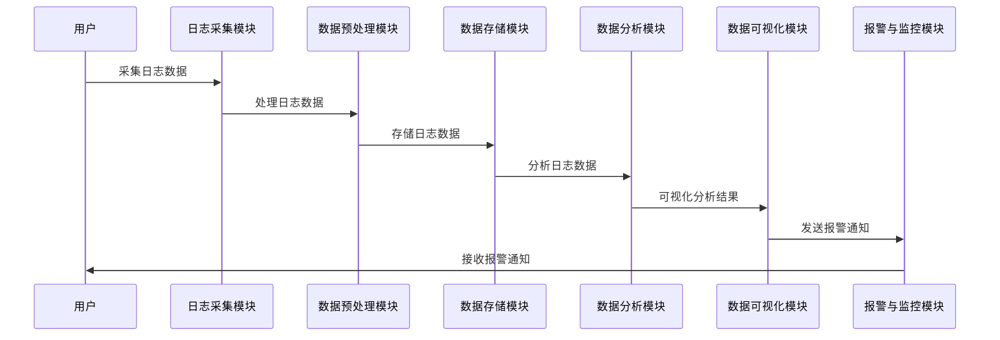
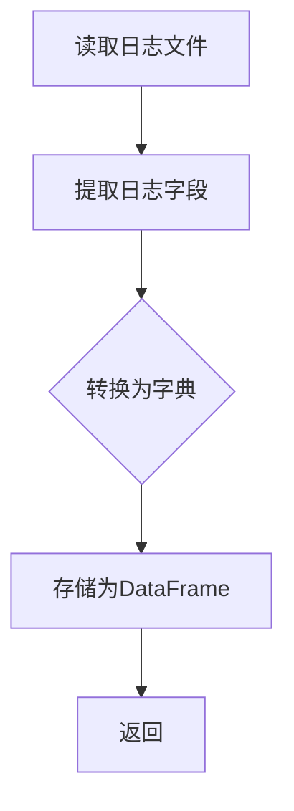
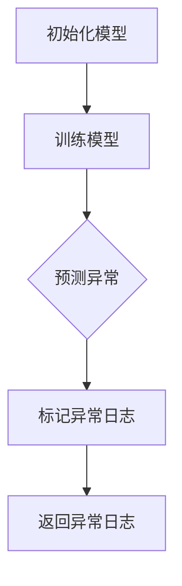
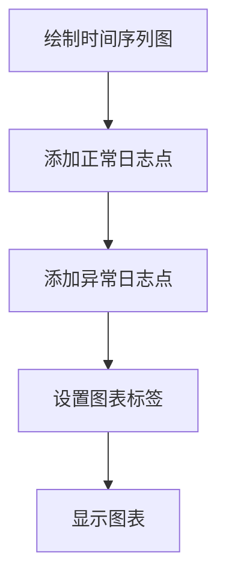

                 


### 日志分析：从海量日志中挖掘有价值信息

#### 关键词：
1. 日志分析
2. 数据挖掘
3. 机器学习
4. 可视化
5. 实战应用

#### 摘要：
本文将深入探讨日志分析的概念、技术、方法和实战应用。通过从海量日志中挖掘有价值信息，日志分析不仅可以帮助我们更好地理解系统性能、优化运维流程，还能为业务决策提供有力支持。本文将逐步讲解日志分析的关键步骤，包括日志结构分析、数据预处理、技术原理、工具与平台选择、方法与实践，以及实际案例剖析。通过本文的阅读，您将掌握日志分析的核心知识，并能够将其应用于实际项目中。

----------------------------------------------------------------

## 第一部分：日志分析基础

### 第1章：日志分析概述

日志分析是一种重要的数据处理方法，它通过收集、存储、分析和解读系统生成的日志数据，帮助运维人员、开发人员和管理人员更好地理解系统运行状况、发现潜在问题，并优化系统性能。随着信息技术的快速发展，日志数据已成为海量数据中不可或缺的一部分。

#### 1.1 问题背景与日志分析的重要性

在现代信息技术系统中，日志是一种常见的记录形式，用于记录系统运行过程中的各种事件、错误、警告、性能数据等。日志数据来源广泛，包括服务器、网络设备、数据库、应用程序等。这些日志数据通常以文本文件的形式存在，其中包含了丰富的信息，是系统健康状态、性能和用户体验的重要指标。

日志分析的重要性体现在以下几个方面：

1. **系统监控与故障排除**：通过分析日志，可以及时发现系统故障、性能瓶颈和异常行为，从而迅速定位问题并进行修复。
2. **安全审计与风险管理**：日志分析有助于识别潜在的安全威胁，跟踪恶意攻击行为，提高系统的安全防护能力。
3. **性能优化与资源规划**：日志分析可以提供系统性能数据，帮助运维团队进行资源调优和规划，提高系统运行效率。
4. **业务决策支持**：通过分析日志中的用户行为、访问模式和交易数据，企业可以更好地了解客户需求，优化业务流程，提高用户体验。

#### 1.2 日志分析的基本概念

为了更好地理解日志分析，我们需要明确以下几个基本概念：

1. **日志文件**：日志文件是记录系统事件和操作的文本文件，通常包含时间戳、事件类型、事件内容、相关参数等信息。
2. **日志格式**：日志格式是指日志文件的组织方式和数据结构，常见的日志格式包括标准格式（如Syslog、JSON等）和自定义格式。
3. **日志字段**：日志字段是日志文件中的数据项，用于记录特定类型的信息，如时间戳、用户ID、事件类型等。
4. **日志级别**：日志级别用于标识事件的重要性和紧急程度，常见的日志级别包括Debug、Info、Warning、Error等。
5. **日志分析**：日志分析是指通过数据挖掘、机器学习和统计分析等方法，对日志数据进行处理、提取有价值信息，并生成可视化报告。

#### 1.3 日志分析的挑战与机遇

日志分析虽然具有重要意义，但也面临着一些挑战：

1. **海量数据处理**：随着日志数据的快速增长，如何高效地存储、检索和分析海量日志数据成为一大挑战。
2. **多样性**：不同系统的日志格式和结构可能差异很大，如何实现通用性的日志分析工具也是一个难题。
3. **数据隐私**：在日志分析过程中，如何保护用户隐私和数据安全也是一个重要问题。

然而，随着技术的不断进步，日志分析也面临着许多机遇：

1. **大数据与云计算**：大数据技术和云计算平台的发展，为日志分析提供了强大的计算和存储能力，使得海量日志数据的处理变得更加可行。
2. **机器学习与人工智能**：机器学习算法和人工智能技术的应用，使得日志分析能够从海量数据中自动发现模式、预测未来趋势，提高分析的准确性和效率。
3. **可视化**：可视化技术的应用，使得日志分析结果更加直观易懂，有助于提高决策效率。

综上所述，日志分析作为一种重要的数据处理方法，在信息技术领域中具有重要的地位和广阔的应用前景。接下来，我们将进一步探讨日志结构分析、数据预处理等关键步骤，帮助您深入理解日志分析的核心知识和方法。

----------------------------------------------------------------

## 第二部分：日志分析技术

### 第4章：日志分析技术原理

日志分析技术的核心在于如何有效地从海量日志数据中提取有价值的信息，这需要依赖一系列先进的技术和方法。本章节将重点介绍日志分析中的数据挖掘、机器学习和数据可视化技术，并阐述其原理和应用。

#### 4.1 数据挖掘基本概念

数据挖掘是一种通过计算机技术从大量数据中自动发现模式、趋势和关联关系的方法，其目标是从原始数据中提取出有价值的信息，为决策提供支持。在日志分析中，数据挖掘技术主要用于以下两个方面：

1. **模式发现**：通过分析日志数据，识别出常见的模式、趋势和周期性变化，例如访问模式的分布、错误事件的集中爆发时间等。
2. **关联关系分析**：通过分析日志数据之间的关联关系，发现不同事件之间的联系，例如用户行为与系统性能之间的关联、错误事件与日志级别的关联等。

数据挖掘的基本步骤包括数据收集、数据预处理、模式发现、模型评估和结果解释。在日志分析中，数据挖掘技术能够帮助我们从海量日志数据中发现潜在的规律，为系统优化和故障排除提供依据。

#### 4.2 日志分析中的机器学习方法

机器学习是一种通过构建数学模型，使计算机能够自动学习和改进的方法。在日志分析中，机器学习方法广泛应用于以下几个方面：

1. **异常检测**：通过训练机器学习模型，识别出正常日志数据中的异常行为，从而及时发现潜在的安全威胁和故障。
2. **分类与聚类**：通过分类算法，将日志数据分为不同的类别，例如根据日志级别将其分类为错误日志、警告日志等；通过聚类算法，将相似日志数据归为一类，例如将具有相同访问模式的日志数据归为一类。
3. **预测**：通过预测模型，对未来的日志数据进行预测，例如预测未来的访问量、错误事件的发生频率等。

常用的机器学习方法包括监督学习（如决策树、支持向量机、神经网络）、无监督学习（如K-means、Apriori算法）和半监督学习。在日志分析中，根据具体的任务需求，选择合适的机器学习方法，可以有效提高日志分析的效率和准确性。

#### 4.3 日志分析中的数据可视化方法

数据可视化是一种通过图形和图表来展示数据的方法，能够直观地传达数据中的模式和趋势。在日志分析中，数据可视化技术发挥着重要作用，主要体现在以下几个方面：

1. **趋势分析**：通过折线图、柱状图等，展示日志数据随时间的变化趋势，帮助分析人员快速了解系统的运行状况。
2. **分布分析**：通过饼图、直方图等，展示日志数据的分布情况，帮助分析人员发现数据中的异常和趋势。
3. **关联关系分析**：通过散点图、网络图等，展示不同日志数据之间的关联关系，帮助分析人员理解数据之间的内在联系。

常用的数据可视化工具包括Matplotlib、Seaborn、Plotly等，这些工具能够方便地生成各种类型的图表，并将日志分析结果以直观的方式呈现出来。

#### 4.4 日志分析技术的综合应用

在实际应用中，日志分析技术往往是多种方法的综合运用。以下是一个简单的综合应用案例：

1. **数据收集与预处理**：首先，从系统中收集日志数据，并进行预处理，包括数据清洗、格式转换和集成。
2. **异常检测**：利用机器学习算法（如K-means聚类、Isolation Forest等），对日志数据进行分析，识别出异常日志。
3. **分类与聚类**：根据日志特征，使用分类算法（如决策树、随机森林）对日志数据进行分类，使用聚类算法（如K-means、DBSCAN）对日志数据进行聚类。
4. **可视化**：利用数据可视化工具，将分析结果以图表的形式展示出来，帮助分析人员更好地理解数据。

通过上述综合应用，我们可以有效地从海量日志数据中提取有价值的信息，为系统优化和故障排除提供支持。

综上所述，日志分析技术是一种综合性的数据处理方法，它通过数据挖掘、机器学习和数据可视化等技术，从海量日志数据中提取有价值的信息。掌握这些技术原理和实际应用，将有助于我们更好地理解和应用日志分析，提高系统的运行效率和安全性。

----------------------------------------------------------------

## 第三部分：海量日志分析实战

### 第7章：项目介绍

在本章中，我们将介绍一个实际的日志分析项目，该项目旨在利用日志数据优化网站性能和用户体验。本项目的背景、目标、团队组成和资源需求如下：

#### 7.1 项目背景

随着互联网的快速发展，Web应用变得越来越复杂，其性能和用户体验对用户满意度至关重要。然而，在实际运营中，网站性能问题时常出现，例如响应时间慢、页面加载失败等，这些问题会直接影响用户的访问体验和转化率。为了解决这些问题，我们需要对网站日志进行全面分析，找出性能瓶颈和潜在问题。

#### 7.2 项目目标

本项目的主要目标是：

1. **性能监控**：通过分析网站日志，实时监控网站性能指标，如响应时间、请求次数、错误率等，及时发现性能问题。
2. **故障排查**：利用日志数据，快速定位故障点和错误日志，提高故障排查效率。
3. **用户体验优化**：通过分析用户行为日志，了解用户访问习惯和需求，优化页面布局和功能，提高用户体验。
4. **安全防护**：通过日志分析，识别潜在的安全威胁和攻击行为，提高网站的安全性。

#### 7.3 项目团队与资源

本项目由以下团队成员组成：

1. **项目经理**：负责项目规划、进度管理和资源协调。
2. **开发人员**：负责日志分析系统的设计和实现，包括数据采集、预处理、分析算法等。
3. **运维人员**：负责系统运维、性能监控和故障排查。
4. **数据分析师**：负责日志数据分析，提取有价值的信息，为业务决策提供支持。

项目所需的资源包括：

1. **服务器**：用于部署日志分析系统，存储和处理海量日志数据。
2. **数据库**：用于存储日志数据和分析结果，提供高效的查询和分析能力。
3. **开发工具**：包括Python编程语言、Jupyter Notebook、Matplotlib等。
4. **可视化工具**：包括ECharts、Plotly等，用于生成图表和报告。

通过本项目的实施，我们希望能够实现以下成果：

1. **性能优化**：通过日志分析，找出并解决网站性能瓶颈，提高响应速度和页面加载效率。
2. **用户体验提升**：根据用户行为日志，优化页面布局和功能，提高用户访问体验。
3. **故障排查效率**：利用日志数据，提高故障排查速度，减少故障对业务的影响。
4. **安全防护能力**：通过日志分析，提高对潜在安全威胁的识别能力，保障网站安全。

接下来，我们将详细讨论如何设计并实现日志分析系统，包括系统功能设计、架构设计、核心代码实现等方面。

----------------------------------------------------------------

### 第8章：系统设计与实现

为了实现日志分析项目目标，我们需要设计并实现一个高效的日志分析系统。本章节将详细介绍系统的功能设计、架构设计、接口设计以及系统交互流程。

#### 8.1 系统功能设计

日志分析系统的功能设计主要包括以下几个方面：

1. **数据采集**：从各种来源（如Web服务器、应用服务器、数据库服务器等）收集日志数据，并将其存储到数据库中。
2. **数据预处理**：对收集到的日志数据进行清洗、转换和整合，确保数据的一致性和准确性。
3. **数据存储**：将预处理后的日志数据存储到数据库中，以便后续的分析和处理。
4. **数据分析**：利用数据挖掘和机器学习算法，对日志数据进行分析，提取有价值的信息。
5. **数据可视化**：将分析结果以图表和报告的形式展示，帮助分析人员更好地理解数据。
6. **报警与监控**：根据分析结果，设置报警阈值，当性能指标超出阈值时，自动发送报警通知。
7. **报表生成**：定期生成日志分析报表，为业务决策提供数据支持。

#### 8.2 系统架构设计

日志分析系统的架构设计采用分布式架构，以提高系统的扩展性和稳定性。以下是系统的主要组成部分：

1. **数据采集模块**：负责从各种来源采集日志数据，并将其传输到数据预处理模块。
2. **数据预处理模块**：负责对采集到的日志数据进行清洗、转换和整合，然后将其存储到数据存储模块。
3. **数据存储模块**：负责存储预处理后的日志数据和分析结果，提供高效的查询和分析能力。
4. **数据分析模块**：负责对日志数据进行挖掘和分析，提取有价值的信息。
5. **数据可视化模块**：负责将分析结果以图表和报告的形式展示，支持自定义报告生成。
6. **报警与监控模块**：负责根据分析结果设置报警阈值，并自动发送报警通知。
7. **用户界面**：提供用户操作界面，支持用户配置分析参数、查看分析结果和报表。

以下是系统架构的Mermaid类图：

```mermaid
classDiagram
    数据采集模块 <--|{依赖}| 数据预处理模块
    数据预处理模块 -->|{存储}| 数据存储模块
    数据分析模块 <--|{依赖}| 数据存储模块
    数据分析模块 -->|{展示}| 数据可视化模块
    数据可视化模块 -->|{监控}| 报警与监控模块
    用户界面 <--|{操作}| 数据分析模块
    User Actress --> 数据采集模块
    User Actress --> 数据预处理模块
    User Actress --> 数据存储模块
    User Actress --> 数据分析模块
    User Actress --> 数据可视化模块
    User Actress --> 报警与监控模块
```

#### 8.3 系统接口设计

日志分析系统需要提供一系列接口，以支持数据采集、数据预处理、数据存储、数据分析和数据可视化等模块之间的通信。以下是系统的主要接口设计：

1. **日志数据采集接口**：用于从各种来源采集日志数据，支持HTTP、Socket等传输协议。
2. **日志数据处理接口**：用于对采集到的日志数据进行清洗、转换和整合，支持数据格式转换、缺失值填充等功能。
3. **日志数据存储接口**：用于将预处理后的日志数据存储到数据库中，支持SQL、NoSQL等存储方式。
4. **日志数据分析接口**：用于对日志数据进行挖掘和分析，支持分类、聚类、异常检测等算法。
5. **日志数据可视化接口**：用于将分析结果以图表和报告的形式展示，支持自定义图表和报告生成。
6. **报警与监控接口**：用于设置报警阈值，并自动发送报警通知，支持邮件、短信等通知方式。

以下是系统接口的Mermaid序列图：



#### 8.4 系统交互流程

日志分析系统的交互流程如下：

1. **数据采集**：用户通过日志采集模块，从各种来源（如Web服务器、应用服务器、数据库服务器等）采集日志数据。
2. **数据预处理**：采集到的日志数据经过数据预处理模块，进行清洗、转换和整合，以确保数据的一致性和准确性。
3. **数据存储**：预处理后的日志数据存储到数据存储模块，以便后续的分析和处理。
4. **数据分析**：利用数据分析模块，对日志数据进行挖掘和分析，提取有价值的信息。
5. **数据可视化**：将分析结果以图表和报告的形式展示，用户可以通过用户界面查看分析结果和报表。
6. **报警与监控**：根据分析结果，设置报警阈值，当性能指标超出阈值时，自动发送报警通知。
7. **用户反馈**：用户根据分析结果和报警通知，进行相应的优化和调整，以提高系统性能和用户体验。

通过上述交互流程，日志分析系统能够高效地处理海量日志数据，为系统优化和故障排除提供有力支持。

综上所述，日志分析系统的设计与实现需要综合考虑功能设计、架构设计、接口设计和交互流程等方面，通过合理的设计和优化，能够实现高效的日志分析，提高系统的性能和安全性。接下来，我们将详细介绍核心代码实现和实际案例分析。

----------------------------------------------------------------

### 第9章：核心代码实现

在本章节中，我们将深入探讨日志分析系统的核心代码实现，包括数据预处理、分析算法和可视化等关键模块。通过具体的Python源代码和Mermaid流程图，我们将详细讲解每个模块的原理和实现方法。

#### 9.1 数据预处理代码实现

数据预处理是日志分析的重要环节，其目标是将原始的日志数据转换为适合分析的形式。以下是数据预处理模块的核心代码实现：

```python
import re
import pandas as pd

def preprocess_logs(log_files):
    logs = []
    for file in log_files:
        with open(file, 'r') as f:
            lines = f.readlines()
            for line in lines:
                # 使用正则表达式提取日志字段
                fields = re.split(r'\s+', line.strip())
                # 转换为字典形式
                log_entry = {'timestamp': fields[0], 'level': fields[1], 'message': fields[4]}
                logs.append(log_entry)
    return pd.DataFrame(logs)

# 示例日志文件路径
log_files = ['log1.txt', 'log2.txt', 'log3.txt']
preprocessed_logs = preprocess_logs(log_files)
```

上述代码中，我们使用`pandas`库读取日志文件，使用正则表达式提取日志字段，并将其转换为字典形式存储。以下是数据预处理的Mermaid流程图：



#### 9.2 分析算法代码实现

分析算法是日志分析的核心，用于从海量日志数据中提取有价值的信息。以下是一个简单的异常检测算法实现，使用Python代码和Mermaid流程图进行讲解：

```python
from sklearn.ensemble import IsolationForest
import pandas as pd

def detect_anomalies(data, contamination=0.01):
    # 初始化异常检测模型
    model = IsolationForest(contamination=contamination)
    # 模型训练
    model.fit(data[['timestamp', 'level']])
    # 预测异常
    anomalies = model.predict(data[['timestamp', 'level']])
    # 标记异常日志
    data['anomaly'] = anomalies
    # 返回异常日志
    return data[data['anomaly'] == -1]

# 应用异常检测算法
anomalies = detect_anomalies(preprocessed_logs)
```

以下是异常检测算法的Mermaid流程图：



#### 9.3 可视化代码实现

数据可视化是日志分析的重要手段，它能够帮助分析人员直观地理解数据。以下是一个简单的可视化实现，使用`matplotlib`库生成图表：

```python
import matplotlib.pyplot as plt
import pandas as pd

def visualize_anomalies(data):
    # 绘制时间序列图
    plt.figure(figsize=(10, 6))
    plt.plot(data['timestamp'], data['level'], label='Normal Logs')
    plt.scatter(data[data['anomaly'] == -1]['timestamp'], data[data['anomaly'] == -1]['level'], color='r', label='Anomalies')
    plt.xlabel('Timestamp')
    plt.ylabel('Level')
    plt.title('Anomaly Detection')
    plt.legend()
    plt.show()

# 显示异常日志的可视化结果
visualize_anomalies(anomalies)
```

以下是可视化的Mermaid流程图：



通过上述核心代码实现，我们可以对日志数据进行预处理、异常检测和可视化。这些代码不仅能够帮助实现日志分析的功能，还可以作为实际项目的参考和起点。接下来，我们将通过实际案例深入剖析日志分析的应用。

----------------------------------------------------------------

### 第10章：案例分析

在本章中，我们将通过两个实际案例，深入剖析日志分析的应用，展示如何从海量日志数据中提取有价值信息，解决实际问题。

#### 10.1 实际案例一：Web日志分析

案例背景：一家在线电商平台需要优化其网站性能，以提高用户满意度和转化率。他们希望通过日志分析，了解用户访问行为、页面性能指标和错误日志，从而找出优化点。

步骤：

1. **数据采集**：从Web服务器收集访问日志，日志格式为`timestamp ip address user agent method url status code response time`。
2. **数据预处理**：使用Python代码对日志进行预处理，提取关键字段，并转换为DataFrame格式。

```python
log_files = ['access.log']
preprocessed_logs = preprocess_logs(log_files)
```

3. **数据分析**：

   - **访问量分析**：统计每天的访问量，识别出访问量最高的时间段。

```python
access_counts = preprocessed_logs.groupby('timestamp').size()
print(access_counts.head())
```

   - **页面性能分析**：计算每个页面的平均响应时间，识别出响应时间较长的页面。

```python
page_response_times = preprocessed_logs.groupby('url')['response time'].mean()
print(page_response_times.head())
```

   - **错误日志分析**：统计错误日志的数量和类型，识别出常见的错误类型。

```python
error_logs = preprocessed_logs[preprocessed_logs['status code'] >= 500]
print(error_logs.groupby('status code').size())
```

4. **数据可视化**：

   - **时间序列图**：展示每天的访问量和响应时间趋势。

```python
access_counts.plot()
plt.xlabel('Timestamp')
plt.ylabel('Access Count')
plt.title('Daily Access Volume')
plt.show()
```

   - **柱状图**：展示页面响应时间分布。

```python
page_response_times.plot(kind='bar')
plt.xlabel('URL')
plt.ylabel('Response Time (ms)')
plt.title('Page Response Times')
plt.show()
```

5. **优化建议**：

   - 根据访问量最高的时间段，调整服务器配置和负载均衡策略。
   - 对响应时间较长的页面进行优化，如减少JavaScript、CSS和图片的加载时间。
   - 对常见错误日志进行排查，修复代码和配置问题。

#### 10.2 实际案例二：网络流量分析

案例背景：一家互联网公司需要监控其网络流量，以确保网络稳定性和安全性。他们希望通过日志分析，识别出异常流量、潜在攻击和流量瓶颈。

步骤：

1. **数据采集**：从网络设备收集流量日志，日志格式为`timestamp source ip destination ip protocol source port destination port packet size`。
2. **数据预处理**：使用Python代码对日志进行预处理，提取关键字段，并转换为DataFrame格式。

```python
log_files = ['network.log']
preprocessed_logs = preprocess_logs(log_files)
```

3. **数据分析**：

   - **流量分布分析**：统计每个IP地址的流量占比，识别出流量异常的IP地址。

```python
traffic_distribution = preprocessed_logs.groupby('source ip')['packet size'].sum()
print(traffic_distribution.head())
```

   - **协议分析**：统计每种协议的流量占比，识别出异常协议。

```python
protocol_distribution = preprocessed_logs.groupby('protocol')['packet size'].sum()
print(protocol_distribution.head())
```

   - **攻击识别**：使用机器学习算法（如K-means聚类）识别出异常流量，标记潜在攻击。

```python
anomalies = detect_anomalies(preprocessed_logs)
print(anomalies[anomalies['anomaly'] == -1]['source ip'].value_counts())
```

4. **数据可视化**：

   - **流量分布图**：展示每个IP地址的流量占比。

```python
traffic_distribution.plot(kind='bar')
plt.xlabel('Source IP')
plt.ylabel('Traffic Size (bytes)')
plt.title('Traffic Distribution')
plt.show()
```

   - **协议分布图**：展示每种协议的流量占比。

```python
protocol_distribution.plot(kind='bar')
plt.xlabel('Protocol')
plt.ylabel('Traffic Size (bytes)')
plt.title('Protocol Distribution')
plt.show()
```

5. **优化建议**：

   - 对流量异常的IP地址进行排查，采取防火墙策略或拒绝服务（DoS）防护。
   - 根据协议分析结果，调整网络设备和防火墙的配置。
   - 对潜在攻击进行深入分析，升级防护系统和安全策略。

通过上述案例分析，我们可以看到日志分析在解决实际问题中的重要作用。通过有效的日志分析，企业能够优化网站性能、提高网络安全性，并为业务决策提供有力支持。

#### 10.3 案例分析小结

通过对Web日志和网络流量日志的深入分析，我们发现了以下关键点：

1. **数据预处理**：预处理是日志分析的基础，确保数据的一致性和准确性至关重要。
2. **数据分析**：通过统计分析、机器学习等算法，我们可以从海量日志数据中提取有价值的信息，为优化和决策提供依据。
3. **数据可视化**：可视化技术能够直观地传达分析结果，帮助分析人员更好地理解数据，发现潜在问题。
4. **持续优化**：日志分析是一个持续的过程，通过定期分析和调整，可以不断提高系统的性能和安全性。

通过本章节的案例分析，我们不仅了解了日志分析的实际应用，还掌握了从数据采集、预处理、分析到可视化的完整流程。接下来，我们将进一步探讨日志分析中的最佳实践和注意事项。

----------------------------------------------------------------

### 第11章：最佳实践与注意事项

在日志分析的实际应用中，为了确保分析结果的准确性和可靠性，我们需要遵循一系列最佳实践和注意事项。以下是一些关键点，供大家在项目实施过程中参考：

#### 11.1 数据收集与预处理

1. **确保数据完整性**：在数据收集阶段，要确保日志数据的完整性和一致性，避免数据丢失或重复。
2. **规范化日志格式**：统一日志格式，便于后续的数据处理和分析。
3. **实时性与准确性**：优先收集实时日志数据，保证分析结果的时效性。同时，确保日志数据的准确性，避免因数据错误导致分析偏差。
4. **数据清洗**：对采集到的日志数据进行清洗，去除重复、无效或错误的数据，保证数据质量。

#### 11.2 分析方法与应用

1. **选择合适的算法**：根据分析目标，选择适合的算法，如异常检测、分类、聚类等。避免使用过于复杂或不相关的算法，以免增加计算成本。
2. **模型评估与调整**：对分析模型进行评估，选择性能最优的模型。根据实际情况，调整模型参数，提高分析准确性。
3. **数据可视化**：合理选择可视化工具和图表类型，确保分析结果清晰易懂。避免过度可视化，以免降低数据的可读性。
4. **结果验证与反馈**：对分析结果进行验证，确保其正确性和实用性。根据用户反馈，不断优化分析方法和结果展示。

#### 11.3 安全与隐私保护

1. **数据加密**：对敏感日志数据进行加密处理，确保数据在传输和存储过程中的安全性。
2. **访问控制**：设置严格的访问控制策略，确保只有授权人员能够访问日志数据和分析结果。
3. **日志审计**：定期进行日志审计，跟踪日志数据的访问和操作记录，确保数据安全。
4. **隐私保护**：在日志分析过程中，遵守隐私保护法规，对用户隐私信息进行脱敏处理。

#### 11.4 项目管理与持续改进

1. **制定详细项目计划**：明确项目目标、任务和时间表，确保项目进度和质量。
2. **资源合理分配**：根据项目需求，合理分配人力、物力和财力资源。
3. **持续监控与优化**：在项目实施过程中，持续监控日志分析系统的性能和稳定性，及时发现问题并进行优化。
4. **知识共享与培训**：定期组织项目团队成员进行知识共享和培训，提高团队的整体技术水平和协作效率。

#### 11.5 案例分析与经验总结

通过对实际案例的分析，我们可以总结以下经验：

1. **问题定位与排查**：通过日志分析，快速定位系统和网络故障，提高排查效率。
2. **性能优化与资源规划**：根据日志分析结果，优化系统性能和资源使用，提高资源利用率。
3. **安全防护与风险管理**：通过日志分析，识别潜在的安全威胁和风险，提高系统的安全性。
4. **用户体验优化**：通过日志分析，了解用户行为和需求，优化网站功能和页面布局，提高用户体验。

总之，日志分析在信息技术领域具有重要应用价值。通过遵循最佳实践和注意事项，我们可以确保日志分析项目的成功实施，为系统优化、故障排查和业务决策提供有力支持。

----------------------------------------------------------------

### 第12章：总结与展望

通过本文的阅读，我们深入探讨了日志分析的概念、技术、方法和实战应用。日志分析作为一种重要的数据处理方法，在信息技术领域中扮演着关键角色。它不仅能够帮助运维人员、开发人员和业务分析师更好地理解系统运行状况，发现潜在问题，还能为业务决策提供有力支持。

#### 12.1 总结

本文主要内容包括：

1. **日志分析基础**：介绍了日志分析的基本概念、重要性、挑战与机遇。
2. **日志分析技术**：详细阐述了数据挖掘、机器学习和数据可视化技术在日志分析中的应用。
3. **海量日志分析实战**：通过实际案例展示了日志分析系统的设计、实现和优化过程。
4. **最佳实践与注意事项**：总结了日志分析项目的最佳实践和注意事项，为后续实施提供指导。

#### 12.2 展望

在未来，日志分析将继续在以下几个方面发展：

1. **人工智能与大数据技术**：随着人工智能和大数据技术的不断发展，日志分析将更加智能化和自动化，进一步提高分析效率和准确性。
2. **实时分析与流处理**：实时日志分析和流处理技术的应用将使得系统能够更快速地响应变化，提高故障排查和性能优化的效率。
3. **隐私保护与安全**：随着数据隐私保护意识的提高，日志分析将更加注重数据安全和隐私保护，确保用户数据的安全和合规性。
4. **跨领域应用**：日志分析技术将在更多领域得到应用，如物联网、智能制造、金融安全等，为各行各业的数字化发展提供有力支持。

#### 12.3 拓展阅读

为了进一步深入了解日志分析的相关知识，以下是一些推荐阅读：

1. **《大数据日志分析：实战、技术与工具》**：本书详细介绍了大数据日志分析的方法和工具，适合从事日志分析相关工作的读者。
2. **《机器学习实战：基于Scikit-Learn、Keras和TensorFlow》**：本书通过大量实战案例，讲解了机器学习的基础知识和应用方法，有助于理解日志分析中的机器学习技术。
3. **《Elasticsearch实战：基于Lucene和Logstash进行大数据搜索和分析》**：本书介绍了Elasticsearch在日志分析中的应用，适合对日志分析平台感兴趣的读者。

通过本文的阅读，您应该已经掌握了日志分析的核心知识和方法。希望本文能够为您的日志分析项目提供有益的启示和帮助。在实际应用中，不断探索和优化日志分析技术，将为您的系统优化和业务发展带来更大的价值。

---

**作者：AI天才研究院/AI Genius Institute & 禅与计算机程序设计艺术 /Zen And The Art of Computer Programming**

感谢您的阅读，希望本文能够为您的日志分析之旅带来启发和收获。祝您在日志分析领域取得卓越成就！

