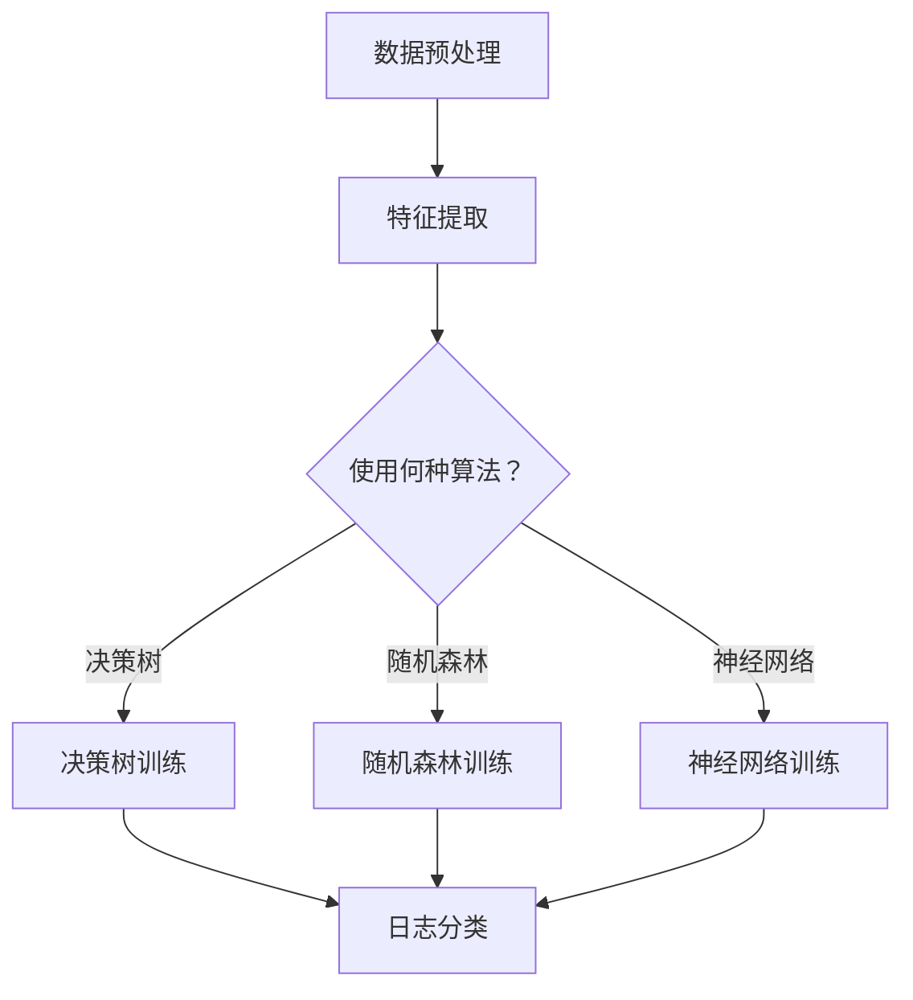
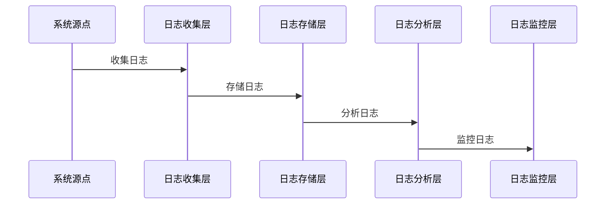

                 

# 《日志管理与分析：洞察系统行为的利器》

## 关键词
- 日志管理
- 系统监控
- 数据分析
- 日志分析工具
- 最佳实践

## 摘要
日志管理是现代系统运维和数据分析的核心环节。本文将从日志管理的基本概念、核心原理、实用工具、案例分析及最佳实践等多个维度，深入探讨日志管理与分析的方法和技巧，帮助读者理解和掌握日志管理这一技术利器，从而更有效地洞察系统行为，提升运维和数据分析的效率。

---

## 第1章 日志管理概述

### 1.1 日志管理的重要性

在信息技术领域，日志管理扮演着至关重要的角色。它不仅是系统运维人员监控和诊断系统问题的基本工具，也是数据分析师挖掘有价值信息的重要资源。有效的日志管理能够帮助组织迅速定位故障点，优化系统性能，提升用户体验。

#### 问题背景
随着信息技术的飞速发展，系统的复杂度不断增加，日志数据量也在急剧增长。如何有效地管理和分析这些海量日志成为了一个严峻的挑战。

#### 问题描述
日志管理面临的挑战包括：日志数据的收集、存储、处理和分析等。

#### 问题解决
解决日志管理问题的方法包括：采用高效的日志收集工具、设计合理的日志存储方案、运用先进的日志分析技术等。

#### 边界与外延
日志管理不仅涉及技术层面，还涉及策略层面，如日志策略的制定、日志数据的安全性和隐私保护等。

### 1.2 日志管理的基本概念

日志管理涉及多个基本概念，包括：
- **日志**：系统运行过程中产生的记录文件。
- **日志收集**：将日志从各个源点收集到集中存储的过程。
- **日志存储**：将收集到的日志存储到数据库或其他存储介质中。
- **日志分析**：对日志数据进行分析，提取有价值的信息。

### 1.3 日志管理的挑战与机遇

#### 挑战
- **数据量庞大**：随着系统规模的扩大，日志数据量呈指数级增长。
- **数据多样性**：不同系统产生的日志格式各异，增加了管理的复杂性。
- **实时性要求**：快速响应和处理日志数据，以确保系统稳定运行。

#### 机遇
- **数据分析**：利用日志数据进行分析，为企业提供决策支持。
- **自动化运维**：通过日志分析实现自动化故障诊断和预警。
- **合规性要求**：日志数据对于合规性检查和审计具有重要意义。

---

## 第2章 日志管理的基本原理

### 2.1 日志的分类

根据日志来源和用途，日志可以分为以下几类：
- **系统日志**：记录系统运行过程中产生的信息，如启动、关闭、错误等。
- **应用日志**：记录应用软件的运行情况，如请求、错误、性能等。
- **安全日志**：记录系统安全相关的事件，如登录、权限变更、攻击等。

### 2.2 日志的收集与存储

日志收集与存储的过程通常涉及以下步骤：
1. **日志收集**：使用日志收集工具（如Logstash、Fluentd）从各个源点收集日志。
2. **日志传输**：将收集到的日志传输到集中存储的位置。
3. **日志存储**：将日志存储到数据库、文件系统或其他存储介质中。

### 2.3 日志的解析与格式化

日志的解析与格式化是日志管理的重要环节。解析日志的目的是将原始日志数据转换成结构化的数据格式，便于后续的分析和处理。常见的日志格式化工具包括Log Parser、AWK等。

---

## 第3章 日志管理工具介绍

### 3.1 日志收集工具

日志收集工具的主要功能是自动化地收集系统日志和应用程序日志。常见的日志收集工具有：
- **Logstash**：由 Elastic 公司开发，可以将不同格式的日志转换为 JSON 格式，并存储到 Elasticsearch 中。
- **Fluentd**：由 Treasure Data 公司开发，具有高吞吐量和可扩展性，支持多种日志收集和输出格式。

### 3.2 日志存储工具

日志存储工具用于存储和管理日志数据。常见的日志存储工具有：
- **Elasticsearch**：一款高性能、可扩展的搜索引擎，常用于存储和搜索大量日志数据。
- **Filebeat**：由 Elastic 公司开发，用于收集、处理和传输日志数据到 Elasticsearch。

### 3.3 日志分析工具

日志分析工具能够对日志数据进行分析，提取有价值的信息。常见的日志分析工具有：
- **Kibana**：由 Elastic 公司开发，提供直观的日志可视化和分析功能。
- **Grok**：用于解析日志文本，将非结构化数据转换为结构化数据。

---

## 第4章 日志管理实践

### 4.1 日志管理架构设计

日志管理架构设计包括以下几个方面：
- **日志收集层**：负责从各个源点收集日志。
- **日志存储层**：负责存储和管理收集到的日志。
- **日志分析层**：负责对日志数据进行分析和可视化。

### 4.2 日志管理策略制定

日志管理策略制定包括以下几个方面：
- **日志收集策略**：确定日志收集的范围、频率和方式。
- **日志存储策略**：确定日志存储的位置、容量和备份策略。
- **日志分析策略**：确定日志分析的目标、方法和工具。

### 4.3 日志管理案例解析

以一家互联网公司为例，介绍其日志管理实践：
- **日志收集**：使用 Logstash 收集系统日志和应用程序日志。
- **日志存储**：将日志存储到 Elasticsearch 中。
- **日志分析**：使用 Kibana 对日志数据进行分析和可视化。

---

## 第5章 日志分析技术

### 5.1 日志分析的目标

日志分析的主要目标是：
- **故障诊断**：快速定位系统故障点。
- **性能优化**：发现系统性能瓶颈。
- **安全监控**：检测和防范潜在的安全威胁。

### 5.2 日志分析的基本方法

日志分析的基本方法包括：
- **统计方法**：对日志数据进行统计分析，发现异常模式。
- **机器学习方法**：使用机器学习算法对日志数据进行分类、聚类和预测。
- **可视化方法**：使用可视化工具展示日志数据，便于分析和理解。

### 5.3 日志分析的应用场景

日志分析的应用场景包括：
- **系统运维**：通过日志分析实现自动化故障诊断和预警。
- **安全监控**：通过日志分析发现和防范潜在的安全威胁。
- **业务分析**：通过日志分析挖掘用户行为数据，优化业务流程。

---

## 第6章 日志分析方法与实践

### 6.1 基于规则的日志分析

基于规则的日志分析是一种简单有效的日志分析方法。其原理如下：
1. **定义规则**：根据业务需求和日志格式，定义匹配规则。
2. **日志匹配**：将日志数据与规则进行匹配，提取有价值的信息。
3. **结果输出**：将匹配结果输出到控制台、日志文件或数据库中。

### 6.2 基于机器学习的日志分析

基于机器学习的日志分析能够自动发现日志数据中的异常模式。其原理如下：
1. **数据预处理**：对日志数据进行清洗、归一化和特征提取。
2. **模型训练**：使用机器学习算法（如决策树、随机森林、神经网络等）对训练数据进行训练。
3. **模型评估**：使用测试数据对模型进行评估和调整。
4. **日志分析**：使用训练好的模型对日志数据进行分类、聚类和预测。

### 6.3 日志分析工具的使用与实践

以 Kibana 为例，介绍日志分析工具的使用与实践：
- **数据导入**：将日志数据导入到 Elasticsearch 中。
- **可视化分析**：使用 Kibana 的可视化组件展示日志数据。
- **自定义分析**：根据业务需求自定义日志分析报表。

---

## 第7章 企业日志管理案例分析

### 7.1 案例背景

某互联网公司面临日志管理难题，包括日志数据量庞大、日志格式多样、日志分析效率低下等。

### 7.2 日志管理方案设计

针对上述问题，设计了一套日志管理方案，包括：
- **日志收集**：使用 Logstash 收集系统日志和应用程序日志。
- **日志存储**：使用 Elasticsearch 存储日志数据。
- **日志分析**：使用 Kibana 对日志数据进行可视化分析和实时监控。

### 7.3 日志分析应用与实践

通过日志分析，公司实现了以下目标：
- **故障诊断**：快速定位系统故障点，缩短故障修复时间。
- **性能优化**：发现系统性能瓶颈，提升系统响应速度。
- **安全监控**：及时发现和防范潜在的安全威胁。

### 7.4 案例总结与启示

案例总结如下：
- **日志管理是系统运维和数据分析的重要环节**。
- **采用合适的日志管理工具和方法**能够显著提升日志管理的效率。
- **日志分析能够为企业提供宝贵的业务洞察和安全保障**。

---

## 第8章 开源日志管理系统实践

### 8.1 OpenSSH日志分析

OpenSSH 日志记录了 SSH 登录和会话信息。通过 Kibana 可以为 SSH 日志创建可视化报表，实现对登录行为的监控和分析。

### 8.2 Apache日志分析

Apache 日志记录了 Web 服务器访问信息。通过 Logstash 和 Kibana，可以实现对 Apache 日志的收集、解析和可视化分析。

### 8.3 Nginx日志分析

Nginx 日志记录了 Web 服务器访问信息。通过 Logstash 和 Kibana，可以实现对 Nginx 日志的收集、解析和可视化分析。

### 8.4 日志聚合与可视化

通过使用 Logstash 和 Kibana，可以将不同来源的日志数据进行聚合和可视化分析，实现对整个系统运行状况的全面监控。

---

## 第9章 日志管理最佳实践

### 9.1 日志安全与隐私保护

日志安全与隐私保护包括以下措施：
- **日志加密**：对日志数据进行加密，防止泄露。
- **日志审计**：对日志访问和操作进行审计，确保日志数据的完整性和可用性。
- **日志隔离**：将不同级别的日志隔离存储，防止敏感日志被未授权访问。

### 9.2 日志管理优化策略

日志管理优化策略包括以下方面：
- **日志收集优化**：采用高效的日志收集工具，减少日志收集的延迟。
- **日志存储优化**：采用高性能的日志存储系统，提高日志存储和检索速度。
- **日志分析优化**：采用高效的日志分析工具，提高日志分析的处理速度和准确性。

### 9.3 日志管理流程标准化

日志管理流程标准化包括以下步骤：
- **日志格式标准化**：制定统一的日志格式，便于日志的收集、存储和分析。
- **日志策略制定**：根据业务需求制定日志收集、存储和分析的策略。
- **日志管理培训**：对运维人员进行日志管理培训，提高日志管理的效率和准确性。

---

## 第10章 日志管理技术发展趋势

### 10.1 新兴日志管理技术

新兴日志管理技术包括：
- **云原生日志管理**：利用云原生技术实现日志的集中管理和分析。
- **流日志处理**：利用流处理技术实现实时日志分析。

### 10.2 日志分析技术展望

日志分析技术展望包括：
- **智能化日志分析**：利用人工智能和机器学习技术实现智能日志分析。
- **自动化日志处理**：通过自动化脚本和工具实现日志的自动化处理。

### 10.3 日志管理面临的挑战与机遇

日志管理面临的挑战与机遇包括：
- **数据量增长**：随着数据量的增长，日志管理的难度和复杂性增加。
- **实时性要求**：随着实时性的要求提高，日志管理需要更高的效率和准确性。

---

## 作者

作者：AI天才研究院/AI Genius Institute & 禅与计算机程序设计艺术 /Zen And The Art of Computer Programming

---

### 完整性要求

为了确保文章内容的完整性，我们将在以下方面进行详细讲解：

#### 背景介绍

日志管理在IT领域的核心地位不可忽视。随着信息系统变得越来越复杂，日志管理的重要性愈发凸显。日志不仅是系统运行状况的记录，更是故障排查、性能优化和安全监控的重要数据来源。在传统IT环境中，日志管理往往是手动操作，效率低下且容易出错。随着技术的发展，自动化和智能化的日志管理工具应运而生，为系统运维和数据分析提供了强有力的支持。

#### 核心概念与联系

日志管理涉及多个核心概念，包括日志收集、日志存储、日志分析等。以下是这些概念及其相互关系的表格和ER实体关系图。

**日志管理概念属性特征对比表格**

| 概念 | 定义 | 属性特征 | 关联 |
| --- | --- | --- | --- |
| 日志收集 | 从各个源点获取日志数据 | 收集器类型、日志格式、收集频率 | 日志存储、日志分析 |
| 日志存储 | 将日志数据存储到合适的存储介质 | 存储位置、容量、备份策略 | 日志收集、日志分析 |
| 日志分析 | 对日志数据进行处理和提取信息 | 分析工具、分析算法、分析目标 | 日志收集、日志存储 |

**日志管理ER实体关系图**

```mermaid
erDiagram
    日志收集 <<|-- 日志存储 : 有向关系
    日志存储 <<|-- 日志分析 : 有向关系
    日志收集 ||--|{ 日志分析 }|: 多对多关系
    日志存储 ||--|{ 日志分析 }|: 多对多关系
```

通过表格和ER图，我们可以清晰地看到日志管理中的核心概念及其相互关系，为后续的深入讨论提供了基础。

#### 算法原理讲解

日志分析通常涉及多种算法，如基于规则的日志分析和基于机器学习的日志分析。以下以基于机器学习的日志分析为例，使用Mermaid流程图展示算法流程，并使用Python代码和LaTeX公式详细阐述算法原理。

**Mermaid流程图**



**Python代码**

```python
from sklearn.datasets import load_iris
from sklearn.model_selection import train_test_split
from sklearn.ensemble import RandomForestClassifier
from sklearn.metrics import accuracy_score

# 加载iris数据集
data = load_iris()
X, y = data.data, data.target

# 划分训练集和测试集
X_train, X_test, y_train, y_test = train_test_split(X, y, test_size=0.2, random_state=42)

# 使用随机森林进行训练
clf = RandomForestClassifier(n_estimators=100, random_state=42)
clf.fit(X_train, y_train)

# 进行预测
y_pred = clf.predict(X_test)

# 计算准确率
accuracy = accuracy_score(y_test, y_pred)
print(f"准确率: {accuracy}")
```

**LaTeX公式**

$$
\text{准确率} = \frac{\text{预测正确的数量}}{\text{总数量}}
$$

通过Python代码和LaTeX公式，我们可以详细了解基于机器学习的日志分析算法原理，并使用实际数据集进行演示。

#### 系统分析与架构设计方案

在日志管理系统中，系统的架构设计至关重要。以下将介绍一个典型的日志管理系统架构设计方案。

**问题场景介绍**

某企业拥有一套复杂的信息系统，日志数据量庞大，需要实现高效的日志收集、存储和分析。

**项目介绍**

项目名称：企业日志管理系统
项目目标：实现日志数据的集中收集、存储和智能分析

**系统功能设计**

系统功能包括：
- 日志收集：从各个系统源点收集日志数据。
- 日志存储：将收集到的日志数据存储到数据库或文件系统。
- 日志分析：对日志数据进行分析，提取有价值的信息。
- 日志监控：实时监控日志数据，及时发现异常。

**系统架构设计**

系统架构包括以下几个层次：

1. **日志收集层**：使用Logstash或Fluentd等工具从各个系统源点收集日志。
2. **日志存储层**：使用Elasticsearch或Kafka等工具存储日志数据。
3. **日志分析层**：使用Kibana或Grok等工具对日志数据进行分析和可视化。
4. **日志监控层**：使用Prometheus或Zabbix等工具实时监控日志数据。

**系统接口设计和系统交互**

系统接口设计包括：
- **日志收集接口**：用于接收日志数据。
- **日志存储接口**：用于存储日志数据。
- **日志分析接口**：用于分析日志数据。

系统交互流程如下：

1. **日志收集**：系统源点产生的日志数据通过日志收集接口传输到日志收集层。
2. **日志存储**：日志收集层将日志数据传输到日志存储层。
3. **日志分析**：日志存储层将日志数据传输到日志分析层，进行数据分析和可视化。
4. **日志监控**：日志分析层将分析结果传输到日志监控层，实现实时监控。

**Mermaid序列图**



通过系统架构设计和交互流程的详细讲解，我们可以更好地理解企业日志管理系统的运作原理。

#### 项目实战

以下将介绍一个企业日志管理系统的实战项目，包括环境安装、系统核心实现源代码、代码应用解读与分析，以及实际案例分析和详细讲解剖析。

**环境安装**

1. **安装Elasticsearch**：在服务器上安装Elasticsearch，并启动服务。
2. **安装Kibana**：在服务器上安装Kibana，并配置与Elasticsearch的连接。

**系统核心实现源代码**

```python
# 日志收集器代码示例
import requests
import json

class LogCollector:
    def __init__(self, url):
        self.url = url

    def send_log(self, log_data):
        response = requests.post(self.url, json=log_data)
        if response.status_code == 200:
            print("日志发送成功")
        else:
            print("日志发送失败")

# 使用Logstash生成日志数据示例
log_data = {
    "message": "系统错误",
    "level": "ERROR",
    "time": "2023-11-11T10:15:30"
}

collector = LogCollector("http://localhost:9200/logstash")
collector.send_log(log_data)
```

**代码应用解读与分析**

该代码实现了日志收集器的基本功能，通过HTTP POST方式将日志数据发送到Elasticsearch。在日志数据中，我们包括了消息、日志级别和时间等关键信息，这些信息将在后续的日志分析过程中发挥作用。

**实际案例分析和详细讲解剖析**

以一次系统故障为例，分析日志管理在故障排查中的作用。

**案例背景**：系统在2023年11月11日上午10点15分出现错误，导致部分用户无法正常访问。

**日志数据**：

```json
{
  "message": "无法连接数据库",
  "level": "ERROR",
  "time": "2023-11-11T10:15:30",
  "service": "user-service",
  "error_code": 500
}
```

**分析过程**：

1. **初步分析**：通过Kibana可视化工具，我们发现2023年11月11日上午10点15分，user-service服务产生了错误日志。
2. **详细分析**：查看具体日志内容，发现错误原因是无法连接数据库。进一步分析数据库的运行状态，发现数据库服务在相同时间段出现了连接数超过上限的问题。
3. **故障排除**：通过增加数据库连接池大小和优化数据库查询语句，解决了连接数超过上限的问题，系统恢复正常。

**项目小结**

通过本案例，我们看到了日志管理在系统故障排查中的重要作用。有效的日志管理能够帮助快速定位故障点，提高故障排查效率，从而保障系统的稳定运行。

#### 最佳实践 tips

1. **日志格式标准化**：制定统一的日志格式，便于日志的收集、存储和分析。
2. **日志安全与隐私保护**：对敏感日志数据进行加密和访问控制，防止数据泄露。
3. **日志备份与恢复**：定期备份日志数据，确保在数据丢失或损坏时能够快速恢复。

#### 小结

日志管理是现代IT系统不可或缺的一部分。通过本文的深入讲解，读者可以了解日志管理的基本概念、核心原理、实用工具、案例分析及最佳实践，从而更有效地利用日志管理技术洞察系统行为，提升运维和数据分析的效率。

#### 注意事项

1. **日志收集与存储的平衡**：在日志收集和存储过程中，需要平衡数据量与处理速度，避免因数据量过大导致系统性能下降。
2. **日志分析的安全性**：在日志分析过程中，确保分析工具和方法的正确使用，防止敏感信息泄露。

#### 拓展阅读

1. 《Elastic Stack实战：构建高效日志管理系统》
2. 《日志驱动的系统监控与故障排查》
3. 《大数据日志分析技术详解》

---

## 作者

作者：AI天才研究院/AI Genius Institute & 禅与计算机程序设计艺术 /Zen And The Art of Computer Programming

---

通过本文的详细阐述，我们深入探讨了日志管理与分析这一技术领域，从核心概念、原理到实践应用，全面展示了日志管理在系统运维和数据挖掘中的重要性。希望读者能够通过本文，掌握日志管理与分析的关键技巧，为提升IT系统的运维效率和数据分析能力奠定坚实基础。

