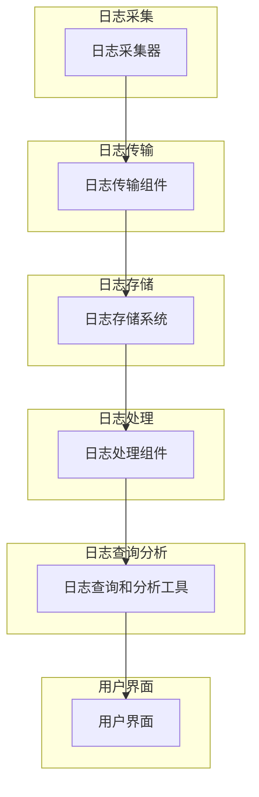

                 


### 第一部分：日志管理概述

## 第1章 问题背景与核心概念

### 1.1 日志管理的重要性

在信息化和数字化时代，日志管理成为企业运维、监控和安全保障的重要组成部分。日志管理不仅能够记录系统运行中的各种操作和事件，还能为问题排查、性能优化、安全审计提供宝贵的数据支持。因此，日志管理的重要性体现在以下几个方面：

1. **问题排查**：日志记录了系统运行中的各种异常情况，有助于快速定位问题根源，缩短故障修复时间。
2. **性能优化**：通过对日志数据的分析，可以发现系统的瓶颈和性能问题，从而进行针对性的优化。
3. **安全审计**：日志数据可以记录系统中的所有操作行为，为安全审计提供重要依据，有助于防范和应对各种安全威胁。
4. **合规性要求**：很多行业和地区对日志记录有严格的要求，日志管理是实现合规性目标的关键环节。

#### 1.1.1 日志管理在企业信息化中的地位

在企业信息化进程中，日志管理处于基础而关键的地位。它不仅关系到日常运维工作的顺畅进行，也直接影响到企业的整体业务运营效率和安全性。以下是日志管理在企业信息化中的几个重要作用：

1. **运维支持**：日志管理为IT运维团队提供了强有力的支持，使他们在面对突发问题时能够迅速找到解决方案。
2. **监控与预警**：通过分析日志数据，可以实现对系统的实时监控和预警，提前发现潜在问题。
3. **业务分析**：日志数据中蕴含着大量的业务信息，通过对日志数据的分析，可以深入了解业务流程和用户行为，为业务决策提供数据支持。
4. **合规管理**：日志管理是实现合规性要求的重要手段，确保企业遵守相关法律法规和行业标准。

#### 1.1.2 日志管理的意义与价值

日志管理的意义和价值主要体现在以下几个方面：

1. **数据化决策**：日志管理通过收集、存储、分析日志数据，为企业提供了数据化的决策依据，有助于提高业务决策的科学性和准确性。
2. **风险控制**：通过对日志数据的监控和分析，可以及时发现和防范各种安全风险，保护企业信息资产的安全。
3. **资源优化**：日志管理通过对系统运行数据的分析，可以帮助企业优化资源配置，提高系统运行效率。
4. **用户体验**：日志管理通过对用户行为的分析，可以优化产品设计和功能，提升用户体验。

### 1.2 日志管理的问题与挑战

尽管日志管理在企业信息化中具有重要作用，但在实际应用中，也存在一些问题和挑战：

1. **日志数据量大**：随着系统的复杂性和规模的增长，日志数据量急剧增加，给日志管理带来了巨大的压力。
2. **日志格式多样**：不同系统和应用产生的日志格式各不相同，增加了日志收集和处理的复杂性。
3. **日志分析困难**：日志数据包含大量冗余信息和噪音，如何有效地提取有用信息进行深度分析是一个挑战。
4. **日志存储与备份**：日志数据的存储和管理需要考虑到数据的安全性和可靠性，同时要满足合规性要求。
5. **日志系统安全**：日志系统自身也可能成为攻击目标，如何确保日志系统的安全性是日志管理面临的挑战之一。

#### 1.2.1 传统日志管理的痛点

传统日志管理存在以下痛点：

1. **分散式管理**：不同系统和应用产生的日志分散在不同的日志文件中，难以统一管理和分析。
2. **低效查询**：传统日志管理系统的查询效率较低，无法满足实时监控和快速检索的需求。
3. **数据丢失**：由于日志存储和管理的不规范，可能导致日志数据的丢失和损坏。
4. **日志格式不统一**：不同系统和应用产生的日志格式不一致，增加了日志处理和分析的难度。
5. **维护成本高**：传统日志管理系统通常需要大量的硬件和软件资源，维护成本较高。

#### 1.2.2 集中式日志管理的优势

集中式日志管理系统相较于传统日志管理，具有以下优势：

1. **统一管理**：集中式日志管理系统能够统一收集、存储和分析来自不同系统和应用的日志数据，方便管理和分析。
2. **高效查询**：集中式日志管理系统能够提供高效的日志检索功能，满足实时监控和快速检索的需求。
3. **数据安全性**：集中式日志管理系统能够提供更全面的数据备份和恢复功能，确保日志数据的安全性和可靠性。
4. **易于扩展**：集中式日志管理系统能够轻松扩展，支持大规模系统的日志管理需求。
5. **合规性支持**：集中式日志管理系统能够更好地满足合规性要求，确保企业遵守相关法律法规和行业标准。

#### 1.2.3 日志管理面临的挑战

日志管理面临的主要挑战包括：

1. **海量数据存储与处理**：随着日志数据量的急剧增长，如何高效地存储和处理海量日志数据成为一个挑战。
2. **日志数据的多样性**：不同系统和应用产生的日志数据格式多样，增加了日志处理的复杂性。
3. **实时性与一致性**：如何在保证日志实时性的同时，确保日志数据的准确性和一致性。
4. **日志系统的安全与隐私保护**：如何确保日志系统自身的安全性，防止日志数据泄露和被恶意篡改。

### 1.3 日志管理的基本概念与术语

在深入探讨日志管理之前，我们需要了解一些基本的概念和术语：

1. **日志**：日志是指记录系统运行过程中发生的各种事件和操作的数据文件。日志可以记录系统启动、错误发生、文件访问、用户登录等信息。
2. **日志条目**：日志条目是指日志文件中的一条记录，包含特定时间发生的特定事件的详细信息。
3. **日志级别**：日志级别是指用于标识事件严重程度的分类，常见的日志级别包括 debug、info、warning、error 等。
4. **日志格式**：日志格式是指日志条目的结构化表示方式，常见的日志格式包括 JSON、XML、Syslog 等。
5. **日志采集**：日志采集是指从系统和应用中收集日志数据的过程。
6. **日志存储**：日志存储是指将日志数据保存到持久存储设备的过程。
7. **日志查询**：日志查询是指通过特定的查询工具或接口对日志数据进行检索和分析的过程。
8. **日志分析**：日志分析是指通过分析和挖掘日志数据，提取有价值的信息和洞见的过程。

### 1.4 日志管理的边界与外延

日志管理的边界与外延涉及以下几个方面：

1. **日志管理范围**：日志管理不仅包括系统和应用产生的日志数据，还包括网络设备、数据库、存储设备等其他设备产生的日志。
2. **日志管理与其他系统的关系**：日志管理通常与其他系统如监控系统、安全审计系统、数据仓库系统等相互配合，共同构成企业级的信息化系统。
3. **日志管理的发展趋势**：随着大数据和人工智能技术的发展，日志管理也在不断进化，包括日志数据的实时处理、智能分析等新功能。

### 1.5 日志管理系统的核心要素组成

日志管理系统的核心要素包括：

1. **日志采集模块**：负责从各个系统和应用中收集日志数据。
2. **日志存储模块**：负责将收集到的日志数据存储到持久存储设备中。
3. **日志查询与分析模块**：提供高效的日志查询和分析功能，帮助用户快速定位问题和洞察业务。
4. **日志系统安全组件**：确保日志系统的安全性和数据隐私，防止日志数据泄露和被恶意篡改。

## 第2章 日志核心概念与联系

### 2.1 日志的概念

日志是记录系统或应用运行过程中发生的事件和操作的数据文件。日志可以包含多种类型的信息，如错误、警告、调试信息、用户操作记录、系统性能指标等。日志的格式和内容因系统和应用的不同而各异，但一般包括以下要素：

1. **时间戳**：记录事件发生的具体时间。
2. **日志级别**：标识事件的严重程度。
3. **来源**：记录事件发生的系统和应用。
4. **事件描述**：对事件的详细描述。
5. **附加信息**：包括事件相关的其他信息，如用户身份、文件路径、错误代码等。

### 2.2 日志的属性与特征

日志的属性和特征对日志管理至关重要，主要包括：

1. **时间敏感性**：日志记录的事件通常具有时间敏感性，时间戳是日志的核心属性之一。
2. **可追溯性**：日志数据可以追溯至具体的系统和应用，有助于问题排查和责任追溯。
3. **结构化**：日志通常具有结构化的格式，便于存储、查询和分析。
4. **多样性**：不同系统和应用产生的日志格式多样，增加了日志处理的复杂性。
5. **海量性**：随着系统规模的增长，日志数据量急剧增加，给日志管理带来挑战。

### 2.3 日志的格式与分类

日志的格式和分类对日志处理和分析具有重要意义。常见的日志格式包括：

1. **文本格式**：最简单的日志格式，以纯文本形式记录日志条目。
2. **JSON**：JSON格式具有较好的结构化特点，便于数据解析和处理。
3. **XML**：XML格式具有丰富的标签和属性，适用于复杂的数据结构。
4. **Syslog**：Syslog是一种标准化的日志格式，广泛用于网络设备和系统日志。

日志分类可以根据不同的标准进行，如：

1. **按日志来源分类**：分为操作系统日志、应用日志、网络设备日志等。
2. **按日志类型分类**：分为错误日志、性能日志、安全日志等。
3. **按日志级别分类**：分为 debug、info、warning、error 等。

### 2.4 日志之间的关联性

日志之间的关联性对问题排查和事件分析至关重要。日志之间的关联性主要体现在以下几个方面：

1. **事件序列关联**：通过时间戳和事件描述，可以将一系列相关事件串联起来，分析事件的因果关系。
2. **系统间关联**：通过日志来源和事件描述，可以分析不同系统之间的交互关系，了解系统间的依赖和影响。
3. **日志层级关联**：通过分析不同层级日志的关联性，可以深入了解事件的发生过程和影响范围。

### 2.5 日志管理的核心原理

日志管理的核心原理包括：

1. **日志采集**：从系统和应用中收集日志数据，确保数据的完整性和准确性。
2. **日志存储**：将采集到的日志数据存储到持久存储设备中，保证数据的安全性和可靠性。
3. **日志查询**：提供高效的日志检索功能，支持实时监控和快速检索。
4. **日志分析**：通过分析和挖掘日志数据，提取有价值的信息和洞见。
5. **日志系统安全**：确保日志系统的安全性和数据隐私，防止日志数据泄露和被恶意篡改。

### 第2章 日志核心概念与联系

#### 2.1 日志的概念

日志（Log）是记录系统或应用运行过程中发生的各种事件和操作的信息集合。日志的目的是为了追踪系统的运行状态，以便在出现问题时进行诊断和修复。日志内容通常包括时间戳、事件描述、日志级别、来源应用或模块等关键信息。

#### 2.2 日志的属性与特征

日志具有以下属性和特征：

1. **时间戳**：日志中的时间戳是记录事件发生时间的标识，它有助于确定事件发生的顺序和时间点。
2. **唯一性**：每条日志条目都应该具有唯一标识，以便于查询和关联。
3. **可追溯性**：日志应该能够追溯到具体的应用或系统组件，有助于问题定位。
4. **可扩展性**：日志格式应允许扩展新字段，以适应不同场景和需求。
5. **多样性**：日志数据格式多种多样，包括文本、JSON、XML等。
6. **结构化**：结构化日志能够提高数据的可读性和分析效率。
7. **可查询性**：日志系统应提供高效、灵活的查询机制，以便快速定位和分析事件。

#### 2.3 日志的格式与分类

日志的格式通常根据应用需求和标准进行设计。以下是几种常见的日志格式：

1. **文本格式**：最简单的日志格式，通常以时间戳开头，后跟事件描述。例如：
   ```
   2023-03-15 14:25:00 - [INFO] - System started successfully.
   ```

2. **JSON格式**：JSON格式日志具有较好的结构化特点，便于存储和解析。例如：
   ```json
   {
     "timestamp": "2023-03-15T14:25:00Z",
     "level": "INFO",
     "source": "SystemManager",
     "message": "System started successfully."
   }
   ```

3. **XML格式**：XML格式日志适用于复杂的数据结构，允许定义多种标签和属性。例如：
   ```xml
   <log>
     <timestamp>2023-03-15T14:25:00Z</timestamp>
     <level>INFO</level>
     <source>SystemManager</source>
     <message>System started successfully.</message>
   </log>
   ```

日志分类可以根据不同的标准进行，例如：

1. **按来源分类**：操作系统日志、应用日志、数据库日志、网络设备日志等。
2. **按类型分类**：错误日志、性能日志、安全日志、调试日志等。
3. **按级别分类**：DEBUG、INFO、WARNING、ERROR等。

#### 2.4 日志之间的关联性

日志之间的关联性是日志管理中一个重要的概念。关联日志可以帮助分析事件的全貌和因果关系。以下是几种常见的日志关联方式：

1. **时间序列关联**：根据日志的时间戳，将连续发生的事件串联起来，形成时间序列，有助于分析事件的发生顺序。
2. **事件关联**：通过日志内容中的关键字或标识符，将不同来源的日志关联起来，分析事件的影响范围。
3. **上下文关联**：将同一事件的上下文信息（如用户ID、会话ID、请求ID等）记录在日志中，以便于追溯和分析。
4. **层级关联**：分析不同层级日志（如应用层日志、系统层日志）之间的关联，理解事件的发生和传递过程。

#### 2.5 日志管理的核心原理

日志管理的核心原理包括以下几个方面：

1. **日志采集**：实时或定期地从系统和应用中收集日志数据。采集方法包括程序内置日志、代理采集、日志驱动器等。
2. **日志存储**：将采集到的日志数据存储在可靠的位置，如文件系统、数据库或云存储。存储时需要考虑数据持久性、备份和恢复机制。
3. **日志查询**：提供高效的日志检索机制，支持按关键字、时间范围、日志级别等条件进行查询。
4. **日志分析**：通过日志数据分析工具，提取日志中的有价值信息，进行趋势分析、异常检测、性能评估等。
5. **日志系统安全**：确保日志数据的安全性和隐私性，防止未经授权的访问和篡改。包括访问控制、数据加密、监控和审计等。

#### 2.6 日志管理的重要性

日志管理在企业信息化和系统运维中具有重要意义，包括：

1. **故障诊断**：日志记录了系统运行中的各种事件，有助于快速定位故障原因。
2. **性能监控**：通过对日志数据的分析，可以发现系统的性能瓶颈和资源利用率，进行优化调整。
3. **安全审计**：日志数据为安全审计提供了重要证据，有助于识别和防范安全威胁。
4. **合规性**：许多行业和地区对日志记录有严格要求，日志管理是满足合规性要求的重要手段。
5. **业务分析**：日志数据中蕴含着大量业务信息，通过分析可以深入了解业务流程和用户行为。

#### 2.7 日志管理的发展趋势

随着大数据、云计算和人工智能技术的发展，日志管理也在不断演进：

1. **实时处理**：实时日志处理技术使系统能够更快地响应和处理日志数据，支持实时监控和预警。
2. **智能化分析**：利用机器学习和人工智能技术，日志分析可以从海量数据中自动提取有价值的信息和模式。
3. **云原生日志管理**：云原生日志管理将日志管理服务集成到云平台中，提供弹性、可扩展的日志管理能力。
4. **集中式管理**：集中式日志管理系统可以统一收集、存储和分析来自不同系统和应用的日志数据，提高管理效率。
5. **可观测性**：可观测性（Observability）技术通过引入新的指标和监控手段，使系统能够更全面地反映其内部状态和运行情况。

### 第3章 集中式日志系统概述

#### 3.1 集中式日志系统的定义与作用

集中式日志系统是一种专门用于收集、存储、管理和分析系统或应用日志数据的工具或平台。与传统分散式日志管理相比，集中式日志系统具有以下定义和作用：

**定义**：集中式日志系统通过一个统一的管理平台或服务，从多个系统和应用中收集日志数据，并将其存储在中央存储中。用户可以通过这个平台进行日志的查询、分析和监控。

**作用**：

1. **统一管理**：集中式日志系统能够统一收集来自不同系统和应用的日志数据，简化了日志管理流程，提高了管理效率。
2. **高效查询**：集中式日志系统提供了高效的日志检索机制，支持按关键字、时间范围、日志级别等条件进行快速查询，提升了问题排查和故障定位的效率。
3. **实时监控**：通过集中式日志系统，用户可以实时监控系统运行状态，及时发现和预警潜在问题。
4. **数据可视化**：集中式日志系统通常集成了数据可视化工具，能够将日志数据以图表、仪表板等形式展示，便于用户分析和理解。
5. **安全性和合规性**：集中式日志系统能够提供更好的数据安全保护机制，确保日志数据不被篡改和泄露，同时满足合规性要求。

#### 3.2 集中式日志系统的特点

集中式日志系统具有以下特点：

1. **统一性**：集中式日志系统能够将来自不同系统和应用的日志数据进行统一收集和管理，避免了日志数据的分散和无序。
2. **高效性**：集中式日志系统通过分布式架构和高效的数据处理技术，能够快速收集、存储和检索海量日志数据。
3. **可扩展性**：集中式日志系统支持水平扩展，能够轻松应对大规模系统和应用日志数据的收集和管理需求。
4. **灵活性**：集中式日志系统提供了丰富的日志格式支持和自定义配置选项，能够适应不同系统和应用的需求。
5. **安全性**：集中式日志系统通过访问控制、数据加密和审计等手段，确保日志数据的安全性和隐私性。
6. **兼容性**：集中式日志系统通常支持多种日志格式和协议，如JSON、XML、Syslog等，能够与不同系统和应用的日志数据进行兼容。

#### 3.3 集中式日志系统的架构

集中式日志系统的架构通常包括以下几个主要组件：

1. **日志采集器**：负责从各个系统和应用中收集日志数据，并传输到集中式日志系统。
2. **日志存储**：用于存储采集到的日志数据，可以是文件系统、数据库或云存储等。
3. **日志处理**：对日志数据进行处理和转换，如日志格式转换、数据清洗、索引构建等。
4. **日志查询和分析**：提供日志查询和分析功能，支持实时监控、趋势分析、异常检测等。
5. **用户界面**：提供一个友好的用户界面，方便用户进行日志数据的查询、分析和监控。
6. **集成和扩展**：支持与其他系统和工具的集成，如监控系统、告警系统、数据仓库等。

以下是一个简化的集中式日志系统架构图：



#### 3.4 集中式日志系统的核心组件

集中式日志系统的核心组件包括日志采集器、日志存储、日志处理和日志查询分析等。以下是每个组件的详细介绍：

1. **日志采集器**：日志采集器是集中式日志系统的前端组件，负责从各个系统和应用中收集日志数据。常见的日志采集方法包括：

   - **代理模式**：日志采集器作为一个独立的代理进程，监听系统的日志输出并收集日志数据。
   - **网络传输**：日志采集器通过网络协议（如Syslog、HTTP等）从远程系统和应用中接收日志数据。
   - **API调用**：通过API接口从其他系统和应用中获取日志数据。

2. **日志存储**：日志存储是集中式日志系统的后端组件，负责存储采集到的日志数据。常见的日志存储方案包括：

   - **文件系统**：将日志数据存储在文件系统中，适用于中小规模的数据存储。
   - **数据库**：使用数据库存储日志数据，提供更高效的查询和数据分析能力。
   - **云存储**：利用云存储服务（如AWS S3、Google Cloud Storage等）存储海量日志数据，提供高可靠性和可扩展性。

3. **日志处理**：日志处理组件负责对采集到的日志数据进行处理和转换，以便更好地进行存储和分析。常见的日志处理任务包括：

   - **日志格式转换**：将不同格式的日志数据转换为统一的格式，如JSON或XML。
   - **数据清洗**：去除日志数据中的冗余信息和噪音，提取关键信息。
   - **索引构建**：为日志数据构建索引，提高查询效率。

4. **日志查询和分析**：日志查询和分析组件提供了丰富的查询和分析功能，帮助用户从海量日志数据中提取有价值的信息。常见的功能包括：

   - **日志查询**：支持按关键字、时间范围、日志级别等条件进行快速查询。
   - **趋势分析**：通过日志数据生成趋势图表，分析系统运行状态和性能变化。
   - **异常检测**：通过机器学习算法和规则引擎，自动识别异常事件和潜在问题。
   - **报告生成**：自动生成日志分析报告，提供业务和运维决策支持。

5. **用户界面**：用户界面是集中式日志系统的用户交互入口，提供了友好的操作界面，使用户能够方便地查询、分析和监控日志数据。常见的用户界面功能包括：

   - **日志浏览**：提供日志数据的全文浏览和搜索功能。
   - **仪表板**：展示关键指标的实时数据和趋势图表。
   - **告警管理**：设置和接收日志数据异常告警。
   - **报告导出**：导出日志分析报告，支持多种格式（如PDF、CSV等）。

### 第4章 日志采集模块设计与实现

#### 4.1 日志采集模块概述

日志采集模块是集中式日志系统的核心组件之一，负责从各个系统和应用中收集日志数据。日志采集模块的设计与实现直接影响到日志系统的性能、可靠性和可扩展性。以下是日志采集模块的概述：

**日志采集模块的作用**：

- **统一日志收集**：日志采集模块将来自不同系统和应用的日志数据进行统一收集，避免了日志数据的分散和无序，提高了日志管理的效率。
- **数据完整性**：日志采集模块确保日志数据的完整性和准确性，防止日志数据的丢失和损坏。
- **实时性**：日志采集模块能够实时收集日志数据，支持实时监控和预警。

**日志采集模块的基本原理**：

- **监听日志输出**：日志采集模块通过监听系统的日志输出（如文件、Syslog、网络传输等）来收集日志数据。
- **数据传输**：将收集到的日志数据传输到集中式日志系统的存储和查询模块。

#### 4.2 日志采集的基本原理

日志采集的基本原理包括以下几个方面：

1. **日志源识别**：首先需要识别系统中哪些设备和应用会产生日志数据，如操作系统、应用程序、网络设备等。
2. **日志格式解析**：不同系统和应用的日志格式可能不同，日志采集模块需要能够解析这些不同格式的日志。
3. **日志收集方法**：常见的日志收集方法包括：

   - **代理模式**：日志采集模块以代理进程的形式运行在系统中，监听日志输出并收集日志数据。
   - **网络传输**：通过Syslog、HTTP等协议从远程系统和应用中收集日志数据。
   - **文件监控**：通过文件监控工具（如inotify、fsnotify等）监控日志文件的变化，并收集新产生的日志数据。

4. **数据传输**：将收集到的日志数据通过TCP、UDP等协议传输到集中式日志系统的存储和查询模块。

#### 4.3 日志采集的实现方法

日志采集模块的实现方法因系统和应用的不同而有所不同，但通常包括以下几个步骤：

1. **选择合适的日志采集工具**：根据系统和应用的特点选择合适的日志采集工具或组件，如logstash、fluentd、log4j等。
2. **配置日志采集规则**：配置日志采集规则，包括日志源、日志格式、采集频率等。
3. **部署日志采集器**：在系统和应用中部署日志采集器，可以是独立进程或作为服务运行。
4. **测试和优化**：测试日志采集器的性能和稳定性，根据实际情况进行优化和调整。

以下是一个简单的日志采集实现示例：

```python
import logging
import time

# 配置日志格式
logging.basicConfig(level=logging.DEBUG, format='[%(asctime)s] [%(levelname)s] [%(name)s] %(message)s')

# 定义日志采集器
class LogCollector:
    def __init__(self, log_file):
        self.log_file = log_file

    def collect_logs(self):
        with open(self.log_file, 'r') as f:
            for line in f:
                print(line.strip())

# 创建日志采集器实例
log_collector = LogCollector('system.log')

# 开始采集日志
while True:
    log_collector.collect_logs()
    time.sleep(1)
```

#### 4.4 日志采集的挑战与解决方案

日志采集过程中可能会遇到以下挑战：

1. **日志格式多样**：不同系统和应用产生的日志格式可能不同，增加了日志采集的复杂性。解决方案是使用通用的日志格式（如JSON）进行采集，并在后续处理过程中进行格式转换。
2. **日志数据量大**：随着系统和应用规模的增长，日志数据量急剧增加，对日志采集和处理性能提出了挑战。解决方案是采用分布式日志采集架构，提高采集和处理效率。
3. **实时性和一致性**：确保日志采集的实时性和一致性是一个挑战。解决方案是使用高效的数据传输协议（如TCP）和日志缓冲区，同时保证日志采集器的稳定性和可靠性。
4. **日志采集器稳定性**：日志采集器在系统和应用中的稳定性对日志采集效果至关重要。解决方案是选择稳定且可靠的日志采集工具，并进行定期监控和运维。

通过有效的日志采集模块设计与实现，集中式日志系统能够高效地收集和管理海量日志数据，为企业的运维、监控和安全保障提供有力支持。

### 第5章 日志存储模块设计与实现

#### 5.1 日志存储模块概述

日志存储模块是集中式日志系统的核心组成部分，负责接收、存储和管理从日志采集模块收集到的日志数据。日志存储模块的设计与实现直接影响到日志系统的性能、可靠性和可扩展性。以下是日志存储模块的概述：

**日志存储模块的作用**：

- **数据持久化**：将日志数据存储在持久化存储介质中，如文件系统、数据库或云存储，确保数据的安全性和可靠性。
- **数据检索**：提供高效的日志查询和检索功能，支持按关键字、时间范围、日志级别等条件进行快速查询。
- **数据备份与恢复**：实现日志数据的备份与恢复，防止数据丢失和损坏。

**日志存储模块的基本原理**：

- **数据接收**：日志存储模块接收来自日志采集模块的日志数据。
- **数据存储**：将接收到的日志数据按照一定的策略存储到持久化存储介质中。
- **数据索引**：为日志数据构建索引，提高查询效率。
- **数据备份**：定期对日志数据进行备份，防止数据丢失。

#### 5.2 日志存储的基本原理

日志存储的基本原理包括以下几个方面：

1. **数据存储介质**：选择合适的存储介质，如文件系统、数据库或云存储。文件系统适用于中小规模数据存储，数据库适用于大规模数据存储和查询，云存储适用于海量数据存储和弹性扩展。
2. **数据存储格式**：日志数据的存储格式对存储性能和查询效率有很大影响。常见的存储格式包括文本文件、JSON文件、数据库表等。
3. **数据索引**：为日志数据构建索引，提高查询效率。索引可以是基于时间戳、日志级别、关键字等的索引。
4. **数据备份与恢复**：实现日志数据的备份与恢复，确保数据的安全性和可靠性。常见的备份策略包括全量备份、增量备份和差异备份。

#### 5.3 日志存储的实现方法

日志存储模块的实现方法因数据存储介质和需求的差异而有所不同，但通常包括以下几个步骤：

1. **选择存储介质**：根据日志数据量、查询需求和性能要求，选择合适的存储介质。
2. **设计数据模型**：根据日志数据的结构，设计数据模型和表结构，如使用JSON格式存储日志数据。
3. **构建数据索引**：为日志数据构建索引，提高查询效率。
4. **实现数据备份与恢复**：实现日志数据的备份与恢复功能，确保数据安全。

以下是一个简单的日志存储实现示例：

```python
import json
import time

# 日志存储类
class LogStore:
    def __init__(self, log_file):
        self.log_file = log_file

    def store_logs(self, logs):
        with open(self.log_file, 'a') as f:
            for log in logs:
                f.write(json.dumps(log) + '\n')

# 创建日志存储实例
log_store = LogStore('system.log')

# 存储日志
while True:
    log_entry = {
        'timestamp': time.time(),
        'level': 'INFO',
        'source': 'SystemManager',
        'message': 'System started successfully.'
    }
    log_store.store_logs([log_entry])
    time.sleep(1)
```

#### 5.4 日志存储的性能优化

日志存储的性能优化是集中式日志系统设计的重要环节，以下是一些常见的性能优化方法：

1. **数据分片**：将海量日志数据分散存储在多个节点上，提高存储系统的并发处理能力。
2. **索引优化**：优化索引结构，减少索引存储空间和查询时间。例如，使用复合索引、位图索引等。
3. **数据压缩**：对日志数据进行压缩，减少存储空间占用和I/O负载。
4. **缓存机制**：使用缓存机制，减少对后端存储的访问频率，提高查询响应速度。
5. **读写分离**：将日志数据的读和写操作分离到不同的存储节点上，提高系统的读写性能。
6. **负载均衡**：使用负载均衡器，均衡地分配日志数据到不同的存储节点，提高系统的可用性和性能。

通过有效的日志存储模块设计与实现，集中式日志系统能够高效地存储和管理海量日志数据，为企业的运维、监控和安全保障提供有力支持。

### 第6章 日志查询与分析模块设计与实现

#### 6.1 日志查询与分析模块概述

日志查询与分析模块是集中式日志系统的核心组件之一，负责对存储的日志数据进行分析和查询。该模块的设计与实现直接影响到日志系统的分析效率、准确性和用户体验。以下是日志查询与分析模块的概述：

**日志查询与分析模块的作用**：

- **日志查询**：提供高效的日志查询功能，支持按关键字、时间范围、日志级别等条件进行快速查询，帮助用户快速定位和分析问题。
- **日志分析**：对日志数据进行深度分析，提取有价值的信息和洞见，为运维、监控和安全审计提供数据支持。

**日志查询与分析模块的基本原理**：

- **查询引擎**：基于索引和优化算法，快速定位日志数据，提供高效的查询功能。
- **数据分析**：使用统计、机器学习和规则引擎等技术，对日志数据进行深度分析，提取业务和运维价值。
- **可视化**：将分析结果以图表、仪表板等形式展示，方便用户理解和决策。

#### 6.2 日志查询的基本原理

日志查询的基本原理包括以下几个方面：

1. **索引构建**：为日志数据构建索引，提高查询效率。索引可以是基于时间戳、日志级别、关键字等字段。
2. **查询策略**：根据查询条件，选择合适的查询策略，如全量扫描、索引查询等。
3. **查询优化**：优化查询执行计划，减少查询时间。例如，使用索引合并、数据分区等技术。
4. **并发处理**：支持并发查询，提高查询系统的性能和响应速度。

#### 6.3 日志分析的基本原理

日志分析的基本原理包括以下几个方面：

1. **数据预处理**：对日志数据进行清洗、格式转换和标准化，确保数据的一致性和准确性。
2. **数据聚合**：对日志数据进行分组和聚合，提取关键指标和统计信息。
3. **异常检测**：使用统计分析和机器学习算法，识别异常事件和潜在问题。
4. **趋势分析**：分析日志数据的变化趋势，预测系统运行状态和性能变化。

#### 6.4 日志查询与分析的实现方法

日志查询与分析模块的实现方法包括以下几个步骤：

1. **选择查询与分析工具**：根据日志数据量和查询需求，选择合适的查询与分析工具，如Elasticsearch、Kibana等。
2. **构建索引**：为日志数据构建索引，提高查询效率。
3. **实现查询接口**：开发日志查询接口，支持按关键字、时间范围、日志级别等条件进行查询。
4. **实现数据分析**：使用统计分析和机器学习算法，对日志数据进行深度分析。
5. **数据可视化**：将分析结果以图表、仪表板等形式展示，方便用户理解和决策。

以下是一个简单的日志查询与分析实现示例：

```python
from elasticsearch import Elasticsearch

# 创建Elasticsearch客户端
es = Elasticsearch("http://localhost:9200")

# 查询日志
def search_logs(query, index="log_index"):
    return es.search(index=index, body={"query": {"match": {"message": query}}})

# 分析日志
def analyze_logs(logs):
    errors = sum(1 for log in logs if log['level'] == 'ERROR')
    warnings = sum(1 for log in logs if log['level'] == 'WARNING')
    return errors, warnings

# 查询日志并分析
results = search_logs("System started successfully.")
logs = results['hits']['hits']
errors, warnings = analyze_logs(logs)

print(f"Errors: {errors}, Warnings: {warnings}")
```

#### 6.5 日志查询与分析模块的性能优化

日志查询与分析模块的性能优化是集中式日志系统设计的重要环节，以下是一些常见的性能优化方法：

1. **索引优化**：优化索引结构，减少索引存储空间和查询时间。例如，使用复合索引、位图索引等。
2. **数据压缩**：对日志数据进行压缩，减少存储空间占用和I/O负载。
3. **缓存机制**：使用缓存机制，减少对后端存储的访问频率，提高查询响应速度。
4. **查询优化**：优化查询执行计划，减少查询时间。例如，使用索引合并、数据分区等技术。
5. **并发处理**：支持并发查询，提高查询系统的性能和响应速度。
6. **负载均衡**：使用负载均衡器，均衡地分配查询请求到不同的节点，提高系统的可用性和性能。

通过有效的日志查询与分析模块设计与实现，集中式日志系统能够高效地查询和分析海量日志数据，为企业的运维、监控和安全保障提供有力支持。

### 第7章 日志系统安全与优化

#### 7.1 日志系统安全概述

日志系统安全是确保日志数据不被未经授权的访问、篡改或泄露的重要措施。一个安全的日志系统不仅能够保护企业的重要信息，还能满足合规性要求，提高系统的整体安全性。以下是日志系统安全的重要方面：

**日志系统安全的重要性**：

- **防止数据泄露**：日志数据中可能包含敏感信息，如用户身份、操作记录等。确保日志数据的安全，可以防止敏感信息的泄露。
- **支持合规性要求**：许多行业和地区对日志记录有严格的要求，确保日志系统的安全性是实现合规性目标的关键。
- **提升系统安全性**：日志系统安全是整体系统安全的一部分，一个安全的日志系统有助于提高整个系统的安全性。

**日志系统安全的核心原则**：

- **最小权限原则**：日志系统用户应具有最小的权限，只访问必要的日志数据。
- **数据加密**：对日志数据进行加密，确保数据在传输和存储过程中的安全性。
- **访问控制**：实施严格的访问控制策略，确保只有授权用户才能访问日志数据。
- **审计和监控**：对日志系统进行审计和监控，及时发现和应对潜在的安全威胁。
- **备份和恢复**：定期备份数据，确保在数据丢失或损坏时能够快速恢复。

#### 7.2 日志系统安全的实现方法

以下是实现日志系统安全的一些具体方法和策略：

1. **数据加密**：

   - **传输加密**：使用SSL/TLS等协议对日志数据在传输过程中的进行加密，确保数据在网络中的安全性。
   - **存储加密**：对存储在数据库或文件系统中的日志数据进行加密，防止数据被非法访问。
   - **加密算法**：选择合适的加密算法，如AES、RSA等，确保数据加密的安全性和性能。

2. **访问控制**：

   - **用户认证**：实施严格的用户认证机制，如密码认证、多因素认证等，确保只有授权用户才能访问系统。
   - **权限管理**：为不同用户分配不同的权限，确保用户只能访问自己有权访问的日志数据。
   - **角色与权限分离**：将用户角色与权限分离，确保不同角色的用户具有不同的操作权限。

3. **审计和监控**：

   - **日志审计**：记录系统操作的详细日志，如用户登录、查询、修改等操作，以便在发生安全事件时进行审计。
   - **异常监控**：使用入侵检测系统和安全信息与事件管理系统（SIEM），实时监控日志系统中的异常行为和潜在威胁。
   - **告警机制**：配置告警机制，及时发现和通知安全事件，确保能够迅速响应和处理。

4. **备份和恢复**：

   - **定期备份**：定期备份数据，确保在数据丢失或损坏时能够快速恢复。
   - **备份存储**：将备份数存储在安全的位置，如异地备份、云存储等，确保备份数据的安全性和可靠性。
   - **恢复策略**：制定详细的恢复策略，确保在发生数据丢失或损坏时能够快速、有效地恢复系统。

#### 7.3 日志系统的性能优化

日志系统性能优化是确保日志系统能够高效处理和管理海量日志数据的关键。以下是日志系统性能优化的一些方法：

1. **索引优化**：

   - **索引选择**：选择合适的索引策略，如使用复合索引、位图索引等，提高查询效率。
   - **索引分区**：对日志数据进行分区，将不同时间范围的日志数据存储在不同的分区中，提高查询性能。
   - **索引缓存**：使用索引缓存，减少对后端存储的访问频率，提高查询响应速度。

2. **数据压缩**：

   - **数据压缩**：对日志数据进行压缩，减少存储空间占用和I/O负载。
   - **选择合适的压缩算法**：选择适合日志数据的压缩算法，如LZ4、Gzip等，确保压缩性能和存储空间的平衡。

3. **并发处理**：

   - **并发查询**：支持并发查询，提高查询系统的性能和响应速度。
   - **多线程处理**：使用多线程或异步处理技术，提高日志处理和查询的并发能力。

4. **缓存机制**：

   - **内存缓存**：使用内存缓存，减少对后端存储的访问频率，提高查询响应速度。
   - **缓存策略**：配置合适的缓存策略，如LRU（Least Recently Used）缓存替换策略，确保缓存的有效性和性能。

5. **负载均衡**：

   - **负载均衡器**：使用负载均衡器，将查询请求均衡地分配到不同的节点，提高系统的可用性和性能。
   - **分布式架构**：采用分布式架构，将日志处理和查询任务分布到多个节点，提高系统的扩展性和性能。

通过实施有效的日志系统安全与性能优化措施，集中式日志系统能够更好地保护企业的重要信息，提高系统的可靠性和性能，为企业的运维、监控和安全保障提供有力支持。

### 第8章 项目实战与案例分析

#### 8.1 日志管理项目环境搭建

在开始日志管理项目之前，我们需要搭建一个合适的环境。以下是搭建日志管理项目环境的基本步骤：

1. **硬件资源**：选择足够的硬件资源，包括服务器、存储设备等。根据项目需求，可以租用云服务器的虚拟机，或使用物理服务器。
2. **操作系统**：选择适合的操作系统，如Linux（推荐使用Ubuntu或CentOS）或Windows Server。
3. **软件环境**：安装必要的软件，包括日志采集工具、日志存储系统、日志查询与分析工具等。以下是常用的软件和工具：

   - **日志采集工具**：如Fluentd、Logstash等。
   - **日志存储系统**：如Elasticsearch、Logstash等。
   - **日志查询与分析工具**：如Kibana、Grafana等。
4. **网络配置**：配置网络环境，确保各组件之间的网络通信正常。如果使用云服务器，需要配置相应的安全组规则，允许日志数据在内部网络中传输。

#### 8.2 日志采集模块实现

日志采集模块是实现集中式日志系统的关键步骤之一。以下是如何实现日志采集模块的详细步骤：

1. **选择日志采集工具**：根据项目需求和系统环境，选择合适的日志采集工具。例如，可以选择Fluentd或Logstash。
2. **配置采集规则**：配置日志采集工具的采集规则，指定要收集的日志文件、日志格式、采集频率等。例如，在Fluentd中，可以使用配置文件定义采集规则。
3. **部署采集器**：在系统中部署日志采集器，可以是独立进程或作为服务运行。例如，在Linux系统中，可以使用systemd服务管理器部署Fluentd服务。
4. **测试采集效果**：启动日志采集器后，检查日志数据是否被成功采集到集中式日志系统中。可以通过实时查看日志或使用日志查询工具进行验证。

以下是一个简单的Fluentd配置示例：

```shell
<source>
  @type tail
  path /var/log/syslog
  tag syslog.*
  read_from_head true
  format json
</source>
```

#### 8.3 日志存储模块实现

日志存储模块负责将采集到的日志数据存储到持久存储设备中。以下是如何实现日志存储模块的详细步骤：

1. **选择日志存储系统**：根据项目需求和性能要求，选择合适的日志存储系统。例如，可以选择Elasticsearch或Logstash。
2. **配置存储系统**：配置日志存储系统的相关参数，如集群配置、索引模板、数据存储路径等。例如，在Elasticsearch中，可以使用Kibana进行配置。
3. **部署存储组件**：在系统中部署日志存储组件，可以是独立服务或作为集群运行。例如，在Linux系统中，可以使用Docker部署Elasticsearch集群。
4. **测试存储效果**：启动日志存储组件后，检查日志数据是否被成功存储到存储系统中。可以通过Kibana或其他日志查询工具进行验证。

以下是一个简单的Elasticsearch集群部署示例：

```shell
docker run -d --name es -p 9200:9200 -p 9300:9300 docker.elastic.co/elasticsearch/elasticsearch:7.10.0
```

#### 8.4 日志查询与分析模块实现

日志查询与分析模块提供了对存储的日志数据进行分析和查询的功能。以下是如何实现日志查询与分析模块的详细步骤：

1. **选择查询与分析工具**：根据项目需求和用户界面要求，选择合适的查询与分析工具。例如，可以选择Kibana或Grafana。
2. **配置查询与分析工具**：配置查询与分析工具的相关参数，如数据源、索引模式、仪表板模板等。例如，在Kibana中，可以使用Kibana的配置文件进行配置。
3. **部署查询与分析工具**：在系统中部署查询与分析工具，可以是独立服务或作为Web应用运行。例如，在Linux系统中，可以使用Nginx作为Web服务器部署Kibana。
4. **测试查询与分析效果**：启动查询与分析工具后，检查查询和分析功能是否正常。可以通过Kibana或Grafana的用户界面进行验证。

以下是一个简单的Kibana配置示例：

```json
{
  "kibana": {
    "elasticsearch": {
      "url": "http://localhost:9200",
      "username": "kibana",
      "password": "kibana"
    },
    "plugin.list": ["matrix", "kibana-visualization", "kibana-logging-queries"]
  }
}
```

#### 8.5 项目小结与拓展阅读

通过本项目的实战与案例分析，我们详细介绍了日志管理项目从环境搭建到核心模块实现的全过程。以下是项目小结：

1. **环境搭建**：搭建了适合日志管理项目的硬件资源和软件环境，确保了项目的正常运行。
2. **日志采集模块**：实现了日志采集模块，从系统中收集了日志数据，为后续存储和分析打下了基础。
3. **日志存储模块**：实现了日志存储模块，将采集到的日志数据存储到Elasticsearch集群中，为日志查询和分析提供了数据支持。
4. **日志查询与分析模块**：实现了日志查询与分析模块，通过Kibana提供了直观的查询和分析界面，提高了日志管理的效率和效果。

拓展阅读：

1. **《Elastic Stack实战》**：深入了解Elastic Stack（Elasticsearch、Logstash、Kibana）的架构和功能，学习如何构建高效的日志管理系统。
2. **《日志管理最佳实践》**：了解日志管理的最佳实践，掌握日志采集、存储、查询和分析的高级技术。
3. **《大数据日志分析》**：学习大数据日志分析的技术和方法，如何利用大数据技术进行日志数据的实时处理和分析。

