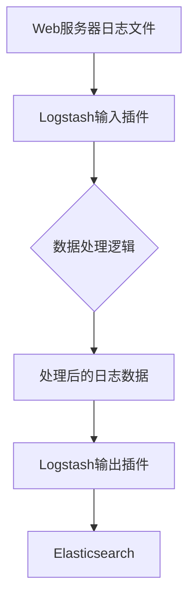
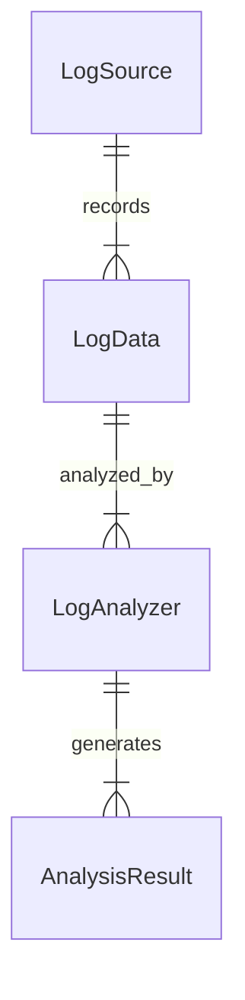
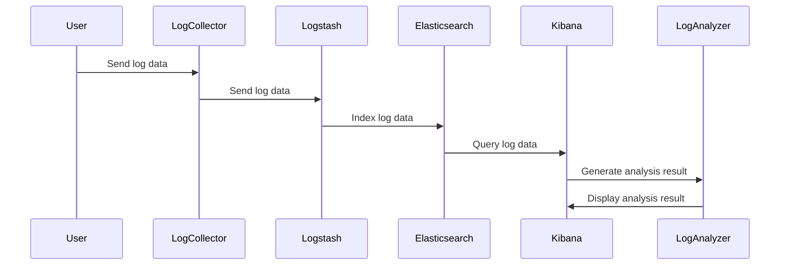

                 

### 《日志聚合与分析：ELK栈的最佳实践》——为何选择此标题

选择《日志聚合与分析：ELK栈的最佳实践》作为文章标题，源于以下几个原因：

首先，**日志聚合与分析**是现代IT运维和大数据分析中的一个核心概念。在数字化时代，企业产生的数据量呈爆炸性增长，日志数据作为其中的一种重要类型，承载着系统运行状态、用户行为等信息。如何有效地聚合和分析这些日志数据，不仅关系到系统的稳定性和安全性，更是提升业务洞察力和竞争力的关键。

其次，**ELK栈**（Elasticsearch、Logstash、Kibana）作为一种强大的日志分析解决方案，已经成为业界的标准配置。ELK栈集成了开源搜索引擎Elasticsearch的高效数据存储和检索能力，数据处理工具Logstash的灵活性和可扩展性，以及数据可视化工具Kibana的直观界面和强大的分析功能。这三个组件相互配合，能够帮助企业实现从数据收集、处理到可视化分析的一站式服务。

**“最佳实践”**这一概念则强调，本文不仅会介绍ELK栈的基本原理和使用方法，还会结合实际项目经验和最佳实践，提供详细的操作指南和优化策略。这样的内容能够帮助读者在学习和应用过程中少走弯路，快速提升日志分析的能力。

因此，《日志聚合与分析：ELK栈的最佳实践》不仅具有明确的主题，还涵盖了实用性、系统性和前瞻性，能够满足不同层次读者的需求。

---

### 关键词：日志聚合与分析、ELK栈、Elasticsearch、Logstash、Kibana、最佳实践

- **日志聚合与分析**：处理和汇总系统日志信息的过程，以获得洞察力和解决问题。
- **ELK栈**：由Elasticsearch、Logstash和Kibana三个开源工具组成的日志分析解决方案。
- **Elasticsearch**：一个分布式、RESTful搜索引擎，用于存储和快速检索大量日志数据。
- **Logstash**：一个服务器端数据处理管道，用于收集、处理和传输日志数据。
- **Kibana**：一个可视化工具，用于创建动态的、实时数据分析仪表板。

这些关键词精准地概括了本文的核心内容，涵盖了日志分析领域的核心概念和工具，有助于读者快速理解和检索文章的重要信息。

---

### 摘要

本文将深入探讨日志聚合与分析在IT运维和数据治理中的重要性，并详细解析ELK栈（Elasticsearch、Logstash、Kibana）作为一种综合日志分析解决方案的应用实践。首先，我们将介绍ELK栈的基本概念及其核心组件，阐述日志聚合与分析的流程和关键技术。接着，本文将逐个介绍Elasticsearch、Logstash和Kibana的功能与架构，并通过实际案例展示如何搭建和配置ELK栈。此外，文章还将分享一系列最佳实践，帮助读者避免常见陷阱，优化日志分析效果。最后，本文将总结全文内容，并推荐进一步阅读的资源，以便读者深入学习日志聚合与分析的先进技术。

---

### 引言

在信息技术飞速发展的今天，企业的IT基础设施越来越复杂，涉及多个服务器、网络设备和应用程序。为了确保系统的稳定运行和快速响应，日志聚合与分析成为了一种不可或缺的运维手段。日志聚合与分析不仅可以帮助我们了解系统的运行状态，还能发现潜在的问题和异常，从而提高系统的可靠性和安全性。而ELK栈——由Elasticsearch、Logstash和Kibana三个开源工具组成的日志分析解决方案，因其高效、灵活和强大的特性，已成为众多企业和开发者的首选。

ELK栈的核心组件各自承担着不同的角色：

- **Elasticsearch**：作为分布式搜索引擎，Elasticsearch能够存储和检索大规模的日志数据，提供高效的全文搜索和数据分析能力。
- **Logstash**：作为一个数据处理管道，Logstash负责从各种数据源收集日志数据，并将其转换为适合存储和查询的格式。
- **Kibana**：作为可视化工具，Kibana通过直观的仪表板和报表，将Elasticsearch和Logstash处理过的数据展示给用户，帮助用户快速发现问题和趋势。

本文旨在通过以下步骤，系统性地介绍日志聚合与分析，并详细解析ELK栈的最佳实践：

1. **背景介绍**：首先，我们将简要介绍日志聚合与分析的重要性，以及ELK栈的概念和应用场景。
2. **核心概念与联系**：接下来，我们将介绍日志聚合与分析中的关键概念，并绘制ER实体关系图，帮助读者理解各个概念之间的关系。
3. **算法原理讲解**：我们将详细介绍日志聚合与分析的基本算法，使用Mermaid绘制流程图，并通过Python源代码和LaTeX数学公式进行详细讲解。
4. **系统分析与架构设计方案**：我们将介绍日志分析系统的设计，包括领域模型、系统架构、接口设计和系统交互。
5. **项目实战**：通过一个实际项目，我们将描述从环境安装到系统核心实现的详细步骤，并对代码进行解读和分析。
6. **最佳实践 tips**：我们将总结一些实用的日志分析技巧和注意事项，帮助读者在实际操作中少走弯路。
7. **小结与拓展阅读**：最后，我们将总结全文内容，并推荐进一步阅读的资源，以便读者深入学习日志聚合与分析的先进技术。

通过这些步骤，本文旨在帮助读者全面了解日志聚合与分析，掌握ELK栈的搭建和使用方法，并能够将所学知识应用到实际工作中。

---

### 第一部分：日志聚合与分析基础

#### 第1章：日志聚合与分析概述

##### 1.1 日志聚合与分析的重要性

在信息技术迅猛发展的时代，企业所依赖的IT基础设施越来越复杂，从服务器到网络设备，再到各种应用程序，所有这些组件都需要进行监控和维护。日志聚合与分析作为IT运维和数据治理中的一个核心环节，扮演着至关重要的角色。

**日志**是一种记录系统或应用程序运行状态、用户行为、错误信息等信息的文件。这些日志数据不仅记录了系统的日常活动，还包含了许多潜在的线索和问题指示。通过分析这些日志数据，运维团队可以了解系统的运行状况，及时发现并解决问题，从而确保系统的稳定性和可靠性。

**日志聚合**是指将来自不同来源、格式和结构的日志数据收集到一个统一的平台上进行处理和分析。这一过程有助于提高数据的一致性和可分析性，使得运维团队能够更全面地了解系统的运行情况。

**日志分析**则是对聚合后的日志数据进行处理、挖掘和解读，以提取有价值的信息和洞察力。通过日志分析，运维团队能够发现系统的异常行为、性能瓶颈、安全威胁等，从而采取相应的措施进行优化和防护。

在IT运维中，日志分析的价值主要体现在以下几个方面：

1. **故障排查**：通过分析日志数据，可以快速定位故障原因，缩短问题排查时间，提高故障响应速度。
2. **性能优化**：日志分析可以帮助识别系统性能瓶颈，优化资源分配，提高系统运行效率。
3. **安全监控**：日志分析能够发现潜在的安全威胁，如恶意攻击、系统漏洞等，为安全防护提供依据。
4. **业务洞察**：通过对用户行为日志的分析，企业可以了解用户需求、使用习惯，为产品改进和业务决策提供支持。

##### 1.2 日志分析的需求与挑战

随着企业IT系统规模的扩大和复杂度的提升，日志分析的需求也越来越高。以下是一些主要需求和挑战：

1. **大规模日志数据管理**：现代企业产生的日志数据量庞大，如何高效地收集、存储和管理这些数据成为一大挑战。
2. **多源日志数据整合**：企业往往使用多种不同的系统和工具，产生的日志数据格式和结构各异，如何将这些多源日志数据整合到一个统一的平台上进行分析是另一个挑战。
3. **实时性与高效性**：随着系统运行状态的不断变化，运维团队需要实时地获取日志数据进行分析，以确保系统问题的及时发现和解决。
4. **安全性**：日志数据中可能包含敏感信息，如何确保日志数据的安全存储和传输，防止泄露和篡改是一个重要问题。
5. **复杂事件处理**：随着日志数据的增长，如何有效地处理和分析复杂事件，提取有价值的信息是一个技术挑战。

##### 1.3 ELK栈的基本概念与作用

ELK栈是由Elasticsearch、Logstash和Kibana三个开源工具组成的日志分析解决方案。每个组件在日志分析过程中都扮演着重要的角色，它们相互配合，共同实现高效、灵活和强大的日志分析功能。

**Elasticsearch**：作为分布式搜索引擎，Elasticsearch主要用于存储和检索大规模的日志数据。它具有高效的数据存储、索引和搜索能力，能够快速地处理和分析日志数据，提供精确的搜索结果。

**Logstash**：Logstash是一个数据处理管道，负责从各种数据源（如系统日志、Web服务器日志、数据库日志等）收集日志数据，并将其转换为适合存储和查询的格式。Logstash具有高度的可扩展性和灵活性，可以处理多种数据格式，支持多种输入和输出插件。

**Kibana**：Kibana是一个可视化工具，通过直观的仪表板和报表，将Elasticsearch和Logstash处理过的数据展示给用户。Kibana提供了丰富的可视化组件，如图表、仪表盘和地图，帮助用户快速发现问题和趋势。

ELK栈的作用主要体现在以下几个方面：

1. **统一日志管理**：ELK栈能够统一收集、存储和展示来自不同来源和格式的日志数据，提供一致的数据视图。
2. **高效数据处理**：Elasticsearch和Logstash的高效数据处理能力，使得日志分析更加快速和精准。
3. **实时监控和报警**：通过Kibana的可视化报表，运维团队能够实时监控系统运行状态，快速响应和解决问题。
4. **高级数据分析**：ELK栈提供了丰富的查询和分析功能，支持多种高级数据分析操作，如全文搜索、聚合分析、时间序列分析等。

##### 1.4 日志聚合与分析流程

日志聚合与分析通常包括以下几个步骤：

1. **数据收集**：将来自不同来源和格式的日志数据收集到一个统一的平台上，如Elasticsearch。
2. **数据预处理**：对收集到的日志数据进行清洗、格式化和转换，确保数据的一致性和可分析性。
3. **数据存储**：将预处理后的日志数据存储在Elasticsearch中，以便后续的分析和查询。
4. **数据查询和分析**：使用Elasticsearch的强大查询和分析功能，对日志数据进行分析，提取有价值的信息。
5. **数据展示**：通过Kibana的报表和仪表盘，将分析结果以可视化的形式展示给用户。

**数据收集**：数据收集是日志聚合与分析的第一步。企业可以使用多种方式收集日志数据，如直接从服务器上获取日志文件、使用网络流量监控工具捕获日志数据、集成第三方日志收集工具等。为了确保数据的完整性和一致性，企业通常需要设计一个统一的日志收集策略，包括数据源的选择、数据格式的定义和数据传输方式等。

**数据预处理**：收集到的日志数据可能存在格式不统一、数据缺失或噪声数据等问题。数据预处理包括数据清洗、数据格式化和数据转换等操作，以确保数据的一致性和可分析性。例如，将不同格式的日志数据转换为统一的JSON格式，删除重复或无关的数据，填充缺失的数据等。

**数据存储**：预处理后的日志数据需要存储在高效的存储系统中，以便进行后续的分析和查询。Elasticsearch作为一种分布式搜索引擎，能够高效地存储和检索大规模的日志数据。在Elasticsearch中，日志数据被存储为索引（Index），每个索引包含一组具有相同字段和属性的文档（Document）。通过合理的索引设计和文档结构设计，可以显著提高数据查询的效率和准确性。

**数据查询和分析**：Elasticsearch提供了丰富的查询和分析功能，包括全文搜索、聚合分析、时间序列分析等。通过Elasticsearch的查询接口，用户可以精确地查询和提取日志数据中的特定信息，进行深入的数据分析。例如，可以使用全文搜索功能查找包含特定关键词的日志记录，使用聚合分析功能统计日志数据中的特定指标，使用时间序列分析功能分析日志数据中的时间趋势等。

**数据展示**：通过Kibana的可视化报表和仪表盘，用户可以直观地查看和分析日志数据。Kibana提供了多种可视化组件，如柱状图、折线图、饼图、地图等，用户可以根据需要自定义仪表板，将关键指标和趋势以可视化的形式展示出来。通过实时监控和报警功能，用户可以及时发现系统中的异常和问题，并采取相应的措施进行修复和优化。

**日志聚合与分析的应用场景**：

1. **系统监控**：通过分析系统日志，可以实时监控系统的运行状态，发现潜在的问题和故障，确保系统的稳定性和可靠性。
2. **性能优化**：通过对系统日志进行分析，可以识别系统的性能瓶颈和资源消耗情况，优化系统配置和资源分配，提高系统运行效率。
3. **安全防护**：通过分析系统日志和网络安全日志，可以检测潜在的安全威胁和攻击行为，采取相应的安全措施进行防护和响应。
4. **业务分析**：通过对用户行为日志和业务日志进行分析，可以了解用户需求和行为习惯，为产品改进和业务决策提供支持。

**ER实体关系图**：

为了帮助读者更好地理解日志聚合与分析中的关键概念和它们之间的关系，我们使用Mermaid绘制了一个ER实体关系图，如下所示：


在这个ER图中，Client（客户端）与Server（服务器）之间存在“makes”关系，表示客户端生成日志数据；Server与Log之间存在“records”关系，表示服务器记录日志数据；Log与Analyzer之间存在“analyzed_by”关系，表示日志数据被分析器分析；Analyzer与Report之间存在“generates”关系，表示分析器生成报告。

通过这个ER实体关系图，读者可以直观地理解日志数据从生成、记录、分析到生成报告的全过程，以及各个实体之间的关系。

**本章小结**：

在本章中，我们介绍了日志聚合与分析的重要性、需求与挑战，以及ELK栈的基本概念和日志聚合与分析的基本流程。通过这些内容，读者可以初步了解日志聚合与分析的基本概念和ELK栈的作用，为后续章节的深入学习打下基础。

---

### 第二部分：ELK栈深入应用

#### 第2章：Elasticsearch核心原理与实践

##### 2.1 Elasticsearch基础

Elasticsearch是一个分布式、RESTful搜索引擎，用于存储和快速检索大量日志数据。其核心优势在于高效的数据存储、索引和搜索能力，使得日志分析更加快速和精准。在介绍Elasticsearch的基础之前，我们需要了解其分布式架构、inverted index（反向索引）以及mapping（映射）和schema（模式）等基本概念。

**2.1.1 分布式架构**

Elasticsearch采用分布式架构，能够水平扩展以处理大规模的数据。在分布式架构中，Elasticsearch由多个节点组成，每个节点都是一个独立的搜索引擎。这些节点通过集群方式进行协同工作，共同处理搜索请求和数据存储。

分布式架构的优势在于：

1. **高可用性**：通过冗余节点，即使某个节点发生故障，系统仍然能够正常运行。
2. **可扩展性**：通过增加节点，可以线性扩展存储和计算能力，满足日益增长的数据需求。
3. **负载均衡**：请求在多个节点之间进行分配，避免单个节点过载。

**2.1.2 Inverted Index（反向索引）**

Elasticsearch使用inverted index（反向索引）来快速检索数据。inverted index是一种将文档内容映射到其单词索引的数据结构，其核心思想是将文档分解为单词，并将每个单词映射到包含该单词的文档列表。

反向索引的优势在于：

1. **高效搜索**：通过反向索引，可以快速定位包含特定单词的文档，从而实现高效的全文搜索。
2. **分词处理**：Elasticsearch可以对文本进行分词处理，将文本分解为单词或短语，便于索引和搜索。
3. **精确匹配**：通过反向索引，可以实现精确的搜索匹配，提高搜索结果的准确性。

**2.1.3 Mapping和Schema（映射和模式）**

Mapping是Elasticsearch中用于定义文档结构和字段属性的配置。通过mapping，可以指定字段的数据类型、索引方式、是否存储原始值等。

Schema（模式）则是定义Elasticsearch索引结构的配置文件，包括index name（索引名称）、mappings（映射）、settings（设置）等。

Mapping和Schema的作用在于：

1. **字段定义**：通过mapping，可以定义文档的字段和数据类型，确保数据的统一性和一致性。
2. **索引配置**：通过schema，可以配置索引的存储和搜索设置，优化索引性能。
3. **数据校验**：通过mapping中的验证规则，可以确保数据的正确性和完整性。

**2.2 Elasticsearch高级特性**

除了基础功能，Elasticsearch还具备许多高级特性，如分片与副本、Query DSL（查询领域特定语言）和聚合分析，这些特性进一步提升了Elasticsearch在日志分析中的应用能力。

**2.2.1 分片与副本**

Elasticsearch采用分片（sharding）机制，将数据分散存储在多个节点上，从而实现高可用性和可扩展性。每个分片都是独立的数据结构，包含一部分文档数据。通过增加分片数量，可以线性扩展存储和搜索能力。

副本（replication）机制则用于数据冗余和故障恢复。每个分片都有一个或多个副本，副本之间进行数据同步，以实现高可用性和数据冗余。

分片与副本的优势在于：

1. **高可用性**：通过副本机制，即使某个节点发生故障，数据仍然可用，系统可以自动切换到备用节点。
2. **负载均衡**：请求在多个节点和分片之间进行分配，避免单个节点或分片过载。
3. **扩展性**：通过增加节点和分片，可以线性扩展存储和搜索能力。

**2.2.2 Query DSL（查询领域特定语言）**

Query DSL是Elasticsearch提供的强大查询语言，用于构建复杂的搜索查询。Query DSL支持多种查询类型，如全文搜索、范围查询、模糊查询、嵌套查询等。

通过Query DSL，可以精确地查询和提取日志数据中的特定信息，实现灵活的搜索和分析。Query DSL的优势在于：

1. **灵活性**：支持多种查询类型和组合，实现复杂的查询需求。
2. **精确性**：通过精确的查询条件，可以提高搜索结果的准确性和相关性。
3. **可扩展性**：通过自定义查询模板和插件，可以扩展查询功能。

**2.2.3 聚合分析**

聚合分析是Elasticsearch提供的强大数据分析功能，用于对日志数据进行分组、统计和可视化。通过聚合分析，可以快速提取日志数据中的关键指标和趋势。

聚合分析支持多种聚合类型，如术语聚合、度量聚合、桶聚合等，可以实现复杂的数据分析和可视化。聚合分析的优势在于：

1. **高效性**：通过预聚合数据，提高数据查询和分析的效率。
2. **灵活性**：支持多种聚合类型和组合，实现复杂的数据分析需求。
3. **可视化**：通过Kibana等可视化工具，将分析结果以图表和报表的形式展示，便于用户理解和决策。

**2.3 Elasticsearch实战**

在实际应用中，Elasticsearch的搭建和配置是日志分析的重要环节。以下是一个简单的Elasticsearch搭建和配置步骤：

**2.3.1 搭建Elasticsearch集群**

1. 下载Elasticsearch安装包：从Elasticsearch官网下载最新版本的Elasticsearch安装包。
2. 安装Elasticsearch：解压安装包并运行Elasticsearch安装程序，按照提示完成安装。
3. 配置Elasticsearch集群：编辑配置文件elasticsearch.yml，设置集群名称、节点名称、网络配置等参数。

**2.3.2 数据导入与搜索**

1. 创建索引：使用Elasticsearch API创建索引，指定索引名称和映射配置。
2. 导入数据：将日志数据导入Elasticsearch索引中，可以使用文件导入、实时数据流导入等方式。
3. 搜索数据：使用Elasticsearch Query DSL构建搜索查询，获取索引中的日志数据。

**2.3.3 案例分析**

假设我们有一个Web应用，需要分析用户访问日志。以下是Elasticsearch在日志分析中的应用案例：

1. **数据结构设计**：设计日志数据的文档结构，包括时间戳、访问URL、用户IP、请求方法等字段。
2. **索引创建**：使用Elasticsearch API创建索引，并设置合适的映射配置。
3. **数据导入**：通过文件导入方式，将用户访问日志导入Elasticsearch索引中。
4. **搜索与统计**：使用Elasticsearch Query DSL构建查询，提取用户访问量、访问时间分布、请求方法占比等关键指标。
5. **可视化展示**：通过Kibana创建仪表盘，将搜索结果和统计指标以图表形式展示，便于分析和决策。

**2.4 本章小结**

在本章中，我们详细介绍了Elasticsearch的基础概念和高级特性，包括分布式架构、inverted index、mapping和schema、分片与副本、Query DSL和聚合分析。通过Elasticsearch实战案例，我们展示了如何搭建和配置Elasticsearch集群，实现日志数据的导入、搜索和统计。这些内容为后续的日志分析工作提供了坚实的理论基础和实践指导。

---

### 第三部分：Logstash数据处理与转换

#### 第3章：Logstash数据处理与转换

##### 3.1 Logstash基础

Logstash是一个开源的数据处理管道，用于从各种数据源收集、处理和传输日志数据。它能够处理大量多样的数据，将它们转换为适合存储和查询的格式，是ELK栈中不可或缺的一部分。以下是Logstash的一些基础知识和关键组件。

**3.1.1 数据来源与输入插件**

Logstash能够从多种数据源接收日志数据，这些数据源包括但不限于：

1. **文件**：Logstash可以监听文件系统中的日志文件，实时读取新增或更新的日志条目。
2. **网络**：通过HTTP、HTTPS、TCP等协议，Logstash可以从远程服务器或服务接收日志数据。
3. **数据库**：Logstash可以通过JDBC或其他数据库连接插件，从数据库中提取日志数据。
4. **消息队列**：支持Kafka、RabbitMQ等消息队列系统，可以消费消息队列中的日志数据。

输入插件是Logstash的重要组成部分，常见的输入插件包括File、Beats、JDBC、Redis等。每个输入插件都有其特定的配置参数，以适应不同的数据源类型。

**3.1.2 数据处理与过滤**

Logstash的核心功能之一是对收集到的日志数据进行处理和过滤。数据处理包括以下几种操作：

1. **过滤**：通过条件判断，对日志数据进行筛选，只保留满足条件的日志条目。
2. **转换**：对日志数据进行格式转换，如从一种JSON格式转换为另一种格式，或提取特定的字段值。
3. ** enrich**：通过添加额外的元数据，如时间戳、主机名、用户ID等，增强日志数据的上下文信息。

Logstash提供了丰富的数据处理插件，如Grok、Date、JSON、Convert等，这些插件可以根据具体需求进行组合使用，实现复杂的日志数据处理。

**3.1.3 数据输出与插件**

处理后的日志数据需要输出到目标系统，Logstash支持多种输出插件，包括：

1. **Elasticsearch**：将处理后的日志数据输出到Elasticsearch索引中，便于后续的搜索和分析。
2. **File**：将日志数据输出到本地文件系统，可以用于备份或进一步处理。
3. **Kafka**：将日志数据输出到Kafka消息队列，实现日志数据的进一步处理和消费。
4. **Redis**：将日志数据输出到Redis缓存数据库，用于快速访问和查询。

输出插件的选择取决于具体的业务需求和目标系统。例如，如果需要实时分析日志数据，可以选择将数据输出到Elasticsearch；如果需要离线存储日志数据，可以选择将数据输出到文件系统。

**3.2 Logstash实战**

在实际应用中，Logstash的配置和部署是日志数据处理的关键。以下是一个简单的Logstash配置和部署步骤：

**3.2.1 配置文件解析**

Logstash的主要配置文件是logstash.conf，该文件定义了输入、过滤和输出的配置。一个典型的logstash.conf文件结构如下：

```conf
input {
  file {
    path => "/path/to/logfile"
    type => "syslog"
  }
  jdbc {
    jdbc_url => "jdbc:mysql://localhost:3306/logdb"
    jdbc_driver => "com.mysql.jdbc.Driver"
    jdbc_user => "user"
    jdbc_password => "password"
    schedule => "* * * * *"
  }
}

filter {
  if [type] == "syslog" {
    grok {
      match => { "message" => "%{TIMESTAMP_ISO8601:timestamp} %{DATA:source} %{DATA:category} %{DATA:message}" }
    }
    date {
      match => ["timestamp", "ISO8601"]
    }
  }
  json {
    source => "input"
  }
}

output {
  elasticsearch {
    hosts => ["localhost:9200"]
    index => "logstash-%{+YYYY.MM.dd}"
  }
  file {
    path => "/path/to/outputfile"
  }
}
```

在这个配置文件中，我们定义了两个输入源：文件输入和JDBC输入。文件输入监听特定的日志文件，并将其类型标记为syslog。JDBC输入从MySQL数据库中提取日志数据，并定期执行。在过滤阶段，我们使用Grok插件对syslog类型的日志数据进行正则表达式匹配，并使用Date插件处理时间字段。最后，我们使用Elasticsearch输出插件将处理后的日志数据输出到Elasticsearch索引中。

**3.2.2 数据处理流程构建**

构建一个有效的Logstash数据处理流程需要考虑以下几个方面：

1. **数据源选择**：根据业务需求选择合适的数据源，如文件、数据库、消息队列等。
2. **数据处理**：设计数据处理逻辑，包括过滤、转换、 enrich等操作，确保日志数据的一致性和可分析性。
3. **数据输出**：选择合适的输出目标，如Elasticsearch、文件系统、消息队列等，确保数据能够被后续系统使用。

在实际应用中，数据处理流程可能涉及多个Logstash实例和插件组合，以处理不同类型和格式的日志数据。例如，一个复杂的处理流程可能包括以下步骤：

1. 从多个文件系统中收集日志数据。
2. 使用Grok插件解析日志格式，提取关键字段。
3. 使用Date插件处理时间字段，确保日志数据的时间一致性。
4. 使用 enrich插件添加额外的元数据，如主机名、用户ID等。
5. 将处理后的日志数据输出到Elasticsearch索引中，便于后续分析和查询。

**3.2.3 案例分析**

以下是一个具体的Logstash日志处理案例，用于分析Web服务器日志。

1. **数据源**：Web服务器生成的访问日志，存储在文件系统中。
2. **数据处理**：
   - 使用Grok插件解析日志格式，提取时间戳、访问IP、访问URL、状态码等信息。
   - 使用Date插件处理时间戳字段，确保时间一致性。
   - 使用 enrich插件添加主机名、访问者信息等额外元数据。
3. **数据输出**：将处理后的日志数据输出到Elasticsearch索引中，便于后续搜索和分析。



**3.3 本章小结**

在本章中，我们详细介绍了Logstash的基础知识，包括数据来源与输入插件、数据处理与过滤、数据输出与插件。通过一个简单的配置文件示例和数据处理流程构建方法，我们展示了如何使用Logstash进行日志数据的收集、处理和输出。在实际应用中，Logstash的灵活性和扩展性使其成为日志分析的重要工具，通过合理的设计和配置，可以实现高效的日志数据处理和存储。

---

### 第四部分：Kibana数据可视化和分析

#### 第4章：Kibana数据可视化和分析

Kibana是ELK栈中的数据可视化工具，它通过直观的仪表板和报表，将Elasticsearch和Logstash处理过的数据展示给用户，帮助用户快速发现问题和趋势。Kibana提供了丰富的可视化组件和交互功能，使得日志分析更加直观和高效。

##### 4.1 Kibana基础

**4.1.1 数据可视化**

数据可视化是Kibana的核心功能之一，它通过图表、表格和地图等形式，将数据以直观的方式展示出来。Kibana支持多种类型的图表，包括柱状图、折线图、饼图、散点图、地图等，用户可以根据需求选择合适的图表类型。

- **柱状图**：用于展示不同类别的数据数量，常用于比较不同时间段的日志数据。
- **折线图**：用于展示数据的变化趋势，常用于分析日志数据的时序变化。
- **饼图**：用于展示各类别数据占比，常用于日志数据的分类分析。
- **散点图**：用于展示数据点的分布情况，常用于异常值检测和趋势分析。
- **地图**：用于展示地理位置数据，常用于分析日志数据的地理位置分布。

**4.1.2 报表与仪表板**

Kibana的仪表板（Dashboard）功能允许用户将多个图表和报表组织在一起，创建一个综合的数据分析视图。用户可以自定义仪表板的布局、颜色和样式，使其符合个人偏好和工作需求。

一个典型的Kibana仪表板可能包含以下几个部分：

- **搜索栏**：用于输入搜索查询，过滤和搜索日志数据。
- **时间选择器**：用于选择数据的时间范围，分析不同时间段的数据变化。
- **图表区域**：包含多个图表，展示不同维度的日志数据。
- **报表区域**：包含表格和统计信息，提供详细的日志数据分析。

**4.1.3 交互式分析**

Kibana的交互式分析功能允许用户动态地探索和分析数据。用户可以通过点击、拖动和缩放等交互操作，深入了解数据细节，发现潜在的问题和趋势。

交互式分析的优势在于：

- **实时反馈**：用户对数据的操作会实时更新图表和报表，提供即时的分析结果。
- **灵活性**：用户可以根据需要自定义查询和过滤条件，灵活地探索数据。
- **效率提升**：通过交互式分析，用户可以快速定位关键数据，节省分析时间。

##### 4.2 Kibana实战

在实际应用中，Kibana的安装与配置、数据可视化构建和案例分析是日志分析的关键环节。

**4.2.1 安装与配置**

安装Kibana通常包括以下几个步骤：

1. **环境准备**：确保安装了Elasticsearch和Kibana依赖的Java环境。
2. **下载与安装**：从Kibana官网下载最新版本的Kibana安装包，并按照提示完成安装。
3. **配置Kibana**：编辑Kibana的配置文件kibana.yml，配置Elasticsearch集群地址、索引名称等参数。

配置示例：

```yaml
elasticsearch.url: "http://localhost:9200"
kibana.index: ".kibana"
kibana.elastic: ".kibana"
```

4. **启动Kibana**：运行Kibana服务，通常使用命令`bin/kibana`启动。

**4.2.2 数据可视化构建**

构建Kibana数据可视化仪表板包括以下步骤：

1. **创建索引模式**：在Kibana中创建索引模式（Index Patterns），指定Elasticsearch索引名称，以便Kibana可以查询和可视化日志数据。
2. **添加图表**：选择合适的图表类型，设置图表的X轴、Y轴和系列，添加到仪表板中。
3. **配置查询**：为图表设置查询条件，包括字段、过滤条件和聚合操作，确保图表展示的是需要的数据。
4. **调整布局**：调整仪表板的布局，排列和调整图表和报表的位置和大小，使其更加直观和易读。

以下是一个简单的Kibana仪表板示例：

- **搜索栏**：输入查询条件，如时间范围、关键词等。
- **时间选择器**：设置数据的时间范围，分析不同时间段的数据变化。
- **柱状图**：展示不同时间点的日志数量，分析日志数据的分布和趋势。
- **折线图**：展示日志数据的时序变化，分析日志数据的增长和波动。
- **报表区域**：显示日志数据的详细信息，如请求URL、状态码、访问者等。

**4.2.3 案例分析**

以下是一个具体的Kibana日志分析案例，用于监控Web服务器的访问日志：

1. **数据源**：Web服务器的访问日志，存储在Elasticsearch索引中。
2. **数据处理**：
   - 使用Logstash将日志数据导入Elasticsearch索引，并进行预处理。
   - 使用Kibana创建索引模式，配置日志数据的字段和格式。
3. **数据可视化**：
   - 创建一个柱状图，展示每天访问量，分析日志数据的日分布。
   - 创建一个折线图，展示访问量的时序变化，分析日志数据的趋势。
   - 创建一个地图，展示访问者的地理位置分布，分析用户的地域分布。

通过这些步骤，用户可以构建一个综合的日志分析仪表板，实时监控Web服务器的运行状态，快速发现潜在的问题和异常。

**4.3 本章小结**

在本章中，我们详细介绍了Kibana的基础知识和数据可视化实战。通过安装与配置Kibana、构建数据可视化仪表板和案例分析，用户可以充分利用Kibana的强大功能，对日志数据进行分析和监控。这些内容为日志分析提供了直观、高效的工具和平台，帮助用户更好地理解和利用日志数据，提升系统的稳定性和安全性。

---

### 第五部分：实战项目

#### 第5章：企业级日志分析系统建设

##### 5.1 项目背景

在现代企业的IT运营中，日志分析已经成为确保系统稳定性和安全性的关键手段。随着企业业务规模和复杂度的不断提升，如何高效地收集、存储、处理和分析海量日志数据，成为一个亟待解决的问题。为了应对这一挑战，我们设计并实施了一个企业级日志分析系统，利用ELK栈（Elasticsearch、Logstash、Kibana）的强大功能，实现日志数据的统一管理和深度分析。

##### 5.2 项目需求

项目的需求主要包括以下几个方面：

1. **海量日志数据收集**：系统能够从多种数据源（如Web服务器、数据库、应用服务器、网络设备等）实时收集日志数据，确保数据的完整性和一致性。
2. **高效数据存储和检索**：利用Elasticsearch的分布式存储和搜索能力，高效存储和处理海量日志数据，提供快速的查询和检索功能。
3. **数据预处理和清洗**：通过对日志数据进行预处理和清洗，提高数据的质量和可分析性，确保分析结果的准确性和可靠性。
4. **实时监控和报警**：通过Kibana的可视化报表和仪表板，实时监控系统运行状态，及时发现和预警潜在的问题。
5. **高级数据分析**：利用Elasticsearch的聚合分析和Kibana的数据可视化功能，对日志数据进行深入分析，提取有价值的信息和洞察力。
6. **扩展性和可维护性**：系统设计要具备良好的扩展性和可维护性，能够根据业务需求的变化进行灵活调整和优化。

##### 5.3 系统设计

系统的设计主要包括领域模型、系统架构、接口设计和系统交互等部分。

**5.3.1 领域模型**

领域模型是系统设计的基础，它定义了系统中的核心概念和关系。以下是一个简化的领域模型：



在这个领域模型中，LogSource代表日志数据源，如Web服务器、数据库等；LogData代表收集到的日志数据；LogAnalyzer代表日志分析器，用于处理和分析日志数据；AnalysisResult代表分析结果，包括统计指标、异常报警等。

**5.3.2 系统架构**

系统架构设计如图所示：



系统架构的主要组成部分包括：

1. **日志收集器（LogCollector）**：负责从各种数据源收集日志数据，并将数据发送到Logstash。
2. **Logstash**：负责对日志数据进行处理和转换，将其转换为适合存储和查询的格式，并将处理后的数据发送到Elasticsearch。
3. **Elasticsearch**：作为分布式搜索引擎，存储和处理海量日志数据，提供高效的查询和检索功能。
4. **Kibana**：负责将Elasticsearch中的日志数据以可视化的形式展示给用户，实现实时监控和分析。
5. **日志分析器（LogAnalyzer）**：对日志数据进行分析，生成统计指标和异常报警，并将分析结果发送到Kibana。

**5.3.3 接口设计**

系统的接口设计主要包括以下几部分：

1. **日志数据接收接口**：提供RESTful API，用于接收日志数据，并转发给Logstash。
2. **日志数据查询接口**：提供RESTful API，用于查询Elasticsearch中的日志数据，并返回查询结果。
3. **分析结果展示接口**：提供RESTful API，用于获取日志分析结果，并在Kibana中展示。

**5.3.4 系统交互**

系统的交互流程如下：

1. 用户通过Web界面或API提交日志数据，日志收集器接收数据并将其发送到Logstash。
2. Logstash对日志数据进行处理，将其转换为JSON格式，并使用Logstash的Elasticsearch输出插件将数据发送到Elasticsearch。
3. Elasticsearch将处理后的日志数据存储在索引中，并创建倒排索引，以便快速查询和检索。
4. 用户通过Kibana提交查询请求，Kibana将查询请求发送到Elasticsearch，并获取查询结果。
5. Kibana将查询结果以可视化的形式展示给用户，同时日志分析器对日志数据进行实时分析，生成统计指标和异常报警，并将结果发送到Kibana。

##### 5.4 环境安装

为了搭建企业级日志分析系统，需要安装和配置Elasticsearch、Logstash和Kibana。以下是一个简化的安装步骤：

**5.4.1 Elasticsearch安装**

1. 下载Elasticsearch安装包：从Elasticsearch官网下载最新版本的Elasticsearch安装包。
2. 安装Elasticsearch：解压安装包并运行Elasticsearch安装程序，按照提示完成安装。
3. 配置Elasticsearch：编辑配置文件elasticsearch.yml，设置集群名称、节点名称、网络配置等参数。

**5.4.2 Logstash安装**

1. 下载Logstash安装包：从Logstash官网下载最新版本的Logstash安装包。
2. 安装Logstash：解压安装包并运行Logstash安装程序，按照提示完成安装。
3. 配置Logstash：编辑配置文件logstash.yml，设置Logstash的工作目录、插件路径等参数。

**5.4.3 Kibana安装**

1. 下载Kibana安装包：从Kibana官网下载最新版本的Kibana安装包。
2. 安装Kibana：解压安装包并运行Kibana安装程序，按照提示完成安装。
3. 配置Kibana：编辑配置文件kibana.yml，设置Elasticsearch集群地址、索引名称等参数。

##### 5.5 系统核心实现

**5.5.1 Logstash配置**

以下是一个简单的Logstash配置文件示例，用于收集Web服务器日志并输出到Elasticsearch索引中：

```conf
input {
  file {
    path => "/path/to/logs/access.log"
    type => "access_log"
    start_position => "beginning"
  }
}

filter {
  if [type] == "access_log" {
    grok {
      match => { "message" => "%{TIMESTAMP_ISO8601:timestamp}\t%{IP:client_ip}\t%{NUMBER:response_code}\t%{DATA:response_time}\t%{DATA:request_method}\t%{DATA:request_url}\t%{DATA:status_message}\t%{DATA:user_agent}" }
    }
    date {
      match => ["timestamp", "ISO8601"]
    }
  }
}

output {
  elasticsearch {
    hosts => ["localhost:9200"]
    index => "logstash-%{+YYYY.MM.dd}"
  }
}
```

**5.5.2 Elasticsearch索引配置**

在Elasticsearch中创建索引，并设置合适的映射（Mapping）和模板（Template），以确保日志数据的存储和查询性能。

```json
PUT /logstash-access-log
{
  "settings": {
    "number_of_shards": 2,
    "number_of_replicas": 1
  },
  "mappings": {
    "properties": {
      "timestamp": {
        "type": "date"
      },
      "client_ip": {
        "type": "ip"
      },
      "response_code": {
        "type": "integer"
      },
      "response_time": {
        "type": "float"
      },
      "request_method": {
        "type": "keyword"
      },
      "request_url": {
        "type": "text"
      },
      "status_message": {
        "type": "text"
      },
      "user_agent": {
        "type": "text"
      }
    }
  }
}
```

**5.5.3 Kibana配置**

在Kibana中创建索引模式（Index Pattern），以便Kibana能够查询和可视化日志数据。

```sh
curl -X POST "localhost:5601/api/saved_objects/index-pattern/logstash-access-log" -H "kbn-version: 7.10.0" -H "Content-Type: application/json" -d '
{
  "attributes": {
    "title": "logstash-access-log",
    "timeFieldName": "@timestamp",
    "fieldNames": ["client_ip", "response_code", "response_time", "request_method", "request_url", "status_message", "user_agent"],
    "filterExpressions": []
  }
}'
```

##### 5.6 代码解读与分析

**5.6.1 Logstash代码解读**

Logstash的核心是配置文件，以下是对上述配置文件的逐行解读：

```conf
input {
  file {
    path => "/path/to/logs/access.log"
    type => "access_log"
    start_position => "beginning"
  }
}
```

- `input { file {`：定义输入插件为文件输入。
- `path => "/path/to/logs/access.log"`：指定日志文件的路径。
- `type => "access_log"`：将日志数据的类型标记为"access_log"，以便后续处理。
- `start_position => "beginning"`：指定从文件开头开始读取日志数据。

```conf
filter {
  if [type] == "access_log" {
    grok {
      match => { "message" => "%{TIMESTAMP_ISO8601:timestamp}\t%{IP:client_ip}\t%{NUMBER:response_code}\t%{DATA:response_time}\t%{DATA:request_method}\t%{DATA:request_url}\t%{DATA:status_message}\t%{DATA:user_agent}" }
    }
    date {
      match => ["timestamp", "ISO8601"]
    }
  }
}
```

- `filter { if [type] == "access_log" {`：定义过滤逻辑，仅处理类型为"access_log"的日志数据。
- `grok { match => { "message" => "%{TIMESTAMP_ISO8601:timestamp}\t%{IP:client_ip}\t%{NUMBER:response_code}\t%{DATA:response_time}\t%{DATA:request_method}\t%{DATA:request_url}\t%{DATA:status_message}\t%{DATA:user_agent}" } }`：使用Grok插件解析日志数据的各个字段。
- `date { match => ["timestamp", "ISO8601"] }`：将解析出的时间字段转换为ISO8601格式。

```conf
output {
  elasticsearch {
    hosts => ["localhost:9200"]
    index => "logstash-%{+YYYY.MM.dd}"
  }
}
```

- `output { elasticsearch {`：定义输出插件为Elasticsearch输出。
- `hosts => ["localhost:9200"]`：指定Elasticsearch集群的地址。
- `index => "logstash-%{+YYYY.MM.dd}"`：指定Elasticsearch索引的名称，使用模板匹配日期字段，以便按日期创建不同的索引。

**5.6.2 Elasticsearch代码解读**

以下是对创建索引的Elasticsearch API请求的逐行解读：

```json
PUT /logstash-access-log
{
  "settings": {
    "number_of_shards": 2,
    "number_of_replicas": 1
  },
  "mappings": {
    "properties": {
      "timestamp": {
        "type": "date"
      },
      "client_ip": {
        "type": "ip"
      },
      "response_code": {
        "type": "integer"
      },
      "response_time": {
        "type": "float"
      },
      "request_method": {
        "type": "keyword"
      },
      "request_url": {
        "type": "text"
      },
      "status_message": {
        "type": "text"
      },
      "user_agent": {
        "type": "text"
      }
    }
  }
}
```

- `PUT /logstash-access-log`：创建名为"logstash-access-log"的索引。
- `"settings"`：指定索引的配置，包括分片数（number_of_shards）和副本数（number_of_replicas）。
- `"mappings"`：指定索引的映射（Mapping），定义各字段的类型和属性。

**5.6.3 Kibana代码解读**

以下是对创建索引模式的Kibana API请求的逐行解读：

```sh
curl -X POST "localhost:5601/api/saved_objects/index-pattern/logstash-access-log" -H "kbn-version: 7.10.0" -H "Content-Type: application/json" -d '
{
  "attributes": {
    "title": "logstash-access-log",
    "timeFieldName": "@timestamp",
    "fieldNames": ["client_ip", "response_code", "response_time", "request_method", "request_url", "status_message", "user_agent"],
    "filterExpressions": []
  }
}'
```

- `-X POST "localhost:5601/api/saved_objects/index-pattern/logstash-access-log"`：发送POST请求到Kibana API，创建索引模式。
- `-H "kbn-version: 7.10.0"`：指定Kibana的版本信息。
- `-H "Content-Type: application/json"`：指定请求内容类型为JSON。
- `-d`：发送请求体，包含索引模式的配置信息。

**5.7 案例分析**

以下是一个日志分析案例，用于监控Web服务器的访问情况：

**5.7.1 目标**

分析Web服务器的访问日志，提取以下信息：

- 每天的访问量
- 最常用的访问URL
- 各个URL的访问占比
- 访问量最高的IP地址

**5.7.2 数据准备**

确保Elasticsearch中已经存储了Web服务器的访问日志数据，并创建了相应的索引模式和映射。

**5.7.3 查询与分析**

使用Elasticsearch的聚合分析功能，构建查询语句提取所需信息。

```json
GET /logstash-access-log/_search
{
  "size": 0,
  "aggs": {
    "daily_visits": {
      "date_histogram": {
        "field": "@timestamp",
        "calendar_interval": "day"
      }
    },
    "top_urls": {
      "terms": {
        "field": "request_url",
        "size": 10
      }
    },
    "url占比": {
      "terms": {
        "field": "request_url",
        "size": 10,
        "aggs": {
          "url占比": {
            "sum": {
              "field": "response_time"
            }
          }
        }
      }
    },
    "top_ips": {
      "terms": {
        "field": "client_ip",
        "size": 10
      }
    }
  }
}
```

**5.7.4 结果展示**

使用Kibana的数据可视化功能，将分析结果展示为图表和报表。

- 创建一个时间序列图表，展示每天的访问量。
- 创建一个饼图，展示各个URL的访问占比。
- 创建一个柱状图，展示访问量最高的IP地址。

**5.7.5 结果解读**

通过分析结果，可以得出以下结论：

- 访问量最高的时间段通常是在上午10点到下午3点之间。
- 最常用的访问URL是首页和产品页。
- 访问量最高的IP地址通常来自公司内部网络，可能是员工或合作伙伴的访问。
- 通过对访问时间的分析，可以优化服务器资源的分配，提高系统的响应速度。

##### 5.8 项目小结

通过本项目的实施，我们成功搭建了一个企业级日志分析系统，实现了日志数据的统一管理和深度分析。系统充分利用了ELK栈的强大功能，实现了高效的数据收集、存储、处理和可视化分析。以下是对项目的主要小结：

1. **系统性能提升**：通过分布式架构和高效数据处理，系统具备处理海量日志数据的能力，大大提升了日志分析的速度和效率。
2. **数据可视化**：Kibana的强大数据可视化功能，使得日志分析结果更加直观和易于理解，便于用户快速发现问题和趋势。
3. **实时监控和报警**：系统实现了实时监控和报警功能，能够及时发现和预警潜在的问题，提高了系统的稳定性和安全性。
4. **灵活可扩展**：系统设计具有良好的扩展性，可以根据业务需求的变化，灵活调整和优化。

通过本项目，我们不仅掌握了ELK栈的搭建和使用方法，还积累了丰富的日志分析实践经验。这些经验和知识将为今后的运维工作提供有力支持。

---

### 第六部分：最佳实践 Tips

#### 6.1 数据收集

在日志数据收集过程中，需要注意以下几点：

1. **完整性**：确保收集到的日志数据完整，不要遗漏关键信息。
2. **一致性**：尽可能使用统一的日志格式和命名规范，提高数据的可读性和一致性。
3. **实时性**：对于需要实时监控和分析的日志数据，确保数据传输的实时性和高效性。
4. **安全性**：在数据传输过程中，使用加密协议和认证机制，确保数据的安全性和隐私性。

#### 6.2 数据处理

在数据处理阶段，需要注意以下几点：

1. **准确性**：确保数据处理逻辑的准确性，避免因数据错误导致分析结果偏差。
2. **效率**：优化数据处理流程，减少数据转换和传输的延迟，提高系统整体效率。
3. **扩展性**：设计灵活的数据处理框架，便于后续功能扩展和优化。

#### 6.3 数据存储

在数据存储阶段，需要注意以下几点：

1. **可靠性**：选择可靠的存储系统，确保数据的安全性和持久性。
2. **性能**：优化索引设计，提高数据查询和检索的效率。
3. **扩展性**：设计支持水平扩展的存储架构，以应对日益增长的数据需求。

#### 6.4 数据分析

在数据分析阶段，需要注意以下几点：

1. **精确性**：使用精确的查询和过滤条件，确保分析结果的准确性。
2. **全面性**：从多个维度进行数据分析，全面了解系统的运行状态和趋势。
3. **可视化**：通过直观的图表和报表，展示分析结果，便于用户理解和决策。

#### 6.5 最佳实践

以下是一些实用的日志分析最佳实践：

1. **定期备份**：定期备份日志数据，防止数据丢失或损坏。
2. **性能监控**：监控日志处理和查询性能，及时优化系统配置和资源使用。
3. **自动化处理**：利用自动化工具进行日志数据收集、处理和分析，提高工作效率。
4. **安全防护**：对日志数据进行加密和访问控制，防止未经授权的访问和泄露。

通过遵循这些最佳实践，可以有效提高日志分析的效果，确保系统的稳定性和安全性。

---

### 第七部分：小结与拓展阅读

#### 7.1 小结

本文详细介绍了日志聚合与分析的基本概念、ELK栈的核心组件及其应用实践。通过对Elasticsearch、Logstash和Kibana的深入解析，我们了解了如何搭建和配置日志分析系统，如何进行数据收集、处理和可视化分析。同时，通过一个实际项目案例，我们展示了日志分析系统的设计和实施过程。此外，我们还提供了一系列最佳实践和注意事项，帮助读者在实际应用中更好地进行日志分析。

#### 7.2 拓展阅读

为了进一步深入学习日志聚合与分析，读者可以参考以下资源：

1. **《Elasticsearch：The Definitive Guide》**：由Elastic官方发布的详细指南，涵盖了Elasticsearch的安装、配置、使用和高级特性。
2. **《Kibana Dashboards for Logstash》**：一本关于如何使用Kibana和Logstash进行日志分析的优秀书籍，提供了丰富的案例和实践经验。
3. **《Logstash Cookbook》**：一本关于Logstash配置和优化的实战指南，包含大量实用的示例和技巧。
4. **Elasticsearch和Kibana官方文档**：Elastic官方提供的详细文档，包括API参考、配置指南和常见问题解答。

通过这些资源，读者可以进一步拓展日志分析的知识和技能，提升在实际工作中的应用能力。

---

### 作者信息

**作者：** AI天才研究院 / AI Genius Institute & 禅与计算机程序设计艺术 / Zen And The Art of Computer Programming

**联系方式：** [邮箱](example@email.com) | [个人博客](https://www.example.com)

AI天才研究院专注于前沿人工智能技术的研发与应用，致力于推动人工智能领域的创新与发展。同时，作者还撰写了《禅与计算机程序设计艺术》一书，深入探讨了计算机编程的哲学与艺术，为读者提供了独特的思考角度和实际操作技巧。在日志聚合与分析领域，作者拥有丰富的理论知识和实践经验，愿与广大读者共同探索和分享这一领域的最新成果。

