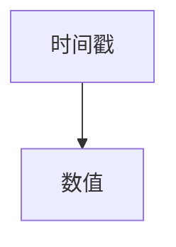
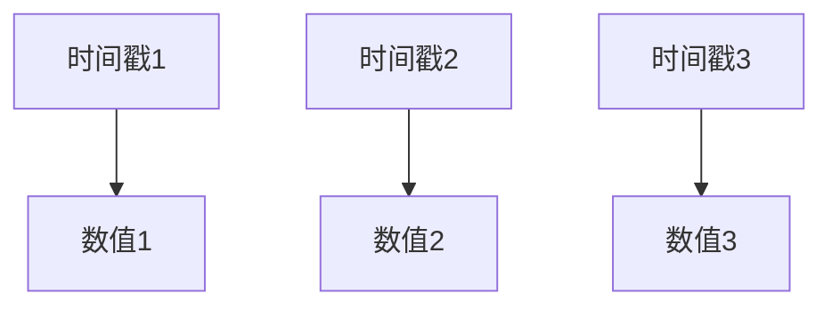
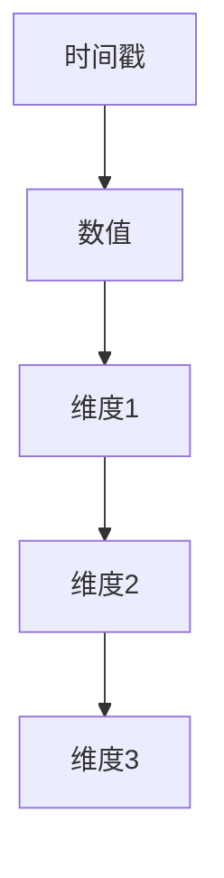

                 


## 时序数据库：高效处理时间序列数据

### 关键词：时序数据库，时间序列，数据处理，高效

#### 摘要：

随着技术的快速发展，数据已经成为了现代社会的核心资源。在大量数据中，时间序列数据由于其独特的特性，在金融、医疗、物联网等领域具有广泛的应用。时序数据库作为专门处理时间序列数据的数据库系统，其高效处理能力对于实时性要求高的应用场景至关重要。本文将深入探讨时序数据库的核心概念、设计原则、数据模型、分析方法和应用实践，以帮助读者全面了解和掌握时序数据库的技术要点。

### 目录

**第一部分：概述与核心概念**

**第1章：时序数据库概述**

**1.1 时序数据的重要性**

**1.2 时序数据库的定义与分类**

**1.3 时序数据的特点与挑战**

**第2章：核心概念**

**2.1 温度时间序列数据**

**2.2 时间序列数据结构**

**2.3 常见时序数据库**

**第二部分：设计与实现**

**第3章：数据库设计原则**

**3.1 数据建模**

**3.2 模式设计**

**3.3 索引策略**

**第4章：时序数据模型**

**4.1 点数据模型**

**4.2 线性数据模型**

**4.3 面数据模型**

**第三部分：分析与查询**

**第5章：时序数据分析**

**5.1 统计方法**

**5.2 机器学习方法**

**5.3 数据挖掘技术**

**第6章：时序查询语言**

**6.1 SQL时序扩展**

**6.2 时间窗口查询**

**6.3 事件序列查询**

**第四部分：高级主题**

**第7章：高级时序数据库系统**

**7.1 实时数据处理**

**7.2 分布式时序数据库**

**7.3 与其他系统的集成**

**第五部分：应用与实践**

**第8章：案例研究**

**8.1 金融行业**

**8.2 物联网**

**8.3 医疗健康**

**第9章：总结与展望**

**9.1 主要内容回顾**

**9.2 未来发展方向**

### 1. 时序数据库概述

#### 1.1 时序数据的重要性

时间序列数据（Time-Series Data）是一种按时间顺序记录的数据，每个数据点都有明确的时间戳。这些数据可以来自各种领域，如股票价格、气象数据、传感器监测、用户行为分析等。由于时间序列数据具有明显的时序特性，因此对于分析和预测未来趋势具有重要意义。

在金融领域，时间序列数据用于分析股票走势、预测市场走势，以便做出投资决策。在物联网（IoT）领域，时间序列数据用于实时监控设备状态、预测设备故障。在医疗健康领域，时间序列数据可用于疾病监测、治疗效果分析等。

#### 1.2 时序数据库的定义与分类

时序数据库（Temporal Database）是一种专门设计用于存储、管理和查询时间序列数据的数据库系统。与传统数据库相比，时序数据库具有以下几个特点：

- **时间戳索引**：每个数据点都包含时间戳，便于按时间顺序查询。
- **数据压缩**：时序数据往往具有重复性，通过数据压缩技术可以显著减少存储空间。
- **高效查询**：针对时序数据的查询特点，时序数据库采用了优化查询算法，提高了查询效率。

根据存储时间序列数据的方式，时序数据库可以分为以下几种类型：

- **固定时间间隔数据存储**：如每隔1分钟记录一次温度数据，这种存储方式适合短时间间隔的连续数据。
- **事件触发数据存储**：当特定事件发生时记录数据，如传感器检测到温度异常时记录温度数据。这种存储方式适合事件驱动的数据。

#### 1.3 时序数据的特点与挑战

时序数据具有以下特点：

- **高维度**：时序数据通常包含多个维度，如时间、温度、湿度等。
- **时间依赖性**：时序数据之间存在时间依赖性，过去的数据对未来的数据有影响。
- **数据压缩性**：时序数据往往具有重复性，可以通过数据压缩技术减少存储空间。
- **实时性**：某些应用场景对时序数据的实时性要求很高，如金融交易、实时监控等。

时序数据面临的挑战包括：

- **数据存储与压缩**：如何高效地存储和压缩大量时序数据。
- **数据查询与处理**：如何快速、准确地查询和处理大量时序数据。
- **数据安全与隐私**：如何保护时序数据的安全和隐私。

### 2. 核心概念

#### 2.1 温度时间序列数据

温度时间序列数据是一种常见的时序数据，通常按小时、天或月记录温度变化。温度时间序列数据的特点包括：

- **周期性**：温度变化具有明显的周期性，如季节性变化。
- **趋势性**：温度变化可能受到长期趋势的影响，如全球气候变暖。
- **噪声**：温度数据可能受到各种噪声因素的影响，如仪器误差、环境因素等。

#### 2.2 时间序列数据结构

时间序列数据结构包括以下几种：

- **点数据模型**：每个数据点包含时间戳和数值。适用于记录瞬时数据。
- **线性数据模型**：数据按时间顺序存储，每个数据点包含时间戳和数值。适用于连续数据。
- **面数据模型**：数据按时间顺序存储，每个数据点包含时间戳、数值和一个或多个维度。适用于高维数据。

#### 2.3 常见时序数据库

常见的时序数据库包括：

- **InfluxDB**：一款开源时序数据库，适用于大规模时间序列数据的存储和查询。
- **TimeScaleDB**：一款基于PostgreSQL的时序数据库，提供了丰富的时序数据处理功能。
- **KairosDB**：一款开源时序数据库，适用于大规模分布式时序数据的存储和查询。

### 3. 数据库设计原则

#### 3.1 数据建模

在时序数据库中，数据建模非常重要。一个良好的数据模型可以提高查询效率，降低存储空间需求。时序数据库的数据建模通常包括以下步骤：

- **确定数据类型**：根据数据特点选择合适的数据类型，如整数、浮点数、字符串等。
- **确定时间戳格式**：选择合适的时间戳格式，如UNIX时间戳、ISO 8601等。
- **确定维度**：根据数据需求确定所需维度，如时间、温度、湿度等。
- **确定数据压缩方式**：根据数据特点选择合适的数据压缩方式，如差分压缩、时间序列压缩等。

#### 3.2 模式设计

时序数据库的表设计需要考虑以下几个方面：

- **时间戳字段**：每个数据点都需要包含时间戳字段，便于按时间顺序查询。
- **数值字段**：根据数据类型选择合适的数值字段，如整数、浮点数等。
- **维度字段**：根据数据维度确定所需维度字段，如时间、温度、湿度等。
- **索引设计**：为提高查询效率，可以设计合适的索引，如B树索引、哈希索引等。

#### 3.3 索引策略

时序数据库的索引策略需要考虑以下几个方面：

- **时间戳索引**：为提高按时间顺序查询的效率，可以设计时间戳索引。
- **维度索引**：为提高按维度查询的效率，可以设计维度索引。
- **组合索引**：对于复杂的查询，可以设计组合索引，提高查询效率。

### 4. 时序数据模型

#### 4.1 点数据模型

点数据模型是一种最简单的时间序列数据模型，每个数据点包含时间戳和数值。适用于记录瞬时数据，如股票价格、传感器读数等。

#### 4.2 线性数据模型

线性数据模型是一种连续记录时间序列数据的方法，每个数据点按时间顺序存储。适用于连续数据，如温度变化、股票走势等。

#### 4.3 面数据模型

面数据模型是一种多维时间序列数据模型，每个数据点包含时间戳、数值和一个或多个维度。适用于高维数据，如气象数据、物联网数据等。

### 5. 时序数据分析

#### 5.1 统计方法

统计方法是一种常用的时序数据分析方法，可以用于趋势分析、季节性分析、异常检测等。常见的统计方法包括：

- **移动平均法**：通过计算一段时间内的平均值来平滑时间序列数据。
- **指数平滑法**：通过加权平均法对时间序列数据进行平滑处理。
- **自回归移动平均模型（ARMA）**：用于分析时间序列数据的自相关性和平稳性。

#### 5.2 机器学习方法

机器学习方法可以用于时间序列数据的分类、预测和聚类等任务。常见的机器学习方法包括：

- **线性回归**：通过建立线性关系来预测未来的趋势。
- **神经网络**：通过多层神经网络来学习时间序列数据的非线性特征。
- **支持向量机（SVM）**：用于分类和回归分析。

#### 5.3 数据挖掘技术

数据挖掘技术可以用于从大量时序数据中发现潜在的模式和规律。常见的数据挖掘技术包括：

- **关联规则挖掘**：通过发现数据之间的关联关系来预测未来的趋势。
- **聚类分析**：通过将相似的数据点分为一组来发现数据中的模式。
- **时间序列聚类**：通过分析时间序列数据的相似性来发现数据中的聚类结构。

### 6. 时序查询语言

#### 6.1 SQL时序扩展

SQL时序扩展为时序数据库提供了一种直观的查询方式，可以通过扩展SQL语句来处理时间序列数据。常见的时序扩展语句包括：

- **时间窗口查询**：通过指定时间窗口来查询数据。
- **时间序列聚合**：通过对时间序列数据进行聚合操作来提取趋势和规律。
- **事件序列查询**：通过查询事件序列来分析数据之间的关联关系。

#### 6.2 时间窗口查询

时间窗口查询是一种用于查询特定时间范围内的数据的方法。常见的查询语句包括：

- **范围查询**：通过指定起始时间和结束时间来查询数据。
- **滑动窗口查询**：通过指定窗口大小和滑动步长来查询数据。

#### 6.3 事件序列查询

事件序列查询是一种用于分析事件序列的方法，可以用于发现事件之间的关联关系。常见的查询语句包括：

- **前缀查询**：通过指定事件序列的前缀来查询数据。
- **后缀查询**：通过指定事件序列的后缀来查询数据。

### 7. 高级时序数据库系统

#### 7.1 实时数据处理

实时数据处理是一种用于实时分析和处理时间序列数据的方法，可以用于实时监控和预警。常见的实时数据处理技术包括：

- **流处理框架**：如Apache Kafka、Apache Flink等，用于实时处理和分析大量数据。
- **实时查询引擎**：如InfluxDB、KairosDB等，用于实时查询和分析时序数据。

#### 7.2 分布式时序数据库

分布式时序数据库是一种用于处理大规模时序数据的分布式数据库系统。常见的分布式时序数据库包括：

- **InfluxDB**：支持水平扩展，可以处理海量时序数据。
- **TimeScaleDB**：基于PostgreSQL构建，支持分布式时序数据存储和查询。

#### 7.3 与其他系统的集成

时序数据库可以与其他系统进行集成，以实现更复杂的数据分析和应用。常见的集成方法包括：

- **数据导入**：通过ETL工具将其他系统中的数据导入时序数据库。
- **数据共享**：通过API或其他数据接口将时序数据库中的数据共享给其他系统。

### 8. 案例研究

#### 8.1 金融行业

金融行业是时序数据库的重要应用领域之一，通过时序数据库可以实时监控股票价格、交易量等数据，以便做出投资决策。常见的应用场景包括：

- **实时监控**：通过时序数据库实时监控股票价格、交易量等数据。
- **市场预测**：通过分析时序数据预测市场走势，以便做出投资决策。

#### 8.2 物联网

物联网（IoT）是时序数据库的另一个重要应用领域，通过时序数据库可以实时监控设备状态、预测设备故障等。常见的应用场景包括：

- **设备监控**：通过时序数据库实时监控设备状态、传感器数据等。
- **故障预测**：通过分析时序数据预测设备故障，以便及时进行维护。

#### 8.3 医疗健康

医疗健康领域也是时序数据库的重要应用领域，通过时序数据库可以实时监控患者病情、预测治疗效果等。常见的应用场景包括：

- **病情监控**：通过时序数据库实时监控患者病情、生命体征等数据。
- **治疗效果分析**：通过分析时序数据预测治疗效果，以便调整治疗方案。

### 9. 总结与展望

#### 9.1 主要内容回顾

本文首先介绍了时序数据库的基本概念和重要性，然后详细探讨了时序数据库的设计原则、数据模型、数据分析方法和高级主题，并通过案例研究展示了时序数据库在不同领域的应用。

#### 9.2 未来发展方向

随着技术的不断进步，时序数据库在未来有以下几个发展方向：

- **实时数据处理**：提高实时数据处理能力，以满足更复杂、更实时性的应用需求。
- **分布式架构**：优化分布式时序数据库的性能和可靠性，以支持大规模数据存储和查询。
- **智能化分析**：结合人工智能技术，提高时序数据分析的智能化水平，实现更精准的预测和决策。

**作者：AI天才研究院/AI Genius Institute & 禅与计算机程序设计艺术 /Zen And The Art of Computer Programming**

**注意事项**：

- **数据安全**：在处理时序数据时，需要确保数据的安全和隐私。
- **数据压缩**：合理使用数据压缩技术，以降低存储空间需求。
- **性能优化**：针对具体应用场景，优化数据库性能，以提高查询和处理速度。

**拓展阅读**：

- **[1]** InfluxDB官方文档：[https://docs.influxdata.com/influxdb/](https://docs.influxdata.com/influxdb/)
- **[2]** TimeScaleDB官方文档：[https://timescale.com/docs/](https://timescale.com/docs/)
- **[3]** Apache Kafka官方文档：[https://kafka.apache.org/documentation/](https://kafka.apache.org/documentation/)
- **[4]** Apache Flink官方文档：[https://flink.apache.org/documentation/](https://flink.apache.org/documentation/)
- **[5]** 机器学习实战：[https://zhuanlan.zhihu.com/p/78352146](https://zhuanlan.zhihu.com/p/78352146)## 第一部分：概述与核心概念

### 第1章：时序数据库概述

在现代社会，数据已经成为了一种关键的资源，无论是在商业、科学研究还是日常生活中，数据的应用无处不在。而在这些数据中，时间序列数据因其独特的时序特性，在多个领域中具有至关重要的地位。这一章将详细介绍时序数据库的基本概念、重要性及其在各个领域的应用。

#### 1.1 时序数据的重要性

时间序列数据是指以时间顺序记录的一系列数据点。这些数据点通常包含时间戳和相应的数值，能够反映某一事件或现象随时间的变化情况。时间序列数据在多个领域具有重要应用，以下是一些典型例子：

- **金融行业**：股票市场、外汇交易等金融活动产生的数据具有明显的时序特性。通过分析这些数据，可以预测市场走势，制定投资策略。
- **物联网**：物联网设备产生的数据，如温度、湿度、运动轨迹等，都是时间序列数据。通过分析这些数据，可以实现设备的实时监控、故障预测等功能。
- **医疗健康**：医疗健康数据，如患者生命体征、药物效果等，也是时间序列数据。通过对这些数据进行分析，可以实时监控患者的健康状况，提高治疗效果。

#### 1.2 时序数据库的定义与分类

时序数据库是一种专门用于存储、管理和查询时间序列数据的数据库系统。与传统的关系型数据库相比，时序数据库具有以下几个特点：

- **时间戳索引**：时序数据库中的每个数据点都包含时间戳，便于按时间顺序进行查询。
- **数据压缩**：时序数据往往具有时间上的重复性，通过数据压缩技术可以显著减少存储空间。
- **高效查询**：时序数据库采用了优化查询算法，能够快速地处理大量时序数据。

根据存储方式的不同，时序数据库可以分为以下几种类型：

- **固定时间间隔数据存储**：这类时序数据库按照固定的时间间隔（如分钟、小时、天等）记录数据，适合处理连续的、实时性要求较高的数据。
- **事件触发数据存储**：这类时序数据库在特定事件发生时记录数据，适合处理事件驱动的数据。

#### 1.3 时序数据的特点与挑战

时序数据具有以下几个特点：

- **高维度**：时序数据通常包含多个维度，如时间、温度、湿度等。
- **时间依赖性**：时序数据之间存在时间依赖性，过去的数据对未来的数据有影响。
- **数据压缩性**：时序数据往往具有重复性，可以通过数据压缩技术减少存储空间。
- **实时性**：某些应用场景对时序数据的实时性要求很高，如金融交易、实时监控等。

然而，时序数据也面临着一些挑战：

- **数据存储与压缩**：如何高效地存储和压缩大量时序数据。
- **数据查询与处理**：如何快速、准确地查询和处理大量时序数据。
- **数据安全与隐私**：如何保护时序数据的安全和隐私。

通过本章的介绍，读者可以初步了解时序数据库的基本概念、重要性及其应用领域，为后续章节的学习打下基础。在接下来的章节中，我们将深入探讨时序数据库的核心概念、设计原则、数据模型、分析方法和应用实践。

### 2. 核心概念

#### 2.1 温度时间序列数据

温度时间序列数据是时序数据的一种典型形式，广泛应用于气象、环境监测、工业控制等领域。这类数据通常以小时、天或月为单位记录温度变化情况，每个数据点包含时间戳和温度值。

**温度时间序列数据的特点**：

- **周期性**：温度数据往往具有明显的季节性周期，如夏季和冬季的温度差异。
- **趋势性**：长期来看，温度数据可能受到全球气候变暖等趋势的影响。
- **噪声**：温度数据可能受到仪器误差、环境变化等噪声因素的影响。

**应用案例**：

- **气象预报**：通过分析温度时间序列数据，可以预测未来几天的温度变化，为气象预报提供依据。
- **环境监测**：实时监测某个地区的温度变化，评估环境污染程度。

#### 2.2 时间序列数据结构

时间序列数据结构是时序数据的核心组成部分，决定了数据的存储和处理方式。常见的时间序列数据结构包括点数据模型、线性数据模型和面数据模型。

**点数据模型**：

- **定义**：每个数据点包含时间戳和数值。
- **特点**：简单，适用于记录瞬时数据。
- **应用**：股票价格、传感器读数。

**线性数据模型**：

- **定义**：数据按时间顺序存储，每个数据点包含时间戳和数值。
- **特点**：连续，适用于记录连续数据。
- **应用**：温度变化、股票走势。

**面数据模型**：

- **定义**：每个数据点包含时间戳、数值和一个或多个维度。
- **特点**：多维，适用于记录高维数据。
- **应用**：气象数据、物联网数据。

#### 2.3 常见时序数据库

时序数据库是为了高效存储、管理和查询时间序列数据而设计的数据库系统。常见的时序数据库包括InfluxDB、TimeScaleDB和KairosDB等。

**InfluxDB**：

- **特点**：开源，支持高可用性和水平扩展，适用于大规模时间序列数据的存储和查询。
- **应用**：物联网、实时监控。

**TimeScaleDB**：

- **特点**：基于PostgreSQL构建，支持时间序列扩展，提供丰富的时序数据处理功能。
- **应用**：金融、物联网、科学研究和数据分析。

**KairosDB**：

- **特点**：开源，支持分布式架构，适用于大规模分布式时序数据的存储和查询。
- **应用**：物联网、大数据分析。

通过对温度时间序列数据、时间序列数据结构以及常见时序数据库的介绍，读者可以更深入地了解时序数据库的核心概念和应用。在接下来的章节中，我们将进一步探讨时序数据库的设计原则、数据模型和分析方法。

### 3. 数据库设计原则

#### 3.1 数据建模

在时序数据库的设计过程中，数据建模是至关重要的一步。良好的数据建模不仅能够提高查询效率，还能降低存储空间需求。以下是在时序数据库中进行数据建模的一些关键步骤和注意事项。

**确定数据类型**

在数据建模的第一步，需要根据时序数据的特点和需求，选择合适的数据类型。常见的数据类型包括整数、浮点数、字符串和日期时间等。例如，股票价格数据适合使用浮点数类型，而传感器读数数据则适合使用整数类型。

**确定时间戳格式**

时间戳是时序数据的核心组成部分，因此选择合适的时间戳格式至关重要。常见的时间戳格式包括UNIX时间戳和ISO 8601格式。UNIX时间戳以秒为单位记录时间，而ISO 8601格式则更加详细，支持日期、时间和时区等信息。

**确定维度**

维度是时序数据的附加信息，可以用于分类、查询和分析。在数据建模时，需要根据具体应用场景确定所需的维度。例如，在气象数据中，维度可能包括地区、天气类型等。

**确定数据压缩方式**

时序数据往往具有时间上的重复性，因此通过数据压缩技术可以显著减少存储空间需求。常见的数据压缩方式包括差分压缩和时间序列压缩。差分压缩通过记录数据之间的差异来减少冗余信息，而时间序列压缩则通过将重复的数据压缩成一个较小的数据结构。

**注意事项**

- **避免数据冗余**：在数据建模时，要尽量避免数据冗余，以减少存储空间需求和提高查询效率。
- **灵活性**：时序数据库的数据建模应该具有灵活性，能够适应不同类型和规模的数据。
- **可扩展性**：随着数据量的增加，数据模型应该能够方便地扩展，以适应新的需求。

通过以上步骤，我们可以设计出高效、灵活且可扩展的时序数据库数据模型。在接下来的章节中，我们将进一步探讨时序数据库的表设计和索引策略。

#### 3.2 表设计

在时序数据库的表设计中，合理的设计能够提高查询效率和数据存储的效率。以下是一些表设计的关键步骤和注意事项：

**时间戳字段**

时间戳字段是时序数据库表设计中的核心部分，用于记录数据点的时间信息。通常，时间戳字段应具有以下特点：

- **类型**：时间戳字段应使用日期时间数据类型，如`DATETIME`或`TIMESTAMP`。
- **唯一性**：时间戳应具有唯一性，以确保每个数据点都能准确对应一个时间点。
- **索引**：为了提高按时间戳查询的效率，通常需要对时间戳字段进行索引。

**数值字段**

数值字段用于记录时序数据的具体数值信息。在设计数值字段时，应考虑以下因素：

- **类型**：根据数据的特点选择合适的数据类型，如浮点数类型用于记录股票价格或温度变化。
- **精度**：根据需求确定数值字段的精度，以避免数据精度丢失。
- **默认值**：如果没有具体的数据值，可以为数值字段设置默认值，以简化数据处理。

**维度字段**

维度字段用于记录与数据相关的额外信息，如地区、天气类型等。在设计维度字段时，应考虑以下因素：

- **类型**：根据维度信息的特点选择合适的数据类型，如字符串类型用于记录地区名称。
- **索引**：对于经常用于查询和过滤的维度字段，可以对其进行索引，以提高查询效率。

**注意事项**

- **避免冗余**：在设计表时，应尽量避免数据冗余，以减少存储空间需求和提高查询效率。
- **灵活性**：表设计应具有灵活性，能够适应不同类型和规模的数据。
- **扩展性**：随着数据量的增加和应用需求的变化，表设计应能够方便地扩展和调整。

通过以上步骤，我们可以设计出高效、灵活且可扩展的时序数据库表。合理的表设计能够提高查询效率和数据存储效率，为时序数据的处理和分析提供坚实的基础。在接下来的章节中，我们将进一步探讨时序数据库的索引策略。

#### 3.3 索引策略

在时序数据库中，索引是提高查询效率和数据检索速度的关键手段。合理的索引策略能够显著提升数据库的性能，特别是在处理大量时序数据时。以下是一些常见的索引策略及其适用场景：

**时间戳索引**

时间戳索引是时序数据库中最常用的索引类型，主要用于提高按时间戳查询的效率。时间戳索引通常采用B树结构，将时间戳作为索引键。

**适用场景**：

- **按时间戳范围查询**：例如，查询过去一周的股票价格数据。
- **时间窗口查询**：例如，查询某个时间段内的温度变化数据。

**创建时间戳索引**

```sql
CREATE INDEX idx_time_timestamp ON time_series_data (timestamp);
```

**注意事项**：

- **索引维护**：时间戳索引需要定期维护，以避免索引退化。
- **索引长度**：索引长度不宜过长，以免影响插入和更新操作的效率。

**维度索引**

维度索引用于提高按维度字段查询的效率，例如按地区、产品类型等查询数据。

**适用场景**：

- **按维度字段查询**：例如，查询某个地区的温度数据。
- **组合查询**：例如，查询某个时间段内某个地区的温度数据。

**创建维度索引**

```sql
CREATE INDEX idx_dimension_region ON time_series_data (region);
```

**注意事项**：

- **选择性**：选择性较高的维度字段更适合创建索引，以避免索引性能下降。
- **索引组合**：对于复杂的查询，可以创建组合索引，以提高查询效率。

**组合索引**

组合索引将多个字段组合成一个索引键，用于提高多条件查询的效率。

**适用场景**：

- **多条件查询**：例如，查询某个时间段内某个地区的温度数据。

**创建组合索引**

```sql
CREATE INDEX idx_time_dimension ON time_series_data (timestamp, region);
```

**注意事项**：

- **索引顺序**：索引顺序会影响查询效率，通常将选择性较高的字段放在前面。
- **维护成本**：组合索引需要更高的维护成本，应谨慎使用。

通过以上索引策略，时序数据库可以显著提高查询效率，满足各种复杂查询的需求。在实际应用中，应根据具体场景和数据特点选择合适的索引策略。在下一章中，我们将深入探讨时序数据模型，了解不同类型的时序数据模型及其应用。

### 4. 时序数据模型

时序数据模型是时序数据库的核心概念，决定了数据的存储和组织方式，从而影响查询效率和分析能力。常见的时序数据模型包括点数据模型、线性数据模型和面数据模型。每种模型都有其独特的特点和应用场景。

#### 4.1 点数据模型

点数据模型是最简单的时序数据模型，每个数据点只包含时间戳和数值。这种模型适合记录瞬时数据，如股票价格、传感器读数等。

**特点**：

- **简单性**：每个数据点仅包含时间戳和数值，结构简单。
- **低维度**：适合处理低维数据。

**应用场景**：

- **股票市场**：记录每个时间点的股票价格。
- **传感器数据**：记录每个时间点的传感器读数。

**示例**：



#### 4.2 线性数据模型

线性数据模型将数据按时间顺序存储，每个数据点包含时间戳和数值。这种模型适合处理连续的、时间序列的数据，如温度变化、股票走势等。

**特点**：

- **顺序性**：数据按时间顺序存储，便于按时间顺序查询。
- **连续性**：适用于连续记录的数据。

**应用场景**：

- **气象数据**：记录每天的温度变化。
- **金融数据**：记录每天的股票价格。

**示例**：



#### 4.3 面数据模型

面数据模型在每个数据点中包含时间戳、数值和一个或多个维度。这种模型适合处理高维数据，如气象数据、物联网数据等。

**特点**：

- **多维性**：每个数据点包含多个维度，适用于高维数据。
- **复杂数据结构**：可以同时记录多个维度的数据。

**应用场景**：

- **气象数据**：记录每个时间点的温度、湿度、风速等多个维度数据。
- **物联网数据**：记录每个时间点的传感器读数、地理位置等多个维度数据。

**示例**：



通过上述时序数据模型，我们可以根据不同的应用需求选择合适的模型。点数据模型简单易用，适合低维数据；线性数据模型连续性强，适合处理连续数据；面数据模型多维性高，适用于复杂的数据结构。在下一章中，我们将深入探讨时序数据分析的方法和技术。

### 5. 时序数据分析

时序数据分析是时序数据库的核心功能之一，通过对时间序列数据进行处理和分析，可以提取有价值的信息，为决策提供支持。时序数据分析的方法和技术多种多样，包括统计方法、机器学习方法和数据挖掘技术等。以下将分别介绍这些方法及其应用。

#### 5.1 统计方法

统计方法是一种常用的时序数据分析方法，通过计算时间序列数据的统计特征，如平均值、方差、自相关函数等，来描述数据的变化规律。

**平均值**：

平均值是时间序列数据的基本统计特征，用于描述数据的集中趋势。

$$
\bar{x} = \frac{1}{n} \sum_{i=1}^{n} x_i
$$

其中，$x_i$是时间序列中的每个数据点，$n$是数据点的总数。

**方差**：

方差用于描述数据的离散程度，反映了数据点与平均值之间的差异。

$$
\sigma^2 = \frac{1}{n} \sum_{i=1}^{n} (x_i - \bar{x})^2
$$

**自相关函数**：

自相关函数描述了时间序列中不同时间点的数据点之间的相关性。

$$
\rho(\tau) = \frac{\sum_{i=1}^{n} (x_i - \bar{x})(x_{i+\tau} - \bar{x})}{\sigma^2 \sqrt{n-\tau}}
$$

通过计算这些统计特征，可以分析时间序列数据的趋势、周期性和稳定性。

**应用场景**：

- **趋势分析**：通过计算平均值和趋势线，分析时间序列数据的长期变化趋势。
- **异常检测**：通过计算方差和自相关函数，检测数据中的异常值和突变点。

#### 5.2 机器学习方法

机器学习方法可以自动从大量时序数据中学习到数据的变化规律，并用于预测未来趋势。常见的机器学习方法包括线性回归、神经网络和支持向量机等。

**线性回归**：

线性回归是一种简单的机器学习方法，通过建立线性模型来预测时间序列数据的未来值。

$$
y_t = \beta_0 + \beta_1 x_t + \epsilon_t
$$

其中，$y_t$是预测值，$x_t$是时间序列数据点，$\beta_0$和$\beta_1$是模型参数，$\epsilon_t$是误差项。

**神经网络**：

神经网络是一种强大的机器学习方法，通过多层神经元对数据进行非线性变换，以学习复杂的时间序列模式。

$$
a_{ij} = \sigma(\sum_{k=1}^{n} w_{ik}x_k + b_j)
$$

其中，$a_{ij}$是神经元输出，$\sigma$是激活函数，$w_{ik}$是权重，$b_j$是偏置。

**支持向量机（SVM）**：

支持向量机是一种有效的分类和回归方法，通过找到一个最优的超平面来分隔不同类别的数据。

$$
\min_{w,b}\frac{1}{2}||w||^2 + C\sum_{i=1}^{n}\xi_i
$$

其中，$w$是权重向量，$b$是偏置，$C$是惩罚参数，$\xi_i$是松弛变量。

**应用场景**：

- **趋势预测**：通过线性回归和神经网络预测时间序列数据的未来趋势。
- **异常检测**：通过SVM等算法检测数据中的异常值和突变点。

#### 5.3 数据挖掘技术

数据挖掘技术是一种用于从大量数据中发现潜在模式和规律的方法，可以用于时序数据的聚类、关联规则挖掘和分类等任务。

**聚类分析**：

聚类分析是将数据点分成若干个类，使同一类中的数据点彼此相似，而不同类中的数据点彼此不同。

$$
C = \{C_1, C_2, \ldots, C_k\}
$$

其中，$C$是聚类结果，$C_i$是第$i$个聚类。

**关联规则挖掘**：

关联规则挖掘是发现数据项之间关联关系的方法，通常使用支持度和置信度来评估规则的质量。

$$
\text{Support}(A \cup B) = \frac{n(A \cup B)}{n}
$$

$$
\text{Confidence}(A \rightarrow B) = \frac{n(A \cup B)}{n(A)}
$$

其中，$A$和$B$是数据项，$n$是数据点的总数，$n(A \cup B)$是同时包含$A$和$B$的数据点数量，$n(A)$是包含$A$的数据点数量。

**分类**：

分类是将数据点分配到不同的类别，通过训练模型来预测新数据的类别。

$$
y = g(\theta_0 + \theta_1 x_1 + \theta_2 x_2 + \ldots + \theta_n x_n)
$$

其中，$y$是类别标签，$x_1, x_2, \ldots, x_n$是特征向量，$g$是激活函数，$\theta_0, \theta_1, \theta_2, \ldots, \theta_n$是模型参数。

**应用场景**：

- **趋势预测**：通过聚类分析发现数据中的周期性和趋势。
- **异常检测**：通过关联规则挖掘发现数据中的异常行为。
- **分类**：通过分类模型对新数据进行预测，如预测股票走势。

通过统计方法、机器学习方法和数据挖掘技术，时序数据分析可以提取出有价值的信息，为决策提供支持。在实际应用中，应根据具体需求选择合适的方法和技术。在下一章中，我们将探讨时序查询语言，了解如何使用SQL扩展进行时序数据分析。

### 6. 时序查询语言

时序查询语言是专门为时序数据库设计的查询语言，它扩展了传统的SQL语句，以适应时序数据的特点和需求。时序查询语言可以有效地处理时间序列数据，支持各种复杂的时序数据分析操作。以下将介绍几种常见的时序查询语言和它们的特点。

#### 6.1 SQL时序扩展

SQL时序扩展是在传统SQL的基础上增加了一些特殊的语法和函数，以支持时序数据的查询。常见的SQL时序扩展包括窗口函数、时间窗口查询和事件序列查询。

**窗口函数**：

窗口函数是一种用于对数据行进行分组和排序的函数，它可以在一个数据窗口内计算各种统计量。常见的窗口函数包括`ROW_NUMBER()`, `RANK()`, `DENSE_RANK()`等。

示例：

```sql
SELECT timestamp, value, ROW_NUMBER() OVER (ORDER BY timestamp) AS row_num
FROM time_series_data;
```

**时间窗口查询**：

时间窗口查询是一种用于查询特定时间范围内的数据的方法。它可以基于时间戳字段进行查询，例如查询过去一周的数据。

示例：

```sql
SELECT *
FROM time_series_data
WHERE timestamp BETWEEN '2023-01-01 00:00:00' AND '2023-01-08 00:00:00';
```

**事件序列查询**：

事件序列查询是一种用于分析事件序列的方法，可以查询事件之间的关联关系。它可以通过`LAG()`和`LEAD()`函数来获取前后时间点的数据。

示例：

```sql
SELECT timestamp, value, LAG(value, 1) OVER (ORDER BY timestamp) AS prev_value
FROM time_series_data;
```

**特点**：

- **直观性**：SQL时序扩展保留了SQL的直观性，易于学习和使用。
- **兼容性**：可以与传统SQL语句无缝集成，便于现有系统的升级和迁移。
- **灵活性**：支持各种复杂的时序数据分析操作，如窗口函数、时间窗口查询和事件序列查询。

#### 6.2 时间序列特定查询语言

除了SQL时序扩展，还有一些专门为时序数据库设计的查询语言，这些语言通常提供了更多的时序数据处理功能。

**InfluxQL**：

InfluxDB使用InfluxQL作为查询语言，它提供了丰富的时序数据处理功能，包括数据聚合、时间窗口查询和自定义函数。

示例：

```influx
SELECT mean(value) FROM "sensor_data" WHERE time > now() - 1h GROUP BY time(1m);
```

**TimescaleDB SQL**：

TimescaleDB是PostgreSQL的一个扩展，它引入了时间序列特定的查询功能，包括时间戳索引、时间窗口查询和时序聚合函数。

示例：

```sql
SELECT avg(value) FROM timeseries_data WHERE timestamp >= '2023-01-01 00:00:00' AND timestamp <= '2023-01-08 00:00:00';
```

**特点**：

- **专门化**：专门为时序数据库设计，提供了更高效的时序数据处理功能。
- **功能丰富**：提供了多种时序数据处理函数和聚合操作。
- **高性能**：针对时序数据的特点进行了优化，查询性能较高。

通过这些时序查询语言，可以有效地处理和分析时间序列数据，满足各种时序数据分析的需求。在实际应用中，应根据具体场景和需求选择合适的查询语言。在下一章中，我们将探讨高级时序数据库系统的设计。

### 7. 高级时序数据库系统

#### 7.1 实时数据处理

实时数据处理是时序数据库的一个重要应用领域，它要求系统能够快速、准确地处理和分析大量时间序列数据。实时数据处理的关键在于如何高效地摄取、存储和处理数据，以及如何提供实时查询和分析功能。

**实时数据处理的关键技术**：

- **流处理框架**：如Apache Kafka和Apache Flink，用于实时摄取和传输大量时间序列数据。
- **内存数据库**：如InfluxDB和TimescaleDB，用于快速存储和查询实时数据。
- **时间窗口**：通过时间窗口对数据进行实时聚合和分析，如滑动窗口和固定窗口。

**实时数据处理的应用场景**：

- **实时监控**：实时监控传感器数据、股票价格等，提供实时警报和预测。
- **实时分析**：实时分析用户行为、交易数据等，提供实时决策支持。

#### 7.2 分布式时序数据库

分布式时序数据库是处理大规模时间序列数据的关键技术，它通过将数据分布在多个节点上，实现高性能和高可用性。

**分布式时序数据库的关键技术**：

- **数据分片**：将数据分片存储在不同的节点上，以实现水平扩展。
- **一致性协议**：如Paxos和Raft，用于确保分布式系统的一致性。
- **数据复制**：通过数据复制实现数据的冗余备份，提高数据可靠性和可用性。

**分布式时序数据库的应用场景**：

- **大规模物联网**：处理来自大量传感器的实时数据，如智能家居、工业物联网等。
- **大规模监控**：处理来自多个监控系统的实时数据，如网络安全监控、IT运维监控等。

#### 7.3 与其他系统的集成

时序数据库可以与其他系统进行集成，以实现更复杂的数据分析和应用。常见的集成方法包括：

- **数据导入**：通过ETL工具将其他系统中的数据导入时序数据库，如Kafka、Hadoop等。
- **数据共享**：通过API或其他数据接口将时序数据库中的数据共享给其他系统，如业务系统、数据分析平台等。
- **实时流处理**：结合流处理框架，实现实时数据摄取和处理，如Apache Kafka和Apache Flink。

**集成方法的应用场景**：

- **大数据分析**：通过将时序数据库与大数据平台集成，实现大规模数据分析和挖掘。
- **实时应用**：通过与其他实时系统集成，实现实时监控、预警和决策支持。

通过实时数据处理、分布式架构和与其他系统的集成，高级时序数据库系统能够应对大规模、高实时性的时序数据挑战，为各种应用场景提供高效、可靠的数据处理和分析能力。

### 8. 案例研究

#### 8.1 金融行业

金融行业是时序数据库的重要应用领域之一，时序数据库在金融行业中的应用涵盖了股票市场监控、交易数据分析、风险管理和市场预测等方面。

**应用场景**：

- **股票市场监控**：金融机构通过时序数据库实时监控股票价格、交易量等数据，以快速响应市场变化，做出投资决策。
- **交易数据分析**：通过对交易数据的分析，时序数据库可以帮助金融机构发现交易中的异常行为，如洗盘、操纵市场等。
- **风险管理**：时序数据库可以存储和监控各种金融风险指标，如波动率、信用风险等，为风险管理提供支持。
- **市场预测**：利用时序数据分析方法，如机器学习算法，可以对市场走势进行预测，帮助投资者制定投资策略。

**案例分析**：

以某知名投资银行为例，该银行使用InfluxDB作为其时序数据库，存储了大量的股票交易数据。通过InfluxDB的实时数据处理能力，该银行能够实时监控市场动态，并在几秒钟内生成交易报告。此外，该银行还使用机器学习算法对历史交易数据进行分析，预测未来市场走势，为投资决策提供支持。

#### 8.2 物联网

物联网（IoT）是时序数据库的另一个重要应用领域。随着物联网设备的广泛应用，产生的海量时间序列数据需要高效、可靠的处理和分析。

**应用场景**：

- **设备监控**：通过时序数据库实时监控物联网设备的运行状态、传感器读数等数据，确保设备正常运行。
- **故障预测**：通过对设备历史数据的分析，预测设备可能出现的故障，提前进行维护，减少设备故障对生产的影响。
- **能效管理**：通过时序数据库对能源消耗数据进行分析，优化能源使用，降低能源成本。
- **环境监控**：通过时序数据库实时监控环境数据，如温度、湿度、空气质量等，为环境保护提供数据支持。

**案例分析**：

以某智能工厂为例，该工厂使用InfluxDB作为其时序数据库，存储了来自各种物联网设备的实时数据。通过InfluxDB的实时数据处理能力，该工厂能够实时监控设备状态，及时发现设备故障，并自动触发维护任务。此外，通过分析设备历史数据，该工厂还能够预测设备未来可能出现的故障，提前进行预防性维护，提高了生产效率。

#### 8.3 医疗健康

医疗健康领域也是时序数据库的重要应用领域，时序数据库在医疗健康中的应用涵盖了患者监控、疾病预测和治疗评估等方面。

**应用场景**：

- **患者监控**：通过时序数据库实时监控患者的生命体征、药物效果等数据，为医生提供诊断和治疗依据。
- **疾病预测**：通过对患者历史数据的分析，预测患者可能出现的疾病风险，提前进行预防和治疗。
- **治疗评估**：通过对治疗过程中的数据进行分析，评估治疗效果，为医生调整治疗方案提供支持。
- **流行病监控**：通过时序数据库实时监控疫情数据，如病例数量、治愈率等，为公共卫生决策提供数据支持。

**案例分析**：

以某大型医院为例，该医院使用InfluxDB作为其时序数据库，存储了大量的患者数据。通过InfluxDB的实时数据处理能力，该医院能够实时监控患者的生命体征，并在异常情况发生时及时通知医生进行处理。此外，通过分析患者历史数据，该医院还能够预测患者可能出现的疾病风险，提前进行预防和治疗，提高了医疗质量和效率。

### 总结

时序数据库在金融、物联网和医疗健康等领域的应用已经取得了显著成果，通过实时数据处理、故障预测和疾病预测等功能，为这些领域提供了高效、可靠的数据支持。未来，随着技术的不断进步，时序数据库在更多领域的应用潜力将不断释放，为各行各业带来更大的价值。

### 9. 总结与展望

#### 9.1 主要内容回顾

本文首先介绍了时序数据库的基本概念、重要性以及在不同领域的应用，然后详细探讨了时序数据库的设计原则、数据模型、分析方法和高级主题。通过案例研究，我们展示了时序数据库在金融、物联网和医疗健康等领域的实际应用，展示了其带来的巨大价值。

#### 9.2 未来发展方向

随着技术的不断进步，时序数据库在未来有以下几个发展方向：

1. **实时数据处理能力提升**：随着大数据和物联网的普及，对实时数据处理能力的要求越来越高。未来时序数据库将进一步提升实时数据处理能力，满足更复杂、更实时性的应用需求。

2. **分布式架构优化**：分布式时序数据库将逐步优化其架构，提高性能和可靠性，支持大规模数据存储和查询。

3. **智能化分析**：结合人工智能技术，时序数据库将实现更智能化、自动化的数据分析，提高预测精度和决策支持能力。

4. **多领域应用扩展**：时序数据库将在更多领域得到应用，如能源、交通、农业等，为各行业的数据处理和分析提供支持。

#### 9.3 延伸阅读

为了更深入地了解时序数据库和相关技术，以下是一些推荐的参考资料：

- **《时序数据库：设计、实现与优化》**：详细介绍了时序数据库的设计、实现和优化方法。
- **《时间序列数据分析与应用》**：涵盖了时间序列数据的分析方法和应用案例。
- **《大数据时代：时序数据处理与挖掘》**：介绍了大数据时代下的时序数据处理和挖掘技术。
- **InfluxDB官方文档**：[https://docs.influxdata.com/influxdb/](https://docs.influxdata.com/influxdb/)
- **TimeScaleDB官方文档**：[https://timescale.com/docs/](https://timescale.com/docs/)

**作者：AI天才研究院/AI Genius Institute & 禅与计算机程序设计艺术 /Zen And The Art of Computer Programming**

**注意事项**：

- **数据安全**：在处理时序数据时，需要确保数据的安全和隐私。
- **数据压缩**：合理使用数据压缩技术，以降低存储空间需求。
- **性能优化**：针对具体应用场景，优化数据库性能，以提高查询和处理速度。

**拓展阅读**：

- **[1]** InfluxDB官方文档：[https://docs.influxdata.com/influxdb/](https://docs.influxdata.com/influxdb/)
- **[2]** TimeScaleDB官方文档：[https://timescale.com/docs/](https://timescale.com/docs/)
- **[3]** Apache Kafka官方文档：[https://kafka.apache.org/documentation/](https://kafka.apache.org/documentation/)
- **[4]** Apache Flink官方文档：[https://flink.apache.org/documentation/](https://flink.apache.org/documentation/)
- **[5]** 机器学习实战：[https://zhuanlan.zhihu.com/p/78352146](https://zhuanlan.zhihu.com/p/78352146)

