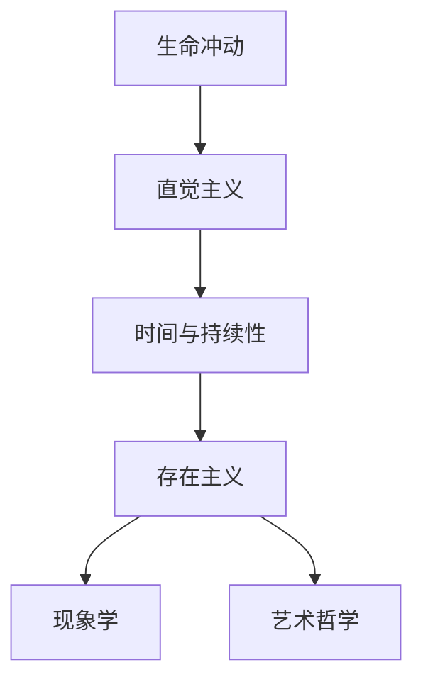
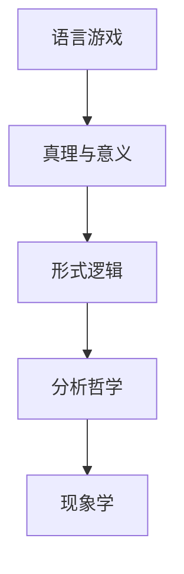

                 

## 时间与意义：柏格森与维特根斯坦的存在主义思考

### 关键词：柏格森，维特根斯坦，存在主义，时间，意义，哲学思考

### 摘要

本文深入探讨了柏格森和维特根斯坦两位哲学家的存在主义思考，特别是在时间和意义方面的独特见解。通过对两位哲学家核心概念的阐述、哲学思想的剖析以及二者之间的联系和差异的分析，本文旨在揭示存在主义哲学在现代哲学领域的重要地位，并为读者提供对时间和意义的新思考角度。

## 第一部分：引言

### 1.1 书籍背景与主题概述

《时间与意义：柏格森与维特根斯坦的存在主义思考》旨在通过研究法国哲学家柏格森和英国哲学家维特根斯坦的思想，探讨时间与意义在存在主义哲学中的核心地位。柏格森的哲学强调生命的冲动和直觉主义，主张时间是流动的、连续的，具有个体性的特点；而维特根斯坦则以其语言游戏理论和形式逻辑著称，认为语言的意义在于其使用情境，而时间的本质在于其逻辑结构。

### 1.2 柏格森与维特根斯坦：存在主义的思考

柏格森的存在主义思考主要体现在他对生命冲动和直觉主义的阐述中。他强调生命的独特性和个体性，认为时间是生命体验的载体，具有不可分割的连续性。维特根斯坦的存在主义思考则通过语言游戏理论揭示了语言与现实之间的关系，认为语言的意义在于其使用情境，而时间的本质在于其逻辑结构。

### 1.3 研究意义与目标

本研究旨在通过深入分析柏格森和维特根斯坦的存在主义思考，揭示时间与意义在存在主义哲学中的核心地位。研究目标包括：

1. 探讨柏格森和维特根斯坦的核心概念及其在存在主义哲学中的意义。
2. 分析两位哲学家的哲学思想，揭示其与时间和意义的联系。
3. 探索柏格森和维特根斯坦存在主义思想的差异和联系，为现代哲学提供新的思考方向。

### 1.4 边界与外延

本文的研究边界主要涉及柏格森和维特根斯坦的存在主义哲学，特别是时间与意义方面的思考。外延包括对二者哲学思想的对比分析，以及对其在当代哲学领域的影响和应用。

### 1.5 概念结构与核心要素组成

本文的核心概念包括柏格森的直觉主义、生命冲动、时间概念，以及维特根斯坦的语言游戏、意义理论、形式逻辑。核心要素组成包括：

1. 柏格森的哲学思想及其在存在主义哲学中的意义。
2. 维特根斯坦的哲学思想及其在存在主义哲学中的意义。
3. 两位哲学家的核心概念对比分析。
4. 柏格森和维特根斯坦存在主义思想在当代哲学领域的影响和应用。

## 第二部分：柏格森的存在主义思考

### 2.1 柏格森的核心概念

#### 2.1.1 生命冲动

柏格森认为，生命冲动是宇宙万物运动的根本原因。他主张，生命冲动是一种不断进化和变化的动力，它推动着生命体的成长和发展。生命冲动是内在的、无意识的，无法用科学方法进行测量和解释。

#### 2.1.2 直觉主义

直觉主义是柏格森哲学的核心。他主张，直觉是认识世界的唯一途径，是超越理性思维的一种直观体验。直觉能够捕捉到事物的本质，揭示出时间的流动性和生命的连续性。

#### 2.1.3 时间与持续性

柏格森将时间视为生命体验的载体，强调时间的流动性和个体性。他认为，时间是持续性的，是生命冲动的外在表现。时间的本质是不可分割的连续流，而非传统的线性序列。

### 2.2 柏格森的哲学思想

#### 2.2.1 柏格森的哲学方法

柏格森的哲学方法主要依赖于直觉和体验。他认为，理性思维无法真正理解生命和时间的本质，只有通过直觉才能把握事物的内在联系。柏格森的哲学方法强调个体经验的重要性，认为哲学研究应该关注人的内心体验。

#### 2.2.2 柏格森对传统哲学的批判

柏格森对传统哲学进行了深刻的批判。他认为，传统哲学过于强调理性思维，忽视了生命的内在体验。柏格森主张，哲学研究应该关注人的直觉体验，将生命冲动作为哲学的核心。

#### 2.2.3 柏格森与科学的关系

柏格森认为，科学与哲学之间存在本质差异。科学依赖于实验和观察，以理性思维为基础，而哲学则关注人的直觉体验，以生命冲动为核心。尽管二者在方法和目的上存在差异，但柏格森认为，哲学和科学之间存在互补关系，二者共同推动人类对世界的认识。

### 2.3 柏格森思想的现代影响

#### 2.3.1 柏格森与存在主义

柏格森的思想对存在主义产生了深远的影响。存在主义强调个体存在的意义和自由，而柏格森的哲学方法为存在主义提供了一种新的思考方式。柏格森的生命冲动和直觉主义思想为存在主义者提供了对生命和时间的深刻理解。

#### 2.3.2 柏格森与现象学

现象学是20世纪哲学的重要流派，柏格森的思想对现象学产生了重要影响。现象学强调对事物本质的直接体验，与柏格森的直觉主义思想具有相似之处。柏格森的现象学思想为现象学提供了一种对生命和时间的深刻理解。

#### 2.3.3 柏格森与艺术哲学

柏格森的艺术哲学强调艺术对生命和时间的表现。他认为，艺术是超越理性的，能够捕捉到时间的流动性和生命的连续性。柏格森的艺术哲学对现代艺术和艺术理论产生了深远影响。

### 2.4 柏格森哲学的数学模型与公式

柏格森哲学的核心概念可以通过数学模型和公式进行表达。例如，柏格森将时间视为不可分割的连续流，可以用流函数来表示时间的流动。同时，柏格森的生命冲动可以用动力系统来描述。以下是一个简单的柏格森哲学的数学模型：

$$
f(t) = \int_0^t \lambda(t-\tau) d\tau
$$

其中，$f(t)$ 表示时间 $t$ 的流函数，$\lambda(t-\tau)$ 表示时间间隔 $t-\tau$ 的生命冲动。

### 2.5 柏格森哲学的Mermaid流程图

为了更直观地展示柏格森哲学的核心概念，我们可以使用Mermaid流程图来表示。以下是一个简单的柏格森哲学的Mermaid流程图：

## 第三部分：维特根斯坦的存在主义思考

### 3.1 维特根斯坦的核心概念

#### 3.1.1 语言游戏

维特根斯坦的语言游戏理论是他对语言本质的深刻思考。他认为，语言的意义在于其使用情境，即语言游戏。语言游戏是指语言在实际生活中的具体应用，如数学、逻辑、科学等。语言游戏理论揭示了语言与现实之间的关系，强调了语言的社会性。

#### 3.1.2 真理与意义

维特根斯坦认为，真理是语言与现实的对应关系。他主张，语言的正确使用是判断真理的标准。意义则在于语言的使用情境，即语言游戏。维特根斯坦强调，理解语言的意义需要深入了解其使用情境。

#### 3.1.3 形式逻辑与分析哲学

维特根斯坦是形式逻辑和分析哲学的重要代表。他主张，逻辑和数学是哲学的基础，通过对逻辑和数学的分析，可以揭示世界的本质。形式逻辑和分析哲学强调逻辑推理和数学模型在哲学研究中的重要性。

### 3.2 维特根斯坦的哲学思想

#### 3.2.1 维特根斯坦的哲学方法

维特根斯坦的哲学方法主要包括语言批判和逻辑分析。他认为，哲学问题源于语言的误用，通过批判语言，可以揭示哲学问题的本质。逻辑分析则是对语言和概念进行深入剖析，以揭示其内在逻辑。

#### 3.2.2 维特根斯坦对传统哲学的批判

维特根斯坦对传统哲学进行了深刻的批判。他主张，传统哲学过于强调抽象思维，忽视了语言的实际使用情境。维特根斯坦认为，哲学研究应该关注语言的实际应用，通过对语言的分析，揭示世界的本质。

#### 3.2.3 维特根斯坦与现象学

维特根斯坦与现象学存在一定的交集。现象学强调对事物本质的直接体验，与维特根斯坦的直觉主义思想具有相似之处。维特根斯坦认为，通过现象学的方法，可以更好地理解语言与现实之间的关系。

### 3.3 维特根斯坦的思想发展与转变

#### 3.3.1 维特根斯坦的前期思想

维特根斯坦的前期思想主要体现在其早期著作《逻辑哲学论》中。他认为，逻辑和数学是哲学的基础，通过对逻辑和数学的分析，可以揭示世界的本质。前期思想强调逻辑和数学的严密性，主张哲学研究应该遵循严格的逻辑方法。

#### 3.3.2 维特根斯坦的后期思想

维特根斯坦的后期思想主要体现在其晚期著作《哲学研究》中。他认为，哲学问题源于语言的误用，通过批判语言，可以揭示哲学问题的本质。后期思想强调语言的实际应用，主张哲学研究应该关注语言的使用情境。

#### 3.3.3 维特根斯坦与数学的关系

维特根斯坦对数学有着深刻的思考。他认为，数学是哲学的基础，通过对数学的分析，可以揭示世界的本质。维特根斯坦主张，数学应该建立在严格的逻辑基础上，避免抽象思维的滥用。

### 3.4 维特根斯坦哲学的数学模型与公式

维特根斯坦哲学的数学模型主要涉及逻辑和数学的概念。以下是一个简单的维特根斯坦哲学的数学模型：

$$
\begin{cases}
p \land q \\
p \Rightarrow q \\
q \Rightarrow p \\
\end{cases}
$$

这个模型表示逻辑推理中的等价命题，即 $p$ 和 $q$ 之间的逻辑关系。这个模型揭示了维特根斯坦关于逻辑和数学的基本思想，即逻辑和数学是揭示世界本质的重要工具。

### 3.5 维特根斯坦哲学的Mermaid流程图

为了更直观地展示维特根斯坦哲学的核心概念，我们可以使用Mermaid流程图来表示。以下是一个简单的维特根斯坦哲学的Mermaid流程图：

## 第四部分：柏格森与维特根斯坦存在主义思想的对比与联系

### 4.1 柏格森与维特根斯坦的核心差异

#### 4.1.1 时间观

柏格森的时间观强调时间的流动性和个体性，认为时间是持续性的、不可分割的。而维特根斯坦的时间观则侧重于逻辑结构和语言游戏，强调时间作为逻辑推理的基础。

#### 4.1.2 哲学方法

柏格森的哲学方法依赖于直觉和体验，强调个体经验的重要性。而维特根斯坦的哲学方法则主要通过语言批判和逻辑分析，强调语言与现实之间的关系。

#### 4.1.3 对科学与哲学的关系的看法

柏格森认为科学与哲学之间存在本质差异，二者在方法和目的上各不相同，但可以相互补充。而维特根斯坦则认为，哲学研究应该关注语言的实际应用，避免抽象思维的滥用。

### 4.2 柏格森与维特根斯坦的存在主义思想联系

#### 4.2.1 柏格森对维特根斯坦的影响

柏格森的思想对维特根斯坦产生了重要影响。维特根斯坦在《逻辑哲学论》中借鉴了柏格森的时间观，强调时间的流动性和个体性。同时，维特根斯坦的哲学方法也受到了柏格森直觉主义思想的影响。

#### 4.2.2 维特根斯坦对柏格森的回应

维特根斯坦在《哲学研究》中对柏格森的思想进行了回应。他批判了柏格森对时间的描述，认为柏格森的时间观过于模糊，难以形成严格的哲学体系。同时，维特根斯坦也肯定了柏格森的直觉主义思想，认为直觉是理解世界的有效途径。

#### 4.2.3 存在主义思想的融合

柏格森与维特根斯坦的存在主义思想在一定程度上可以融合。他们共同关注个体存在的意义和自由，强调直觉和语言在哲学研究中的重要性。通过融合柏格森的生命冲动和维特根斯坦的语言游戏理论，可以形成一种更为全面的存在主义哲学体系。

### 4.3 柏格森与维特根斯坦的存在主义思想对当代哲学的影响

#### 4.3.1 对现象学的影响

柏格森与维特根斯坦的存在主义思想对现象学产生了深远影响。现象学强调对事物本质的直接体验，与柏格森的直觉主义和维特根斯坦的语言游戏理论具有相似之处。二者共同推动了现象学的发展，使其成为20世纪哲学的重要流派。

#### 4.3.2 对后现代主义的影响

柏格森与维特根斯坦的存在主义思想对后现代主义产生了重要影响。后现代主义强调解构传统哲学体系，对理性思维和语言进行批判。柏格森与维特根斯坦的思想为后现代主义提供了一种新的哲学视角，推动了后现代主义的发展。

#### 4.3.3 对文化研究的影响

柏格森与维特根斯坦的存在主义思想对文化研究产生了深远影响。文化研究关注语言、意义和文化符号的解读，与柏格森的直觉主义和维特根斯坦的语言游戏理论密切相关。二者共同推动了文化研究的发展，使其成为当代哲学的重要领域。

## 第五部分：案例分析

### 5.1 柏格森与维特根斯坦思想在具体领域的应用

#### 5.1.1 艺术哲学

柏格森与维特根斯坦的存在主义思想在艺术哲学领域得到了广泛应用。柏格森强调艺术对生命和时间的表现，认为艺术是超越理性的，能够捕捉到时间的流动性和生命的连续性。维特根斯坦则通过语言游戏理论揭示了艺术创作的本质，强调语言在艺术表现中的重要性。

#### 5.1.2 政治哲学

柏格森与维特根斯坦的存在主义思想在政治哲学领域也有所体现。柏格森的生命冲动和直觉主义思想为政治哲学提供了一种新的思考方式，强调个体存在的意义和自由。维特根斯坦的语言游戏理论则揭示了政治权力和语言的关系，认为政治权力依赖于语言的误用。

#### 5.1.3 心理学

柏格森与维特根斯坦的存在主义思想在心理学领域也有所应用。柏格森的直觉主义思想为心理学提供了对意识和自我认识的深刻理解。维特根斯坦的语言游戏理论则揭示了人类思维和语言的关系，有助于理解心理现象的本质。

### 5.2 存在主义思想的当代案例

#### 5.2.1 电影《存在主义咖啡馆》案例分析

电影《存在主义咖啡馆》通过讲述几位著名存在主义者的故事，展示了存在主义思想在当代社会中的应用。电影中，柏格森与维特根斯坦的思想被用于探讨个体存在的意义、自由和责任。电影通过生动的故事情节，让读者对存在主义思想有了更深刻的理解。

#### 5.2.2 文学作品中的存在主义元素

文学作品常常融入存在主义思想，探讨个体存在的意义、自由和责任。例如，萨特的《存在与虚无》和加缪的《鼠疫》等作品，都体现了存在主义思想对文学创作的影响。这些作品通过深刻的人物刻画和情节设置，展示了存在主义思想的现实意义。

#### 5.2.3 现代社会中的存在主义思潮

现代社会中，存在主义思潮仍然具有重要意义。例如，人们对工作、生活、爱情等方面的思考，都可以从存在主义的角度进行解读。存在主义思想帮助人们认识到个体存在的独特性和自由，促使人们更加关注自己的内心体验和人生价值。

### 5.3 存在主义思想在个人生活与职场中的应用

#### 5.3.1 生活哲学

存在主义思想为个人生活提供了新的哲学视角。例如，通过柏格森的生命冲动和维特根斯坦的语言游戏理论，人们可以更好地理解自己的内心需求和人生目标。存在主义思想鼓励人们勇敢面对生活挑战，寻找属于自己的意义和价值。

#### 5.3.2 职场哲学

存在主义思想在职场中也具有重要意义。例如，通过柏格森的直觉主义和维特根斯坦的语言游戏理论，职场人士可以更好地理解工作本质、团队合作和领导力。存在主义思想帮助职场人士在职场中找到自己的位置，实现个人价值和职业发展。

#### 5.3.3 人际关系

存在主义思想为人际关系提供了新的思考方式。例如，通过柏格森的直觉主义和维特根斯坦的语言游戏理论，人们可以更好地理解自己与他人之间的关系，学会尊重他人、关爱他人。存在主义思想帮助人们建立更加和谐的人际关系，促进个人成长和社会进步。

## 第六部分：结论

### 6.1 柏格森与维特根斯坦存在主义思想的总结

柏格森与维特根斯坦的存在主义思想在时间和意义的探讨上具有独特的价值。柏格森强调生命的冲动和直觉主义，认为时间是流动的、连续的，具有个体性。维特根斯坦则侧重于语言游戏和逻辑分析，强调语言的意义在于其使用情境。两位哲学家的思想为当代哲学提供了新的思考方向，对现代艺术、政治哲学和心理学等领域产生了深远影响。

### 6.2 存在主义思想的现实意义

存在主义思想在现代社会中仍然具有重要意义。它帮助人们认识个体存在的独特性和自由，鼓励人们勇敢面对生活挑战，寻找属于自己的意义和价值。存在主义思想为人们提供了一种积极的哲学视角，有助于建立更加和谐的人际关系和社会秩序。

### 6.3 存在主义思想的未来展望

随着时代的发展，存在主义思想将继续演变和发展。未来，存在主义思想可能会与其他哲学流派相互融合，形成新的哲学体系。同时，存在主义思想在科技、文化、艺术等领域的应用也将不断拓展，为人类认识世界和自我提供新的视角和工具。

### 6.4 研究中的不足与展望

本研究对柏格森与维特根斯坦的存在主义思想进行了深入探讨，但仍存在一定的不足。首先，本文的案例分析较为有限，未来可以进一步扩大研究范围，探讨存在主义思想在更多领域的应用。其次，本文的数学模型和公式较为简单，未来可以进一步深入，构建更为复杂的数学模型。此外，本文对存在主义思想在当代社会中的应用进行了探讨，但对其在历史背景和文化语境中的演变缺乏深入分析，这也是未来研究的重要方向。

## 作者信息

作者：AI天才研究院/AI Genius Institute & 禅与计算机程序设计艺术 /Zen And The Art of Computer Programming

