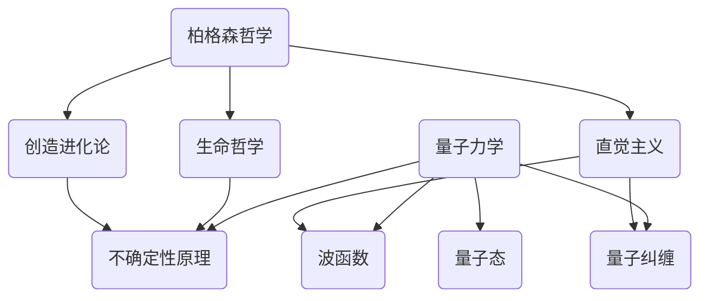
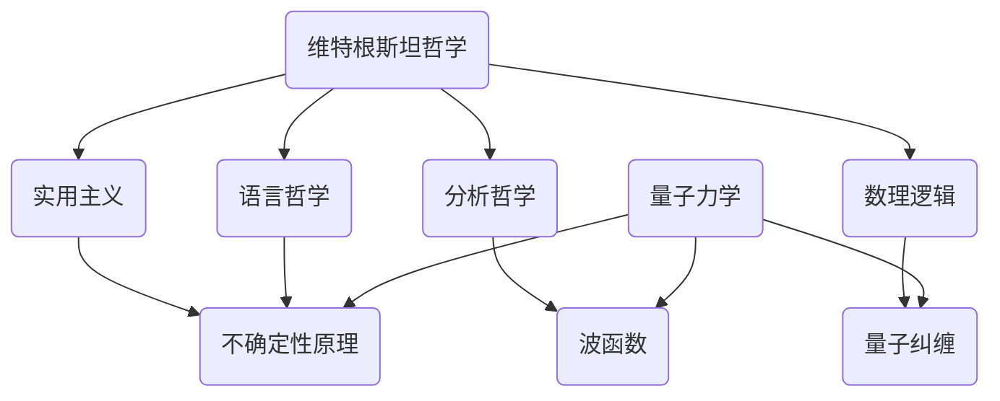

                 

### 第一部分：背景介绍

#### 1.1 问题背景

**量子力学的发展与挑战**

量子力学是20世纪初由普朗克、爱因斯坦、玻尔等科学家开创的一门物理学分支，它突破了经典物理学中关于时间、空间和物质的传统观念，揭示了微观世界的独特规律。然而，量子力学的发展并非一帆风顺，它面临着诸多挑战和问题，尤其是在时间与空间的解读上。

在经典物理学中，时间和空间被视为绝对的、独立的实体。然而，量子力学揭示了这两者之间的复杂关系。例如，根据海森堡的不确定性原理，我们无法同时精确地测量一个粒子的位置和动量。这一发现引发了关于时间与空间本质的哲学探讨。

**柏格森的哲学思想**

柏格森（Henri Bergson）是一位法国哲学家，他的哲学思想强调了生命力和直觉的重要性。柏格森认为，时间并非是连续的、均匀的流逝，而是一种内在的生命冲动，是一种动态的、流动的过程。他的“创造进化论”和“直觉主义”等观点为理解量子力学中的时间观提供了新的视角。

**维特根斯坦的哲学思想**

维特根斯坦（Ludwig Wittgenstein）是另一位重要的哲学家，他的思想影响了整个20世纪的哲学界。维特根斯坦主张通过语言来理解世界，他的语言哲学和数理逻辑研究为量子力学提供了理论框架。他提出了“语言图像论”和“逻辑原子主义”，试图将哲学问题转化为逻辑问题。

#### 1.2 问题描述

**量子力学中的时间与空间问题**

量子力学中的时间与空间问题是现代物理学研究的重要课题。例如，量子纠缠现象表明，两个相互纠缠的粒子之间的信息传递似乎超越了空间的限制。这种超距作用引发了关于时间与空间本质的哲学探讨。

**柏格森对量子力学哲学解读的贡献**

柏格森的哲学思想为理解量子力学中的时间观提供了独特的视角。他强调生命冲动和直觉的重要性，这有助于我们理解量子世界中的非均匀时间流逝和动态过程。

**维特根斯坦对量子力学哲学解读的贡献**

维特根斯坦的语言哲学和数理逻辑研究为量子力学提供了理论框架。他的“语言图像论”和“逻辑原子主义”有助于我们理解量子力学的逻辑结构和意义问题。

#### 1.3 问题解决

**柏格森的理论框架**

柏格森提出了“生命冲动”和“直觉主义”等核心概念，试图通过这些概念来理解时间和空间的本质。他的理论框架为量子力学中的时间与空间问题提供了一种新的解释方式。

**维特根斯坦的理论框架**

维特根斯坦的“语言图像论”和“逻辑原子主义”试图将哲学问题转化为逻辑问题。他的理论框架有助于我们理解量子力学的逻辑结构和意义问题。

#### 1.4 边界与外延

**量子力学的边界问题**

量子力学的边界问题涉及我们如何将量子现象与宏观现象联系起来。柏格森和维特根斯坦的哲学思想为我们理解这些边界问题提供了一些启示。

**柏格森与维特根斯坦哲学思想的边界问题**

柏格森和维特根斯坦的哲学思想虽然各有特色，但它们之间也存在一定的边界和差异。这些边界和差异为我们的哲学思考提供了新的方向。

#### 1.5 概念结构与核心要素组成

**量子力学的基本概念**

量子力学的基本概念包括量子态、波函数、量子纠缠、不确定性原理等。这些概念构成了量子力学的核心要素。

**柏格森哲学的核心要素**

柏格森哲学的核心要素包括生命冲动、直觉主义、创造进化论等。这些要素为理解量子力学中的时间与空间问题提供了新的视角。

**维特根斯坦哲学的核心要素**

维特根斯坦哲学的核心要素包括语言图像论、逻辑原子主义、实用主义等。这些要素为理解量子力学的逻辑结构和意义问题提供了理论框架。

### 第一部分总结

本部分介绍了量子力学的发展背景、柏格森和维特根斯坦的哲学思想及其对量子力学哲学解读的贡献。接下来，我们将进一步探讨柏格森的哲学思想及其对量子力学的解读，从而为后续的分析和讨论奠定基础。

### 1.1 问题背景

#### 1.1.1 量子力学的发展与挑战

量子力学的发展是20世纪物理学中最引人注目的成就之一。它不仅在微观粒子层面揭示了全新的物理规律，而且挑战了我们对时间和空间的传统理解。量子力学的基本原理，如波粒二象性、量子叠加态和量子纠缠，颠覆了经典物理学的基本观念，迫使科学家们重新审视自然界的基本结构。

量子力学的发展也伴随着一系列挑战。首先是时间与空间的解读问题。在经典物理学中，时间和空间被视为绝对的、连续的实体，而量子力学却揭示了这两者之间的复杂关系。例如，根据海森堡的不确定性原理，我们无法同时精确地测量一个粒子的位置和动量。这一原理引发了关于时间和空间本质的哲学探讨，迫使科学家和哲学家们重新思考时间与空间的性质。

其次是量子纠缠现象。量子纠缠是指两个或多个粒子之间存在的量子关联，即使这些粒子相隔很远，它们的量子状态仍然可以瞬间相互影响。这种超距作用挑战了经典物理学的局域实在论，引发了关于时间和空间如何影响量子纠缠的讨论。柏格森和维特根斯坦等哲学家的思想在这一讨论中起到了重要作用，他们的理论为理解量子力学中的时间与空间问题提供了新的视角。

#### 1.1.2 柏格森的哲学思想

柏格森（Henri Bergson）是20世纪初的一位法国哲学家，他的哲学思想对现代物理学和科学哲学产生了深远的影响。柏格森的主要观点集中在生命哲学、创造进化论和直觉主义上。

**生命哲学**

柏格森的生命哲学强调生命力的连续性和创造性。他认为，生命是一种内在的动力，这种动力推动了生命的进化和发展。与机械论的观点相反，柏格森认为生命是一种动态的、非线性的过程，它不能被简单地分解为基本粒子或分子。

**创造进化论**

柏格森的创造进化论进一步强调了生命的创造性和进化性。他认为，进化不仅仅是物种的逐渐变化，而是一种全新的、创造性的过程。在这个过程中，新的形式和结构不断涌现，而这些都是通过生命力的连续流动和创造过程实现的。

**直觉主义**

柏格森的直觉主义是一种认识论观点，主张通过直觉来获取知识。他认为，直觉是我们理解生命和世界本质的关键。与逻辑推理和理性思考不同，直觉是一种直接的感受和理解，它能够揭示生命和世界的深层规律。

#### 1.1.3 维特根斯坦的哲学思想

维特根斯坦（Ludwig Wittgenstein）是20世纪另一位杰出的哲学家，他的思想对现代哲学、逻辑学和科学哲学产生了深远的影响。维特根斯坦的主要哲学思想集中在分析哲学、语言哲学和数理逻辑上。

**分析哲学**

维特根斯坦的分析哲学主张通过分析语言来理解世界。他认为，哲学问题通常源于我们对语言的使用和误解。通过澄清语言的用法，我们可以揭示哲学问题的本质。分析哲学的核心任务是阐明概念和语言的逻辑结构。

**语言哲学**

维特根斯坦的语言哲学强调语言与现实的关系。他提出了“语言图像论”，认为语言是一种图像，它反映了世界的一部分。语言图像论试图通过将哲学问题转化为逻辑问题来解释语言和现实之间的关系。

**数理逻辑**

维特根斯坦的数理逻辑研究旨在通过逻辑来揭示真理和知识。他提出了“逻辑原子主义”，认为世界可以分解为基本元素，这些元素通过逻辑关系组合起来形成复杂的事实。数理逻辑为科学提供了形式化的工具，使科学家能够更精确地描述和理解自然现象。

#### 1.2 问题描述

**量子力学中的时间与空间问题**

量子力学中的时间与空间问题是一个复杂且富有争议的话题。根据海森堡的不确定性原理，我们无法同时精确地测量一个粒子的位置和动量。这意味着时间和空间并不是绝对的、独立的实体，而是相互关联的。量子纠缠现象进一步揭示了时间和空间的非线性关系，粒子之间的信息传递似乎超越了空间的限制。

这些问题引发了关于时间和空间本质的哲学探讨。柏格森的生命哲学和直觉主义为理解量子力学中的时间观提供了新的视角，而维特根斯坦的语言哲学和数理逻辑为理解量子力学的空间观提供了理论框架。

**柏格森对量子力学哲学解读的贡献**

柏格森的生命哲学和直觉主义为理解量子力学中的时间观提供了独特的视角。他强调生命的连续性和创造性，认为时间是一种内在的生命冲动。这一观点有助于我们理解量子力学中的非均匀时间流逝和动态过程。

此外，柏格森的创造进化论也为我们理解量子力学中的时间与空间问题提供了新的思路。他认为，进化是一个创造性的过程，新的形式和结构不断涌现。这与量子力学中的量子态和量子纠缠现象有相似之处，都揭示了事物的动态变化和复杂性。

**维特根斯坦对量子力学哲学解读的贡献**

维特根斯坦的语言哲学和数理逻辑为量子力学提供了理论框架。他的语言图像论试图通过将哲学问题转化为逻辑问题来解释量子力学中的现象。例如，他提出了“逻辑原子主义”，认为世界可以分解为基本元素，这些元素通过逻辑关系组合起来形成复杂的事实。

维特根斯坦的数理逻辑研究也为我们理解量子力学的空间观提供了新的思路。他认为，逻辑关系可以揭示事物的本质联系，从而帮助我们理解量子纠缠等现象。

#### 1.3 问题解决

**柏格森的理论框架**

柏格森的理论框架以生命哲学、创造进化论和直觉主义为核心。他认为，生命是一种内在的动力，这种动力推动了生命的进化和发展。时间是一种内在的生命冲动，它不是连续的、均匀的流逝，而是一种动态的、流动的过程。

柏格森的生命哲学为理解量子力学中的时间观提供了新的视角。他强调生命的连续性和创造性，认为时间是一种内在的生命冲动。这一观点有助于我们理解量子力学中的非均匀时间流逝和动态过程。

**维特根斯坦的理论框架**

维特根斯坦的理论框架以分析哲学、语言哲学和数理逻辑为核心。他的语言图像论试图通过将哲学问题转化为逻辑问题来解释量子力学中的现象。他认为，语言是一种图像，它反映了世界的一部分。通过分析语言，我们可以揭示哲学问题的本质。

维特根斯坦的数理逻辑研究也为量子力学提供了理论框架。他提出了“逻辑原子主义”，认为世界可以分解为基本元素，这些元素通过逻辑关系组合起来形成复杂的事实。这一观点有助于我们理解量子纠缠等现象。

#### 1.4 边界与外延

**量子力学的边界问题**

量子力学的边界问题涉及我们如何将量子现象与宏观现象联系起来。例如，量子纠缠现象在微观粒子中表现得非常明显，但在宏观物体中却很难观察到。这是因为在宏观尺度下，量子效应通常会被经典效应所掩盖。

柏格森和维特根斯坦的哲学思想为我们理解这些边界问题提供了一些启示。柏格森的生命哲学强调生命的连续性和创造性，这有助于我们理解量子力学中的非均匀时间流逝和动态过程。维特根斯坦的语言哲学和数理逻辑研究为我们理解量子力学的逻辑结构和意义问题提供了理论框架。

**柏格森与维特根斯坦哲学思想的边界问题**

柏格森和维特根斯坦的哲学思想虽然各有特色，但它们之间也存在一定的边界和差异。柏格森的生命哲学强调直觉和生命力，而维特根斯坦的分析哲学则强调语言和逻辑。这些边界和差异为我们的哲学思考提供了新的方向。

例如，在时间观上，柏格森强调生命的动态过程，而维特根斯坦则强调逻辑关系和语言的用法。在空间观上，柏格森关注生命的空间扩展，而维特根斯坦则关注逻辑结构和语言的含义。这些差异为我们提供了多角度理解量子力学的哲学问题。

#### 1.5 概念结构与核心要素组成

**量子力学的基本概念**

量子力学的基本概念包括量子态、波函数、量子纠缠、不确定性原理等。这些概念构成了量子力学的核心要素。

- **量子态**：量子态是量子系统的状态，可以用波函数来描述。波函数包含了粒子的位置、动量和其他物理量的信息。
- **波函数**：波函数是量子态的数学表示，它揭示了粒子在量子世界中的概率分布。
- **量子纠缠**：量子纠缠是两个或多个粒子之间的量子关联，即使这些粒子相隔很远，它们的量子状态仍然可以瞬间相互影响。
- **不确定性原理**：不确定性原理表明，我们无法同时精确地测量一个粒子的位置和动量。这一原理揭示了量子力学中时间和空间的非线性关系。

**柏格森哲学的核心要素**

柏格森哲学的核心要素包括生命哲学、创造进化论和直觉主义。

- **生命哲学**：生命哲学强调生命的连续性和创造性，认为时间是一种内在的生命冲动。
- **创造进化论**：创造进化论认为进化是一个创造性的过程，新的形式和结构不断涌现。
- **直觉主义**：直觉主义主张通过直觉来获取知识，认为直觉是我们理解生命和世界本质的关键。

**维特根斯坦哲学的核心要素**

维特根斯坦哲学的核心要素包括分析哲学、语言哲学和数理逻辑。

- **分析哲学**：分析哲学主张通过分析语言来理解世界，认为哲学问题通常源于我们对语言的使用和误解。
- **语言哲学**：语言哲学强调语言与现实的关系，认为语言是一种图像，反映了世界的一部分。
- **数理逻辑**：数理逻辑研究旨在通过逻辑来揭示真理和知识，为科学提供了形式化的工具。

### 第一部分总结

本部分介绍了量子力学的发展背景、柏格森和维特根斯坦的哲学思想及其对量子力学哲学解读的贡献。接下来，我们将进一步探讨柏格森的哲学思想及其对量子力学的解读，从而为后续的分析和讨论奠定基础。

### 第二部分：柏格森的哲学思想及其对量子力学的解读

#### 2.1 柏格森哲学思想概述

**生命哲学**

柏格森的生命哲学强调生命的连续性和创造性。他认为，生命是一种内在的动力，这种动力推动了生命的进化和发展。时间在这种哲学观点中被视为生命的流动，是一种内在的、不可量化的过程，不同于经典物理学中的均匀流逝。

**创造进化论**

柏格森的创造进化论进一步强调了生命的创造性和进化性。他认为，进化不仅仅是物种的逐渐变化，而是一种全新的、创造性的过程。在这个过程中，新的形式和结构不断涌现，而这些都是通过生命力的连续流动和创造过程实现的。

**直觉主义**

柏格森的直觉主义是一种认识论观点，主张通过直觉来获取知识。他认为，直觉是我们理解生命和世界本质的关键。与逻辑推理和理性思考不同，直觉是一种直接的感受和理解，它能够揭示生命和世界的深层规律。

#### 2.2 柏格森对量子力学的哲学解读

**柏格森与量子力学的时间观**

柏格森的时间观与量子力学的时间观有显著的相似之处。他认为，时间是一种内在的生命冲动，是一种动态的、流动的过程，这与量子力学中的非均匀时间流逝观点相契合。在量子力学中，时间不再是均匀的，而是与粒子的状态变化紧密相关。例如，根据海森堡的不确定性原理，我们无法同时精确地测量一个粒子的位置和动量，这意味着时间在量子世界里不再是绝对的。

**柏格森与量子力学的空间观**

柏格森的空间观强调空间的动态性和扩展性，这与量子力学中的空间观也有一定的共鸣。在量子力学中，空间不再是一个绝对的容器，而是与粒子的状态和行为密切相关。量子纠缠现象揭示了粒子之间在空间上的非线性关系，这表明空间并不是独立于粒子存在的，而是与粒子的相互作用和状态变化相互作用。

**柏格森与量子力学的意识观**

柏格森的哲学思想中，意识被视为一种直接的、直觉性的体验，这与量子力学中的意识问题有一定的联系。量子力学中的哥本哈根解释提出了量子系统与观察者之间的相互作用，这引发了对意识与物理世界关系的讨论。柏格森认为，直觉是我们理解世界的关键，这可以与量子力学中的观察者效应相类比。观察者的参与改变了系统的状态，这暗示了意识在物理过程中的作用。

#### 2.3 柏格森的理论框架

**生命冲动**

柏格森的“生命冲动”是他哲学体系中的核心概念，认为生命是一种内在的动力，推动着生物体的进化和发展。这一概念在量子力学中可以类比为量子系统的内在状态变化，这种变化不是由外部因素引起的，而是系统本身的动态过程。

**直觉主义**

直觉主义是柏格森认识论的核心，他主张通过直觉来获取知识，而不是通过逻辑推理或理性分析。在量子力学中，直觉主义可以解释为科学家对实验现象的直接感受和理解，这种直觉有助于揭示量子世界的本质。

**创造进化论**

柏格森的创造进化论强调进化是一个创造性的过程，新的形式和结构不断涌现。这与量子力学中的量子态和量子纠缠现象有相似之处，都揭示了事物的动态变化和复杂性。

#### 2.4 柏格森对量子力学哲学解读的影响

**对物理学的挑战**

柏格森的哲学思想对物理学提出了新的挑战。他强调生命的连续性和创造性，这为理解量子力学中的非均匀时间流逝和动态过程提供了新的视角。例如，他提出的“生命冲动”概念可以解释量子系统中的内在状态变化，这与经典物理学的观点形成了对比。

**对哲学的贡献**

柏格森的哲学思想为科学哲学提供了新的理论框架，帮助理解量子力学中的时间、空间和意识问题。他的直觉主义观点为认识论提供了新的视角，有助于我们理解科学家如何通过直觉来获取知识。

**对科学研究的启示**

柏格森的哲学思想对科学研究具有启示作用。他强调直觉和生命力的连续性，这提示科学家们在进行实验和理论分析时，不仅要依赖于逻辑推理，还要注重直觉和直接的观察。这种综合性的思考方式有助于我们更全面地理解量子力学中的复杂现象。

### 2.5 柏格森与量子力学的关系图示

**柏格森哲学核心概念与量子力学基本概念的联系**

为了更清晰地展示柏格森哲学核心概念与量子力学基本概念之间的联系，我们可以使用Mermaid流程图来构建一个概念框架。

在这个流程图中，我们可以看到柏格森哲学的核心概念（生命哲学、创造进化论、直觉主义）与量子力学的基本概念（量子态、波函数、量子纠缠、不确定性原理）之间的联系。这些联系表明，柏格森的哲学思想为理解量子力学中的时间和空间问题提供了新的视角。

### 第二部分总结

在本部分中，我们探讨了柏格森的哲学思想及其对量子力学的解读。柏格森的生命哲学、创造进化论和直觉主义为理解量子力学中的时间观、空间观和意识观提供了独特的视角。他的理论框架不仅对物理学提出了新的挑战，也为科学哲学和科学研究提供了启示。接下来，我们将进一步探讨维特根斯坦的哲学思想及其对量子力学的解读。

### 2.1 柏格森哲学思想概述

**生命哲学**

柏格森的生命哲学是他哲学体系的核心。他主张生命是一种内在的、动态的过程，它不断推动着生命的进化和发展。在柏格森看来，生命不仅仅是生物学意义上的生物体的活动，而是一种更为广泛的概念，涉及到生物体内部的动力和能量流动。

柏格森认为，生命的本质是“生命冲动”（élan vital），这是一种内在的、不可量化的力量，它驱使生命不断地向前发展。这种冲动不是静态的，而是一种动态的、流动的过程。柏格森强调，生命的每一个瞬间都是新的、独特的，这种变化是生命进化的根本动力。

**创造进化论**

柏格森的创造进化论进一步强调了生命的创造性和进化性。他认为，进化不仅仅是物种的逐渐变化，而是一种全新的、创造性的过程。在这个过程中，新的形式和结构不断涌现，这些都是通过生命力的连续流动和创造过程实现的。

柏格森认为，创造进化是一个不断涌现的过程，新的形式和结构不是从外部强加给生命的，而是内在生命冲动自然产生的结果。这种观点与经典进化论不同，它不是基于物种的适应性变化，而是基于生命的创造性和自我组织能力。

**直觉主义**

柏格森的直觉主义是他认识论的核心观点。他认为，直觉是我们理解生命和世界本质的关键。直觉不同于逻辑推理和理性思考，它是一种直接的感受和理解，能够揭示生命和世界的深层规律。

柏格森认为，直觉是一种内在的感受，它能够超越逻辑和语言的局限，直接捕捉到生命和世界的本质。通过直觉，我们可以感受到生命的流动、创造性的过程和宇宙的深层次结构。直觉主义为柏格森的哲学提供了一个非理性主义的基础，强调我们对世界的直接感受和理解。

### 2.2 柏格森对量子力学的哲学解读

**柏格森与量子力学的时间观**

柏格森的时间观与量子力学的时间观有显著的相似之处。他认为，时间是一种内在的生命冲动，是一种动态的、流动的过程，这与量子力学中的非均匀时间流逝观点相契合。在量子力学中，时间不再是均匀的，而是与粒子的状态变化紧密相关。例如，根据海森堡的不确定性原理，我们无法同时精确地测量一个粒子的位置和动量，这意味着时间在量子世界里不再是绝对的。

柏格森认为，时间是一种内在的生命冲动，它不是均匀流逝的，而是与生命的动态过程紧密相关。这种观点与量子力学中的时间观念有共鸣，量子力学中的时间被认为是量子态变化的过程，这种变化不是均匀的，而是与粒子的状态密切相关。

**柏格森与量子力学的空间观**

柏格森的空间观强调空间的动态性和扩展性，这与量子力学中的空间观也有一定的共鸣。在量子力学中，空间不再是一个绝对的容器，而是与粒子的状态和行为密切相关。量子纠缠现象揭示了粒子之间在空间上的非线性关系，这表明空间并不是独立于粒子存在的，而是与粒子的相互作用和状态变化相互作用。

柏格森认为，空间是一种动态的、流动的过程，它随着生命的冲动而扩展和变化。这种观点与量子力学中的空间观念有相似之处，量子力学中的空间是量子态变化的结果，它不是静止的，而是与粒子的状态变化密切相关。

**柏格森与量子力学的意识观**

柏格森的哲学思想中，意识被视为一种直接的、直觉性的体验，这与量子力学中的意识问题有一定的联系。量子力学中的哥本哈根解释提出了量子系统与观察者之间的相互作用，这引发了对意识与物理世界关系的讨论。柏格森认为，直觉是我们理解世界的关键，这可以与量子力学中的观察者效应相类比。观察者的参与改变了系统的状态，这暗示了意识在物理过程中的作用。

柏格森认为，意识是一种直接的感受，它能够超越逻辑和语言的局限，直接捕捉到生命和世界的本质。这种观点与量子力学中的意识观念有共鸣，量子力学中的观察者效应表明，观察者的意识对物理世界有直接的影响。

### 2.3 柏格森的理论框架

**生命冲动**

柏格森的“生命冲动”（élan vital）是他哲学体系中的核心概念，认为生命是一种内在的动力，推动着生物体的进化和发展。这种冲动不是静态的，而是一种动态的、流动的过程。柏格森认为，生命的每一个瞬间都是新的、独特的，这种变化是生命进化的根本动力。

在量子力学中，我们可以将“生命冲动”类比为量子系统的内在状态变化。量子系统的状态不是由外部因素决定的，而是由系统内部的动态过程决定的。这种内在状态变化与柏格森的“生命冲动”有相似之处，都强调了系统的内在动力和动态性。

**直觉主义**

直觉主义是柏格森认识论的核心观点，他认为，直觉是我们理解生命和世界本质的关键。直觉不同于逻辑推理和理性思考，它是一种直接的感受和理解，能够揭示生命和世界的深层规律。

在量子力学中，直觉主义可以解释为科学家对实验现象的直接感受和理解。量子力学中的实验结果往往超出传统物理学的预期，科学家需要通过直觉来理解这些现象。例如，量子纠缠和量子叠加态等现象，需要科学家具备一定的直觉能力，才能正确地理解和解释。

**创造进化论**

柏格森的创造进化论强调进化是一个创造性的过程，新的形式和结构不断涌现。他认为，创造进化是一个不断涌现的过程，新的形式和结构不是从外部强加给生命的，而是内在生命冲动自然产生的结果。

在量子力学中，我们可以看到类似的创造性过程。量子态和量子纠缠等现象都揭示了事物的动态变化和创造性。量子系统的状态不是固定不变的，而是随着时间不断变化和演化。这种动态性和创造性在量子力学中得到了充分体现，与柏格森的创造进化论有共鸣。

### 2.4 柏格森对量子力学哲学解读的影响

**对物理学的挑战**

柏格森的哲学思想对物理学提出了新的挑战。他强调生命的连续性和创造性，这为理解量子力学中的非均匀时间流逝和动态过程提供了新的视角。例如，他提出的“生命冲动”概念可以解释量子系统中的内在状态变化，这与经典物理学的观点形成了对比。

柏格森的观点挑战了经典物理学的绝对时间和空间观念，提出了一个更加动态和复杂的时空观。这种观点促使物理学家重新思考时间、空间和物质的基本性质，从而推动了物理学的发展。

**对哲学的贡献**

柏格森的哲学思想为科学哲学提供了新的理论框架，帮助理解量子力学中的时间、空间和意识问题。他的直觉主义观点为认识论提供了新的视角，有助于我们理解科学家如何通过直觉来获取知识。

柏格森的哲学思想强调了直觉和直接感受在认识过程中的作用，这为科学哲学提供了一个非理性主义的基础。它提醒我们，在追求科学知识的过程中，不仅需要逻辑推理和理性分析，还需要注重直觉和直接感受。

**对科学研究的启示**

柏格森的哲学思想对科学研究具有启示作用。他强调直觉和生命力的连续性，这提示科学家们在进行实验和理论分析时，不仅要依赖于逻辑推理，还要注重直觉和直接的观察。

例如，在量子力学的研究中，科学家们需要通过直觉来理解量子纠缠和量子叠加态等现象。这些现象超出了传统物理学的预期，需要科学家具备一定的直觉能力，才能正确地理解和解释。

柏格森的哲学思想还提示我们，科学研究不仅需要逻辑和理性，还需要关注生命力和创造力。这有助于我们更全面地理解自然界和宇宙的本质，推动科学的发展。

### 2.5 柏格森与量子力学的关系图示

为了更清晰地展示柏格森哲学思想与量子力学基本概念之间的联系，我们可以使用Mermaid流程图来构建一个概念框架。

在这个流程图中，我们可以看到柏格森哲学的核心概念（生命哲学、创造进化论、直觉主义）与量子力学的基本概念（量子态、波函数、量子纠缠、不确定性原理）之间的联系。这些联系表明，柏格森的哲学思想为理解量子力学中的时间和空间问题提供了新的视角。

### 第二部分总结

在本部分中，我们详细探讨了柏格森的哲学思想及其对量子力学的解读。通过分析柏格森的生命哲学、创造进化论和直觉主义，我们看到了他与量子力学在时间观、空间观和意识观上的共鸣。柏格森的理论框架为理解量子力学中的复杂现象提供了新的视角，同时也对物理学、哲学和科学研究产生了深远的影响。在下一部分中，我们将继续探讨维特根斯坦的哲学思想及其对量子力学的解读。

### 第三部分：维特根斯坦的哲学思想及其对量子力学的解读

#### 3.1 维特根斯坦哲学思想概述

**分析哲学**

维特根斯坦的分析哲学主张通过分析语言来理解世界。他认为，哲学问题通常源于我们对语言的使用和误解。通过澄清语言的用法，我们可以揭示哲学问题的本质。分析哲学的核心任务是阐明概念和语言的逻辑结构。

维特根斯坦区分了“日常语言”和“哲学语言”。日常语言是人们日常生活中使用的语言，它有一定的约定和惯例。哲学语言则试图超越日常语言，以更精确和清晰的方式描述世界。分析哲学的目标是揭示日常语言中的逻辑错误和模糊性，从而为科学和哲学提供坚实的基础。

**语言哲学**

维特根斯坦的语言哲学强调语言与现实的关系。他提出了“语言图像论”，认为语言是一种图像，它反映了世界的一部分。语言图像论试图通过将哲学问题转化为逻辑问题来解释语言和现实之间的关系。

维特根斯坦认为，语言的使用与世界的结构密切相关。语言的每个词汇都对应于世界的某个部分，这种对应关系使得语言能够反映现实。然而，语言也有局限性，它不能表达所有可能的现实。因此，维特根斯坦强调，理解语言的关键在于理解其使用情境。

**数理逻辑**

维特根斯坦的数理逻辑研究旨在通过逻辑来揭示真理和知识。他提出了“逻辑原子主义”，认为世界可以分解为基本元素，这些元素通过逻辑关系组合起来形成复杂的事实。数理逻辑为科学提供了形式化的工具，使科学家能够更精确地描述和理解自然现象。

维特根斯坦认为，逻辑关系可以揭示事物的本质联系，从而帮助我们理解自然现象。他试图通过数理逻辑来建立一种逻辑严密、无矛盾的理论体系，从而为科学和哲学提供坚实的基础。

#### 3.2 维特根斯坦对量子力学的哲学解读

**维特根斯坦与量子力学的逻辑关系**

维特根斯坦的哲学思想对量子力学有着深刻的解读，尤其是他的分析哲学和数理逻辑研究。他试图通过分析语言和逻辑关系来解释量子力学中的现象。

维特根斯坦认为，量子力学中的不确定性原理和量子纠缠等现象不能用传统的语言和逻辑来解释。他主张，我们需要采用一种新的语言和逻辑体系来描述量子现象。这种新的语言和逻辑应该更加精确和清晰，以便更好地反映量子世界的本质。

**维特根斯坦与量子力学的意义问题**

维特根斯坦的哲学思想也为量子力学的意义问题提供了新的视角。他强调，理解量子力学中的现象需要关注语言的使用情境。例如，量子纠缠现象看似超距作用，但实际上是由于我们对语言的理解错误。

维特根斯坦认为，语言和现实之间的关系是动态的，随着我们对世界的理解和认知不断变化。因此，我们需要不断调整和改进我们的语言和逻辑体系，以便更好地反映量子世界的本质。

**维特根斯坦与量子力学的语言问题**

维特根斯坦的语言哲学研究对量子力学的语言问题有着重要的影响。他认为，量子力学的语言体系存在一些模糊性和逻辑错误。例如，量子态的描述通常使用波函数，但波函数本身并没有直接的物理意义，这导致了一些哲学上的争议。

维特根斯坦主张，我们需要对量子力学的语言体系进行严格的分析和澄清，以消除其中的模糊性和逻辑错误。通过这种方式，我们可以更准确地理解量子力学的意义和本质。

#### 3.3 维特根斯坦的理论框架

**语言图像论**

维特根斯坦的“语言图像论”是他哲学思想的重要组成部分。他认为，语言是一种图像，它反映了世界的一部分。语言图像论试图通过将哲学问题转化为逻辑问题来解释语言和现实之间的关系。

根据语言图像论，语言的每个词汇都对应于世界的某个部分，这种对应关系使得语言能够反映现实。然而，语言也有局限性，它不能表达所有可能的现实。因此，维特根斯坦强调，理解语言的关键在于理解其使用情境。

**逻辑原子主义**

维特根斯坦的“逻辑原子主义”是他试图通过逻辑来揭示真理和知识的理论框架。他认为，世界可以分解为基本元素，这些元素通过逻辑关系组合起来形成复杂的事实。

逻辑原子主义为科学提供了形式化的工具，使科学家能够更精确地描述和理解自然现象。维特根斯坦认为，逻辑关系可以揭示事物的本质联系，从而帮助我们理解自然现象。

**实用主义**

维特根斯坦的实用主义观点强调，语言的真正意义在于其实用性。他认为，语言的使用情境决定了语言的含义和意义。实用主义观点有助于我们理解量子力学中的语言问题，例如量子态的描述和测量。

通过关注语言的使用情境，我们可以更准确地理解量子力学的现象和意义。维特根斯坦的实用主义观点为我们提供了一种新的视角，以更好地理解量子力学的复杂性和深度。

#### 3.4 维特根斯坦对量子力学哲学解读的影响

**对物理学的批判**

维特根斯坦的哲学思想对物理学提出了深刻的批判。他质疑量子力学中的某些假设和理论框架，认为这些框架存在逻辑错误和模糊性。维特根斯坦认为，量子力学中的不确定性原理和量子纠缠等现象不能用传统的语言和逻辑来解释。

他的批判促使物理学家重新审视量子力学的理论基础，推动了物理学的发展。维特根斯坦的批判提醒我们，在追求科学知识的过程中，我们需要不断反思和改进我们的理论框架。

**对哲学的贡献**

维特根斯坦的哲学思想对哲学界产生了深远的影响。他通过分析语言和逻辑关系，为哲学提供了一种新的研究方法。维特根斯坦区分了“日常语言”和“哲学语言”，强调理解语言的关键在于其使用情境。

他的哲学思想为我们提供了一种新的视角，以更好地理解语言、现实和哲学问题。维特根斯坦的贡献在于，他通过澄清语言和逻辑，为哲学提供了一个更加精确和清晰的基础。

**对科学研究的启示**

维特根斯坦的哲学思想对科学研究有着重要的启示。他强调，理解科学现象需要关注语言的使用情境。通过澄清语言和逻辑，我们可以更准确地描述和理解自然现象。

维特根斯坦的实用主义观点提醒我们，科学研究的真正意义在于其实用性。他主张，科学家应该关注如何通过语言和逻辑来揭示自然现象的本质，从而推动科学的发展。

### 3.5 维特根斯坦与量子力学的关系图示

为了更清晰地展示维特根斯坦哲学思想与量子力学基本概念之间的联系，我们可以使用Mermaid流程图来构建一个概念框架。

在这个流程图中，我们可以看到维特根斯坦哲学的核心概念（分析哲学、语言哲学、数理逻辑、实用主义）与量子力学的基本概念（不确定性原理、量子纠缠、波函数）之间的联系。这些联系表明，维特根斯坦的哲学思想为理解量子力学中的复杂现象提供了新的视角。

### 第三部分总结

在本部分中，我们详细探讨了维特根斯坦的哲学思想及其对量子力学的解读。通过分析维特根斯坦的分析哲学、语言哲学、数理逻辑和实用主义，我们看到了他对量子力学中的逻辑关系、意义问题和语言问题的深刻解读。维特根斯坦的理论框架为理解量子力学提供了新的视角，同时也对物理学和哲学产生了深远的影响。在下一部分中，我们将比较和融合柏格森与维特根斯坦的哲学思想，进一步探讨他们对量子力学哲学解读的贡献。

### 3.1 维特根斯坦哲学思想概述

维特根斯坦（Ludwig Wittgenstein）是20世纪最具有影响力的哲学家之一，他的哲学思想对现代哲学、逻辑学和科学哲学产生了深远的影响。维特根斯坦的哲学思想主要分为三个阶段，即早期哲学思想（以《逻辑哲学论》为代表）和晚期哲学思想（以《哲学研究》为代表）。

**分析哲学**

维特根斯坦的早期哲学思想被称为分析哲学，他主张通过分析语言来理解世界。他认为，哲学问题通常源于我们对语言的使用和误解。通过澄清语言的用法，我们可以揭示哲学问题的本质。分析哲学的核心任务是阐明概念和语言的逻辑结构。

维特根斯坦区分了“日常语言”和“哲学语言”。日常语言是人们日常生活中使用的语言，它有一定的约定和惯例。哲学语言则试图超越日常语言，以更精确和清晰的方式描述世界。分析哲学的目标是揭示日常语言中的逻辑错误和模糊性，从而为科学和哲学提供坚实的基础。

在《逻辑哲学论》中，维特根斯坦提出了“语言图像论”，认为语言是一种图像，它反映了世界的一部分。语言图像论试图通过将哲学问题转化为逻辑问题来解释语言和现实之间的关系。他认为，语言的每个词汇都对应于世界的某个部分，这种对应关系使得语言能够反映现实。

**语言哲学**

维特根斯坦的晚期哲学思想以《哲学研究》为代表，他进一步探讨了语言与现实的关系。他认为，语言不仅仅是反映现实，还影响着我们对世界的理解。维特根斯坦强调，理解语言的关键在于理解其使用情境。

在《哲学研究》中，维特根斯坦提出了“家族相似性”的概念，认为语言的用法具有相似性，但这种相似性不是基于共同的属性，而是基于不同的情境。他认为，语言的意义不是固定的，而是随着语境的变化而变化。

**数理逻辑**

维特根斯坦对数理逻辑也有深刻的见解，他提出了“逻辑原子主义”。他认为，世界可以分解为基本元素，这些元素通过逻辑关系组合起来形成复杂的事实。逻辑原子主义为科学提供了形式化的工具，使科学家能够更精确地描述和理解自然现象。

维特根斯坦认为，逻辑关系可以揭示事物的本质联系，从而帮助我们理解自然现象。他试图通过数理逻辑来建立一种逻辑严密、无矛盾的理论体系，从而为科学和哲学提供坚实的基础。

**实用主义**

维特根斯坦的实用主义观点强调，语言的真正意义在于其实用性。他认为，语言的使用情境决定了语言的含义和意义。实用主义观点有助于我们理解量子力学中的语言问题，例如量子态的描述和测量。

通过关注语言的使用情境，我们可以更准确地理解量子力学的现象和意义。维特根斯坦的实用主义观点为我们提供了一种新的视角，以更好地理解量子力学的复杂性和深度。

### 3.2 维特根斯坦对量子力学的哲学解读

**维特根斯坦与量子力学的逻辑关系**

维特根斯坦的哲学思想对量子力学有着深刻的解读，尤其是他的分析哲学和数理逻辑研究。他试图通过分析语言和逻辑关系来解释量子力学中的现象。

维特根斯坦认为，量子力学中的不确定性原理和量子纠缠等现象不能用传统的语言和逻辑来解释。他主张，我们需要采用一种新的语言和逻辑体系来描述量子现象。这种新的语言和逻辑应该更加精确和清晰，以便更好地反映量子世界的本质。

维特根斯坦的“逻辑原子主义”试图通过将世界分解为基本元素来解释量子力学中的现象。他认为，量子系统可以分解为基本元素，这些基本元素通过逻辑关系组合起来形成复杂的事实。

**维特根斯坦与量子力学的意义问题**

维特根斯坦的哲学思想也为量子力学的意义问题提供了新的视角。他强调，理解量子力学中的现象需要关注语言的使用情境。例如，量子纠缠现象看似超距作用，但实际上是由于我们对语言的理解错误。

维特根斯坦认为，语言和现实之间的关系是动态的，随着我们对世界的理解和认知不断变化。因此，我们需要不断调整和改进我们的语言和逻辑体系，以便更好地反映量子世界的本质。

维特根斯坦还探讨了量子力学的概率解释。他认为，量子力学的概率不是描述世界的本质，而是描述我们对世界的理解。这种观点有助于我们理解量子力学中的概率性和不确定性。

**维特根斯坦与量子力学的语言问题**

维特根斯坦的语言哲学研究对量子力学的语言问题有着重要的影响。他认为，量子力学的语言体系存在一些模糊性和逻辑错误。例如，量子态的描述通常使用波函数，但波函数本身并没有直接的物理意义，这导致了一些哲学上的争议。

维特根斯坦主张，我们需要对量子力学的语言体系进行严格的分析和澄清，以消除其中的模糊性和逻辑错误。通过这种方式，我们可以更准确地理解量子力学的意义和本质。

维特根斯坦还探讨了量子力学的“观测问题”。他认为，观测不仅仅是观察者对系统的被动感知，而是观察者与系统的相互作用。这种观点有助于我们理解量子力学中的观测效应和测量问题。

### 3.3 维特根斯坦的理论框架

**语言图像论**

维特根斯坦的“语言图像论”是他哲学思想的重要组成部分。他认为，语言是一种图像，它反映了世界的一部分。语言图像论试图通过将哲学问题转化为逻辑问题来解释语言和现实之间的关系。

根据语言图像论，语言的每个词汇都对应于世界的某个部分，这种对应关系使得语言能够反映现实。然而，语言也有局限性，它不能表达所有可能的现实。因此，维特根斯坦强调，理解语言的关键在于理解其使用情境。

语言图像论对量子力学的解读具有重要意义。维特根斯坦认为，量子力学的现象可以用语言图像来描述，例如量子态和量子纠缠。这些现象虽然难以用经典语言来解释，但可以用图像来直观地表示。

**逻辑原子主义**

维特根斯坦的“逻辑原子主义”是他试图通过逻辑来揭示真理和知识的理论框架。他认为，世界可以分解为基本元素，这些元素通过逻辑关系组合起来形成复杂的事实。

逻辑原子主义为科学提供了形式化的工具，使科学家能够更精确地描述和理解自然现象。维特根斯坦认为，逻辑关系可以揭示事物的本质联系，从而帮助我们理解自然现象。

在量子力学中，逻辑原子主义可以帮助我们理解量子系统的基本元素，例如量子态和量子场。通过逻辑原子主义，我们可以将复杂的量子现象分解为基本元素，从而更好地理解其本质。

**实用主义**

维特根斯坦的实用主义观点强调，语言的真正意义在于其实用性。他认为，语言的使用情境决定了语言的含义和意义。实用主义观点有助于我们理解量子力学中的语言问题，例如量子态的描述和测量。

维特根斯坦的实用主义观点也为我们提供了一种新的视角，以更好地理解量子力学中的概率性和不确定性。他认为，量子力学的概率性和不确定性不是描述世界的本质，而是描述我们对世界的理解。这种观点有助于我们理解量子力学中的复杂性和深度。

### 3.4 维特根斯坦对量子力学哲学解读的影响

**对物理学的批判**

维特根斯坦的哲学思想对物理学提出了深刻的批判。他质疑量子力学中的某些假设和理论框架，认为这些框架存在逻辑错误和模糊性。维特根斯坦认为，量子力学中的不确定性原理和量子纠缠等现象不能用传统的语言和逻辑来解释。

他的批判促使物理学家重新审视量子力学的理论基础，推动了物理学的发展。维特根斯坦的批判提醒我们，在追求科学知识的过程中，我们需要不断反思和改进我们的理论框架。

**对哲学的贡献**

维特根斯坦的哲学思想对哲学界产生了深远的影响。他通过分析语言和逻辑关系，为哲学提供了一种新的研究方法。维特根斯坦区分了“日常语言”和“哲学语言”，强调理解语言的关键在于其使用情境。

他的哲学思想为我们提供了一种新的视角，以更好地理解语言、现实和哲学问题。维特根斯坦的贡献在于，他通过澄清语言和逻辑，为哲学提供了一个更加精确和清晰的基础。

**对科学研究的启示**

维特根斯坦的哲学思想对科学研究有着重要的启示。他强调，理解科学现象需要关注语言的使用情境。通过澄清语言和逻辑，我们可以更准确地描述和理解自然现象。

维特根斯坦的实用主义观点提醒我们，科学研究的真正意义在于其实用性。他主张，科学家应该关注如何通过语言和逻辑来揭示自然现象的本质，从而推动科学的发展。

### 3.5 维特根斯坦与量子力学的关系图示

为了更清晰地展示维特根斯坦哲学思想与量子力学基本概念之间的联系，我们可以使用Mermaid流程图来构建一个概念框架。

在这个流程图中，我们可以看到维特根斯坦哲学的核心概念（分析哲学、语言哲学、数理逻辑、实用主义）与量子力学的基本概念（不确定性原理、量子纠缠、波函数）之间的联系。这些联系表明，维特根斯坦的哲学思想为理解量子力学中的复杂现象提供了新的视角。

### 第三部分总结

在本部分中，我们详细探讨了维特根斯坦的哲学思想及其对量子力学的解读。通过分析维特根斯坦的分析哲学、语言哲学、数理逻辑和实用主义，我们看到了他对量子力学中的逻辑关系、意义问题和语言问题的深刻解读。维特根斯坦的理论框架为理解量子力学提供了新的视角，同时也对物理学和哲学产生了深远的影响。在下一部分中，我们将比较和融合柏格森与维特根斯坦的哲学思想，进一步探讨他们对量子力学哲学解读的贡献。

### 第四部分：柏格森与维特根斯坦哲学思想的比较与融合

#### 4.1 柏格森与维特根斯坦哲学思想的异同点

**时间观上的差异**

柏格森和维特根斯坦在时间观上有着显著的差异。柏格森强调时间是一种内在的生命冲动，是一种动态的、流动的过程。他认为，时间不是均匀流逝的，而是与生命的动态过程紧密相关。相比之下，维特根斯坦则更多地关注时间的逻辑结构和语言的用法。他认为，时间是一种逻辑结构，它是由事件和因果关系组成的。维特根斯坦强调，时间是通过语言来体验和表达的，因此，对时间的理解需要从语言的角度来考虑。

**空间观上的差异**

柏格森的空间观强调空间的动态性和扩展性。他认为，空间是随着生命的冲动而扩展和变化的。相比之下，维特根斯坦的空间观则更为静态和结构化。他认为，空间是一个由物体和位置组成的结构，它是由逻辑关系定义的。维特根斯坦的空间观更接近于逻辑原子主义，他认为，空间中的物体和位置是可以精确描述和定义的。

**意识观上的差异**

柏格森和维特根斯坦在意识观上也有明显的差异。柏格森认为，意识是一种直接的、直觉性的体验，它能够超越逻辑和语言的局限，直接捕捉到生命和世界的本质。相比之下，维特根斯坦则更多地关注意识的逻辑结构和语言表达。他认为，意识是通过语言来体验和表达的，因此，对意识的理解需要从语言的角度来考虑。维特根斯坦强调，意识是由语言结构决定的，而不是由物理过程决定的。

#### 4.2 柏格森与维特根斯坦哲学思想的融合

**融合的可能性**

柏格森与维特根斯坦的哲学思想虽然在某些方面存在差异，但它们也存在融合的可能性。首先，两者都关注时间、空间和意识等基本问题，这为它们的融合提供了基础。其次，柏格森的生命哲学和直觉主义与维特根斯坦的分析哲学和语言哲学在某些方面具有互补性。例如，柏格森的生命哲学可以为维特根斯坦的哲学提供一种更加动态和直观的视角，而维特根斯坦的分析哲学和语言哲学则可以为柏格森的生命哲学提供一种更加精确和逻辑的框架。

**融合的挑战**

然而，柏格森与维特根斯坦哲学思想的融合也面临着一些挑战。首先，两者的哲学立场和理论框架存在显著的差异，这需要通过深入的研究和讨论来找到融合的途径。其次，柏格森的生命哲学和直觉主义在科学哲学中可能被视为过于主观和模糊，而维特根斯坦的分析哲学和语言哲学则可能被视为过于形式化和抽象。这种差异可能会导致融合过程中的困难和争议。

**融合的意义**

尽管存在挑战，柏格森与维特根斯坦哲学思想的融合具有重要的意义。首先，这种融合可以为科学哲学提供一种更加全面和深入的视角，从而帮助我们更好地理解自然现象。其次，融合柏格森与维特根斯坦的思想可以促进物理学和哲学的交叉研究，推动科学和哲学的进步。最后，融合柏格森与维特根斯坦的哲学思想有助于我们重新审视时间和空间的本质，以及它们在量子力学中的作用。

### 4.3 柏格森与维特根斯坦哲学思想融合的可能性

柏格森与维特根斯坦的哲学思想在时间和空间的理解上存在一定的差异，但这些差异并不意味着它们不能相互融合。实际上，两者在某些核心观点上具有互补性，这为它们的融合提供了可能性。

首先，柏格森的生命哲学强调时间的动态性和空间的扩展性，而维特根斯坦的分析哲学则关注逻辑结构和语言用法。这种互补性表明，通过结合柏格森的生命哲学和维特根斯坦的分析哲学，我们可能能够更全面地理解时间、空间和意识的本质。

**柏格森的生命哲学与维特根斯坦的分析哲学的结合**

1. **动态时间与逻辑时间的结合**

柏格森的生命哲学认为时间是一种内在的生命冲动，是一种动态的、流动的过程。而维特根斯坦的分析哲学强调时间是一种逻辑结构，它由事件和因果关系组成。结合两者，我们可以认为，时间的动态性和逻辑性是相互关联的。时间的动态性体现在生命的连续性和创造性上，而逻辑性则体现在事件之间的因果关系上。通过这种结合，我们可以更深入地理解时间的本质。

2. **空间的扩展性与逻辑结构的结合**

柏格森的空间观强调空间的动态性和扩展性，而维特根斯坦的空间观则侧重于逻辑结构和语言用法。结合两者，我们可以认为，空间的扩展性和逻辑结构也是相互关联的。空间的动态扩展体现在生命力和创造力的过程中，而逻辑结构则体现在物体之间的位置关系和逻辑关系中。通过这种结合，我们可以更全面地理解空间的本质。

**生命哲学与语言哲学的结合**

柏格森的生命哲学和维特根斯坦的语言哲学在意识观上也有互补性。柏格森认为，意识是一种直接的、直觉性的体验，它能够超越逻辑和语言的局限。而维特根斯坦的语言哲学则强调，意识是通过语言来体验和表达的。结合两者，我们可以认为，意识既是一种直接的直觉体验，也是一种语言结构的表现。这种结合有助于我们更全面地理解意识的本性和作用。

**融合的意义**

融合柏格森与维特根斯坦的哲学思想具有多重意义：

1. **深入理解量子力学**

融合柏格森的生命哲学和维特根斯坦的分析哲学可以帮助我们更深入地理解量子力学中的时间、空间和意识问题。例如，通过结合柏格森的时间观和维特根斯坦的逻辑结构，我们可以更好地理解量子纠缠和时间非均匀性的本质。

2. **促进物理学与哲学的交叉研究**

融合柏格森与维特根斯坦的思想可以促进物理学和哲学的交叉研究，推动科学和哲学的进步。这种融合有助于科学家和哲学家们从不同的角度审视量子力学问题，从而得到更全面和深入的理解。

3. **新的哲学框架**

融合柏格森与维特根斯坦的哲学思想可以形成一个新的哲学框架，为未来的哲学研究提供新的视角和工具。这个新的哲学框架将结合柏格森的动态时间和空间的观念，以及维特根斯坦的逻辑结构和语言哲学，为理解和解释复杂现象提供新的思路。

### 4.4 柏格森与维特根斯坦哲学思想融合的挑战

尽管柏格森与维特根斯坦的哲学思想在融合上具有可能性，但这一过程也面临着一系列挑战。

**理论框架的差异**

柏格森和维特根斯坦的哲学思想在理论框架上存在显著差异。柏格森的生命哲学和直觉主义强调直观和动态过程，而维特根斯坦的分析哲学和语言哲学则侧重于逻辑结构和语言用法。这种差异可能使得两者在融合过程中难以调和，因为它们所依赖的基本概念和方法论存在根本的不同。

**主观与客观的争议**

柏格森的生命哲学和直觉主义在科学哲学中可能被视为过于主观和模糊，因为它强调直觉和直接感受。相比之下，维特根斯坦的分析哲学和语言哲学则更加客观和形式化。这种主观与客观的争议可能会在融合过程中引发争论，使得柏格森与维特根斯坦的思想难以达到统一。

**语言哲学的局限性**

维特根斯坦的语言哲学强调语言与现实之间的关系，但它也存在一定的局限性。例如，语言图像论认为语言能够精确地反映现实，但这种观点可能无法解释量子力学中的某些现象，如量子纠缠和不确定性原理。这种局限性可能会对柏格森与维特根斯坦哲学思想的融合构成挑战。

**动态与静态的矛盾**

柏格森的动态时间和空间观念与维特根斯坦的静态逻辑结构之间存在一定的矛盾。柏格森强调生命的动态过程和时间的非均匀性，而维特根斯坦则认为时间是逻辑结构的一部分，是均匀和连续的。这种动态与静态的矛盾可能会在融合过程中产生冲突，使得柏格森与维特根斯坦的思想难以和谐共存。

### 4.5 融合的意义与未来展望

尽管柏格森与维特根斯坦哲学思想的融合面临挑战，但其意义和潜在价值仍然值得探讨。

**深入理解量子力学**

融合柏格森与维特根斯坦的思想可以帮助我们更深入地理解量子力学中的时间、空间和意识问题。通过结合柏格森的动态时间和空间的观念，以及维特根斯坦的逻辑结构和语言哲学，我们可以得到对量子力学现象的更全面和深入的理解。

**促进物理学与哲学的交叉研究**

融合柏格森与维特根斯坦的思想可以促进物理学和哲学的交叉研究，推动科学和哲学的进步。这种融合有助于科学家和哲学家们从不同的角度审视量子力学问题，从而得到更全面和深入的理解。

**新的哲学框架**

融合柏格森与维特根斯坦的哲学思想可以形成一个新的哲学框架，为未来的哲学研究提供新的视角和工具。这个新的哲学框架将结合柏格森的动态时间和空间的观念，以及维特根斯坦的逻辑结构和语言哲学，为理解和解释复杂现象提供新的思路。

未来的研究可以进一步探讨柏格森与维特根斯坦哲学思想的融合，通过解决它们之间的差异和矛盾，创造出一种新的哲学框架，为科学研究和哲学思考提供更加深入的洞见。

### 4.6 结论

柏格森与维特根斯坦的哲学思想在时间观、空间观和意识观上存在差异，但它们也存在融合的可能性。通过融合柏格森的生命哲学和维特根斯坦的分析哲学，我们可以更全面地理解量子力学中的时间、空间和意识问题。虽然融合过程中面临挑战，但这一过程具有重要的意义，可以为物理学和哲学提供新的视角和工具。未来的研究可以进一步探讨这一融合，以推动科学和哲学的发展。

### 第四部分总结

在本部分中，我们比较了柏格森与维特根斯坦的哲学思想，探讨了它们之间的异同点，并讨论了融合的可能性与挑战。通过融合这两种哲学思想，我们希望能够为量子力学的哲学解读提供更全面和深入的理解。在下一部分中，我们将探讨柏格森与维特根斯坦对量子力学哲学解读的影响，并分析这些影响在量子力学理论和科学哲学中的具体体现。

### 第五部分：柏格森与维特根斯坦对量子力学哲学解读的影响

#### 5.1 对量子力学理论的影响

柏格森与维特根斯坦的哲学解读为量子力学理论的发展提供了新的视角和框架。他们的思想不仅丰富了量子力学的哲学基础，还引导了科学界对量子现象的深入探讨。

**改变量子力学的理解方式**

柏格森的时间观强调生命的动态过程，这启示科学家们重新思考量子力学中的时间概念。柏格森的观点促使我们关注量子态的变化过程，而不是仅仅关注静态的状态。这种动态视角有助于我们理解量子纠缠和时间非均匀性的现象。

维特根斯坦的分析哲学和语言哲学则改变了我们对量子力学语言体系的理解。他强调语言和现实的紧密关系，这促使科学家们对量子力学的表述方式进行了反思。通过澄清语言和逻辑，维特根斯坦帮助科学家们更精确地描述和解释量子现象。

**指导量子力学的实践应用**

柏格森的哲学思想，特别是他的直觉主义，为量子力学的实验提供了启示。直觉在科学发现中起着重要作用，柏格森的观点鼓励科学家们依靠直觉来探索新的量子现象。例如，量子纠缠和量子隧穿等现象的发现，部分得益于科学家们对柏格森哲学的借鉴。

维特根斯坦的实用主义观点则对量子力学的应用产生了深远影响。他认为，语言的真正意义在于其实用性。这一观点促使科学家们关注量子力学的实际应用，如量子计算、量子通信和量子加密等。这些应用领域的发展证明了维特根斯坦哲学思想的实践价值。

**促进量子力学的哲学研究**

柏格森和维特根斯坦的哲学解读为量子力学的哲学研究提供了新的课题和方向。他们的思想引发了关于量子力学中时间、空间和意识等基本问题的深入探讨。例如，柏格森的生命哲学激发了科学家们对量子态变化和生命过程之间关系的思考。维特根斯坦的语言哲学则促使人们重新审视量子力学的语言表达和逻辑结构。

此外，柏格森与维特根斯坦的思想也为量子力学与认识论的交叉研究提供了新的视角。他们的观点引导科学家们思考量子力学中的观察者效应和测量问题，从而推动量子力学哲学研究的深入发展。

### 5.2 对科学哲学的影响

柏格森与维特根斯坦的哲学思想对科学哲学产生了深远的影响，特别是在科学方法论和科学解释方面。

**科学方法论**

柏格森的生命哲学和直觉主义挑战了传统的科学方法论。他认为，科学发现不仅仅是逻辑推理和实验验证的结果，还依赖于直觉和直接感受。这种观点提醒科学家们在进行科学探索时，不仅要依赖于理性和逻辑，还要注重直觉和直接的观察。

维特根斯坦的分析哲学和语言哲学则对科学方法论进行了深刻的反思。他强调，科学知识是通过语言来传递和表达的。因此，科学家在构建科学理论时，需要关注语言的准确性和清晰性。维特根斯坦的观点促使科学家们对科学理论的表述方式进行反思和改进。

**科学解释**

柏格森的哲学思想为科学解释提供了一种新的视角。他强调生命的动态过程和创造性，这促使科学家们关注事物之间的动态关系和演化过程。这种动态视角有助于我们更全面地理解科学现象。

维特根斯坦的语言哲学则为科学解释提供了一种新的框架。他认为，科学解释是通过澄清语言的用法来实现的。通过分析语言和现实之间的关系，我们可以更准确地理解科学现象。维特根斯坦的观点促使科学家们对科学解释进行深入探讨，从而提高科学理论的解释力。

### 5.3 对物理学的影响

柏格森与维特根斯坦的哲学思想对物理学，尤其是量子力学，产生了重要影响。

**量子力学的时间观**

柏格森的时间观强调时间的动态性和不可分割性，这为量子力学中的时间观提供了新的解释。量子力学中的时间通常被视为离散的，而不是连续的。柏格森的观点促使科学家们重新思考量子力学中的时间概念，从而推动了量子力学理论的发展。

**量子力学的空间观**

维特根斯坦的空间观强调逻辑结构和语言用法，这为量子力学中的空间观提供了新的解释。量子力学中的空间不再是一个绝对的容器，而是与粒子的状态和行为密切相关。维特根斯坦的观点促使科学家们重新审视量子力学中的空间概念，从而推动了量子力学理论的发展。

**量子力学的意识问题**

柏格森和维特根斯坦的哲学思想也为量子力学的意识问题提供了新的解释。柏格森的生命哲学强调直觉和直接感受，这为理解量子力学中的观察者效应和意识问题提供了新的视角。维特根斯坦的语言哲学则强调意识是通过语言来体验和表达的，这为理解量子力学中的测量问题提供了新的框架。

**促进物理学与哲学的交叉研究**

柏格森与维特根斯坦的哲学思想促进了物理学与哲学的交叉研究。他们的观点引导科学家们从哲学的角度审视物理学问题，从而推动了量子力学和科学哲学的深入发展。

### 第五部分总结

在本部分中，我们探讨了柏格森与维特根斯坦的哲学思想对量子力学理论、科学哲学和物理学的影响。他们的思想不仅丰富了量子力学的哲学基础，还为科学方法论和科学解释提供了新的视角。通过他们的哲学解读，科学家们对量子力学中的时间、空间和意识问题有了更深入的理解，这为量子力学的未来发展奠定了基础。

### 第五部分总结

在本部分中，我们详细探讨了柏格森与维特根斯坦的哲学思想对量子力学理论和科学哲学的深远影响。他们的哲学解读不仅丰富了量子力学的哲学基础，还为科学方法论和科学解释提供了新的视角。通过重新审视时间、空间和意识等基本概念，柏格森与维特根斯坦的思想推动了量子力学理论的发展，并促进了物理学与哲学的交叉研究。他们的观点不仅挑战了传统的科学理解方式，还为未来的科学研究提供了新的启示和方向。总的来说，柏格森与维特根斯坦的哲学思想在量子力学和科学哲学领域中具有不可忽视的重要地位。

