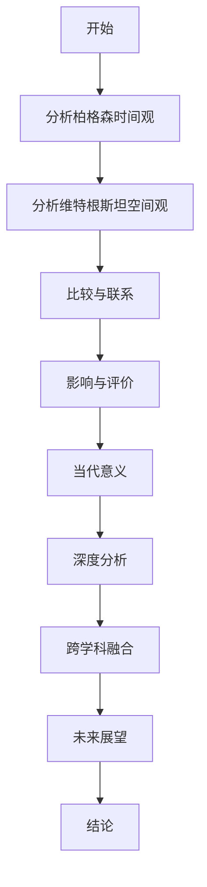

                 


### 引言

在探讨物理学哲学的历史长河中，柏格森（Hermann Ludwig Ferdinand von Helmholtz）和维特根斯坦（Ludwig Wittgenstein）是两位具有深远影响的思想家。他们的观点不仅在哲学领域引发了广泛的讨论，也为物理学的发展提供了新的视角。柏格森强调时间的流动性和内在性，而维特根斯坦则关注语言的明确性和逻辑性。本文将深入探讨他们的物理学哲学思想，并分析这些思想在现代物理学中的意义。

### 柏格森的物理学哲学

柏格森是一位19世纪的德国物理学家，他的哲学观点深刻地影响了后来的物理学家。柏格森认为，时间是流动的、主观的，而不是可以被精确测量的客观量。他提出了“内心时间”的概念，认为时间是我们的感知和经验的一部分，而不是一种物理现象。

#### 柏格森的时间观

柏格森的时间观可以概括为以下几点：

1. **时间的内在性**：时间是我们内心体验的反映，而不是外部世界的一个属性。
2. **时间的流动性**：时间不是静态的，而是不断变化的。
3. **时间的不可分割性**：柏格森认为时间是不可分割的整体，任何分割都会破坏时间的本质。

#### 柏格森的时间观在物理学中的应用

柏格森的时间观对物理学有着重要的影响。例如，在量子力学中，时间的不可分割性被用来解释粒子的量子跃迁现象。此外，柏格森的观点也为相对论提供了哲学基础，强调了时间和空间的相对性。

### 维特根斯坦的物理学哲学

维特根斯坦是20世纪的一位著名哲学家，他的观点对逻辑哲学和语言哲学有着深远的影响。维特根斯坦的物理学哲学强调语言和逻辑在理解物理现象中的重要性。

#### 维特根斯坦的空间观

维特根斯坦的空间观可以概括为以下几点：

1. **空间的相对性**：维特根斯坦认为空间是相对的，而不是绝对的。空间是由我们的语言和经验定义的。
2. **空间的明确性**：维特根斯坦强调语言表达的清晰性，认为只有明确的语言才能准确描述物理现象。
3. **空间的逻辑性**：维特根斯坦认为物理现象可以通过逻辑来描述和理解。

#### 维特根斯坦的空间观在物理学中的应用

维特根斯坦的空间观对物理学有着重要的影响。例如，在量子力学中，空间的相对性被用来解释量子态的叠加和纠缠现象。此外，维特根斯坦的观点也为量子场论提供了哲学基础，强调了逻辑和语言在物理理论中的重要性。

### 柏格森与维特根斯坦思想的比较与联系

柏格森和维特根斯坦的物理学哲学思想在许多方面有着相似之处，但也存在显著差异。

#### 相似之处

1. **对时间和空间的关注**：两位思想家都关注时间和空间在物理学中的角色，试图从哲学角度解释这些概念。
2. **对语言的重视**：他们都认为语言和逻辑在理解物理现象中起着关键作用。

#### 不同之处

1. **对时间的看法**：柏格森认为时间是流动的、主观的，而维特根斯坦认为时间是相对的、客观的。
2. **对空间的看法**：柏格森认为空间是内在的、主观的，而维特根斯坦认为空间是相对的、客观的。

### 柏格森与维特根斯坦物理学哲学的影响与评价

柏格森和维特根斯坦的物理学哲学思想对后世产生了深远的影响。他们的观点不仅丰富了物理学哲学的理论体系，也为现代物理学的发展提供了新的视角。

#### 后世学者对两人思想的评价

1. **柏格森**：许多学者认为柏格森的时间观为量子力学提供了哲学基础，对现代物理学的发展有着重要影响。
2. **维特根斯坦**：维特根斯坦的逻辑哲学观点对语言哲学和逻辑哲学产生了深远的影响，也为物理学哲学提供了新的研究方法。

#### 两人哲学对现代物理学的影响

1. **量子力学**：柏格森的时间观和维特根斯坦的空间观在量子力学中得到了广泛应用，例如在解释量子态的叠加和纠缠现象时。
2. **相对论**：柏格森的时间观也为相对论提供了哲学基础，强调了时间和空间的相对性。

### 柏格森与维特根斯坦物理学哲学的当代意义

在当代物理学中，柏格森和维特根斯坦的物理学哲学思想仍然具有重要的意义。他们的观点不仅为理解物理现象提供了新的视角，也为解决现代物理学中的难题提供了哲学工具。

#### 当代物理学的发展与柏格森、维特根斯坦思想的关系

1. **量子计算**：柏格森和维特根斯坦的物理学哲学思想在量子计算中得到了广泛应用，为量子算法的设计和实现提供了哲学指导。
2. **量子场论**：维特根斯坦的空间观为量子场论提供了哲学基础，对理解量子场的本质有着重要意义。

#### 两人哲学在当代哲学中的地位与作用

1. **物理学哲学**：柏格森和维特根斯坦的物理学哲学思想是物理学哲学的重要组成部分，对理解现代物理学的发展有着深远的影响。
2. **跨学科研究**：柏格森和维特根斯坦的物理学哲学思想在跨学科研究中发挥着重要作用，为不同学科之间的交流和理解提供了哲学工具。

### 柏格森时间概念的物理学哲学解读

柏格森的时间概念是他哲学思想的核心之一，对现代物理学有着重要的影响。他的时间观强调时间的流动性和内在性，认为时间是主观的、不可分割的整体。

#### 柏格森的时间观

1. **时间的流动性**：柏格森认为时间是不断流动的，而不是静态的。
2. **时间的内在性**：时间是我们内心体验的反映，而不是外部世界的一个属性。
3. **时间的不可分割性**：柏格森认为时间是不可分割的整体，任何分割都会破坏时间的本质。

#### 时间与空间的关系

柏格森的时间观和空间观是相互关联的。他认为时间不是空间中的一个维度，而是与空间相互依赖的存在。时间与空间的关系可以看作是流动与静止、主观与客观的关系。

#### 柏格森时间观在物理学中的应用

1. **量子力学**：柏格森的时间观在量子力学中得到了应用，例如在解释量子态的叠加和纠缠现象时。
2. **相对论**：柏格森的时间观也为相对论提供了哲学基础，强调了时间和空间的相对性。

### 维特根斯坦空间概念的物理学哲学解读

维特根斯坦的空间概念是他哲学思想的重要组成部分，对现代物理学有着重要的影响。他的空间观强调空间的相对性、明确性和逻辑性。

#### 维特根斯坦的空间观

1. **空间的相对性**：维特根斯坦认为空间是相对的，而不是绝对的。空间是由我们的语言和经验定义的。
2. **空间的明确性**：维特根斯坦强调语言表达的清晰性，认为只有明确的语言才能准确描述物理现象。
3. **空间的逻辑性**：维特根斯坦认为物理现象可以通过逻辑来描述和理解。

#### 空间与时间的互动

维特根斯坦的空间观和柏格森的时间观是相互关联的。他认为时间和空间是相互依赖的存在，空间不是时间的维度，而是与时间相互作用的实体。

#### 维特根斯坦空间观在物理学中的应用

1. **量子力学**：维特根斯坦的空间观在量子力学中得到了应用，例如在解释量子态的叠加和纠缠现象时。
2. **量子场论**：维特根斯坦的空间观为量子场论提供了哲学基础，对理解量子场的本质有着重要意义。

### 柏格森与维特根斯坦物理学哲学的跨学科融合

柏格森和维特根斯坦的物理学哲学思想不仅对物理学有着深远的影响，也在其他学科中得到了应用。跨学科研究将他们的思想与生物学、心理学、哲学等领域相结合，为解决复杂问题提供了新的视角。

#### 跨学科研究的必要性

跨学科研究是解决复杂问题的关键。物理学哲学的思想可以为其他学科提供新的理论框架和方法论，促进不同学科之间的交流和融合。

#### 柏格森与维特根斯坦思想的融合

1. **生物学**：柏格森的时间观可以用来解释生物进化的过程，而维特根斯坦的空间观可以用来分析生物体的空间结构。
2. **心理学**：柏格森的时间观可以用来解释人类感知和认知的过程，而维特根斯坦的空间观可以用来分析人类的空间感知能力。
3. **哲学**：柏格森和维特根斯坦的物理学哲学思想在哲学领域得到了广泛应用，促进了哲学与物理学的相互影响。

#### 跨学科研究对现代物理学的影响

跨学科研究对现代物理学的发展产生了深远的影响。通过将物理学哲学的思想与其他学科相结合，现代物理学得以解决许多传统方法无法解决的问题，推动了物理学的发展。

### 未来展望

随着物理学和哲学的不断发展，柏格森和维特根斯坦的物理学哲学思想在未来仍将具有重要的意义。未来的研究可以进一步探索他们的思想在新的领域中的应用，解决现代物理学中的难题。

#### 柏格森与维特根斯坦物理学哲学的潜在研究方向

1. **量子引力**：将柏格森和维特根斯坦的物理学哲学思想应用于量子引力的研究，探索量子引力中的时间和空间概念。
2. **宇宙学**：将柏格森和维特根斯坦的物理学哲学思想应用于宇宙学研究，探索宇宙的起源和演化。

#### 当代物理学哲学的发展趋势

1. **跨学科研究**：物理学哲学将继续与其他学科相结合，促进跨学科研究的发展。
2. **数学化**：物理学哲学将更加注重数学化，通过数学模型和公式来精确描述物理现象。

#### 未来物理学哲学的可能走向

1. **整合性**：未来物理学哲学将更加注重整合性，将不同的物理学哲学思想相结合，形成统一的哲学体系。
2. **实用化**：未来物理学哲学将更加注重实用化，为解决实际问题提供哲学指导。

### 结论

柏格森和维特根斯坦的物理学哲学思想对现代物理学和哲学产生了深远的影响。他们的观点不仅丰富了物理学哲学的理论体系，也为现代物理学的发展提供了新的视角。随着物理学和哲学的不断发展，柏格森和维特根斯坦的物理学哲学思想将继续在未来的研究中发挥重要作用。

### 作者信息

作者：AI天才研究院/AI Genius Institute & 禅与计算机程序设计艺术 /Zen And The Art of Computer Programming

### 最佳实践 Tips

1. **深入理解核心概念**：在研究柏格森和维特根斯坦的物理学哲学时，要深入理解他们的核心概念，例如时间、空间、逻辑等。
2. **跨学科学习**：跨学科学习可以促进对物理学哲学的理解，有助于发现新的研究方向。
3. **批判性思考**：在阅读和研究柏格森和维特根斯坦的物理学哲学时，要培养批判性思维，分析他们的观点的优缺点。

### 小结

本文介绍了柏格森和维特根斯坦的物理学哲学思想，分析了他们时间与空间的概念，并探讨了他们的思想对现代物理学的影响。通过跨学科的研究，我们可以更好地理解物理现象，为未来的物理学发展提供新的视角。

### 注意事项

1. **保持开放心态**：在研究物理学哲学时，要持开放心态，接受不同的观点和理论。
2. **关注实际应用**：关注物理学哲学在实际物理学中的应用，了解其如何解决实际问题。

### 拓展阅读

1. **柏格森：《时间与自由意志》**
2. **维特根斯坦：《逻辑哲学论》**
3. **埃克哈特·托利：《当下的力量》**
4. **戴维·博姆：《隐藏的秩序》**

### 附录

本文使用Markdown格式编写，包含LaTeX公式、Mermaid流程图和Python代码示例。读者可以通过以下示例了解Markdown的基本用法：

```markdown
# 文章标题

## 关键词
- 柏格森
- 维特根斯坦
- 物理学哲学

## 摘要
本文介绍了柏格森和维特根斯坦的物理学哲学思想，分析了他们时间与空间的概念，并探讨了他们的思想对现代物理学的影响。

$$ E = mc^2 $$



```python
# Python代码示例
def calculate_time(d):
    return d * 2

distance = 10
time = calculate_time(distance)
print(f"Time taken for a distance of {distance} units: {time} units")
```

通过本文的学习，读者可以更好地理解柏格森和维特根斯坦的物理学哲学思想，为未来的研究提供启示。同时，本文的Markdown编写格式和示例也为读者提供了编写技术文档的参考。

