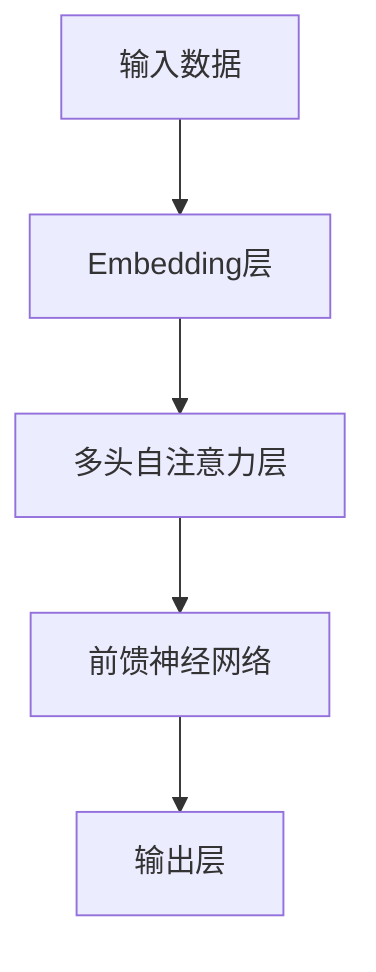
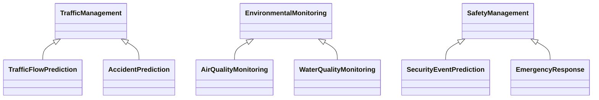
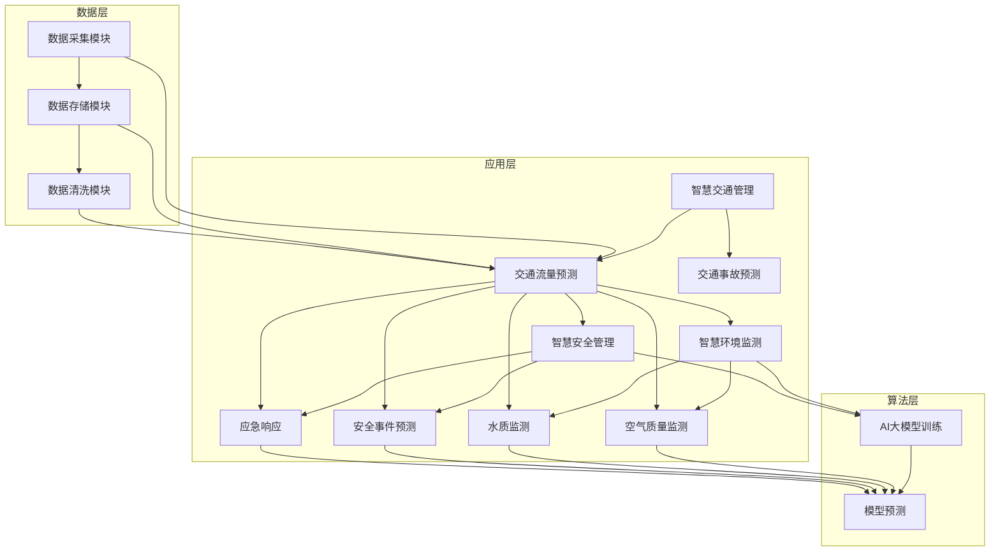

                 

# 智慧城市建设中的AI大模型应用

关键词：智慧城市、AI大模型、应用场景、技术优势、实践案例

摘要：智慧城市建设已成为现代城市发展的必然趋势，AI大模型作为人工智能领域的核心技术，正逐步深入到智慧城市的各个领域，为城市治理、服务、发展提供数据驱动的智能决策支持。本文将详细探讨AI大模型在智慧城市建设中的应用，分析其在不同领域的具体应用场景、技术优势以及实践案例，并对未来发展进行展望。

## 目录大纲设计

## 第1章: 智慧城市与AI大模型概述

### 1.1 智慧城市建设背景

#### 1.1.1 智慧城市的发展历程

#### 1.1.2 智慧城市的核心概念

#### 1.1.3 智慧城市建设的重要性

### 1.2 AI大模型的基础理论

#### 1.2.1 AI大模型的基本原理

#### 1.2.2 AI大模型的分类与应用

#### 1.2.3 AI大模型的技术挑战与未来发展趋势

### 1.3 智慧城市建设中的AI大模型应用

#### 1.3.1 AI大模型在智慧城市建设中的应用场景

#### 1.3.2 AI大模型在智慧城市中的技术优势

#### 1.3.3 AI大模型在智慧城市中的实践案例

## 第2章: AI大模型在智慧城市交通管理中的应用

### 2.1 智慧交通管理背景

#### 2.1.1 传统交通管理的挑战

#### 2.1.2 智慧交通管理的概念与目标

### 2.2 AI大模型在智慧交通管理中的应用

#### 2.2.1 交通流量预测

#### 2.2.2 交通事故预测与处理

#### 2.2.3 智慧停车管理

### 2.3 实践案例：基于AI大模型的智慧交通管理系统

## 第3章: AI大模型在智慧城市管理中的应用

### 3.1 智慧城市管理背景

#### 3.1.1 传统城市管理的挑战

#### 3.1.2 智慧城市管理的概念与目标

### 3.2 AI大模型在智慧城市管理中的应用

#### 3.2.1 智慧环境监测

#### 3.2.2 智慧公共服务

#### 3.2.3 智慧社区管理

### 3.3 实践案例：基于AI大模型的智慧城市管理系统

## 第4章: AI大模型在智慧城市建设中的数据管理

### 4.1 数据管理在智慧城市建设中的重要性

#### 4.1.1 数据管理的基本概念

#### 4.1.2 数据管理的技术架构

### 4.2 AI大模型在数据管理中的应用

#### 4.2.1 数据清洗与预处理

#### 4.2.2 数据挖掘与分析

#### 4.2.3 数据可视化

### 4.3 实践案例：基于AI大模型的数据管理系统

## 第5章: AI大模型在智慧城市安全与应急管理中的应用

### 5.1 智慧城市安全与应急管理背景

#### 5.1.1 传统安全与应急管理的挑战

#### 5.1.2 智慧城市安全与应急管理的概念与目标

### 5.2 AI大模型在智慧城市安全与应急管理中的应用

#### 5.2.1 安全事件预测与预警

#### 5.2.2 灾害应急响应与资源调度

#### 5.2.3 网络安全监控

### 5.3 实践案例：基于AI大模型的智慧城市安全与应急管理系统

## 第6章: AI大模型在智慧城市建设中的挑战与解决方案

### 6.1 AI大模型在智慧城市建设中的挑战

#### 6.1.1 数据隐私与安全问题

#### 6.1.2 AI大模型的解释性与可解释性问题

#### 6.1.3 AI大模型的计算资源需求

### 6.2 智慧城市建设的解决方案

#### 6.2.1 数据隐私保护技术

#### 6.2.2 AI大模型的解释性增强

#### 6.2.3 计算资源的优化与调度

## 第7章: 智慧城市建设中的AI大模型最佳实践与未来展望

### 7.1 智慧城市建设中的AI大模型最佳实践

#### 7.1.1 成功案例分享

#### 7.1.2 实践经验与教训

### 7.2 AI大模型在智慧城市建设中的未来展望

#### 7.2.1 技术发展趋势

#### 7.2.2 应用领域扩展

#### 7.2.3 智慧城市与AI大模型的融合创新

## 核心概念与联系

- **智慧城市**：综合运用信息技术、物联网、大数据、人工智能等现代科技手段，实现城市治理、服务、发展的智能化。
- **AI大模型**：具有极高参数量和计算复杂度的深度学习模型，可以处理大规模数据，进行复杂的模式识别和预测。
- **智慧城市建设与AI大模型的关系**：AI大模型是智慧城市技术体系的重要组成部分，能够为智慧城市提供数据驱动的智能决策支持。

## 算法原理讲解

AI大模型通常采用深度学习框架，如图神经网络（GNN）或Transformer等，这些模型具有高参数量和计算复杂度，能够处理大规模数据并进行复杂模式识别和预测。以下是AI大模型的基本原理：

1. **模型架构**：AI大模型通常采用多层神经网络结构，通过逐层学习数据的特征表示，从而实现高层次的抽象表示。例如，Transformer模型通过自注意力机制，可以捕捉数据之间的长距离依赖关系。

2. **训练过程**：AI大模型通过大量数据进行训练，使用反向传播算法更新模型的参数，使模型能够最小化预测误差。训练过程中，模型会自动学习数据的特征分布，并优化参数以实现更好的预测效果。

3. **预测过程**：训练完成的AI大模型可以用于对新数据进行预测。在预测过程中，模型会将新数据输入到训练好的网络中，通过计算输出层的结果，实现对目标变量的预测。

4. **评估指标**：AI大模型的性能评估通常使用多种指标，如准确率、召回率、F1值等。这些指标可以帮助评估模型的预测效果，并指导模型的调整和优化。

以下是一个简单的Transformer模型的自注意力机制流程图：



在实际应用中，AI大模型需要进行大量的预处理和后处理操作，如数据清洗、特征工程、模型调参等，以确保模型的高效运行和准确预测。

## 核心概念与联系

为了更好地理解AI大模型在智慧城市建设中的应用，我们首先需要明确一些核心概念及其相互联系。

### 智慧城市

**定义**：智慧城市是指利用信息技术、物联网、大数据、人工智能等现代科技手段，实现城市治理、服务、发展的智能化。

**核心概念**：

- **物联网（IoT）**：通过传感器、设备等采集城市环境中的各种数据，实现信息的互联互通。
- **大数据**：通过对海量数据的存储、处理、分析，为城市管理和决策提供数据支持。
- **人工智能**：利用算法和模型，对数据进行分析和预测，实现智能决策。

### AI大模型

**定义**：AI大模型是指具有极高参数量和计算复杂度的深度学习模型，能够处理大规模数据并进行复杂模式识别和预测。

**核心概念**：

- **深度学习**：一种基于多层神经网络的学习方法，通过逐层提取数据的特征表示，实现高层次的抽象表示。
- **神经网络**：由大量神经元组成的计算模型，通过学习数据间的关联性，实现对数据的分类、回归等操作。
- **自注意力机制**：一种在神经网络中用于捕捉数据间长距离依赖关系的方法，通过计算输入数据之间的相关性，实现对输入数据的加权处理。

### 智慧城市建设与AI大模型的关系

- **数据驱动**：智慧城市建设依赖于海量数据，AI大模型通过深度学习和自注意力机制等方法，可以从数据中提取有价值的信息，为城市治理、服务、发展提供数据驱动的智能决策支持。
- **智能优化**：AI大模型可以优化城市资源的配置和管理，如交通流量预测、环境监测、能源管理等，提高城市运行的效率和可持续性。
- **创新应用**：AI大模型在智慧城市建设中可以推动各种新兴技术的应用，如无人驾驶、智慧安防、智慧医疗等，为城市居民提供更便捷、安全、高效的生活服务。

## 系统分析与架构设计方案

### 问题场景介绍

随着城市化进程的加快，城市交通、环境、安全等问题日益突出，传统的城市管理方法已经难以满足现代城市的发展需求。为了提高城市运行效率和居民生活质量，智慧城市建设成为必然趋势。AI大模型作为人工智能领域的核心技术，可以深入到智慧城市的各个领域，为城市治理、服务、发展提供数据驱动的智能决策支持。

### 项目介绍

本项目旨在基于AI大模型，构建一套智慧城市管理系统，实现对城市交通、环境、安全等领域的智能监控和预测。系统功能包括：

1. **智慧交通管理**：通过AI大模型对交通流量进行预测和优化，减少交通拥堵，提高交通运行效率。
2. **智慧环境监测**：利用AI大模型对空气质量、水质等进行实时监测和预测，保障城市环境安全。
3. **智慧安全管理**：通过AI大模型对安全事件进行预测和预警，提高城市安全水平。

### 系统功能设计（领域模型）



### 系统架构设计



### 系统接口设计和系统交互

```mermaid
sequenceDiagram
    participant 用户 as 用户
    participant 系统A as 智慧交通管理
    participant 系统B as 智慧环境监测
    participant 系统C as 智慧安全管理

    用户->>系统A: 提交交通数据
    系统

