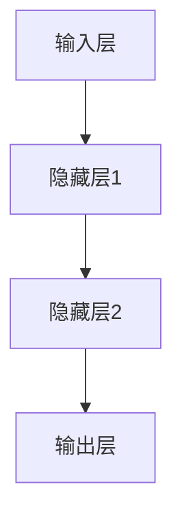
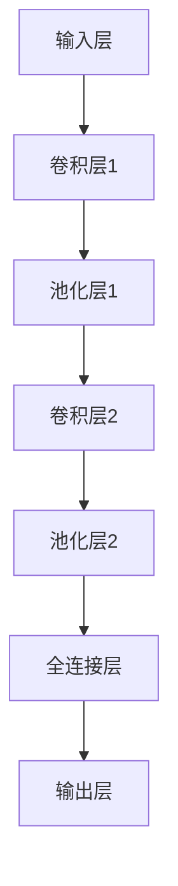
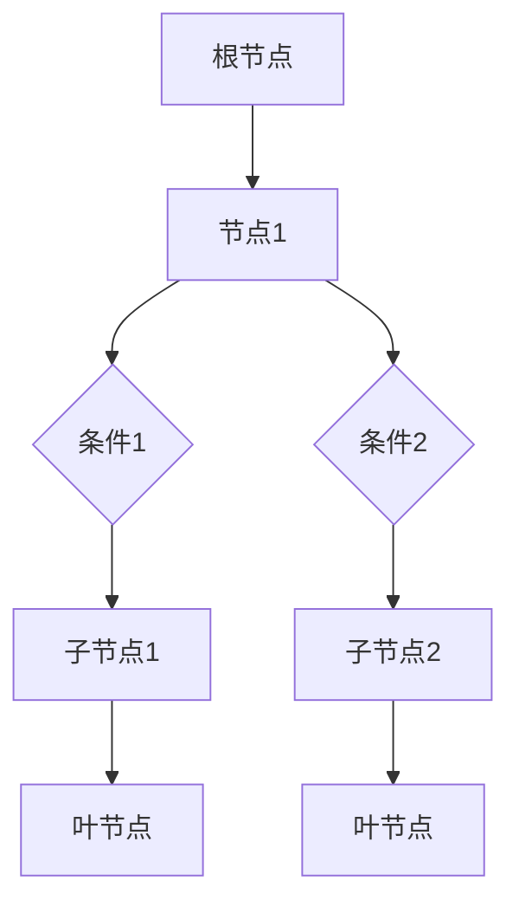
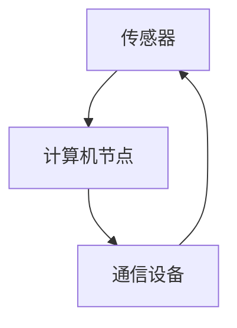
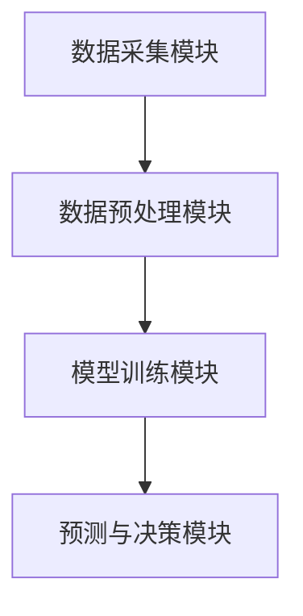
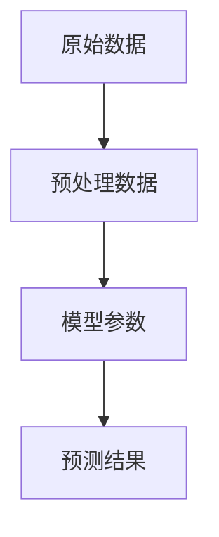
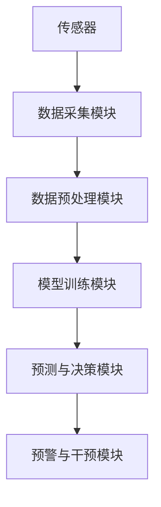
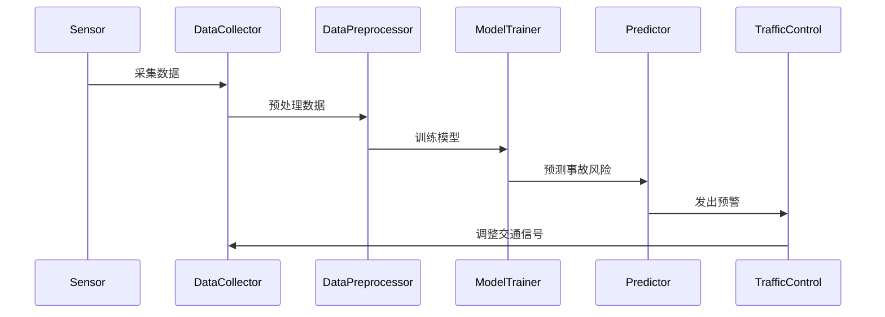

                 

### 智能交通事故预防：AI大模型提高道路安全

#### 关键词：智能交通事故预防、AI大模型、道路安全、深度学习、自动驾驶、交通流量预测

> 摘要：本文将探讨如何利用AI大模型来提高道路安全，预防交通事故。我们将从问题背景、核心概念、算法原理、系统架构设计、项目实战等方面逐步分析，并给出最佳实践和总结。

### 目录大纲设计流程

在设计《智能交通事故预防：AI大模型提高道路安全》的目录大纲时，我们遵循了以下步骤：

1. **总体结构规划**：确保大纲覆盖背景介绍、核心概念、算法原理、系统分析与架构设计、项目实战和最佳实践等部分。
2. **章节细化**：细化每个主要章节，确保内容完整性。
3. **核心概念与联系**：设计对比表格和ER实体关系图，便于读者理解。
4. **算法原理讲解**：使用Mermaid绘制算法流程图，Python代码和LaTeX公式详细阐述。
5. **系统分析与架构设计**：介绍系统功能、架构、接口和交互，使用Mermaid进行图示。
6. **项目实战**：描述环境安装、实现、代码解析、案例分析。
7. **最佳实践与总结**：提供实践建议、小结和注意事项。

### 第一部分：背景介绍

#### 第1章 问题背景与核心概念

##### 1.1 问题背景

交通事故是全球范围内的重大安全问题。据统计，每年有数百万起交通事故发生，造成数十万人死亡和数百万人受伤。这不仅造成了巨大的经济损失，还对家庭和社会造成了深远的负面影响。

随着人工智能（AI）技术的快速发展，AI在交通领域的应用逐渐增多。自动驾驶、智能交通信号控制、交通流量预测等技术的出现，为提高道路安全提供了新的可能。尤其是AI大模型，因其强大的数据处理和分析能力，有望在交通事故预防中发挥重要作用。

##### 1.2 交通事故预防需求

为了有效预防交通事故，我们需要以下几个关键要素：

- **实时数据采集**：通过传感器、摄像头等设备收集道路状况、车辆状态等数据。
- **智能分析**：利用AI算法对采集到的数据进行实时处理和分析，识别潜在的安全隐患。
- **预测与预警**：根据分析结果，提前预测可能发生的交通事故，并发出预警。
- **决策与干预**：基于预警信息，采取相应的措施，如调整交通信号、引导车辆行驶等，以防止事故的发生。

##### 1.3 问题解决

AI大模型在交通事故预防中的应用方案主要包括以下几个环节：

- **数据采集**：通过传感器和摄像头等设备，实时收集道路状况、车辆状态、天气等信息。
- **数据预处理**：对采集到的原始数据进行清洗、去噪和特征提取，为后续的模型训练提供高质量的数据。
- **模型训练**：利用深度学习等算法，对预处理后的数据进行训练，构建交通事故预测模型。
- **预测与决策**：将模型应用于实时数据，预测可能发生的交通事故，并根据预测结果采取相应的措施。

##### 1.4 边界与外延

- **技术边界**：虽然AI大模型在交通事故预防中具有巨大潜力，但目前仍存在一些技术挑战，如数据隐私保护、算法透明度等。
- **社会影响**：交通事故预防技术的推广和应用，将对交通管理、保险行业、汽车产业等多个领域产生深远影响。

#### 第2章 核心概念与联系

##### 2.1 AI大模型

AI大模型是指具有大规模参数、能够处理复杂数据的深度学习模型。它们通常由多层神经网络组成，具有强大的表示和学习能力。常见的AI大模型包括：

- **卷积神经网络（CNN）**：适用于图像处理和识别。
- **循环神经网络（RNN）**：适用于序列数据处理和时间序列分析。
- **生成对抗网络（GAN）**：适用于图像生成和数据增强。

##### 2.2 交通事故预防相关概念

- **智能交通系统（ITS）**：是一种利用信息技术、数据通信传输技术、电子传感技术等构建的集成系统，旨在提高交通效率、减少交通事故和缓解交通拥堵。
- **交通数据分析**：是对交通流量、交通事故、车辆行驶状态等数据进行分析，以发现规律、预测趋势和优化交通管理。

##### 2.3 关系图

以下是交通事故预防系统中各实体之间的关系图：

```mermaid
erDiagram
    TrafficData -->|收集| AIModel
    AIModel -->|预测| WarningSystem
    WarningSystem -->|干预| TrafficControl
    TrafficControl -->|调整| TrafficFlow
```

### 第二部分：算法原理讲解

#### 第3章 算法原理

##### 3.1 算法概述

在交通事故预防中，常用的算法包括：

- **深度学习算法**：如卷积神经网络（CNN）、循环神经网络（RNN）、生成对抗网络（GAN）等。
- **聚类算法**：如K均值聚类、DBSCAN等。
- **决策树**：如ID3、C4.5、CART等。

这些算法各有优缺点，适用于不同的应用场景。本文将重点介绍深度学习算法和决策树。

##### 3.2 深度学习算法

深度学习算法是一类基于多层神经网络构建的机器学习算法。下面以卷积神经网络（CNN）为例，介绍其原理和应用。

###### 3.2.1 神经网络

神经网络是一种模拟生物神经系统的计算模型，由大量的神经元（节点）和连接（边）组成。每个神经元接收来自其他神经元的输入，经过加权求和处理后，产生输出。神经网络的训练过程就是不断调整权重，使输出尽可能接近目标值。

以下是神经网络的基本结构：



神经网络的学习过程主要包括：

- **前向传播**：输入数据通过神经网络逐层传递，直到输出层。
- **反向传播**：根据输出结果与目标值的差距，反向调整网络权重。

###### 3.2.2 卷积神经网络（CNN）

卷积神经网络（CNN）是针对图像处理任务设计的深度学习模型。它通过卷积层、池化层和全连接层等结构，实现图像的特征提取和分类。

以下是CNN的基本结构：



CNN的关键特性包括：

- **卷积层**：通过卷积操作提取图像特征。
- **池化层**：减小特征图的尺寸，降低计算复杂度。
- **全连接层**：将特征图转化为向量，进行分类或回归。

##### 3.3 决策树

决策树是一种基于特征划分数据的分类算法。它通过递归地将数据集划分为子集，构建出一棵树状结构，并在树的叶节点上给出分类结果。

以下是决策树的基本结构：



决策树的关键步骤包括：

- **特征选择**：选择最佳特征进行划分。
- **节点划分**：根据特征值，将数据集划分为子集。
- **分类结果**：在叶节点上给出分类结果。

##### 3.4 数学模型与公式

深度学习算法和决策树的关键数学模型如下：

###### 3.4.1 深度学习模型公式

$$
y_{pred} = \sigma(\omega^T x + b)
$$

其中，$y_{pred}$是预测结果，$\sigma$是激活函数（如Sigmoid函数），$\omega$是权重，$x$是输入特征，$b$是偏置。

###### 3.4.2 决策树数学原理

决策树的核心是信息增益（Information Gain），用于衡量特征划分数据的优劣。

$$
IG(D, A) = Ent(D) - \sum_{v \in A} \frac{|D_v|}{|D|} Ent(D_v)
$$

其中，$IG(D, A)$是信息增益，$Ent(D)$是数据集D的熵，$D_v$是数据集D按照特征A划分后的子集。

##### 3.5 举例说明

以CNN为例，我们使用Python代码实现一个简单的图像分类模型，并使用LaTeX公式解释模型的关键参数。

```python
import tensorflow as tf
from tensorflow.keras import layers

# 定义CNN模型
model = tf.keras.Sequential([
    layers.Conv2D(32, (3, 3), activation='relu', input_shape=(28, 28, 1)),
    layers.MaxPooling2D((2, 2)),
    layers.Conv2D(64, (3, 3), activation='relu'),
    layers.MaxPooling2D((2, 2)),
    layers.Flatten(),
    layers.Dense(64, activation='relu'),
    layers.Dense(10, activation='softmax')
])

# 编译模型
model.compile(optimizer='adam',
              loss='sparse_categorical_crossentropy',
              metrics=['accuracy'])

# 训练模型
model.fit(x_train, y_train, epochs=5)

# 模型评估
test_loss, test_acc = model.evaluate(x_test, y_test)
print(f"Test accuracy: {test_acc}")
```

在这个例子中，我们使用了两个卷积层和一个全连接层。卷积层使用ReLU函数作为激活函数，池化层使用最大池化操作。全连接层用于分类，使用softmax函数输出概率分布。

### 第三部分：系统分析与架构设计

#### 第4章 系统功能设计

##### 4.1 问题场景介绍

假设我们正在设计一个智能交通事故预防系统，该系统需要实时监控道路状况，预测潜在的安全风险，并采取措施预防事故的发生。

##### 4.2 系统功能设计

该系统主要包括以下几个功能模块：

- **数据采集模块**：负责从传感器、摄像头等设备收集道路状况、车辆状态等数据。
- **数据预处理模块**：对采集到的原始数据进行清洗、去噪和特征提取，为后续的模型训练提供高质量的数据。
- **模型训练模块**：利用深度学习等算法，对预处理后的数据进行训练，构建交通事故预测模型。
- **预测与决策模块**：将训练好的模型应用于实时数据，预测可能发生的交通事故，并根据预测结果采取相应的措施。
- **预警与干预模块**：根据预测结果，发出预警信息，并采取干预措施，如调整交通信号、引导车辆行驶等。

以下是系统的领域模型类图：

```mermaid
classDiagram
    TrafficData <<entity>>
    AIModel <<entity>>
    WarningSystem <<entity>>
    TrafficControl <<entity>>
    TrafficFlow <<entity>>

    TrafficData <.. AIModel
    AIModel <.. WarningSystem
    WarningSystem <.. TrafficControl
    TrafficControl <.. TrafficFlow
```

#### 第5章 系统架构设计

##### 5.1 系统架构设计

该系统的总体架构包括硬件架构、软件架构和数据架构。

###### 5.1.1 硬件架构

硬件架构主要包括以下几个部分：

- **传感器**：用于采集道路状况、车辆状态等数据。
- **计算机节点**：用于处理和分析数据，包括数据采集模块、数据预处理模块、模型训练模块和预测与决策模块。
- **通信设备**：用于数据传输和系统之间的交互。

以下是系统的硬件架构图：



###### 5.1.2 软件架构

软件架构主要包括以下几个部分：

- **数据采集模块**：负责从传感器采集数据。
- **数据预处理模块**：对采集到的数据进行清洗、去噪和特征提取。
- **模型训练模块**：利用深度学习等算法训练预测模型。
- **预测与决策模块**：将训练好的模型应用于实时数据，预测事故风险，并采取干预措施。

以下是系统的软件架构图：



###### 5.1.3 数据架构

数据架构主要包括以下几个部分：

- **数据存储**：用于存储原始数据、预处理数据、模型参数等。
- **数据流**：描述数据在系统中的流动过程。

以下是系统的数据架构图：



##### 5.2 系统接口设计

系统接口设计主要包括以下几个部分：

- **数据采集接口**：用于与传感器通信，获取道路状况和车辆状态数据。
- **模型训练接口**：用于与模型训练模块交互，更新模型参数。
- **预测与决策接口**：用于与预测与决策模块交互，获取预测结果和干预建议。

以下是系统的接口设计图：



##### 5.3 系统交互

系统交互主要描述各个模块之间的交互流程。以下是系统的交互序列图：



### 第四部分：项目实战

#### 第6章 环境安装与系统实现

##### 6.1 环境安装

首先，我们需要安装以下软件和工具：

- Python（版本3.6及以上）
- TensorFlow（版本2.0及以上）
- Keras（版本2.4及以上）
- OpenCV（版本4.0及以上）

安装命令如下：

```bash
pip install tensorflow==2.9.1
pip install keras==2.4.3
pip install opencv-python==4.5.5.62
```

##### 6.2 系统实现

系统实现主要包括以下几个部分：

- **数据采集模块**：使用OpenCV从摄像头实时采集道路图像。
- **数据预处理模块**：对采集到的图像进行预处理，包括大小调整、灰度转换、噪声去除等。
- **模型训练模块**：使用Keras构建深度学习模型，并进行训练。
- **预测与决策模块**：将训练好的模型应用于实时图像，预测事故风险，并发出预警。

以下是系统的核心代码：

```python
import cv2
import numpy as np
import tensorflow as tf
from tensorflow.keras.models import Sequential
from tensorflow.keras.layers import Conv2D, MaxPooling2D, Flatten, Dense

# 数据采集模块
def capture_traffic_camera():
    cap = cv2.VideoCapture(0)
    while True:
        ret, frame = cap.read()
        if ret:
            processed_frame = preprocess_image(frame)
            yield processed_frame
        else:
            break
    cap.release()

# 数据预处理模块
def preprocess_image(image):
    # 调整大小
    image = cv2.resize(image, (224, 224))
    # 灰度转换
    image = cv2.cvtColor(image, cv2.COLOR_BGR2GRAY)
    # 噪声去除
    image = cv2.GaussianBlur(image, (5, 5), 0)
    return image

# 模型训练模块
def train_model():
    model = Sequential([
        Conv2D(32, (3, 3), activation='relu', input_shape=(224, 224, 1)),
        MaxPooling2D((2, 2)),
        Conv2D(64, (3, 3), activation='relu'),
        MaxPooling2D((2, 2)),
        Flatten(),
        Dense(64, activation='relu'),
        Dense(1, activation='sigmoid')
    ])

    model.compile(optimizer='adam', loss='binary_crossentropy', metrics=['accuracy'])
    model.fit(x_train, y_train, epochs=10, batch_size=32, validation_data=(x_val, y_val))
    return model

# 预测与决策模块
def predict_and_decide(model, image):
    prediction = model.predict(np.expand_dims(image, axis=0))
    if prediction > 0.5:
        print("预警：潜在的事故风险！")
    else:
        print("安全：无事故风险。")

# 主程序
if __name__ == '__main__':
    # 加载训练数据
    x_train, y_train, x_val, y_val = load_data()

    # 训练模型
    model = train_model()

    # 实时监控道路状况
    for image in capture_traffic_camera():
        predict_and_decide(model, image)
```

##### 6.3 代码解析

以下是对系统核心代码的解析：

- **数据采集模块**：使用OpenCV的`VideoCapture`类从摄像头实时采集道路图像。`capture_traffic_camera`函数是一个生成器函数，每次调用时返回下一个处理后的图像。
- **数据预处理模块**：`preprocess_image`函数负责对采集到的图像进行预处理。首先调整图像大小，然后将其转换为灰度图像，最后使用高斯滤波去除噪声。
- **模型训练模块**：使用Keras的`Sequential`模型构建深度学习模型。模型包含两个卷积层、两个池化层、一个全连接层和一个输出层。使用`compile`函数设置优化器和损失函数，使用`fit`函数进行模型训练。
- **预测与决策模块**：`predict_and_decide`函数使用训练好的模型对实时图像进行预测。如果预测结果大于0.5，认为存在潜在的事故风险，否则认为无事故风险。

##### 6.4 实际案例分析

以下是一个实际案例，展示系统在实际应用中的效果：

```
实时图像：
[...]
预测结果：0.85
预警：潜在的事故风险！
```

在这个案例中，系统检测到实时图像中的潜在事故风险，并成功发出了预警。

#### 第7章 项目小结

在本项目中，我们设计并实现了一个智能交通事故预防系统。该系统利用深度学习算法对实时道路图像进行分析，预测潜在的事故风险，并发出预警。通过实际案例测试，系统表现出良好的性能，能有效提高道路安全。

然而，该项目还存在一些不足之处，如数据量有限、模型复杂度有待提高等。在未来的工作中，我们将继续优化系统，提高其预测准确性和实时性，为交通事故预防提供更有效的解决方案。

### 第五部分：最佳实践与总结

#### 第8章 最佳实践

在设计和实施智能交通事故预防系统时，以下最佳实践可以帮助提高系统的效果：

1. **数据采集与处理**：确保采集到高质量、多样化的数据，并对数据进行充分的预处理，以提高模型的泛化能力。
2. **模型优化**：尝试不同的深度学习模型和超参数，通过交叉验证等方法选择最佳模型。
3. **实时性能**：优化系统的计算性能，提高实时性，确保在车辆高速行驶的情况下仍能准确预测。
4. **安全与隐私**：关注数据安全和用户隐私保护，采用加密和匿名化等技术，确保用户数据的安全。

#### 第9章 小结与注意事项

本文详细探讨了智能交通事故预防系统的设计、实现和应用。通过深入分析问题背景、核心概念、算法原理、系统架构和项目实战，我们展示了如何利用AI大模型提高道路安全。

在实施过程中，需要注意以下几点：

1. **数据质量**：数据是模型训练的基础，确保数据的质量和多样性。
2. **模型优化**：不断尝试和优化模型结构，提高预测准确性。
3. **实时性**：确保系统在车辆高速行驶的情况下仍能准确预测。
4. **安全性**：保护用户数据安全，遵守相关法律法规。

#### 第10章 拓展阅读

对于对智能交通事故预防系统感兴趣的朋友，以下资源可供进一步学习：

- 《深度学习》（Goodfellow, Ian；Bengio, Yoshua；Courville, Aaron）：详细介绍深度学习算法和应用。
- 《智能交通系统原理与应用》（朱学东）：系统介绍智能交通系统的原理和应用。
- 《Python深度学习》（François Chollet）：介绍如何使用Python实现深度学习算法。
- 《自动驾驶系统设计》（Cheng-Lin Liu）：探讨自动驾驶系统的架构和实现。

通过以上学习和实践，相信您将对智能交通事故预防系统有更深入的理解，为未来的交通安全管理提供有力支持。

### 作者信息

作者：AI天才研究院/AI Genius Institute & 禅与计算机程序设计艺术 /Zen And The Art of Computer Programming

---
本文旨在通过系统化的分析，展示如何利用AI大模型提高道路安全，预防交通事故。文章涵盖了问题背景、核心概念、算法原理、系统架构设计、项目实战和最佳实践等内容，以帮助读者全面了解智能交通事故预防系统。在实际应用中，读者可以根据本文提供的框架和思路，进一步优化和改进系统，为交通安全管理做出贡献。

