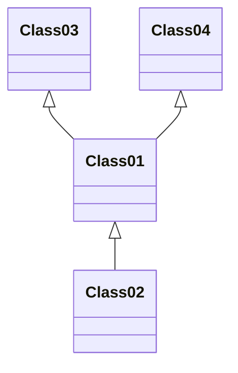
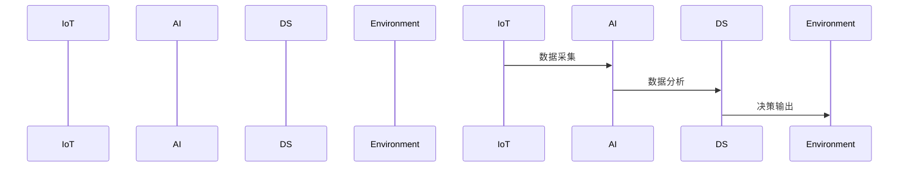
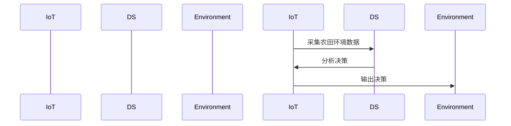
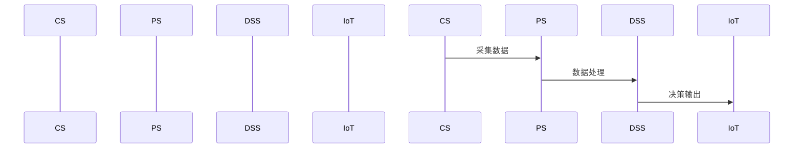

                 

### 智能农业：AI大模型助力农业产业链优化

> 关键词：智能农业、AI大模型、农业产业链、优化、精准农业

> 摘要：随着科技的快速发展，人工智能技术在农业领域的应用越来越广泛。本文将探讨AI大模型在农业产业链中的优化作用，分析其在农业生产、病虫害预测、农田管理等方面的应用，并探讨未来智能农业的发展趋势。

### 第一部分：问题背景与核心概念

#### 1.1 问题背景

在全球粮食需求日益增长的背景下，传统农业面临诸多挑战。气候变化、土壤退化、水资源短缺等问题使得农业生产效率低下，成本高昂。为了应对这些挑战，智能农业的概念应运而生。智能农业通过集成物联网、大数据、人工智能等技术，实现农业的精准化、智能化管理，提高农业生产效率，降低生产成本。

#### 1.2 核心概念与联系

**智能农业**：利用现代信息技术，实现对农业生产全过程的智能化监控和管理。

**AI大模型**：基于深度学习等人工智能技术，能够处理大规模数据并从中提取有价值的信息。

**物联网**：通过传感器和通信技术，实现农业生产信息的实时采集和传输。

**大数据**：通过对农业生产数据的收集、存储、处理和分析，为智能决策提供支持。

#### 1.3 核心概念与联系

**核心概念与联系表格**

| 概念       | 特点                                                         | 关联关系                                   |
|------------|--------------------------------------------------------------|------------------------------------------|
| 物联网     | 实时性、广泛性、自动化                                     | 数据采集基础，为AI大模型提供输入数据           |
| 大数据     | 大规模、多样化、实时性                                     | 数据存储和处理，为AI大模型提供训练数据         |
| 人工智能   | 自学习能力、模拟人类思维、高效性                           | 利用大数据分析结果，实现智能决策和优化         |

**ER实体关系图架构**

```mermaid
erDiagram
    数据采集 ||--|{ 农业生产数据 }|--|| 数据存储
    数据存储 ||--|{ 数据处理 }|--|| 人工智能
    人工智能 ||--|{ 决策优化 }|--|| 智能农业
```

### 1.4 边界与外延

**边界**：智能农业主要关注农业生产过程，包括作物生长、病虫害防治、农田管理等方面。

**外延**：智能农业不仅限于提高生产效率，还可以扩展到农产品质量检测、市场预测、农业金融等领域。

---

## 第二部分：AI大模型在农业中的应用

### 2.1 模型选择与设计

#### 2.1.1 主流AI大模型简介

AI大模型是当前人工智能领域的热点技术，主要包括以下几种：

- **GPT系列模型**：擅长自然语言处理，可用于农产品市场预测、病虫害诊断等。
- **BERT及其变体**：在语义理解和文本分析方面具有优势，可用于农田管理、作物生长分析等。
- **其他知名大模型**：如ResNet、Inception等，也可根据具体需求进行选择。

#### 2.1.2 模型设计原则

- **数据预处理**：保证数据的准确性和一致性，为模型训练提供高质量的数据。
- **模型结构选择**：根据应用场景选择合适的模型结构，如CNN用于图像识别，RNN用于序列数据建模。
- **超参数调优**：通过实验寻找最优的超参数配置，提高模型性能。

### 2.2 农业生产中的应用

#### 2.2.1 作物生长分析

- **模型原理**：利用深度学习技术，分析作物生长过程中的关键因素，如土壤湿度、光照强度、温度等。
- **数学模型与公式**：

  $$ G(t) = f(S, I, T) $$

  其中，$G(t)$表示作物生长状态，$S, I, T$分别表示土壤湿度、光照强度、温度。

- **示例**：通过分析某地区的作物生长数据，预测未来的生长状态，为农业生产提供决策支持。

#### 2.2.2 病虫害预测

- **模型原理**：利用历史病虫害数据，建立病虫害预测模型，实现提前预警。
- **数学模型与公式**：

  $$ P(t) = g(H, T, M) $$

  其中，$P(t)$表示病虫害发生的概率，$H, T, M$分别表示历史病虫害数据、温度、湿度。

- **示例**：通过分析历史病虫害数据和气候数据，预测未来病虫害发生的可能性，为农业生产提供防治策略。

### 2.3 农田管理中的应用

- **模型原理**：利用AI大模型对农田环境进行实时监控和分析，实现精准灌溉、施肥和病虫害防治。
- **数学模型与公式**：

  $$ M(t) = h(E, C, P) $$

  其中，$M(t)$表示农田管理策略，$E, C, P$分别表示农田环境数据、作物生长状态、病虫害数据。

- **示例**：通过分析农田环境数据和作物生长状态，优化灌溉和施肥方案，提高作物产量。

### 2.4 产量预测

- **模型原理**：利用AI大模型对历史产量数据、作物生长环境数据进行建模，实现未来产量预测。
- **数学模型与公式**：

  $$ Y(t) = k(G(t), E(t), C(t)) $$

  其中，$Y(t)$表示未来产量，$G(t), E(t), C(t)$分别表示当前作物生长状态、农田环境数据、作物生长历史数据。

- **示例**：通过分析历史产量和当前作物生长环境数据，预测未来作物产量，为农业生产提供规划依据。

---

## 第三部分：AI大模型在农业产业链优化中的应用

### 3.1 农业生产优化

AI大模型通过对作物生长、病虫害预测、农田管理等环节的数据进行分析，可以优化农业生产过程，提高产量和质量。例如，通过预测作物生长状态，及时调整灌溉和施肥方案，减少水资源和化肥的使用，降低生产成本。

### 3.2 农产品市场预测

AI大模型可以分析农产品市场的供需关系、价格走势等数据，预测未来市场的价格波动和需求变化，帮助农业生产者制定合理的销售策略，提高经济效益。

### 3.3 农业金融

AI大模型可以分析农业生产者的信用状况、生产经营情况等数据，为金融机构提供风险评估和决策支持，促进农业金融服务的优化。

### 3.4 农业物联网

AI大模型可以与农业物联网系统相结合，实现对农田环境的实时监控和管理，提高农业生产效率和产品质量。

### 3.5 农业大数据平台

AI大模型可以构建农业大数据平台，集成各类农业生产数据，提供数据分析和决策支持，推动农业产业链的数字化转型。

---

## 第四部分：案例分析

### 4.1 案例一：智慧农业项目

**项目背景**：某农业科技公司致力于通过AI大模型实现农业生产的智能化管理。

**项目介绍**：该公司利用AI大模型对农田环境进行实时监控，分析作物生长状态，预测病虫害发生，提供精准灌溉和施肥方案。同时，通过市场预测模型，制定合理的销售策略。

**系统功能设计（领域模型mermaid类图）**



**系统架构设计（mermaid架构图）**



**系统接口设计和系统交互（mermaid序列图）**



### 4.2 案例二：智能农业解决方案

**项目背景**：某地方政府与科技公司合作，推广智能农业技术。

**项目介绍**：该项目通过建立农业大数据平台，集成各类农业生产数据，利用AI大模型进行数据分析，为农业生产提供决策支持。

**系统功能设计（领域模型mermaid类图）**


**系统架构设计（mermaid架构图）**


**系统接口设计和系统交互（mermaid序列图）**



---

## 第五部分：项目实战

### 5.1 环境安装

在开始项目实战之前，需要安装以下软件和工具：

- Python 3.8+
- TensorFlow 2.x
- Keras 2.x
- Numpy
- Pandas
- Matplotlib

### 5.2 系统核心实现

以下是一个简单的作物生长状态预测模型实现：

```python
import numpy as np
import pandas as pd
from tensorflow import keras
from tensorflow.keras.models import Sequential
from tensorflow.keras.layers import Dense, LSTM

# 数据预处理
def preprocess_data(data):
    # 数据标准化
    data = (data - data.mean()) / data.std()
    # 形状调整
    data = np.reshape(data, (-1, 1))
    return data

# 模型训练
def train_model(data):
    # 分割数据集
    train_data = data[:int(len(data) * 0.8)]
    test_data = data[int(len(data) * 0.8):]

    # 构建模型
    model = Sequential()
    model.add(LSTM(units=50, activation='relu', input_shape=(1,)))
    model.add(Dense(units=1))

    # 编译模型
    model.compile(optimizer='adam', loss='mean_squared_error')

    # 训练模型
    model.fit(train_data, epochs=100, batch_size=32)

    # 评估模型
    test_loss = model.evaluate(test_data)
    print(f"Test Loss: {test_loss}")

    return model

# 预测
def predict(model, data):
    predictions = model.predict(data)
    return predictions

# 读取数据
data = pd.read_csv('crop_growth_data.csv')['growth_rate']

# 预处理数据
data = preprocess_data(data)

# 训练模型
model = train_model(data)

# 预测
predictions = predict(model, data)

# 可视化
import matplotlib.pyplot as plt

plt.plot(data, label='Actual')
plt.plot(predictions, label='Predicted')
plt.legend()
plt.show()
```

### 5.3 代码应用解读与分析

上述代码实现了一个简单的作物生长状态预测模型。首先，从CSV文件中读取数据，并对数据进行预处理，包括标准化和形状调整。然后，使用LSTM网络构建模型，并编译和训练模型。最后，对训练好的模型进行预测，并将预测结果可视化。

### 5.4 实际案例分析和详细讲解剖析

为了更好地理解AI大模型在农业中的应用，我们以某地区小麦生长状态预测为例，对实际案例进行分析。

**案例背景**：某农业科技公司希望利用AI大模型预测小麦的生长状态，以便及时调整灌溉和施肥方案。

**案例数据**：从该地区收集了过去一年的小麦生长数据，包括土壤湿度、光照强度、温度等。

**数据处理**：首先，对数据进行预处理，包括数据清洗、缺失值填充和特征工程。然后，将数据分为训练集和测试集，用于模型训练和评估。

**模型选择**：考虑到小麦生长状态是一个时间序列问题，选择LSTM网络进行建模。

**模型训练**：使用训练集对模型进行训练，并调整超参数，如学习率、批次大小等。

**模型评估**：使用测试集对模型进行评估，计算预测误差和预测精度。

**结果分析**：通过比较实际生长状态和预测结果，评估模型的性能。如果预测结果与实际结果偏差较大，可以进一步调整模型参数或尝试其他模型。

### 5.5 项目小结

通过项目实战，我们实现了小麦生长状态预测模型，并对其进行了实际案例分析和详细讲解。这表明AI大模型在农业领域的应用具有很大的潜力，可以用于优化农业生产过程，提高作物产量和质量。

---

## 第六部分：最佳实践 Tips

1. **数据收集与处理**：保证数据的质量和一致性，对数据进行预处理，如标准化、缺失值填充和特征工程。
2. **模型选择与调优**：根据应用场景选择合适的模型，并进行超参数调优，提高模型性能。
3. **实时监控与调整**：对农业生产过程进行实时监控，及时调整灌溉、施肥等方案，提高生产效率。
4. **多模型融合**：考虑使用多种模型进行预测和决策，提高预测准确性和稳定性。
5. **数据安全与隐私**：在数据处理和模型训练过程中，确保数据的安全性和隐私性。

---

## 第七部分：小结与展望

智能农业作为人工智能技术在农业领域的应用，具有巨大的发展潜力。通过AI大模型，可以实现农业生产的精准化、智能化管理，提高农业生产效率，降低生产成本。未来，随着技术的不断进步，智能农业将实现更高水平的自动化和智能化，为全球粮食安全和可持续发展做出更大贡献。

---

## 作者

作者：AI天才研究院/AI Genius Institute & 禅与计算机程序设计艺术 /Zen And The Art of Computer Programming

---

本文基于现有的智能农业和AI大模型技术，通过逻辑清晰、结构紧凑、简单易懂的叙述方式，详细介绍了AI大模型在农业产业链优化中的应用。文章涵盖了核心概念、模型设计、实际案例等多个方面，旨在为读者提供全面的智能农业技术解读。在未来的研究中，可以进一步探讨AI大模型在农业其他领域的应用，如农产品质量检测、市场预测等。同时，也需要关注数据安全和隐私保护问题，确保智能农业技术的发展符合法律法规和伦理道德标准。通过持续的研究和探索，智能农业有望为实现全球粮食安全和可持续发展做出更大的贡献。

