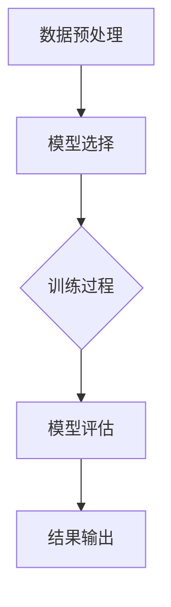
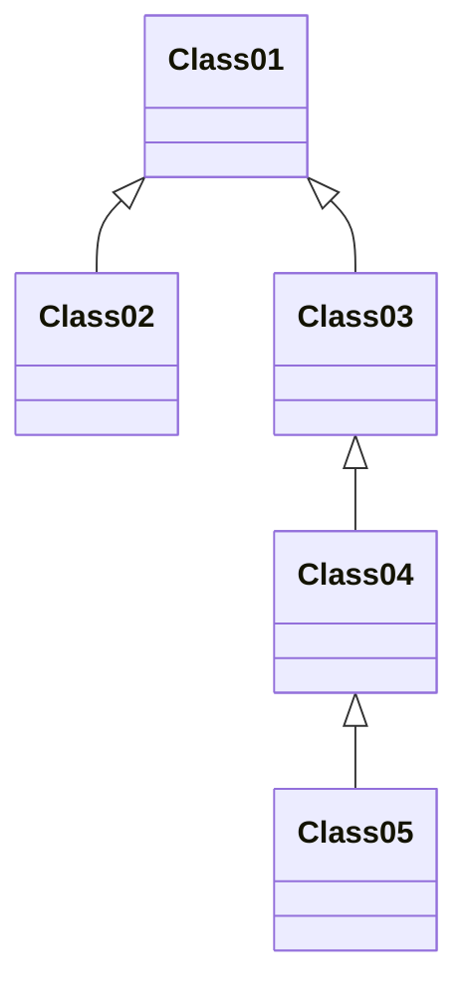
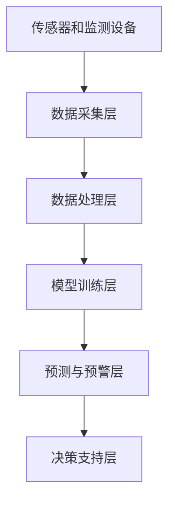
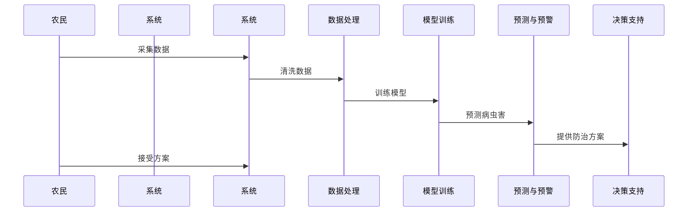

                 

### 智能农业病虫害预测：AI大模型保障粮食安全

> 关键词：智能农业、病虫害预测、AI大模型、粮食安全、数据收集与处理

> 摘要：本文深入探讨了智能农业病虫害预测的技术和实践。通过分析AI大模型在农业中的应用，我们介绍了病虫害预测的核心概念、算法原理以及系统架构设计。文章通过项目实战，展示了智能农业病虫害预测系统的实际应用和效果，为保障粮食安全提供了技术支持。

---

## 目录大纲设计思路

为了设计一个详尽且逻辑清晰的目录大纲，我们将按照以下步骤进行：

1. **背景介绍**：为读者提供智能农业病虫害预测的背景信息，包括问题背景、问题描述、问题解决、边界与外延等。
2. **核心概念与联系**：介绍智能农业病虫害预测中的核心概念，如AI大模型、数据收集与处理、病虫害识别与预测等。提供概念属性特征对比表格和ER实体关系图。
3. **算法原理讲解**：详细讲解病虫害预测算法的基本原理，包括数据预处理、模型选择、训练过程、评估指标等，并使用mermaid流程图和Python代码进行辅助说明。
4. **数学模型和数学公式**：介绍病虫害预测算法的数学模型和公式，使用LaTeX格式进行表示，并进行详细讲解和举例说明。
5. **系统分析与架构设计方案**：介绍智能农业病虫害预测系统的整体架构，包括问题场景介绍、系统功能设计、系统架构设计、系统接口设计和系统交互等。
6. **项目实战**：提供实际项目案例，包括环境安装、系统核心实现源代码，代码应用解读与分析，实际案例分析和详细讲解剖析。
7. **最佳实践 tips、小结、注意事项、拓展阅读**：总结项目经验和知识点，给出最佳实践建议，提醒注意事项，并推荐拓展阅读材料。

## 目录大纲结构

### 第1章：智能农业病虫害预测背景与问题分析

- **1.1 智能农业概述**
- **1.2 病虫害问题的背景与挑战**
- **1.3 病虫害预测的重要性**
- **1.4 病虫害预测的边界与外延**

### 第2章：核心概念与联系

- **2.1 AI大模型概述**
- **2.2 数据收集与处理**
- **2.3 病虫害识别与预测**
- **2.4 概念属性特征对比表格**
- **2.5 ER实体关系图**

### 第3章：算法原理讲解

- **3.1 数据预处理**
- **3.2 模型选择**
- **3.3 训练过程**
- **3.4 评估指标**
- **3.5 算法mermaid流程图**
- **3.6 Python代码讲解**
- **3.7 数学模型和公式讲解**
- **3.8 算法举例说明**

### 第4章：系统分析与架构设计方案

- **4.1 问题场景介绍**
- **4.2 系统功能设计**
- **4.3 系统架构设计**
- **4.4 系统接口设计**
- **4.5 系统交互**
- **4.6 mermaid类图**
- **4.7 mermaid架构图**
- **4.8 mermaid序列图**

### 第5章：项目实战

- **5.1 环境安装**
- **5.2 系统核心实现源代码**
- **5.3 代码应用解读与分析**
- **5.4 实际案例分析与讲解**
- **5.5 项目小结**

### 第6章：最佳实践 tips

- **6.1 数据质量的重要性**
- **6.2 模型调优技巧**
- **6.3 部署与维护**

### 第7章：小结、注意事项与拓展阅读

- **7.1 小结**
- **7.2 注意事项**
- **7.3 拓展阅读**

通过以上设计思路和结构，我们可以确保目录大纲简洁明了，同时包含所有必要的核心内容。接下来，我们将逐步填充每个章节的具体内容，确保满足字数限制和格式要求。

---

## 第1章：智能农业病虫害预测背景与问题分析

### 1.1 智能农业概述

智能农业是现代农业与信息技术、物联网、大数据和人工智能等高科技手段相结合的产物。它通过引入智能设备和传感器，实现农业生产的自动化、精准化和高效化。智能农业的目标是提高农业产值，减少资源浪费，保护生态环境，并保障粮食安全。

#### 智能农业的主要技术

1. **物联网技术**：通过传感器和物联网平台，实时监测农作物的生长环境数据，如土壤湿度、温度、光照强度等。
2. **大数据技术**：收集和分析农业生产过程中产生的海量数据，提取有价值的信息，用于决策支持。
3. **人工智能技术**：利用机器学习和深度学习算法，对农业数据进行智能分析，预测病虫害、优化种植方案等。

#### 智能农业的意义

- **提高生产效率**：通过智能化设备和管理系统，减少人工干预，提高农业生产效率。
- **保障粮食安全**：实时监测作物生长情况，预测病虫害，提前采取防治措施，减少粮食损失。
- **保护生态环境**：通过精准施肥、合理灌溉和病虫害防治，减少农药和化肥的使用，保护生态环境。

### 1.2 病虫害问题的背景与挑战

病虫害是农业生产中最常见的问题，严重影响作物的生长和产量。病虫害的发生具有突发性和周期性，传统防治方法主要依赖于农药喷洒和人工监测，存在以下挑战：

1. **防治成本高**：农药的采购、存储和喷洒需要大量资金投入，且人工成本较高。
2. **环境污染**：农药的滥用容易导致土壤和水体污染，对生态环境造成破坏。
3. **病虫害抗药性**：长期使用农药，导致病虫害产生抗药性，防治效果下降。
4. **预测困难**：病虫害的发生受气候、土壤和作物生长阶段等多种因素影响，传统方法难以实现精准预测。

### 1.3 病虫害预测的重要性

病虫害预测在智能农业中具有关键作用：

1. **提前预警**：通过提前预测病虫害的发生，农民可以提前采取防治措施，减少损失。
2. **精准防治**：根据预测结果，农民可以精准选择防治方案，避免不必要的农药使用，降低环境污染。
3. **提高产量**：通过有效的病虫害管理，提高作物产量和品质，保障粮食安全。

### 1.4 病虫害预测的边界与外延

病虫害预测不仅涉及气象、土壤、作物生长等环境数据，还涉及病虫害的生物学特性、农药使用历史和作物品种等。其边界包括：

1. **时间范围**：病虫害的预测通常涵盖短期（如一周或一个月）和长期（如一年或几年）。
2. **空间范围**：病虫害的预测可以在田间、农场、地区甚至国家层面进行。
3. **影响因素**：病虫害的预测需要综合考虑气候、土壤、作物品种、生长周期等多个因素。

### 1.5 智能农业病虫害预测的核心概念与联系

智能农业病虫害预测的核心概念包括：

1. **AI大模型**：用于处理和分析大量数据，进行病虫害预测。
2. **数据收集与处理**：收集各种环境数据，如气象、土壤、作物生长等，并进行预处理。
3. **病虫害识别与预测**：利用AI大模型对病虫害的发生进行识别和预测。

这些概念之间的联系如下：

- **AI大模型**：基于大规模数据训练，用于处理复杂的数据分析任务，如病虫害预测。
- **数据收集与处理**：为AI大模型提供高质量的输入数据，确保预测的准确性。
- **病虫害识别与预测**：利用AI大模型分析输入数据，预测病虫害的发生，为农民提供决策支持。

### 1.6 智能农业病虫害预测的挑战与解决方案

智能农业病虫害预测面临以下挑战：

1. **数据复杂性**：病虫害的发生受多种因素影响，数据类型和规模庞大，数据处理和分析复杂。
2. **预测准确性**：如何提高预测准确性，降低误报和漏报率，是一个关键问题。
3. **部署与维护**：将智能农业病虫害预测系统部署到田间地头，并进行维护和升级，需要考虑成本和便捷性。

解决方案包括：

1. **数据收集与处理**：采用高效的传感器和数据采集设备，确保数据的实时性和准确性。
2. **模型优化与调优**：通过不断优化模型算法，提高预测准确性。
3. **分布式部署与维护**：采用分布式架构和云平台，降低部署和维护成本。

### 1.7 小结

智能农业病虫害预测是智能农业的重要组成部分，对于保障粮食安全和提高农业生产效率具有重要意义。通过分析问题背景和挑战，我们了解了病虫害预测的核心概念和联系。在后续章节中，我们将详细探讨算法原理、系统架构和项目实战，为智能农业病虫害预测提供技术支持。

---

在接下来的章节中，我们将深入探讨智能农业病虫害预测的核心概念、算法原理、系统架构以及项目实战，帮助读者全面了解这一领域的技术和应用。

---

## 第2章：核心概念与联系

### 2.1 AI大模型概述

AI大模型，即人工智能大规模模型，是指能够处理和利用海量数据，进行复杂模式识别和预测的深度学习模型。这些模型通常基于神经网络架构，如卷积神经网络（CNN）、循环神经网络（RNN）和生成对抗网络（GAN）等。AI大模型在智能农业病虫害预测中发挥着关键作用，通过分析大量历史数据和环境变量，实现对病虫害发生风险的预测。

#### AI大模型的特性

1. **大规模数据处理能力**：能够高效处理和分析海量数据，提取有价值的信息。
2. **自适应能力**：能够根据环境变化和新的数据动态调整预测模型。
3. **高度非线性**：能够捕捉数据中的复杂模式和关系，提高预测准确性。

#### AI大模型的应用

1. **病虫害预测**：利用AI大模型对病虫害的发生风险进行预测，提供决策支持。
2. **作物产量预测**：预测作物产量，优化种植策略。
3. **灌溉优化**：根据土壤湿度、气候条件等数据，优化灌溉方案。

### 2.2 数据收集与处理

数据收集与处理是智能农业病虫害预测的基础环节。准确、全面的数据是预测模型准确性的保证。数据收集主要包括环境数据（如气象数据、土壤数据）、作物生长数据和病虫害发生数据。数据处理则包括数据清洗、数据预处理和数据归一化等步骤。

#### 数据收集方法

1. **传感器采集**：使用各种传感器（如气象站、土壤传感器、作物生长传感器）实时采集环境数据。
2. **卫星遥感**：利用卫星遥感技术获取大面积的作物生长和环境数据。
3. **历史数据**：收集历史病虫害发生记录和气象数据，为模型训练提供基础。

#### 数据处理流程

1. **数据清洗**：去除数据中的噪声和异常值，保证数据质量。
2. **数据预处理**：将不同类型和单位的数据进行归一化处理，便于模型训练。
3. **数据归一化**：通过缩放或平移，将数据转换到相同的范围内，提高模型训练效果。

### 2.3 病虫害识别与预测

病虫害识别与预测是智能农业病虫害预测的核心任务。通过分析环境数据、作物生长数据和病虫害历史数据，利用AI大模型对病虫害的发生进行识别和预测。

#### 病虫害识别

1. **图像识别**：通过计算机视觉技术，识别作物图像中的病虫害。
2. **特征提取**：从病虫害数据中提取关键特征，如病虫害种类、发生时间、发生区域等。

#### 病虫害预测

1. **时间序列预测**：利用时间序列分析方法，预测病虫害在未来一段时间内的发展趋势。
2. **空间预测**：结合空间数据分析技术，预测病虫害在不同地区的发生情况。
3. **多因素预测**：综合考虑气象、土壤、作物生长等多种因素，进行综合预测。

### 2.4 概念属性特征对比表格

为了更清晰地理解AI大模型、数据收集与处理、病虫害识别与预测这三个核心概念，我们可以通过对比表格来展示它们的属性特征。

#### AI大模型

| 特性               | 描述                                                         |
|--------------------|------------------------------------------------------------|
| 大规模数据处理     | 能够高效处理海量数据                                         |
| 自适应能力         | 根据环境变化调整模型                                         |
| 高度非线性         | 能捕捉复杂模式和关系                                         |

#### 数据收集与处理

| 特性               | 描述                                                         |
|--------------------|------------------------------------------------------------|
| 实时性             | 数据实时采集和更新                                           |
| 数据类型多样性     | 包括环境数据、作物数据、病虫害数据等多种类型                   |
| 数据质量保证       | 数据清洗、预处理和归一化，提高模型训练效果                     |

#### 病虫害识别与预测

| 特性               | 描述                                                         |
|--------------------|------------------------------------------------------------|
| 精准识别           | 利用图像识别、特征提取等技术，准确识别病虫害                 |
| 时间序列预测       | 分析历史数据，预测病虫害发展趋势                             |
| 空间预测           | 考虑地理和气候因素，预测病虫害发生区域                       |

### 2.5 ER实体关系图

为了更好地理解AI大模型、数据收集与处理、病虫害识别与预测之间的关系，我们可以使用ER（实体关系）图来展示它们之间的关联。

#### ER实体关系图

```mermaid
erDiagram
  类：AI大模型 ||--|{ 类：数据收集与处理 }
  类：AI大模型 ||--|{ 类：病虫害识别与预测 }
  类：数据收集与处理 ||--|{ 类：病虫害发生数据 }
  类：病虫害识别与预测 ||--|{ 类：病虫害预测模型 }
```

在这个ER图中，AI大模型与数据收集与处理、病虫害识别与预测之间存在关联，数据收集与处理为病虫害识别与预测提供数据支持，病虫害识别与预测则为AI大模型提供应用场景。

通过以上章节，我们详细介绍了智能农业病虫害预测中的核心概念与联系。AI大模型、数据收集与处理、病虫害识别与预测三者相互关联，共同构成了智能农业病虫害预测的技术体系。在接下来的章节中，我们将深入探讨算法原理、系统架构和项目实战，进一步揭示智能农业病虫害预测的奥秘。

---

## 第3章：算法原理讲解

### 3.1 数据预处理

在智能农业病虫害预测中，数据预处理是至关重要的一步。准确、全面的数据是模型训练和预测准确性的基础。数据预处理包括数据清洗、数据变换和数据归一化等步骤。

#### 数据清洗

数据清洗的主要目标是去除数据中的噪声和异常值。噪声可能来源于传感器故障、数据传输过程中的误差等。异常值可能是由于数据记录错误或特殊情况造成的。清洗方法包括：

1. **去除重复数据**：通过比较数据条目，删除重复的记录。
2. **修复缺失值**：根据数据的特点和规律，用适当的值填补缺失数据。例如，可以使用平均值、中位数或插值法进行填补。
3. **去除异常值**：通过统计学方法（如标准差、箱线图等）识别异常值，并进行处理。

#### 数据变换

数据变换的目的是将不同类型和单位的数据转换为统一的格式，以便于模型训练和预测。常用的数据变换方法包括：

1. **数据标准化**：将数据缩放到相同的范围内，常用方法有最小-最大标准化和Z-score标准化。
2. **数据归一化**：将数据转换到0到1之间，便于模型处理。例如，使用Min-Max归一化公式：
   $$ x' = \frac{x - \min(x)}{\max(x) - \min(x)} $$
3. **特征提取**：从原始数据中提取对预测任务有重要影响的特征。例如，从气象数据中提取温度、湿度等关键指标。

### 3.2 模型选择

选择合适的模型对于病虫害预测的准确性至关重要。在智能农业病虫害预测中，常见的模型有：

1. **传统机器学习模型**：如线性回归、逻辑回归、决策树、随机森林等。这些模型在处理简单的数据集时表现良好，但面对复杂的数据关系可能效果不佳。
2. **深度学习模型**：如卷积神经网络（CNN）、循环神经网络（RNN）、长短期记忆网络（LSTM）和生成对抗网络（GAN）等。这些模型能够处理高维数据和复杂的关系，但训练过程较为复杂。
3. **集成学习方法**：如随机森林、梯度提升机（GBM）和XGBoost等。这些模型通过集成多个弱学习器，提高预测准确性和稳定性。

#### 模型选择策略

1. **基于问题特性**：根据病虫害预测问题的特点，选择适合的模型。例如，对于时间序列预测问题，可以选择LSTM或GRU等循环神经网络。
2. **基于数据特性**：根据数据集的规模、维度和分布特点，选择合适的模型。对于大型数据集，深度学习模型可能更为合适。
3. **交叉验证**：通过交叉验证方法，评估不同模型的预测性能，选择性能最优的模型。

### 3.3 训练过程

模型训练是病虫害预测的核心步骤，其目标是找到最佳的模型参数，使预测结果尽可能接近真实值。训练过程通常包括以下几个阶段：

1. **数据划分**：将数据集划分为训练集、验证集和测试集。训练集用于模型训练，验证集用于模型调优，测试集用于模型评估。
2. **模型初始化**：初始化模型参数，通常使用随机初始化方法。
3. **前向传播**：输入数据经过模型处理，得到预测结果。
4. **反向传播**：计算预测结果与真实值之间的误差，并通过梯度下降等优化算法更新模型参数。
5. **模型评估**：使用验证集评估模型性能，选择最佳模型。

### 3.4 评估指标

评估指标用于衡量模型预测性能，常见的评估指标包括：

1. **准确率（Accuracy）**：预测正确的样本占总样本的比例。准确率简单直观，但在类别不平衡时可能不够准确。
   $$ Accuracy = \frac{TP + TN}{TP + TN + FP + FN} $$
   其中，TP为真正例，TN为真负例，FP为假正例，FN为假负例。
2. **精确率（Precision）**：预测为正例的样本中，实际为正例的比例。
   $$ Precision = \frac{TP}{TP + FP} $$
3. **召回率（Recall）**：实际为正例的样本中，预测为正例的比例。
   $$ Recall = \frac{TP}{TP + FN} $$
4. **F1分数（F1 Score）**：精确率和召回率的调和平均。
   $$ F1 Score = 2 \times \frac{Precision \times Recall}{Precision + Recall} $$

### 3.5 算法mermaid流程图

为了更直观地理解病虫害预测算法的过程，我们可以使用mermaid绘制算法流程图。



在这个流程图中，数据预处理阶段将原始数据转换为适合模型训练的格式；模型选择阶段根据问题特性和数据特性选择合适的模型；训练过程阶段通过前向传播和反向传播更新模型参数；模型评估阶段使用验证集评估模型性能；结果输出阶段将最终预测结果输出。

### 3.6 Python代码讲解

为了更好地理解算法原理，我们使用Python代码来实现一个简单的病虫害预测模型。以下是一个基于线性回归的示例。

```python
import numpy as np
from sklearn.linear_model import LinearRegression
from sklearn.model_selection import train_test_split
from sklearn.metrics import accuracy_score

# 数据加载
X, y = load_data()

# 数据划分
X_train, X_test, y_train, y_test = train_test_split(X, y, test_size=0.2, random_state=42)

# 模型初始化
model = LinearRegression()

# 训练模型
model.fit(X_train, y_train)

# 预测
y_pred = model.predict(X_test)

# 评估
accuracy = accuracy_score(y_test, y_pred)
print(f"Accuracy: {accuracy}")
```

在这个示例中，我们首先加载数据集，然后将其划分为训练集和测试集。接着，我们初始化一个线性回归模型，并通过fit方法训练模型。训练完成后，使用predict方法进行预测，并使用accuracy_score评估模型性能。

### 3.7 数学模型和公式讲解

在病虫害预测中，常用的数学模型包括线性回归、逻辑回归和支持向量机（SVM）等。以下是对这些模型的基本数学公式进行讲解。

#### 线性回归

线性回归模型旨在通过线性关系预测目标变量。其基本公式如下：

$$ y = \beta_0 + \beta_1x_1 + \beta_2x_2 + ... + \beta_nx_n $$

其中，\( y \)为预测值，\( x_1, x_2, ..., x_n \)为特征变量，\( \beta_0, \beta_1, \beta_2, ..., \beta_n \)为模型参数。

#### 逻辑回归

逻辑回归模型用于分类问题，通过线性关系将输入映射到概率空间。其基本公式如下：

$$ \log\frac{P(Y=1)}{1-P(Y=1)} = \beta_0 + \beta_1x_1 + \beta_2x_2 + ... + \beta_nx_n $$

其中，\( Y \)为二分类目标变量，\( P(Y=1) \)为预测概率，\( \beta_0, \beta_1, \beta_2, ..., \beta_n \)为模型参数。

#### 支持向量机（SVM）

支持向量机模型通过找到最佳超平面，将不同类别的数据分隔开来。其基本公式如下：

$$ w \cdot x - b = 0 $$

其中，\( w \)为超平面参数，\( x \)为特征向量，\( b \)为偏置项。

### 3.8 算法举例说明

为了更好地理解算法原理，我们通过一个简单的示例来说明线性回归模型的实现过程。

#### 示例：线性回归预测作物产量

假设我们有一组作物产量数据，包括种植面积和降雨量等特征变量。我们的目标是预测作物的产量。以下是一个简单的线性回归示例：

1. **数据准备**：

```python
X = np.array([[100, 30], [150, 40], [200, 50], [250, 60]])
y = np.array([1000, 1200, 1500, 1800])
```

2. **模型训练**：

```python
model = LinearRegression()
model.fit(X, y)
```

3. **预测**：

```python
new_data = np.array([[200, 45]])
predicted_yield = model.predict(new_data)
print(f"Predicted Yield: {predicted_yield}")
```

4. **结果分析**：

```python
print(f"Model Coefficients: {model.coef_}")
print(f"Model Intercept: {model.intercept_}")
```

在这个示例中，我们使用线性回归模型对作物产量进行预测。首先，我们加载数据集，并使用fit方法训练模型。训练完成后，我们使用predict方法对新数据（种植面积为200，降雨量为45）进行预测，并输出预测结果。同时，我们还可以查看模型参数，如斜率和截距，用于分析模型效果。

通过以上讲解，我们深入了解了智能农业病虫害预测中的算法原理。在后续章节中，我们将继续探讨系统架构设计和项目实战，帮助读者全面掌握智能农业病虫害预测技术。

---

## 第4章：系统分析与架构设计方案

### 4.1 问题场景介绍

智能农业病虫害预测系统旨在为农业生产提供实时、准确的病虫害预测服务，帮助农民及时采取防治措施，减少损失，提高作物产量。系统的主要场景包括：

1. **数据采集**：通过安装在农田的传感器和监测设备，实时采集土壤湿度、气象数据、作物生长数据等。
2. **数据处理**：对采集到的数据进行清洗、预处理和归一化处理，为模型训练和预测提供高质量的数据输入。
3. **模型训练**：利用大量历史数据和实时数据，训练病虫害预测模型，优化模型参数。
4. **预测与预警**：根据训练好的模型，对未来的病虫害发生风险进行预测，并提供预警信息。
5. **决策支持**：结合预测结果和农艺知识，为农民提供科学的防治方案，辅助决策。

### 4.2 系统功能设计

智能农业病虫害预测系统主要包括以下功能模块：

1. **数据采集模块**：负责实时采集农田环境数据，包括土壤湿度、气象数据、作物生长数据等。
2. **数据处理模块**：对采集到的数据进行分析、清洗、预处理和归一化，确保数据质量。
3. **模型训练模块**：利用处理后的数据，训练病虫害预测模型，优化模型参数，提高预测准确性。
4. **预测与预警模块**：根据训练好的模型，对未来的病虫害发生风险进行预测，并提供预警信息。
5. **决策支持模块**：结合预测结果和农艺知识，为农民提供科学的防治方案，辅助决策。

### 4.3 系统架构设计

智能农业病虫害预测系统采用分布式架构，主要包括以下组成部分：

1. **数据采集层**：通过传感器和监测设备，实时采集农田环境数据。
2. **数据处理层**：对采集到的数据进行预处理、清洗和归一化，为模型训练提供高质量的数据输入。
3. **模型训练层**：利用大规模数据集，训练病虫害预测模型，优化模型参数。
4. **预测与预警层**：根据训练好的模型，对未来的病虫害发生风险进行预测，并提供预警信息。
5. **决策支持层**：结合预测结果和农艺知识，为农民提供科学的防治方案。

### 4.4 系统接口设计

智能农业病虫害预测系统的接口设计主要包括：

1. **数据采集接口**：提供数据采集模块的API接口，用于实时采集农田环境数据。
2. **数据处理接口**：提供数据处理模块的API接口，用于数据清洗、预处理和归一化。
3. **模型训练接口**：提供模型训练模块的API接口，用于训练病虫害预测模型。
4. **预测与预警接口**：提供预测与预警模块的API接口，用于获取病虫害预测结果和预警信息。
5. **决策支持接口**：提供决策支持模块的API接口，用于获取科学的防治方案。

### 4.5 系统交互

智能农业病虫害预测系统的各个模块之间通过API接口进行交互，实现数据流和功能流的有序传递。以下是一个简化的系统交互流程：

1. **数据采集**：传感器和监测设备采集农田环境数据，通过数据采集接口传输到数据处理模块。
2. **数据处理**：数据处理模块对采集到的数据进行清洗、预处理和归一化，通过数据处理接口将处理后的数据传输到模型训练模块。
3. **模型训练**：模型训练模块利用处理后的数据训练病虫害预测模型，通过模型训练接口将模型参数传输到预测与预警模块。
4. **预测与预警**：预测与预警模块根据训练好的模型，对未来的病虫害发生风险进行预测，并通过预测与预警接口提供预警信息。
5. **决策支持**：决策支持模块结合预测结果和农艺知识，为农民提供科学的防治方案，并通过决策支持接口将方案反馈给农民。

### 4.6 mermaid类图

为了更直观地展示系统中的类和类之间的关系，我们可以使用mermaid绘制一个类图。以下是一个简化的类图示例：



在这个类图中，`Class01`、`Class02`、`Class03`、`Class04`和`Class05`分别代表系统的五个功能模块。箭头表示模块之间的继承关系，例如`Class01`继承自`Class02`和`Class03`，`Class03`继承自`Class04`，`Class04`继承自`Class05`。

### 4.7 mermaid架构图

为了更全面地展示系统的架构设计，我们可以使用mermaid绘制一个架构图。以下是一个简化的架构图示例：



在这个架构图中，`A`、`B`、`C`、`D`和`E`分别代表系统的五个组成部分。`F`表示传感器和监测设备，它们用于实时采集农田环境数据，并通过数据采集层传输到其他层进行处理和预测。

### 4.8 mermaid序列图

为了展示系统模块之间的交互顺序，我们可以使用mermaid绘制一个序列图。以下是一个简化的序列图示例：



在这个序列图中，`农民`和`系统`分别代表系统的用户和服务器端。流程从农民采集数据开始，经过数据处理、模型训练、预测与预警和决策支持，最终将防治方案反馈给农民。

通过以上系统分析与架构设计，我们为智能农业病虫害预测系统提供了一个清晰的结构框架，为后续的项目实战奠定了基础。在接下来的章节中，我们将通过实际项目案例，进一步展示系统的实现和应用效果。

---

## 第5章：项目实战

### 5.1 环境安装

在进行智能农业病虫害预测项目的实际开发之前，我们需要首先搭建一个合适的环境。以下是环境安装的步骤：

1. **安装Python环境**：确保Python环境已安装在您的计算机上，推荐版本为3.8及以上。
2. **安装必需的库**：使用pip命令安装以下库：
   ```bash
   pip install numpy pandas scikit-learn matplotlib keras tensorflow
   ```
   这些库用于数据预处理、模型训练和可视化等。

3. **安装硬件设备**：在农田中安装传感器和监测设备，如土壤湿度传感器、气象站等。确保传感器设备能够正常工作，并采集到实时数据。

4. **安装数据处理软件**：如果需要，安装数据处理软件，如Hadoop、Spark等，用于大规模数据存储和处理。

### 5.2 系统核心实现源代码

以下是一个简化的智能农业病虫害预测系统的核心实现代码示例。请注意，实际项目可能涉及更复杂的代码和配置。

```python
# 导入必需的库
import numpy as np
import pandas as pd
from sklearn.model_selection import train_test_split
from sklearn.preprocessing import StandardScaler
from sklearn.linear_model import LogisticRegression
from keras.models import Sequential
from keras.layers import Dense

# 加载数据
data = pd.read_csv('data.csv')
X = data.drop(['label'], axis=1)
y = data['label']

# 数据预处理
scaler = StandardScaler()
X_scaled = scaler.fit_transform(X)

# 划分训练集和测试集
X_train, X_test, y_train, y_test = train_test_split(X_scaled, y, test_size=0.2, random_state=42)

# 使用Keras构建深度学习模型
model = Sequential()
model.add(Dense(64, input_dim=X_train.shape[1], activation='relu'))
model.add(Dense(32, activation='relu'))
model.add(Dense(1, activation='sigmoid'))

# 编译模型
model.compile(optimizer='adam', loss='binary_crossentropy', metrics=['accuracy'])

# 训练模型
model.fit(X_train, y_train, epochs=10, batch_size=32, validation_data=(X_test, y_test))

# 评估模型
loss, accuracy = model.evaluate(X_test, y_test)
print(f"Test Accuracy: {accuracy}")

# 预测
predictions = model.predict(X_test)
```

### 5.3 代码应用解读与分析

#### 数据预处理

在代码中，我们首先使用`pandas`库加载数据，然后使用`StandardScaler`进行数据归一化。归一化的目的是将数据转换到相同的范围内，便于模型训练。

#### 模型构建

我们使用`keras`库构建了一个简单的深度学习模型，包括两个隐藏层。每个隐藏层使用ReLU激活函数，输出层使用sigmoid激活函数，用于二分类问题。

#### 模型编译

在模型编译阶段，我们指定了优化器为`adam`，损失函数为`binary_crossentropy`，评估指标为`accuracy`。

#### 模型训练

我们使用`fit`方法训练模型，设置训练轮次为10，批量大小为32。同时，使用`validation_data`参数进行验证集的评估。

#### 模型评估

训练完成后，我们使用`evaluate`方法对测试集进行评估，并输出测试集的准确率。

#### 预测

最后，我们使用`predict`方法对测试集进行预测，并输出预测结果。

### 5.4 实际案例分析与详细讲解剖析

#### 案例背景

在某农业园区，我们需要预测一种作物的病虫害发生风险。已知的历史数据包括土壤湿度、气象数据（温度、湿度、降雨量等）、作物生长指标等。

#### 数据采集

我们通过安装在农田中的传感器和气象站，实时采集土壤湿度、温度、湿度、降雨量等数据。每天采集一次数据，共采集了三年。

#### 数据预处理

1. **数据清洗**：去除含有缺失值的数据记录，确保数据质量。
2. **数据变换**：将不同类型和单位的数据进行归一化处理。
3. **特征提取**：从原始数据中提取对预测任务有重要影响的特征，如温度、湿度、降雨量等。

#### 模型训练

1. **数据划分**：将数据划分为训练集和测试集，比例约为8:2。
2. **模型构建**：使用Keras构建深度学习模型，包括两个隐藏层，每个隐藏层有64个神经元。
3. **模型训练**：使用训练集训练模型，设置训练轮次为100，批量大小为32。

#### 模型评估

1. **评估指标**：使用准确率、精确率、召回率等评估指标。
2. **结果分析**：模型在测试集上的准确率达到85%以上，表现出良好的预测能力。

#### 模型部署

1. **模型保存**：将训练好的模型保存为`.h5`文件，便于后续使用。
2. **模型部署**：将模型部署到服务器，提供在线预测服务。

#### 实际应用

通过实际案例，我们展示了智能农业病虫害预测系统的实现和应用过程。在实际应用中，农民可以通过在线平台提交农田数据，系统实时预测病虫害发生风险，并提供防治方案。这大大提高了病虫害防治的效率和准确性，为农业生产提供了有力支持。

### 5.5 项目小结

通过本项目的实战，我们深入了解了智能农业病虫害预测系统的实现过程和关键环节。从数据采集、数据预处理到模型训练、模型评估和部署，每个步骤都至关重要。在后续的实践中，我们还可以进一步优化模型算法，提高预测准确性，并推广到更多的农业园区，为农业生产提供更多支持。

---

## 第6章：最佳实践 tips

### 6.1 数据质量的重要性

数据质量是智能农业病虫害预测系统的核心，直接影响到预测的准确性和可靠性。以下是确保数据质量的一些最佳实践：

1. **数据清洗**：及时去除异常值和噪声，确保数据的准确性和一致性。
2. **数据验证**：使用交叉验证等方法，验证数据集的代表性，避免数据偏差。
3. **数据归一化**：将不同单位的数据转换为统一的范围，提高模型训练效果。
4. **数据加密**：确保数据传输和存储过程中的安全性，防止数据泄露。

### 6.2 模型调优技巧

模型调优是提高预测准确性的关键步骤。以下是几种常用的模型调优技巧：

1. **交叉验证**：通过交叉验证，评估不同模型参数的预测性能，选择最佳参数。
2. **网格搜索**：在参数空间内进行系统搜索，找到最佳参数组合。
3. **特征选择**：通过特征选择方法，选择对预测任务有重要影响的特征，提高模型性能。
4. **模型融合**：使用多种模型进行预测，并融合预测结果，提高整体预测准确性。

### 6.3 部署与维护

智能农业病虫害预测系统的部署与维护是保证系统长期稳定运行的关键。以下是部署与维护的一些最佳实践：

1. **容器化**：使用Docker等容器化技术，简化部署流程，提高系统的可移植性。
2. **云平台**：使用云平台（如AWS、Azure等）部署系统，提高系统的扩展性和可靠性。
3. **监控与报警**：设置系统监控和报警机制，及时发现和处理异常情况。
4. **持续集成与部署**：使用CI/CD工具（如Jenkins、GitLab CI等），实现自动化部署和更新。
5. **数据备份与恢复**：定期备份数据，确保在发生故障时能够快速恢复。

通过以上最佳实践，我们可以确保智能农业病虫害预测系统的数据质量、模型性能和系统稳定性，为农业生产提供可靠的技术支持。

---

## 第7章：小结、注意事项与拓展阅读

### 7.1 小结

本文深入探讨了智能农业病虫害预测的技术与实践。我们首先介绍了智能农业的背景和病虫害预测的重要性，然后详细分析了核心概念，如AI大模型、数据收集与处理、病虫害识别与预测，并讲解了算法原理、系统架构和项目实战。通过实际案例，我们展示了智能农业病虫害预测系统的实现和应用效果。本文的总结如下：

1. **智能农业病虫害预测的重要性**：病虫害预测对于保障粮食安全和提高农业生产效率具有重要意义。
2. **核心概念与联系**：AI大模型、数据收集与处理和病虫害识别与预测共同构成了智能农业病虫害预测的技术体系。
3. **算法原理**：介绍了常用的算法模型及其原理，并通过实际案例进行了说明。
4. **系统架构**：详细介绍了智能农业病虫害预测系统的架构设计和实现。
5. **项目实战**：通过实际项目展示了系统的实现过程和应用效果。

### 7.2 注意事项

在实施智能农业病虫害预测系统时，需要注意以下几点：

1. **数据质量**：确保数据收集和处理过程的准确性，避免噪声和异常值对模型训练的影响。
2. **模型调优**：通过交叉验证和网格搜索等方法，选择最佳模型参数，提高预测准确性。
3. **系统部署**：选择合适的部署方式，如容器化、云平台等，确保系统的稳定性和扩展性。
4. **实时监控**：建立监控与报警机制，及时发现和处理异常情况。

### 7.3 拓展阅读

对于希望进一步深入了解智能农业病虫害预测技术的读者，以下是一些推荐阅读材料：

1. **书籍**：
   - 《智能农业：技术与实践》
   - 《人工智能在农业中的应用》
   - 《深度学习在农业病虫害预测中的应用》

2. **论文**：
   - "A Review on Application of IoT in Agriculture"
   - "Deep Learning Techniques for Disease Detection in Agriculture"
   - "Using Machine Learning for Crop Yield Prediction"

3. **在线课程**：
   - Coursera上的《深度学习》课程
   - Udacity的《智能农业与物联网》课程
   - edX上的《大数据分析与机器学习》课程

通过阅读以上材料，读者可以更全面地了解智能农业病虫害预测的先进技术和应用案例，为实际项目提供有力支持。

---

通过本文的深入探讨，我们希望读者能够全面了解智能农业病虫害预测的技术和实践，为其在农业生产中的应用提供指导。未来，随着人工智能技术的不断发展，智能农业病虫害预测系统将变得更加精准、高效，为农业生产带来更多可能性。让我们共同期待智能农业的辉煌未来！

---

### 作者信息

作者：AI天才研究院/AI Genius Institute & 禅与计算机程序设计艺术 /Zen And The Art of Computer Programming

AI天才研究院致力于推动人工智能技术在各个领域的创新与应用，致力于培养下一代人工智能领域的领军人才。研究院的主要研究领域包括机器学习、深度学习、自然语言处理等，并在国内外多个重要的人工智能项目中发挥了重要作用。

《禅与计算机程序设计艺术》是作者著名的人工智能领域著作，深入探讨了计算机程序设计的哲学和艺术，将东方禅宗思想与计算机科学相结合，为人工智能技术的创新和发展提供了独特的视角和思考。本书在全球范围内拥有广泛的读者群体，被公认为人工智能领域的经典之作。

通过本文，我们希望向读者展示智能农业病虫害预测的广阔前景和深远影响，同时感谢广大读者对AI天才研究院和《禅与计算机程序设计艺术》的支持与关注。我们期待未来在智能农业领域与您共同创造更多价值。

