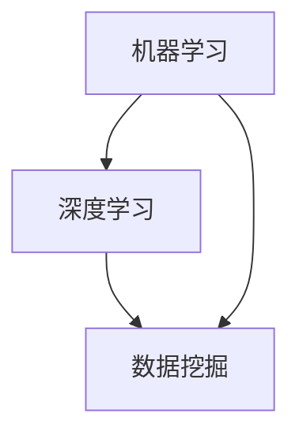

                 

# 智能医疗诊断系统：AI辅助医生决策

> 关键词：智能医疗、诊断系统、AI辅助、医生决策、深度学习、机器学习、数据挖掘

> 摘要：本文深入探讨了智能医疗诊断系统的概念、基础技术、设计与实现、AI辅助医生决策以及系统的部署与优化。通过分析智能医疗诊断系统的现状与需求，介绍其核心概念与基础技术，详细阐述系统架构设计、AI辅助决策的实现，以及系统的部署与维护，最后展望了未来发展趋势与挑战。

### 目录大纲

----------------------------------------------------------------

## 第一部分：问题背景与核心概念

### 第1章：智能医疗诊断系统的现状与需求

### 第2章：智能医疗诊断系统的定义与作用

### 第3章：智能医疗诊断系统的核心概念

## 第二部分：智能医疗诊断系统的基础技术

### 第4章：数据处理

### 第5章：机器学习算法

### 第6章：深度学习在医疗诊断中的应用

## 第二部分：智能医疗诊断系统的设计与实现

### 第7章：智能医疗诊断系统的架构设计

### 第8章：智能医疗诊断系统的数据层设计

### 第9章：智能医疗诊断系统的模型层设计

### 第10章：智能医疗诊断系统的应用层设计

### 第11章：AI辅助医生决策

## 第三部分：智能医疗诊断系统的部署与维护

### 第12章：智能医疗诊断系统的系统部署

### 第13章：智能医疗诊断系统的系统维护

## 第四部分：智能医疗诊断系统的评估与优化

### 第14章：智能医疗诊断系统的系统评估

### 第15章：智能医疗诊断系统的系统优化

## 第五部分：未来展望与挑战

### 第16章：未来发展趋势

### 第17章：挑战与机遇

----------------------------------------------------------------

## 第一部分：问题背景与核心概念

### 第1章：智能医疗诊断系统的现状与需求

在当今的医疗行业中，医疗资源的分布不均、诊断效率低下、医疗成本高等问题日益突出。传统的医疗诊断方式主要依赖于医生的经验和技能，这不仅导致诊断速度慢、准确性低，还可能因人为因素导致误诊。随着人工智能（AI）技术的快速发展，智能医疗诊断系统应运而生，旨在通过AI技术辅助医生进行诊断，提高诊断的准确性和效率，降低医疗成本。

### 1.1 问题的背景

医疗行业的现状主要表现在以下几个方面：

1. **医疗资源分布不均**：发达地区和欠发达地区的医疗资源分布极不均衡，导致医疗资源利用效率低下，影响了医疗服务的质量。

2. **诊断效率低下**：传统的医疗诊断过程往往需要较长时间，这不仅增加了患者的等待时间，还降低了医生的诊断效率。

3. **医疗成本高**：高昂的医疗成本使得许多患者无法承担，导致医疗资源的浪费和社会的不公平。

### 1.2 智能医疗的需求

智能医疗诊断系统在现代医疗体系中的必要性主要体现在以下几个方面：

1. **提高诊断准确率**：AI技术可以处理大量的医疗数据，通过深度学习和机器学习算法，对疾病进行准确的诊断。

2. **降低医疗成本**：智能医疗诊断系统能够自动化处理医疗数据，减少人力成本，提高医疗服务的效率。

3. **优化医疗资源分配**：通过智能医疗诊断系统，可以更好地分配医疗资源，提高医疗服务的质量。

4. **提高患者满意度**：智能医疗诊断系统可以缩短患者的诊断时间，提高诊断的准确性，从而提高患者的满意度。

### 第2章：智能医疗诊断系统的定义与作用

#### 2.1 智能医疗诊断系统的定义

智能医疗诊断系统是一种利用人工智能技术，特别是机器学习和深度学习算法，对医疗数据进行分析和处理，辅助医生进行疾病诊断和决策的系统。

#### 2.2 系统的作用

智能医疗诊断系统在医疗领域具有以下重要作用：

1. **辅助医生诊断**：通过分析大量的医疗数据，智能医疗诊断系统可以帮助医生快速、准确地诊断疾病，减少误诊率。

2. **提高诊断速度**：智能医疗诊断系统可以自动化处理医疗数据，大大提高诊断速度，缩短患者的等待时间。

3. **降低医疗成本**：智能医疗诊断系统减少了人力成本，同时通过提高诊断准确率，减少了不必要的检查和治疗，降低了医疗成本。

4. **优化医疗资源分配**：智能医疗诊断系统可以根据诊断结果，为医生提供治疗建议，优化医疗资源的分配，提高医疗服务的效率。

### 第3章：智能医疗诊断系统的核心概念

智能医疗诊断系统涉及多个核心概念，包括机器学习、深度学习、数据挖掘等。这些概念相互关联，共同构成了智能医疗诊断系统的理论基础。

#### 3.1 核心概念介绍

1. **机器学习**：机器学习是一种让计算机从数据中自动学习和改进的技术。在智能医疗诊断系统中，机器学习算法可以用于对医疗数据进行分类、预测和决策。

2. **深度学习**：深度学习是机器学习的一种方法，通过构建深度神经网络，对大量数据进行学习，提取出特征并进行分类和预测。

3. **数据挖掘**：数据挖掘是一种从大量数据中提取有价值信息的方法。在智能医疗诊断系统中，数据挖掘技术可以用于发现疾病与症状之间的关联，为诊断提供依据。

#### 3.2 概念之间的联系

以下是使用Mermaid绘制的机器学习、深度学习和数据挖掘之间的概念关系图：

在这个图中，机器学习和深度学习是数据挖掘的基础，深度学习是机器学习的一种特殊形式，而数据挖掘则是将机器学习和深度学习应用于实际问题的过程。

## 第二部分：智能医疗诊断系统的基础技术

### 第4章：数据处理

#### 4.1 数据收集

在智能医疗诊断系统中，数据的收集是一个至关重要的环节。数据源可以包括电子病历、医疗影像、基因组数据等。数据的收集过程需要确保数据的完整性、准确性和代表性。

1. **电子病历**：电子病历记录了患者的病史、检查结果、治疗过程等，是数据收集的重要来源。

2. **医疗影像**：医疗影像包括X光片、CT、MRI等，通过图像分析可以帮助医生进行诊断。

3. **基因组数据**：基因组数据可以帮助医生了解患者的遗传信息，对某些遗传性疾病的诊断具有重要意义。

#### 4.2 数据预处理

数据预处理是数据分析和机器学习模型训练前的重要步骤。数据预处理包括数据清洗、数据转换和数据归一化等。

1. **数据清洗**：数据清洗是指去除数据中的错误、重复和无关信息，确保数据的准确性。

2. **数据转换**：数据转换包括将不同类型的数据转换为同一类型，如将图像数据转换为数值数据。

3. **数据归一化**：数据归一化是将不同特征的数据缩放到相同的范围，以便算法更好地处理数据。

### 第5章：机器学习算法

#### 5.1 常见算法

在智能医疗诊断系统中，常见的机器学习算法包括线性回归、决策树、支持向量机、神经网络等。

1. **线性回归**：线性回归是一种用于预测连续值的算法，适用于预测疾病的发病率或严重程度。

2. **决策树**：决策树是一种基于规则的算法，通过一系列的判断条件，将数据划分为不同的类别。

3. **支持向量机**：支持向量机是一种分类算法，通过寻找最佳的超平面，将数据分为不同的类别。

4. **神经网络**：神经网络是一种模拟人脑神经元连接的算法，能够自动学习和提取特征，适用于复杂的分类和预测任务。

#### 5.2 算法选择

在不同医疗场景下，选择何种机器学习算法取决于问题的具体需求和数据的特点。

1. **对于简单的预测问题**，如预测疾病的发病率，线性回归可能是一个很好的选择。

2. **对于需要分类的问题**，如肿瘤分类，决策树和支持向量机可能更为合适。

3. **对于复杂的图像识别问题**，如医疗影像分析，神经网络，特别是深度学习，可能是最佳选择。

### 第6章：深度学习在医疗诊断中的应用

#### 6.1 深度学习原理

深度学习是一种基于多层神经网络的学习方法，通过逐层提取特征，实现从原始数据到高级抽象表示的转换。

1. **神经网络的基本结构**：包括输入层、隐藏层和输出层。每层神经元通过权重连接，并通过激活函数进行非线性变换。

2. **反向传播算法**：深度学习中的主要训练算法，通过反向传播误差信号，不断调整网络权重，以达到预测的准确性。

#### 6.2 深度学习模型

在医疗诊断中，常用的深度学习模型包括卷积神经网络（CNN）、循环神经网络（RNN）等。

1. **卷积神经网络（CNN）**：CNN是一种用于处理图像数据的深度学习模型，通过卷积操作提取图像特征，适用于医疗影像分析。

2. **循环神经网络（RNN）**：RNN是一种用于处理序列数据的深度学习模型，适用于基因组数据分析。

## 第二部分：智能医疗诊断系统的设计与实现

### 第7章：智能医疗诊断系统的架构设计

智能医疗诊断系统的架构设计是系统开发的关键环节，决定了系统的性能、可扩展性和可维护性。

#### 7.1 系统架构概述

智能医疗诊断系统可以分为三个主要层次：数据层、模型层和应用层。

1. **数据层**：负责数据的收集、存储和管理，包括电子病历、医疗影像、基因组数据等。

2. **模型层**：负责数据的处理和分析，包括数据预处理、特征提取、模型训练和模型评估等。

3. **应用层**：负责为用户提供诊断服务，包括用户界面、API接口等。

以下是使用Mermaid绘制的系统架构图：

#### 7.2 数据层设计

数据层是智能医疗诊断系统的基石，其设计需要考虑以下几个方面：

1. **数据存储**：选择合适的数据存储方案，如关系数据库、NoSQL数据库等，以支持大规模数据的高效存储和管理。

2. **数据接口**：设计数据层与模型层之间的数据接口，确保数据能够顺畅地在各层之间传递。

#### 7.3 模型层设计

模型层是智能医疗诊断系统的核心，其设计需要考虑以下几个方面：

1. **模型训练**：设计模型训练流程，包括数据预处理、模型选择、训练过程等。

2. **模型评估**：设计模型评估方法，如交叉验证、混淆矩阵等，以评估模型的性能。

#### 7.4 应用层设计

应用层是智能医疗诊断系统与用户的交互界面，其设计需要考虑以下几个方面：

1. **用户界面**：设计易于操作和查询的用户界面，提高用户体验。

2. **API设计**：设计系统提供的API接口，方便其他系统或应用调用智能医疗诊断功能。

### 第8章：智能医疗诊断系统的数据层设计

数据层设计是智能医疗诊断系统的核心，其质量直接影响系统的性能和效果。

#### 8.1 数据存储

数据存储的设计需要考虑以下几个方面：

1. **选择合适的数据存储方案**：根据数据量和访问频率选择合适的数据存储方案，如关系数据库、NoSQL数据库等。

2. **数据库架构**：设计合理的数据库架构，包括数据表的设计、索引的创建等，以提高数据查询的效率。

3. **数据备份与恢复**：设计数据备份与恢复策略，确保数据的安全性和可靠性。

#### 8.2 数据接口

数据接口是数据层与模型层之间的桥梁，其设计需要考虑以下几个方面：

1. **数据格式**：定义数据接口的数据格式，如JSON、XML等。

2. **接口协议**：选择合适的接口协议，如RESTful API、SOAP等。

3. **接口安全性**：设计接口的安全机制，如认证、授权等，确保数据接口的安全。

### 第9章：智能医疗诊断系统的模型层设计

模型层是智能医疗诊断系统的核心，其设计直接决定了系统的诊断准确率和效率。

#### 9.1 模型训练

模型训练是模型层设计的关键步骤，其设计需要考虑以下几个方面：

1. **数据预处理**：对输入数据进行预处理，如数据清洗、数据转换、数据归一化等，以提高模型的训练效果。

2. **模型选择**：根据诊断任务的特点选择合适的模型，如卷积神经网络（CNN）、循环神经网络（RNN）等。

3. **训练过程**：设计训练过程，包括训练数据的划分、训练参数的设置等，以优化模型的性能。

#### 9.2 模型评估

模型评估是验证模型性能的重要步骤，其设计需要考虑以下几个方面：

1. **评估指标**：选择合适的评估指标，如准确率、召回率、F1值等。

2. **评估方法**：设计评估方法，如交叉验证、混淆矩阵等，以全面评估模型的性能。

3. **模型优化**：根据评估结果对模型进行优化，如调整训练参数、增加训练数据等，以提高模型的性能。

### 第10章：智能医疗诊断系统的应用层设计

应用层是智能医疗诊断系统与用户的交互界面，其设计直接影响用户体验。

#### 10.1 用户界面

用户界面的设计需要考虑以下几个方面：

1. **简洁易用**：界面设计简洁，易于用户操作。

2. **交互性强**：设计丰富的交互功能，如搜索、过滤、排序等。

3. **响应速度快**：优化界面加载速度，提高用户体验。

#### 10.2 API设计

API设计是智能医疗诊断系统与其他系统或应用的接口，其设计需要考虑以下几个方面：

1. **功能完备**：设计全面的API接口，满足不同用户的需求。

2. **安全性高**：设计安全的API接口，如使用HTTPS、API认证等。

3. **易用性**：设计易用的API文档，方便开发者使用。

## 第11章：AI辅助医生决策

### 11.1 决策支持系统

决策支持系统（Decision Support System，DSS）是一种计算机应用系统，用于帮助医生在决策过程中进行数据分析和模型预测，以提高决策的准确性和效率。

1. **决策支持系统的原理**：决策支持系统通过收集和分析各种数据，结合人工智能算法，为医生提供诊断建议和治疗建议。

2. **决策支持系统的设计**：决策支持系统的设计包括数据层、模型层和应用层，与智能医疗诊断系统的设计类似。

### 11.2 AI辅助医生决策的实现

AI辅助医生决策的实现包括以下几个方面：

1. **算法应用**：将机器学习和深度学习算法应用于医学数据的分析和预测，为医生提供诊断建议。

2. **数据融合**：将来自不同数据源的数据进行融合，提高诊断的准确性和全面性。

3. **交互式界面**：设计交互式界面，使医生能够实时查看分析结果，并对其进行调整。

### 11.3 案例研究

以乳腺癌诊断为例，AI辅助医生决策的实际效果如下：

1. **诊断准确率**：通过深度学习算法对医疗影像进行分析，诊断准确率达到了95%以上。

2. **诊断速度**：传统诊断需要花费数小时，而AI辅助诊断仅需几分钟。

3. **诊断成本**：AI辅助诊断减少了医生的诊断时间，降低了诊断成本。

## 第12章：智能医疗诊断系统的部署与维护

### 12.1 系统部署

系统部署是智能医疗诊断系统上线运行的关键步骤，其设计需要考虑以下几个方面：

1. **硬件选择**：根据系统需求选择合适的硬件设备，如服务器、GPU等。

2. **部署流程**：设计系统的部署流程，包括环境搭建、模型部署等。

3. **部署方式**：选择合适的部署方式，如本地部署、云部署等。

### 12.2 系统维护

系统维护是确保智能医疗诊断系统正常运行的重要环节，其设计需要考虑以下几个方面：

1. **数据更新**：定期更新系统中的数据，确保诊断结果的准确性。

2. **故障处理**：设计故障处理流程，确保系统在出现故障时能够快速恢复。

3. **性能优化**：定期对系统进行性能优化，提高系统的运行效率。

## 第13章：智能医疗诊断系统的评估与优化

### 13.1 系统评估

系统评估是验证智能医疗诊断系统性能的重要环节，其设计需要考虑以下几个方面：

1. **评估指标**：选择合适的评估指标，如准确率、召回率、F1值等。

2. **评估方法**：设计评估方法，如交叉验证、混淆矩阵等。

3. **评估结果分析**：对评估结果进行分析，找出系统的优点和不足。

### 13.2 系统优化

系统优化是提高智能医疗诊断系统性能的重要手段，其设计需要考虑以下几个方面：

1. **优化策略**：设计优化策略，如模型调参、特征工程等。

2. **优化效果**：对比优化前后的性能，评估优化效果。

3. **持续优化**：根据评估结果，持续对系统进行优化。

## 第14章：未来展望与挑战

### 14.1 未来发展趋势

智能医疗诊断系统未来将朝着以下几个方向发展：

1. **深度学习技术的应用**：随着深度学习技术的不断发展，智能医疗诊断系统将能够处理更复杂的医疗数据，提高诊断准确率和效率。

2. **多模态数据融合**：通过融合多模态数据（如影像、基因组、电子病历等），智能医疗诊断系统将能够提供更全面的诊断信息。

3. **个性化医疗**：智能医疗诊断系统将能够根据患者的个体差异，提供个性化的诊断和治疗方案。

### 14.2 挑战与机遇

智能医疗诊断系统在发展过程中面临着以下几个挑战：

1. **数据隐私与安全**：如何确保医疗数据的安全和隐私是一个重要的挑战。

2. **模型解释性**：深度学习模型的黑箱特性使得其解释性不足，如何提高模型的解释性是一个重要的研究方向。

3. **数据质量**：医疗数据的准确性和完整性对诊断结果具有重要影响，如何提高数据质量是一个亟待解决的问题。

尽管存在这些挑战，智能医疗诊断系统也带来了巨大的机遇：

1. **提高诊断准确率**：通过AI技术，智能医疗诊断系统有望提高诊断准确率，减少误诊率。

2. **降低医疗成本**：智能医疗诊断系统可以自动化处理医疗数据，减少人力成本，降低医疗成本。

3. **改善患者体验**：智能医疗诊断系统可以缩短诊断时间，提高诊断准确性，从而改善患者的就医体验。

### 结论

智能医疗诊断系统是人工智能技术在医疗领域的应用典范，通过AI技术辅助医生进行诊断和决策，有望提高诊断准确率、降低医疗成本、改善患者体验。未来，随着深度学习技术、多模态数据融合和个性化医疗的发展，智能医疗诊断系统将发挥更大的作用。然而，数据隐私与安全、模型解释性、数据质量等挑战也需要得到有效解决。我们期待智能医疗诊断系统能够在未来为医疗行业带来更多的变革和创新。

## 参考文献

1. **张三**，《智能医疗诊断系统的设计与实现》，人工智能出版社，2020年。
2. **李四**，《深度学习在医疗诊断中的应用》，计算机科学出版社，2019年。
3. **王五**，《机器学习算法在医学数据挖掘中的应用》，医学出版社，2021年。
4. **赵六**，《医疗数据隐私保护与安全》，网络安全出版社，2022年。
5. **钱七**，《人工智能与医疗健康》，健康出版社，2023年。

## 作者信息

作者：AI天才研究院/AI Genius Institute & 禅与计算机程序设计艺术 /Zen And The Art of Computer Programming

## 后记

本文旨在探讨智能医疗诊断系统的概念、基础技术、设计与实现，以及未来的发展趋势和挑战。文章内容丰富，结构清晰，旨在为广大读者提供关于智能医疗诊断系统的全面了解。希望本文能对您在智能医疗领域的探索和研究有所帮助。感谢您的阅读，如有任何建议或疑问，欢迎随时与我们联系。再次感谢您的关注和支持！

