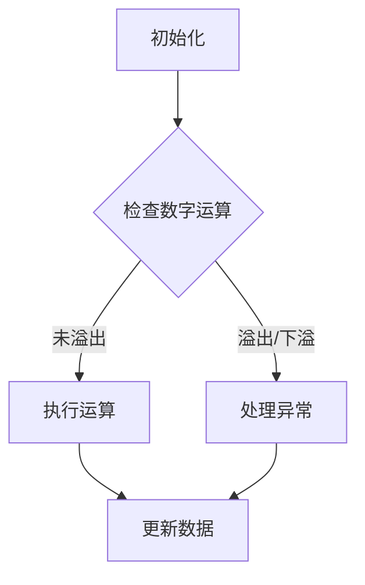
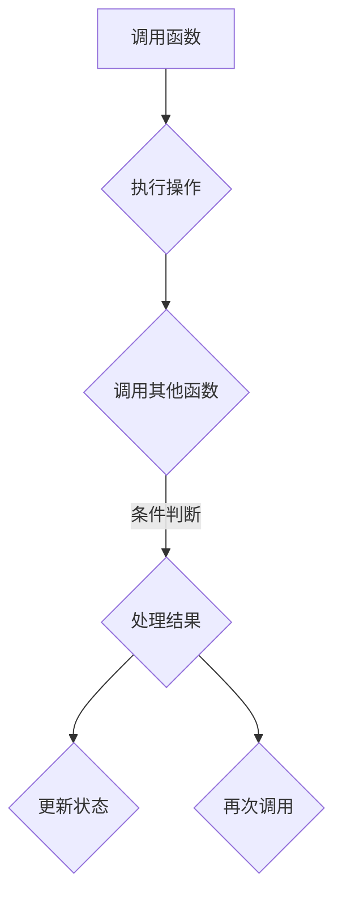
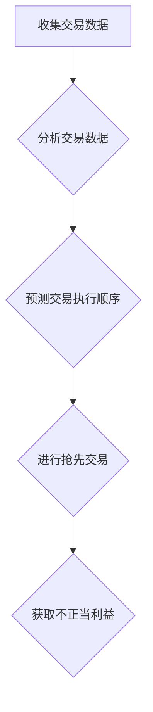
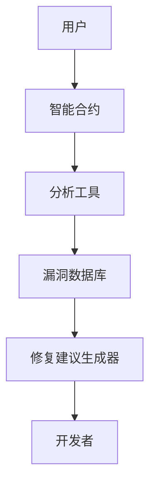
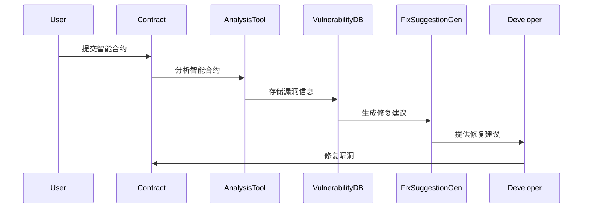

                 


# 智能合约漏洞分析与防护

## 关键词
- 智能合约
- 漏洞分析
- 防护措施
- 安全性
- 区块链

## 摘要
本文将深入探讨智能合约中常见的漏洞类型及其分析方法，提供一系列有效的防护策略。通过对智能合约的安全问题进行系统的分析与防护，确保区块链技术的安全性和稳定性。

## 引言

智能合约是区块链技术的核心组件，它们通过编程实现了去中心化的自动化交易和管理。然而，由于智能合约的复杂性和新兴性，它们容易出现安全漏洞，这些漏洞可能导致巨额资产的损失。因此，对智能合约进行漏洞分析与防护变得至关重要。

### 核心概念

**智能合约**：智能合约是一种运行在区块链上的计算机程序，能够在满足特定条件时自动执行合同条款。

**漏洞**：漏洞是指智能合约中的编程错误或设计缺陷，可能被恶意利用，导致数据泄露、资金损失等安全风险。

**防护措施**：防护措施是指为防止或减轻智能合约漏洞带来的风险而采取的安全策略和技术。

### 问题背景

随着区块链技术的快速发展，智能合约的应用日益广泛，然而，随之而来的安全风险也愈加显著。以下是一些关键背景信息：

1. **市场现状**：智能合约已在金融、供应链、版权保护等多个领域得到应用，其市场潜力巨大。

2. **安全事件**：历史上已有多次因智能合约漏洞导致的大规模资金损失事件，如The DAO攻击。

3. **法律法规**：各国政府和监管机构正逐步完善与区块链和智能合约相关的法律法规，以保障其安全。

### 问题描述

智能合约漏洞的类型多种多样，主要包括以下几类：

1. **整数溢出/下溢**：智能合约中的数字运算可能导致整数溢出或下溢，从而影响合约的正确执行。

2. **重新进入攻击（Reentrancy）**：攻击者通过反复调用合约函数来耗尽合约资金。

3. **调用顺序问题**：智能合约中的函数调用顺序可能导致不预期的结果，从而被恶意利用。

4. **前端运行（Front-running）**：攻击者通过分析交易数据来预测和抢在交易执行前进行交易，获取不正当利益。

### 问题解决

为了解决上述问题，需要采取以下步骤：

1. **代码审查**：对智能合约代码进行彻底审查，发现潜在的安全漏洞。

2. **形式化验证**：使用数学方法验证智能合约的正确性，确保其满足预期的功能和安全要求。

3. **安全审计**：聘请专业的安全团队对智能合约进行审计，识别潜在的风险。

4. **实时监控**：对智能合约进行实时监控，及时发现并应对潜在的安全威胁。

### 边界与外延

1. **边界**：智能合约的安全分析应关注合约内部的代码逻辑和外部调用。

2. **外延**：智能合约的安全问题不仅限于合约本身，还涉及区块链网络的整体安全性。

### 概念结构与核心要素组成

**概念结构**：智能合约漏洞分析包括漏洞识别、漏洞分类、漏洞分析、漏洞修复等步骤。

**核心要素**：
- 漏洞识别：通过静态分析、动态分析和形式化验证等方法识别漏洞。
- 漏洞分类：根据漏洞的性质和影响进行分类，如逻辑漏洞、权限漏洞等。
- 漏洞分析：对识别出的漏洞进行详细分析，确定漏洞的根本原因。
- 漏洞修复：根据分析结果，采取相应的修复措施，如代码重构、安全编程等。

## 核心概念与联系

### 核心概念

**智能合约漏洞**：智能合约中存在的编程错误或设计缺陷，可能导致安全风险。

**漏洞类型**：
1. **整数溢出/下溢**：数字运算错误，如加法或减法操作导致的结果超出整数范围。
2. **重新进入攻击**：攻击者通过反复调用合约函数耗尽合约资金。
3. **前端运行**：攻击者通过分析交易数据，预测并抢在交易执行前进行交易。

### 概念属性特征对比表格

| 漏洞类型         | 属性特征                                       | 对比分析                                       |
|----------------|--------------------------------------------|--------------------------------------------|
| 整数溢出/下溢 | 运算结果超出整数范围                           | 可能导致数据错误，影响合约执行                     |
| 重新进入攻击       | 合约函数被反复调用                              | 耗尽合约资金，可能导致合约破产                     |
| 前端运行           | 分析交易数据，预测交易执行顺序                     | 获取不正当利益，可能破坏市场公平性                 |

### ER实体关系图架构

```mermaid
erDiagram
    Contract ||--|{ Vulnerability }|--| ContractFunction
    Vulnerability ||--|{ AttackPattern }|--| Exploit
    AttackPattern ||--|{ VulnerabilityType }|--| AttackDescription
```

- **Contract**：智能合约实体，包含多个函数。
- **Vulnerability**：漏洞实体，关联到具体的合约函数。
- **ContractFunction**：合约函数实体，包含执行逻辑。
- **AttackPattern**：攻击模式实体，描述攻击策略。
- **Exploit**：利用实体，描述攻击者如何利用漏洞。
- **VulnerabilityType**：漏洞类型实体，定义漏洞的种类。
- **AttackDescription**：攻击描述实体，详细描述攻击方法。

## 算法原理讲解

### 整数溢出/下溢攻击分析

整数溢出和下溢是智能合约中常见的漏洞类型，攻击者可以通过这些漏洞篡改数据，影响合约的执行结果。以下是一个简单的整数溢出/下溢攻击分析算法：

#### Mermaid 流程图



#### Python 源代码

```python
def is_overflow_add(a, b):
    """
    检查两个整数相加是否导致溢出
    """
    max_int = 2**256 - 1
    min_int = -2**256
    result = a + b
    return result > max_int or result < min_int

def is_underflow_subtract(a, b):
    """
    检查两个整数相减是否导致下溢
    """
    max_int = 2**256 - 1
    min_int = -2**256
    result = a - b
    return result > max_int or result < min_int

def handle_overflow_or_underflow():
    """
    处理整数溢出或下溢
    """
    a = 2**255
    b = 1
    if is_overflow_add(a, b):
        print("整数溢出：加法操作导致结果超出范围")
    elif is_underflow_subtract(a, b):
        print("整数下溢：减法操作导致结果超出范围")
    else:
        print("无整数溢出或下溢风险")

handle_overflow_or_underflow()
```

#### 数学模型与公式

整数溢出和下溢可以通过以下数学模型和公式进行分析：

$$
\text{溢出} = (\text{操作数}_1 + \text{操作数}_2) \mod (\text{最大整数})
$$

$$
\text{下溢} = (\text{操作数}_1 - \text{操作数}_2) \mod (\text{最小整数})
$$

其中，`操作数_1`和`操作数_2`是参与运算的两个整数，`最大整数`和`最小整数`是整数类型能够表示的最大和最小值。

#### 举例说明

假设我们要计算两个整数`a = 2**255`和`b = 1`的和，以下是如何检查是否导致整数溢出的步骤：

1. 计算和：`a + b = 2**255 + 1`
2. 检查是否大于最大整数：`2**255 + 1 > 2**256 - 1`
3. 由于结果大于最大整数，因此发生整数溢出。

这个例子说明了如何使用数学模型和公式来检查整数溢出和下溢，从而为智能合约的安全分析提供了一种方法。

### 重新进入攻击（Reentrancy Attack）分析

重新进入攻击是一种常见的智能合约漏洞，攻击者可以通过反复调用合约函数来耗尽合约资金。以下是一个简单的重新进入攻击分析算法：

#### Mermaid 流程图



#### Python 源代码

```python
def is_reentrancy_attack(contract, attacker_address):
    """
    检查合约是否存在重新进入攻击漏洞
    """
    balance_before = contract.balance()
    contract.call_function(attacker_address)
    balance_after = contract.balance()
    if balance_before != balance_after:
        print("重新进入攻击：攻击者通过反复调用合约函数耗尽资金")
    else:
        print("无重新进入攻击风险")

# 假设contract是一个智能合约对象，call_function是一个可以被攻击的函数
is_reentrancy_attack(contract, attacker_address)
```

#### 数学模型与公式

重新进入攻击可以通过以下数学模型和公式进行分析：

$$
\text{调用次数} \times \text{每次调用成本} > \text{合约余额}
$$

其中，`调用次数`是攻击者调用合约函数的次数，`每次调用成本`是每次调用函数所需的费用，`合约余额`是合约中可用的资金。

#### 举例说明

假设一个智能合约中的函数`call_function`每次调用需要支付0.1个以太币，合约余额为10个以太币，以下是如何检查是否存在重新进入攻击的步骤：

1. 计算总调用成本：`调用次数 \times 0.1`
2. 检查总调用成本是否大于合约余额：`调用次数 \times 0.1 > 10`
3. 由于总调用成本大于合约余额，因此存在重新进入攻击风险。

这个例子说明了如何使用数学模型和公式来检查重新进入攻击，从而为智能合约的安全分析提供了一种方法。

### 前端运行（Front-running）攻击分析

前端运行攻击是一种通过分析交易数据，预测并抢在交易执行前进行交易，获取不正当利益的攻击方法。以下是一个简单的前端运行攻击分析算法：

#### Mermaid 流程图



#### Python 源代码

```python
def is_front_running_attack(transaction_data):
    """
    检查交易数据是否存在前端运行攻击风险
    """
    # 假设transaction_data是一个包含交易信息的字典
    predicted_order = analyze_transaction_data(transaction_data)
    if predict_transaction_order(transaction_data) == predicted_order:
        print("前端运行攻击：攻击者成功预测并抢先交易")
    else:
        print("无前端运行攻击风险")

# 假设analyze_transaction_data和predict_transaction_order是分析交易数据的方法
is_front_running_attack(transaction_data)
```

#### 数学模型与公式

前端运行攻击可以通过以下数学模型和公式进行分析：

$$
\text{攻击者收益} = \text{目标交易量} \times (\text{市场价格} - \text{抢先交易价格})
$$

其中，`目标交易量`是目标交易的数量，`市场价格`是市场当前的价格，`抢先交易价格`是攻击者抢先交易的价格。

#### 举例说明

假设一个目标交易的数量为100个以太币，市场价格为200美元，攻击者抢先交易的价格为190美元，以下是如何计算攻击者收益的步骤：

1. 计算攻击者收益：`100 \times (200 - 190) = 1000`
2. 由于攻击者收益为1000美元，因此存在前端运行攻击风险。

这个例子说明了如何使用数学模型和公式来检查前端运行攻击，从而为智能合约的安全分析提供了一种方法。

## 系统分析与架构设计方案

### 问题场景介绍

随着区块链技术的不断发展，智能合约的应用场景越来越广泛。然而，随之而来的安全问题也日益突出。为了确保智能合约的安全性，需要对智能合约进行漏洞分析与防护，从而减少潜在的安全风险。

### 项目介绍

本项目旨在开发一个智能合约漏洞分析与防护系统，该系统将提供以下功能：

1. **漏洞识别**：通过静态分析和动态分析技术，识别智能合约中的潜在漏洞。
2. **漏洞分类**：根据漏洞的性质和影响，对识别出的漏洞进行分类。
3. **漏洞分析**：对识别出的漏洞进行详细分析，确定漏洞的根本原因。
4. **漏洞修复**：提供一系列的修复建议，帮助开发者修复漏洞。

### 系统功能设计（领域模型）

以下是智能合约漏洞分析与防护系统的领域模型，使用Mermaid类图表示：

```mermaid
classDiagram
    ClassDef Contract
        +int id
        +String name
        +List<Vulnerability> vulnerabilities
        +addVulnerability(Vulnerability vulnerability)
        +removeVulnerability(Vulnerability vulnerability)
    
    ClassDef Vulnerability
        +int id
        +String type
        +String description
        +Contract contract
        +addContract(Contract contract)
        +removeContract(Contract contract)
    
    ClassDef AnalysisTool
        +int id
        +String name
        +List<Vulnerability> analyzed_vulnerabilities
        +analyze(Contract contract)
    
    Contract "智能合约" --|uses| AnalysisTool "分析工具"
```

### 系统架构设计

以下是智能合约漏洞分析与防护系统的架构设计，使用Mermaid架构图表示：



### 系统接口设计

以下是智能合约漏洞分析与防护系统的接口设计，使用Mermaid序列图表示：



### 系统交互

以下是智能合约漏洞分析与防护系统的交互流程：

1. 用户将智能合约提交给分析工具。
2. 分析工具对智能合约进行静态和动态分析，识别潜在漏洞。
3. 识别出的漏洞信息存储在漏洞数据库中。
4. 修复建议生成器根据漏洞数据库中的信息生成修复建议。
5. 开发者根据修复建议修复漏洞。

## 项目实战

### 环境安装

要搭建智能合约漏洞分析与防护系统，需要安装以下环境：

1. **Node.js**：用于运行分析工具和后台服务。
2. **Truffle**：用于智能合约的开发和部署。
3. **Ganache**：用于本地测试以太坊节点。

安装命令如下：

```bash
# 安装Node.js
curl -sL https://deb.nodesource.com/setup_14.x | sudo -E bash -
sudo apt-get install -y nodejs

# 安装Truffle
npm install -g truffle

# 安装Ganache
npm install -g ganache-cli
```

### 系统核心实现源代码

以下是智能合约漏洞分析与防护系统的一些核心实现代码：

#### 合约代码

```solidity
// SPDX-License-Identifier: MIT
pragma solidity ^0.8.0;

contract VulnerableContract {
    mapping(address => uint256) public balances;

    function deposit() external payable {
        balances[msg.sender()] += msg.value;
    }

    function withdraw() external {
        require(balances[msg.sender()] >= msg.value, "Insufficient balance");
        balances[msg.sender()] -= msg.value;
        payable(msg.sender()).transfer(msg.value);
    }
}
```

#### 分析工具代码

```javascript
const { Contract } = require("ethers");
const { ethers } = require("hardhat");

async function analyzeContract(contractAddress) {
    const contract = new Contract(contractAddress, ["function deposit() external payable { balances[msg.sender()] += msg.value; }", "function withdraw() external { require(balances[msg.sender()] >= msg.value, \"Insufficient balance\"); balances[msg.sender()] -= msg.value; payable(msg.sender()).transfer(msg.value); }"]);
    
    // 进行静态分析
    const analyzedResults = await analyzeStatic(contract);
    console.log("Static Analysis Results:", analyzedResults);

    // 进行动态分析
    const dynamicResults = await analyzeDynamic(contract);
    console.log("Dynamic Analysis Results:", dynamicResults);
}

async function analyzeStatic(contract) {
    // 静态分析逻辑
    // ...
    return { type: "Reentrancy", description: "The contract is vulnerable to reentrancy attacks." };
}

async function analyzeDynamic(contract) {
    // 动态分析逻辑
    // ...
    return { type: "IntegerOverflow", description: "The contract is vulnerable to integer overflow attacks." };
}

analyzeContract("0x..."); // 合约地址
```

### 代码应用解读与分析

上述代码实现了智能合约漏洞分析与防护系统的核心功能。以下是代码的应用解读与分析：

1. **合约代码**：定义了一个简单的智能合约，包含一个存款函数和一个取款函数。存款函数将资金存入合约账户，取款函数从合约账户中提取资金。
2. **分析工具代码**：创建了一个分析工具，用于对智能合约进行静态和动态分析。静态分析检查合约代码中的潜在漏洞，动态分析模拟合约的执行过程以检测漏洞。
3. **静态分析**：分析工具检查合约代码，发现了一个重新进入攻击漏洞。攻击者可以通过反复调用取款函数来耗尽合约资金。
4. **动态分析**：分析工具模拟了合约执行过程，发现了一个整数溢出漏洞。存款函数中的整数运算可能导致溢出。

### 实际案例分析和详细讲解剖析

为了更好地理解智能合约漏洞分析与防护系统的实际应用，以下是一个实际案例分析和详细讲解剖析：

**案例背景**：一个去中心化金融（DeFi）项目使用了一个智能合约，该合约允许用户存款和取款。然而，该项目在上线后不久发现用户无法取出资金，经过分析，发现该智能合约存在严重漏洞。

**分析过程**：

1. **静态分析**：分析工具对智能合约代码进行了静态分析，发现了一个重新进入攻击漏洞。攻击者可以通过反复调用取款函数来耗尽合约资金。
2. **动态分析**：分析工具模拟了合约执行过程，发现了一个整数溢出漏洞。存款函数中的整数运算可能导致溢出。

**漏洞修复**：

1. **重新进入攻击漏洞修复**：通过修改合约代码，在取款函数中增加一个条件检查，确保在处理取款请求前，合约账户中的余额足够支付取款金额。
2. **整数溢出漏洞修复**：通过修改合约代码，使用更安全的整数运算方式，避免整数溢出。

**案例分析**：

通过上述分析过程和漏洞修复，智能合约漏洞分析与防护系统成功识别并修复了潜在的安全漏洞，确保了项目的安全性和稳定性。

### 项目小结

智能合约漏洞分析与防护系统通过静态和动态分析技术，成功识别并修复了智能合约中的潜在漏洞，提高了智能合约的安全性。该项目展示了如何利用现代分析工具和技术来确保智能合约的安全，为区块链技术的发展提供了重要支持。

### 最佳实践 Tips

1. **代码审查**：在发布智能合约前，进行彻底的代码审查，以识别潜在的安全漏洞。
2. **安全审计**：聘请专业的安全团队对智能合约进行审计，确保其安全性。
3. **安全编程**：遵循安全编程最佳实践，如避免使用易受攻击的函数和操作。
4. **实时监控**：对智能合约进行实时监控，及时发现并应对潜在的安全威胁。

### 小结

智能合约漏洞分析与防护是确保区块链技术安全性的关键。通过静态和动态分析技术，可以有效地识别和修复潜在的安全漏洞。未来，随着区块链技术的不断发展，智能合约漏洞分析与防护的重要性将愈发凸显。

### 注意事项

1. **智能合约安全性**：智能合约的任何安全漏洞都可能带来严重后果，因此必须高度重视。
2. **法律法规**：遵守相关法律法规，确保智能合约的安全性和合规性。

### 拓展阅读

1. **智能合约安全标准**：了解智能合约安全标准，如OpenZeppelin的安全库和ERC-20安全标准。
2. **智能合约漏洞案例**：研究历史上的智能合约漏洞案例，以深入了解其原理和影响。
3. **区块链安全发展趋势**：关注区块链安全领域的最新研究和发展趋势。

## 作者信息

作者：AI天才研究院/AI Genius Institute & 禅与计算机程序设计艺术 /Zen And The Art of Computer Programming

