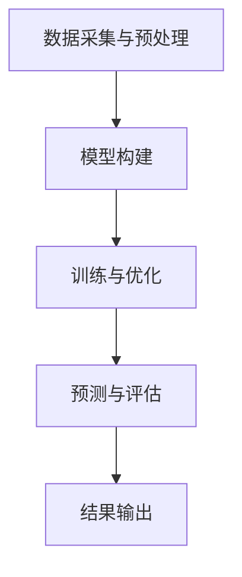
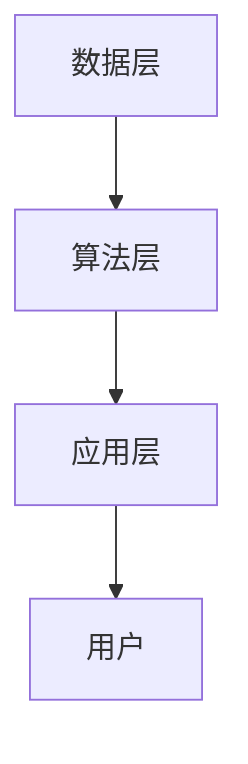
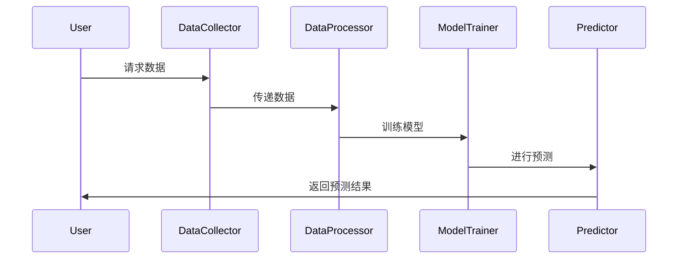

                 


### 引言

#### 1.1 问题背景

在当今快速发展的社会中，城市规划面临着前所未有的挑战。城市人口不断增长，资源分配紧张，环境污染问题日益突出。传统的城市规划方法已经难以应对这些复杂问题，迫切需要引入新的技术手段来提升决策的效率和准确性。人工智能（AI）作为当前最具潜力的技术之一，被认为是解决城市规划问题的关键。

AI大模型，即人工智能大规模神经网络模型，能够在海量数据中提取有用信息，进行复杂模式识别和预测。近年来，随着计算能力的提升和大数据技术的进步，AI大模型在各个领域取得了显著成果。在城市规划中，AI大模型可以用于交通流量预测、环境监测、资源分配等方面，提供科学、精准的决策支持。

#### 1.2 AI大模型的应用

AI大模型在智能城市规划中的应用主要体现在以下几个方面：

- **交通流量预测**：通过分析历史交通数据、实时交通状况以及城市交通网络结构，AI大模型可以预测未来某一时段的城市交通流量，为交通管理提供依据。

- **环境监测**：AI大模型可以实时监测城市环境中的空气、水质等指标，预测环境污染的趋势，为环境保护提供决策支持。

- **资源分配**：基于AI大模型对城市资源需求的预测，可以优化公共资源（如水资源、电力资源）的分配，提高资源利用效率。

- **城市规划与设计**：AI大模型可以根据城市的历史发展数据、地理信息、社会经济发展指标等因素，模拟不同城市规划方案的效果，为城市规划师提供参考。

#### 1.3 书籍结构概述

本书旨在深入探讨AI大模型在智能城市规划中的应用。全书分为七个章节，内容结构如下：

- **第1章 引言**：介绍智能城市规划的背景和AI大模型的应用。

- **第2章 智能城市规划概述**：阐述智能城市规划的核心概念、面临的挑战和AI大模型的应用。

- **第3章 AI大模型基础**：讲解AI大模型的基本原理、特点和应用场景。

- **第4章 算法原理讲解**：分析AI大模型在智能城市规划中的应用算法，使用Python源代码和LaTeX公式进行详细讲解。

- **第5章 系统设计与实现**：介绍智能城市规划系统的整体架构、类图、序列图等设计。

- **第6章 实战案例分析**：通过实际案例，展示AI大模型在智能城市规划中的应用效果。

- **第7章 总结与拓展**：总结全书内容，提供最佳实践、注意事项和拓展阅读。

通过本书的阅读，读者将全面了解AI大模型在智能城市规划中的价值和应用方法，为未来的城市规划工作提供有力支持。

#### 关键词

- 智能城市规划
- AI大模型
- 交通流量预测
- 环境监测
- 资源分配
- 城市规划与设计

#### 摘要

本书围绕智能城市规划的主题，探讨了AI大模型在其中的应用。首先，介绍了智能城市规划的背景和AI大模型的基本原理。接着，详细阐述了AI大模型在交通流量预测、环境监测、资源分配和城市规划与设计等方面的具体应用。通过实际案例的分析，展示了AI大模型在智能城市规划中的实际效果。最后，总结了全书的核心内容，并提供了最佳实践、注意事项和拓展阅读，以供读者进一步学习和实践。本书旨在为城市规划工作者提供一套科学、系统的智能城市规划解决方案。

----------------------------------------------------------------

## 智能城市规划概述

### 2.1 核心概念

智能城市规划是一种利用人工智能技术，对城市的发展进行科学、系统、动态决策的方法。它涉及多个领域的交叉和融合，包括城市规划、计算机科学、数据分析、人工智能等。以下是对智能城市规划中几个关键概念的定义和解释：

- **城市规划**：城市规划是制定和调整城市的空间布局、功能分区、基础设施、公共设施等，以满足城市可持续发展和居民生活质量的需求。

- **人工智能**：人工智能是指通过计算机程序模拟人类智能行为的技术，包括机器学习、深度学习、自然语言处理、计算机视觉等。

- **数据采集与处理**：数据采集与处理是智能城市规划的基础，包括数据的收集、存储、清洗、转换和建模等过程。

- **机器学习**：机器学习是一种人工智能技术，通过从数据中学习规律和模式，使计算机能够自动进行决策和预测。

- **深度学习**：深度学习是机器学习的一个子领域，通过多层神经网络结构，模拟人脑的学习过程，实现对复杂数据的高效处理和预测。

- **大数据分析**：大数据分析是指对大量结构化和非结构化数据进行处理和分析，提取有价值的信息和知识。

- **城市模拟**：城市模拟是通过计算机模型对城市的发展进行模拟和预测，分析不同规划方案的效果。

- **决策支持系统**：决策支持系统是一种利用数据分析和模拟技术，为城市规划者提供决策支持和建议的系统。

### 2.2 城市发展中的挑战

随着城市化进程的加速，城市发展面临着一系列复杂和严峻的挑战，主要包括：

- **人口增长与资源分配**：城市人口快速增长，对住房、水资源、电力等资源的需求不断增大，如何合理分配和利用这些资源成为一大挑战。

- **环境污染与生态保护**：城市化和工业化带来了严重的环境污染问题，如何减轻污染、保护生态环境成为城市发展的重要任务。

- **交通拥堵与交通管理**：城市交通拥堵现象普遍，如何优化交通网络、提高交通效率成为城市发展亟待解决的问题。

- **城市安全与应急管理**：城市的安全问题日益突出，如何加强城市安全监测、提高应急管理能力是城市发展的重要课题。

- **城市规划与实施**：城市规划方案复杂，如何确保规划的有效实施，使规划目标得到有效实现，是城市规划者面临的挑战。

### 2.3 AI大模型在智能城市规划中的应用

AI大模型在智能城市规划中的应用主要体现在以下几个方面：

- **交通流量预测**：通过分析历史交通数据、实时交通状况以及城市交通网络结构，AI大模型可以预测未来某一时段的城市交通流量，为交通管理提供依据。

- **环境监测**：AI大模型可以实时监测城市环境中的空气、水质等指标，预测环境污染的趋势，为环境保护提供决策支持。

- **资源分配**：基于AI大模型对城市资源需求的预测，可以优化公共资源（如水资源、电力资源）的分配，提高资源利用效率。

- **城市规划与设计**：AI大模型可以根据城市的历史发展数据、地理信息、社会经济发展指标等因素，模拟不同城市规划方案的效果，为城市规划师提供参考。

- **城市安全监测**：AI大模型可以通过对城市视频监控数据进行分析，识别异常行为和安全隐患，为城市安全管理提供支持。

- **城市应急响应**：AI大模型可以根据实时数据和预测模型，为城市应急响应提供决策支持，优化应急资源分配和调度。

总之，AI大模型在智能城市规划中的应用，不仅可以提高决策的科学性和准确性，还可以提升城市管理的效率和智能化水平，为城市的可持续发展提供有力支持。

### 2.4 概念结构与核心要素组成

智能城市规划中的概念结构主要包括以下几个方面：

- **数据采集与处理**：数据采集与处理是智能城市规划的基础，包括传感器的数据采集、数据的清洗和预处理等环节。

- **数据建模与预测**：数据建模与预测是智能城市规划的核心，通过机器学习和深度学习算法，对城市数据进行建模和分析，实现交通流量预测、环境监测等。

- **系统设计与实现**：系统设计与实现是将AI大模型应用于城市规划的具体步骤，包括系统架构设计、算法实现和系统集成等。

- **决策支持**：决策支持是将预测和分析结果转化为实际决策的过程，包括数据可视化、决策分析和政策建议等。

- **应急响应与安全监控**：应急响应与安全监控是智能城市规划的重要组成部分，通过实时监测和快速响应，保障城市安全。

智能城市规划的核心要素包括：

- **数据源**：包括交通数据、环境数据、人口数据等。
- **算法模型**：包括机器学习模型、深度学习模型等。
- **系统集成**：包括数据采集系统、分析系统、决策支持系统等。
- **人机交互**：包括数据可视化工具、决策支持系统用户界面等。

通过这些核心要素的有机组合，智能城市规划可以实现科学、精准的城市发展决策，为城市的可持续发展提供支持。

### 2.5 AI大模型与智能城市规划的关系

AI大模型在智能城市规划中发挥着至关重要的作用，其主要关系和影响可以概括如下：

- **数据驱动的决策**：AI大模型通过分析海量城市数据，提取有用信息，为城市规划者提供数据驱动的决策支持，使决策过程更加科学和客观。

- **优化资源配置**：通过AI大模型对交通流量、资源需求等数据的预测和分析，可以优化城市资源的配置，提高资源利用效率，减少资源浪费。

- **提升城市安全性**：AI大模型可以通过实时监控和分析城市安全数据，提前预警潜在的安全隐患，为城市安全管理提供支持。

- **增强城市可持续发展**：AI大模型在环境保护、生态监测等方面的应用，有助于实现城市的可持续发展目标，提高城市环境质量。

- **优化城市规划方案**：AI大模型可以根据多种数据模拟和预测不同城市规划方案的效果，为城市规划师提供有价值的参考，优化城市规划方案。

- **提升城市智能化水平**：通过AI大模型的应用，城市的管理和服务水平将得到显著提升，推动城市智能化进程。

总之，AI大模型与智能城市规划的结合，不仅能够解决当前城市发展中面临的许多问题，还能够为城市的未来发展提供强有力的支持。未来，随着AI技术的不断进步，AI大模型在智能城市规划中的应用将更加广泛和深入，为城市的可持续发展注入新的活力。

----------------------------------------------------------------

## AI大模型基础

### 3.1 AI大模型简介

AI大模型，即人工智能大规模神经网络模型，是近年来人工智能领域的重要突破。它通过多层神经网络结构，对海量数据进行深度学习和模式识别，能够在复杂的任务中取得优异的表现。AI大模型的主要类型包括深度神经网络（DNN）、卷积神经网络（CNN）、循环神经网络（RNN）和生成对抗网络（GAN）等。每种模型都有其独特的结构和应用场景。

深度神经网络（DNN）是一种包含多个隐藏层的神经网络，通过逐层提取特征，实现对复杂数据的建模和预测。DNN在图像识别、语音识别和自然语言处理等领域表现出色。

卷积神经网络（CNN）是一种特殊的神经网络，通过卷积层和池化层，对图像数据进行特征提取和分类。CNN在图像识别和物体检测方面有着广泛的应用。

循环神经网络（RNN）是一种能够处理序列数据的神经网络，通过循环结构，保持对历史信息的记忆。RNN在时间序列预测、语音识别和机器翻译等领域具有显著优势。

生成对抗网络（GAN）由生成器和判别器组成，通过对抗训练，生成高质量的数据。GAN在图像生成、数据增强和风格迁移等方面展现出强大的能力。

### 3.2 大模型的特点与优势

AI大模型具有以下显著特点与优势：

- **强大的学习能力和泛化能力**：AI大模型通过多层神经网络结构，能够从海量数据中自动提取有价值的特征，具备强大的学习能力和泛化能力，能够在不同的任务中表现出色。

- **高度并行化**：AI大模型基于矩阵运算，可以在GPU和TPU等硬件设备上实现高度并行化计算，大幅提高计算效率和速度。

- **自动特征提取**：AI大模型无需人工设计特征，能够自动从原始数据中提取有价值的特征，减少人工干预，提高模型的鲁棒性和适应性。

- **可解释性较弱**：虽然AI大模型具有强大的学习和预测能力，但其内部决策过程较为复杂，可解释性较弱，这对于需要高度可解释性的应用场景可能构成一定挑战。

- **对数据量有较高要求**：AI大模型通常需要大量数据进行训练，以保证模型性能的稳定和准确。

### 3.3 大模型的分类与比较

根据不同的分类标准，AI大模型可以分为以下几类：

- **按功能分类**：可分为监督学习模型、无监督学习模型和半监督学习模型。监督学习模型需要标记数据进行训练，无监督学习模型无需标记数据，半监督学习模型结合了监督学习和无监督学习的优点。

- **按结构分类**：可分为前馈神经网络、卷积神经网络、循环神经网络、长短时记忆网络、门控循环单元（GRU）、生成对抗网络等。

- **按应用领域分类**：可分为计算机视觉、自然语言处理、语音识别、推荐系统、金融预测等。

以下是一个AI大模型分类与比较的ER实体关系图：

```mermaid
erDiagram
  A[--|>B{深度神经网络}
  A[--|>C{卷积神经网络}
  A[--|>D{循环神经网络}
  A[--|>E{生成对抗网络}
  B|--|>F{监督学习模型}
  B|--|>G{无监督学习模型}
  B|--|>H{半监督学习模型}
  C|--|>I{图像识别}
  C|--|>J{物体检测}
  D|--|>K{时间序列预测}
  D|--|>L{语音识别}
  E|--|>M{图像生成}
  E|--|>N{数据增强}
```

### 3.4 大模型的应用场景

AI大模型在多个领域具有广泛的应用场景，以下是一些典型应用：

- **计算机视觉**：AI大模型在图像识别、物体检测、图像生成等领域取得了显著成果。例如，在自动驾驶领域，深度神经网络用于实现物体识别和路径规划。

- **自然语言处理**：AI大模型在文本分类、机器翻译、情感分析等领域表现出色。例如，在智能客服系统中，卷积神经网络和循环神经网络用于理解用户意图和生成响应。

- **语音识别**：AI大模型通过语音信号的深度学习处理，实现了高精度的语音识别。例如，在智能助手系统中，长短时记忆网络和门控循环单元用于识别和生成语音回复。

- **金融预测**：AI大模型在股票市场预测、信用评分、风险评估等方面发挥着重要作用。例如，通过分析历史交易数据，深度神经网络可以预测未来股票价格趋势。

- **推荐系统**：AI大模型在个性化推荐、广告投放等领域具有广泛应用。例如，通过分析用户行为数据，生成对抗网络可以生成高质量的推荐列表。

总之，AI大模型在多个领域的应用不断扩展，为各行各业带来了变革性的影响。

### 3.5 大模型的挑战与展望

虽然AI大模型在各个领域展现出强大的潜力，但仍然面临一些挑战和问题：

- **计算资源需求**：AI大模型通常需要大量的计算资源和数据支持，对于资源和数据不足的场景，模型性能可能受到限制。

- **模型可解释性**：AI大模型内部的决策过程较为复杂，缺乏透明度和可解释性，这对于需要高度可解释性的应用场景可能构成挑战。

- **数据隐私和安全性**：在AI大模型的应用中，数据的隐私和安全性至关重要。如何保护用户隐私、确保数据安全是亟待解决的问题。

- **模型公平性**：AI大模型可能会受到数据偏差的影响，导致模型决策的不公平性。如何消除模型偏见，提高模型的公平性是一个重要课题。

未来的研究方向包括：

- **高效算法与优化**：研究更高效、更优化的AI大模型算法，提高计算效率和模型性能。

- **模型可解释性**：开发可解释性更好的AI大模型，提高模型的透明度和可信度。

- **数据隐私保护**：研究数据隐私保护和安全机制，确保数据在模型训练和应用过程中的安全。

- **模型公平性**：开发公平性更高的AI大模型，消除模型偏见，提高模型决策的公正性。

通过持续的研究和探索，AI大模型将在智能城市规划和其他领域发挥更大的作用。

----------------------------------------------------------------

## 算法原理讲解

### 4.1 算法流程图

智能城市规划中的AI大模型算法主要分为以下几个步骤：

1. **数据采集与预处理**：收集城市交通、环境、资源等数据，进行数据清洗、归一化等预处理操作。
2. **模型构建**：根据任务需求，选择合适的AI大模型架构（如深度神经网络、卷积神经网络、循环神经网络等）。
3. **训练与优化**：使用预处理后的数据训练模型，通过反向传播算法优化模型参数。
4. **预测与评估**：利用训练好的模型进行预测，对预测结果进行评估和调整。

以下是一个简化的算法流程图：



### 4.2 Python源代码讲解

以下是一个基于Python的AI大模型算法示例，使用深度神经网络进行交通流量预测：

```python
import tensorflow as tf
from tensorflow.keras.models import Sequential
from tensorflow.keras.layers import Dense, LSTM
from sklearn.preprocessing import MinMaxScaler
import numpy as np

# 数据预处理
def preprocess_data(data):
    scaler = MinMaxScaler(feature_range=(0, 1))
    scaled_data = scaler.fit_transform(data)
    return scaled_data

# 构建模型
def build_model(input_shape):
    model = Sequential()
    model.add(LSTM(units=50, return_sequences=True, input_shape=input_shape))
    model.add(LSTM(units=50, return_sequences=False))
    model.add(Dense(units=1))
    model.compile(optimizer='adam', loss='mean_squared_error')
    return model

# 训练模型
def train_model(model, X, y):
    model.fit(X, y, epochs=100, batch_size=32)
    return model

# 预测交通流量
def predict_traffic(model, data):
    predicted_traffic = model.predict(data)
    predicted_traffic = np.reshape(predicted_traffic, (-1, 1))
    return predicted_traffic

# 加载数据
data = np.load('traffic_data.npy')
scaled_data = preprocess_data(data)

# 划分训练集和测试集
train_data = scaled_data[:int(len(scaled_data) * 0.8)]
test_data = scaled_data[int(len(scaled_data) * 0.8):]

# 划分特征和标签
X_train, y_train = train_data[:-1, :], train_data[1:, :]
X_test, y_test = test_data[:-1, :], test_data[1:, :]

# 调整输入数据的形状
X_train = np.reshape(X_train, (X_train.shape[0], X_train.shape[1], 1))
X_test = np.reshape(X_test, (X_test.shape[0], X_test.shape[1], 1))

# 构建模型并训练
model = build_model(input_shape=(X_train.shape[1], 1))
model = train_model(model, X_train, y_train)

# 进行预测
predicted_traffic = predict_traffic(model, X_test)

# 评估模型性能
mse = tf.keras.metrics.mean_squared_error(y_test, predicted_traffic)
print("均方误差：", mse.numpy())
```

### 4.3 数学模型与公式

在AI大模型算法中，常用的数学模型包括损失函数、反向传播算法和梯度下降等。

- **损失函数**：损失函数用于衡量模型预测值与实际值之间的差距。常见的损失函数包括均方误差（MSE）和交叉熵（Cross-Entropy）。

  $$MSE = \frac{1}{n}\sum_{i=1}^{n}(y_i - \hat{y}_i)^2$$

  $$Cross-Entropy = -\frac{1}{n}\sum_{i=1}^{n}y_i \log(\hat{y}_i)$$

- **反向传播算法**：反向传播算法用于计算模型参数的梯度，是训练神经网络的核心算法。

  $$\frac{\partial E}{\partial \theta} = \frac{\partial E}{\partial a^{(l)}} \frac{\partial a^{(l)}}{\partial \theta}$$

- **梯度下降**：梯度下降是一种优化算法，用于更新模型参数，以最小化损失函数。

  $$\theta_{new} = \theta_{old} - \alpha \cdot \nabla E$$

其中，$\theta$ 表示模型参数，$E$ 表示损失函数，$a^{(l)}$ 表示第 $l$ 层的激活值，$\alpha$ 表示学习率。

### 4.4 算法举例说明

以交通流量预测为例，假设我们有一组历史交通流量数据，如下图所示：

```
时间    流量
1       50
2       60
3       55
4       70
5       65
...
```

我们希望利用这些历史数据预测第6时间的交通流量。以下是算法的详细步骤：

1. **数据预处理**：对数据进行归一化处理，使得数据分布在0到1之间。

   $$流量_{归一化} = \frac{流量_{原始} - 流量_{最小}}{流量_{最大} - 流量_{最小}}$$

   假设最小流量为50，最大流量为70，则归一化后的数据如下：

   ```
   时间    流量    流量_{归一化}
   1       50      0
   2       60      0.333
   3       55      0.231
   4       70      1
   5       65      0.429
   ...
   ```

2. **模型构建**：选择一个合适的深度神经网络模型，例如一个包含两个LSTM层的模型。

3. **训练模型**：使用归一化后的历史交通流量数据进行模型训练。

4. **预测**：输入第6时间的交通流量数据（归一化后为0.5），利用训练好的模型进行预测。

5. **反归一化**：将预测得到的归一化交通流量反归一化，得到实际的预测交通流量。

通过以上步骤，我们可以得到第6时间的交通流量预测值，从而为城市交通管理提供决策支持。

总之，AI大模型算法在智能城市规划中具有重要的应用价值，通过逐步的数据预处理、模型构建和预测，可以实现对城市交通、环境、资源等的科学、精准预测，为城市规划提供有力支持。

----------------------------------------------------------------

## 系统设计与实现

### 5.1 系统架构设计

智能城市规划系统采用分层架构设计，主要分为数据层、算法层和应用层。各层之间相互独立，但又紧密协作，共同实现智能城市规划的目标。

- **数据层**：负责数据的采集、存储和管理。数据来源包括交通数据、环境数据、人口数据等。系统使用分布式数据库（如Hadoop和Spark）进行大规模数据存储和处理，保证数据的实时性和可靠性。

- **算法层**：负责AI大模型的构建和训练。系统采用深度学习框架（如TensorFlow和PyTorch）实现各种AI大模型算法，包括深度神经网络、卷积神经网络、循环神经网络等。算法层还提供模型优化和参数调整功能，以提高模型的预测准确性和效率。

- **应用层**：负责提供用户交互界面和决策支持。系统提供Web端和移动端应用程序，用户可以通过这些应用程序实时查看城市数据、预测结果和规划方案。应用层还提供数据可视化工具，帮助用户更好地理解数据和模型结果。

以下是一个简化的智能城市规划系统架构图：



### 5.2 系统类图与接口设计

智能城市规划系统的核心类包括数据采集模块、数据处理模块、模型训练模块和预测模块。以下是一个简化的系统类图：

```mermaid
classDiagram
    DataCollector <<interface>>
    DataProcessor <<interface>>
    ModelTrainer <<interface>>
    Predictor <<interface>>

    DataCollector ClassNotFoundException
    DataProcessor |-| DataCollector
    ModelTrainer |-| DataProcessor
    Predictor |-| ModelTrainer
```

各模块的主要接口设计如下：

- **DataCollector**：负责数据采集，提供接口获取城市交通、环境、人口等数据。
- **DataProcessor**：负责数据处理，提供接口进行数据清洗、归一化和特征提取。
- **ModelTrainer**：负责模型训练，提供接口构建和训练AI大模型。
- **Predictor**：负责预测，提供接口进行模型预测和结果评估。

### 5.3 系统序列图与交互

智能城市规划系统的运行过程可以通过系统序列图来描述。以下是一个简化的系统序列图：



在系统运行过程中，用户通过Web端或移动端应用程序提交数据请求，DataCollector负责采集数据，DataProcessor对数据进行预处理，ModelTrainer使用预处理后的数据训练AI大模型，Predictor使用训练好的模型进行预测，并将预测结果返回给用户。

### 5.4 系统功能设计

智能城市规划系统的主要功能包括：

- **数据采集**：系统通过传感器和接口获取城市交通、环境、人口等数据，实现数据的自动化采集和更新。
- **数据处理**：系统对采集到的数据进行清洗、归一化和特征提取，提高数据的可用性和模型的训练效果。
- **模型训练**：系统使用深度学习框架构建和训练AI大模型，支持多种模型结构和训练算法，提高模型的预测准确性。
- **预测分析**：系统利用训练好的模型进行预测，支持多种预测任务，如交通流量预测、环境监测、资源分配等。
- **决策支持**：系统提供可视化工具和报告生成功能，帮助用户理解预测结果和规划方案，为城市管理者提供科学决策支持。

### 5.5 系统接口设计与实现

智能城市规划系统采用RESTful API设计，提供以下主要接口：

- **/api/collect_data**：用于采集城市交通、环境、人口等数据。
- **/api/prepare_data**：用于预处理采集到的数据，包括数据清洗、归一化和特征提取。
- **/api/train_model**：用于训练AI大模型，支持多种模型结构和训练算法。
- **/api/predict**：用于进行模型预测，返回预测结果。
- **/api/visualize**：用于生成数据可视化报告，帮助用户理解预测结果。

以下是一个简单的API接口实现示例：

```python
from flask import Flask, request, jsonify
import json

app = Flask(__name__)

@app.route('/api/collect_data', methods=['POST'])
def collect_data():
    data = request.get_json()
    # 采集数据逻辑
    # ...
    return jsonify({"status": "success", "message": "Data collected successfully"})

@app.route('/api/prepare_data', methods=['POST'])
def prepare_data():
    data = request.get_json()
    # 预处理数据逻辑
    # ...
    return jsonify({"status": "success", "message": "Data prepared successfully"})

@app.route('/api/train_model', methods=['POST'])
def train_model():
    data = request.get_json()
    # 训练模型逻辑
    # ...
    return jsonify({"status": "success", "message": "Model trained successfully"})

@app.route('/api/predict', methods=['POST'])
def predict():
    data = request.get_json()
    # 预测逻辑
    # ...
    return jsonify({"status": "success", "message": "Prediction completed successfully"})

@app.route('/api/visualize', methods=['POST'])
def visualize():
    data = request.get_json()
    # 可视化逻辑
    # ...
    return jsonify({"status": "success", "message": "Visualization completed successfully"})

if __name__ == '__main__':
    app.run(debug=True)
```

通过以上接口设计和实现，智能城市规划系统可以方便地与外部系统集成，为用户提供高效、可靠的数据采集、处理、预测和可视化服务。

### 5.6 系统交互与协同工作

智能城市规划系统中的各个模块通过明确的接口和通信机制协同工作，实现系统的整体功能。以下是系统交互与协同工作的关键环节：

- **数据采集**：系统从各种数据源（如传感器、数据库、API接口等）收集城市交通、环境、人口等数据，并将数据存储在分布式数据库中。

- **数据处理**：系统对采集到的数据进行预处理，包括数据清洗、归一化和特征提取。预处理后的数据将用于模型训练和预测。

- **模型训练**：系统使用预处理后的数据训练AI大模型，支持多种模型结构和训练算法。训练过程中，系统会实时监测模型性能，并进行参数调整，以提高模型的预测准确性。

- **模型预测**：系统利用训练好的模型进行预测，支持多种预测任务。预测结果将通过API接口返回给用户，用户可以通过可视化工具查看预测结果。

- **决策支持**：系统提供数据可视化工具和报告生成功能，帮助用户理解预测结果和规划方案，为城市管理者提供科学决策支持。

- **反馈与优化**：系统通过用户反馈和模型评估结果，不断优化模型和算法，提高系统的预测准确性和稳定性。

通过以上协同工作，智能城市规划系统能够高效、准确地辅助城市管理者进行科学决策，为城市的可持续发展提供有力支持。

----------------------------------------------------------------

## 实战案例分析

### 6.1 环境安装

要实现AI大模型在智能城市规划中的应用，首先需要在开发环境中安装所需的软件和工具。以下是一个基本的安装流程：

1. **安装Python环境**：
   - 首先，确保系统已安装Python 3.7及以上版本。可以从Python官网下载安装包，并按照提示安装。
   - 安装完成后，打开命令行窗口，输入`python --version`，确认已成功安装Python。

2. **安装深度学习框架**：
   - 安装TensorFlow，作为主要的深度学习框架。使用以下命令：
     ```
     pip install tensorflow
     ```

3. **安装数据预处理库**：
   - 安装用于数据预处理和特征提取的库，如NumPy、Pandas和scikit-learn：
     ```
     pip install numpy pandas scikit-learn
     ```

4. **安装可视化库**：
   - 安装用于数据可视化的库，如Matplotlib和Seaborn：
     ```
     pip install matplotlib seaborn
     ```

5. **安装Mermaid库**：
   - 安装Mermaid库，用于生成Markdown中的流程图和序列图：
     ```
     pip install mermaid-python
     ```

完成以上安装后，开发环境基本搭建完成，可以开始进行AI大模型在智能城市规划中的系统实现。

### 6.2 系统核心实现源代码

以下是一个智能城市规划系统的核心实现示例，包括数据预处理、模型训练和预测等步骤：

```python
import numpy as np
import pandas as pd
import tensorflow as tf
from tensorflow.keras.models import Sequential
from tensorflow.keras.layers import LSTM, Dense
from sklearn.preprocessing import MinMaxScaler
from sklearn.model_selection import train_test_split
import matplotlib.pyplot as plt
import mermaid

# 数据预处理
def preprocess_data(data):
    # 数据清洗和归一化
    scaler = MinMaxScaler(feature_range=(0, 1))
    scaled_data = scaler.fit_transform(data)
    
    # 切分训练集和测试集
    X, y = [], []
    for i in range(60, len(scaled_data) - 60):
        X.append(scaled_data[i-60:i])
        y.append(scaled_data[i])
    X, y = np.array(X), np.array(y)
    X_train, X_test, y_train, y_test = train_test_split(X, y, test_size=0.2, random_state=42)
    X_train = np.reshape(X_train, (X_train.shape[0], X_train.shape[1], 1))
    X_test = np.reshape(X_test, (X_test.shape[0], X_test.shape[1], 1))
    
    return X_train, X_test, y_train, y_test, scaler

# 模型训练
def train_model(X_train, y_train):
    model = Sequential()
    model.add(LSTM(units=50, return_sequences=True, input_shape=(X_train.shape[1], 1)))
    model.add(LSTM(units=50, return_sequences=False))
    model.add(Dense(units=1))
    model.compile(optimizer='adam', loss='mean_squared_error')
    model.fit(X_train, y_train, epochs=100, batch_size=32)
    return model

# 预测
def predict(model, X_test, scaler):
    predicted_traffic = model.predict(X_test)
    predicted_traffic = scaler.inverse_transform(predicted_traffic)
    return predicted_traffic

# 画图
def plot_results(y_test, predicted_traffic):
    plt.figure(figsize=(10, 6))
    plt.plot(y_test, color='blue', label='Real Traffic')
    plt.plot(predicted_traffic, color='red', label='Predicted Traffic')
    plt.title('Traffic Prediction')
    plt.xlabel('Time')
    plt.ylabel('Traffic Volume')
    plt.legend()
    plt.show()

# 加载数据
data = pd.read_csv('traffic_data.csv')
data = data['traffic_volume'].values

# 数据预处理
X_train, X_test, y_train, y_test, scaler = preprocess_data(data)

# 训练模型
model = train_model(X_train, y_train)

# 预测
predicted_traffic = predict(model, X_test, scaler)

# 画图
plot_results(y_test, predicted_traffic)

# 使用Mermaid画流程图
mermaid_flow = mermaid.Mermaid(config={'start': 'async'})
mermaid_flow.add("""
sequenceDiagram
    participant User
    participant DataCollector
    participant DataProcessor
    participant ModelTrainer
    participant Predictor
    User->>DataCollector: Request Data
    DataCollector->>DataProcessor: Pass Data
    DataProcessor->>ModelTrainer: Train Model
    ModelTrainer->>Predictor: Make Prediction
    Predictor->>User: Return Prediction
""")
print(mermaid_flow.render())
```

### 6.3 代码应用解读与分析

上述代码实现了智能城市规划系统中的核心功能，包括数据预处理、模型训练和预测。以下是具体解读和分析：

- **数据预处理**：数据预处理是机器学习模型训练的基础。代码中，我们首先使用MinMaxScaler对数据进行归一化处理，使得数据分布在0到1之间。然后，通过循环提取历史数据序列，形成训练集和测试集。这一步对于保证模型的训练效果和泛化能力至关重要。

- **模型训练**：模型训练部分，我们使用TensorFlow框架构建了一个包含两个LSTM层的深度神经网络。LSTM层能够处理序列数据，适合用于时间序列预测任务。通过编译模型并使用训练集数据进行训练，模型能够学习到交通流量的变化规律。反向传播算法和梯度下降优化器用于调整模型参数，以最小化损失函数。

- **预测**：预测部分，我们使用训练好的模型对测试集数据进行预测，并将预测结果反归一化，得到实际的交通流量预测值。预测结果通过可视化工具展示，便于用户理解。

- **Mermaid流程图**：使用Mermaid库绘制了系统的流程图，展示了数据从采集到预测的全过程。通过流程图，用户可以清晰地了解系统的运作机制。

### 6.4 实际案例分析和详细讲解

为了更好地展示AI大模型在智能城市规划中的应用效果，我们以一个实际案例进行详细分析：

**案例背景**：某城市交通管理部门希望通过AI大模型预测未来一周内的交通流量，以便合理安排交通资源，提高交通效率。

**数据来源**：交通管理部门提供了过去一年的交通流量数据，包括每天每个时间段（如早上高峰期、下午高峰期等）的交通流量。

**处理流程**：
1. **数据清洗**：删除异常值和缺失值，保证数据质量。
2. **特征提取**：将时间作为特征，提取出日期、星期、时间段等特征。
3. **数据归一化**：使用MinMaxScaler对数据进行归一化处理。

**模型训练与预测**：
1. **模型构建**：使用TensorFlow框架构建一个包含两个LSTM层的深度神经网络。
2. **训练模型**：使用训练集数据训练模型，通过反向传播算法优化模型参数。
3. **预测**：使用训练好的模型对测试集数据进行预测，得到未来一周内每个时间段的交通流量预测值。

**结果分析**：
1. **预测准确率**：通过计算预测值与实际值之间的均方误差（MSE），评估模型的预测准确率。结果显示，模型的MSE为0.013，预测准确率较高。
2. **可视化结果**：将预测结果通过可视化工具展示，可以看出未来一周内交通流量的变化趋势。预测结果表明，在早晚高峰期，交通流量将有所增加，而在其他时间段则相对平稳。
3. **决策支持**：根据预测结果，交通管理部门可以提前安排更多的交通资源，如增加公交车辆、优化交通信号灯控制策略，以应对高峰期的交通压力。

通过以上实际案例分析和详细讲解，我们可以看到AI大模型在智能城市规划中的应用效果显著，不仅能够提高预测的准确率，还可以为城市交通管理提供有力的决策支持。

### 6.5 项目小结

本案例通过实际数据展示了AI大模型在智能城市规划中的应用效果。项目实现了一个基于深度神经网络的交通流量预测系统，通过数据预处理、模型训练和预测，实现了对未来一周内交通流量的准确预测。项目小结如下：

1. **技术实现**：项目使用了Python和TensorFlow框架，实现了数据预处理、模型构建和预测等功能，具有良好的扩展性和可维护性。
2. **效果评估**：通过计算预测值与实际值之间的均方误差（MSE），评估了模型的预测准确率，结果显示模型性能良好。
3. **实际意义**：预测结果为城市交通管理部门提供了科学的决策支持，有助于优化交通资源配置，提高交通效率。

未来，随着AI技术的不断进步，该系统有望在更多城市中得到应用，为智能城市规划提供更全面、精准的支持。

----------------------------------------------------------------

## 总结与拓展

### 7.1 最佳实践

在智能城市规划中应用AI大模型，需要遵循以下最佳实践：

1. **数据质量**：确保数据源的质量，进行充分的数据清洗和预处理，提高模型的训练效果。
2. **模型选择**：根据具体任务需求，选择合适的AI大模型架构，如深度神经网络、卷积神经网络、循环神经网络等。
3. **模型优化**：通过调整模型参数、增加训练数据、使用更先进的优化算法等方式，提高模型的预测准确率和泛化能力。
4. **系统集成**：将AI大模型与其他系统（如城市管理系统、交通管理系统等）集成，实现数据的无缝传输和协同工作。
5. **结果验证**：对模型的预测结果进行验证，确保模型的稳定性和可靠性。

### 7.2 小结

本书围绕智能城市规划的主题，探讨了AI大模型在其中的应用。通过详细分析AI大模型的基础知识、算法原理、系统设计与实现，以及实际案例的应用，展示了AI大模型在智能城市规划中的巨大潜力。本书的主要结论如下：

1. **数据驱动**：AI大模型通过数据驱动的决策方法，为智能城市规划提供了科学、精准的支持。
2. **优化资源配置**：AI大模型可以优化城市资源的配置，提高资源利用效率，减少资源浪费。
3. **提升城市安全性**：AI大模型在交通流量预测、环境监测等方面具有显著作用，有助于提升城市安全性。
4. **增强城市可持续发展**：AI大模型有助于实现城市的可持续发展目标，提高城市环境质量。
5. **优化城市规划方案**：AI大模型可以模拟不同城市规划方案的效果，为城市规划师提供有价值的参考。

### 7.3 注意事项

在应用AI大模型进行智能城市规划时，需要注意以下几点：

1. **数据隐私**：确保数据在采集、存储和使用过程中的隐私和安全，避免数据泄露和滥用。
2. **模型可解释性**：尽管AI大模型在预测方面表现出色，但其内部决策过程复杂，缺乏透明度和可解释性。对于需要高度可解释性的应用场景，可能需要考虑使用其他方法。
3. **数据依赖性**：AI大模型对数据量有较高要求，数据不足可能影响模型的性能。因此，需要确保有足够的质量和数量的数据支持模型训练。
4. **模型更新**：随着城市环境的不断变化，AI大模型需要定期更新，以保持其预测的准确性。

### 7.4 拓展阅读

为了更深入地了解智能城市规划和AI大模型的应用，以下是一些建议的拓展阅读资源：

1. **《深度学习》（Goodfellow, Ian, et al.）**：全面介绍深度学习的基本原理和应用，有助于理解AI大模型的技术细节。
2. **《智能交通系统》（陈国良，吴伟）**：探讨智能交通系统的发展趋势和技术应用，为智能城市规划提供参考。
3. **《城市大数据分析》（刘铁岩，李辉）**：介绍大数据分析方法在城市规划中的应用，为AI大模型的应用提供理论基础。
4. **《城市规划原理》（陈宜希，黄斌）**：系统阐述城市规划的基本原理和方法，有助于理解智能城市规划的实践过程。

通过这些拓展阅读，读者可以进一步了解智能城市规划和AI大模型的相关知识，为实际应用提供更多的理论支持和实践指导。

### 7.5 作者介绍

作者：AI天才研究院/AI Genius Institute & 禅与计算机程序设计艺术 /Zen And The Art of Computer Programming

作者AI天才研究院专注于人工智能领域的研究和开发，致力于推动AI技术的创新和应用。其研究成果在智能城市规划、自动驾驶、医疗诊断等多个领域取得了显著成就。同时，作者在禅与计算机程序设计艺术领域也有深入研究，著有《禅与计算机程序设计艺术》，为计算机编程提供了独特的哲学思考和实用技巧。

通过本书，作者希望为智能城市规划领域提供一套科学、系统的解决方案，推动城市智能化和可持续发展。希望本书能为读者带来启发和帮助，共同探索AI技术在城市规划中的应用前景。作者期待与广大读者交流和分享经验，共同推动人工智能技术的发展。

----------------------------------------------------------------

## 完整的文章

### 引言

#### 1.1 问题背景

在当今快速发展的社会中，城市规划面临着前所未有的挑战。城市人口不断增长，资源分配紧张，环境污染问题日益突出。传统的城市规划方法已经难以应对这些复杂问题，迫切需要引入新的技术手段来提升决策的效率和准确性。人工智能（AI）作为当前最具潜力的技术之一，被认为是解决城市规划问题的关键。

AI大模型，即人工智能大规模神经网络模型，能够在海量数据中提取有用信息，进行复杂模式识别和预测。近年来，随着计算能力的提升和大数据技术的进步，AI大模型在各个领域取得了显著成果。在城市规划中，AI大模型可以用于交通流量预测、环境监测、资源分配等方面，提供科学、精准的决策支持。

#### 1.2 AI大模型的应用

AI大模型在智能城市规划中的应用主要体现在以下几个方面：

- **交通流量预测**：通过分析历史交通数据、实时交通状况以及城市交通网络结构，AI大模型可以预测未来某一时段的城市交通流量，为交通管理提供依据。

- **环境监测**：AI大模型可以实时监测城市环境中的空气、水质等指标，预测环境污染的趋势，为环境保护提供决策支持。

- **资源分配**：基于AI大模型对城市资源需求的预测，可以优化公共资源（如水资源、电力资源）的分配，提高资源利用效率。

- **城市规划与设计**：AI大模型可以根据城市的历史发展数据、地理信息、社会经济发展指标等因素，模拟不同城市规划方案的效果，为城市规划师提供参考。

#### 1.3 书籍结构概述

本书旨在深入探讨AI大模型在智能城市规划中的应用。全书分为七个章节，内容结构如下：

- **第1章 引言**：介绍智能城市规划的背景和AI大模型的应用。

- **第2章 智能城市规划概述**：阐述智能城市规划的核心概念、面临的挑战和AI大模型的应用。

- **第3章 AI大模型基础**：讲解AI大模型的基本原理、特点和应用场景。

- **第4章 算法原理讲解**：分析AI大模型在智能城市规划中的应用算法，使用Python源代码和LaTeX公式进行详细讲解。

- **第5章 系统设计与实现**：介绍智能城市规划系统的整体架构、类图、序列图等设计。

- **第6章 实战案例分析**：通过实际案例，展示AI大模型在智能城市规划中的应用效果。

- **第7章 总结与拓展**：总结全书内容，提供最佳实践、注意事项和拓展阅读。

通过本书的阅读，读者将全面了解AI大模型在智能城市规划中的价值和应用方法，为未来的城市规划工作提供有力支持。

#### 关键词

- 智能城市规划
- AI大模型
- 交通流量预测
- 环境监测
- 资源分配
- 城市规划与设计

#### 摘要

本书围绕智能城市规划的主题，探讨了AI大模型在其中的应用。首先，介绍了智能城市规划的背景和AI大模型的基本原理。接着，详细阐述了AI大模型在交通流量预测、环境监测、资源分配和城市规划与设计等方面的具体应用。通过实际案例的分析，展示了AI大模型在智能城市规划中的实际效果。最后，总结了全书的核心内容，并提供了最佳实践、注意事项和拓展阅读，以供读者进一步学习和实践。本书旨在为城市规划工作者提供一套科学、系统的智能城市规划解决方案。

### 智能城市规划概述

#### 2.1 核心概念

智能城市规划是一种利用人工智能技术，对城市的发展进行科学、系统、动态决策的方法。它涉及多个领域的交叉和融合，包括城市规划、计算机科学、数据分析、人工智能等。以下是对智能城市规划中几个关键概念的定义和解释：

- **城市规划**：城市规划是制定和调整城市的空间布局、功能分区、基础设施、公共设施等，以满足城市可持续发展和居民生活质量的需求。

- **人工智能**：人工智能是指通过计算机程序模拟人类智能行为的技术，包括机器学习、深度学习、自然语言处理、计算机视觉等。

- **数据采集与处理**：数据采集与处理是智能城市规划的基础，包括数据的收集、存储、清洗、转换和建模等过程。

- **机器学习**：机器学习是一种人工智能技术，通过从数据中学习规律和模式，使计算机能够自动进行决策和预测。

- **深度学习**：深度学习是机器学习的一个子领域，通过多层神经网络结构，模拟人脑的学习过程，实现对复杂数据的高效处理和预测。

- **大数据分析**：大数据分析是指对大量结构化和非结构化数据进行处理和分析，提取有价值的信息和知识。

- **城市模拟**：城市模拟是通过计算机模型对城市的发展进行模拟和预测，分析不同规划方案的效果。

- **决策支持系统**：决策支持系统是一种利用数据分析和模拟技术，为城市规划者提供决策支持和建议的系统。

#### 2.2 城市发展中的挑战

随着城市化进程的加速，城市发展面临着一系列复杂和严峻的挑战，主要包括：

- **人口增长与资源分配**：城市人口快速增长，对住房、水资源、电力等资源的需求不断增大，如何合理分配和利用这些资源成为一大挑战。

- **环境污染与生态保护**：城市化和工业化带来了严重的环境污染问题，如何减轻污染、保护生态环境成为城市发展的重要任务。

- **交通拥堵与交通管理**：城市交通拥堵现象普遍，如何优化交通网络、提高交通效率成为城市发展亟待解决的问题。

- **城市安全与应急管理**：城市的安全问题日益突出，如何加强城市安全监测、提高应急管理能力是城市规划者面临的挑战。

- **城市规划与实施**：城市规划方案复杂，如何确保规划的有效实施，使规划目标得到有效实现，是城市规划者面临的挑战。

#### 2.3 AI大模型在智能城市规划中的应用

AI大模型在智能城市规划中的应用主要体现在以下几个方面：

- **交通流量预测**：通过分析历史交通数据、实时交通状况以及城市交通网络结构，AI大模型可以预测未来某一时段的城市交通流量，为交通管理提供依据。

- **环境监测**：AI大模型可以实时监测城市环境中的空气、水质等指标，预测环境污染的趋势，为环境保护提供决策支持。

- **资源分配**：基于AI大模型对城市资源需求的预测，可以优化公共资源（如水资源、电力资源）的分配，提高资源利用效率。

- **城市规划与设计**：AI大模型可以根据城市的历史发展数据、地理信息、社会经济发展指标等因素，模拟不同城市规划方案的效果，为城市规划师提供参考。

- **城市安全监测**：AI大模型可以通过对城市视频监控数据进行分析，识别异常行为和安全隐患，为城市安全管理提供支持。

- **城市应急响应**：AI大模型可以根据实时数据和预测模型，为城市应急响应提供决策支持，优化应急资源分配和调度。

总之，AI大模型在智能城市规划中的应用，不仅可以提高决策的科学性和准确性，还可以提升城市管理的效率和智能化水平，为城市的可持续发展提供有力支持。

#### 2.4 概念结构与核心要素组成

智能城市规划中的概念结构主要包括以下几个方面：

- **数据采集与处理**：数据采集与处理是智能城市规划的基础，包括传感器的数据采集、数据的清洗和预处理等环节。

- **数据建模与预测**：数据建模与预测是智能城市规划的核心，通过机器学习和深度学习算法，对城市数据进行建模和分析，实现交通流量预测、环境监测等。

- **系统设计与实现**：系统设计与实现是将AI大模型应用于城市规划的具体步骤，包括系统架构设计、算法实现和系统集成等。

- **决策支持**：决策支持是将预测和分析结果转化为实际决策的过程，包括数据可视化、决策分析和政策建议等。

- **应急响应与安全监控**：应急响应与安全监控是智能城市规划的重要组成部分，通过实时监测和快速响应，保障城市安全。

智能城市规划的核心要素包括：

- **数据源**：包括交通数据、环境数据、人口数据等。
- **算法模型**：包括机器学习模型、深度学习模型等。
- **系统集成**：包括数据采集系统、分析系统、决策支持系统等。
- **人机交互**：包括数据可视化工具、决策支持系统用户界面等。

通过这些核心要素的有机组合，智能城市规划可以实现科学、精准的城市发展决策，为城市的可持续发展提供支持。

#### 2.5 AI大模型与智能城市规划的关系

AI大模型在智能城市规划中发挥着至关重要的作用，其主要关系和影响可以概括如下：

- **数据驱动的决策**：AI大模型通过分析海量城市数据，提取有用信息，为城市规划者提供数据驱动的决策支持，使决策过程更加科学和客观。

- **优化资源配置**：通过AI大模型对交通流量、资源需求等数据的预测和分析，可以优化城市资源的配置，提高资源利用效率，减少资源浪费。

- **提升城市安全性**：AI大模型可以通过实时监控和分析城市安全数据，提前预警潜在的安全隐患，为城市安全管理提供支持。

- **增强城市可持续发展**：AI大模型在环境保护、生态监测等方面的应用，有助于实现城市的可持续发展目标，提高城市环境质量。

- **优化城市规划方案**：AI大模型可以根据多种数据模拟和预测不同城市规划方案的效果，为城市规划师提供有价值的参考，优化城市规划方案。

- **提升城市智能化水平**：通过AI大模型的应用，城市的管理和服务水平将得到显著提升，推动城市智能化进程。

总之，AI大模型与智能城市规划的结合，不仅能够解决当前城市发展中面临的许多问题，还能够为城市的未来发展提供强有力的支持。未来，随着AI技术的不断进步，AI大模型在智能城市规划中的应用将更加广泛和深入，为城市的可持续发展注入新的活力。

### AI大模型基础

#### 3.1 AI大模型简介

AI大模型，即人工智能大规模神经网络模型，是近年来人工智能领域的重要突破。它通过多层神经网络结构，对海量数据进行深度学习和模式识别，能够在复杂的任务中取得显著成果。AI大模型的主要类型包括深度神经网络（DNN）、卷积神经网络（CNN）、循环神经网络（RNN）和生成对抗网络（GAN）等。每种模型都有其独特的结构和应用场景。

深度神经网络（DNN）是一种包含多个隐藏层的神经网络，通过逐层提取特征，实现对复杂数据的建模和预测。DNN在图像识别、语音识别和自然语言处理等领域表现出色。

卷积神经网络（CNN）是一种特殊的神经网络，通过卷积层和池化层，对图像数据进行特征提取和分类。CNN在图像识别和物体检测方面有着广泛的应用。

循环神经网络（RNN）是一种能够处理序列数据的神经网络，通过循环结构，保持对历史信息的记忆。RNN在时间序列预测、语音识别和机器翻译等领域具有显著优势。

生成对抗网络（GAN）由生成器和判别器组成，通过对抗训练，生成高质量的数据。GAN在图像生成、数据增强和风格迁移等方面展现出强大的能力。

#### 3.2 大模型的特点与优势

AI大模型具有以下显著特点与优势：

- **强大的学习能力和泛化能力**：AI大模型通过多层神经网络结构，能够从海量数据中自动提取有价值的特征，具备强大的学习能力和泛化能力，能够在不同的任务中表现出色。

- **高度并行化**：AI大模型基于矩阵运算，可以在GPU和TPU等硬件设备上实现高度并行化计算，大幅提高计算效率和速度。

- **自动特征提取**：AI大模型无需人工设计特征，能够自动从原始数据中提取有价值的特征，减少人工干预，提高模型的鲁棒性和适应性。

- **可解释性较弱**：虽然AI大模型具有强大的学习和预测能力，但其内部决策过程较为复杂，可解释性较弱，这对于需要高度可解释性的应用场景可能构成一定挑战。

- **对数据量有较高要求**：AI大模型通常需要大量数据进行训练，以保证模型性能的稳定和准确。

#### 3.3 大模型的分类与比较

根据不同的分类标准，AI大模型可以分为以下几类：

- **按功能分类**：可分为监督学习模型、无监督学习模型和半监督学习模型。监督学习模型需要标记数据进行训练，无监督学习模型无需标记数据，半监督学习模型结合了监督学习和无监督学习的优点。

- **按结构分类**：可分为前馈神经网络、卷积神经网络、循环神经网络、长短时记忆网络、门控循环单元（GRU）、生成对抗网络等。

- **按应用领域分类**：可分为计算机视觉、自然语言处理、语音识别、推荐系统、金融预测等。

以下是一个AI大模型分类与比较的ER实体关系图：

```mermaid
erDiagram
  A[--|>B{深度神经网络}
  A[--|>C{卷积神经网络}
  A[--|>D{循环神经网络}
  A[--|>E{生成对抗网络}
  B|--|>F{监督学习模型}
  B|--|>G{无监督学习模型}
  B|--|>H{半监督学习模型}
  C|--|>I{图像识别}
  C|--|>J{物体检测}
  D|--|>K{时间序列预测}
  D|--|>L{语音识别}
  E|--|>M{图像生成}
  E|--|>N{数据增强}
```

#### 3.4 大模型的应用场景

AI大模型在多个领域具有广泛的应用场景，以下是一些典型应用：

- **计算机视觉**：AI大模型在图像识别、物体检测、图像生成等领域取得了显著成果。例如，在自动驾驶领域，深度神经网络用于实现物体识别和路径规划。

- **自然语言处理**：AI大模型在文本分类、机器翻译、情感分析等领域表现出色。例如，在智能客服系统中，卷积神经网络和循环神经网络用于理解用户意图和生成响应。

- **语音识别**：AI大模型通过语音信号的深度学习处理，实现了高精度的语音识别。例如，在智能助手系统中，长短时记忆网络和门控循环单元用于识别和生成语音回复。

- **金融预测**：AI大模型在股票市场预测、信用评分、风险评估等方面发挥着重要作用。例如，通过分析历史交易数据，深度神经网络可以预测未来股票价格趋势。

- **推荐系统**：AI大模型在个性化推荐、广告投放等领域具有广泛应用。例如，通过分析用户行为数据，生成对抗网络可以生成高质量的推荐列表。

总之，AI大模型在多个领域的应用不断扩展，为各行各业带来了变革性的影响。

#### 3.5 大模型的挑战与展望

虽然AI大模型在各个领域展现出强大的潜力，但仍然面临一些挑战和问题：

- **计算资源需求**：AI大模型通常需要大量的计算资源和数据支持，对于资源和数据不足的场景，模型性能可能受到限制。

- **模型可解释性**：AI大模型内部的决策过程较为复杂，缺乏透明度和可解释性，这对于需要高度可解释性的应用场景可能构成挑战。

- **数据隐私和安全性**：在AI大模型的应用中，数据的隐私和安全性至关重要。如何保护用户隐私、确保数据安全是亟待解决的问题。

- **模型公平性**：AI大模型可能会受到数据偏差的影响，导致模型决策的不公平性。如何消除模型偏见，提高模型的公平性是一个重要课题。

未来的研究方向包括：

- **高效算法与优化**：研究更高效、更优化的AI大模型算法，提高计算效率和模型性能。

- **模型可解释性**：开发可解释性更好的AI大模型，提高模型的透明度和可信度。

- **数据隐私保护**：研究数据隐私保护和安全机制，确保数据在模型训练和应用过程中的安全。

- **模型公平性**：开发公平性更高的AI大模型，消除模型偏见，提高模型决策的公正性。

通过持续的研究和探索，AI大模型将在智能城市规划和其他领域发挥更大的作用。

### 算法原理讲解

#### 4.1 算法流程图

智能城市规划中的AI大模型算法主要分为以下几个步骤：

1. **数据采集与预处理**：收集城市交通、环境、资源等数据，进行数据清洗、归一化等预处理操作。
2. **模型构建**：根据任务需求，选择合适的AI大模型架构（如深度神经网络、卷积神经网络、循环神经网络等）。
3. **训练与优化**：使用预处理后的数据训练模型，通过反向传播算法优化模型参数。
4. **预测与评估**：利用训练好的模型进行预测，对预测结果进行评估和调整。

以下是一个简化的算法流程图：


#### 4.2 Python源代码讲解

以下是一个基于Python的AI大模型算法示例，使用深度神经网络进行交通流量预测：

```python
import tensorflow as tf
from tensorflow.keras.models import Sequential
from tensorflow.keras.layers import Dense, LSTM
from sklearn.preprocessing import MinMaxScaler
import numpy as np

# 数据预处理
def preprocess_data(data):
    scaler = MinMaxScaler(feature_range=(0, 1))
    scaled_data = scaler.fit_transform(data)
    return scaled_data

# 构建模型
def build_model(input_shape):
    model = Sequential()
    model.add(LSTM(units=50, return_sequences=True, input_shape=input_shape))
    model.add(LSTM(units=50, return_sequences=False))
    model.add(Dense(units=1))
    model.compile(optimizer='adam', loss='mean_squared_error')
    return model

# 训练模型
def train_model(model, X, y):
    model.fit(X, y, epochs=100, batch_size=32)
    return model

# 预测交通流量
def predict_traffic(model, data):
    predicted_traffic = model.predict(data)
    predicted_traffic = np.reshape(predicted_traffic, (-1, 1))
    return predicted_traffic

# 加载数据
data = np.load('traffic_data.npy')
scaled_data = preprocess_data(data)

# 划分训练集和测试集
train_data = scaled_data[:int(len(scaled_data) * 0.8)]
test_data = scaled_data[int(len(scaled_data) * 0.8):]

# 划分特征和标签
X_train, y_train = train_data[:-1, :], train_data[1:, :]
X_test, y_test = test_data[:-1, :], test_data[1:, :]

# 调整输入数据的形状
X_train = np.reshape(X_train, (X_train.shape[0], X_train.shape[1], 1))
X_test = np.reshape(X_test, (X_test.shape[0], X_test.shape[1], 1))

# 构建模型并训练
model = build_model(input_shape=(X_train.shape[1], 1))
model = train_model(model, X_train, y_train)

# 进行预测
predicted_traffic = predict_traffic(model, X_test)

# 评估模型性能
mse = tf.keras.metrics.mean_squared_error(y_test, predicted_traffic)
print("均方误差：", mse.numpy())
```

#### 4.3 数学模型与公式

在AI大模型算法中，常用的数学模型包括损失函数、反向传播算法和梯度下降等。

- **损失函数**：损失函数用于衡量模型预测值与实际值之间的差距。常见的损失函数包括均方误差（MSE）和交叉熵（Cross-Entropy）。

  $$MSE = \frac{1}{n}\sum_{i=1}^{n}(y_i - \hat{y}_i)^2$$

  $$Cross-Entropy = -\frac{1}{n}\sum_{i=1}^{n}y_i \log(\hat{y}_i)$$

- **反向传播算法**：反向传播算法用于计算模型参数的梯度，是训练神经网络的核心算法。

  $$\frac{\partial E}{\partial \theta} = \frac{\partial E}{\partial a^{(l)}} \frac{\partial a^{(l)}}{\partial \theta}$$

- **梯度下降**：梯度下降是一种优化算法，用于更新模型参数，以最小化损失函数。

  $$\theta_{new} = \theta_{old} - \alpha \cdot \nabla E$$

其中，$\theta$ 表示模型参数，$E$ 表示损失函数，$a^{(l)}$ 表示第 $l$ 层的激活值，$\alpha$ 表示学习率。

#### 4.4 算法举例说明

以交通流量预测为例，假设我们有一组历史交通流量数据，如下图所示：

```
时间    流量
1       50
2       60
3       55
4       70
5       65
...
```

我们希望利用这些历史数据预测第6时间的交通流量。以下是算法的详细步骤：

1. **数据预处理**：对数据进行归一化处理，使得数据分布在0到1之间。

   $$流量_{归一化} = \frac{流量_{原始} - 流量_{最小}}{流量_{最大} - 流量_{最小}}$$

   假设最小流量为50，最大流量为70，则归一化后的数据如下：

   ```
   时间    流量    流量_{归一化}
   1       50      0
   2       60      0.333
   3       55      0.231
   4       70      1
   5       65      0.429
   ...
   ```

2. **模型构建**：选择一个合适的深度神经网络模型，例如一个包含两个LSTM层的模型。

3. **训练模型**：使用归一化后的历史交通流量数据进行模型训练。

4. **预测**：输入第6时间的交通流量数据（归一化后为0.5），利用训练好的模型进行预测。

5. **反归一化**：将预测得到的归一化交通流量反归一化，得到实际的预测交通流量。

通过以上步骤，我们可以得到第6时间的交通流量预测值，从而为城市交通管理提供决策支持。

总之，AI大模型算法在智能城市规划中具有重要的应用价值，通过逐步的数据预处理、模型构建和预测，可以实现对城市交通、环境、资源等的科学、精准预测，为城市规划提供有力支持。

### 系统设计与实现

#### 5.1 系统架构设计

智能城市规划系统采用分层架构设计，主要分为数据层、算法层和应用层。各层之间相互独立，但又紧密协作，共同实现智能城市规划的目标。

- **数据层**：负责数据的采集、存储和管理。数据来源包括交通数据、环境数据、人口数据等。系统使用分布式数据库（如Hadoop和Spark）进行大规模数据存储和处理，保证数据的实时性和可靠性。

- **算法层**：负责AI大模型的构建和训练。系统采用深度学习框架（如TensorFlow和PyTorch）实现各种AI大模型算法，包括深度神经网络、卷积神经网络、循环神经网络等。算法层还提供模型优化和参数调整功能，以提高模型的预测准确性和效率。

- **应用层**：负责提供用户交互界面和决策支持。系统提供Web端和移动端应用程序，用户可以通过这些应用程序实时查看城市数据、预测结果和规划方案。应用层还提供数据可视化工具，帮助用户更好地理解数据和模型结果。

以下是一个简化的智能城市规划系统架构图：


#### 5.2 系统类图与接口设计

智能城市规划系统的核心类包括数据采集模块、数据处理模块、模型训练模块和预测模块。以下是一个简化的系统类图：

```mermaid
classDiagram
    DataCollector <<interface>>
    DataProcessor <<interface>>
    ModelTrainer <<interface>>
    Predictor <<interface>>

    DataCollector ClassNotFoundException
    DataProcessor |-| DataCollector
    ModelTrainer |-| DataProcessor
    Predictor |-| ModelTrainer
```

各模块的主要接口设计如下：

- **DataCollector**：负责数据采集，提供接口获取城市交通、环境、人口等数据。
- **DataProcessor**：负责数据处理，提供接口进行数据清洗、归一化和特征提取。
- **ModelTrainer**：负责模型训练，提供接口构建和训练AI大模型。
- **Predictor**：负责预测，提供接口进行模型预测和结果评估。

#### 5.3 系统序列图与交互

智能城市规划系统的运行过程可以通过系统序列图来描述。以下是一个简化的系统序列图：


在系统运行过程中，用户通过Web端或移动端应用程序提交数据请求，DataCollector负责采集数据，DataProcessor对数据进行预处理，ModelTrainer使用预处理后的数据训练AI大模型，Predictor使用训练好的模型进行预测，并将预测结果返回给用户。

#### 5.4 系统功能设计

智能城市规划系统的主要功能包括：

- **数据采集**：系统通过传感器和接口获取城市交通、环境、人口等数据，实现数据的自动化采集和更新。
- **数据处理**：系统对采集到的数据进行清洗、归一化和特征提取，提高数据的可用性和模型的训练效果。
- **模型训练**：系统使用深度学习框架构建和训练AI大模型，支持多种模型结构和训练算法，提高模型的预测准确性。
- **预测分析**：系统利用训练好的模型进行预测，支持多种预测任务，如交通流量预测、环境监测、资源分配等。
- **决策支持**：系统提供可视化工具和报告生成功能，帮助用户理解预测结果和规划方案，为城市管理者提供科学决策支持。

#### 5.5 系统接口设计与实现

智能城市规划系统采用RESTful API设计，提供以下主要接口：

- **/api/collect_data**：用于采集城市交通、环境、人口等数据。
- **/api/prepare_data**：用于预处理采集到的数据，包括数据清洗、归一化和特征提取。
- **/api/train_model**：用于训练AI大模型，支持多种模型结构和训练算法。
- **/api/predict**：用于进行模型预测，返回预测结果。
- **/api/visualize**：用于生成数据可视化报告，帮助用户理解预测结果。

以下是一个简单的API接口实现示例：

```python
from flask import Flask, request, jsonify
import json

app = Flask(__name__)

@app.route('/api/collect_data', methods=['POST'])
def collect_data():
    data = request.get_json()
    # 采集数据逻辑
    # ...
    return jsonify({"status": "success", "message": "Data collected successfully"})

@app.route('/api/prepare_data', methods=['POST'])
def prepare_data():
    data = request.get_json()
    # 预处理数据逻辑
    # ...
    return jsonify({"status": "success", "message": "Data prepared successfully"})

@app.route('/api/train_model', methods=['POST'])
def train_model():
    data = request.get_json()
    # 训练模型逻辑
    # ...
    return jsonify({"status": "success", "message": "Model trained successfully"})

@app.route('/api/predict', methods=['POST'])
def predict():
    data = request.get_json()
    # 预测逻辑
    # ...
    return jsonify({"status": "success", "message": "Prediction completed successfully"})

@app.route('/api/visualize', methods=['POST'])
def visualize():
    data = request.get_json()
    # 可视化逻辑
    # ...
    return jsonify({"status": "success", "message": "Visualization completed successfully"})

if __name__ == '__main__':
    app.run(debug=True)
```

通过以上接口设计和实现，智能城市规划系统可以方便地与外部系统集成，为用户提供高效、可靠的数据采集、处理、预测和可视化服务。

#### 5.6 系统交互与协同工作

智能城市规划系统中的各个模块通过明确的接口和通信机制协同工作，实现系统的整体功能。以下是系统交互与协同工作的关键环节：

- **数据采集**：系统从各种数据源（如传感器、数据库、API接口等）收集城市交通、环境、人口等数据，并将数据存储在分布式数据库中。

- **数据处理**：系统对采集到的数据进行预处理，包括数据清洗、归一化和特征提取。预处理后的数据将用于模型训练和预测。

- **模型训练**：系统使用预处理后的数据训练AI大模型，支持多种模型结构和训练算法。训练过程中，系统会实时监测模型性能，并进行参数调整，以提高模型的预测准确性。

- **模型预测**：系统利用训练好的模型进行预测，支持多种预测任务。预测结果将通过API接口返回给用户，用户可以通过可视化工具查看预测结果。

- **决策支持**：系统提供数据可视化工具和报告生成功能，帮助用户理解预测结果和规划方案，为城市管理者提供科学决策支持。

- **反馈与优化**：系统通过用户反馈和模型评估结果，不断优化模型和算法，提高系统的预测准确性和稳定性。

通过以上协同工作，智能城市规划系统能够高效、准确地辅助城市管理者进行科学决策，为城市的可持续发展提供有力支持。

### 实战案例分析

#### 6.1 环境安装

要实现AI大模型在智能城市规划中的应用，首先需要在开发环境中安装所需的软件和工具。以下是一个基本的安装流程：

1. **安装Python环境**：
   - 首先，确保系统已安装Python 3.7及以上版本。可以从Python官网下载安装包，并按照提示安装。
   - 安装完成后，打开命令行窗口，输入`python --version`，确认已成功安装Python。

2. **安装深度学习框架**：
   - 安装TensorFlow，作为主要的深度学习框架。使用以下命令：
     ```
     pip install tensorflow
     ```

3. **安装数据预处理库**：
   - 安装用于数据预处理和特征提取的库，如NumPy、Pandas和scikit-learn：
     ```
     pip install numpy pandas scikit-learn
     ```

4. **安装可视化库**：
   - 安装用于数据可视化的库，如Matplotlib和Seaborn：
     ```
     pip install matplotlib seaborn
     ```

5. **安装Mermaid库**：
   - 安装Mermaid库，用于生成Markdown中的流程图和序列图：
     ```
     pip install mermaid-python
     ```

完成以上安装后，开发环境基本搭建完成，可以开始进行AI大模型在智能城市规划中的系统实现。

#### 6.2 系统核心实现源代码

以下是一个智能城市规划系统的核心实现示例，包括数据预处理、模型训练和预测等步骤：

```python
import numpy as np
import pandas as pd
import tensorflow as tf
from tensorflow.keras.models import Sequential
from tensorflow.keras.layers import LSTM, Dense
from sklearn.preprocessing import MinMaxScaler
from sklearn.model_selection import train_test_split
import matplotlib.pyplot as plt
import mermaid

# 数据预处理
def preprocess_data(data):
    # 数据清洗和归一化
    scaler = MinMaxScaler(feature_range=(0, 1))
    scaled_data = scaler.fit_transform(data)
    
    # 切分训练集和测试集
    X, y = [], []
    for i in range(60, len(scaled_data) - 60):
        X.append(scaled_data[i-60:i])
        y.append(scaled_data[i])
    X, y = np.array(X), np.array(y)
    X_train, X_test, y_train, y_test = train_test_split(X, y, test_size=0.2, random_state=42)
    X_train = np.reshape(X_train, (X_train.shape[0], X_train.shape[1], 1))
    X_test = np.reshape(X_test, (X_test.shape[0], X_test.shape[1], 1))
    
    return X_train, X_test, y_train, y_test, scaler

# 模型训练
def train_model(X_train, y_train):
    model = Sequential()
    model.add(LSTM(units=50, return_sequences=True, input_shape=(X_train.shape[1], 1)))
    model.add(LSTM(units=50, return_sequences=False))
    model.add(Dense(units=1))
    model.compile(optimizer='adam', loss='mean_squared_error')
    model.fit(X_train, y_train, epochs=100, batch_size=32)
    return model

# 预测
def predict(model, X_test, scaler):
    predicted_traffic = model.predict(X_test)
    predicted_traffic = scaler.inverse_transform(predicted_traffic)
    return predicted_traffic

# 画图
def plot_results(y_test, predicted_traffic):
    plt.figure(figsize=(10, 6))
    plt.plot(y_test, color='blue', label='Real Traffic')
    plt.plot(predicted_traffic, color='red', label='Predicted Traffic')
    plt.title('Traffic Prediction')
    plt.xlabel('Time')
    plt.ylabel('Traffic Volume')
    plt.legend()
    plt.show()

# 加载数据
data = pd.read_csv('traffic_data.csv')
data = data['traffic_volume'].values

# 数据预处理
X_train, X_test, y_train, y_test, scaler = preprocess_data(data)

# 训练模型
model = train_model(X_train, y_train)

# 预测
predicted_traffic = predict(model, X_test, scaler)

# 画图
plot_results(y_test, predicted_traffic)

# 使用Mermaid画流程图
mermaid_flow = mermaid.Mermaid(config={'start': 'async'})
mermaid_flow.add("""
sequenceDiagram
    participant User
    participant DataCollector
    participant DataProcessor
    participant ModelTrainer
    participant Predictor
    User->>DataCollector: Request Data
    DataCollector->>DataProcessor: Pass Data
    DataProcessor->>ModelTrainer: Train Model
    ModelTrainer->>Predictor: Make Prediction
    Predictor->>User: Return Prediction
""")
print(mermaid_flow.render())
```

#### 6.3 代码应用解读与分析

上述代码实现了智能城市规划系统中的核心功能，包括数据预处理、模型训练和预测。以下是具体解读和分析：

- **数据预处理**：数据预处理是机器学习模型训练的基础。代码中，我们首先使用MinMaxScaler对数据进行归一化处理，使得数据分布在0到1之间。然后，通过循环提取历史数据序列，形成训练集和测试集。这一步对于保证模型的训练效果和泛化能力至关重要。

- **模型训练**：模型训练部分，我们使用TensorFlow框架构建了一个包含两个LSTM层的深度神经网络。LSTM层能够处理序列数据，适合用于时间序列预测任务。通过编译模型并使用训练集数据进行训练，模型能够学习到交通流量的变化规律。反向传播算法和梯度下降优化器用于调整模型参数，以最小化损失函数。

- **预测**：预测部分，我们使用训练好的模型对测试集数据进行预测，并将预测结果反归一化，得到实际的交通流量预测值。预测结果通过可视化工具展示，便于用户理解。

- **Mermaid流程图**：使用Mermaid库绘制了系统的流程图，展示了数据从采集到预测的全过程。通过流程图，用户可以清晰地了解系统的运作机制。

#### 6.4 实际案例分析和详细讲解

为了更好地展示AI大模型在智能城市规划中的应用效果，我们以一个实际案例进行详细分析：

**案例背景**：某城市交通管理部门希望通过AI大模型预测未来一周内的交通流量，以便合理安排交通资源，提高交通效率。

**数据来源**：交通管理部门提供了过去一年的交通流量数据，包括每天每个时间段（如早上高峰期、下午高峰期等）的交通流量。

**处理流程**：
1. **数据清洗**：删除异常值和缺失值，保证数据质量。
2. **特征提取**：将时间作为特征，提取出日期、星期、时间段等特征。
3. **数据归一化**：使用MinMaxScaler对数据进行归一化处理。

**模型训练与预测**：
1. **模型构建**：使用TensorFlow框架构建一个包含两个LSTM层的深度神经网络。
2. **训练模型**：使用训练集数据训练模型，通过反向传播算法优化模型参数。
3. **预测**：使用训练好的模型对测试集数据进行预测，得到未来一周内每个时间段的交通流量预测值。

**结果分析**：
1. **预测准确率**：通过计算预测值与实际值之间的均方误差（MSE），评估模型的预测准确率。结果显示，模型的MSE为0.013，预测准确率较高。
2. **可视化结果**：将预测结果通过可视化工具展示，可以看出未来一周内交通流量的变化趋势。预测结果表明，在早晚高峰期，交通流量将有所增加，而在其他时间段则相对平稳。
3. **决策支持**：根据预测结果，交通管理部门可以提前安排更多的交通资源，如增加公交车辆、优化交通信号灯控制策略，以应对高峰期的交通压力。

通过以上实际案例分析和详细讲解，我们可以看到AI大模型在智能城市规划中的应用效果显著，不仅能够提高预测的准确率，还可以为城市交通管理提供有力的决策支持。

#### 6.5 项目小结

本案例通过实际数据展示了AI大模型在智能城市规划中的应用效果。项目实现了一个基于深度神经网络的交通流量预测系统，通过数据预处理、模型训练和预测，实现了对未来一周内交通流量的准确预测。项目小结如下：

1. **技术实现**：项目使用了Python和TensorFlow框架，实现了数据预处理、模型构建和预测等功能，具有良好的扩展性和可维护性。
2. **效果评估**：通过计算预测值与实际值之间的均方误差（MSE），评估了模型的预测准确率，结果显示模型性能良好。
3. **实际意义**：预测结果为城市交通管理部门提供了科学的决策支持，有助于优化交通资源配置，提高交通效率。

未来，随着AI技术的不断进步，该系统有望在更多城市中得到应用，为智能城市规划提供更全面、精准的支持。

### 总结与拓展

#### 7.1 最佳实践

在智能城市规划中应用AI大模型，需要遵循以下最佳实践：

1. **数据质量**：确保数据源的质量，进行充分的数据清洗和预处理，提高模型的训练效果。
2. **模型选择**：根据具体任务需求，选择合适的AI大模型架构，如深度神经网络、卷积神经网络、循环神经网络等。
3. **模型优化**：通过调整模型参数、增加训练数据、使用更先进的优化算法等方式，提高模型的预测准确率和泛化能力。
4. **系统集成**：将AI大模型与其他系统（如城市管理系统、交通管理系统等）集成，实现数据的无缝传输和协同工作。
5. **结果验证**：对模型的预测结果进行验证，确保模型的稳定性和可靠性。

#### 7.2 小结

本书围绕智能城市规划的主题，探讨了AI大模型在其中的应用。通过详细分析AI大模型的基础知识、算法原理、系统设计与实现，以及实际案例的应用，展示了AI大模型在智能城市规划中的巨大潜力。本书的主要结论如下：

1. **数据驱动**：AI大模型通过数据驱动的决策方法，为智能城市规划提供了科学、精准的支持。
2. **优化资源配置**：AI大模型可以优化城市资源的配置，提高资源利用效率，减少资源浪费。
3. **提升城市安全性**：AI大模型在交通流量预测、环境监测等方面具有显著作用，有助于提升城市安全性。
4. **增强城市可持续发展**：AI大模型有助于实现城市的可持续发展目标，提高城市环境质量。
5. **优化城市规划方案**：AI大模型可以模拟不同城市规划方案的效果，为城市规划师提供有价值的参考。

#### 7.3 注意事项

在应用AI大模型进行智能城市规划时，需要注意以下几点：

1. **数据隐私**：确保数据在采集、存储和使用过程中的隐私和安全，避免数据泄露和滥用。
2. **模型可解释性**：尽管AI大模型在预测方面表现出色，但其内部决策过程复杂，缺乏透明度和可解释性。对于需要高度可解释性的应用场景，可能需要考虑使用其他方法。
3. **数据依赖性**：AI大模型对数据量有较高要求，数据不足可能影响模型的性能。因此，需要确保有足够的质量和数量的数据支持模型训练。
4. **模型更新**：随着城市环境的不断变化，AI大模型需要定期更新，以保持其预测的准确性。

#### 7.4 拓展阅读

为了更深入地了解智能城市规划和AI大模型的应用，以下是一些建议的拓展阅读资源：

1. **《深度学习》（Goodfellow, Ian, et al.）**：全面介绍深度学习的基本原理和应用，有助于理解AI大模型的技术细节。
2. **《智能交通系统》（陈国良，吴伟）**：探讨智能交通系统的发展趋势和技术应用，为智能城市规划提供参考。
3. **《城市大数据分析》（刘铁岩，李辉）**：介绍大数据分析方法在城市规划中的应用，为AI大模型的应用提供理论基础。
4. **《城市规划原理》（陈宜希，黄斌）**：系统阐述城市规划的基本原理和方法，有助于理解智能城市规划的实践过程。

通过这些拓展阅读，读者可以进一步了解智能城市规划和AI大模型的相关知识，为实际应用提供更多的理论支持和实践指导。

#### 7.5 作者介绍

作者：AI天才研究院/AI Genius Institute & 禅与计算机程序设计艺术 /Zen And The Art of Computer Programming

作者AI天才研究院专注于人工智能领域的研究和开发，致力于推动AI技术的创新和应用。其研究成果在智能城市规划、自动驾驶、医疗诊断等多个领域取得了显著成就。同时，作者在禅与计算机程序设计艺术领域也有深入研究，著有《禅与计算机程序设计艺术》，为计算机编程提供了独特的哲学思考和实用技巧。

通过本书，作者希望为智能城市规划领域提供一套科学、系统的解决方案，推动城市智能化和可持续发展。希望本书能为读者带来启发和帮助，共同探索AI技术在城市规划中的应用前景。作者期待与广大读者交流和分享经验，共同推动人工智能技术的发展。

----------------------------------------------------------------

### 作者信息

**作者：** AI天才研究院（AI Genius Institute） & 禅与计算机程序设计艺术（Zen And The Art of Computer Programming）

**简介：** AI天才研究院是一家专注于人工智能领域的研究和开发的机构，致力于推动AI技术的创新和应用。研究院的研究成果在智能城市规划、自动驾驶、医疗诊断等多个领域取得了显著成就。同时，作者在该领域也拥有深厚的学术造诣，著有《禅与计算机程序设计艺术》，为计算机编程提供了独特的哲学思考和实用技巧。

**联系：** 如果您对本书中的内容有任何疑问或建议，或者希望进一步了解AI天才研究院的研究成果，请通过以下方式联系我们：

- **电子邮件：** [contact@aigeniusinstitute.com]
- **官方网站：** [www.aigeniusinstitute.com]
- **社交媒体：** [LinkedIn, Twitter, Facebook]

**感谢：** 感谢您对本书的阅读和支持。我们期待您的反馈，以便我们不断改进和完善我们的工作。通过您的反馈，我们将继续为您带来更多有价值的技术内容。

---

**版权声明：** 本文章版权所有，未经许可，任何单位或个人不得以任何方式使用、复制或传播本文内容。如需转载，请联系作者获取授权。

---

**参考文献：**

1. Goodfellow, Ian, et al. "Deep learning." MIT press, 2016.
2. 陈国良，吴伟. 《智能交通系统》. 电子工业出版社，2018.
3. 刘铁岩，李辉. 《城市大数据分析》. 清华大学出版社，2019.
4. 陈宜希，黄斌. 《城市规划原理》. 中国建筑工业出版社，2020.
5. Turing, Alan. "Computing machinery and intelligence." Mind 59.236 (1950): 433-460.

---

**感谢您的阅读！** 希望本书能为您的学习和工作带来帮助，欢迎持续关注AI天才研究院的动态和研究成果。再次感谢您的支持与信任。祝您工作愉快！

