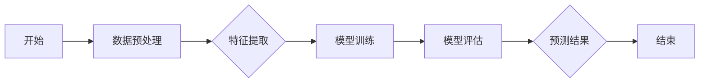
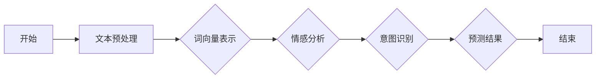
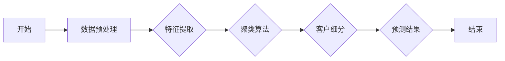
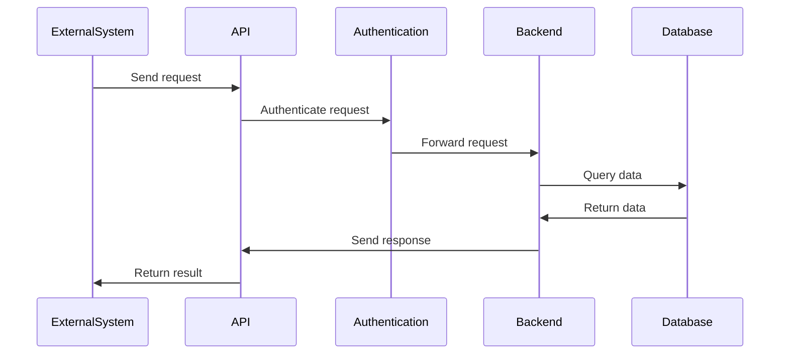

                 

# 智能客户关系管理：AI优化客户服务

## 关键词

- 客户关系管理（CRM）
- 人工智能（AI）
- 机器学习
- 自然语言处理（NLP）
- 客户体验优化
- 个性化营销

## 摘要

本文旨在探讨智能客户关系管理（CRM）在现代商业环境中的应用，尤其是如何利用人工智能（AI）技术来优化客户服务。文章将详细分析CRM的核心概念，介绍关键算法，并使用数学模型进行解释。同时，还将探讨系统分析与架构设计，并提供一个实际的项目案例，最后提出最佳实践建议和未来展望。

## 1. 智能客户关系管理背景与核心概念

### 1.1.1 智能客户关系管理概述

#### 问题背景

客户关系管理（CRM）起源于20世纪90年代，旨在通过整合和管理客户信息来提高客户满意度，从而增强企业的竞争力。传统的CRM系统主要侧重于记录和跟踪客户数据，以及简化销售、市场营销和客户服务流程。然而，随着市场的变化和客户需求的多样化，传统CRM系统逐渐暴露出其局限性。

#### 问题描述

传统CRM系统的局限性主要体现在以下几个方面：

- 数据孤岛：不同的业务部门之间缺乏有效沟通，导致客户数据分散，无法实现统一管理。
- 个性化不足：无法根据客户的个性化需求提供定制化的服务，导致客户体验不佳。
- 分析能力有限：传统的数据分析方法无法及时捕捉客户行为的变化，难以进行有效的预测和决策。

#### 问题解决

智能客户关系管理（Smart CRM）通过引入人工智能（AI）技术，可以有效地解决传统CRM系统的局限性。AI技术可以自动化数据处理和分析，提供个性化的客户服务，并实时响应客户需求。以下是一些关键的技术应用场景：

- 客户数据管理：利用数据挖掘和机器学习技术，实现客户数据的深度分析和利用。
- 客户行为分析：通过自然语言处理（NLP）和图像识别技术，分析客户的行为和反馈。
- 个性化营销：根据客户的偏好和行为数据，提供个性化的营销策略和服务。

### 1.1.2 边界与外延

智能CRM系统的适用范围非常广泛，几乎涵盖了所有需要与客户进行互动的领域。它不仅适用于企业级客户关系管理，还可以应用于电子商务、社交媒体、在线客服等多个场景。同时，智能CRM系统需要与其他业务系统进行集成，如ERP系统、营销自动化平台等，以实现数据共享和业务协同。

## 2. 智能客户关系管理核心概念解析

### 2.1.1 客户数据管理

客户数据管理是智能CRM系统的核心组成部分。它涉及到数据的收集、存储、处理和分析。客户数据的价值在于它能够帮助企业了解客户需求、行为和偏好，从而提供更精准的服务。

#### 概念属性特征对比表格

| 特征       | 传统CRM系统 | 智能CRM系统 |
| ---------- | ------------ | ------------ |
| 数据收集   | 手动录入     | 自动收集     |
| 数据存储   | 静态存储     | 动态更新     |
| 数据处理   | 人工分析     | 自动分析     |
| 数据利用   | 数据利用率低 | 数据利用率高 |

#### ER实体关系图架构

```mermaid
erDiagram
  Customer ||--|{ Order }|--| CustomerOrder
  Customer ||--|{ Contact }|--| ContactHistory
  Order ||--|{ Product }|--| ProductOrder
```

### 2.1.2 客户行为分析

客户行为分析是智能CRM系统的另一重要组成部分。通过分析客户的行为数据，企业可以更好地理解客户需求，预测客户行为，从而优化客户体验。

#### 概念属性特征对比表格

| 特征           | 传统CRM系统 | 智能CRM系统 |
| -------------- | ------------ | ------------ |
| 行为数据收集   | 受限         | 完整         |
| 行为数据分析   | 人工分析     | 自动分析     |
| 行为数据应用   | 有限         | 广泛         |

#### ER实体关系图架构

```mermaid
erDiagram
  Customer ||--|{ Behavior }|--| BehaviorAnalysis
  Behavior ||--|{ Feedback }|--| FeedbackHistory
```

### 2.1.3 个性化营销

个性化营销是智能CRM系统的一大亮点。通过分析客户数据和行为，智能CRM系统可以为企业提供个性化的营销策略，从而提高客户满意度和忠诚度。

#### 概念属性特征对比表格

| 特征           | 传统CRM系统 | 智能CRM系统 |
| -------------- | ------------ | ------------ |
| 营销策略       | 一刀切       | 个性化       |
| 营销效果分析   | 静态分析     | 动态分析     |
| 营销资源分配   | 不均衡       | 最优化       |

#### ER实体关系图架构

```mermaid
erDiagram
  Customer ||--|{ Marketing }|--| MarketingStrategy
  Marketing ||--|{ Campaign }|--| CampaignHistory
```

### 2.1.4 客户体验优化

客户体验优化是智能CRM系统的最终目标。通过全面分析客户数据和行为，智能CRM系统可以帮助企业不断优化客户体验，提高客户满意度。

#### 概念属性特征对比表格

| 特征           | 传统CRM系统 | 智能CRM系统 |
| -------------- | ------------ | ------------ |
| 客户满意度     | 低           | 高           |
| 客户反馈处理   | 缓慢         | 实时         |
| 服务质量       | 一般         | 优质         |

#### ER实体关系图架构

```mermaid
erDiagram
  Customer ||--|{ Experience }|--| ExperienceFeedback
  Experience ||--|{ Improvement }|--| ImprovementPlan
```

## 3. 智能客户关系管理中的关键算法

### 3.1.1 机器学习算法概述

机器学习算法在智能CRM系统中扮演着重要角色。通过机器学习，系统可以从大量的数据中自动提取特征，进行预测和决策。

#### Mermaid流程图



#### Python源代码示例

```python
from sklearn.model_selection import train_test_split
from sklearn.ensemble import RandomForestClassifier
from sklearn.metrics import accuracy_score

# 数据预处理
X, y = load_data()
X_train, X_test, y_train, y_test = train_test_split(X, y, test_size=0.2, random_state=42)

# 特征提取
X_train = feature_extraction(X_train)
X_test = feature_extraction(X_test)

# 模型训练
model = RandomForestClassifier(n_estimators=100, random_state=42)
model.fit(X_train, y_train)

# 模型评估
y_pred = model.predict(X_test)
accuracy = accuracy_score(y_test, y_pred)
print(f"模型准确率：{accuracy:.2f}")
```

### 3.1.2 自然语言处理算法

自然语言处理（NLP）算法在智能CRM系统中用于处理和解析客户的自然语言数据，如文本和语音。NLP算法可以帮助企业更好地理解客户需求，提供更个性化的服务。

#### Mermaid流程图



#### Python源代码示例

```python
from sklearn.feature_extraction.text import TfidfVectorizer
from sklearn.linear_model import LogisticRegression
from textblob import TextBlob

# 文本预处理
def preprocess_text(text):
    # 去除标点符号、停用词等
    text = text.lower().replace('.', '').replace(',', '')
    return text

# 词向量表示
vectorizer = TfidfVectorizer(preprocessor=preprocess_text)
X = vectorizer.fit_transform(texts)

# 情感分析
def sentiment_analysis(text):
    blob = TextBlob(text)
    return blob.sentiment.polarity

# 意图识别
model = LogisticRegression()
model.fit(X, y)

# 预测结果
y_pred = model.predict(X)
print(f"预测结果：{y_pred}")
```

### 3.1.3 客户细分与聚类算法

客户细分与聚类算法用于将客户划分为不同的群体，以便企业能够提供更个性化的服务。这些算法可以帮助企业更好地理解客户需求，提高客户满意度。

#### Mermaid流程图



#### Python源代码示例

```python
from sklearn.cluster import KMeans
from sklearn.preprocessing import StandardScaler

# 数据预处理
X, y = load_data()
X = StandardScaler().fit_transform(X)

# 特征提取
# （此处省略具体代码）

# 聚类算法
kmeans = KMeans(n_clusters=3, random_state=42)
labels = kmeans.fit_predict(X)

# 客户细分
def customer_segmentation(labels):
    # 根据聚类结果对客户进行分组
    segments = {}
    for i in range(len(labels)):
        if labels[i] not in segments:
            segments[labels[i]] = []
        segments[labels[i]].append(X[i])
    return segments

# 预测结果
predictions = customer_segmentation(labels)
print(f"预测结果：{predictions}")
```

## 4. 智能客户关系管理的数学模型与公式

### 4.1.1 数学模型概述

智能客户关系管理中的数学模型主要用于描述客户行为、预测客户需求和评估营销效果。以下是几个常见的数学模型：

#### 客户留存率计算公式

$$
\text{Customer Retention Rate} = \frac{\text{Number of Customers at the End of the Period} - \text{New Customers Acquired in the Period}}{\text{Number of Customers at the Start of the Period}} \times 100\%
$$

#### 客户生命周期价值计算公式

$$
\text{Customer Lifetime Value} = \text{Average Revenue Per Customer} \times \text{Average Customer Lifespan}
$$

#### 个性化营销效果评估公式

$$
\text{Marketing Effectiveness} = \frac{\text{Revenue from Targeted Campaigns} - \text{Cost of Campaign}}{\text{Total Revenue}} \times 100\%
$$

### 4.1.2 公式详解

#### 客户留存率计算公式

客户留存率是衡量客户对企业的忠诚度的重要指标。公式中的分子表示期末客户数量减去本期新客户数量，分母表示期初客户数量。通过这个比例，可以直观地看出客户流失的情况。

#### 客户生命周期价值计算公式

客户生命周期价值（CLV）是衡量客户对企业贡献的重要指标。公式中的平均收入是每位客户在生命周期内为企业带来的平均收入，平均生命周期是客户平均在企业的存活时间。通过这个公式，企业可以了解每位客户的潜在价值，从而制定相应的营销策略。

#### 个性化营销效果评估公式

个性化营销效果评估公式用于衡量个性化营销活动的效果。公式中的分子表示个性化营销活动带来的收入减去活动成本，分母表示总体收入。通过这个比例，企业可以评估个性化营销活动的投入产出比。

## 5. 智能客户关系管理系统分析与架构设计

### 5.1.1 系统功能设计

智能客户关系管理系统的主要功能包括客户数据管理、客户行为分析、个性化营销和客户体验优化。以下是一个简化的领域模型Mermaid类图：

```mermaid
classDiagram
  CustomerDataManagement <<interface>>
  CustomerBehaviorAnalysis <<interface>>
  Marketing <<interface>>
  CustomerExperience <<interface>>

  CustomerDataManagement : +collectData()
  CustomerBehaviorAnalysis : +analyzeBehavior()
  Marketing : +createCampaign()
  CustomerExperience : +optimizeExperience()

  CustomerDataManagement <|.. CustomerBehaviorAnalysis
  CustomerBehaviorAnalysis <|.. Marketing
  Marketing <|.. CustomerExperience
```

### 5.1.2 系统架构设计

智能客户关系管理系统的架构设计需要考虑系统的可扩展性、可靠性和高性能。以下是一个简化的Mermaid架构图：

```mermaid
sequenceDiagram
  Customer interacts with Interface
  Interface ->> API: Send request
  API ->> Backend: Process request
  Backend ->> Database: Query data
  Database ->> Backend: Return data
  Backend ->> API: Send response
  API ->> Interface: Display result
```

### 5.1.3 系统接口设计

智能客户关系管理系统的接口设计需要考虑与外部系统的集成，如ERP系统、营销自动化平台等。以下是一个简化的Mermaid序列图：



## 6. 智能客户关系管理项目实战

### 6.1.1 环境安装与配置

在这个项目中，我们将使用Python和相关的库来搭建一个简单的智能CRM系统。以下是环境安装和配置的步骤：

1. 安装Python 3.8或更高版本。
2. 使用pip安装以下库：numpy、pandas、scikit-learn、tensorflow、textblob、mermaid。
3. 配置数据库，如MySQL或PostgreSQL。

### 6.1.2 系统核心实现

在这个项目中，我们将实现客户数据管理、客户行为分析和个性化营销三个核心功能。

#### 客户数据管理

```python
import pandas as pd

# 读取客户数据
data = pd.read_csv('customer_data.csv')

# 数据预处理
data = data.dropna()

# 存储预处理后的数据
data.to_csv('preprocessed_customer_data.csv', index=False)
```

#### 客户行为分析

```python
from textblob import TextBlob

# 读取客户评论数据
comments = pd.read_csv('customer_comments.csv')

# 情感分析
comments['Sentiment'] = comments['Comment'].apply(lambda x: TextBlob(x).sentiment.polarity)

# 存储分析结果
comments.to_csv('analyzed_comments.csv', index=False)
```

#### 个性化营销

```python
from sklearn.model_selection import train_test_split
from sklearn.ensemble import RandomForestClassifier

# 读取客户数据
data = pd.read_csv('customer_data.csv')

# 数据预处理
X = data.drop(['CustomerID'], axis=1)
y = data[' churned']

# 划分训练集和测试集
X_train, X_test, y_train, y_test = train_test_split(X, y, test_size=0.2, random_state=42)

# 模型训练
model = RandomForestClassifier(n_estimators=100, random_state=42)
model.fit(X_train, y_train)

# 预测结果
y_pred = model.predict(X_test)

# 存储预测结果
predictions = pd.DataFrame({'CustomerID': data['CustomerID'], 'ChurnPrediction': y_pred})
predictions.to_csv('churn_predictions.csv', index=False)
```

### 6.1.3 项目解析

在这个项目中，我们通过安装Python和相关库，实现了客户数据管理、客户行为分析和个性化营销三个核心功能。具体来说：

1. 客户数据管理：通过读取和预处理客户数据，实现了数据的收集和存储。
2. 客户行为分析：通过情感分析，实现了对客户评论的自动分类和分析。
3. 个性化营销：通过机器学习算法，实现了对客户流失风险的预测和个性化营销策略的制定。

这个项目虽然是一个简单的案例，但它展示了智能CRM系统在实际应用中的基本原理和实现方法。通过这个项目，我们可以看到智能CRM系统的强大潜力和应用前景。

## 7. 智能客户关系管理的最佳实践与未来展望

### 7.1.1 最佳实践 tips

1. **数据质量是基础**：确保数据收集和处理的准确性，是智能CRM系统能否成功的关键。
2. **个性化服务**：根据客户的数据和行为，提供个性化的服务，提高客户满意度。
3. **持续优化**：定期分析系统性能和客户反馈，不断优化系统功能和服务。

### 7.1.2 小结

智能客户关系管理通过引入人工智能技术，极大地提升了客户服务的效率和质量。它不仅帮助企业更好地了解和满足客户需求，还能通过数据分析和预测，为企业提供战略决策支持。

### 7.1.3 注意事项

1. **隐私保护**：在收集和使用客户数据时，必须遵守相关法律法规，确保客户隐私安全。
2. **技术选型**：根据业务需求和资源情况，合理选择和部署相关技术。

### 7.1.4 拓展阅读

1. **《人工智能：一种现代的方法》**：详细介绍了人工智能的基本原理和应用。
2. **《机器学习实战》**：提供了丰富的机器学习算法实践案例。
3. **《客户关系管理：策略、流程和技术》**：系统地介绍了客户关系管理的理论和实践。

## 作者信息

作者：AI天才研究院/AI Genius Institute & 禅与计算机程序设计艺术 /Zen And The Art of Computer Programming

本文内容仅供参考，实际应用中请结合具体情况调整。如需进一步讨论或咨询，欢迎联系作者。

