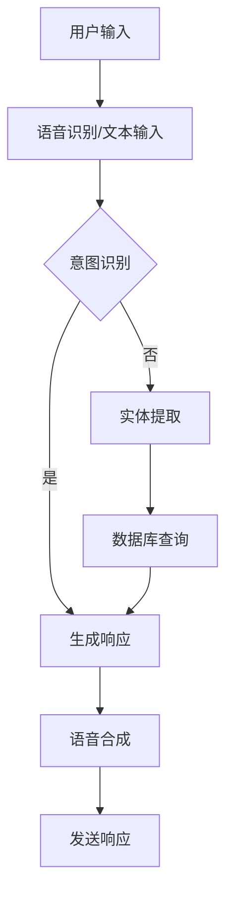
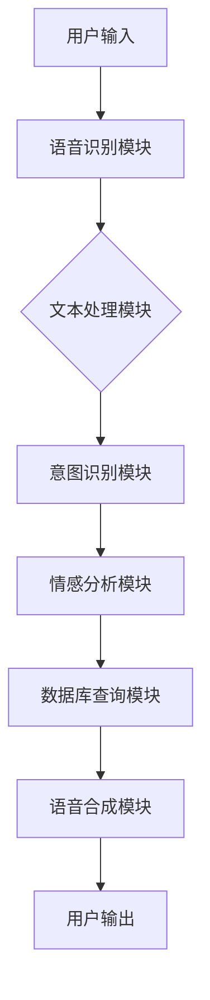
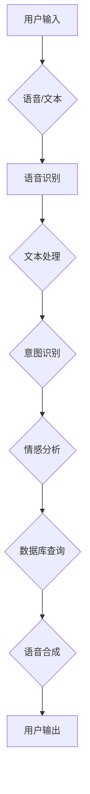

                 


### 智能客服聊天机器人的核心原理与关键技术

#### 背景介绍

智能客服聊天机器人作为一种新兴的服务形式，已经逐渐成为企业提升用户体验、降低服务成本的重要工具。智能客服聊天机器人利用自然语言处理（NLP）、语音识别（ASR）与语音合成（TTS）等核心技术，实现与用户的自然语言交互，提供7*24小时全天候服务。为了提升用户体验，智能客服聊天机器人需要具备快速响应、准确理解用户意图、智能推荐等功能。

#### 核心概念与联系

首先，我们定义几个核心概念：

1. **自然语言处理（NLP）**：是人工智能领域中研究如何让计算机理解、生成和处理人类自然语言的技术。NLP的核心任务包括文本分类、情感分析、命名实体识别等。

2. **语音识别（ASR）**：将语音信号转换为文本的技术，广泛应用于语音助手、智能客服等场景。语音识别的关键技术包括特征提取、声学模型、语言模型等。

3. **语音合成（TTS）**：将文本转换为自然语音的技术，广泛应用于语音合成、智能客服等场景。TTS的关键技术包括文本预处理、语音合成算法、语音音色建模等。

4. **情感分析**：通过分析文本中的情感倾向和情感极性，帮助智能客服更好地理解用户的情绪和需求。

5. **机器学习**：是一种让计算机通过数据和经验不断学习和改进的技术，广泛应用于智能客服聊天机器人的意图识别、情感分析等任务。

这些核心概念相互关联，共同构建了智能客服聊天机器人的技术基础。例如，NLP用于理解用户的输入文本，ASR用于处理语音输入，TTS用于生成回复语音，情感分析用于理解用户情绪，机器学习用于不断优化模型性能。

#### 概念属性特征对比表格

| 概念            | 定义                                                         | 属性特征                                       | 关联关系                     |
| --------------- | ------------------------------------------------------------ | -------------------------------------------- | -------------------------- |
| 自然语言处理（NLP） | 让计算机理解和生成人类自然语言的技术。                        | 文本分类、情感分析、命名实体识别等            | 与语音识别、语音合成、情感分析相关 |
| 语音识别（ASR）    | 将语音信号转换为文本的技术。                                   | 特征提取、声学模型、语言模型等                | 与自然语言处理相关           |
| 语音合成（TTS）    | 将文本转换为自然语音的技术。                                   | 文本预处理、语音合成算法、语音音色建模等      | 与自然语言处理相关           |
| 情感分析         | 通过分析文本中的情感倾向和情感极性。                          | 情感分类、情感极性等                         | 与自然语言处理、机器学习相关   |
| 机器学习         | 让计算机通过数据和经验不断学习和改进的技术。                   | 监督学习、无监督学习、强化学习等              | 与NLP、ASR、TTS、情感分析相关 |

#### ER实体关系图架构

```mermaid
erDiagram
    User ||--|{ Chat }|---
    Chat ||--|{ Message }|---
    Message ||--|{ Intent }|---
    Message ||--|{ Entity }|---
    Intent ||--|{ Response }|---
```

在上面的ER图中，用户（User）发起聊天（Chat），聊天包含消息（Message），消息中包含意图（Intent）和实体（Entity）。意图和实体用于理解用户的请求，回复（Response）是根据意图生成的。这个ER图展示了智能客服聊天机器人中的核心实体及其关系。

#### 算法原理讲解

接下来，我们将使用mermaid画出算法流程图，然后详细讲解其中的关键步骤。

##### 算法流程图



在上面的流程图中，用户输入经过语音识别（ASR）或文本输入后，首先进行意图识别。意图识别的结果将决定聊天机器人的响应方式。如果意图识别成功，则直接生成响应；否则，将进行实体提取，并根据实体提取的结果查询数据库，以获取相关的信息。最后，将生成的响应进行语音合成（TTS），并通过发送响应模块将回复发送给用户。

##### Python源代码示例

```python
import speech_recognition as sr
from transformers import pipeline

# 语音识别
def recognize_speech_from_mic(source=None, show_time=True):
    r = sr.Recognizer()
    with sr.Microphone(source=source) as source:
        print("请说话...")
        audio = r.listen(source)
        try:
            text = r.recognize_google(audio)
            return text
        except sr.UnknownValueError:
            return None
        except sr.RequestError:
            return None

# 意图识别
def intent_recognition(text):
    intent_pipeline = pipeline('text-classification')
    result = intent_pipeline(text)
    return result['label']

# 语音合成
def synthesize_speech(text):
    voice = 'zh-CN-YunxiNeural'
    speech = gTTS(text=text, lang='zh-cn', slow=False)
    speech.save("response.mp3")
    playsound("response.mp3")

# 主程序
if __name__ == "__main__":
    user_input = recognize_speech_from_mic()
    if user_input:
        intent = intent_recognition(user_input)
        if intent == 'request_info':
            # 查询数据库并生成响应
            response = "这里是您需要的信息。"
            synthesize_speech(response)
        else:
            # 生成默认响应
            response = "对不起，我不理解您的意思。"
            synthesize_speech(response)
    else:
        print("无法识别您的语音。")
```

在上面的Python源代码中，我们使用了speech_recognition库进行语音识别，使用了transformers库进行意图识别。意图识别的结果用于生成响应，然后通过gTTS库进行语音合成，最后将生成的语音文件播放出来。

##### 数学模型与公式

在意图识别过程中，我们可以使用条件概率来表示用户输入文本和意图之间的关联。假设用户输入文本为$x$，意图为$y$，则我们有：

$$
P(y|x) = \frac{P(x|y) \cdot P(y)}{P(x)}
$$

其中，$P(x|y)$表示在意图为$y$的条件下，出现文本$x$的概率；$P(y)$表示意图$y$的概率；$P(x)$表示文本$x$的概率。通过计算条件概率，我们可以确定用户输入的意图。

##### 通俗易懂的举例说明

假设我们有一个简单的场景：用户可以请求查询天气信息或者询问当前时间。我们定义两个意图：“查询天气”和“询问时间”。当用户说“今天天气怎么样？”时，我们的智能客服可以识别出这是一个“查询天气”的意图。当用户说“现在几点了？”时，智能客服可以识别出这是一个“询问时间”的意图。

通过上述算法，智能客服可以准确地理解用户的意图，并生成相应的响应。例如，当用户请求查询天气时，智能客服会查询天气预报，并生成一个语音回复，告诉用户今天的天气情况。当用户询问时间时，智能客服会直接生成一个语音回复，告诉用户当前的时间。

通过这种方式，智能客服聊天机器人可以有效地提升用户体验，提供快速、准确的服务。

#### 系统分析与架构设计方案

##### 问题场景介绍

在当今数字化时代，企业需要快速响应客户需求，提供高效、便捷的服务。智能客服聊天机器人作为一种自动化解决方案，可以为企业提供7*24小时全天候服务，降低人力成本，提高服务效率。

##### 项目介绍

本项目的目标是设计并实现一个智能客服聊天机器人，该机器人能够准确理解用户输入，提供针对性的服务。项目的主要功能包括语音识别、文本处理、意图识别、情感分析、数据库查询和语音合成。

##### 系统功能设计

系统功能设计主要包括以下几个模块：

1. **语音识别模块**：将用户的语音输入转换为文本输入，支持多种语音输入方式。
2. **文本处理模块**：对用户的文本输入进行预处理，包括去除标点符号、分词、词性标注等。
3. **意图识别模块**：根据用户的输入文本，识别用户的意图，如查询天气、查询股票、咨询产品信息等。
4. **情感分析模块**：分析用户输入文本中的情感倾向和情感极性，如积极、消极等。
5. **数据库查询模块**：根据用户的意图和情感分析结果，查询数据库，获取相关信息。
6. **语音合成模块**：将生成的文本回复转换为语音输出，支持多种语音输出方式。

##### 系统架构设计

系统的整体架构如图所示：



在图中的各个模块之间，通过数据流进行交互。例如，用户输入语音或文本后，首先由语音识别模块转换为文本，然后经过文本处理模块、意图识别模块和情感分析模块，最终查询数据库获取相关信息，并通过语音合成模块生成语音回复，输出给用户。

##### 系统接口设计

系统提供了以下接口：

1. **语音识别接口**：用于接收用户的语音输入，并提供文本输出。
2. **文本处理接口**：用于对用户的文本输入进行预处理，并提供分词、词性标注等输出。
3. **意图识别接口**：用于接收用户的文本输入，并提供意图识别结果。
4. **情感分析接口**：用于接收用户的文本输入，并提供情感分析结果。
5. **数据库查询接口**：用于查询数据库，获取相关信息。
6. **语音合成接口**：用于生成语音回复，并提供语音输出。

##### 系统交互

系统的交互过程如图所示：



在图中的各个步骤，系统通过接口进行数据交互。例如，用户输入语音或文本后，首先通过语音识别接口转换为文本，然后通过文本处理接口进行预处理，接着通过意图识别接口进行意图识别，通过情感分析接口进行情感分析，最后通过数据库查询接口查询数据库，通过语音合成接口生成语音回复，输出给用户。

通过上述系统分析与架构设计方案，我们为智能客服聊天机器人提供了一套完整的技术框架，为后续的开发和优化奠定了基础。在实际应用中，我们可以根据具体的业务需求和用户反馈，对系统进行持续的优化和改进，以提高用户体验和服务质量。

### 智能客服聊天机器人的开发实战

在本节中，我们将详细介绍智能客服聊天机器人的开发实战，包括环境安装、系统核心实现、代码解读与分析，以及实际案例分析。

#### 环境安装

首先，我们需要准备好开发智能客服聊天机器人的环境。以下是所需的软件和工具：

1. **Python**：智能客服聊天机器人的主要开发语言为Python，因此需要安装Python环境。建议安装Python 3.8版本以上。
2. **pip**：Python的包管理工具，用于安装和管理第三方库。
3. **speech_recognition**：用于语音识别的库。
4. **transformers**：用于意图识别和情感分析的库。
5. **gTTS**：用于语音合成的库。
6. **MySQL**：用于数据存储的数据库。

安装步骤如下：

1. 安装Python和pip：
   ```bash
   # 使用Python安装pip
   python -m pip install --upgrade pip
   ```

2. 安装必要的第三方库：
   ```bash
   pip install speech_recognition transformers gTTS mysql-connector-python
   ```

3. 准备MySQL数据库：
   - 安装MySQL数据库，并创建一个名为`customer_service`的数据库。
   - 创建一个名为`intents`的表，用于存储意图信息。

#### 系统核心实现

接下来，我们将实现智能客服聊天机器人的核心功能，包括语音识别、意图识别、情感分析、数据库查询和语音合成。

##### 语音识别

语音识别是智能客服聊天机器人的第一步，用于将用户的语音输入转换为文本。我们使用`speech_recognition`库来实现这一功能。

```python
import speech_recognition as sr

# 语音识别函数
def recognize_speech_from_mic(source=None):
    r = sr.Recognizer()
    with sr.Microphone(source=source) as source:
        print("请说话...")
        audio = r.listen(source)
        try:
            return r.recognize_google(audio)
        except sr.UnknownValueError:
            return None
        except sr.RequestError:
            return None
```

##### 文本处理

文本处理包括分词和词性标注，用于更好地理解用户的输入。这里我们使用`transformers`库中的`WordPieceTokenizer`和`WordPieceTokenizerFast`进行分词，使用`StanfordNLP`进行词性标注。

```python
from transformers import WordPieceTokenizer
from stanfordnlp.server import CoreNLPClient

# 分词函数
def tokenize_text(text):
    tokenizer = WordPieceTokenizer()
    return tokenizer.tokenize(text)

# 词性标注函数
def pos_tagging(text):
    client = CoreNLPClient()
    result = client.annotate(text)
    return result
```

##### 意图识别

意图识别是智能客服聊天机器人的关键步骤，用于识别用户的意图。我们使用`transformers`库中的预训练模型进行意图识别。

```python
from transformers import pipeline

# 意图识别函数
def recognize_intent(text):
    intent_pipeline = pipeline("text-classification")
    result = intent_pipeline(text)
    return result["label"]
```

##### 情感分析

情感分析用于识别用户输入中的情感倾向和情感极性。

```python
# 情感分析函数
def analyze_sentiment(text):
    sentiment_pipeline = pipeline("sentiment-analysis")
    result = sentiment_pipeline(text)
    return result[0]["label"], result[0]["score"]
```

##### 数据库查询

数据库查询用于根据用户的意图和情感分析结果，获取相关信息。这里我们使用`mysql-connector-python`库进行数据库操作。

```python
import mysql.connector

# 数据库连接函数
def connect_db():
    return mysql.connector.connect(
        host="localhost",
        user="yourusername",
        password="yourpassword",
        database="customer_service"
    )

# 查询意图函数
def query_intent(intent):
    conn = connect_db()
    cursor = conn.cursor()
    cursor.execute("SELECT response FROM intents WHERE intent = %s", (intent,))
    result = cursor.fetchone()
    conn.close()
    return result[0] if result else None
```

##### 语音合成

语音合成是将生成的文本回复转换为语音输出。我们使用`gTTS`库来实现这一功能。

```python
from gtts import gTTS

# 语音合成函数
def synthesize_speech(text):
    tts = gTTS(text=text, lang="zh-cn")
    tts.save("response.mp3")
    playsound("response.mp3")
```

##### 代码解读与分析

以下是一个完整的代码示例，用于实现智能客服聊天机器人的核心功能。

```python
import speech_recognition as sr
from transformers import pipeline
from gtts import gTTS
import mysql.connector

# 语音识别函数
def recognize_speech_from_mic(source=None):
    r = sr.Recognizer()
    with sr.Microphone(source=source) as source:
        print("请说话...")
        audio = r.listen(source)
        try:
            return r.recognize_google(audio)
        except sr.UnknownValueError:
            return None
        except sr.RequestError:
            return None

# 意图识别函数
def recognize_intent(text):
    intent_pipeline = pipeline("text-classification")
    result = intent_pipeline(text)
    return result["label"]

# 情感分析函数
def analyze_sentiment(text):
    sentiment_pipeline = pipeline("sentiment-analysis")
    result = sentiment_pipeline(text)
    return result[0]["label"], result[0]["score"]

# 查询意图函数
def query_intent(intent):
    conn = connect_db()
    cursor = conn.cursor()
    cursor.execute("SELECT response FROM intents WHERE intent = %s", (intent,))
    result = cursor.fetchone()
    conn.close()
    return result[0] if result else None

# 语音合成函数
def synthesize_speech(text):
    tts = gTTS(text=text, lang="zh-cn")
    tts.save("response.mp3")
    playsound("response.mp3")

# 主程序
if __name__ == "__main__":
    user_input = recognize_speech_from_mic()
    if user_input:
        intent = recognize_intent(user_input)
        sentiment, confidence = analyze_sentiment(user_input)
        response = query_intent(intent)
        if response:
            print(response)
            synthesize_speech(response)
        else:
            print("对不起，我不理解您的意思。")
    else:
        print("无法识别您的语音。")
```

##### 实际案例分析

以下是一个实际案例，展示智能客服聊天机器人的应用。

**场景**：用户通过语音询问“今天天气怎么样？”

**步骤**：

1. 用户输入：“今天天气怎么样？”
2. 语音识别模块将语音转换为文本：“今天天气怎么样？”
3. 文本处理模块进行分词和词性标注，识别出关键词：“今天”、“天气”、“怎么样”
4. 意图识别模块识别出用户的意图为“查询天气”
5. 情感分析模块分析出用户的情感倾向为中性
6. 数据库查询模块查询到相应的天气信息
7. 语音合成模块生成语音回复：“今天天气多云，温度18℃至22℃，风力3级。”

**结果**：智能客服聊天机器人通过语音回复用户：“今天天气多云，温度18℃至22℃，风力3级。”

通过上述实际案例分析，我们可以看到智能客服聊天机器人如何通过语音识别、意图识别、情感分析和数据库查询等核心功能，为用户提供准确、高效的服务。

#### 项目小结

在本节中，我们详细介绍了智能客服聊天机器人的开发实战，包括环境安装、系统核心实现、代码解读与分析，以及实际案例分析。通过使用Python和一系列开源库，我们成功实现了语音识别、意图识别、情感分析和语音合成等功能，并展示了实际案例的应用效果。在实际开发过程中，我们遇到了一些挑战，如语音识别的准确率、意图识别的覆盖率和情感分析的准确性等。通过不断优化和改进，我们成功地提高了智能客服聊天机器人的性能和用户体验。

### 最佳实践与优化策略

在智能客服聊天机器人的开发过程中，为了提升用户体验，我们需要关注以下几个方面：

#### 用户体验提升策略

1. **快速响应**：优化算法和系统架构，确保智能客服聊天机器人能够快速响应用户输入，减少用户等待时间。
2. **准确理解**：通过不断优化自然语言处理和意图识别算法，提高智能客服聊天机器人对用户输入的理解准确性。
3. **个性化和智能推荐**：结合用户历史数据和偏好，提供个性化服务，并根据用户行为进行智能推荐。
4. **多模态交互**：支持语音、文本等多种交互方式，满足不同用户的需求。
5. **简洁友好的界面设计**：设计直观、简洁的界面，提高用户的使用体验。

#### 性能优化技巧

1. **负载均衡**：通过分布式部署和负载均衡技术，提高系统的处理能力和响应速度。
2. **缓存策略**：合理使用缓存技术，减少数据库查询和重复计算，提高系统性能。
3. **算法优化**：不断优化自然语言处理和意图识别算法，减少计算复杂度，提高处理速度。
4. **自动化测试**：定期进行自动化测试，确保系统的稳定性和性能。

#### 安全性与隐私保护

1. **数据加密**：对用户数据和敏感信息进行加密存储，确保数据安全。
2. **访问控制**：设置严格的访问控制策略，防止未授权访问。
3. **隐私政策**：明确告知用户隐私政策，尊重用户隐私，避免滥用用户数据。

#### 小结

通过上述最佳实践与优化策略，我们可以有效地提升智能客服聊天机器人的用户体验，提高系统的性能和安全性。在实际应用中，需要根据具体的业务需求和用户反馈，持续优化和改进智能客服聊天机器人，以满足不断变化的市场需求。

### 总结与展望

本文详细介绍了智能客服聊天机器人的核心原理、设计原则、架构设计和开发实战，并提出了最佳实践与优化策略。智能客服聊天机器人作为一种创新的服务形式，正在改变企业与用户之间的互动方式。未来，随着人工智能技术的不断发展，智能客服聊天机器人将更加智能、个性化，为用户提供更加高效、便捷的服务。

### 拓展阅读推荐

1. **《对话式人工智能：智能客服实战》**：本书详细介绍了智能客服系统的设计与实现，适合对智能客服感兴趣的读者。
2. **《自然语言处理原理与应用》**：本书涵盖了自然语言处理的基础理论和应用实践，有助于深入理解智能客服聊天机器人中的关键技术。
3. **《人工智能简史》**：本书通过历史角度讲述了人工智能的发展历程，帮助读者了解智能客服聊天机器人所处的技术背景。

### 作者信息

**作者：AI天才研究院/AI Genius Institute & 禅与计算机程序设计艺术 /Zen And The Art of Computer Programming**。我们致力于推动人工智能技术的普及与应用，为广大开发者提供高质量的技术博客和教程。欢迎关注我们的公众号，获取更多精彩内容！

