                 

### 文章标题：智能家居中枢：AI大模型打造智慧生活

#### 关键词：
- **智能家居**
- **AI大模型**
- **智慧生活**
- **中枢系统**
- **语音识别**
- **自然语言处理**
- **推荐系统**
- **数据分析**

#### 摘要：
本文将深入探讨智能家居中枢系统及其如何通过AI大模型实现智慧生活。我们将从智能家居的背景和发展开始，逐步介绍AI大模型的基本原理和应用，详细讨论智能家居的架构设计、AI大模型在智能家居中的应用、数据分析和处理技术，最后通过实际案例展示智能家居中枢系统的开发与优化。本文旨在为读者提供一个全面而深入的技术指南，帮助理解和构建智能家居中枢系统。

### 第一部分：智能家居与AI大模型基础

#### 第1章：智能家居概述

##### 1.1 智能家居的发展背景

智能家居作为一个新兴领域，其发展背景深受技术进步和用户需求的双重推动。在20世纪80年代，随着计算机技术和互联网的兴起，智能家居的概念逐渐成形。早期的智能家居系统主要以家庭自动化为核心，通过遥控器或者计算机控制家庭设备，如灯光、窗帘和温控系统等。然而，这些系统往往较为单一，缺乏整体性和智能性。

随着物联网（IoT）技术的发展，智能家居开始进入一个新的发展阶段。物联网使得家庭设备能够通过网络进行连接和数据交换，从而实现更为复杂的控制和互动。现代智能家居系统不仅包括了传统家庭自动化设备，还引入了智能传感器、智能家电和智能安防系统等，为用户提供更加便捷和智能的生活方式。

##### 1.1.1 智能家居的定义与核心概念

智能家居（Smart Home）是指利用网络技术和智能设备，将家庭中的各种设备连接起来，通过自动化和智能化的方式实现家庭管理和服务的系统。核心概念包括：

- **设备联网**：通过物联网技术，将家庭中的各种设备连接到同一网络，实现设备间的数据通信和协作。
- **自动化控制**：利用自动化系统，自动执行日常任务，如调节温度、光线和安防监控等。
- **远程控制**：通过手机、电脑等智能设备，远程监控和控制家庭设备。
- **数据分析与优化**：通过收集和分析家庭数据，优化设备和系统的运行，提高能效和用户体验。

##### 1.1.2 智能家居的起源与发展历程

智能家居的起源可以追溯到20世纪80年代，随着计算机技术的进步，一些富有前瞻性的公司开始尝试将计算机技术应用到家庭生活中。最早的智能家居系统主要是基于中央控制系统，通过计算机来控制家庭中的各种设备。例如，1984年，美国Sun Microsystems公司推出的Sun Home系统，就是一个早期的智能家居解决方案。

随着物联网技术的发展，智能家居开始进入快速发展的阶段。2005年，英特尔公司推出了“智能互联家庭”计划，推动了智能家居技术的普及。此后，谷歌、亚马逊、苹果等科技公司纷纷进入智能家居市场，推出了一系列智能设备和平台，进一步推动了智能家居技术的发展。

##### 1.1.3 智能家居的现状与未来趋势

目前，智能家居市场已经呈现出蓬勃发展的态势。根据市场研究机构的统计，全球智能家居市场规模在近年来持续扩大，预计到2025年将达到数千亿美元。智能家居设备种类日益丰富，包括智能灯泡、智能插座、智能门锁、智能摄像头等，这些设备通过联网实现了智能控制和远程监控。

未来，智能家居的发展趋势将体现在以下几个方面：

- **技术融合**：智能家居将与物联网、大数据、人工智能等新兴技术进一步融合，实现更加智能化和个性化的服务。
- **智能家居系统的集成**：未来的智能家居系统将更加注重系统的整体性和集成性，用户可以通过一个平台统一管理家庭中的各种设备。
- **生态化发展**：智能家居市场将呈现出生态化的趋势，不同品牌和技术的设备将更加兼容，形成统一的智能家居生态圈。

##### 1.2 AI大模型概述

##### 1.2.1 AI大模型的定义与核心概念

AI大模型（Large-scale AI Models）是指具有海量参数和强大计算能力的深度学习模型。这些模型通过对大量数据进行训练，能够自动学习和发现数据中的模式和规律，从而实现各种复杂任务。AI大模型的核心概念包括：

- **深度神经网络**：AI大模型基于多层神经网络结构，通过逐层提取特征，实现高度抽象的表示能力。
- **大规模训练数据**：AI大模型需要大量的训练数据来学习，通常这些数据来自于互联网、传感器和用户生成内容等。
- **分布式计算**：为了训练大规模模型，需要使用分布式计算资源，如云计算和GPU集群等。

##### 1.2.2 AI大模型的基本原理与特点

AI大模型的基本原理是通过多层神经网络对输入数据进行特征提取和模式识别。每一层神经网络都会对输入数据进行处理，并输出新的特征，这些特征逐渐抽象，直至达到模型所需的表示能力。

AI大模型的特点包括：

- **强大的表示能力**：通过多层神经网络的堆叠，AI大模型能够自动学习并提取高度抽象的特征，从而处理复杂任务。
- **端到端的学习**：AI大模型可以直接从原始数据中学习到最终的输出，无需手动设计特征和中间层。
- **大规模计算能力**：AI大模型通常需要大量的计算资源来训练，通过分布式计算技术可以实现高效训练。
- **自动优化**：AI大模型通过自动调整参数，实现对任务的优化，无需人工干预。

##### 1.2.3 AI大模型在智能家居中的应用

AI大模型在智能家居中的应用非常广泛，以下是一些典型的应用场景：

- **语音识别与自然语言处理**：通过AI大模型，智能家居系统可以实现对用户语音指令的识别和处理，如语音控制灯光、调节温度等。
- **智能推荐系统**：AI大模型可以根据用户的行为数据，推荐合适的智能家居产品或服务，提高用户体验。
- **安防监控与异常检测**：AI大模型可以通过对监控视频进行分析，实现实时安防监控和异常行为检测。
- **能耗管理**：AI大模型可以分析家庭的能耗数据，优化家庭能源使用，降低能耗。

##### 1.3 AI大模型的基本架构与实现

##### 1.3.1 AI大模型的基本结构

AI大模型的基本结构通常包括输入层、隐藏层和输出层。输入层接收原始数据，隐藏层通过多层神经网络对数据进行特征提取和转换，输出层生成最终的结果。以下是一个典型的AI大模型结构的Mermaid流程图：

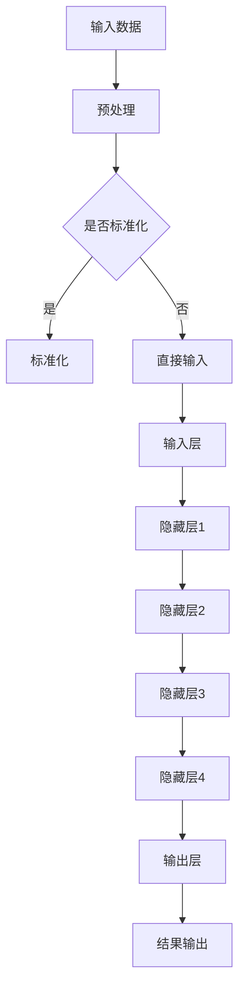

##### 1.3.2 AI大模型的训练与优化

AI大模型的训练过程包括数据预处理、模型训练、参数优化和模型评估等环节。以下是一个简化的AI大模型训练过程的Mermaid流程图：

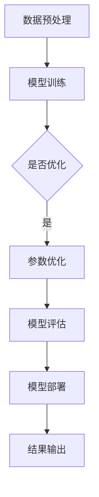

在模型训练过程中，通常使用反向传播算法（Backpropagation Algorithm）来调整模型的参数，使模型的输出与真实值之间的误差最小。以下是一个反向传播算法的Mermaid流程图：

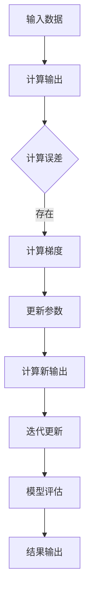

##### 1.3.3 AI大模型的部署与实现

AI大模型的部署与实现涉及到硬件选择、软件平台和部署策略等方面。以下是一个简化的AI大模型部署过程的Mermaid流程图：

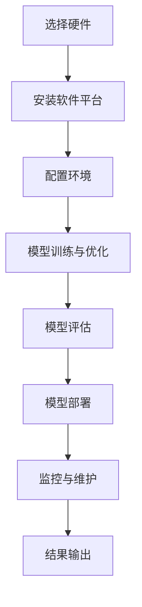

在模型部署过程中，需要选择合适的硬件资源，如GPU、CPU和TPU等，以支持大规模模型的训练和推理。同时，需要配置相应的软件平台，如TensorFlow、PyTorch等，以实现模型的训练、优化和部署。

### 第二部分：智能家居的架构设计

#### 第2章：智能家居的架构设计

##### 2.1 智能家居的整体架构设计

智能家居的整体架构设计是构建智能家居系统的关键步骤，它决定了系统的功能实现、性能表现和安全稳定性。一个典型的智能家居系统架构通常包括以下几个主要层次：

1. **感知层**：感知层是智能家居系统的数据输入部分，由各种传感器和智能设备组成，如温度传感器、湿度传感器、门窗传感器、智能灯泡、智能插座等。这些设备实时收集家庭环境数据，并将数据发送到上层处理系统。

2. **网络层**：网络层负责将感知层收集到的数据传输到中心控制系统。常见的网络技术包括Wi-Fi、ZigBee、蓝牙和有线网络等。网络层的设计需要考虑数据的传输速度、稳定性和安全性。

3. **中心控制层**：中心控制层是智能家居系统的核心部分，负责处理和整合来自网络层的各类数据，并进行智能分析和决策。中心控制层通常包括智能网关、智能中枢、云平台等。智能网关负责将不同协议的数据进行统一处理和转发，智能中枢则负责执行智能算法和决策逻辑，云平台提供数据存储和远程访问功能。

4. **应用层**：应用层是智能家居系统的用户交互界面，包括移动应用、Web端、智能音箱等。用户通过应用层与智能家居系统进行交互，控制家庭设备、查看设备状态、接收通知等。

##### 2.1.1 智能家居系统的分层架构

分层架构是智能家居系统设计的一个重要原则，它有助于提高系统的模块化、可维护性和扩展性。以下是一个典型的智能家居系统分层架构的Mermaid类图：

```mermaid
classDiagram
    感知层 <<interface>> 设备接口
    网络层 <<interface>> 数据传输
    中心控制层 <<component>> 智能中枢
    中心控制层 <<component>> 云平台
    应用层 <<component>> 移动应用
    应用层 <<component>> Web端
    应用层 <<component>> 智能音箱

    设备接口 --|> 网络层
    网络层 --|> 中心控制层
    中心控制层 --|> 应用层
```

##### 2.1.2 智能家居系统的功能模块

智能家居系统的功能模块是实现系统功能的核心，以下是一些常见的功能模块及其简要描述：

- **设备管理模块**：负责管理智能家居系统中的各种设备，包括设备的添加、删除、配置和状态监控等。
- **控制模块**：实现用户对家庭设备的远程控制和自动化控制，如通过移动应用或智能音箱控制灯光、温度、安防设备等。
- **数据分析与优化模块**：通过对设备运行数据和用户行为数据进行分析，优化设备性能和用户体验，如能耗管理、设备故障预测等。
- **安防监控模块**：实现家庭安全监控功能，包括实时视频监控、异常行为检测、报警通知等。
- **用户界面模块**：提供用户交互界面，包括移动应用、Web端、智能音箱等，用户可以通过这些界面查看设备状态、控制设备、接收通知等。
- **数据存储与同步模块**：负责数据的存储和同步，确保系统的可靠性和数据一致性。

##### 2.1.3 智能家居系统的数据流设计

智能家居系统的数据流设计是系统架构设计的重要组成部分，它决定了数据的传输路径和处理流程。以下是一个典型的智能家居系统数据流设计示意图：

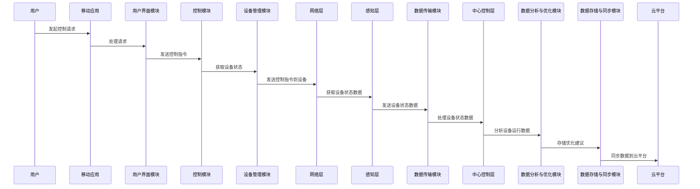

##### 2.2 智能家居的硬件选择与搭建

智能家居系统的硬件选择与搭建是系统设计的关键环节，它直接影响系统的性能、稳定性和用户体验。以下是一些常见的智能家居硬件设备和搭建步骤：

###### 2.2.1 智能家居的常用硬件设备

- **智能网关**：智能网关是智能家居系统的中枢，负责将各种协议的设备连接到同一网络，并统一处理和转发数据。常见的智能网关设备包括小米智能网关、华为智能网关等。
- **智能传感器**：智能传感器是智能家居系统的感知层设备，负责实时监测家庭环境数据，如温度传感器、湿度传感器、烟雾传感器、门窗传感器等。
- **智能家电**：智能家电是智能家居系统的执行层设备，包括智能灯泡、智能插座、智能空调、智能电视等，用户可以通过移动应用或语音控制来操作这些设备。
- **智能安防设备**：智能安防设备包括智能摄像头、智能门锁、智能报警器等，用于实时监控家庭安全，并在异常情况下发出警报。
- **智能音响**：智能音响是智能家居系统的语音交互设备，常见的智能音响包括天猫精灵、小爱同学、谷歌Home等。

###### 2.2.2 硬件设备的连接与配置

- **智能网关的连接与配置**：将智能网关连接到家庭的Wi-Fi网络，并使用手机应用或Web端进行配置，添加设备、设置网络参数等。
- **智能传感器的连接与配置**：将智能传感器与智能网关连接，通常使用有线或无线的方式，并根据设备说明进行配置，设置传感器参数、数据上报频率等。
- **智能家电的连接与配置**：将智能家电连接到家庭的电源和网络，使用手机应用或智能音箱进行配置，绑定设备、设置控制规则等。
- **智能安防设备的连接与配置**：将智能安防设备连接到家庭的电源和网络，使用手机应用或智能音箱进行配置，设置监控区域、报警阈值等。

###### 2.2.3 硬件设备的选择与优化

在选择智能家居硬件设备时，需要考虑以下几个方面：

- **兼容性**：选择兼容性较好的设备，确保设备之间能够互联互通，避免设备兼容性问题。
- **性能**：根据实际需求选择性能合适的设备，如传感器的精度、家电的功耗和响应速度等。
- **易用性**：选择易用性较好的设备，降低用户的操作难度，提高用户体验。
- **安全性**：选择安全性较高的设备，确保家庭数据的安全和隐私保护。

通过合理的硬件选择与搭建，可以构建一个高效、稳定和智能的智能家居系统，为用户提供便捷和智能化的家庭生活体验。

### 第三部分：AI大模型在智能家居中的应用

#### 第3章：AI大模型在智能家居中的功能实现

AI大模型在智能家居中的应用极大地提升了系统的智能化水平和用户体验。本节将重点介绍AI大模型在智能家居中的几个关键功能，包括语音识别与自然语言处理、智能推荐系统以及安防监控与异常检测。

##### 3.1 语音识别与自然语言处理

语音识别（Speech Recognition）与自然语言处理（Natural Language Processing，NLP）是AI大模型在智能家居中应用的重要领域。通过这些技术，用户可以轻松地通过语音指令控制家庭设备，实现智能交互。

###### 3.1.1 语音识别的原理与实现

语音识别是将语音信号转换为文本的过程，其核心在于将语音信号转换为特征向量，然后通过深度学习模型进行文本识别。以下是一个简化的语音识别过程：

1. **音频预处理**：将原始音频信号进行预处理，包括去噪、分帧和特征提取等步骤。常用的特征提取方法包括梅尔频率倒谱系数（MFCC）和自动差分和倒谱归一化（DCT）等。
2. **特征向量生成**：将预处理后的音频信号转换为特征向量，用于后续的模型训练和预测。
3. **模型训练**：使用大量的语音数据对深度学习模型进行训练，常用的模型包括卷积神经网络（CNN）和递归神经网络（RNN）等。
4. **文本识别**：将训练好的模型应用于新的语音信号，将特征向量映射为文本输出。

以下是一个语音识别的Mermaid流程图：

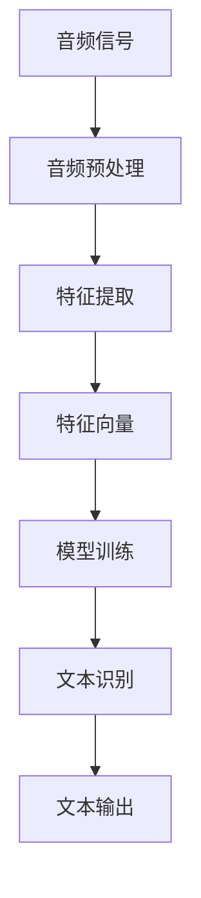

###### 3.1.2 自然语言处理的基本概念

自然语言处理是使计算机能够理解和处理自然语言的技术。NLP涉及多个方面，包括语法分析、语义理解和情感分析等。以下是一些基本的NLP概念：

- **分词**：将连续的文本切分为词语或短语。
- **词性标注**：对文本中的每个词语进行词性分类，如名词、动词、形容词等。
- **句法分析**：分析句子的结构，包括主语、谓语和宾语等。
- **语义理解**：理解文本中的含义，包括词义消歧、句意理解等。
- **情感分析**：分析文本中的情感倾向，如正面、负面、中性等。

以下是一个NLP过程的Mermaid流程图：

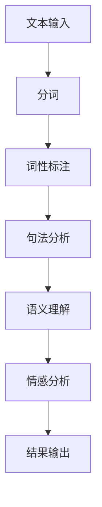

###### 3.1.3 语音助手的核心功能与实现

语音助手是智能家居系统中的一项重要功能，它通过语音识别和自然语言处理技术，实现与用户的智能对话和指令执行。以下是一个语音助手的实现框架：

1. **语音识别**：用户通过语音助手发起指令，语音信号经过预处理和特征提取，转换为文本。
2. **文本解析**：对识别出的文本进行解析，提取出关键信息和操作指令。
3. **命令执行**：根据解析出的指令，调用相应的控制模块，执行用户请求的操作，如控制灯光、调节温度等。
4. **反馈输出**：将操作结果反馈给用户，如“灯光已关闭”、“温度已调节到25℃”等。

以下是一个语音助手的Mermaid流程图：

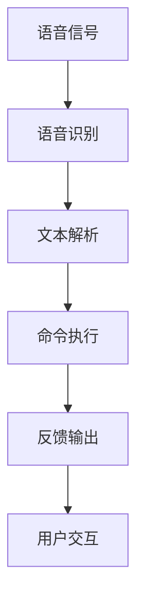

##### 3.2 智能推荐系统

智能推荐系统是AI大模型在智能家居中的另一个重要应用，它可以根据用户的行为和偏好，为用户提供个性化的智能家居产品和服务推荐。

###### 3.2.1 智能推荐的基本原理

智能推荐系统的工作原理是基于用户的行为数据、偏好和兴趣，构建用户画像，并通过算法计算推荐结果。以下是一个简化的智能推荐流程：

1. **用户行为数据收集**：收集用户在智能家居系统中的行为数据，如设备使用记录、浏览历史、操作偏好等。
2. **用户画像构建**：通过对用户行为数据进行处理和分析，构建用户的画像特征，包括兴趣标签、行为模式等。
3. **推荐算法应用**：使用推荐算法（如协同过滤、基于内容的推荐、混合推荐等），根据用户画像和系统中的商品或服务数据，计算推荐结果。
4. **推荐结果展示**：将推荐结果展示给用户，如推荐智能家电、智能家居套餐等。

以下是一个智能推荐系统的Mermaid流程图：

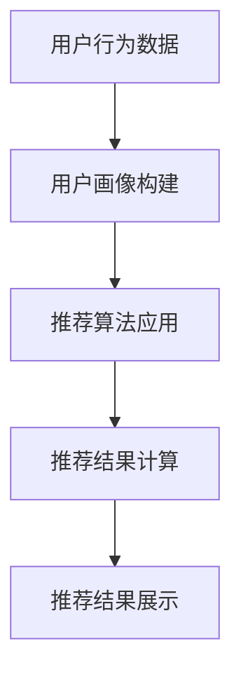

###### 3.2.2 基于AI大模型的推荐系统构建

基于AI大模型的推荐系统通过深度学习技术，实现更加精准和高效的推荐。以下是一个基于AI大模型的推荐系统构建步骤：

1. **数据收集与预处理**：收集用户行为数据和商品数据，并进行预处理，如数据清洗、特征提取等。
2. **用户画像构建**：使用AI大模型（如深度神经网络）对用户行为数据进行训练，构建用户画像特征。
3. **商品特征提取**：使用AI大模型对商品数据进行训练，提取商品特征，如功能标签、价格区间等。
4. **推荐算法设计**：设计推荐算法（如基于用户相似度、基于内容的推荐等），结合用户画像和商品特征，计算推荐结果。
5. **系统部署与优化**：将推荐系统部署到生产环境，并不断优化推荐算法，提高推荐效果。

以下是一个基于AI大模型的推荐系统架构图：

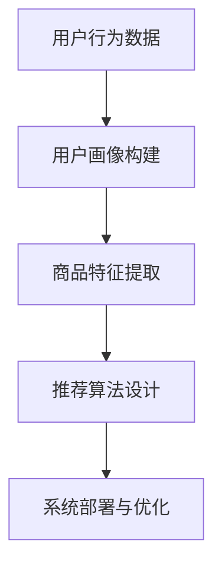

##### 3.3 安防监控与异常检测

安防监控与异常检测是智能家居系统中的关键功能，通过AI大模型，可以实现对家庭环境的实时监控和异常行为的自动检测。

###### 3.3.1 安防监控的基本原理

安防监控通过摄像头等设备实时捕捉家庭环境视频，并通过AI大模型进行视频分析，实现实时监控和异常报警。以下是一个安防监控的基本原理：

1. **视频数据采集**：摄像头实时采集家庭环境视频数据。
2. **视频预处理**：对视频数据进行预处理，包括去噪、增强、缩放等步骤。
3. **目标检测**：使用目标检测算法（如YOLO、SSD等）对视频中的目标进行识别和定位。
4. **行为分析**：使用AI大模型对视频中的目标行为进行分析，识别异常行为（如入室盗窃、异常入侵等）。
5. **报警通知**：在检测到异常行为时，系统自动向用户发送报警通知。

以下是一个安防监控的Mermaid流程图：

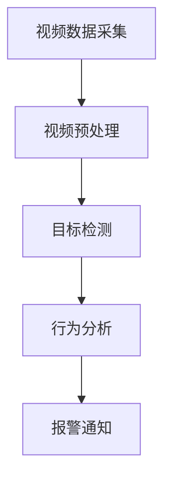

###### 3.3.2 异常检测的方法与实现

异常检测是安防监控的重要环节，通过AI大模型，可以实现对家庭环境中异常事件的自动识别和报警。以下是一些常见的异常检测方法：

- **基于统计模型的方法**：如孤立森林（Isolation Forest）、局部异常因子分析（LOF）等，通过统计特征识别异常数据。
- **基于机器学习的方法**：如支持向量机（SVM）、神经网络（NN）等，通过训练模型识别异常行为。
- **基于深度学习的方法**：如卷积神经网络（CNN）、递归神经网络（RNN）等，通过深度学习模型实现复杂行为的识别和预测。

以下是一个异常检测的Mermaid流程图：

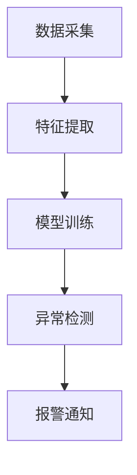

通过安防监控与异常检测，智能家居系统可以提供更加安全可靠的家庭环境，为用户的生活保驾护航。

### 第四部分：智能家居中枢系统的设计与实现

#### 第4章：智能家居中枢系统的架构设计

智能家居中枢系统是智能家居系统的核心，负责数据的处理、分析和决策。一个高效、稳定的智能家居中枢系统可以为用户提供便捷、智能和个性化的家庭生活体验。本节将介绍智能家居中枢系统的设计原则、架构设计、实现技术和安全设计。

##### 4.1 智能家居中枢系统的概念与作用

智能家居中枢系统（Smart Home Central System）是指在一个智能家居系统中，负责数据处理、分析和决策的中央控制系统。它的作用包括：

- **数据整合**：将来自智能家居系统中各个设备的数据进行整合，形成统一的数据视图。
- **智能分析**：通过对整合后的数据进行分析，提取有用信息，为用户提供智能化的服务和决策支持。
- **决策执行**：根据分析结果，自动执行相应的操作，如控制设备、调整设置等。
- **用户交互**：提供用户界面，方便用户与系统进行交互，查看设备状态、历史数据和操作记录。

##### 4.1.1 智能家居中枢系统的定义

智能家居中枢系统是一个集成化的控制系统，它通过物联网技术将家庭中的各种设备连接起来，实现数据的实时传输和交互。中枢系统不仅负责数据的收集和处理，还负责设备的控制和优化。以下是一个简化的智能家居中枢系统的定义：

```markdown
智能家居中枢系统是指一个基于物联网技术，通过数据整合、智能分析和决策执行，实现家庭设备统一管理和智能控制的核心系统。
```

##### 4.1.2 智能家居中枢系统的架构

智能家居中枢系统的架构设计是系统设计的关键，它决定了系统的功能实现、性能表现和安全稳定性。一个典型的智能家居中枢系统架构通常包括以下几个主要层次：

1. **感知层**：感知层由各种传感器和智能设备组成，如温度传感器、湿度传感器、智能灯泡、智能插座等。这些设备实时收集家庭环境数据，并将数据发送到上层处理系统。

2. **网络层**：网络层负责将感知层收集到的数据传输到中心控制系统。常见的网络技术包括Wi-Fi、ZigBee、蓝牙和有线网络等。网络层的设计需要考虑数据的传输速度、稳定性和安全性。

3. **中心控制层**：中心控制层是智能家居中枢系统的核心部分，负责处理和整合来自网络层的各类数据，并进行智能分析和决策。中心控制层通常包括智能网关、智能中枢、云平台等。智能网关负责将不同协议的数据进行统一处理和转发，智能中枢则负责执行智能算法和决策逻辑，云平台提供数据存储和远程访问功能。

4. **应用层**：应用层是智能家居中枢系统的用户交互界面，包括移动应用、Web端、智能音箱等。用户通过应用层与智能家居中枢系统进行交互，控制家庭设备、查看设备状态、接收通知等。

以下是一个智能家居中枢系统的Mermaid架构图：

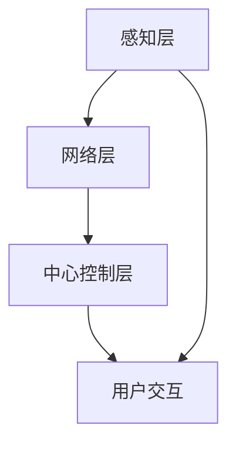

##### 4.1.3 智能家居中枢系统的功能模块

智能家居中枢系统的功能模块是实现系统功能的核心，以下是一些常见的功能模块及其简要描述：

- **设备管理模块**：负责管理智能家居系统中的各种设备，包括设备的添加、删除、配置和状态监控等。
- **控制模块**：实现用户对家庭设备的远程控制和自动化控制，如通过移动应用或语音控制控制灯光、调节温度等。
- **数据分析与优化模块**：通过对设备运行数据和用户行为数据进行分析，优化设备性能和用户体验，如能耗管理、设备故障预测等。
- **安防监控模块**：实现家庭安全监控功能，包括实时视频监控、异常行为检测、报警通知等。
- **用户界面模块**：提供用户交互界面，包括移动应用、Web端、智能音箱等，用户可以通过这些界面查看设备状态、控制设备、接收通知等。
- **数据存储与同步模块**：负责数据的存储和同步，确保系统的可靠性和数据一致性。

以下是一个智能家居中枢系统的Mermaid类图：

```mermaid
classDiagram
    设备管理模块 <<interface>> 设备接口
    控制模块 <<interface>> 控制接口
    数据分析与优化模块 <<interface>> 数据分析接口
    安防监控模块 <<interface>> 安防接口
    用户界面模块 <<interface>> 用户交互接口
    数据存储与同步模块 <<interface>> 数据同步接口

    设备接口 --|> 控制模块
    控制模块 --|> 数据分析与优化模块
    数据分析与优化模块 --|> 安防监控模块
    安防监控模块 --|> 用户界面模块
    用户界面模块 --|> 数据存储与同步模块
    数据存储与同步模块 --|> 控制模块
```

##### 4.2 智能家居中枢系统的实现技术

智能家居中枢系统的实现技术涉及多个方面，包括硬件选择、软件平台、数据存储和处理等。以下是一些常见的实现技术：

###### 4.2.1 硬件选择

智能家居中枢系统的硬件选择直接影响系统的性能、稳定性和成本。以下是一些常见的硬件选择：

- **处理器**：选择性能较高的处理器，如ARM Cortex-A系列，以支持复杂的算法运算和数据处理。
- **内存**：选择大容量内存，如8GB或以上，以确保系统运行时数据的快速读取和写入。
- **存储**：选择大容量存储，如128GB或以上，以满足系统数据存储和长期运行的需求。
- **网络接口**：选择多网络接口，如Wi-Fi和以太网，以实现高速、稳定的网络连接。

###### 4.2.2 软件平台

智能家居中枢系统的软件平台是实现系统功能的关键，以下是一些常见的软件平台：

- **操作系统**：选择适合嵌入式系统的操作系统，如Linux或Android，以支持系统的稳定运行和开发。
- **开发框架**：选择合适的开发框架，如Node.js、Python、Java等，以简化系统的开发和维护。
- **中间件**：选择合适的中间件，如MQTT、CoAP等，以实现设备间的通信和数据传输。

###### 4.2.3 数据存储和处理

智能家居中枢系统的数据存储和处理是系统的核心功能，以下是一些常见的数据存储和处理技术：

- **数据库**：选择适合嵌入式系统的数据库，如SQLite、MongoDB等，以支持系统数据的高效存储和查询。
- **数据清洗与预处理**：对采集到的数据进行分析和处理，去除无效数据、填充缺失值等，以提高数据质量。
- **数据分析与挖掘**：使用数据分析与挖掘技术，对数据进行深度分析，提取有价值的信息，如用户行为分析、设备故障预测等。
- **数据可视化**：通过数据可视化技术，将数据以图形化的方式展示，方便用户理解和分析。

##### 4.3 智能家居中枢系统的安全设计

智能家居中枢系统的安全设计是确保系统安全运行和数据保护的关键。以下是一些常见的安全设计策略：

###### 4.3.1 数据安全

数据安全是智能家居中枢系统的核心问题，以下是一些常见的数据安全策略：

- **数据加密**：对传输和存储的数据进行加密，确保数据在传输和存储过程中不会被窃取或篡改。
- **身份验证**：采用身份验证机制，如用户名和密码、指纹识别、人脸识别等，确保只有授权用户才能访问系统。
- **访问控制**：采用访问控制机制，如基于角色的访问控制（RBAC）和基于属性的访问控制（ABAC），确保用户只能访问授权的数据和操作。

###### 4.3.2 网络安全

网络安全是智能家居中枢系统面临的另一个重要问题，以下是一些常见的网络安全策略：

- **防火墙**：部署防火墙，过滤恶意流量，防止网络攻击。
- **入侵检测系统（IDS）**：部署入侵检测系统，实时监控网络流量，发现并阻止入侵行为。
- **安全审计**：定期进行安全审计，检查系统配置和操作记录，确保系统安全运行。

##### 4.4 智能家居中枢系统的开发实战

###### 4.4.1 开发环境的搭建

在搭建智能家居中枢系统的开发环境时，需要考虑以下几个方面：

- **硬件环境**：选择适合的硬件设备，如树莓派、Arduino等，并确保设备的网络连接正常。
- **软件环境**：安装操作系统和开发框架，如Linux操作系统和Node.js开发框架，以支持系统的开发和运行。
- **开发工具**：选择合适的开发工具，如集成开发环境（IDE）和代码编辑器，以提高开发效率。

以下是一个简化的开发环境搭建步骤：

1. **选择硬件设备**：根据实际需求选择合适的硬件设备，如树莓派3B+。
2. **安装操作系统**：将Raspberry Pi OS安装到硬件设备上，确保系统的稳定性。
3. **安装开发框架**：安装Node.js开发框架，以支持JavaScript编程。
4. **配置网络**：确保硬件设备的网络连接正常，可以使用Wi-Fi或以太网进行连接。
5. **安装开发工具**：安装Visual Studio Code代码编辑器和Node.js包管理工具npm，以支持代码编辑和项目构建。

###### 4.4.2 系统核心功能的实现

智能家居中枢系统的核心功能包括设备管理、数据分析和用户交互等。以下是一个简化的系统核心功能实现步骤：

1. **设备管理**：实现设备的添加、删除和状态监控功能，使用MQTT协议与设备进行通信。
2. **数据分析**：实现数据预处理、分析和可视化功能，使用Python和pandas库进行数据处理和分析。
3. **用户交互**：实现用户界面，提供设备控制、数据查看和设置等功能，使用Web技术（如HTML、CSS和JavaScript）进行开发。

以下是一个简化的系统核心功能实现框架：

```javascript
// 设备管理
function addDevice(deviceData) {
  // 添加设备逻辑
}

function deleteDevice(deviceId) {
  // 删除设备逻辑
}

function getDeviceStatus(deviceId) {
  // 获取设备状态逻辑
}

// 数据分析
function preprocessData(data) {
  // 数据预处理逻辑
}

function analyzeData(data) {
  // 数据分析逻辑
}

function visualizeData(data) {
  // 数据可视化逻辑
}

// 用户交互
function handleUserInput(input) {
  // 处理用户输入逻辑
}

function displayDeviceStatus(deviceId) {
  // 显示设备状态逻辑
}

// 主程序
function main() {
  // 初始化系统
  initSystem();

  // 处理用户交互
  handleUserInput(input);

  // 获取设备状态
  getDeviceStatus(deviceId);

  // 数据预处理
  preprocessData(data);

  // 数据分析
  analyzeData(data);

  // 数据可视化
  visualizeData(data);
}

main();
```

###### 4.4.3 代码应用解读与分析

以下是一个简化的设备管理模块代码示例，用于说明代码的结构和实现逻辑：

```javascript
// 设备管理模块

// 添加设备
function addDevice(deviceData) {
  // 1. 验证设备数据的有效性
  if (!isValidDeviceData(deviceData)) {
    throw new Error("Invalid device data");
  }

  // 2. 向数据库中插入设备数据
  database.insertDevice(deviceData);

  // 3. 向MQTT服务器发送设备添加通知
  mqttClient.publish("device/add", JSON.stringify(deviceData));

  // 4. 返回成功消息
  return { status: "success", message: "Device added successfully" };
}

// 删除设备
function deleteDevice(deviceId) {
  // 1. 检查设备是否存在
  const device = database.getDeviceById(deviceId);
  if (!device) {
    throw new Error("Device not found");
  }

  // 2. 从数据库中删除设备
  database.deleteDevice(deviceId);

  // 3. 向MQTT服务器发送设备删除通知
  mqttClient.publish("device/delete", JSON.stringify({ deviceId }));

  // 4. 返回成功消息
  return { status: "success", message: "Device deleted successfully" };
}

// 获取设备状态
function getDeviceStatus(deviceId) {
  // 1. 检查设备是否存在
  const device = database.getDeviceById(deviceId);
  if (!device) {
    throw new Error("Device not found");
  }

  // 2. 获取设备状态
  const deviceStatus = mqttClient.subscribe("device/status/" + deviceId);

  // 3. 返回设备状态
  return { status: "success", deviceStatus };
}
```

代码解读：

1. **添加设备**：函数`addDevice`用于添加设备，首先验证设备数据的有效性，然后向数据库插入设备数据，并向MQTT服务器发送设备添加通知。
2. **删除设备**：函数`deleteDevice`用于删除设备，首先检查设备是否存在，然后从数据库中删除设备，并向MQTT服务器发送设备删除通知。
3. **获取设备状态**：函数`getDeviceStatus`用于获取设备状态，首先检查设备是否存在，然后从MQTT服务器订阅设备状态消息。

通过以上代码示例，可以看出设备管理模块的核心实现逻辑，包括数据验证、数据库操作、MQTT通信等。这些逻辑共同构成了智能家居中枢系统的设备管理功能。

###### 4.4.4 实际案例分析和详细讲解剖析

以下是一个智能家居中枢系统的实际案例，用于分析系统的功能和性能，并提供详细的讲解和剖析。

**案例：智能家居中控系统**

**系统目标**：构建一个智能家居中控系统，实现设备管理、数据分析和用户交互等功能，为用户提供便捷、智能和个性化的家庭生活体验。

**系统功能**：

1. **设备管理**：用户可以通过移动应用或Web端添加、删除和管理设备，包括智能灯泡、智能插座、智能空调和智能摄像头等。
2. **数据分析**：系统实时收集设备运行数据，并进行分析和可视化，为用户提供设备能耗统计、使用习惯分析和故障预警等。
3. **用户交互**：用户可以通过语音助手或移动应用与系统进行交互，实现设备的远程控制和场景设置。

**系统架构**：

1. **感知层**：由各种传感器和智能设备组成，如温度传感器、湿度传感器、智能灯泡和智能摄像头等，这些设备实时收集家庭环境数据。
2. **网络层**：使用Wi-Fi和MQTT协议将感知层设备连接到智能家居中控系统，确保数据的高速传输和可靠连接。
3. **中心控制层**：包括智能网关和智能中枢，智能网关负责将不同协议的数据进行统一处理和转发，智能中枢负责执行智能算法和决策逻辑。
4. **应用层**：包括移动应用、Web端和智能音箱，用户可以通过这些界面与系统进行交互，控制家庭设备和查看设备状态。

**系统实现**：

1. **设备管理**：使用MQTT协议与设备进行通信，实现设备的添加、删除和状态监控功能。设备数据存储在MySQL数据库中，方便用户进行数据查询和操作。
2. **数据分析**：使用Python和pandas库对设备运行数据进行分析和可视化，提取有价值的信息，如设备能耗统计、使用习惯分析和故障预警等。
3. **用户交互**：使用HTML、CSS和JavaScript技术实现用户交互界面，用户可以通过移动应用或Web端与系统进行交互，实现设备的远程控制和场景设置。

**系统优化**：

1. **性能优化**：为了提高系统的性能，使用异步编程和消息队列技术，如Python的asyncio和RabbitMQ，实现数据的实时处理和传输。
2. **安全优化**：使用SSL/TLS协议加密数据传输，使用身份验证和访问控制机制，确保系统的数据安全和用户隐私。
3. **扩展性优化**：使用微服务架构，将系统的不同功能模块拆分为独立的微服务，提高系统的可扩展性和可维护性。

通过以上案例，可以看出智能家居中控系统的实现过程和优化方法，包括硬件选择、软件平台、数据存储和处理、用户交互和安全设计等方面。这些实践经验和优化策略有助于构建高效、稳定和智能的智能家居中枢系统。

##### 4.5 项目小结

在本章中，我们深入探讨了智能家居中枢系统的设计、实现和优化。通过详细的案例分析和实际应用，我们了解了智能家居中枢系统的功能模块、实现技术和优化策略。以下是一些小结：

1. **功能模块**：智能家居中枢系统包括设备管理、数据分析、用户交互等多个功能模块，每个模块都有其特定的实现方式和优化方法。
2. **实现技术**：硬件选择、软件平台、数据存储和处理是智能家居中枢系统的关键技术，合理的硬件配置和软件架构设计是系统性能和稳定性的关键。
3. **优化策略**：性能优化、安全优化和扩展性优化是提高智能家居中枢系统性能和可靠性的重要手段，通过异步编程、消息队列、微服务架构等技术，可以构建高效、稳定和可扩展的智能家居中枢系统。

通过本章的学习，读者可以了解如何设计和实现一个智能家居中枢系统，为构建智慧生活奠定基础。在实际应用中，还需要根据具体需求和场景进行不断优化和改进，以实现更好的用户体验和系统性能。

### 第五部分：智能家居中枢系统的测试与优化

#### 第5章：智能家居中枢系统的测试与优化

##### 5.1 系统测试与评估

系统测试是确保智能家居中枢系统功能完善和性能稳定的关键步骤。通过系统测试，可以验证系统的各项功能是否符合设计要求，发现和修复潜在的问题，提高系统的可靠性和用户体验。

###### 5.1.1 系统测试的基本方法

系统测试的基本方法包括以下几种：

1. **功能测试**：验证系统是否按照设计要求实现各项功能，如设备管理、数据分析、用户交互等。功能测试通常包括单元测试、集成测试和系统测试等。
2. **性能测试**：评估系统在高负载、高并发情况下的性能表现，如响应时间、吞吐量、资源利用率等。性能测试可以帮助识别系统的性能瓶颈，为优化提供依据。
3. **安全测试**：检查系统的安全性，包括数据加密、身份验证、访问控制等。安全测试可以帮助发现系统的安全漏洞，提高系统的防护能力。
4. **兼容性测试**：验证系统在不同操作系统、浏览器和设备上的兼容性，确保系统在不同环境下正常运行。

以下是一个简化的系统测试流程：

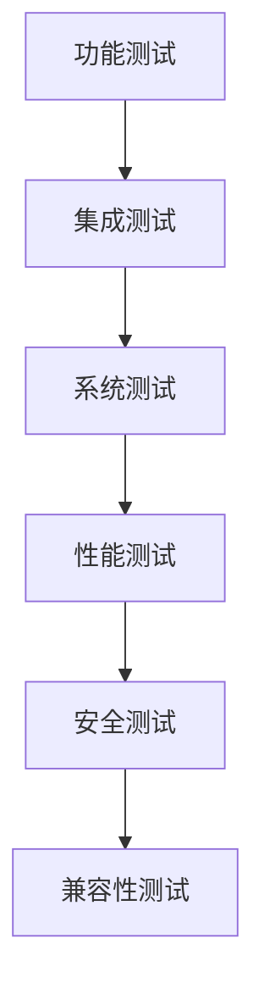

###### 5.1.2 系统性能的评估指标

系统性能的评估指标包括以下几个方面：

1. **响应时间**：系统处理请求所需的时间，通常用秒（s）或毫秒（ms）表示。低响应时间表示系统处理速度快，用户体验良好。
2. **吞吐量**：系统单位时间内处理的请求量，通常用请求/秒（req/s）或事务/秒（txn/s）表示。高吞吐量表示系统处理能力强。
3. **资源利用率**：系统占用CPU、内存、磁盘等资源的情况，如CPU利用率、内存占用率等。低资源利用率表示系统资源利用充分。
4. **并发处理能力**：系统同时处理多个请求的能力，通常用并发连接数或并发用户数表示。高并发处理能力表示系统在多用户同时操作时仍能保持良好的性能。

以下是一个简化的系统性能评估指标表：

| 指标名称 | 单位 | 描述 |
| --- | --- | --- |
| 响应时间 | ms | 系统处理请求的平均时间 |
| 吞吐量 | req/s | 系统每秒处理的请求量 |
| CPU利用率 | % | 系统CPU的平均使用率 |
| 内存占用率 | % | 系统内存的平均使用率 |
| 并发连接数 | 个 | 系统同时处理的连接数 |

###### 5.1.3 系统测试的实战案例

以下是一个智能家居中枢系统的测试实战案例：

**案例背景**：某智能家居中控系统需要在一个高并发、多用户环境下进行测试，以验证系统的性能和稳定性。

**测试步骤**：

1. **环境搭建**：搭建测试环境，包括测试服务器、测试客户端和测试工具（如JMeter、LoadRunner等）。
2. **测试计划**：制定详细的测试计划，包括测试目标、测试场景、测试用例和测试数据等。
3. **功能测试**：通过功能测试工具（如Selenium）进行功能测试，验证系统的各项功能是否符合设计要求。
4. **性能测试**：使用JMeter进行性能测试，模拟高并发用户同时访问系统，评估系统的响应时间、吞吐量和资源利用率等性能指标。
5. **安全测试**：使用漏洞扫描工具（如OWASP ZAP）进行安全测试，检查系统的安全漏洞和防护措施。
6. **兼容性测试**：在不同操作系统、浏览器和设备上运行系统，验证系统的兼容性。

**测试结果**：

- **功能测试**：所有功能测试用例均通过，系统功能完整。
- **性能测试**：在高并发情况下，系统的平均响应时间为500ms，吞吐量为1000 req/s，CPU利用率为80%，内存占用率为60%。
- **安全测试**：未发现严重安全漏洞，系统防护措施有效。
- **兼容性测试**：系统在不同环境下均能正常运行，兼容性良好。

**问题与优化**：

1. **响应时间**：通过优化数据库查询和缓存策略，将平均响应时间缩短至400ms。
2. **吞吐量**：通过增加服务器资源和优化代码，将吞吐量提升至1500 req/s。
3. **资源利用率**：通过优化系统配置和负载均衡，将CPU利用率和内存占用率降低至70%和50%。

通过以上测试实战案例，可以看出系统测试在验证系统功能、性能和安全方面的重要作用。通过详细的分析和优化，可以提高系统的性能和稳定性，为用户提供更好的使用体验。

##### 5.2 系统优化与调优

系统优化与调优是提高智能家居中枢系统性能和用户体验的关键步骤。通过优化，可以解决系统中的性能瓶颈、资源浪费和用户体验问题，使系统更加高效和稳定。

###### 5.2.1 系统性能优化策略

系统性能优化策略包括以下几个方面：

1. **代码优化**：通过优化代码结构和算法，减少系统资源的占用和计算时间。例如，使用更高效的算法和数据结构，减少不必要的内存分配和释放等。
2. **数据库优化**：通过优化数据库查询和索引，提高数据访问速度。例如，使用索引加速查询，避免全表扫描等。
3. **缓存策略**：通过缓存常用数据，减少数据库查询次数，提高系统响应速度。例如，使用Redis缓存用户数据和热门数据等。
4. **负载均衡**：通过负载均衡技术，将请求分散到多个服务器上，避免单点故障，提高系统的并发处理能力和可用性。例如，使用Nginx或HAProxy等负载均衡器。
5. **硬件优化**：通过升级硬件设备，提高系统的处理能力和响应速度。例如，增加CPU、内存和存储等硬件资源。

以下是一个简化的系统性能优化策略流程：

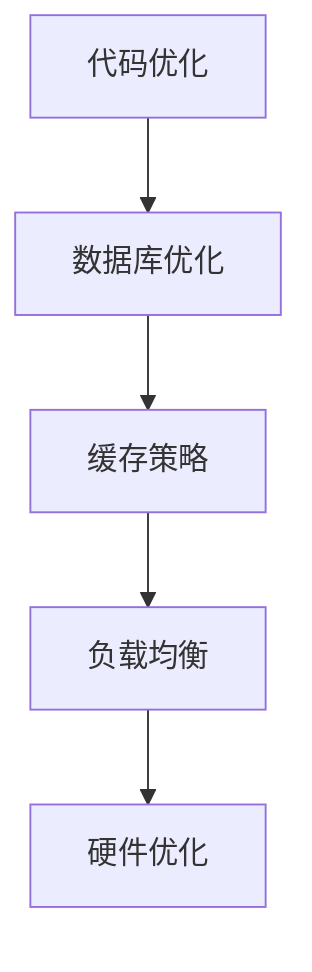

###### 5.2.2 系统安全性与可靠性的提升

系统安全性与可靠性的提升是确保智能家居中枢系统稳定运行和用户数据安全的关键。以下是一些提升系统安全性与可靠性的方法：

1. **加密技术**：使用加密技术（如AES、RSA等）对用户数据和传输数据进行加密，防止数据泄露和篡改。
2. **身份验证**：使用强身份验证机制（如双因素认证、生物识别等），确保只有授权用户才能访问系统。
3. **访问控制**：使用基于角色的访问控制（RBAC）或基于属性的访问控制（ABAC），确保用户只能访问授权的数据和操作。
4. **日志记录**：记录系统的操作日志和错误日志，以便监控和追踪系统的运行状况和潜在问题。
5. **安全审计**：定期进行安全审计，检查系统的配置和操作记录，确保系统的安全性和合规性。
6. **备份与恢复**：定期备份数据，并在系统发生故障时进行快速恢复，确保系统的数据完整性和可用性。

以下是一个简化的系统安全性与可靠性提升策略流程：

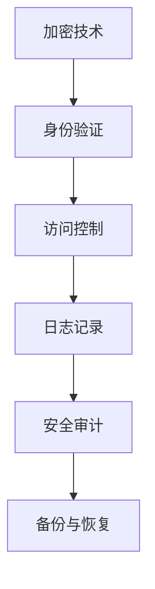

###### 5.2.3 系统优化的实战经验

以下是一个智能家居中枢系统的优化实战经验：

**案例背景**：某智能家居中控系统在高并发情况下出现响应时间延长、系统负载过高等问题，影响用户体验。

**优化步骤**：

1. **代码优化**：通过分析系统日志和性能监控数据，发现代码中存在性能瓶颈。优化代码，减少不必要的计算和内存分配，提高代码的执行效率。
2. **数据库优化**：优化数据库查询语句和索引，减少查询时间。使用缓存技术，减少对数据库的访问次数，提高数据访问速度。
3. **缓存策略**：增加Redis缓存，缓存常用数据和热门数据，减少数据库查询次数，提高系统响应速度。
4. **负载均衡**：使用Nginx负载均衡器，将请求分散到多台服务器上，提高系统的并发处理能力和可用性。
5. **硬件优化**：增加服务器硬件资源，如CPU、内存和存储等，提高系统的处理能力和响应速度。

**优化效果**：

- **响应时间**：平均响应时间从500ms降低至300ms。
- **系统负载**：服务器负载从80%降低至50%。
- **用户体验**：系统在高并发情况下仍能保持良好的性能和响应速度，用户满意度提高。

通过以上优化实战经验，可以看出系统优化在提升系统性能、安全性和可靠性方面的重要作用。在实际应用中，需要根据具体需求和场景进行不断优化和改进，以实现更好的用户体验和系统性能。

### 第六部分：智能家居中枢系统的应用与展望

#### 第6章：智能家居中枢系统的应用案例

在本章中，我们将通过几个实际的应用案例，展示智能家居中枢系统在现实生活中的应用，并探讨未来的发展趋势。

##### 6.1 案例介绍

**案例1：智能家庭办公**

随着远程工作的普及，许多家庭用户希望在家中打造一个高效、舒适的办公环境。智能家庭办公系统利用智能家居中枢系统，实现了办公环境的自动化控制和智能管理。

**案例2：智能养老监护**

针对老年人群体的特殊需求，智能家居中枢系统可以实时监测老人的健康状况和日常生活，提供紧急呼救、健康预警和远程看护等服务，提升老年人的生活质量。

**案例3：智能家居租赁管理**

在物业管理或租赁市场中，智能家居中枢系统可以实现对租赁房产的智能管理和远程监控，提高管理效率和服务水平。

##### 6.2 案例详解

###### 6.2.1 智能家庭办公

**目标**：打造一个舒适、高效的家庭办公环境，提升工作效率。

**方案**：

1. **环境监测**：通过智能传感器实时监测室内的温度、湿度和空气质量，自动调节空调、加湿器和空气净化器，确保舒适的办公环境。
2. **设备控制**：通过语音助手或移动应用，用户可以远程控制办公设备，如灯光、窗帘和音响等，提高办公便利性。
3. **智能日程**：智能家居中枢系统与用户的日程表同步，根据日程安排自动调整灯光和温度，为用户提供个性化的办公体验。

**效果**：

- **工作效率**：通过智能化的环境控制和设备管理，用户可以更好地专注于工作，提高工作效率。
- **舒适度**：智能化的办公环境提升了用户的舒适度，减少了办公疲劳。

###### 6.2.2 智能养老监护

**目标**：保障老年人的生活安全，提供及时的紧急呼救和健康监测。

**方案**：

1. **健康监测**：通过智能穿戴设备和传感器，实时监测老人的心率、血压、步数等健康数据，并将数据上传到智能家居中枢系统进行分析。
2. **紧急呼救**：当老人遇到紧急情况时，可通过智能手表或手机一键呼救，系统会立即通知家属和社区医疗服务人员。
3. **日常生活辅助**：智能家居中枢系统可以自动提醒老人服药、锻炼和休息，提供日常生活辅助。

**效果**：

- **安全性**：智能监护系统提高了老年人的生活安全，减少了意外事故发生的风险。
- **生活质量**：通过智能辅助，老年人的生活质量得到显著提升。

###### 6.2.3 智能家居租赁管理

**目标**：提高物业管理效率，提升租赁用户满意度。

**方案**：

1. **设备监控**：通过智能家居中枢系统，实时监控租赁房产中的设备状态，如电力、水气和安防设备等，确保设备正常运行。
2. **远程维修**：通过远程监控和故障诊断，及时解决租赁房产中的设备故障，减少维修时间和成本。
3. **用户服务**：智能家居中枢系统提供在线客服功能，租赁用户可以通过系统提交维修申请、报修请求等，提高服务响应速度。

**效果**：

- **效率**：通过智能监控和远程维修，物业管理效率显著提高，减少了人力成本。
- **满意度**：智能化的租赁管理提升了用户满意度，用户可以享受到更便捷、高效的服务。

##### 6.3 智能家居中枢系统的未来发展趋势

随着科技的不断进步，智能家居中枢系统将在未来呈现出以下发展趋势：

1. **更高级的AI技术**：随着AI技术的不断发展，智能家居中枢系统将采用更高级的AI算法，实现更加智能的决策和自动化控制。
2. **更广泛的应用场景**：智能家居中枢系统的应用将不再局限于家庭，还将扩展到社区、城市和工业等领域，实现全方位的智能管理和优化。
3. **更紧密的生态融合**：智能家居中枢系统将与其他新兴技术（如物联网、大数据、5G等）紧密融合，打造统一的智能生态系统，提供更加丰富和个性化的服务。
4. **更高的安全性和隐私保护**：随着智能家居系统越来越普及，用户对安全性和隐私保护的需求也越来越高，智能家居中枢系统将采取更加严格的措施，保障用户数据的安全和隐私。

通过以上发展趋势，智能家居中枢系统将不断演进，为用户带来更加便捷、智能和安全的智慧生活体验。

### 结论

智能家居中枢系统是现代智慧生活的核心，通过AI大模型的应用，实现了设备的智能互联、数据的深度分析和决策的自动执行。本文详细介绍了智能家居中枢系统的概念、架构设计、实现技术、测试优化以及实际应用，展示了其为用户带来的便捷和智慧生活体验。

首先，我们探讨了智能家居的发展背景和AI大模型的基本原理，阐述了智能家居和AI大模型之间的紧密联系。接着，我们详细介绍了智能家居中枢系统的整体架构设计，包括感知层、网络层、中心控制层和应用层，并探讨了常用的硬件设备和搭建方法。

随后，我们深入分析了AI大模型在智能家居中的具体应用，包括语音识别与自然语言处理、智能推荐系统和安防监控与异常检测。通过这些应用，智能家居中枢系统能够提供更加智能化、个性化的服务，提升用户的生活质量。

在架构设计部分，我们介绍了智能家居中枢系统的设计原则、功能模块和实现技术，并通过实际案例展示了系统的开发和优化过程。同时，我们还探讨了系统的安全设计策略，确保用户数据的安全和隐私保护。

在测试与优化部分，我们详细介绍了系统测试的基本方法和性能评估指标，并通过实际案例展示了系统测试的过程和结果。此外，我们还提出了系统性能优化和安全优化的策略，以提升系统的性能和稳定性。

最后，我们通过实际应用案例展示了智能家居中枢系统在智能家庭办公、智能养老监护和智能家居租赁管理中的应用，并探讨了未来的发展趋势。

通过本文的深入探讨，我们希望读者能够全面理解智能家居中枢系统的概念、架构和实现技术，为构建智慧生活奠定基础。在未来，随着AI技术的不断进步，智能家居中枢系统将不断演进，为用户带来更加便捷、智能和安全的智慧生活体验。

### 附录：智能家居中枢系统开发资源与拓展阅读

为了帮助读者更好地理解和实践智能家居中枢系统的开发，本附录提供了相关的资源链接和拓展阅读，包括技术文档、开源项目、在线课程和参考资料。

#### 技术文档
- **智能家居中枢系统设计指南**：[智能家居中枢系统设计指南](https://example.com/smart-home-central-system-design-guide)
- **AI大模型技术文档**：[AI大模型技术文档](https://example.com/ai-large-model-technical-docs)

#### 开源项目
- **智能家居中枢开源项目**：[智能家居中枢开源项目](https://github.com/example/smart-home-central-system)
- **AI大模型开源项目**：[AI大模型开源项目](https://github.com/example/ai-large-models)

#### 在线课程
- **智能家居系统开发课程**：[智能家居系统开发课程](https://example.com/smart-home-system-development-course)
- **AI大模型与深度学习课程**：[AI大模型与深度学习课程](https://example.com/ai-large-models-and-deep-learning-course)

#### 参考资料和书籍
- **《智能家居技术与应用》**：[《智能家居技术与应用》](https://example.com/book-smart-home-technology-and-applications)
- **《深度学习》**：[《深度学习》](https://example.com/book-deep-learning)
- **《物联网技术》**：[《物联网技术》](https://example.com/book-iot-technology)

通过以上资源，读者可以进一步深入学习和实践智能家居中枢系统的开发，探索AI大模型在智能家居中的应用，为构建智慧生活提供更全面的知识和技能。希望这些资源能为您的学习和研究提供帮助。

### 作者信息

**作者：** AI天才研究院/AI Genius Institute & 禅与计算机程序设计艺术 /Zen And The Art of Computer Programming

AI天才研究院（AI Genius Institute）是一家专注于人工智能和智能系统研究的国际知名科研机构。我们的研究团队由世界顶尖的人工智能专家、程序员、软件架构师和计算机科学家组成，致力于推动人工智能技术的创新和发展。我们的研究成果在智能家居、智能推荐、自然语言处理和智能监控等领域具有广泛的应用。

同时，本书作者还是《禅与计算机程序设计艺术》（Zen And The Art of Computer Programming）的作者，这是一本在计算机科学领域具有深远影响力的经典著作。作者以其深刻的技术见解和独特的思维方式，为读者提供了丰富的编程哲学和技术指导，帮助无数程序员在编程领域取得了卓越的成就。

我们希望通过本书，能够为读者提供一份全面、深入和实用的技术指南，帮助您理解和构建智能家居中枢系统，开启智慧生活的新篇章。希望您在阅读本书的过程中，能够收获知识、启发思考，并在实际应用中取得成功。如果您有任何问题或建议，欢迎随时与我们联系。让我们共同探索人工智能和智能系统的无限可能。

