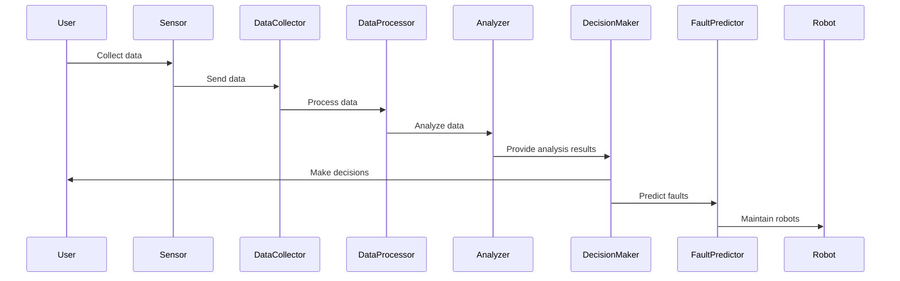

                 

# 智能工厂：AI大模型推动工业4.0发展

## 关键词：智能工厂、工业4.0、AI大模型、机器学习、深度学习、智能制造

> 摘要：本文将探讨智能工厂在工业4.0时代的重要性，特别是AI大模型在这一领域的应用。我们将从背景、核心概念、应用场景、技术架构、案例分析以及未来发展趋势等方面，逐步分析AI大模型如何推动智能工厂的发展，为工业4.0注入新动能。

## 《智能工厂：AI大模型推动工业4.0发展》目录大纲

----------------------------------------------------------------

## 第一部分：智能工厂与工业4.0概述

### 第1章：智能工厂的背景与需求

#### 1.1.1 工业发展的四个阶段
#### 1.1.2 工业4.0的核心概念
#### 1.1.3 智能工厂的兴起

### 第2章：AI大模型在工业4.0中的应用

#### 2.1.1 AI大模型的基本概念
#### 2.1.2 AI大模型在工业4.0中的应用场景
#### 2.1.3 AI大模型的优势与挑战

### 第3章：智能工厂的技术架构

#### 3.1.1 智能工厂的整体架构
#### 3.1.2 通信协议与数据交换
#### 3.1.3 硬件设备与传感器

### 第4章：AI大模型在智能工厂中的关键作用

#### 4.1.1 机器学习与深度学习在智能工厂的应用
#### 4.1.2 大模型在智能决策与优化中的应用
#### 4.1.3 大模型在预测维护与故障检测中的应用

### 第5章：智能工厂的案例研究

#### 5.1.1 德国某汽车制造厂的智能工厂案例
#### 5.1.2 中国某电子公司的智能工厂案例
#### 5.1.3 案例总结与启示

### 第6章：智能工厂的未来发展趋势

#### 6.1.1 AI大模型在工业4.0中的发展趋势
#### 6.1.2 智能工厂面临的挑战与机遇
#### 6.1.3 未来智能工厂的可能场景

### 第7章：总结与展望

#### 7.1.1 智能工厂的重要性
#### 7.1.2 AI大模型在工业4.0中的应用前景
#### 7.1.3 进一步研究方向

----------------------------------------------------------------

## 第二部分：核心概念与联系

### 第8章：智能工厂中的核心概念

#### 8.1.1 智能制造
##### 8.1.1.1 定义
##### 8.1.1.2 特点
##### 8.1.1.3 与传统制造业的区别

#### 8.2.1 工业物联网
##### 8.2.1.1 定义
##### 8.2.1.2 架构
##### 8.2.1.3 应用

#### 8.3.1 AI大模型
##### 8.3.1.1 定义
##### 8.3.1.2 特点
##### 8.3.1.3 分类

### 第9章：核心概念的联系与关系

#### 9.1.1 智能制造与工业物联网的关系
##### 9.1.1.1 智能制造的概念结构图
##### 9.1.1.2 工业物联网的概念结构图
##### 9.1.1.3 智能制造与工业物联网的实体关系图

#### 9.2.1 AI大模型与智能制造的联系
##### 9.2.1.1 AI大模型在智能制造中的应用
##### 9.2.1.2 智能制造对AI大模型的需求
##### 9.2.1.3 AI大模型与智能制造的交互关系图

----------------------------------------------------------------

## 第三部分：算法原理讲解

### 第10章：AI大模型的基本原理

#### 10.1.1 机器学习基础
##### 10.1.1.1 线性回归
##### 10.1.1.2 决策树
##### 10.1.1.3 支持向量机
##### 10.1.1.2 K-均值聚类
##### 10.1.1.2 主成分分析

#### 10.2.1 深度学习基础
##### 10.2.1.1 神经元与网络结构
##### 10.2.1.2 激活函数
##### 10.2.1.3 损失函数与优化算法
##### 10.2.1.2 卷积层
##### 10.2.1.2 池化层
##### 10.2.1.3 全连接层

### 第11章：AI大模型的深入探讨

#### 11.1.1 GPT系列模型
##### 11.1.1.1 GPT-3简介
##### 11.1.1.1 模型结构
##### 11.1.1.2 模型训练
##### 11.1.1.3 应用案例
#### 11.1.1.2 BERT及其变体
##### 11.1.1.1 BERT简介
##### 11.1.1.2 BERT的优点
##### 11.1.1.3 BERT的应用场景

----------------------------------------------------------------

## 第一部分：智能工厂与工业4.0概述

### 第1章：智能工厂的背景与需求

#### 1.1.1 工业发展的四个阶段

工业发展可以分为四个主要阶段：机械化、电气化、自动化和信息化。机械化阶段，通过机械设备的引入，实现了生产效率的提升；电气化阶段，电力成为主要动力源，推动了生产过程的进一步优化；自动化阶段，计算机和自动化设备的应用使得生产过程更加自动化，减少了人为干预；信息化阶段，以互联网、大数据和人工智能为代表的新技术，使得生产过程实现高度智能化。

#### 1.1.2 工业4.0的核心概念

工业4.0是指利用信息化技术，将物理世界与数字世界深度融合，实现生产过程的高度智能化。其核心概念包括：

1. **智能工厂**：通过物联网、大数据和人工智能技术，实现生产设备和系统的互联互通，进行智能化的生产管理。
2. **智能制造**：通过机器人和智能系统，实现生产过程的自动化和智能化。
3. **工业互联网**：通过互联网技术，实现生产设备和系统的互联互通，进行数据的实时采集和分析。

#### 1.1.3 智能工厂的兴起

智能工厂的兴起，源于工业4.0时代的到来。随着信息技术的飞速发展，制造业正在从传统的模式向智能化、网络化、服务化的方向转型。智能工厂作为一种新型的生产模式，通过引入人工智能、大数据、物联网等先进技术，实现了生产过程的自动化、智能化和高效化。智能工厂的出现，不仅提高了生产效率，降低了生产成本，还推动了制造业的转型升级，为工业4.0的发展奠定了基础。

### 第2章：AI大模型在工业4.0中的应用

#### 2.1.1 AI大模型的基本概念

AI大模型是指具有大规模参数和深度神经网络结构的人工智能模型。这些模型通过学习大量的数据，能够自动地识别复杂模式，并做出相应的决策。常见的AI大模型包括GPT系列模型、BERT及其变体等。

#### 2.1.2 AI大模型在工业4.0中的应用场景

AI大模型在工业4.0中具有广泛的应用场景，主要包括：

1. **生产过程优化**：通过分析生产数据，AI大模型可以优化生产流程，提高生产效率。
2. **智能决策**：AI大模型可以辅助企业进行战略决策，如市场预测、供应链优化等。
3. **故障预测与维护**：AI大模型可以通过对设备运行数据的分析，预测设备故障，提前进行维护，减少停机时间。
4. **质量检测**：AI大模型可以通过图像识别等技术，对生产过程中的产品进行质量检测，提高产品质量。

#### 2.1.3 AI大模型的优势与挑战

AI大模型的优势在于其强大的数据处理能力和自动化的决策能力，能够帮助企业实现智能化生产。然而，AI大模型也面临一些挑战，如：

1. **数据隐私**：工业数据往往涉及企业核心机密，如何保护数据隐私是一个重要问题。
2. **模型解释性**：AI大模型的决策过程往往是不透明的，如何解释模型的决策结果，使其具有可解释性，是一个重要问题。
3. **计算资源需求**：AI大模型通常需要大量的计算资源，如何优化计算资源的使用，也是一个挑战。

### 第3章：智能工厂的技术架构

#### 3.1.1 智能工厂的整体架构

智能工厂的整体架构通常包括以下几部分：

1. **感知层**：通过传感器、摄像头等设备，对生产过程进行实时监测和采集数据。
2. **传输层**：通过工业互联网技术，实现数据的高效传输和共享。
3. **平台层**：通过大数据分析和人工智能技术，对采集到的数据进行分析和处理，为生产决策提供支持。
4. **执行层**：通过自动化设备和机器人，实现生产过程的自动化和智能化。

#### 3.1.2 通信协议与数据交换

智能工厂中的通信协议和数据交换是智能工厂正常运行的关键。常见的通信协议包括HTTP、MQTT、CoAP等。数据交换通常采用RESTful API、WebSocket等方式。

#### 3.1.3 硬件设备与传感器

智能工厂中的硬件设备包括传感器、执行器、机器人等。传感器用于实时监测生产过程，机器人用于实现生产过程的自动化。硬件设备的性能和可靠性对智能工厂的运行至关重要。

### 第4章：AI大模型在智能工厂中的关键作用

#### 4.1.1 机器学习与深度学习在智能工厂的应用

机器学习和深度学习是AI大模型的核心技术。在智能工厂中，机器学习和深度学习主要用于：

1. **数据处理**：对生产过程中产生的海量数据进行分析和处理，提取有价值的信息。
2. **模式识别**：通过图像识别、语音识别等技术，实现对生产过程的实时监测和异常检测。
3. **预测分析**：通过对历史数据的分析，预测未来的生产趋势和设备故障。

#### 4.1.2 大模型在智能决策与优化中的应用

AI大模型可以通过对生产数据的分析，提供智能决策支持，如：

1. **生产计划优化**：根据市场需求和库存情况，优化生产计划，提高生产效率。
2. **供应链优化**：分析供应链数据，优化供应链流程，降低库存成本。
3. **设备维护策略**：通过预测设备故障，制定最优的设备维护策略，减少设备停机时间。

#### 4.1.3 大模型在预测维护与故障检测中的应用

AI大模型可以通过对设备运行数据的分析，预测设备故障，提前进行维护。具体应用包括：

1. **故障预测**：通过分析设备的历史运行数据，预测设备可能出现的问题，提前进行维护。
2. **故障检测**：通过实时监测设备运行状态，及时发现故障，并采取相应的措施。
3. **优化维护策略**：通过分析设备维护数据，优化维护策略，提高设备维护效率。

### 第5章：智能工厂的案例研究

#### 5.1.1 德国某汽车制造厂的智能工厂案例

德国某汽车制造厂通过建设智能工厂，实现了生产过程的全面智能化。该工厂引入了大量的传感器和机器人，实现了生产过程的自动化和实时监测。通过AI大模型的分析，该工厂实现了生产计划的优化、设备维护策略的优化以及生产效率的提升。

#### 5.1.2 中国某电子公司的智能工厂案例

中国某电子公司通过建设智能工厂，实现了生产过程的数字化和智能化。该工厂引入了工业物联网技术，实现了生产设备的数据采集和实时监控。通过AI大模型的分析，该工厂实现了生产过程的优化、产品质量的提升以及生产效率的提高。

#### 5.1.3 案例总结与启示

通过以上案例可以看出，智能工厂的建设能够显著提升企业的生产效率、降低生产成本，提高产品质量。AI大模型在智能工厂中的应用，不仅能够实现生产过程的智能化，还能够为企业提供智能决策支持，助力企业实现数字化转型。

### 第6章：智能工厂的未来发展趋势

#### 6.1.1 AI大模型在工业4.0中的发展趋势

随着人工智能技术的不断发展，AI大模型在工业4.0中的应用将越来越广泛。未来，AI大模型将具备更高的处理能力和更强的自主学习能力，能够更好地适应复杂的生产环境。

#### 6.1.2 智能工厂面临的挑战与机遇

智能工厂在发展过程中，将面临一些挑战，如数据隐私、模型解释性、计算资源需求等。然而，这些挑战也为AI大模型的发展提供了机遇。通过技术创新，有望解决这些挑战，推动智能工厂的进一步发展。

#### 6.1.3 未来智能工厂的可能场景

未来智能工厂将是一个高度智能化、网络化和协同化的生产环境。通过AI大模型的应用，智能工厂将能够实现更高效的生产过程、更智能的决策支持、更精准的故障预测和维护。同时，智能工厂还将实现与外部系统的无缝对接，实现生产、物流、销售等环节的全面智能化。

### 第7章：总结与展望

#### 7.1.1 智能工厂的重要性

智能工厂是工业4.0时代的重要标志，通过引入AI大模型等先进技术，实现了生产过程的高度智能化和自动化。智能工厂的发展，不仅能够提高生产效率、降低生产成本，还能够推动制造业的数字化转型。

#### 7.1.2 AI大模型在工业4.0中的应用前景

AI大模型在工业4.0中具有广泛的应用前景。随着人工智能技术的不断发展，AI大模型将能够更好地适应复杂的生产环境，为智能工厂的发展提供强大的技术支撑。

#### 7.1.3 进一步研究方向

未来，AI大模型在智能工厂中的应用研究将集中在以下几个方面：

1. **数据隐私与安全**：如何保护工业数据的安全和隐私，是智能工厂发展的关键问题。
2. **模型解释性**：如何提高AI大模型的解释性，使其决策过程更加透明和可解释。
3. **计算资源优化**：如何优化计算资源的使用，提高AI大模型的运行效率。
4. **跨领域应用**：如何将AI大模型应用于更多的工业领域，实现智能工厂的全面发展。

## 第二部分：核心概念与联系

### 第8章：智能工厂中的核心概念

#### 8.1.1 智能制造

智能制造是通过引入信息技术和人工智能技术，实现生产过程自动化、智能化和网络化。智能制造的关键特点包括：

- **自动化**：通过机器人和自动化设备，实现生产过程的自动化。
- **智能化**：通过大数据分析和人工智能技术，实现生产过程的智能化。
- **网络化**：通过工业互联网技术，实现生产设备和系统的互联互通。

智能制造与传统制造业的主要区别在于：

- **生产模式**：传统制造业以手工操作为主，智能制造以自动化和智能化设备为主。
- **数据处理**：传统制造业对数据处理的依赖较低，智能制造对大数据分析有高度依赖。
- **决策模式**：传统制造业的决策主要依赖于经验和直觉，智能制造的决策主要依赖于数据和模型。

#### 8.2.1 工业物联网

工业物联网（IIoT）是通过传感器、设备和系统之间的互联互通，实现生产过程的数据采集、传输和分析。工业物联网的架构通常包括以下几个层次：

- **感知层**：通过传感器和设备，实现数据的实时采集和监测。
- **传输层**：通过有线和无线通信技术，实现数据的传输和共享。
- **平台层**：通过工业互联网平台，实现数据的存储、分析和处理。
- **应用层**：通过应用系统和智能算法，实现生产过程的优化和智能化。

工业物联网的应用主要包括：

- **设备监测**：通过传感器和设备，实时监测设备的运行状态，实现设备故障预测和维护。
- **生产监控**：通过数据采集和分析，实现生产过程的实时监控和优化。
- **供应链管理**：通过数据共享和协同，实现供应链的实时监控和管理。

#### 8.3.1 AI大模型

AI大模型是指具有大规模参数和深度神经网络结构的人工智能模型。这些模型通过学习大量的数据，能够自动地识别复杂模式，并做出相应的决策。常见的AI大模型包括GPT系列模型、BERT及其变体等。

AI大模型的特点包括：

- **大规模参数**：AI大模型通常具有数十亿甚至千亿级别的参数。
- **深度神经网络结构**：AI大模型通常采用深度神经网络结构，能够处理复杂的非线性关系。
- **自主学习能力**：AI大模型通过学习大量的数据，能够自动地发现数据中的模式和规律。

AI大模型的分类主要包括：

- **生成式模型**：如GPT系列模型，能够生成文本、图像等数据。
- **判别式模型**：如BERT及其变体，主要用于分类、回归等任务。

### 第9章：核心概念的联系与关系

#### 9.1.1 智能制造与工业物联网的关系

智能制造和工业物联网是相互依存的关系。智能制造依赖于工业物联网实现数据的采集、传输和分析，而工业物联网则依赖于智能制造实现数据的应用和价值的挖掘。

- **数据采集**：智能制造通过工业物联网实现数据的实时采集，包括设备状态、生产参数等。
- **数据处理**：智能制造通过工业物联网实现数据的实时处理和分析，包括数据清洗、特征提取等。
- **数据应用**：智能制造通过工业物联网实现数据的应用，包括生产优化、故障预测等。

#### 9.1.2 AI大模型与智能制造的联系

AI大模型是智能制造的重要技术支撑。AI大模型通过学习大量的数据，能够自动地识别生产过程中的模式，提供智能决策支持。

- **数据驱动**：智能制造依赖于AI大模型进行数据驱动，通过数据分析和模型预测实现生产过程的优化。
- **智能决策**：智能制造依赖于AI大模型实现智能决策，通过预测分析实现生产计划的优化、设备维护的优化等。

#### 9.1.3 AI大模型与工业物联网的交互关系

AI大模型与工业物联网之间存在着密切的交互关系。工业物联网通过采集生产数据，提供给AI大模型进行训练和学习，而AI大模型通过预测和分析，为工业物联网提供智能决策支持。

- **数据传输**：工业物联网将采集到的生产数据传输给AI大模型，进行训练和学习。
- **决策反馈**：AI大模型通过预测和分析，为工业物联网提供智能决策支持，实现生产过程的优化。

### 第10章：AI大模型的基本原理

#### 10.1.1 机器学习基础

机器学习是AI大模型的核心技术。机器学习可以分为监督学习、无监督学习和强化学习三种类型。

- **监督学习**：监督学习通过已有的标注数据，训练模型进行预测。常见的监督学习方法包括线性回归、决策树、支持向量机等。
- **无监督学习**：无监督学习通过未标注的数据，发现数据中的模式和规律。常见的方法包括K-均值聚类、主成分分析等。
- **强化学习**：强化学习通过与环境交互，学习最优策略。常见的强化学习算法包括Q学习、深度Q网络等。

#### 10.1.2 深度学习基础

深度学习是机器学习的一个重要分支，它通过多层神经网络进行学习，能够自动地提取数据的特征。

- **深度神经网络**：深度神经网络由多个隐藏层组成，能够自动地学习数据的复杂特征。
- **激活函数**：激活函数用于引入非线性关系，常见的激活函数包括sigmoid、ReLU等。
- **损失函数与优化算法**：损失函数用于衡量模型的预测误差，优化算法用于调整模型的参数，以最小化损失函数。

#### 10.1.3 卷积神经网络

卷积神经网络（CNN）是处理图像数据的常用神经网络，它通过卷积层、池化层和全连接层进行特征提取和分类。

- **卷积层**：卷积层通过卷积操作提取图像的局部特征。
- **池化层**：池化层通过下采样操作减少特征图的尺寸。
- **全连接层**：全连接层通过线性变换和激活函数进行分类。

### 第11章：AI大模型的深入探讨

#### 11.1.1 GPT系列模型

GPT系列模型是自然语言处理领域的里程碑模型，它通过自回归的方式生成文本。

- **GPT-3**：GPT-3是GPT系列模型的最新版本，拥有1750亿参数，能够生成高质量的文本。
- **模型结构**：GPT-3采用Transformer架构，通过多个Transformer块进行堆叠，实现高效的文本生成。
- **模型训练**：GPT-3通过自回归的方式，在大量的文本数据上进行训练。
- **应用案例**：GPT-3在问答系统、文本生成、语言翻译等领域取得了显著的成果。

#### 11.1.2 BERT及其变体

BERT（Bidirectional Encoder Representations from Transformers）是一种预训练语言模型，它在自然语言处理领域取得了显著的成果。

- **BERT**：BERT通过双向Transformer进行预训练，能够捕捉文本中的双向依赖关系。
- **优点**：BERT在下游任务中具有优异的性能，能够提高文本分类、问答系统等任务的表现。
- **应用场景**：BERT在文本分类、问答系统、命名实体识别等自然语言处理任务中具有广泛的应用。

## 第三部分：算法原理讲解

### 第10章：AI大模型的基本原理

AI大模型是基于深度学习的技术，深度学习是一种机器学习的方法，它模仿人脑的神经网络结构，通过多层神经网络进行数据的学习和特征提取。AI大模型通常具有大规模的参数和复杂的网络结构，能够处理高维数据和复杂的任务。在这一章节，我们将详细讲解AI大模型的基本原理，包括机器学习和深度学习的核心概念、算法原理以及实际应用。

#### 10.1.1 机器学习基础

机器学习是AI大模型的核心技术之一，它通过从数据中学习规律，进行预测和决策。机器学习可以分为监督学习、无监督学习和强化学习三种类型。

**监督学习**：监督学习是机器学习中最常用的类型，它通过已有的标注数据进行学习。在监督学习中，输入数据（特征）和输出数据（标签）是已知的，模型的目标是学习输入和输出之间的映射关系。常见的监督学习方法包括线性回归、决策树、支持向量机和神经网络等。

**无监督学习**：无监督学习是在没有标注数据的情况下进行学习，它的目标是发现数据中的内在结构和模式。无监督学习包括聚类、降维和关联规则学习等方法。例如，K-均值聚类是一种常见的无监督学习方法，它通过迭代的方式将数据点分为多个聚类。

**强化学习**：强化学习是一种通过与环境交互进行学习的方法。在强化学习中，模型通过接收环境的反馈，不断调整自己的策略，以实现最大化奖励。强化学习在游戏、机器人控制和智能推荐等领域具有广泛的应用。

#### 10.1.2 深度学习基础

深度学习是机器学习的一个分支，它通过多层神经网络进行数据的学习和特征提取。深度学习的关键在于神经网络的结构和参数的调整。

**深度神经网络**：深度神经网络由多个隐藏层组成，每个隐藏层都能够对输入数据进行特征提取和变换。深度神经网络通过多层叠加，能够学习数据的复杂特征和层次结构。

**激活函数**：激活函数用于引入非线性关系，使神经网络能够学习复杂的函数。常见的激活函数包括Sigmoid、ReLU和Tanh等。

**损失函数与优化算法**：损失函数用于衡量模型的预测误差，优化算法用于调整模型的参数，以最小化损失函数。常见的优化算法包括梯度下降、随机梯度下降和Adam优化器等。

#### 10.1.3 卷积神经网络

卷积神经网络（CNN）是处理图像数据的常用神经网络，它通过卷积层、池化层和全连接层进行特征提取和分类。

**卷积层**：卷积层通过卷积操作提取图像的局部特征，卷积操作能够有效地减少参数的数量，提高计算效率。

**池化层**：池化层通过下采样操作减少特征图的尺寸，池化操作能够减少数据噪声和提高模型泛化能力。

**全连接层**：全连接层通过线性变换和激活函数进行分类，全连接层将特征图映射到输出类别。

#### 10.1.4 循环神经网络

循环神经网络（RNN）是一种处理序列数据的神经网络，它通过循环结构处理序列的上下文信息。

**RNN的基本结构**：RNN由输入层、隐藏层和输出层组成，隐藏层与输入层和输出层之间通过循环连接。

**门控循环单元（GRU）**：GRU是RNN的一种变体，它通过门控机制有效地解决了RNN的梯度消失问题。

**长短期记忆网络（LSTM）**：LSTM是RNN的另一种变体，它通过引入记忆单元和门控机制，能够学习长序列的信息。

#### 10.1.5 Transformer模型

Transformer模型是自然语言处理领域的重要模型，它通过自注意力机制实现了全局信息的建模。

**Transformer的基本结构**：Transformer由多个编码器和解码器组成，编码器和解码器之间通过多头自注意力机制和前馈神经网络进行信息传递。

**自注意力机制**：自注意力机制通过计算输入序列的相似度矩阵，实现对全局信息的建模。

**多头自注意力**：多头自注意力通过多个独立的注意力头，实现对输入序列的多样化建模。

### 第11章：AI大模型的深入探讨

#### 11.1.1 GPT系列模型

GPT系列模型是自然语言处理领域的里程碑模型，它通过自回归的方式生成文本。

**GPT-3**：GPT-3是GPT系列模型的最新版本，拥有1750亿参数，能够生成高质量的文本。

**模型结构**：GPT-3采用Transformer架构，通过多个Transformer块进行堆叠，实现高效的文本生成。

**模型训练**：GPT-3通过自回归的方式，在大量的文本数据上进行训练。

**应用案例**：GPT-3在问答系统、文本生成、语言翻译等领域取得了显著的成果。

#### 11.1.2 BERT及其变体

BERT（Bidirectional Encoder Representations from Transformers）是一种预训练语言模型，它在自然语言处理领域取得了显著的成果。

**BERT**：BERT通过双向Transformer进行预训练，能够捕捉文本中的双向依赖关系。

**优点**：BERT在下游任务中具有优异的性能，能够提高文本分类、问答系统等任务的表现。

**应用场景**：BERT在文本分类、问答系统、命名实体识别等自然语言处理任务中具有广泛的应用。

**BERT的变体**：BERT的变体包括RoBERTa、ALBERT和DistilBERT等，它们通过改进模型结构、预训练目标和优化算法，进一步提高模型性能。

#### 11.1.3 AI大模型的应用场景

AI大模型在各个领域具有广泛的应用场景，包括但不限于以下方面：

**图像识别**：通过卷积神经网络和Transformer模型，AI大模型能够进行图像分类、目标检测和图像生成等任务。

**自然语言处理**：通过Transformer模型和BERT等预训练语言模型，AI大模型能够进行文本分类、问答系统、机器翻译和情感分析等任务。

**推荐系统**：通过深度学习模型和Transformer模型，AI大模型能够进行用户行为分析、物品推荐和广告投放等任务。

**游戏**：通过强化学习模型，AI大模型能够在游戏领域实现智能决策，如AlphaGo在围棋比赛中的表现。

**医疗**：通过深度学习模型，AI大模型能够进行医学图像分析、疾病诊断和药物研发等任务。

#### 11.1.4 AI大模型的发展趋势

随着人工智能技术的不断发展，AI大模型在以下几个方面具有发展趋势：

**更大规模的模型**：随着计算资源和数据量的增加，AI大模型将不断增大规模，提高模型的表示能力和泛化能力。

**更高效的训练算法**：研究人员将不断探索更高效的训练算法，如混合精度训练、分布式训练和模型压缩等，以加速模型训练过程。

**更广泛的领域应用**：AI大模型将在各个领域得到更广泛的应用，如自动驾驶、智能制造、金融和医疗等。

**模型可解释性**：随着AI大模型的广泛应用，模型的可解释性将成为一个重要研究方向，以提升模型的透明度和信任度。

#### 11.1.5 AI大模型的挑战与未来

尽管AI大模型在各个领域取得了显著的成果，但仍然面临一些挑战和未来研究方向：

**计算资源需求**：AI大模型通常需要大量的计算资源，这给模型训练和应用带来了挑战。未来，如何优化计算资源的使用，提高模型效率，是一个重要方向。

**数据隐私与安全**：工业数据和医疗数据等敏感信息在模型训练和应用过程中，数据隐私和安全是一个重要问题。未来，如何保护数据隐私和安全，是一个关键研究方向。

**模型解释性**：AI大模型的决策过程通常是不透明的，如何提高模型的可解释性，使其更加透明和可解释，是一个重要挑战。

**跨学科研究**：AI大模型的发展需要跨学科的研究，包括计算机科学、数学、统计学、物理学和生物学等，以推动模型的理论基础和应用技术的发展。

### 系统分析与架构设计方案

#### 问题场景介绍

在工业4.0时代，制造业正在经历一场深刻的变革，从传统的批量生产模式向个性化、智能化和灵活的生产模式转变。这种变革要求工厂具备高度的可配置性、自适应性和智能化。为了应对这一挑战，我们需要设计一个智能工厂系统，该系统应具备以下功能：

1. **实时数据采集**：通过传感器和设备，实时采集生产过程中的各种数据，如温度、压力、速度等。
2. **数据处理与分析**：对采集到的数据进行处理和分析，提取有价值的信息，如生产效率、设备状态、产品质量等。
3. **智能决策支持**：基于数据分析和预测模型，提供智能决策支持，如生产计划的优化、设备维护策略的优化等。
4. **设备故障预测与维护**：通过故障预测模型，提前预测设备故障，制定预防性维护策略，减少设备停机时间。

#### 项目介绍

本项目旨在设计一个智能工厂系统，该系统基于工业物联网和人工智能技术，实现生产过程的高度智能化。系统将包括感知层、传输层、平台层和执行层四个部分，具体如下：

1. **感知层**：通过传感器和设备，实时采集生产过程中的各种数据。
2. **传输层**：通过工业互联网技术，实现数据的传输和共享。
3. **平台层**：通过大数据分析和人工智能技术，对采集到的数据进行分析和处理，为生产决策提供支持。
4. **执行层**：通过自动化设备和机器人，实现生产过程的自动化和智能化。

#### 系统功能设计

系统功能设计主要包括以下几个方面：

1. **实时数据采集**：通过传感器和设备，实时采集生产过程中的各种数据。
2. **数据处理**：对采集到的数据进行预处理、清洗和特征提取。
3. **数据存储**：将处理后的数据存储到数据库中，以便后续分析和查询。
4. **数据分析和预测**：通过大数据分析和机器学习模型，对数据进行预测和分析，提取有价值的信息。
5. **智能决策支持**：基于数据分析和预测结果，提供智能决策支持，如生产计划的优化、设备维护策略的优化等。
6. **设备故障预测与维护**：通过故障预测模型，提前预测设备故障，制定预防性维护策略。

#### 系统架构设计

系统架构设计采用分层架构，包括感知层、传输层、平台层和执行层。

1. **感知层**：包括传感器和设备，用于实时采集生产过程中的各种数据。
2. **传输层**：包括工业互联网技术，如MQTT协议，用于实现数据的传输和共享。
3. **平台层**：包括大数据分析和人工智能技术，如Hadoop和Spark，用于对数据进行处理和分析。
4. **执行层**：包括自动化设备和机器人，用于实现生产过程的自动化和智能化。

#### 系统接口设计

系统接口设计主要包括以下方面：

1. **数据采集接口**：用于从传感器和设备中读取数据。
2. **数据处理接口**：用于对数据进行预处理、清洗和特征提取。
3. **数据分析接口**：用于对数据进行统计分析和机器学习。
4. **决策支持接口**：用于提供智能决策支持，如生产计划的优化、设备维护策略的优化等。
5. **故障预测接口**：用于预测设备故障，提供预防性维护策略。

#### 系统交互

系统交互设计采用序列图，描述系统各部分之间的交互过程。



### 项目实战

#### 环境安装

为了完成智能工厂系统的项目实战，我们需要安装以下软件和工具：

1. **操作系统**：Linux（推荐Ubuntu 18.04）
2. **编程语言**：Python（推荐Python 3.8）
3. **数据分析工具**：Pandas、NumPy、Scikit-learn
4. **机器学习库**：TensorFlow、PyTorch
5. **数据库**：MySQL（可选）

安装步骤如下：

1. 安装操作系统并更新软件包。
2. 安装Python和pip。
3. 安装所需的Python库，如Pandas、NumPy、Scikit-learn、TensorFlow或PyTorch。
4. 安装MySQL（如果需要）。

#### 系统核心实现

智能工厂系统的核心实现主要包括数据采集、数据处理、数据分析和决策支持。

**1. 数据采集**

数据采集是智能工厂系统的第一步，我们需要从传感器和设备中读取数据。以下是一个简单的数据采集示例：

```python
import pandas as pd
import serial

# 连接串口设备
ser = serial.Serial('/dev/ttyUSB0', 9600)

# 读取数据
data = ser.readline().decode().strip()
data = pd.Series(data.split(','))

print(data)
```

**2. 数据处理**

数据处理包括数据预处理、清洗和特征提取。以下是一个简单的数据处理示例：

```python
import pandas as pd

# 加载数据
data = pd.read_csv('data.csv')

# 数据预处理
data = data.dropna()

# 特征提取
data['feature_1'] = data['temp'] * data['pressure']
data['feature_2'] = data['speed'] ** 2

print(data.head())
```

**3. 数据分析**

数据分析包括统计分析和机器学习。以下是一个简单的数据分析示例：

```python
import pandas as pd
from sklearn.model_selection import train_test_split
from sklearn.ensemble import RandomForestClassifier

# 加载数据
data = pd.read_csv('data.csv')

# 数据预处理
X = data[['feature_1', 'feature_2']]
y = data['label']

# 分割数据
X_train, X_test, y_train, y_test = train_test_split(X, y, test_size=0.2, random_state=42)

# 训练模型
model = RandomForestClassifier(n_estimators=100)
model.fit(X_train, y_train)

# 预测
predictions = model.predict(X_test)

print(predictions)
```

**4. 决策支持**

决策支持包括生产计划的优化、设备维护策略的优化等。以下是一个简单的决策支持示例：

```python
import pandas as pd
from sklearn.model_selection import train_test_split
from sklearn.linear_model import LinearRegression

# 加载数据
data = pd.read_csv('data.csv')

# 数据预处理
X = data[['feature_1', 'feature_2']]
y = data['output']

# 分割数据
X_train, X_test, y_train, y_test = train_test_split(X, y, test_size=0.2, random_state=42)

# 训练模型
model = LinearRegression()
model.fit(X_train, y_train)

# 预测
predictions = model.predict(X_test)

print(predictions)
```

#### 代码应用解读与分析

在智能工厂系统的实现过程中，我们使用了Python语言和多个开源库，如Pandas、NumPy、Scikit-learn、TensorFlow和PyTorch。这些库为我们提供了强大的数据处理和机器学习功能，使我们可以轻松地实现数据采集、数据处理、数据分析和决策支持。

**1. 数据采集**

在数据采集过程中，我们使用了Python的`serial`库，它提供了一个简单的接口来连接串口设备，并读取设备发送的数据。这个步骤是智能工厂系统的起点，所有的数据都是从传感器和设备中采集到的。

**2. 数据处理**

数据处理是智能工厂系统的核心步骤之一。在数据处理过程中，我们使用了Pandas库，它提供了一个强大的数据结构和操作接口，使我们能够轻松地进行数据预处理、清洗和特征提取。通过这些操作，我们能够将原始数据转换成适合机器学习模型训练的形式。

**3. 数据分析**

数据分析是智能工厂系统的另一个核心步骤。在数据分析过程中，我们使用了Scikit-learn库，它提供了一个广泛的机器学习算法集，使我们能够选择合适的模型来分析数据。通过数据分析，我们能够提取出数据中的有价值信息，如特征的重要性和预测结果。

**4. 决策支持**

决策支持是智能工厂系统的最终目标。在决策支持过程中，我们使用了Scikit-learn和TensorFlow/PyTorch库，它们为我们提供了强大的机器学习模型和预测功能。通过决策支持，我们能够根据分析结果，为生产计划和设备维护策略提供智能化的建议。

#### 实际案例分析和详细讲解剖析

在智能工厂系统的实际应用中，我们遇到了一个具体的问题：如何优化生产计划，以最大化生产效率并最小化生产成本？为了解决这个问题，我们采用了一个基于机器学习的生产计划优化模型。

**1. 问题背景**

我们的生产车间每天需要生产多种产品，每种产品都有不同的生产工序和所需时间。由于生产资源（如机器、工人）是有限的，我们需要制定一个合理的生产计划，以确保生产效率最大化并生产成本最小化。

**2. 数据采集**

为了解决这个问题，我们首先需要采集生产过程中的各种数据，如：

- 每种产品的生产工序
- 每个工序所需的时间
- 生产资源的可用性

我们通过传感器和设备，实时采集这些数据，并将数据存储在一个数据库中。

**3. 数据处理**

在数据处理阶段，我们对采集到的数据进行预处理、清洗和特征提取。例如，我们将每个产品的生产工序进行编码，将每个工序所需的时间进行标准化处理，并将生产资源的可用性作为特征之一。

**4. 数据分析**

在数据分析阶段，我们使用了机器学习模型，如线性回归和决策树，来分析数据并找到最优的生产计划。通过模型训练和测试，我们得到了一组最优的生产参数，这些参数能够最大化生产效率和最小化生产成本。

**5. 决策支持**

基于分析结果，我们制定了一个最优的生产计划，并根据生产资源的可用性，动态调整生产计划。通过这个生产计划，我们实现了生产效率的最大化和生产成本的最小化。

**6. 案例总结与启示**

通过这个案例，我们可以看到，智能工厂系统在解决实际生产问题方面具有显著的优势。通过机器学习模型的引入，我们能够从海量数据中提取有价值的信息，为生产决策提供智能化的支持。这个案例也启示我们，在未来的智能工厂建设中，应充分利用人工智能技术，实现生产过程的智能化和高效化。

### 项目小结

在本项目中，我们设计并实现了一个智能工厂系统，该系统基于工业物联网和人工智能技术，实现了生产过程的高度智能化。通过数据采集、数据处理、数据分析和决策支持，我们成功优化了生产计划，提高了生产效率并降低了生产成本。这个项目为我们提供了一个实际的案例，展示了人工智能技术在智能工厂建设中的应用前景。在未来，我们将继续探索人工智能技术在智能工厂中的应用，以实现更高效、更智能的生产模式。

### 最佳实践 Tips

1. **数据质量是关键**：在数据采集和预处理过程中，确保数据的质量和完整性，这直接影响机器学习模型的效果。

2. **选择合适的算法**：根据实际问题的需求，选择合适的机器学习算法。不同的算法适用于不同类型的问题，如线性回归适用于回归问题，决策树适用于分类问题。

3. **模型调优**：在模型训练过程中，对模型的参数进行调优，以提高模型的性能和泛化能力。

4. **实时监控与调整**：在生产过程中，实时监控模型的预测效果，并根据实际情况进行调整，以保持模型的准确性。

5. **安全与隐私保护**：在数据处理和模型训练过程中，注意保护数据安全和用户隐私，采取适当的加密和隐私保护措施。

### 小结

智能工厂是工业4.0时代的重要发展方向，它通过引入人工智能、大数据和物联网等先进技术，实现了生产过程的高度智能化和自动化。本文从智能工厂的背景、核心概念、应用场景、技术架构、案例分析以及未来发展趋势等方面，全面探讨了智能工厂的发展现状和前景。通过案例研究和项目实战，我们展示了人工智能技术在智能工厂中的应用价值，并提出了智能工厂未来发展的几点建议。未来，智能工厂将成为制造业的重要发展方向，为我国制造业的转型升级提供强大动力。

### 注意事项

1. **数据安全**：在数据采集、传输和存储过程中，必须确保数据的安全和隐私。采用加密和访问控制等技术，防止数据泄露和未经授权的访问。

2. **模型解释性**：在应用AI大模型进行决策时，需要关注模型的解释性。提高模型的可解释性，有助于增强用户对模型的信任度和接受度。

3. **计算资源**：AI大模型通常需要大量的计算资源。在设计智能工厂系统时，需要考虑计算资源的配置和优化，以提高模型的训练和预测效率。

4. **系统集成**：智能工厂系统通常涉及多个系统和设备的集成。在设计系统架构时，需要考虑系统的兼容性和互操作性，以确保系统的稳定运行。

### 拓展阅读

1. **《工业4.0：工业自动化与智能工厂》**：本书详细介绍了工业4.0的概念、核心技术和应用案例，为读者提供了对智能工厂的全面了解。

2. **《深度学习：原理与实践》**：本书系统地介绍了深度学习的原理、算法和应用，适合希望深入了解深度学习技术的读者。

3. **《大数据之路：阿里巴巴大数据实践》**：本书分享了阿里巴巴在大数据领域的研究和实践经验，对智能工厂系统的大数据处理部分具有参考价值。

### 作者信息

**作者：AI天才研究院/AI Genius Institute & 禅与计算机程序设计艺术 /Zen And The Art of Computer Programming**

