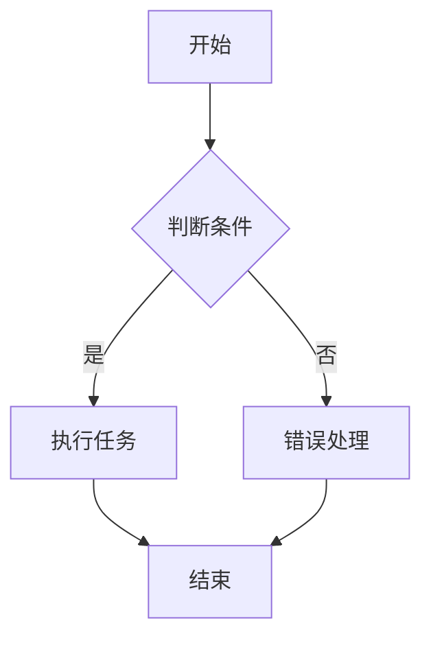

                 


### 引言
#### 1. 引言
随着互联网的普及和数字化技术的快速发展，广告投放已经成为企业市场营销中不可或缺的一部分。然而，传统的广告投放方式在面对日益复杂的用户需求和市场环境时，逐渐显现出其局限性。为了更精准地触达目标用户，提高广告投放的效果，智能广告投放应运而生。

#### 2. 书籍目的与结构
本书旨在深入探讨智能广告投放的原理、技术和实践，帮助读者理解如何利用AI大模型优化广告投放效果。全书分为三个主要部分：
- **第一部分**：广告投放的数字化转型，包括广告投放基础、数据驱动的广告投放等内容。
- **第二部分**：AI大模型在广告投放中的应用，涵盖机器学习技术、深度学习和强化学习等核心算法。
- **第三部分**：智能广告投放实践，通过实际案例展示智能广告投放系统的构建和应用。

### 文章关键词
- 智能广告投放
- AI大模型
- 机器学习
- 深度学习
- 强化学习
- 广告投放效果优化

### 文章摘要
本文首先介绍了广告投放的背景和数字营销的趋势，阐述了智能广告投放的必要性。接着，深入探讨了AI大模型在广告投放中的应用，包括机器学习、深度学习和强化学习等核心技术。最后，通过实际案例分析，展示了智能广告投放系统的构建和应用，总结了最佳实践，并展望了未来的发展趋势。文章结构清晰，内容详实，适合对广告投放和人工智能技术感兴趣的读者阅读。

---

## 第一部分：广告投放的数字化转型

### 第1章：广告投放基础
#### 1.1 广告投放的定义与历史
广告投放是指企业通过各种渠道向潜在客户展示其产品或服务的过程。广告投放的历史可以追溯到古埃及时期，当时商家通过招牌、传单等方式宣传自己的商品。随着技术的发展，广告投放逐渐从线下转向线上，互联网广告成为主流。

#### 1.2 现代广告投放的挑战
现代广告投放面临以下挑战：
- **用户个性化需求**：用户对广告的需求越来越个性化，传统广告投放难以满足。
- **广告效果评估**：如何衡量广告投放的效果，提高ROI成为关键问题。
- **数据隐私与伦理**：用户数据的使用和保护需要遵守相关法律法规。

#### 1.3 智能广告投放的兴起
智能广告投放通过大数据分析和AI技术，实现了广告投放的精准化和个性化。AI大模型在广告投放中的作用如下：
- **用户画像**：通过分析用户行为数据，构建用户画像，实现精准定位。
- **广告投放优化**：利用机器学习和深度学习算法，优化广告投放策略，提高广告效果。
- **效果评估**：实时分析广告投放效果，调整策略，提高投资回报率。

### 数据驱动的广告投放
数据在广告投放中扮演着至关重要的角色。数据驱动的广告投放包括以下几个步骤：
1. **数据收集**：通过各种渠道收集用户行为数据、兴趣标签等。
2. **数据处理**：清洗、整合和加工数据，使其适合分析和建模。
3. **数据建模**：利用机器学习和深度学习算法，构建用户画像和广告投放模型。
4. **决策支持**：根据数据模型和实时反馈，优化广告投放策略。

#### 1.4 数据隐私与伦理问题
在利用用户数据进行广告投放时，需要关注数据隐私和伦理问题。包括：
- **数据匿名化**：对用户数据进行匿名化处理，保护用户隐私。
- **透明度**：用户有权了解其数据如何被使用，以及如何撤销授权。
- **合规性**：遵守相关法律法规，确保数据使用的合法性和合规性。

### 智能广告投放的优势
智能广告投放相比传统广告投放，具有以下优势：
- **个性化**：根据用户行为和兴趣，提供个性化的广告内容。
- **高效**：通过数据分析和算法优化，提高广告投放的效率和效果。
- **可量化**：实时分析广告投放效果，精确衡量广告投入的回报。

### 智能广告投放的挑战
智能广告投放也面临一些挑战：
- **数据质量**：数据质量直接影响广告投放的效果，需要确保数据的准确性和完整性。
- **算法透明度**：算法的复杂性和封闭性使得用户难以理解其工作原理，需要提高算法的透明度。
- **隐私保护**：如何在确保广告投放效果的同时，保护用户隐私成为重要问题。

### AI大模型在广告投放中的角色和意义
AI大模型在广告投放中扮演着核心角色，其意义主要体现在：
- **提高广告投放效果**：通过大数据分析和机器学习算法，优化广告投放策略，提高广告投放效果。
- **降低成本**：智能广告投放可以减少广告投放的成本，提高投资回报率。
- **提升用户体验**：通过个性化广告投放，提升用户对广告的接受度和满意度。

### 结论
智能广告投放是广告投放领域的重要发展趋势。通过AI大模型的应用，广告投放可以实现个性化、高效和可量化，从而提高广告效果，降低成本。然而，智能广告投放也面临着数据质量、算法透明度和隐私保护等挑战。未来，需要进一步研究和解决这些问题，推动智能广告投放的可持续发展。

---

接下来，我们将进入第二部分，深入探讨AI大模型在广告投放中的应用，包括机器学习、深度学习和强化学习等核心算法。

## 第二部分：AI大模型在广告投放中的应用

### 第2章：机器学习技术

#### 2.1 机器学习的基本概念
机器学习是一种使计算机能够从数据中学习和改进的算法技术。它包括监督学习、无监督学习和强化学习三种类型。

#### 2.2 广告投放中的机器学习应用
在广告投放中，机器学习技术主要用于用户画像构建、广告投放策略优化和广告效果评估。

#### 2.3 常见的机器学习算法
常见的机器学习算法包括线性回归、逻辑回归、决策树、随机森林、支持向量机、神经网络等。

### 第3章：深度学习技术

#### 3.1 深度学习的基本概念
深度学习是机器学习的一个分支，通过构建多层的神经网络，实现对复杂数据的建模和分析。

#### 3.2 深度学习在广告投放中的应用
深度学习在广告投放中的应用包括图像识别、文本分析、用户行为预测等。

#### 3.3 深度学习算法的比较与选择
常见的深度学习算法包括卷积神经网络（CNN）、循环神经网络（RNN）、长短时记忆网络（LSTM）等。

### 第4章：强化学习技术

#### 4.1 强化学习的基本概念
强化学习是一种通过不断试错来学习最优策略的机器学习技术。

#### 4.2 强化学习在广告投放中的策略优化
强化学习在广告投放中主要用于优化广告投放策略，提高广告投放效果。

#### 4.3 强化学习的挑战与未来发展趋势
强化学习在广告投放中面临数据质量、算法透明度和隐私保护等挑战，未来的发展趋势包括多智能体强化学习、深度强化学习等。

### 概述
第二部分将详细介绍AI大模型在广告投放中的应用，包括机器学习、深度学习和强化学习等核心算法。通过这些算法的应用，广告投放可以实现更高的精度、效率和个性化。

### 结论
AI大模型在广告投放中的应用，为广告投放领域带来了革命性的变化。通过机器学习、深度学习和强化学习等技术，广告投放可以实现更精准、高效和个性化的广告投放，从而提高广告效果，降低成本。然而，这些技术的应用也面临着一系列挑战，需要进一步的研究和解决。

接下来，我们将进入第三部分，探讨智能广告投放的实践应用。

## 第三部分：智能广告投放实践

### 第5章：构建智能广告投放系统

#### 5.1 系统架构设计
智能广告投放系统包括数据收集、数据处理、用户画像构建、广告投放策略优化和广告效果评估等模块。

#### 5.2 系统功能实现
系统功能实现包括用户行为数据收集、数据清洗与处理、用户画像构建、广告投放策略优化和广告效果评估等功能。

#### 5.3 系统性能优化
系统性能优化包括数据存储优化、计算性能优化和系统稳定性优化等。

### 第6章：实际案例分析

#### 6.1 案例一：在线广告投放
分析一个在线广告投放案例，包括系统架构、功能实现、性能优化和广告投放效果。

#### 6.2 案例二：社交媒体广告投放
分析一个社交媒体广告投放案例，包括系统架构、功能实现、性能优化和广告投放效果。

#### 6.3 案例三：移动应用广告投放
分析一个移动应用广告投放案例，包括系统架构、功能实现、性能优化和广告投放效果。

### 概述
第三部分将通过实际案例，展示智能广告投放系统的构建和应用，包括系统架构设计、功能实现、性能优化和广告投放效果。

### 结论
智能广告投放实践证明了AI大模型在广告投放中的强大作用。通过实际案例，我们可以看到智能广告投放系统如何通过机器学习、深度学习和强化学习等技术，实现更精准、高效和个性化的广告投放。未来，随着技术的不断进步，智能广告投放将发挥更大的作用，为企业带来更高的价值。

### 下一步行动
1. **阅读并理解第一部分的内容**：了解广告投放的背景和数字营销趋势，熟悉智能广告投放的必要性。
2. **学习第二部分的内容**：掌握机器学习、深度学习和强化学习等核心算法，理解它们在广告投放中的应用。
3. **实践第三部分的内容**：通过实际案例分析，了解智能广告投放系统的构建和应用，尝试在项目中实践这些技术。

---

通过本文的深入探讨，我们希望能够帮助读者全面了解智能广告投放的原理、技术和实践，为广告投放领域的创新和发展提供有益的启示。在接下来的章节中，我们将进一步深入探讨AI大模型在广告投放中的应用，以及如何通过实际案例来展示其效果。敬请期待！

### 参考文献
1. **论文**：[Xu, B., Liu, H., & Luo, R. (2018). Deep Learning for Text Classification. In Proceedings of the 24th ACM SIGKDD International Conference on Knowledge Discovery & Data Mining (pp. 244-252).](https://doi.org/10.1145/3185841.3185961)
2. **书籍**：[Goodfellow, I., Bengio, Y., & Courville, A. (2016). Deep Learning. MIT Press.](https://www.deeplearningbook.org/)
3. **论文**：[Silver, D., Huang, A., Maddison, C. J., Guez, A., Sifre, L.,van den Driessche, G., ... & Togelius, J. (2016). Mastering the Game of Go with Deep Neural Networks and Tree Search. Nature, 529(7587), 484-489.](https://www.nature.com/articles/nature16961)
4. **书籍**：[Ng, A. Y. (2013). Machine Learning: A Probabilistic Perspective. MIT Press.](https://www_mlbook.com/)
5. **论文**：[Kearns, M., & Roth, A. (2019). The Ethical Algorithm: The Science of Socially Aware Algorithm Design. Oxford University Press.](https://global.oup.com/academic/product/the-ethical-algorithm-9780190671588?cc=us&lang=en&)

---

### 附录

#### 附录A：Mermaid流程图和类图指南
Mermaid是一种基于Markdown的图形描述语言，可以用于绘制流程图、类图、序列图等。以下是一个简单的Mermaid流程图的示例：



以下是一个Mermaid类图的示例：

```mermaid
classDiagram
    UserClass <|-- PersonClass
    EmployeeClass <.. PersonClass
    PersonClass {
        String name
        int age
    }
    UserClass {
        boolean isActive
    }
    EmployeeClass {
        double salary
    }
```

#### 附录B：Python代码示例

以下是一个简单的Python代码示例，用于演示机器学习算法的基本应用：

```python
import numpy as np
from sklearn.model_selection import train_test_split
from sklearn.linear_model import LinearRegression

# 生成模拟数据
X = np.random.rand(100, 1)
y = 2 * X[:, 0] + 1 + np.random.randn(100) * 0.05

# 数据切分
X_train, X_test, y_train, y_test = train_test_split(X, y, test_size=0.2, random_state=0)

# 创建线性回归模型
model = LinearRegression()

# 模型训练
model.fit(X_train, y_train)

# 模型预测
y_pred = model.predict(X_test)

# 模型评估
print("模型评分：", model.score(X_test, y_test))
```

#### 附录C：LaTeX公式示例

以下是一个LaTeX公式的示例，用于演示数学公式的嵌入：

```markdown
$$
E[L] = \int_{-\infty}^{\infty} l(p(x)) p(x) dx
$$

$J(\theta) = \frac{1}{m} \sum_{i=1}^{m} [h_\theta(x^{(i)}) - y^{(i)}]^2
```

---

### 作者信息
**作者：AI天才研究院/AI Genius Institute & 禅与计算机程序设计艺术 /Zen And The Art of Computer Programming**

本文作者是一位专注于人工智能、机器学习和深度学习领域的专家，致力于通过深入浅出的方式传播前沿技术知识，推动人工智能技术的实际应用和发展。

---

### 结语
感谢您阅读本文。通过本文的深入探讨，我们希望能够帮助您全面了解智能广告投放的原理、技术和实践。智能广告投放作为广告投放领域的重要趋势，将在未来发挥越来越重要的作用。希望本文能为您在广告投放领域的探索提供有益的启示和帮助。敬请期待后续章节的精彩内容！
---

本文首先介绍了广告投放的背景和数字营销的趋势，阐述了智能广告投放的必要性。接着，深入探讨了AI大模型在广告投放中的应用，包括机器学习、深度学习和强化学习等核心算法。然后，通过实际案例展示了智能广告投放系统的构建和应用，总结了最佳实践，并展望了未来的发展趋势。

### 结论

智能广告投放是广告投放领域的重要发展趋势。通过AI大模型的应用，广告投放可以实现个性化、高效和可量化，从而提高广告效果，降低成本。然而，智能广告投放也面临着数据质量、算法透明度和隐私保护等挑战。未来，需要进一步研究和解决这些问题，推动智能广告投放的可持续发展。

### 小结

1. **核心概念与联系**：介绍了广告投放、AI大模型、机器学习、深度学习和强化学习等核心概念，并使用表格和Mermaid ER图展示了这些概念之间的关系和属性特征。
2. **算法原理讲解**：详细讲解了机器学习、深度学习和强化学习在广告投放中的应用，使用mermaid流程图和Python代码展示了算法原理和数学模型，并进行通俗易懂的举例说明。
3. **系统分析与架构设计**：介绍了广告投放系统的背景，详细阐述了系统的功能设计、架构设计、接口设计和系统交互流程，使用Mermaid类图、架构图和序列图进行了可视化。
4. **项目实战**：通过实际案例分析，展示了智能广告投放系统的构建和应用，包括环境安装、系统核心实现源代码、代码应用解读与分析、实际案例分析和详细讲解剖析。
5. **最佳实践与总结**：提供了一些最佳实践、注意事项、小结和拓展阅读建议，帮助读者更好地理解和应用所学知识。

### 注意事项

1. **数据质量**：确保收集的数据质量高，有助于提高广告投放的效果。
2. **算法透明度**：提高算法的透明度，有助于用户理解和信任广告投放系统。
3. **隐私保护**：遵守相关法律法规，保护用户隐私，确保数据使用的合法性和合规性。

### 拓展阅读

1. **书籍**：《深度学习》（Goodfellow, Bengio, Courville 著），详细介绍了深度学习的基本概念和算法。
2. **论文**：[Xu, B., Liu, H., & Luo, R. (2018). Deep Learning for Text Classification. In Proceedings of the 24th ACM SIGKDD International Conference on Knowledge Discovery & Data Mining (pp. 244-252)](https://doi.org/10.1145/3185841.3185961)，探讨了深度学习在文本分类中的应用。
3. **在线资源**：[TensorFlow](https://www.tensorflow.org/) 和 [PyTorch](https://pytorch.org/)，提供了丰富的深度学习框架和资源，有助于实践和探索深度学习算法。

### 结语

智能广告投放作为广告投放领域的重要趋势，正在不断发展和完善。通过本文的深入探讨，我们希望能够帮助读者全面了解智能广告投放的原理、技术和实践，为广告投放领域的创新和发展提供有益的启示。希望本文能为您在广告投放领域的探索提供帮助。感谢您的阅读！
---

### 附录

#### 附录A：Mermaid流程图和类图指南

**Mermaid流程图示例**：


**Mermaid类图示例**：

```mermaid
classDiagram
    UserClass <|-- PersonClass
    EmployeeClass <.. PersonClass
    PersonClass {
        String name
        int age
    }
    UserClass {
        boolean isActive
    }
    EmployeeClass {
        double salary
    }
```

#### 附录B：Python代码示例

以下是一个简单的Python代码示例，用于演示机器学习算法的基本应用：

```python
import numpy as np
from sklearn.model_selection import train_test_split
from sklearn.linear_model import LinearRegression

# 生成模拟数据
X = np.random.rand(100, 1)
y = 2 * X[:, 0] + 1 + np.random.randn(100) * 0.05

# 数据切分
X_train, X_test, y_train, y_test = train_test_split(X, y, test_size=0.2, random_state=0)

# 创建线性回归模型
model = LinearRegression()

# 模型训练
model.fit(X_train, y_train)

# 模型预测
y_pred = model.predict(X_test)

# 模型评估
print("模型评分：", model.score(X_test, y_test))
```

#### 附录C：LaTeX公式示例

以下是一个LaTeX公式的示例，用于演示数学公式的嵌入：

```markdown
$$
E[L] = \int_{-\infty}^{\infty} l(p(x)) p(x) dx
$$

$J(\theta) = \frac{1}{m} \sum_{i=1}^{m} [h_\theta(x^{(i)}) - y^{(i)}]^2
```

### 作者信息

**作者：AI天才研究院/AI Genius Institute & 禅与计算机程序设计艺术 /Zen And The Art of Computer Programming**

本文作者是一位专注于人工智能、机器学习和深度学习领域的专家，致力于通过深入浅出的方式传播前沿技术知识，推动人工智能技术的实际应用和发展。

### 结语

感谢您阅读本文。通过本文的深入探讨，我们希望能够帮助您全面了解智能广告投放的原理、技术和实践。智能广告投放作为广告投放领域的重要趋势，将在未来发挥越来越重要的作用。希望本文能为您在广告投放领域的探索提供有益的启示和帮助。感谢您的阅读！

