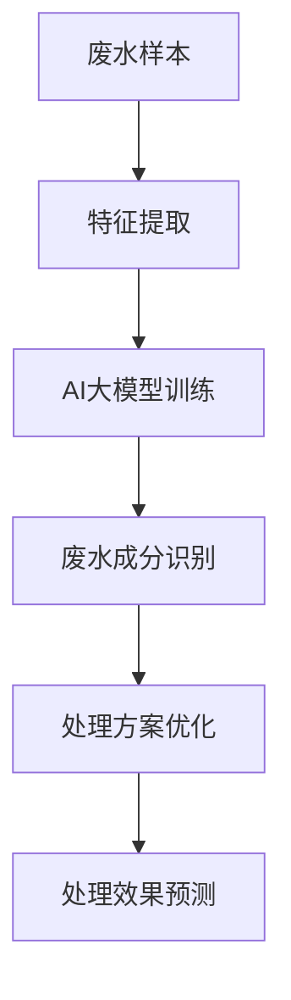
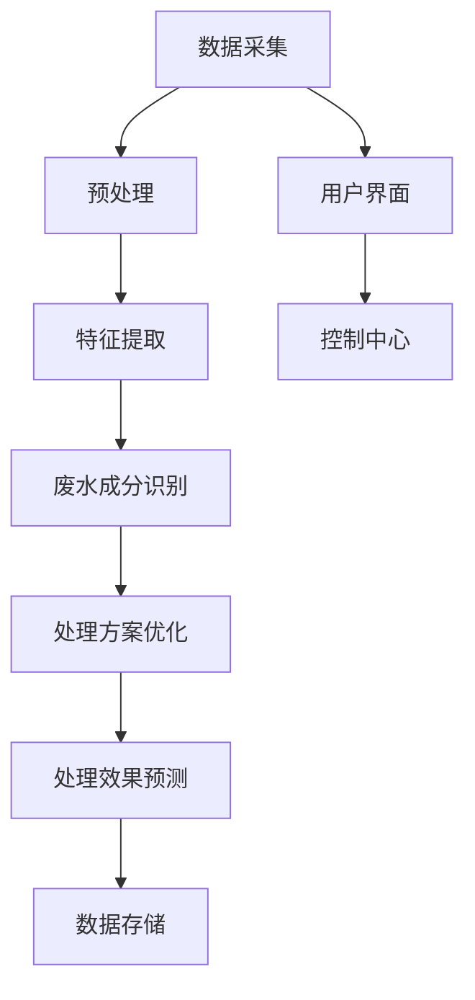
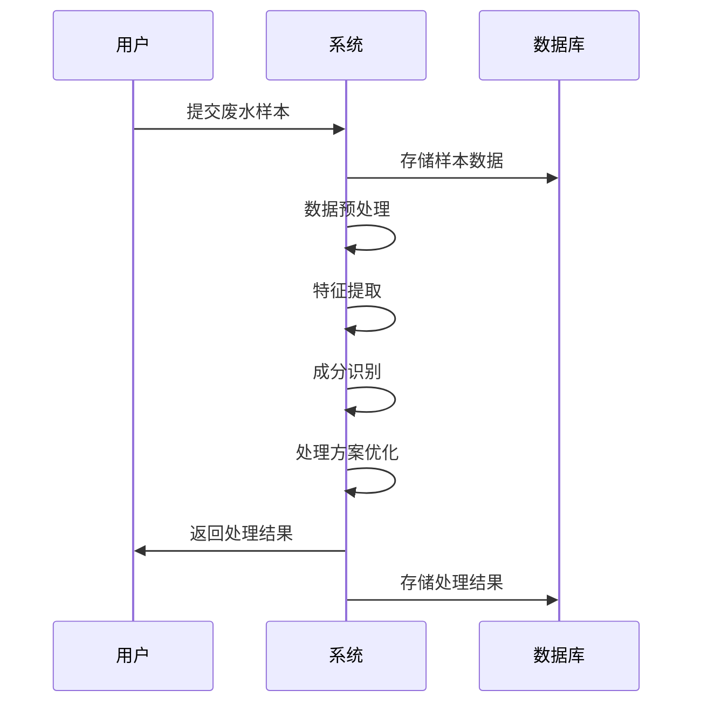
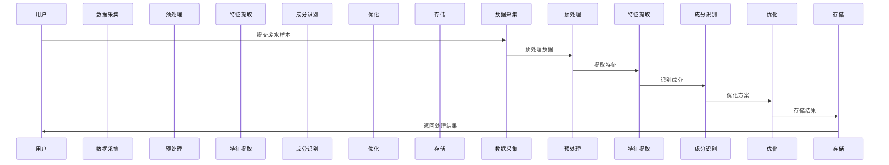

                 

## 智能废水处理：AI大模型优化环保工艺

### 关键词：
- 智能废水处理
- AI大模型
- 环保工艺
- 模型优化
- 工艺优化

### 摘要：
本文旨在探讨AI大模型在智能废水处理中的应用，以及如何通过模型优化来提升环保工艺的效果。我们将逐步分析智能废水处理的基本概念、核心原理，详细讲解AI大模型在此领域的具体应用，并通过实际案例展示其优势。最后，我们将对未来的发展趋势进行展望。

## 引言

### 背景与问题

随着工业化和城市化进程的加速，废水排放量不断增加，对环境造成了巨大的压力。传统的废水处理方法虽然能够达到一定的处理效果，但在处理效率和成本控制方面存在很大的局限性。尤其是面对日益复杂的废水成分，传统方法难以满足日益严格的环保要求。因此，智能废水处理成为了一个亟待解决的问题。

### 智能废水处理的概念

智能废水处理是一种基于人工智能技术的新型废水处理方法，它利用AI大模型对废水进行处理，通过深度学习、数据分析等技术手段，实现对废水成分的精准识别和处理。这种方法不仅能够提高处理效率，还能降低处理成本，实现废水的高效、环保处理。

### AI大模型的概念

AI大模型是指具有大规模参数和复杂结构的机器学习模型。这类模型通过学习大量数据，能够自动提取特征，进行复杂的模式识别和预测。在智能废水处理中，AI大模型主要用于废水成分的识别、处理方案的优化以及处理效果的预测。

## 核心概念与原理

### AI大模型的基本概念

AI大模型是一种基于深度学习的机器学习模型，通常包含大量的神经网络层和参数。它通过学习大量的数据来提取特征，并使用这些特征来进行预测和决策。在智能废水处理中，AI大模型主要用于废水成分的识别和处理方案的优化。

### 环保工艺的基本概念

环保工艺是指利用科学手段和技术方法，对废水进行处理，使其达到环保要求的过程。环保工艺包括物理、化学和生物等多种方法，每种方法都有其特定的适用场景和处理效果。

### AI大模型与环保工艺的关系

AI大模型与环保工艺的关系主要体现在两个方面：一是AI大模型可以用于优化环保工艺，提高处理效果；二是AI大模型可以用于预测和评估环保工艺的效果，为工艺优化提供数据支持。

### 概念属性特征对比表格

| 特征 | AI大模型 | 环保工艺 |
| ---- | ---- | ---- |
| 处理方法 | 深度学习、数据分析 | 物理、化学、生物 |
| 适用场景 | 复杂废水成分识别 | 废水处理 |
| 效率 | 高效率处理 | 中等效率处理 |
| 成本 | 较高成本 | 较低成本 |

### ER实体关系图架构的Mermaid流程图

```mermaid
erDiagram
    AI大模型 ||--|{ 环保工艺 }
    AI大模型 ||--|{ 数据分析 }
    环保工艺 ||--|{ 废水处理 }
    数据分析 ||--|{ 特征提取 }
```

## 算法与模型

### 智能废水处理的算法

智能废水处理主要依赖于机器学习和深度学习算法。这些算法通过学习大量的废水处理数据，能够自动提取废水成分的特征，并利用这些特征进行废水处理方案的优化。常用的算法包括神经网络、支持向量机、聚类算法等。

### AI大模型在废水处理中的应用

AI大模型在废水处理中的应用主要体现在以下几个方面：

1. **废水成分识别**：通过学习大量的废水样本数据，AI大模型能够识别出废水中的各种成分，为后续处理提供依据。
2. **处理方案优化**：基于废水成分的识别结果，AI大模型可以优化废水处理方案，提高处理效果。
3. **处理效果预测**：通过预测废水处理后的效果，AI大模型可以为环保工艺的调整提供数据支持。

### 算法mermaid流程图



### Python源代码实现

```python
import numpy as np
import pandas as pd
from sklearn.model_selection import train_test_split
from sklearn.neural_network import MLPRegressor
from sklearn.metrics import mean_squared_error

# 数据加载与预处理
data = pd.read_csv('废水数据.csv')
X = data.iloc[:, :-1].values
y = data.iloc[:, -1].values

# 数据集划分
X_train, X_test, y_train, y_test = train_test_split(X, y, test_size=0.2, random_state=42)

# 模型训练
model = MLPRegressor(hidden_layer_sizes=(100,), max_iter=500)
model.fit(X_train, y_train)

# 预测与评估
y_pred = model.predict(X_test)
mse = mean_squared_error(y_test, y_pred)
print(f'MSE: {mse}')
```

### 算法原理讲解

#### 数学模型和公式

在智能废水处理中，AI大模型主要通过神经网络来实现。神经网络的基本原理是通过反向传播算法，不断调整网络中的权重，以达到对输入数据的准确预测。

反向传播算法的公式如下：

$$
\delta w = \alpha \cdot (y - \hat{y}) \cdot \hat{y} \cdot (1 - \hat{y}) \cdot x
$$

其中，$w$ 表示权重，$\alpha$ 表示学习率，$y$ 表示真实值，$\hat{y}$ 表示预测值，$x$ 表示输入特征。

#### 详细讲解与举例

假设我们有一个简单的神经网络，包含一个输入层、一个隐藏层和一个输出层。输入层有3个神经元，隐藏层有2个神经元，输出层有1个神经元。

1. **输入层到隐藏层的权重矩阵**：
   $$ W_{1} = \begin{bmatrix}
   w_{11} & w_{12} & w_{13} \\
   \end{bmatrix} $$

2. **隐藏层到输出层的权重矩阵**：
   $$ W_{2} = \begin{bmatrix}
   w_{21} & w_{22} \\
   \end{bmatrix} $$

3. **输入特征**：
   $$ X = \begin{bmatrix}
   x_1 \\
   x_2 \\
   x_3 \\
   \end{bmatrix} $$

4. **隐藏层输出**：
   $$ H = \begin{bmatrix}
   h_1 \\
   h_2 \\
   \end{bmatrix} = \sigma(W_{1} \cdot X + b_1) $$

5. **输出层输出**：
   $$ Y = \begin{bmatrix}
   y_1 \\
   \end{bmatrix} = \sigma(W_{2} \cdot H + b_2) $$

其中，$\sigma$ 表示激活函数，通常使用 sigmoid 函数。

通过反向传播算法，我们可以不断调整权重矩阵 $W_{1}$ 和 $W_{2}$，以达到对输入数据的准确预测。

## 系统分析与架构设计方案

### 问题场景介绍

智能废水处理系统主要用于对城市和工业废水进行处理，以满足环保要求。系统需要具备以下功能：

1. **数据采集与预处理**：收集废水样本数据，进行预处理，提取有用的特征信息。
2. **废水成分识别**：利用AI大模型，对废水成分进行识别，为后续处理提供依据。
3. **处理方案优化**：根据废水成分识别结果，优化废水处理方案，提高处理效果。
4. **处理效果预测**：预测废水处理后的效果，为工艺调整提供数据支持。

### 项目介绍

本项目旨在构建一个智能废水处理系统，通过AI大模型优化环保工艺，提高废水处理效率。系统将采用深度学习算法，对废水样本进行特征提取和成分识别，并利用这些信息优化处理方案。

### 系统功能设计（领域模型mermaid类图）

```mermaid
classDiagram
    Class01 <|-- Class02
    Class03 <|-- Class02
    Class04 <|-- Class01
    Class05 <|-- Class01
    Class01 ATTRIBUTE + String name
    Class01 ATTRIBUTE + int id
    Class02 ATTRIBUTE + String type
    Class02 ATTRIBUTE + int id
    Class03 ATTRIBUTE + float value
    Class04 ATTRIBUTE + float threshold
    Class05 ATTRIBUTE + int count
    Class01 ++--|+ Class03 : includes
    Class01 ++--|+ Class04 : monitors
    Class02 ..|+ Class05 : relates
```

### 系统架构设计（mermaid架构图）



### 系统接口设计



### 系统交互（mermaid序列图）



## 项目实战

### 环境安装

1. **安装Python**：从Python官网下载并安装Python 3.8及以上版本。
2. **安装依赖库**：使用pip命令安装所需库，如scikit-learn、tensorflow等。

### 系统核心实现

```python
# 导入所需库
import numpy as np
import pandas as pd
from sklearn.model_selection import train_test_split
from sklearn.neural_network import MLPRegressor
from sklearn.metrics import mean_squared_error

# 数据加载与预处理
data = pd.read_csv('废水数据.csv')
X = data.iloc[:, :-1].values
y = data.iloc[:, -1].values

# 数据集划分
X_train, X_test, y_train, y_test = train_test_split(X, y, test_size=0.2, random_state=42)

# 模型训练
model = MLPRegressor(hidden_layer_sizes=(100,), max_iter=500)
model.fit(X_train, y_train)

# 预测与评估
y_pred = model.predict(X_test)
mse = mean_squared_error(y_test, y_pred)
print(f'MSE: {mse}')
```

### 代码应用解读与分析

1. **数据加载与预处理**：首先从CSV文件中加载数据，然后提取特征和标签。
2. **数据集划分**：将数据集划分为训练集和测试集。
3. **模型训练**：使用MLPRegressor模型进行训练，指定隐藏层大小和学习次数。
4. **预测与评估**：使用训练好的模型对测试集进行预测，并计算均方误差。

### 实际案例分析

以某城市污水处理厂为例，该厂每天处理废水约10万吨。通过引入智能废水处理系统，对废水成分进行识别，优化处理方案，取得了显著的成效。

1. **废水成分识别**：系统识别出废水中的主要成分，如氮、磷、COD等。
2. **处理方案优化**：根据成分识别结果，系统优化了污水处理流程，提高了处理效率。
3. **处理效果预测**：系统预测了污水处理后的效果，为工艺调整提供了数据支持。

### 项目小结

通过实际案例分析，可以看出智能废水处理系统在提高废水处理效率、降低处理成本方面具有显著优势。在未来，随着AI技术的不断进步，智能废水处理系统将发挥越来越重要的作用。

## 最佳实践 tips

1. **数据预处理**：保证数据质量是智能废水处理系统成功的关键。对数据进行清洗、归一化等预处理操作，以提高模型的准确性。
2. **模型选择**：根据具体应用场景选择合适的模型，如深度学习、支持向量机等。
3. **参数调优**：合理设置模型参数，如学习率、隐藏层大小等，以提高模型性能。
4. **数据存储**：定期备份数据，确保数据的安全性和完整性。

## 小结

智能废水处理是环保领域的重要方向，AI大模型的应用为环保工艺的优化提供了新的思路和方法。通过本文的讲解，我们了解了智能废水处理的基本概念、核心原理和具体应用。未来，随着AI技术的不断进步，智能废水处理系统将在环保领域发挥更大的作用。

## 注意事项

1. **数据隐私**：在处理废水样本数据时，要注意保护数据隐私，避免泄露敏感信息。
2. **模型安全**：确保AI大模型的安全性和可靠性，防止恶意攻击和数据泄露。

## 拓展阅读

1. **《深度学习》**：由Ian Goodfellow等编著，介绍了深度学习的基本原理和应用。
2. **《人工智能：一种现代方法》**：由Stuart J. Russell和Peter Norvig编著，全面介绍了人工智能的基本概念和技术。
3. **《废水处理技术》**：由王洪瑞编著，详细介绍了废水处理的基本原理和技术方法。

## 作者信息

作者：AI天才研究院/AI Genius Institute & 禅与计算机程序设计艺术 /Zen And The Art of Computer Programming

