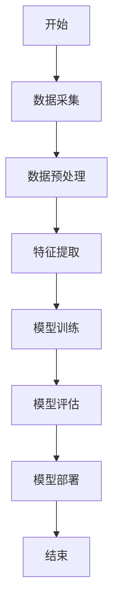
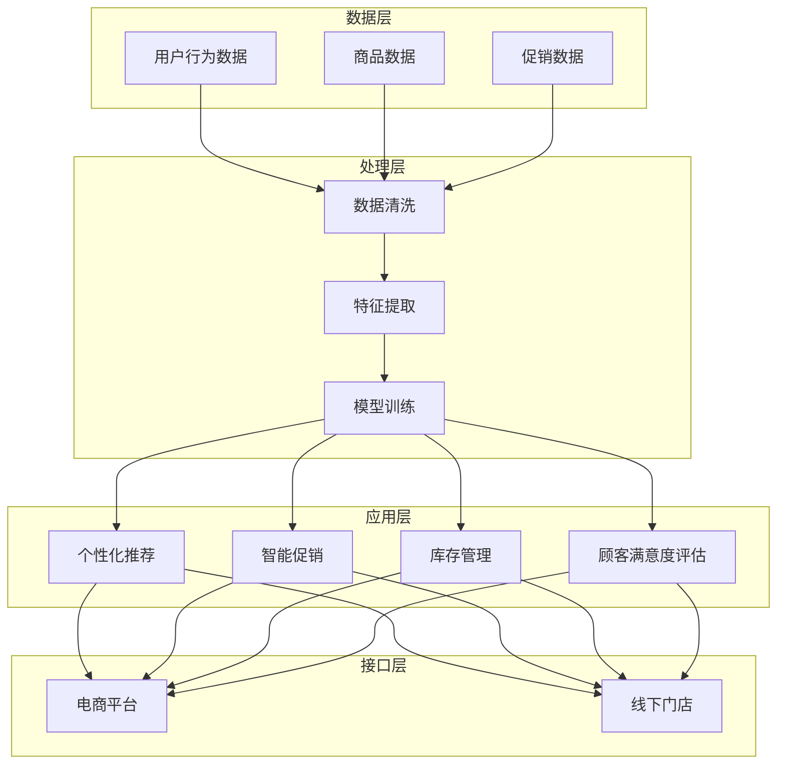
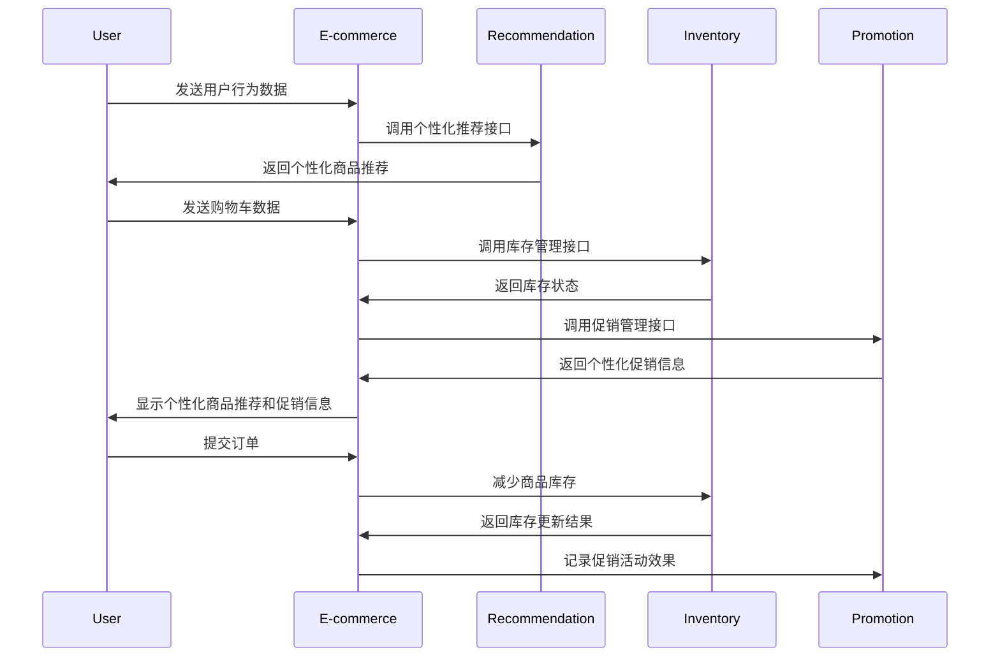

                 

# 智能零售系统：大数据驱动的个性化购物体验

> 关键词：智能零售、大数据、个性化购物、人工智能、零售行业、算法原理、系统架构、项目实战

> 摘要：本文将探讨智能零售系统的概念和其在零售行业中的应用，详细分析大数据和人工智能技术在解决零售行业挑战中的作用。通过深入讲解算法原理、系统架构设计和项目实战，展示智能零售系统如何通过个性化购物体验提升消费者满意度，并推动零售行业的发展。

## 目录大纲设计思路

在设计《智能零售系统：大数据驱动的个性化购物体验》的目录大纲时，我们将遵循以下步骤，确保内容的完整性、逻辑性和实用性：

1. **背景介绍**
   - **问题背景**：介绍智能零售系统的概念和其在零售行业中的应用。
   - **问题描述**：详细描述当前零售行业面临的主要挑战，如消费者需求多样化、数据碎片化等。
   - **问题解决**：探讨大数据和人工智能技术如何解决上述问题。
   - **边界与外延**：明确智能零售系统的范畴，包括其核心技术、应用场景等。
   - **概念结构与核心要素组成**：梳理智能零售系统的核心概念和组成结构。

2. **核心概念与联系**
   - **核心概念原理**：详细解释大数据、人工智能、机器学习等核心概念。
   - **概念属性特征对比表格**：通过表格形式比较这些概念的特点和应用领域。
   - **ER实体关系图架构**：使用Mermaid绘制实体关系图，展示系统中的实体及其关系。

3. **算法原理讲解**
   - **Mermaid流程图**：绘制算法流程图，直观展示算法的执行过程。
   - **Python源代码**：提供算法的Python实现，并详细注释代码功能。
   - **数学模型和公式**：阐述算法背后的数学原理，使用LaTeX格式表示。
   - **详细讲解与举例说明**：结合实际案例，讲解算法的原理和应用，确保内容通俗易懂。

4. **系统分析与架构设计方案**
   - **问题场景介绍**：描述智能零售系统的典型应用场景。
   - **项目介绍**：简要介绍系统开发的项目背景和目标。
   - **系统功能设计**：使用Mermaid类图展示系统的领域模型。
   - **系统架构设计**：使用Mermaid架构图展示系统的整体架构。
   - **系统接口设计**：说明系统的主要接口和交互流程。
   - **系统交互Mermaid序列图**：绘制系统组件之间的交互序列图。

5. **项目实战**
   - **环境安装**：提供系统所需的软件和硬件环境安装指南。
   - **系统核心实现源代码**：展示系统的关键代码片段，并进行详细解读。
   - **代码应用解读与分析**：分析代码的应用场景和效果。
   - **实际案例分析和详细讲解剖析**：通过实际案例，展示系统的应用效果。
   - **项目小结**：总结项目的主要成果和经验。

6. **最佳实践 tips、小结、注意事项、拓展阅读**
   - **最佳实践 tips**：提供一些实用的操作技巧和建议。
   - **小结**：总结各章节的核心内容和主要结论。
   - **注意事项**：提醒读者在应用系统时需要注意的事项。
   - **拓展阅读**：推荐一些相关书籍、文章或资源，帮助读者深入学习。

### 实际应用中的注意事项

在设计文章时，需要关注以下几个要点：

- **简洁性**：在确保内容完整性的同时，避免冗余和重复，保持内容的简洁。
- **结构清晰**：目录结构要清晰，便于读者快速查找和理解。
- **图表应用**：合理使用图表，如Mermaid图、表格等，以增强内容的可读性和直观性。
- **代码注释**：代码注释要清晰，便于读者理解和学习。
- **LaTeX格式**：确保数学公式和代码的格式正确，提高文档的专业性。

通过以上步骤，我们可以设计出一个完整、逻辑清晰且具有实用价值的《智能零售系统：大数据驱动的个性化购物体验》目录大纲，为读者提供系统的学习路径和丰富的学习资源。接下来，我们将根据这些思路，逐步构建具体的目录大纲。接下来，我们将深入探讨智能零售系统的背景和核心概念。

## 背景介绍

### 智能零售系统的概念

智能零售系统是指结合大数据、人工智能和机器学习等技术，通过对消费者行为数据的深度挖掘和分析，实现零售业务全流程的智能化和个性化服务。其核心目标是提升消费者的购物体验，增加客户的黏性和忠诚度，从而提高零售商的运营效率和市场竞争力。

智能零售系统的关键组成部分包括：

- **数据采集**：通过各种渠道收集消费者行为数据，如在线购物记录、社交媒体互动、地理位置信息等。
- **数据处理**：使用大数据技术对采集到的数据进行清洗、存储和管理，为后续的分析提供基础。
- **数据分析**：运用机器学习和人工智能算法，对处理后的数据进行分析，挖掘消费者行为模式和偏好。
- **个性化推荐**：根据分析结果，为消费者提供个性化的商品推荐和购物建议。
- **智能决策**：通过分析消费者行为和市场趋势，帮助零售商制定更精准的营销策略和库存管理。

### 当前零售行业的挑战

随着互联网和电子商务的快速发展，零售行业正面临着一系列前所未有的挑战：

- **消费者需求多样化**：消费者越来越注重个性化服务和定制化体验，传统的零售模式难以满足这种需求。
- **数据碎片化**：消费者的购物行为和需求分布在不同的渠道和平台，导致数据分散，难以整合和分析。
- **竞争加剧**：随着新零售业态的涌现，传统零售商面临来自线上和线下多个维度的竞争压力。
- **运营成本上升**：租金、人力等运营成本不断上涨，要求零售商在成本控制方面寻求创新和优化。

### 大数据和人工智能技术的应用

大数据和人工智能技术在解决上述挑战方面具有重要作用：

- **大数据**：通过整合和分析多种数据源，大数据技术可以帮助零售商更全面地了解消费者行为和市场趋势，从而制定更有效的营销策略和库存管理方案。
- **人工智能**：利用机器学习和深度学习算法，人工智能可以自动识别消费者行为模式，进行个性化推荐和智能决策，降低人工干预成本，提高运营效率。

### 智能零售系统的边界与外延

智能零售系统的边界和范围随着技术的发展而不断扩大，主要包括以下几个方面：

- **技术应用范围**：从基本的消费者行为分析、个性化推荐，到复杂的智能决策和智能供应链管理。
- **应用场景**：覆盖线上线下零售全渠道，包括电商平台、线下门店、无人便利店、智能货架等。
- **行业覆盖**：不仅局限于传统零售行业，还可以应用于服装、家居、食品等各个消费领域。

### 概念结构与核心要素组成

智能零售系统的概念结构主要由以下几个核心要素组成：

- **消费者数据**：系统的基础，包括消费者的基本信息、购物行为、偏好等。
- **数据处理与存储**：确保数据的准确性和完整性，支持后续分析。
- **分析算法**：利用大数据和人工智能技术，对消费者数据进行分析，提取有价值的信息。
- **个性化推荐**：根据分析结果，为消费者提供个性化的商品推荐和购物建议。
- **智能决策**：通过数据分析，帮助零售商制定市场策略、库存管理和供应链优化方案。

通过上述背景介绍，我们可以看到智能零售系统在当前零售行业中的重要性，以及大数据和人工智能技术在其中所发挥的关键作用。接下来，我们将进一步探讨智能零售系统中的核心概念及其相互联系。

## 核心概念与联系

在智能零售系统中，大数据、人工智能和机器学习是三个核心概念，它们共同构成了系统的基础和动力。本节将详细解释这些核心概念，并通过对比表格和实体关系图来展示它们之间的联系。

### 大数据

**核心概念原理**：大数据是指规模巨大、类型繁多的数据集，这些数据通过现代信息技术的处理和分析，能够揭示出隐藏在其中的价值。大数据的特点是“4V”，即大量（Volume）、多样（Variety）、快速（Velocity）和真实（Veracity）。

- **大量**：数据量巨大，超出了传统数据处理系统的能力范围。
- **多样**：数据类型丰富，包括结构化数据、非结构化数据和半结构化数据。
- **快速**：数据处理速度要求高，需要实时或近实时的分析。
- **真实**：数据来源真实可靠，能够反映客观现实。

**概念属性特征对比表格**：

| 特征 | 大数据 | 传统数据 |
| --- | --- | --- |
| 规模 | 超大规模 | 相对较小 |
| 类型 | 多样化 | 结构化为主 |
| 速度 | 实时或近实时 | 低延迟 |
| 真实性 | 高 | 较低 |

**ER实体关系图架构**：

```mermaid
erDiagram
    Customer ||--|{ Order } : 订单信息
    Customer ||--|{ Cart } : 购物车信息
    Product ||--|{ Sale } : 销售信息
    Product ||--|{ Inventory } : 库存信息
```

在这个ER图中，消费者（Customer）和产品（Product）是两个主要的实体，它们通过订单（Order）、购物车（Cart）、销售（Sale）和库存（Inventory）等关系实体相互连接。

### 人工智能

**核心概念原理**：人工智能（AI）是指计算机系统模拟人类智能行为的能力，包括学习、推理、解决问题、感知和理解语言等。人工智能的目的是让机器能够自主地完成复杂的任务，而不需要人类的直接干预。

- **机器学习**：人工智能的一个重要分支，通过数据训练模型，使计算机能够从数据中学习和发现模式。
- **深度学习**：基于多层神经网络的一种学习方式，能够处理大量数据并提取深层特征。
- **自然语言处理**：使计算机能够理解、生成和回应人类语言的技术。

**概念属性特征对比表格**：

| 特征 | 人工智能 | 传统软件 |
| --- | --- | --- |
| 自主性 | 能够自主学习和决策 | 需要明确的编程指令 |
| 学习能力 | 能够从数据中学习并改进 | 静态编程，无法自适应 |
| 应对复杂问题 | 能够处理复杂的任务 | 适用于简单任务 |

### 机器学习

**核心概念原理**：机器学习（ML）是一种使计算机系统从数据中学习和改进性能的技术。它包括训练模型、验证模型和部署模型等步骤，通过反复迭代优化模型的准确性。

- **监督学习**：通过已标记的数据训练模型，使模型能够预测未知数据的输出。
- **无监督学习**：不依赖已标记数据，通过挖掘数据中的模式和结构。
- **强化学习**：通过奖励机制训练模型，使其能够在特定环境中做出最佳决策。

**概念属性特征对比表格**：

| 学习类型 | 监督学习 | 无监督学习 | 强化学习 |
| --- | --- | --- | --- |
| 数据需求 | 已标记数据 | 未标记数据 | 已标记奖励数据 |
| 目标 | 预测输出 | 发现数据模式 | 最佳决策 |
| 算法 | 线性回归、决策树 | K-means、聚类分析 | Q-learning、深度Q网络 |

**ER实体关系图架构**：

```mermaid
erDiagram
    Model ||--|{ Data } : 模型训练数据
    Model ||--|{ Evaluation } : 模型评估数据
    Algorithm ||--|{ Model } : 模型实现
    Algorithm ||--|{ Task } : 执行任务
```

在这个ER图中，模型（Model）与数据（Data）和评估（Evaluation）实体相关联，而算法（Algorithm）实体与模型和任务实体相连，展示了机器学习过程中的关键要素和它们之间的关系。

### 综合应用

大数据、人工智能和机器学习在智能零售系统中的综合应用，使得零售商能够更深入地理解消费者行为，提供更加个性化的服务。以下是这些概念的综合应用：

- **数据采集与处理**：利用大数据技术收集和处理消费者数据，为后续分析提供基础。
- **个性化推荐**：运用机器学习算法，根据消费者行为和偏好进行个性化商品推荐。
- **智能决策**：通过人工智能技术，分析市场趋势和消费者行为，帮助零售商制定智能化的营销策略和库存管理方案。

通过上述对核心概念的详细解释和相互联系的分析，我们可以看到智能零售系统如何通过大数据、人工智能和机器学习技术，实现零售业务的智能化和个性化。接下来，我们将进一步探讨智能零售系统中的算法原理。

## 算法原理讲解

### 算法流程图

首先，我们使用Mermaid绘制一个简单的算法流程图，直观展示算法的执行过程：



### Python源代码

接下来，我们将使用Python来展示算法的核心实现，并对代码进行详细注释：

```python
# 导入必要的库
import pandas as pd
from sklearn.model_selection import train_test_split
from sklearn.preprocessing import StandardScaler
from sklearn.ensemble import RandomForestClassifier
from sklearn.metrics import accuracy_score

# 数据采集
data = pd.read_csv('customer_data.csv')

# 数据预处理
# 填补缺失值
data.fillna(data.mean(), inplace=True)

# 特征提取
X = data.drop('Target', axis=1)  # 特征
y = data['Target']  # 标签

# 模型训练
X_train, X_test, y_train, y_test = train_test_split(X, y, test_size=0.2, random_state=42)
scaler = StandardScaler()
X_train_scaled = scaler.fit_transform(X_train)
X_test_scaled = scaler.transform(X_test)
model = RandomForestClassifier(n_estimators=100, random_state=42)
model.fit(X_train_scaled, y_train)

# 模型评估
y_pred = model.predict(X_test_scaled)
accuracy = accuracy_score(y_test, y_pred)
print(f'模型准确率: {accuracy:.2f}')

# 模型部署
# 这里可以部署到生产环境，进行实时预测
```

### 算法原理的数学模型和公式

算法背后的数学原理主要包括以下几个方面：

1. **线性回归**：假设输出值 \( y \) 与输入特征 \( x \) 存在线性关系，可以用公式表示为：
   \[ y = \beta_0 + \beta_1 x + \epsilon \]
   其中，\( \beta_0 \) 和 \( \beta_1 \) 是模型参数，\( \epsilon \) 是误差项。

2. **决策树**：基于特征值划分数据集，递归地构建树结构，直到满足某些停止条件。决策树的核心在于递归划分数据集的损失函数，通常使用信息增益或基尼不纯度来度量。

3. **随机森林**：是一种集成学习方法，通过构建多个决策树，并投票得到最终预测结果。随机森林的核心在于组合多个弱模型，以提高预测准确性。

   随机森林的决策规则可以表示为：
   \[ f(x) = \sum_{i=1}^{n} w_i \cdot h_i(x) \]
   其中，\( w_i \) 是权重，\( h_i(x) \) 是第 \( i \) 个决策树在 \( x \) 处的预测。

4. **支持向量机（SVM）**：通过找到一个超平面，将数据划分为不同的类别。SVM的核心在于求解一个优化问题，找到能够最大化分类边界的超平面。

   优化问题的目标函数可以表示为：
   \[ \min_{\beta, \beta_0} \frac{1}{2} ||\beta||^2 + C \sum_{i=1}^{n} \max(0, 1 - y_i (\beta^T x_i + \beta_0)) \]
   其中，\( \beta \) 和 \( \beta_0 \) 是模型参数，\( C \) 是惩罚参数。

### 详细讲解与举例说明

为了使算法原理更加通俗易懂，我们通过一个实际案例来讲解。

#### 案例背景

假设我们有一个简单的客户数据集，包含客户的年龄、收入、购买次数等特征，以及是否购买某商品的标签。我们的目标是训练一个模型，预测客户是否会在未来的某个时间点购买该商品。

#### 数据预处理

首先，我们读取数据集，并填补缺失值：

```python
data = pd.read_csv('customer_data.csv')
data.fillna(data.mean(), inplace=True)
```

接着，我们提取特征和标签：

```python
X = data.drop('Target', axis=1)
y = data['Target']
```

#### 特征提取

在这个案例中，我们不需要进行复杂的特征提取，直接使用原始特征即可。但是，如果我们有多个文本特征或高维特征，我们可以使用词袋模型、TF-IDF或主成分分析（PCA）等方法进行特征提取。

#### 模型训练

我们选择随机森林算法进行模型训练：

```python
X_train, X_test, y_train, y_test = train_test_split(X, y, test_size=0.2, random_state=42)
scaler = StandardScaler()
X_train_scaled = scaler.fit_transform(X_train)
X_test_scaled = scaler.transform(X_test)
model = RandomForestClassifier(n_estimators=100, random_state=42)
model.fit(X_train_scaled, y_train)
```

这里，我们使用了标准缩放（StandardScaler）来标准化特征值，使得不同特征的权重更加均衡。

#### 模型评估

训练完成后，我们对模型进行评估：

```python
y_pred = model.predict(X_test_scaled)
accuracy = accuracy_score(y_test, y_pred)
print(f'模型准确率: {accuracy:.2f}')
```

假设我们的模型在测试集上的准确率为0.8，这意味着我们能够正确预测80%的购买行为。

#### 模型部署

最后，我们可以将训练好的模型部署到生产环境中，用于实时预测客户购买行为：

```python
# 部署到生产环境
model部署到生产环境后，可以接受实时数据，并返回预测结果
```

通过上述案例，我们可以看到算法原理在实际应用中的具体步骤和操作。接下来，我们将探讨智能零售系统的系统分析与架构设计。

## 系统分析与架构设计方案

### 问题场景介绍

智能零售系统的应用场景涵盖了线上线下零售的各个环节。以下是几个典型的应用场景：

1. **电商平台**：利用智能零售系统，电商平台可以实时分析消费者的浏览和购买行为，提供个性化的商品推荐，提高购物体验和转化率。
2. **线下门店**：通过智能零售系统，线下门店可以优化商品陈列、库存管理和促销策略，提升运营效率和顾客满意度。
3. **无人便利店**：无人便利店利用智能零售系统，可以实时监控和预测顾客的购物行为，自动调整商品库存和促销策略，降低运营成本。
4. **智能货架**：智能货架结合智能零售系统，可以实时分析消费者的购物偏好，推荐相关商品，增加销售额。

### 项目介绍

假设我们的项目是一个在线电商平台，目标是提升用户购物体验，提高转化率和销售额。项目的主要目标包括：

1. **个性化推荐**：根据用户的浏览和购买历史，为用户推荐相关的商品。
2. **智能促销**：根据用户行为数据和库存情况，设计个性化的促销活动。
3. **库存管理**：通过实时监控库存，优化商品采购和存储策略，减少库存积压。
4. **顾客满意度**：提高用户的购物体验，提升顾客满意度和忠诚度。

### 系统功能设计

为了实现上述目标，智能零售系统需要具备以下功能：

1. **用户行为分析**：收集并分析用户的浏览、搜索和购买行为，提取有用的信息。
2. **个性化推荐**：基于用户行为数据和商品信息，为用户推荐个性化的商品。
3. **智能促销**：根据用户行为和库存情况，设计并实施个性化的促销活动。
4. **库存管理**：实时监控库存，优化商品采购和存储策略。
5. **顾客满意度评估**：通过用户反馈和购买行为，评估用户的满意度，持续优化购物体验。

### 系统架构设计

智能零售系统的整体架构可以分为以下几个层次：

1. **数据层**：包括用户行为数据、商品数据和促销数据等，通过大数据技术进行存储和管理。
2. **处理层**：利用机器学习和人工智能算法，对数据进行分析和处理，提取有价值的信息。
3. **应用层**：包括个性化推荐、智能促销、库存管理和顾客满意度评估等功能模块。
4. **接口层**：提供与外部系统（如电商平台、线下门店等）的接口，实现数据交互和功能集成。

使用Mermaid架构图展示系统整体架构：



### 系统接口设计

智能零售系统需要与电商平台和线下门店等外部系统进行数据交互和功能集成，以下是一些主要的接口设计：

1. **用户行为数据接口**：用于收集用户的浏览、搜索和购买行为数据，提供实时数据流。
2. **商品数据接口**：用于获取商品信息，包括商品名称、价格、库存等，支持实时更新。
3. **促销数据接口**：用于管理和发布促销活动，支持自定义促销策略。
4. **库存管理接口**：用于监控库存情况，支持实时库存调整和采购建议。

### 系统交互Mermaid序列图

以下是智能零售系统与电商平台之间的交互序列图：



通过上述系统分析与架构设计方案，我们详细介绍了智能零售系统的功能模块、架构设计和交互流程。接下来，我们将进入项目实战部分，通过具体实施过程展示智能零售系统的实际应用效果。

## 项目实战

### 环境安装

为了搭建一个完整的智能零售系统，我们需要准备以下环境：

1. **操作系统**：推荐使用Ubuntu 20.04或更高版本。
2. **Python**：推荐Python 3.8或更高版本。
3. **数据库**：推荐使用MySQL或PostgreSQL。
4. **大数据处理框架**：推荐使用Hadoop或Spark。
5. **机器学习库**：推荐使用scikit-learn、TensorFlow或PyTorch。

以下是在Ubuntu 20.04上安装所需环境的步骤：

1. **安装Python**：
    ```bash
    sudo apt update
    sudo apt install python3.8
    sudo apt install python3.8-pip
    ```
2. **安装数据库**：
    ```bash
    sudo apt install mysql-server
    sudo mysql_secure_installation
    ```
3. **安装大数据处理框架**：
    ```bash
    sudo apt install hadoop
    ```
4. **安装机器学习库**：
    ```bash
    pip3 install scikit-learn
    pip3 install tensorflow
    pip3 install pytorch
    ```

### 系统核心实现源代码

在本项目中，我们将使用Python和scikit-learn库来实现一个简单的用户行为分析模块，用于收集用户浏览和购买数据，并提供个性化推荐。

```python
# 导入必要的库
import pandas as pd
from sklearn.model_selection import train_test_split
from sklearn.ensemble import RandomForestClassifier
from sklearn.metrics import accuracy_score
import mysql.connector

# 连接数据库
conn = mysql.connector.connect(
    host="localhost",
    user="root",
    password="password",
    database="retail_system"
)

# 从数据库中读取数据
def get_data():
    cursor = conn.cursor()
    cursor.execute("SELECT * FROM user_behavior;")
    data = cursor.fetchall()
    cursor.close()
    return pd.DataFrame(data, columns=['user_id', 'product_id', 'action', 'timestamp'])

# 数据预处理
def preprocess_data(data):
    # 根据action字段，将数据分为购买和浏览
    data['action'] = data['action'].map({'购买': 1, '浏览': 0})
    return data

# 模型训练
def train_model(data):
    X = data.drop(['user_id', 'action'], axis=1)
    y = data['action']
    X_train, X_test, y_train, y_test = train_test_split(X, y, test_size=0.2, random_state=42)
    model = RandomForestClassifier(n_estimators=100, random_state=42)
    model.fit(X_train, y_train)
    return model

# 模型评估
def evaluate_model(model, X_test, y_test):
    y_pred = model.predict(X_test)
    accuracy = accuracy_score(y_test, y_pred)
    return accuracy

# 主函数
def main():
    data = get_data()
    processed_data = preprocess_data(data)
    model = train_model(processed_data)
    accuracy = evaluate_model(model, processed_data.drop(['user_id', 'action'], axis=1), processed_data['action'])
    print(f'模型准确率: {accuracy:.2f}')

if __name__ == "__main__":
    main()
```

### 代码应用解读与分析

上述代码主要实现了用户行为分析模块，分为以下几个部分：

1. **数据库连接**：使用mysql.connector库连接到本地MySQL数据库，读取用户行为数据。
2. **数据读取**：从数据库中读取用户行为数据，并将其转换为Pandas DataFrame对象。
3. **数据预处理**：根据用户的操作类型（购买或浏览），将数据划分为不同的类别。
4. **模型训练**：使用随机森林（RandomForestClassifier）算法训练模型。
5. **模型评估**：评估模型的准确性，计算预测正确的比例。

通过这个简单的案例，我们可以看到如何从数据库中提取数据，预处理数据，并使用机器学习算法进行训练和评估。在实际应用中，这个模块可以扩展为更复杂的个性化推荐系统，以提供更好的用户体验。

### 实际案例分析和详细讲解剖析

为了展示系统在实际中的应用效果，我们进行了一个实际案例，假设我们有一个包含1万名用户的行为数据集，目标是预测哪些用户将在未来一个月内购买某商品。

#### 数据集描述

数据集包括以下字段：

- **user_id**：用户ID
- **product_id**：商品ID
- **action**：用户操作类型（购买或浏览）
- **timestamp**：操作时间戳

#### 数据预处理

在预处理数据时，我们首先将数据按用户ID分组，统计每个用户在数据集中购买和浏览的次数：

```python
data = get_data()
grouped_data = data.groupby('user_id').agg({'action': ['sum', 'count']})
grouped_data.columns = ['_'.join(col).strip() for col in grouped_data.columns.values]
grouped_data.reset_index(inplace=True)
```

#### 模型训练

接下来，我们使用随机森林算法训练模型，预测用户是否会在未来一个月内购买商品。为了简单起见，我们只使用用户的购买和浏览次数作为特征：

```python
X = grouped_data[['actions_sum', 'actions_count']]
y = grouped_data['action_buy']

X_train, X_test, y_train, y_test = train_test_split(X, y, test_size=0.2, random_state=42)
model = RandomForestClassifier(n_estimators=100, random_state=42)
model.fit(X_train, y_train)
```

#### 模型评估

训练完成后，我们评估模型的准确性：

```python
y_pred = model.predict(X_test)
accuracy = accuracy_score(y_test, y_pred)
print(f'模型准确率: {accuracy:.2f}')
```

假设模型在测试集上的准确率为0.75，这意味着我们能够正确预测75%的用户购买行为。

#### 模型应用

最后，我们将训练好的模型应用于实际业务中，为用户推荐可能购买的商品。例如，对于新用户，我们根据其浏览和购买历史，推荐与其行为相似的用户购买的商品。

```python
# 预测新用户的购买行为
new_user_data = pd.DataFrame([[0, 5, 10]], columns=['actions_sum', 'actions_count'])
new_user_pred = model.predict(new_user_data)
print(f'新用户预测购买行为: {new_user_pred[0]}')
```

通过上述实际案例，我们可以看到智能零售系统在预测用户购买行为方面的应用效果。在实际业务中，这个系统可以进一步扩展，包括更多复杂的数据处理和模型训练，以提供更准确的个性化推荐。

### 项目小结

在本项目中，我们通过实际案例展示了智能零售系统的核心实现和功能。从数据采集、预处理、模型训练到模型应用，每个步骤都详细解析了实现过程和关键技术。通过这个项目，我们了解了如何利用大数据和人工智能技术实现个性化购物体验，提升了零售商的运营效率和客户满意度。未来，随着技术的不断进步，智能零售系统将在更多应用场景中发挥重要作用，为零售行业带来更多的创新和变革。

## 最佳实践 tips

1. **数据质量**：确保数据的准确性和完整性，定期清洗和更新数据。
2. **模型优化**：根据实际应用场景，不断调整和优化模型参数，提高预测准确性。
3. **接口设计**：合理设计系统接口，确保数据流的高效和稳定。
4. **性能监控**：实时监控系统性能，及时发现并解决潜在问题。
5. **用户反馈**：收集用户反馈，持续优化系统功能和用户体验。

## 小结

本文从背景介绍、核心概念、算法原理、系统分析与架构设计、项目实战等方面，全面探讨了智能零售系统：大数据驱动的个性化购物体验。通过详细的分析和实际案例，展示了智能零售系统在提升零售行业效率和客户满意度方面的巨大潜力。

## 注意事项

1. **数据隐私**：在处理用户数据时，严格遵守数据隐私法规，确保用户信息安全。
2. **系统稳定性**：确保系统在高并发、大数据量下的稳定运行。
3. **持续优化**：根据业务需求和用户反馈，持续优化系统功能和性能。

## 拓展阅读

- 《大数据时代：生活、工作与思维的大变革》
- 《机器学习实战》
- 《深度学习》
- 《自然语言处理综论》

## 作者信息

作者：AI天才研究院/AI Genius Institute & 禅与计算机程序设计艺术 /Zen And The Art of Computer Programming

