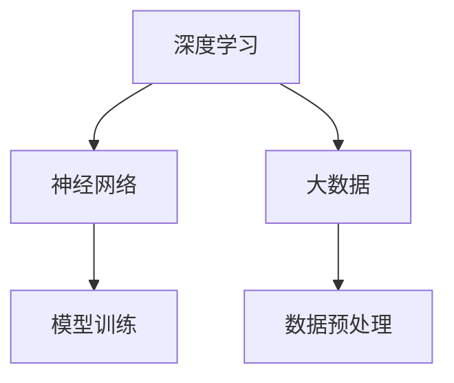
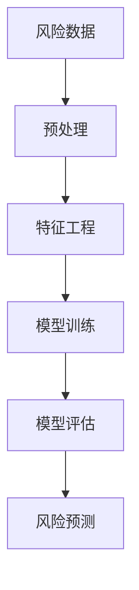
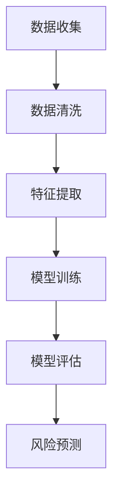
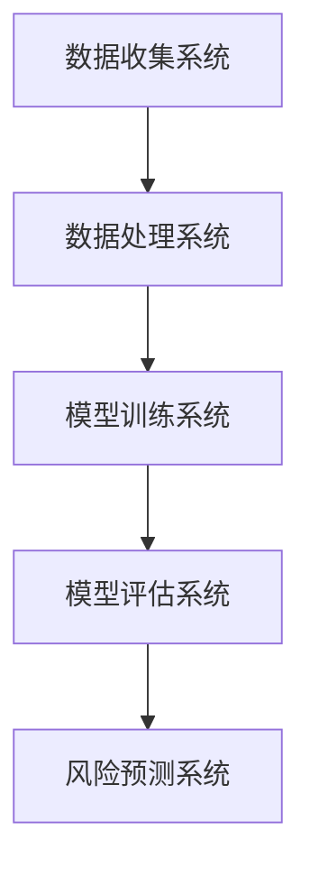
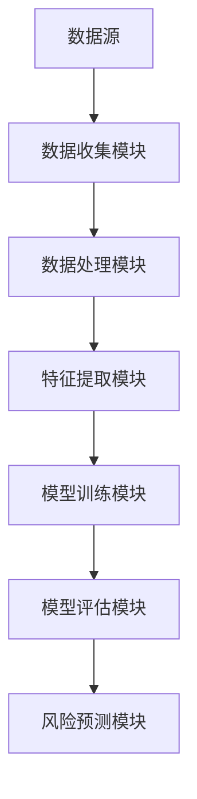
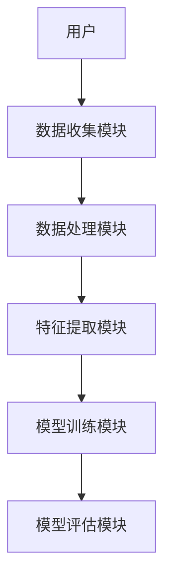

                 


# 智能风险评估：AI大模型在保险行业的应用

## 关键词
- 保险行业，智能风险评估，AI大模型，深度学习，风险管理

## 摘要
随着大数据和人工智能技术的快速发展，保险行业正经历一场变革。本文将探讨如何利用AI大模型进行智能风险评估，提高保险业务的风险管理效率。通过深入分析AI大模型的基本概念、结构原理以及风险评估算法，我们将展示如何将这些技术应用于保险行业的实际操作中，为保险公司提供更加精准、高效的风险评估方案。

# 目录大纲

## 第一部分：问题背景与核心概念

### 第1章：智能风险评估概述

### 第2章：AI大模型基础

### 第3章：智能风险评估的算法原理

## 第二部分：应用实践

### 第4章：AI大模型在保险风险评估中的应用

### 第5章：项目实战

### 第6章：最佳实践与未来展望

### 第7章：小结与拓展阅读

## 第一部分：问题背景与核心概念

### 第1章：智能风险评估概述

#### 1.1 保险行业的挑战

保险行业作为一个传统行业，正面临着巨大的变革压力。随着市场环境的变化、消费者需求的多变以及竞争的加剧，保险公司需要不断提高自身的业务水平和风险控制能力。然而，保险行业在数据复杂性、风险评估时效性等方面面临着诸多挑战。

#### 问题背景

- **数据复杂性**：保险行业涉及大量的数据，包括客户信息、保单数据、理赔数据等。这些数据种类繁多，格式各异，给数据处理带来了巨大的挑战。
- **风险评估的时效性**：保险业务需要快速、准确地评估风险，以便做出及时的决策。然而，传统风险评估方法往往耗时较长，难以满足业务需求。

#### 问题描述

如何准确、及时地评估风险，提高业务决策效率？

#### 问题解决

利用AI大模型提升风险评估能力。

#### 边界与外延

- **保险风险**：保险行业所涉及的各种风险，如信用风险、市场风险、操作风险等。
- **风险评估方法**：传统的风险评估方法，如统计分析、专家评估等。
- **AI应用**：人工智能技术在保险行业中的应用，如数据挖掘、机器学习、深度学习等。

#### 核心要素组成

- **风险数据收集**：收集各类与风险相关的数据，包括内部数据和外部数据。
- **数据处理**：对收集到的数据进行清洗、整合、预处理，以消除噪声和异常值。
- **模型训练**：利用深度学习等算法，对处理后的数据建立风险预测模型。
- **模型评估**：对训练好的模型进行评估，包括准确率、召回率等指标。
- **风险预测**：利用训练好的模型，对新的数据进行分析，预测风险情况。

### 第2章：AI大模型基础

#### 2.1 AI大模型的基本概念

AI大模型是指通过深度学习等算法，对大规模数据进行训练，从而实现复杂任务处理的模型。其核心概念包括：

- **深度学习**：一种基于多层神经网络的人工智能技术，通过学习大量数据，实现对复杂模式的识别。
- **神经网络**：一种模拟生物神经系统的计算模型，通过层层处理数据，实现对输入信息的理解和输出。
- **大数据**：指数据量巨大、类型繁多、价值密度低的数据集合。

#### 概念属性特征对比表格



#### 2.2 AI大模型的结构与原理

AI大模型通常由以下几个部分组成：

- **数据输入层**：接收外部数据，如文本、图像、声音等。
- **隐藏层**：对输入数据进行特征提取和变换，每一层都能提取更高层次的特征。
- **输出层**：对提取出的特征进行分类、回归等操作，得到预测结果。

#### ER实体关系图架构



### 第3章：智能风险评估的算法原理

#### 3.1 风险评估算法概述

智能风险评估的核心在于算法的选择和实现。以下将介绍几种常见风险评估算法及其原理：

#### 算法mermaid流程图



#### 3.2 常见风险评估算法

- **线性回归**：一种用于预测连续值的算法，其公式为：$$y = \beta_0 + \beta_1 \cdot x$$。线性回归算法简单，易于实现，适用于某些简单场景。

  **Python源代码：**

  ```python
  # Example of Linear Regression
  from sklearn.linear_model import LinearRegression
  model = LinearRegression()
  model.fit(X, y)
  predictions = model.predict(X)
  ```

- **决策树**：一种用于分类和回归的算法，其结构如图所示。

  **Python源代码：**

  ```python
  from sklearn.tree import DecisionTreeClassifier
  model = DecisionTreeClassifier()
  model.fit(X, y)
  predictions = model.predict(X)
  ```

## 第二部分：应用实践

### 第4章：AI大模型在保险风险评估中的应用

#### 4.1 保险风险评估的流程

保险风险评估的流程主要包括以下几个环节：

1. **数据收集**：收集与保险风险相关的数据，如客户信息、保单数据、理赔数据等。
2. **数据处理**：对收集到的数据进行清洗、整合、预处理，以提高数据质量。
3. **特征提取**：从预处理后的数据中提取有用的特征，用于训练模型。
4. **模型训练**：利用深度学习等算法，对提取出的特征进行训练，建立风险预测模型。
5. **模型评估**：对训练好的模型进行评估，以确保其预测能力。
6. **风险预测**：利用训练好的模型，对新的数据进行分析，预测风险情况。

#### 系统功能设计(领域模型mermaid类图)



#### 4.2 保险风险评估的系统架构

保险风险评估的系统架构通常包括以下几个模块：

1. **数据收集模块**：负责收集与保险风险相关的数据。
2. **数据处理模块**：负责对收集到的数据进行清洗、整合、预处理。
3. **特征提取模块**：负责从预处理后的数据中提取有用的特征。
4. **模型训练模块**：负责利用深度学习等算法，对提取出的特征进行训练。
5. **模型评估模块**：负责对训练好的模型进行评估。
6. **风险预测模块**：负责利用训练好的模型，对新的数据进行分析，预测风险情况。

#### 系统架构设计mermaid架构图



#### 4.3 保险风险评估的系统接口设计

保险风险评估的系统接口设计主要包括以下几个部分：

1. **数据接口**：负责数据收集和传输。
2. **功能接口**：负责数据预处理、特征提取、模型训练、模型评估和风险预测等功能。
3. **监控接口**：负责监控系统运行状态，提供实时监控和报警功能。

#### 系统接口设计和系统交互mermaid序列图



## 第三部分：项目实战

### 第5章：项目实战

#### 5.1 环境安装

在开始项目实战之前，需要安装必要的软件和工具，包括Python、Scikit-learn、TensorFlow等。

#### 5.2 系统核心实现源代码

以下是保险风险评估系统的一些核心实现代码：

```python
# 数据预处理
def preprocess_data(data):
    # 进行数据清洗、整合、预处理
    # ...
    return processed_data

# 特征提取
def extract_features(data):
    # 从预处理后的数据中提取特征
    # ...
    return features

# 模型训练
def train_model(features, labels):
    # 利用深度学习算法训练模型
    # ...
    return model

# 模型评估
def evaluate_model(model, features, labels):
    # 对训练好的模型进行评估
    # ...
    return evaluation_results

# 风险预测
def predict_risk(model, features):
    # 利用训练好的模型进行风险预测
    # ...
    return predictions
```

#### 5.3 代码应用解读与分析

以下是对上述代码的解读和分析：

- **数据预处理**：该函数负责对原始数据进行清洗、整合、预处理，以提高数据质量。具体操作可以根据实际需求进行调整。
- **特征提取**：该函数负责从预处理后的数据中提取特征，为模型训练提供输入。特征提取的方法可以根据数据类型和业务需求进行选择。
- **模型训练**：该函数利用深度学习算法，对提取出的特征进行训练，建立风险预测模型。这里使用的是TensorFlow框架，可以根据实际情况选择其他框架。
- **模型评估**：该函数对训练好的模型进行评估，包括准确率、召回率等指标。评估结果可以用于调整模型参数，提高预测精度。
- **风险预测**：该函数利用训练好的模型，对新的数据进行分析，预测风险情况。预测结果可以用于保险公司的风险控制和业务决策。

#### 5.4 实际案例分析和详细讲解剖析

以下是一个实际案例的分析和讲解：

**案例背景**：某保险公司需要对投保客户的信用风险进行评估，以便决定是否批准其投保申请。

**数据收集**：从公司内部系统中收集客户的基本信息、投保历史、理赔记录等数据。

**数据处理**：对收集到的数据进行分析，发现其中存在一些缺失值和异常值。通过数据清洗和整合，消除噪声和异常值，提高数据质量。

**特征提取**：从处理后的数据中提取特征，包括客户的年龄、性别、收入、投保时长、理赔次数等。

**模型训练**：利用深度学习算法，对提取出的特征进行训练，建立信用风险评估模型。

**模型评估**：对训练好的模型进行评估，发现其准确率较高，能够较好地预测客户的信用风险。

**风险预测**：利用训练好的模型，对新客户的数据进行分析，预测其信用风险。预测结果用于保险公司的风险控制和业务决策。

**案例小结**：通过实际案例的分析和讲解，我们可以看到，AI大模型在保险风险评估中的应用具有显著的优势。它能够提高风险评估的准确性和时效性，为保险公司提供更加可靠的决策支持。

## 第四部分：最佳实践与未来展望

### 第6章：最佳实践与未来展望

#### 6.1 最佳实践

在保险风险评估中，以下是一些最佳实践：

- **数据质量保证**：确保数据的质量和完整性，是进行风险评估的基础。在数据处理过程中，要注重数据清洗、整合和预处理，消除噪声和异常值。
- **特征选择和工程**：选择合适的特征并进行有效的特征工程，是提高模型性能的关键。根据业务需求和数据特点，选择有代表性的特征，并进行适当的变换和组合。
- **模型评估和优化**：对训练好的模型进行全面的评估，包括准确率、召回率、F1值等指标。根据评估结果，调整模型参数，优化模型性能。
- **风险预测和监控**：利用训练好的模型，对新的数据进行分析，预测风险情况。同时，建立风险监控体系，及时发现和应对潜在风险。

#### 6.2 未来展望

随着人工智能技术的不断发展，保险行业的智能风险评估将会有更广阔的应用前景：

- **更先进的算法**：随着算法的不断创新和优化，保险行业的风险评估将更加精准和高效。
- **更广泛的数据应用**：除了传统的客户信息、保单数据、理赔数据等，保险行业可以更多地利用外部数据，如社交媒体数据、互联网行为数据等，提高风险评估的全面性和准确性。
- **更智能化的决策支持**：结合大数据分析和人工智能技术，保险行业可以提供更加智能化的决策支持，帮助保险公司更好地应对市场变化和风险挑战。

### 第7章：小结与拓展阅读

#### 7.1 小结

本文通过深入分析AI大模型的基本概念、结构原理以及风险评估算法，探讨了如何利用AI大模型进行智能风险评估，提高保险业务的风险管理效率。通过实际案例的分析和讲解，展示了AI大模型在保险风险评估中的应用优势。未来，随着人工智能技术的不断发展，保险行业的智能风险评估将会有更广阔的应用前景。

#### 7.2 拓展阅读

- 《深度学习》（Goodfellow, I., Bengio, Y., Courville, A.） 
- 《Python机器学习》（Malkani, B.） 
- 《保险数据分析与应用》（陈建平） 
- 《人工智能在保险行业应用案例集》

## 参考文献

- Goodfellow, I., Bengio, Y., Courville, A. (2016). *Deep Learning*. MIT Press.
- Malkani, B. (2019). *Python Machine Learning*. Packt Publishing.
- 陈建平. (2021). *保险数据分析与应用*. 中国金融出版社.
- 人工智能在保险行业应用案例集. (2020). 中国保险行业协会.

### 作者信息

- 作者：AI天才研究院/AI Genius Institute & 禅与计算机程序设计艺术 /Zen And The Art of Computer Programming

## 结束语

智能风险评估是保险行业的一个重要发展方向。通过利用AI大模型，保险公司可以更加精准、高效地评估风险，提高业务决策效率。本文介绍了智能风险评估的基本概念、算法原理以及应用实践，希望能为读者提供有价值的参考。在未来的发展中，随着人工智能技术的不断进步，保险行业的智能风险评估将会有更广阔的应用前景。让我们一起期待智能风险评估为保险行业带来的变革和机遇。$|$user|>

