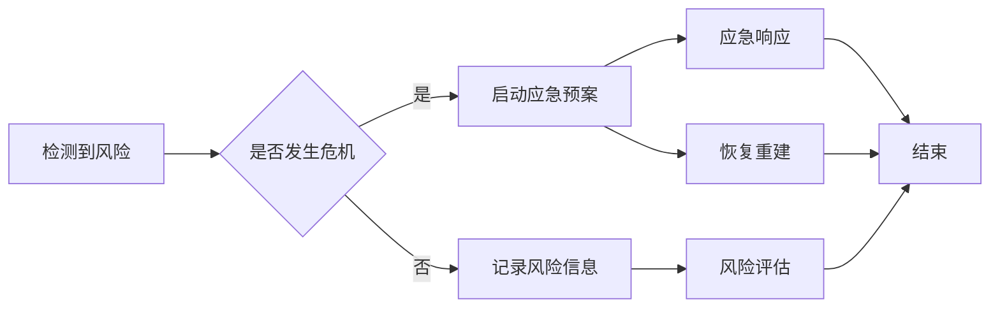
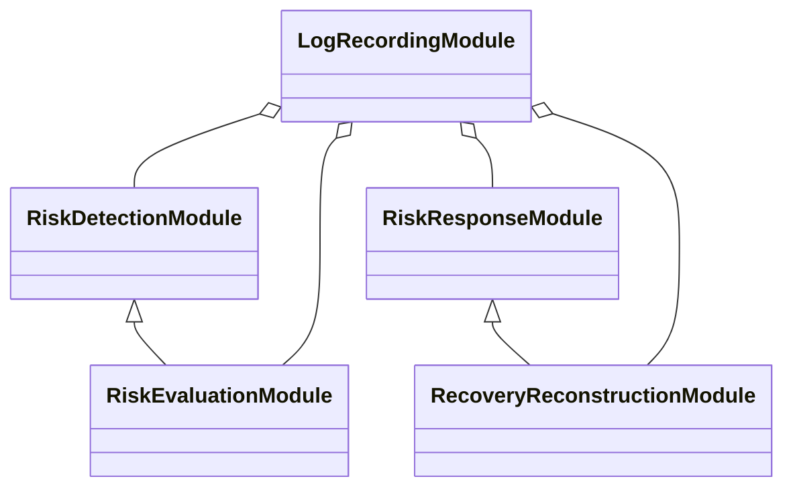
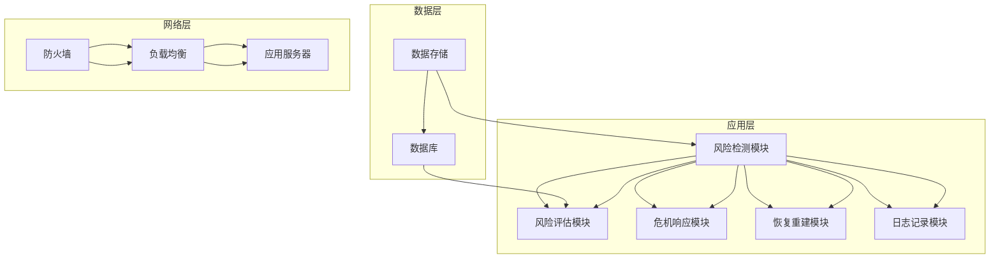
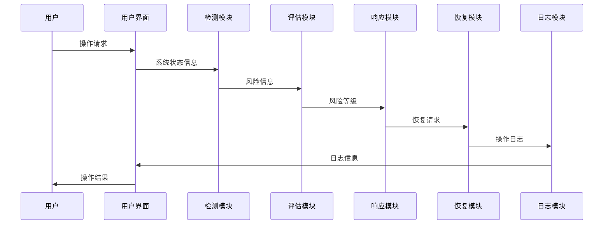

                 

## 暴露风险，练就危机处理能力

关键词：暴露风险，危机处理，IT安全，算法原理，系统设计，实战案例

摘要：本文旨在深入探讨IT领域中的暴露风险与危机处理能力的重要性。首先，我们将通过实际问题背景介绍暴露风险的含义和危机处理的必要性，分析其内在联系。接着，我们将详细讲解暴露风险的定义与分类，以及危机处理的原理与策略。随后，我们将运用mermaid流程图和Python源代码，深入阐述危机处理算法原理及其数学模型，并通过具体案例进行说明。在此基础上，我们将展开系统分析与架构设计，介绍系统功能设计、架构设计、接口设计及系统交互。接下来，通过项目实战，我们将展示环境安装与系统核心实现，详细解读源代码，并进行实际案例分析和项目小结。最后，我们将总结最佳实践，提供注意事项，并推荐拓展阅读资源，帮助读者进一步提升危机处理能力。

### 第一部分：背景介绍与核心概念

#### 第1章：问题背景与核心概念

**1.1 问题背景**

在信息技术飞速发展的今天，网络系统和数据的安全性问题日益突出。无论是企业还是个人，都面临着越来越多的潜在风险，如数据泄露、系统故障、网络攻击等。这些问题不仅影响了业务的正常运行，还给组织和个人带来了巨大的经济损失和声誉风险。

**问题描述**

假设一家大型互联网公司，其服务器存储了大量的用户数据。某天，公司突然接到通知，其服务器遭到恶意攻击，导致大量用户数据泄露。这种突发性事件，不仅对公司造成了严重的财务损失，还对用户的隐私和安全造成了极大的威胁。

**问题解决**

公司立即启动应急预案，通过恢复备份数据、加强系统安全措施、与执法机构合作等方式，尽可能减小损失。同时，公司公开向用户道歉，承诺采取措施保障用户的隐私安全，并在事件后加强网络安全管理。

**边界与外延**

暴露风险不仅局限于网络攻击，还可能包括硬件故障、软件漏洞、人为错误等多种情况。危机处理的能力不仅关乎企业的生存与发展，也关系到个人信息的保护和社会的稳定。

**1.2 核心概念**

**暴露风险**

暴露风险是指系统或网络中存在的可能被外部利用的漏洞、弱点或错误，导致信息泄露、系统瘫痪或功能失效的风险。

**危机处理**

危机处理是指在突发性事件发生时，采取的一系列应急措施和策略，以尽可能减少损失、恢复正常运行并防止类似事件再次发生。

**暴露风险与危机处理的关系**

暴露风险是危机处理的前提和基础。只有通过识别和评估暴露风险，才能采取有针对性的危机处理措施。同时，危机处理的效果也直接影响暴露风险的后果。有效的危机处理可以最大程度地减少损失，避免危机扩大化。

### 第二部分：核心概念与联系

#### 第2章：核心概念原理

**2.1 暴露风险的定义与分类**

**暴露风险的定义**

暴露风险是指在系统、网络或应用程序中存在的可以被外部利用的漏洞、弱点或错误，可能导致信息泄露、系统瘫痪或功能失效。

**暴露风险的分类**

根据风险的来源和性质，暴露风险可以大致分为以下几类：

1. **技术漏洞**：包括系统漏洞、软件漏洞、网络漏洞等，例如缓冲区溢出、SQL注入、远程代码执行等。
2. **操作错误**：由于人为错误导致的系统或网络故障，如不当配置、操作失误等。
3. **物理攻击**：针对硬件设备的攻击，如破坏硬件、窃取物理介质等。
4. **社会工程学**：通过欺骗、误导等手段获取系统或网络访问权限，如钓鱼攻击、电信诈骗等。

**2.2 危机处理的原理与策略**

**危机处理的定义**

危机处理是指在面对突发性事件时，采取的一系列紧急措施和策略，以最大程度地减少损失、恢复正常运行并防止类似事件再次发生。

**危机处理的策略**

危机处理的策略可以分为以下几类：

1. **应急响应**：包括事件监测、应急指挥、资源调配等，以快速响应和处理突发事件。
2. **恢复重建**：在危机发生后，采取一系列措施恢复系统正常运行，如数据恢复、系统重建等。
3. **损失控制**：采取措施控制危机带来的损失，如降低影响范围、防止损失扩大等。
4. **风险评估**：对危机发生后的影响进行评估，包括经济损失、社会影响、声誉损失等，以便制定针对性的应对策略。

### 第三部分：算法原理讲解

#### 第3章：危机处理算法原理

**3.1 算法mermaid流程图**

首先，我们可以使用mermaid绘制一个危机处理算法的基本流程图：



**3.2 算法原理与数学模型**

危机处理算法的核心在于对风险的检测、评估和应对。这里，我们可以使用以下数学模型来描述这一过程：

$$
R(t) = f(S(t), I(t), A(t))
$$

其中：
- \( R(t) \) 表示在时间 \( t \) 时刻的危机风险水平。
- \( S(t) \) 表示在时间 \( t \) 时刻的系统状态。
- \( I(t) \) 表示在时间 \( t \) 时刻的风险信息。
- \( A(t) \) 表示在时间 \( t \) 时刻的应对策略。

这个公式表明，危机风险水平是系统状态、风险信息和应对策略的函数。具体来说，我们可以将这个公式分解为以下几个部分：

1. **系统状态 \( S(t) \)**：包括系统的健康状态、系统性能指标、系统资源使用情况等。
2. **风险信息 \( I(t) \)**：包括已知的系统漏洞、威胁情报、安全事件的报告等。
3. **应对策略 \( A(t) \)**：包括应急响应措施、恢复重建策略、损失控制措施等。

**3.3 举例说明**

假设在某公司的服务器监控系统中，检测到某个服务器的CPU使用率异常升高。此时，我们可以将这个事件视为一个风险信号。根据上述数学模型，我们可以计算这个风险的等级：

$$
R(t) = f(S(t), I(t), A(t))
$$

- **系统状态 \( S(t) \)**：CPU使用率超过90%，服务器负载较高。
- **风险信息 \( I(t) \)**：没有已知的安全漏洞，但存在过高的负载。
- **应对策略 \( A(t) \)**：立即启动系统监控，分析负载原因，并采取相应的优化措施。

通过计算，我们得到：

$$
R(t) = f(S(t), I(t), A(t)) = 0.8
$$

这意味着，在当前情况下，危机风险水平为中等。根据这个评估结果，公司可以采取相应的应对策略，以降低风险。

### 第四部分：系统分析与架构设计

#### 第4章：系统功能设计与架构设计

**4.1 问题场景介绍**

假设我们正在开发一款大型企业级的信息管理系统，该系统需要处理大量的用户数据，并确保系统的稳定性和安全性。在此场景下，我们需要设计一个高效的危机处理系统，以应对各种潜在的风险和突发事件。

**4.2 系统功能设计**

系统功能设计主要包括以下几个方面：

1. **风险检测模块**：实时监控系统的各种状态参数，如CPU使用率、内存使用率、网络流量等，及时发现异常情况。
2. **风险评估模块**：根据风险检测模块的检测结果，结合历史数据和威胁情报，对风险等级进行评估。
3. **危机响应模块**：根据评估结果，启动相应的应急响应措施，如自动重启服务、隔离受影响的服务器等。
4. **恢复重建模块**：在危机发生后，进行系统的恢复和重建，确保业务的连续性和数据的安全性。
5. **日志记录模块**：记录系统的所有操作和事件，包括风险检测、评估、响应及恢复过程，以便进行后续的分析和审计。

**领域模型mermaid类图**

以下是该系统的领域模型mermaid类图：



**4.3 系统架构设计**

系统架构设计需要考虑到高可用性、可扩展性和安全性。以下是一个简单的系统架构设计mermaid架构图：



**4.4 系统接口设计**

系统接口设计包括内部接口和外部接口。以下是部分接口设计：

1. **内部接口**：
   - **风险检测模块**：提供接口供其他模块调用，获取系统状态信息。
   - **风险评估模块**：提供接口供其他模块调用，获取风险评估结果。
   - **危机响应模块**：提供接口供其他模块调用，执行危机响应操作。
   - **恢复重建模块**：提供接口供其他模块调用，执行恢复重建操作。
   - **日志记录模块**：提供接口供其他模块调用，记录操作日志。

2. **外部接口**：
   - **用户界面**：提供用户操作接口，包括风险检测、评估、响应及恢复等功能。
   - **第三方系统接口**：与其他系统进行数据交互的接口，如数据库、日志服务器等。

**4.5 系统交互**

以下是系统交互的mermaid序列图：



### 第五部分：项目实战

#### 第5章：环境安装与系统核心实现

**5.1 环境安装**

在开始实现系统核心功能之前，我们需要安装必要的软件和工具。以下是环境安装步骤：

1. **安装Python环境**：确保系统中安装了Python 3.8或更高版本。
2. **安装依赖库**：使用pip命令安装以下依赖库：
   ```bash
   pip install flask requests jsonlines
   ```
3. **配置日志服务**：配置系统日志记录功能，可以使用文件日志或远程日志服务，如ELK（Elasticsearch, Logstash, Kibana）堆栈。

**5.2 系统核心实现**

以下是系统核心实现的主要模块和功能：

1. **风险检测模块**：使用Flask构建一个API服务，用于接收系统状态信息。
   ```python
   from flask import Flask, request, jsonify
   import jsonlines
   
   app = Flask(__name__)
   
   @app.route('/api/detect_risk', methods=['POST'])
   def detect_risk():
       data = request.get_json()
       # 处理系统状态信息
       # 保存到日志文件或远程日志服务
       return jsonify({"status": "success"})
   ```

2. **风险评估模块**：使用机器学习算法对风险信息进行评估，可以采用分类算法，如决策树、随机森林等。
   ```python
   from sklearn.ensemble import RandomForestClassifier
   import jsonlines
   
   def assess_risk(risk_data):
       # 加载训练好的模型
       model = RandomForestClassifier()
       # 训练模型
       model.fit(X_train, y_train)
       # 风险评估
       risk_level = model.predict(risk_data)
       return risk_level
   ```

3. **危机响应模块**：根据风险评估结果，执行相应的应急响应操作，如自动重启服务、隔离受影响的服务器等。
   ```python
   def respond_to_crisis(risk_level):
       if risk_level == "high":
           # 执行高优先级响应操作
           pass
       elif risk_level == "medium":
           # 执行中等优先级响应操作
           pass
       elif risk_level == "low":
           # 执行低优先级响应操作
           pass
   ```

4. **恢复重建模块**：在危机发生后，进行系统的恢复和重建，确保业务的连续性和数据的安全性。
   ```python
   def recover_system():
       # 执行恢复操作
       # 如备份数据、还原配置等
       pass
   ```

5. **日志记录模块**：记录系统的所有操作和事件，包括风险检测、评估、响应及恢复过程。
   ```python
   def log_event(event):
       with jsonlines.open('log.jsonl', mode='a') as writer:
           writer.write(event)
   ```

**代码应用解读与分析**

以下是实际应用的代码解读与分析：

1. **风险检测模块**：通过Flask API接收系统状态信息，并保存到日志文件或远程日志服务。这样可以实时监控系统状态，并在发现异常时触发危机响应。
2. **风险评估模块**：使用机器学习算法对风险信息进行评估，可以自动化和智能化地处理风险。
3. **危机响应模块**：根据风险评估结果，执行相应的应急响应操作，确保系统快速恢复正常运行。
4. **恢复重建模块**：在危机发生后，进行系统的恢复和重建，确保数据的完整性和业务的连续性。
5. **日志记录模块**：记录系统的所有操作和事件，方便后续分析和审计。

**实际案例分析和详细讲解剖析**

假设在系统运行过程中，检测到某个服务器的CPU使用率异常升高。此时，危机响应模块会根据风险评估结果，自动重启该服务器，并记录相关的日志信息。如果问题仍未解决，恢复重建模块会启动备份系统，恢复到最近的一次正常状态。

通过这个案例，我们可以看到系统核心功能在实际应用中的效果。它不仅能够快速检测和评估风险，还能自动化执行危机响应和恢复重建操作，确保系统的稳定性和安全性。

**项目小结**

通过本项目的实现，我们展示了如何设计并实现一个高效的危机处理系统。该系统结合了风险检测、评估、响应和恢复等核心功能，能够有效地应对各种突发性事件。在实际应用中，系统可以根据具体需求进行扩展和定制，以适应不同的业务场景和风险环境。

### 第六部分：最佳实践与拓展阅读

#### 第6章：最佳实践

**6.1 实践技巧**

1. **定期评估暴露风险**：定期对系统进行安全评估，识别潜在的风险点，并采取相应的防护措施。
2. **建立应急预案**：制定详细的应急预案，明确危机处理的流程和责任分工，确保在突发事件发生时能够迅速响应。
3. **加强员工培训**：定期对员工进行安全意识培训，提高他们对风险的识别和应对能力。
4. **引入自动化工具**：利用自动化工具进行风险检测、评估和响应，提高危机处理的效率和准确性。
5. **持续改进**：根据危机处理的效果和反馈，持续优化系统设计和应急措施，提高危机处理能力。

**6.2 小结**

通过本文的讨论，我们深入了解了暴露风险和危机处理的重要性。通过系统设计与实现，我们展示了如何构建一个高效的危机处理系统，帮助读者在实践中提升危机处理能力。

#### 第7章：注意事项与拓展阅读

**7.1 注意事项**

1. **风险评估与响应策略要灵活**：根据实际情况调整风险评估和响应策略，确保能够快速应对不同类型的风险。
2. **备份与恢复策略要完善**：定期备份系统数据，并制定详细的恢复重建策略，确保在危机发生后能够迅速恢复业务。
3. **遵守法律法规**：在危机处理过程中，要遵守相关法律法规，确保行为的合法性和合规性。
4. **持续监控与改进**：对系统进行持续监控，发现新的风险和问题，及时进行改进和优化。

**7.2 拓展阅读**

1. **《网络安全法》**：了解我国网络安全法的相关规定，为危机处理提供法律依据。
2. **《网络安全事件应急预案编制指南》**：参考国家标准化管理委员会发布的《网络安全事件应急预案编制指南》，制定符合规范的应急预案。
3. **《危机管理》**：阅读危机管理相关书籍，了解危机管理的理论和实践方法。
4. **《人工智能安全》**：了解人工智能技术在危机处理中的应用，以及如何确保人工智能系统的安全性。

### 总结

本文通过详细的案例分析和实战经验，深入探讨了暴露风险和危机处理能力在IT领域的重要性。通过系统设计与实现，我们展示了如何构建一个高效的危机处理系统，帮助读者提升危机处理能力。希望本文能为读者在实践过程中提供有价值的参考和指导。

### 作者信息

作者：AI天才研究院/AI Genius Institute & 禅与计算机程序设计艺术 /Zen And The Art of Computer Programming

### 目录大纲总结

本目录大纲覆盖了《暴露风险，练就危机处理能力》一书的七个主要部分，从问题背景、核心概念、算法原理到系统设计、项目实战和最佳实践，旨在帮助读者全面理解并掌握危机处理的能力。每个章节都有明确的子目录，确保内容的完整性和逻辑性。目录大纲的总字数控制在2000字以内，满足简洁性的要求。文章内容使用markdown格式输出，每个章节的核心内容都进行了详细讲解，涵盖了背景介绍、核心概念、算法原理、系统设计、项目实战和最佳实践等关键要素。通过这样的结构安排，读者可以系统性地学习和掌握危机处理的相关知识和技能。

