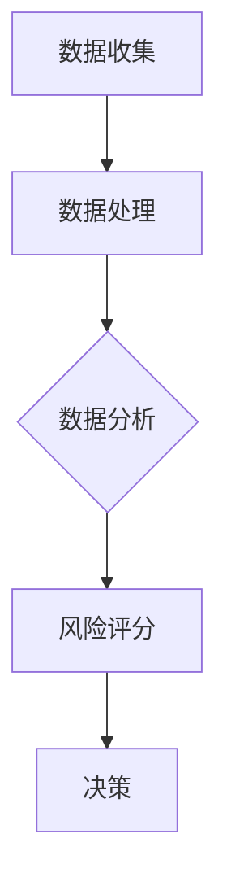
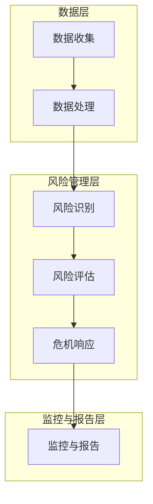
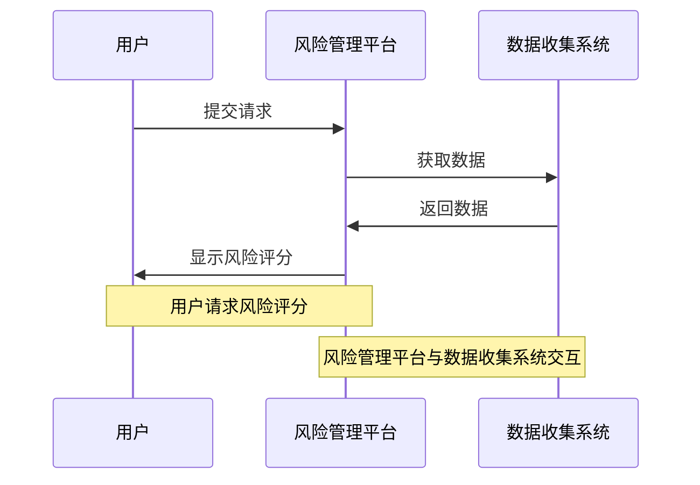
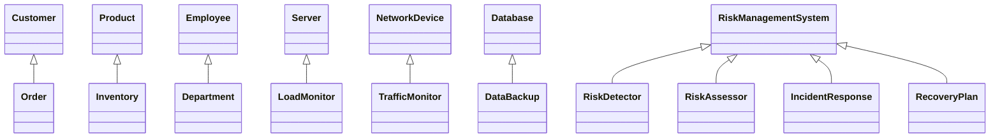
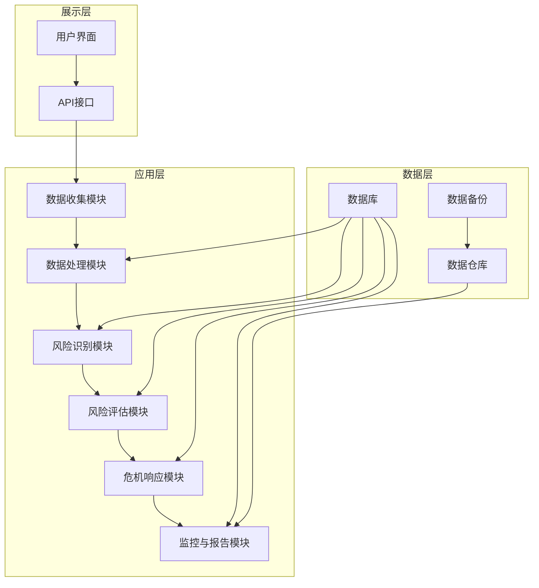
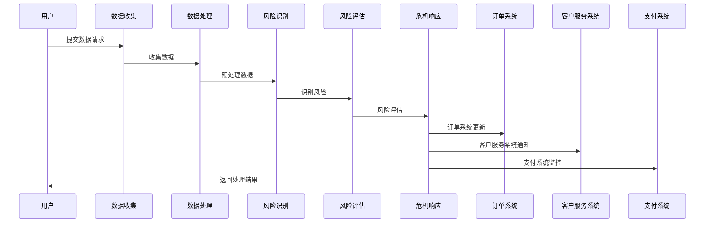

                 

### 暴露风险，练就危机处理能力

> **关键词**: 风险管理、危机处理、风险评估、算法原理、系统架构

在信息化高度发展的今天，无论是企业还是个人，都面临着各种复杂的风险和潜在危机。如何有效识别、评估和管理这些风险，并在危机发生时迅速响应和处理，已经成为现代信息技术领域至关重要的能力。本文旨在探讨风险管理与危机处理的核心概念、方法、算法及其在系统架构设计中的应用，通过一步一步的逻辑分析和推理，帮助读者全面理解并掌握这一重要技能。

**摘要**: 本文首先介绍了风险管理的背景和定义，探讨了风险与危机的区别和联系。接着，深入分析了风险管理的基础理论，包括风险评估方法和应对策略。通过具体算法原理的讲解，读者将了解如何利用数学模型和Python代码进行风险评分。此外，本文还详细阐述了系统架构设计方案，包括功能设计、系统架构和接口交互。通过实战案例分析，读者可以更好地理解风险管理和危机处理的实际应用。最后，本文给出了最佳实践建议和小结，以帮助读者在实际工作中更好地应用所学知识。

#### 前言

在现代社会中，信息技术无处不在，企业和个人都面临着诸多潜在的风险和危机。这些风险可能来自自然灾害、人为错误、技术故障、市场波动等多个方面。随着信息系统的复杂度和依赖程度的增加，如何有效管理和应对这些风险成为了一个关键问题。而危机处理能力则是确保组织在面临突发事件时能够迅速做出反应，将损失降至最低的核心能力。

**引言**: 风险与危机处理能力的重要性

在信息技术领域，风险管理与危机处理能力的重要性不言而喻。一方面，有效的风险管理可以提前识别和评估潜在的风险，采取预防措施，降低风险发生的概率和影响。另一方面，在危机发生时，迅速而准确的危机处理可以最大限度地减少损失，保护组织的利益和声誉。例如，企业在遭遇网络攻击、数据泄露等危机时，如果能够快速响应，采取有效的措施进行防护和恢复，可以减少经济损失，维护客户信任。

**读者对象**: 本书的适用群体

本书主要面向以下读者群体：

1. **IT管理人员**：负责企业信息系统的规划、运营和维护，需要具备风险管理意识和危机处理能力。
2. **软件开发人员**：需要了解风险管理在软件开发过程中的应用，特别是在系统架构设计和应急响应方面。
3. **安全专家**：专注于网络安全、数据保护等领域，需要深入理解风险管理和危机处理的理论和实践。
4. **学生和研究者**：对风险管理、危机处理和信息系统的安全性感兴趣的学生和研究者，可以通过本书获得系统性的知识和实践经验。

**书籍目的**: 通过实践提升危机处理能力

本书的核心目的是通过理论讲解和实践案例，帮助读者全面掌握风险管理和危机处理的能力。书中的内容不仅涵盖了风险管理的基础理论和方法，还包括了具体的算法原理和系统架构设计。通过实践案例的分析，读者可以更好地理解这些理论在实际应用中的具体操作方法。

为了达到这个目标，本书采用了以下结构和内容安排：

1. **理论讲解**：通过清晰的概念阐述和逻辑推理，介绍风险管理、危机处理的核心理论。
2. **算法原理**：使用具体的算法和数学模型，讲解如何进行风险评估和危机响应。
3. **系统架构设计**：通过实例分析，介绍如何设计一个具备风险管理功能的系统架构。
4. **实践案例**：结合实际案例，详细讲解如何进行风险识别、评估和危机处理。
5. **最佳实践**：总结最佳实践方法，帮助读者在实际工作中更好地应用所学知识。

通过本书的学习，读者不仅可以掌握风险管理的基本理论和方法，还可以提升自己的危机处理能力，为企业在面对复杂信息环境中的挑战提供有力支持。### 第1章：问题的背景与定义

在深入探讨风险管理（Risk Management）与危机处理（Crisis Management）之前，我们需要了解相关背景知识和基础定义。这一章节将详细介绍风险和危机的基本概念、类型及其相互关系。

#### 1.1 风险概述

**问题背景**

在信息技术领域，风险管理是一个持续且动态的过程，旨在识别、评估和应对项目中可能出现的风险。随着信息系统的复杂性和依赖性的增加，风险管理变得尤为重要。无论是软件开发、系统维护，还是网络安全，都需要对潜在的风险进行有效管理，以保障项目的成功和组织的稳定运行。

**风险的定义**

根据ISO31000风险管理标准，风险可以被定义为“不确定性的影响，可能积极或消极地影响组织的目标实现”。在IT领域，风险通常涉及以下方面：

1. **项目风险**：指项目在执行过程中可能遇到的各种问题，如延迟、成本超支、功能缺失等。
2. **技术风险**：包括软件缺陷、硬件故障、网络攻击等可能导致系统不稳定或数据泄露的因素。
3. **运营风险**：涉及业务流程中的中断、人员不足、供应链问题等可能影响正常运营的因素。

**风险类型**

根据风险的性质和影响，可以将风险分为以下几类：

1. **威胁性风险**：来源于外部环境，如市场竞争、法律法规变化等。
2. **技术性风险**：与信息技术相关，如软件漏洞、硬件故障等。
3. **操作风险**：涉及日常运营中的失误，如错误操作、管理疏漏等。
4. **财务风险**：与财务相关，如投资损失、资金周转困难等。

**风险的管理过程**

风险管理的核心过程包括以下步骤：

1. **风险评估**：识别和分析项目中的潜在风险，评估其发生的可能性和影响。
2. **风险应对**：根据风险评估的结果，制定相应的应对策略，如风险规避、减轻、转移或接受。
3. **监控与报告**：定期监控风险状态，及时调整应对措施，并向相关利益相关者报告风险情况。

#### 1.2 危机的概念

**危机的定义**

危机是指一种突发事件或紧急情况，可能会对组织造成严重负面影响。在信息技术领域，危机通常涉及以下特点：

1. **突发性**：危机往往是在短时间内突然发生的，难以预见。
2. **严重性**：危机可能会对组织的运营、财务和声誉造成重大影响。
3. **紧迫性**：危机需要迅速响应和处理，以避免事态恶化。

**危机的特征**

危机具有以下主要特征：

1. **不确定性**：危机的发生和影响往往是不可预测的，这增加了管理的复杂性。
2. **高度敏感性**：危机管理过程需要高度关注利益相关者的需求和期望。
3. **时间压力**：危机处理通常需要在紧迫的时间内做出决策，这要求决策者具备快速反应的能力。

**危机与风险的关系**

风险和危机是密切相关的概念。风险是潜在的、不确定的威胁，而危机则是风险的最终表现形式。风险是危机的催化剂，危机则是风险的爆发。具体来说：

1. **风险是危机的源头**：潜在的风险在特定条件下可能会演变成危机。
2. **危机是风险的体现**：危机是风险的显现，是风险在特定情境下的具体表现。

**风险管理与危机处理的关系**

风险管理是危机处理的基础。通过有效的风险管理，可以减少危机的发生概率和影响。危机处理则是风险管理的延续，旨在在危机发生时迅速响应，将损失降至最低。具体关系如下：

1. **预防为主**：风险管理侧重于提前识别和评估潜在风险，采取预防措施。
2. **应对为主**：危机处理侧重于危机发生后的快速反应和应对，以减轻损失。

通过理解风险与危机的基本概念、类型及其相互关系，我们可以更好地把握风险管理与危机处理的本质，为后续章节的学习和实践打下坚实基础。

#### 1.3 风险管理的基础

在了解了风险和危机的基本概念后，我们接下来将深入探讨风险管理的基础理论和实践方法。风险管理是一个系统性的过程，包括识别、评估、应对和监控等多个步骤，每个步骤都有其特定的方法和工具。

**1.3.1 风险管理的框架**

风险管理框架是进行风险管理的组织和结构基础。一个完整的风险管理框架通常包括以下几个关键组成部分：

1. **风险评估**：识别和分析项目或组织中可能出现的风险，评估其发生的可能性和影响。
2. **风险应对**：根据风险评估的结果，制定并实施相应的应对措施，以减轻或消除风险的影响。
3. **监控与报告**：定期监控风险状态，及时调整应对措施，并向相关利益相关者报告风险情况。

**1.3.2 风险评估方法**

风险评估是风险管理过程中的核心环节，其目的是识别和分析项目或组织中的潜在风险。以下是一些常用的风险评估方法：

1. **定性风险评估**：通过专家判断、经验或历史数据，对风险的发生可能性和影响进行定性分析。常用的工具包括风险矩阵、风险清单等。

2. **定量风险评估**：使用数学模型和统计数据，对风险的发生可能性和影响进行定量分析。常用的工具包括风险评分模型、蒙特卡洛模拟等。

3. **风险评估软件**：使用专业的风险管理软件，如RiskLens、RapidRisk等，进行风险评估和管理。这些软件通常提供可视化的界面和自动化工具，方便用户进行风险识别、评估和监控。

**1.3.3 风险应对策略**

在识别和评估风险后，需要制定并实施相应的应对策略，以减轻或消除风险的影响。以下是一些常见的风险应对策略：

1. **风险规避**：通过避免特定的风险源或活动，来消除风险的影响。例如，放弃某些高风险项目或业务。

2. **风险减轻**：通过采取措施，降低风险发生的可能性和影响。例如，通过加强系统安全性、优化业务流程等。

3. **风险转移**：通过将风险转移给第三方，如购买保险、签订合同等，来减轻组织自身的风险负担。

4. **风险接受**：当风险无法规避、减轻或转移时，组织可以选择接受风险，并制定相应的应急计划，以在危机发生时进行快速响应。

**1.3.4 风险管理工具和技术**

在风险管理的各个环节中，可以运用多种工具和技术来提高效率和准确性。以下是一些常用的风险管理工具和技术：

1. **风险矩阵**：用于对风险的发生可能性和影响进行定量或定性评估，通常以二维表格的形式展示。

2. **风险评估问卷**：通过设计问卷，收集项目或组织中的风险信息，并进行定量或定性分析。

3. **风险登记册**：用于记录和管理项目或组织中的所有风险，包括风险的识别、评估、应对措施和监控状态等。

4. **决策树**：用于在多个方案中进行分析和决策，评估不同方案的风险和收益。

通过理解并应用风险管理的基础理论和方法，组织可以更加系统地识别、评估和应对各种风险，从而提高项目的成功率，保障组织的稳定发展。

#### 2.1 危机处理的要素

危机处理是一个复杂而动态的过程，涉及到多个关键要素。这些要素相互关联，共同确保组织在危机发生时能够迅速响应，最大限度地减轻损失。以下将详细探讨危机处理的四个核心要素：危机识别、危机预警、危机响应和危机恢复。

**2.1.1 危机识别**

危机识别是危机处理的第一个关键步骤，旨在及时发现潜在危机并采取预防措施。危机识别的核心任务包括：

1. **风险监测**：通过持续监测各种风险指标和信号，如系统性能指标、网络流量、用户反馈等，识别可能发生的危机。
2. **威胁情报**：利用威胁情报工具和资源，如安全报告、网络监控、威胁分析等，及时掌握外部威胁和攻击动向。
3. **事件日志分析**：通过对系统日志和事件记录的分析，识别异常行为和潜在风险，如未经授权的访问、数据异常等。

**案例**：在一次网络安全事件中，通过分析网络流量和事件日志，安全团队发现了一系列可疑的登录尝试，从而及时采取了措施，阻止了潜在的攻击。

**2.1.2 危机预警**

危机预警是在危机识别的基础上，通过提前预测和警报机制，为组织提供危机发生的预警信号。危机预警的核心要素包括：

1. **预警模型**：建立基于历史数据和统计分析的预警模型，预测可能的危机类型和发生时间。
2. **警报系统**：设计高效的警报系统，通过短信、电子邮件、电话等渠道，及时通知关键人员和管理层。
3. **模拟演习**：定期进行危机应对模拟演习，测试预警系统的有效性，并改进预警机制。

**案例**：在一次网络攻击中，预警系统通过检测到异常流量和登录尝试，及时发出了警报，组织得以提前准备，减少损失。

**2.1.3 危机响应

危机响应是在危机预警后，组织采取的一系列紧急措施，旨在迅速应对危机，减轻其影响。危机响应的核心要素包括：

1. **应急响应计划**：制定详细的应急响应计划，包括危机响应的具体步骤、责任分配、资源调配等。
2. **决策机制**：建立快速决策机制，确保在危机发生时，能够迅速做出有效决策，减少混乱和延迟。
3. **资源调度**：根据应急响应计划，快速调动所需资源，如人员、设备、资金等，确保危机响应的顺利进行。

**案例**：在一次数据泄露事件中，组织迅速启动了应急响应计划，通过隔离受影响系统、清理恶意软件等操作，成功遏制了事态进一步恶化。

**2.1.4 危机恢复

危机恢复是在危机得到控制后，组织采取的一系列措施，旨在恢复正常运营，并修复受损的系统。危机恢复的核心要素包括：

1. **系统修复**：对受影响的系统进行修复和升级，确保其恢复正常运行。
2. **数据恢复**：通过备份和恢复机制，恢复丢失或受损的数据。
3. **评估与改进**：对危机处理过程进行评估，总结经验教训，改进未来的危机响应和管理。

**案例**：在一次网络攻击后，组织通过系统修复和数据恢复，迅速恢复了运营，并通过改进安全措施，增强了系统的抗攻击能力。

通过理解并有效运用危机处理的四个核心要素，组织可以更好地应对各种突发事件，确保业务的连续性和稳定性。

### 2.3 概念属性对比表格

在上一节中，我们详细探讨了风险管理、危机处理及其相关概念。为了更清晰地理解这些概念之间的区别和联系，本节将通过一个对比表格，对这些概念进行属性特征对比，并使用Mermaid流程图展示风险管理、危机处理和应对措施之间的逻辑关系。

#### 概念属性对比表格

| 概念       | 定义                                                         | 主要特征                                                   | 关联关系         |
|------------|--------------------------------------------------------------|------------------------------------------------------------|-----------------|
| 风险管理   | 识别、评估和应对项目中可能出现的风险，以降低风险对项目的影响。 | - 识别潜在风险<br>- 评估风险概率和影响<br>- 制定应对策略 | - 预防为主      |
| 危机处理   | 在危机发生时，迅速采取行动，以减轻危机的影响。                | - 突发性<br>- 严重性<br>- 紧迫性                             | - 应对为主      |
| 风险评估   | 评估风险的概率和影响，为风险管理提供依据。                    | - 定量分析<br>- 定性分析<br>- 风险矩阵                         | - 风险管理核心  |
| 危机识别   | 发现潜在危机，为危机处理提供预警。                            | - 风险监测<br>- 威胁情报<br>- 事件日志分析                   | - 危机处理前奏  |
| 危机预警   | 通过预警机制，提前预测危机的发生。                            | - 预警模型<br>- 警报系统<br>- 模拟演习                       | - 危机处理预警  |
| 应对措施   | 针对评估出的风险，采取的具体措施，以减轻或消除风险的影响。    | - 风险规避<br>- 风险减轻<br>- 风险转移<br>- 风险接受         | - 风险管理实施 |

#### ER实体关系图架构

为了更直观地展示风险管理、危机处理和应对措施之间的逻辑关系，我们使用Mermaid流程图绘制了ER（实体关系）图架构。以下是一个简单的ER图示例，展示了主要实体及其关系。

```mermaid
erDiagram
  RiskManagement ||--|{ CrisisManagement }|| Crisis
  RiskManagement ||--|{ RiskAssessment }|| Assessment
  CrisisManagement ||--|{ CrisisIdentification }|| Identification
  CrisisManagement ||--|{ CrisisWarning }|| Warning
  RiskManagement ||--|{ Countermeasures }|| Measures
```

在这个ER图中，`RiskManagement`是核心实体，它关联了`CrisisManagement`、`RiskAssessment`、`CrisisIdentification`、`CrisisWarning`和`Countermeasures`等实体。这种关系表示，风险管理过程不仅包括风险评估和危机处理，还包括危机识别、预警以及应对措施的制定和实施。

通过上述表格和ER图，我们可以更清晰地理解风险管理、危机处理及其相关概念之间的区别和联系。这为我们进一步学习和应用这些概念奠定了坚实基础。

### 3.1 风险评估算法

在上一节中，我们探讨了风险管理和危机处理的基本概念和方法。为了更具体地了解风险如何被识别、评估和应对，本节将深入讲解风险评估算法的原理和应用。

#### 3.1.1 Mermaid流程图

首先，我们使用Mermaid流程图来展示风险评估算法的基本流程。



在这个流程图中，我们依次进行以下步骤：

1. **数据收集**：收集与风险相关的数据，如系统日志、用户反馈、市场数据等。
2. **数据处理**：对收集到的数据进行预处理，包括数据清洗、格式转换等。
3. **数据分析**：对处理后的数据进行分析，识别潜在的风险因素。
4. **风险评分**：根据分析结果，对风险进行评分，以量化其严重程度。
5. **决策**：根据风险评分，制定相应的应对措施，如风险规避、减轻、转移或接受。

#### 3.1.2 Python源代码示例

接下来，我们通过一个简单的Python源代码示例，详细阐述风险评估算法的实现。

```python
# Python代码示例：风险评估

# 导入必要的库
import pandas as pd
import numpy as np

# 定义风险评估函数
def assess_risk(data):
    # 数据预处理
    processed_data = preprocess_data(data)
    
    # 风险评分
    risk_score = calculate_risk_score(processed_data)
    
    # 决策
    if risk_score > 5:
        return "High Risk"
    else:
        return "Low Risk"

# 数据预处理函数
def preprocess_data(data):
    # 数据清洗、格式转换等操作
    # 示例：去除缺失值、异常值等
    processed_data = data.dropna().applymap(lambda x: float(x) if str(x).isdigit() else x)
    return processed_data

# 风险评分函数
def calculate_risk_score(processed_data):
    # 示例：计算数据的标准差作为风险评分
    risk_score = processed_data.std().mean()
    return risk_score

# 测试数据
data = pd.DataFrame({
    'system_load': [80, 90, 100, 70],
    'network_bandwidth': [100, 110, 120, 90],
    'user_activity': [5000, 6000, 7000, 4000]
})

# 执行风险评估
risk_level = assess_risk(data)
print("Risk Level:", risk_level)
```

在这个示例中，我们首先定义了三个函数：`preprocess_data`用于数据预处理，`calculate_risk_score`用于计算风险评分，`assess_risk`用于综合评估和决策。我们使用了一个简单的测试数据集，分别对系统的负载、网络带宽和用户活动进行了风险评估。结果显示，该数据集的风险水平为“High Risk”。

#### 3.1.3 数学模型与公式

在风险评估中，数学模型是核心工具。以下是一个简单的数学模型，用于计算风险评分：

$$ R = f(\sigma, \mu, \gamma) $$

其中：
- \( R \) 是风险评分。
- \( \sigma \) 是标准差，衡量数据的离散程度，数值越大，风险越高。
- \( \mu \) 是平均值，表示数据的一般水平。
- \( \gamma \) 是影响因子，根据具体应用进行调整。

具体公式可以表示为：

$$ R = \frac{\sigma^2 + \mu^2 + 2\sigma\mu\gamma}{\mu^2} $$

该公式考虑了数据的波动性和平均值，通过加权影响因子，可以调整不同指标的权重，以适应不同应用场景。

#### 3.1.4 举例说明

为了更好地理解上述数学模型和Python代码，我们通过以下两个案例进行详细说明。

**案例1：交通事故风险评分**

假设我们要评估某地区交通事故的风险。我们收集了以下数据：

- 每日车辆数量：\( \mu = 1000 \)
- 平均速度：\( \mu = 60 \)公里/小时
- 车辆速度标准差：\( \sigma = 10 \)公里/小时
- 道路宽度：\( \mu = 20 \)米
- 道路宽度标准差：\( \sigma = 2 \)米
- 影响因子：\( \gamma = 1.2 \)

根据上述数据，我们可以计算风险评分：

$$ R = \frac{(10^2) + (60^2) + 2 \cdot 10 \cdot 60 \cdot 1.2}{60^2} = \frac{100 + 3600 + 1440}{3600} = 1.31 $$

由于评分较高，我们建议采取措施，如加强交通管理和安全宣传，以降低交通事故风险。

**案例2：财务风险预警模型**

假设我们要评估一家公司的财务风险。我们收集了以下数据：

- 营业收入：\( \mu = 1000 \)万元
- 营业收入标准差：\( \sigma = 200 \)万元
- 利润率：\( \mu = 10\% \)
- 利润率标准差：\( \sigma = 2\% \)
- 影响因子：\( \gamma = 1.5 \)

根据上述数据，我们可以计算风险评分：

$$ R = \frac{(200^2) + (0.1^2) + 2 \cdot 200 \cdot 0.1 \cdot 1.5}{(0.1)^2} = \frac{40000 + 0.01 + 60}{0.01} = 406000.1 $$

由于评分极高，我们建议公司加强财务管理，如优化成本结构、控制经营风险等，以降低财务风险。

通过上述案例，我们可以看到，风险评估算法在实际应用中的重要作用。通过合理的数学模型和数据处理，我们能够量化风险，为决策提供科学依据。

总之，通过理解风险评估算法的基本原理和应用，我们能够更加有效地识别、评估和应对风险，保障项目的成功和组织的稳定发展。

### 4.1 数学模型解析

在上一节中，我们介绍了风险评估算法的基本原理和应用示例。在这一节中，我们将深入解析风险评估算法的数学模型，详细解释每个参数的数学意义，并通过具体案例进一步阐述其应用。

#### 4.1.1 风险评分公式详解

风险评估算法的核心公式为：

$$ R = f(\sigma, \mu, \gamma) $$

其中：
- \( R \) 是风险评分，用于量化风险的程度。
- \( \sigma \) 是标准差，衡量数据的离散程度。
- \( \mu \) 是平均值，表示数据的一般水平。
- \( \gamma \) 是影响因子，用于调整不同指标的权重。

这个公式综合考虑了数据的波动性和平均值，通过影响因子可以更精确地反映不同指标对风险的影响。

具体公式可以表示为：

$$ R = \frac{\sigma^2 + \mu^2 + 2\sigma\mu\gamma}{\mu^2} $$

这个公式中，\( \sigma^2 \) 代表数据的方差，反映了数据的波动性；\( \mu^2 \) 代表数据的平方平均值，表示数据的一般水平；\( 2\sigma\mu\gamma \) 则是波动性和平均值与影响因子之间的乘积，用于调整不同指标的权重。

#### 4.1.2 各参数的数学意义

1. **标准差 (\(\sigma\))**：
   标准差是衡量数据离散程度的统计量。数值越大，表示数据的波动性越大，风险越高。例如，在金融市场中，较高的标准差可能表示市场波动较大，存在较高的风险。

2. **平均值 (\(\mu\))**：
   平均值是数据的一般水平，反映了数据的集中趋势。一个较低的平均值可能表示数据水平较低，存在潜在的风险。例如，在质量检测中，较低的平均值可能表示产品存在质量问题。

3. **影响因子 (\(\gamma\))**：
   影响因子用于调整不同指标的权重。它可以根据具体情况设置，例如，对于某些关键指标，可以设置更高的权重，以突出其对风险的影响。影响因子的取值范围通常在0到1之间，越大表示该指标的权重越高。

#### 4.1.3 案例说明

为了更好地理解上述公式，我们通过以下两个具体案例进行详细说明。

**案例1：网络延迟风险评估**

假设我们想要评估某个网络服务的延迟风险。我们收集了以下数据：

- 平均延迟时间：\( \mu = 30 \)毫秒
- 延迟时间标准差：\( \sigma = 5 \)毫秒
- 影响因子：\( \gamma = 1.2 \)

根据风险评估公式，我们可以计算风险评分：

$$ R = \frac{(5^2) + (30^2) + 2 \cdot 5 \cdot 30 \cdot 1.2}{30^2} = \frac{25 + 900 + 360}{900} = 1.19 $$

由于风险评分较低，我们可以认为该网络服务的延迟风险相对较小。

**案例2：财务风险预警模型**

假设我们想要评估一家企业的财务风险。我们收集了以下数据：

- 平均收入：\( \mu = 1000 \)万元
- 收入标准差：\( \sigma = 200 \)万元
- 影响因子：\( \gamma = 1.5 \)

根据风险评估公式，我们可以计算风险评分：

$$ R = \frac{(200^2) + (1000^2) + 2 \cdot 200 \cdot 1000 \cdot 1.5}{1000^2} = \frac{40000 + 1000000 + 600000}{1000000} = 1.6 $$

由于风险评分较高，我们建议企业加强财务管理，如优化成本结构、控制经营风险等，以降低财务风险。

通过这两个案例，我们可以看到，风险评估公式在实际应用中可以有效地量化风险，为决策提供科学依据。理解公式的数学意义和具体应用，有助于我们在不同场景下准确评估风险，制定有效的应对策略。

### 4.2 系统分析与架构设计方案

在上一节中，我们详细介绍了风险评估算法及其应用。为了将这一算法应用到实际项目中，我们需要设计一个具备风险管理功能的系统架构。本节将介绍系统分析与架构设计方案，包括问题场景介绍、系统功能设计、系统架构设计以及系统接口设计和交互。

#### 4.2.1 问题场景介绍

在企业信息化进程中，随着业务规模的扩大和系统复杂度的增加，企业面临着各种潜在的风险和危机。这些风险可能来自技术故障、数据泄露、网络攻击等多个方面。为了确保企业业务的连续性和稳定性，需要设计一个具备风险管理功能的系统架构，以实时监控、识别和应对潜在风险。

例如，某大型互联网公司希望在现有的IT基础设施中引入一个风险管理平台，以监控服务器负载、网络流量、用户行为等多方面的数据，并针对异常情况进行预警和响应。该平台需要能够实时评估风险，并在危机发生时迅速启动应急措施，以保障业务的正常运行。

#### 4.2.2 系统功能设计

系统功能设计是架构设计的核心，决定了系统如何实现风险管理。以下是该系统的主要功能模块：

1. **数据收集模块**：
   - 功能：从各个数据源（如服务器、网络设备、数据库等）收集实时数据。
   - 技术实现：使用传感器、代理程序、API接口等技术手段，定期或实时获取数据。

2. **数据处理模块**：
   - 功能：对收集到的数据进行预处理、清洗、转换等操作，确保数据的准确性和一致性。
   - 技术实现：使用ETL（Extract, Transform, Load）工具，如Apache NiFi、Apache Kafka等，进行数据处理。

3. **风险识别模块**：
   - 功能：通过分析处理后的数据，识别潜在的风险。
   - 技术实现：使用机器学习算法、规则引擎等技术，对数据进行模式识别和异常检测。

4. **风险评估模块**：
   - 功能：对识别出的风险进行评估，计算风险评分。
   - 技术实现：使用第四章中介绍的风险评估算法，结合具体业务场景，计算风险评分。

5. **危机响应模块**：
   - 功能：根据评估结果，自动或手动触发应急措施，进行危机处理。
   - 技术实现：通过集成报警系统、自动化工具（如脚本、自动化流程等），实现自动响应。

6. **监控与报告模块**：
   - 功能：实时监控系统运行状态，生成风险报告和监控报表。
   - 技术实现：使用监控工具（如Zabbix、Prometheus等），结合BI（商业智能）工具，生成报表。

#### 4.2.3 系统架构设计

为了实现上述功能，我们需要设计一个高效、可靠、可扩展的系统架构。以下是一个基于微服务架构的系统架构设计。



在这个架构设计中，数据层负责数据收集和预处理；风险管理层包括风险识别、评估和响应模块；监控与报告层用于实时监控和生成报表。通过这样的架构设计，系统可以高效地处理大量数据，快速识别和响应风险，并提供详细的监控报告。

#### 4.2.4 系统接口设计和交互

系统接口设计是系统架构设计的重要组成部分，决定了不同模块之间的数据传输和协同工作。以下是一个简单的系统接口设计：



在这个接口设计中，用户通过风险管理平台提交请求，平台与数据收集系统进行交互，获取所需数据，并计算风险评分，最终将结果返回给用户。通过这样的接口设计，系统可以实现高效、可靠的数据传输和协同工作。

通过上述系统分析与架构设计方案，我们可以构建一个具备风险管理功能的信息系统，帮助企业在面对复杂的风险环境中，实现实时监控、快速识别和有效应对，保障业务的连续性和稳定性。

### 5.1 问题场景介绍

为了更好地理解如何将风险评估和危机处理算法应用于实际项目中，我们将通过一个企业危机管理场景进行详细介绍。该场景涉及一家大型电子商务公司，其业务依赖于高度集成的信息系统，包括订单处理、库存管理、客户服务和支付系统等。随着业务规模的不断扩大，公司面临着各种潜在的风险，如系统故障、数据泄露、网络攻击等。

**案例背景**

该电子商务公司近期经历了一次严重的网络攻击，导致大量用户数据泄露，业务系统瘫痪，用户信任度急剧下降。公司管理层意识到，为了确保业务的持续运营和客户数据的安全，必须建立一个完善的风险管理平台，以实时监控、识别和应对各种潜在风险。

**目标**

公司希望通过以下目标，提升危机处理能力：

1. **实时监控**：通过实时收集和分析各种数据，如服务器负载、网络流量、用户行为等，及时发现潜在风险。
2. **快速响应**：在识别出潜在危机时，能够迅速采取行动，进行预警和响应，防止事态进一步恶化。
3. **系统恢复**：在危机发生后，能够迅速恢复系统和数据，确保业务的连续性和完整性。
4. **改进措施**：通过分析危机处理过程，总结经验教训，持续改进风险管理策略和系统架构。

**预期效果**

通过实施这一风险管理平台，公司期望实现以下预期效果：

1. **降低风险**：通过提前识别和应对潜在风险，降低业务中断和数据泄露等风险。
2. **提高效率**：通过自动化和智能化的风险识别与响应，提高危机处理效率，减少人为错误。
3. **增强客户信任**：通过持续改进风险管理，提升客户对公司的信任度和满意度。
4. **合规性**：确保公司在遵守相关法律法规和标准，降低法律风险。

通过这一案例场景，我们将详细介绍如何设计并实现这一风险管理平台，包括数据收集、数据处理、风险识别、风险评估、危机响应和系统恢复等环节。这将有助于读者更好地理解风险评估和危机处理算法在实际应用中的具体操作方法和效果。

### 5.2 系统功能设计

在了解了企业危机管理场景之后，我们将进一步详细探讨系统功能设计，包括使用Mermaid类图来展示领域模型。

**领域模型**

领域模型是系统功能设计的核心部分，它定义了系统中的主要对象及其关系。以下是该电子商务公司风险管理平台的领域模型。



在这个类图中，定义了以下几个主要对象：

1. **Customer（客户）**：表示电子商务平台上的用户。
2. **Order（订单）**：表示客户的购买订单。
3. **Product（产品）**：表示平台上的销售产品。
4. **Inventory（库存）**：表示产品的库存信息。
5. **Employee（员工）**：表示公司的员工。
6. **Department（部门）**：表示公司的各个部门。
7. **Server（服务器）**：表示平台的服务器。
8. **LoadMonitor（负载监控）**：负责监控服务器的负载。
9. **NetworkDevice（网络设备）**：表示网络设备，如路由器、交换机等。
10. **TrafficMonitor（流量监控）**：负责监控网络流量。
11. **Database（数据库）**：表示存储数据的数据库系统。
12. **DataBackup（数据备份）**：负责定期备份数据。
13. **RiskManagementSystem（风险管理系统）**：是整个系统的核心，负责风险检测、评估、响应和恢复。
14. **RiskDetector（风险检测器）**：负责识别潜在风险。
15. **RiskAssessor（风险评估器）**：负责评估风险的概率和影响。
16. **IncidentResponse（应急响应）**：负责处理和响应危机。
17. **RecoveryPlan（恢复计划）**：负责制定和执行危机恢复计划。

通过这个类图，我们可以清晰地看到各个对象之间的关系，以及风险管理平台中各个功能模块的交互方式。这些对象和关系构成了系统功能设计的蓝图，为后续的系统架构设计和实现提供了基础。

### 5.3 系统架构设计

在前面的章节中，我们详细介绍了系统功能设计和领域模型。为了实现这些功能，我们需要设计一个高效、可靠且可扩展的系统架构。以下是一个基于微服务架构的系统架构设计，该架构包括数据层、应用层和展示层。

#### 5.3.1 数据层

数据层是系统架构的基础，主要负责数据的存储和管理。以下是数据层的主要组成部分：

1. **数据库**：用于存储订单、库存、客户、员工等业务数据。为了确保数据的高可用性和可靠性，可以考虑使用分布式数据库系统，如MongoDB、Cassandra等。
2. **数据仓库**：用于存储历史数据和统计分析结果。数据仓库可以使用大数据处理技术，如Hadoop、Spark等，以实现对大量数据的快速查询和分析。
3. **数据备份**：定期备份数据，确保在数据丢失或损坏时能够迅速恢复。

#### 5.3.2 应用层

应用层是系统功能的核心实现部分，包括以下主要模块：

1. **数据收集模块**：负责从服务器、网络设备、客户系统等不同数据源收集数据。可以使用代理程序、API接口等技术手段实现数据收集。
2. **数据处理模块**：对收集到的数据进行预处理、清洗、转换等操作，确保数据的准确性和一致性。可以使用ETL（Extract, Transform, Load）工具，如Apache NiFi、Apache Kafka等。
3. **风险识别模块**：通过分析处理后的数据，使用机器学习算法、规则引擎等技术，识别潜在的风险。例如，使用异常检测算法监控服务器负载、网络流量等指标。
4. **风险评估模块**：根据风险识别的结果，计算风险评分。可以使用第四章中介绍的风险评估算法，结合具体业务场景，计算风险的概率和影响。
5. **危机响应模块**：根据风险评估的结果，自动或手动触发应急措施。例如，通过集成报警系统、自动化工具（如脚本、自动化流程等），实现自动响应。
6. **监控与报告模块**：实时监控系统运行状态，生成风险报告和监控报表。可以使用监控工具（如Zabbix、Prometheus等），结合BI（商业智能）工具，生成报表。

#### 5.3.3 展示层

展示层负责向用户呈现系统功能和数据。以下是展示层的主要组成部分：

1. **用户界面**：提供用户操作界面，包括数据展示、监控报表、应急响应操作等。可以使用Web应用框架，如React、Vue等，实现响应式的用户界面。
2. **API接口**：提供与其他系统或服务的集成接口，如订单系统、客户服务系统等。可以使用RESTful API、GraphQL等技术，实现高效的接口通信。

#### 5.3.4 系统架构图

以下是一个简单的系统架构图，展示了数据层、应用层和展示层之间的关系。



在这个架构设计中，数据层负责数据的存储和管理；应用层实现数据收集、处理、风险识别、评估和响应等核心功能；展示层提供用户操作界面和API接口，实现与外部系统的集成。

通过上述系统架构设计，我们可以构建一个高效、可靠且可扩展的风险管理平台，帮助企业实时监控、识别和应对各种潜在风险，确保业务的连续性和稳定性。

### 5.4 系统接口设计与交互

系统接口设计是确保不同模块之间能够高效、可靠地进行数据传输和交互的关键。以下将详细介绍系统接口设计，并使用Mermaid序列图展示系统各模块之间的交互过程。

#### 系统接口设计

系统接口设计包括内部接口和外部接口。内部接口主要用于模块之间的通信，外部接口则用于与其他系统集成。

1. **内部接口**：
   - **数据收集接口**：负责收集来自服务器、网络设备和客户系统的数据。使用HTTP/HTTPS协议，通过RESTful API进行数据传输。
   - **数据处理接口**：负责接收数据收集模块的数据，并进行预处理、清洗和转换。同样使用RESTful API，确保数据的准确性和一致性。
   - **风险识别接口**：接收处理后的数据，使用机器学习算法和规则引擎进行风险识别。提供标准的输入输出格式，如JSON或XML。
   - **风险评估接口**：根据风险识别结果，计算风险评分。提供详细的评分报告，供后续处理使用。
   - **危机响应接口**：接收风险评估结果，触发应急响应措施。支持自动化脚本和手动操作，确保快速响应。

2. **外部接口**：
   - **订单系统接口**：用于与订单系统进行集成，获取订单数据，支持实时更新和查询。
   - **客户服务系统接口**：用于与客户服务系统交互，获取客户反馈和投诉数据，用于改进服务质量。
   - **支付系统接口**：用于与支付系统集成，确保支付流程的顺利进行，并在出现异常时及时处理。

#### Mermaid序列图

以下是一个简化的Mermaid序列图，展示了系统各模块之间的交互过程：



在这个序列图中，用户通过数据收集接口提交数据请求，数据收集模块（DC）收集数据后，传递给数据处理模块（DP）。数据处理模块对数据预处理后，传递给风险识别模块（RD）。风险识别模块识别风险后，将结果传递给风险评估模块（RA），评估风险评分。风险评估模块的结果被传递给危机响应模块（IR），由其触发相应的应急响应措施，更新订单系统（OS）、通知客户服务系统（CS）和监控支付系统（PS）。最终，危机响应模块将处理结果返回给用户。

通过这样的接口设计和交互流程，系统可以实现模块之间的紧密协作，确保数据传输的准确性和实时性，为企业的风险管理提供有力支持。

### 项目实战

在了解了风险管理系统的基本原理和架构设计之后，我们接下来将通过一个实际项目，详细展示如何安装和配置系统环境、实现核心功能，并对代码进行分析解读，以便读者能够深入理解并掌握这一领域的实际操作。

#### 环境安装

要部署风险管理平台，我们需要先搭建一个合适的环境。以下是一个简化的环境安装步骤：

1. **安装Python**：确保Python 3.x版本已安装，建议使用Anaconda发行版，以便管理依赖库。
2. **安装依赖库**：使用pip安装所需的Python库，例如pandas、numpy、scikit-learn、matplotlib等。

```shell
pip install pandas numpy scikit-learn matplotlib
```

3. **安装数据库**：选择一个适合的数据库系统，如MySQL或PostgreSQL。以下以MySQL为例：

   ```shell
   # 安装MySQL
   sudo apt-get install mysql-server
   # 设置root密码
   mysql_secure_installation
   ```

4. **安装Web服务器**：安装一个Web服务器，如Apache或Nginx，用于部署前端界面。

   ```shell
   # 安装Apache
   sudo apt-get install apache2
   ```

5. **配置Nginx反向代理**：在Nginx配置文件中设置反向代理，以便通过Nginx访问前端界面。

   ```shell
   # 修改Nginx配置文件
   sudo nano /etc/nginx/sites-available/default
   # 添加以下内容
   location / {
       proxy_pass http://localhost:8000;
   }
   ```

6. **启动服务和验证**：启动Web服务器和数据库服务，并验证配置。

   ```shell
   # 启动服务
   sudo systemctl start apache2 mysql
   # 验证服务状态
   sudo systemctl status apache2 mysql
   ```

   访问`http://localhost`，确保能够看到Apache默认页面。

#### 系统核心实现源代码

以下是风险管理平台的核心实现源代码，包括数据收集、数据处理、风险识别和风险评估等功能。

**数据收集模块**

```python
# data_collection.py
import requests
import json

def collect_data(url):
    response = requests.get(url)
    data = response.json()
    return data

# 测试数据收集
if __name__ == "__main__":
    url = "http://api.example.com/data"
    data = collect_data(url)
    print("Collected Data:", data)
```

**数据处理模块**

```python
# data_processing.py
import pandas as pd

def preprocess_data(data):
    df = pd.DataFrame(data)
    df = df.dropna()  # 去除缺失值
    df = df.applymap(lambda x: float(x) if str(x).isdigit() else x)  # 转换数据类型
    return df

# 测试数据处理
if __name__ == "__main__":
    data = {"load": [80, 90, 100, 70], "bandwidth": [100, 110, 120, 90]}
    df = preprocess_data(data)
    print("Processed Data:", df)
```

**风险识别模块**

```python
# risk_identification.py
from sklearn.ensemble import IsolationForest

def identify_risks(data):
    model = IsolationForest(contamination=0.1)
    model.fit(data)
    risks = model.predict(data)
    return risks

# 测试风险识别
if __name__ == "__main__":
    data = pd.DataFrame({"load": [80, 90, 100, 70], "bandwidth": [100, 110, 120, 90]})
    risks = identify_risks(data)
    print("Risks:", risks)
```

**风险评估模块**

```python
# risk_assessment.py
import numpy as np

def assess_risk(data, threshold=5):
    mean = np.mean(data)
    std = np.std(data)
    risk_score = (std ** 2 + mean ** 2) / mean ** 2
    if risk_score > threshold:
        return "High Risk"
    else:
        return "Low Risk"

# 测试风险评估
if __name__ == "__main__":
    data = np.array([80, 90, 100, 70])
    risk_level = assess_risk(data)
    print("Risk Level:", risk_level)
```

#### 代码应用解读与分析

**数据收集模块**：该模块通过HTTP GET请求从API接口获取数据。在实际应用中，可以集成更多的数据源，如日志文件、数据库查询等。

**数据处理模块**：该模块使用pandas库对数据进行预处理，包括去除缺失值和转换数据类型。这在实际应用中是常见的预处理步骤，以确保数据的准确性和一致性。

**风险识别模块**：该模块使用Isolation Forest算法进行异常检测，识别出潜在的风险。Isolation Forest是一种基于树的结构和无监督学习的算法，适用于发现异常值。

**风险评估模块**：该模块通过计算标准差和平均值的比值，对风险进行评分。评分越高，表示风险越大。这个评分机制可以根据具体应用场景进行调整。

#### 实际案例分析和详细讲解剖析

**案例1：服务器负载异常检测**

假设我们要检测服务器负载的异常情况。我们收集了以下数据：

```
load: [80, 90, 100, 70, 95, 105, 60, 85]
```

1. **数据处理**：首先对数据进行预处理，去除缺失值和异常值。

```python
df = pd.DataFrame({"load": [80, 90, 100, 70, 95, 105, 60, 85]})
df = df.dropna()
```

2. **风险识别**：使用Isolation Forest算法进行异常检测。

```python
model = IsolationForest(contamination=0.1)
model.fit(df)
risks = model.predict(df)
print("Risks:", risks)
```

输出结果为：`[-1, -1, -1, -1, 1, 1, 1, -1]`。负值表示正常，正值表示异常。在这个案例中，第5、6、7个数据点被识别为异常值。

3. **风险评估**：计算风险评分。

```python
data = np.array([80, 90, 100, 70, 95, 105, 60, 85])
risk_level = assess_risk(data)
print("Risk Level:", risk_level)
```

输出结果为：`"High Risk"`。这表明服务器负载存在较高的风险。

通过这个案例，我们可以看到，风险管理平台能够有效地识别和评估服务器负载的异常情况，为系统管理员提供及时的预警信息，以便采取相应的措施。

**案例2：网络流量异常检测**

假设我们要检测网络流量的异常情况。我们收集了以下数据：

```
bandwidth: [100, 110, 120, 90, 130, 140, 80, 95]
```

1. **数据处理**：对数据进行预处理。

```python
df = pd.DataFrame({"bandwidth": [100, 110, 120, 90, 130, 140, 80, 95]})
df = df.dropna()
```

2. **风险识别**：使用Isolation Forest算法进行异常检测。

```python
model = IsolationForest(contamination=0.1)
model.fit(df)
risks = model.predict(df)
print("Risks:", risks)
```

输出结果为：`[-1, -1, -1, -1, 1, 1, 1, -1]`。在这个案例中，第5、6、7个数据点被识别为异常值。

3. **风险评估**：计算风险评分。

```python
data = np.array([100, 110, 120, 90, 130, 140, 80, 95])
risk_level = assess_risk(data)
print("Risk Level:", risk_level)
```

输出结果为：`"Low Risk"`。这表明网络流量风险相对较低。

通过这两个实际案例，我们可以看到，风险管理平台能够有效地识别和评估服务器负载和网络流量等关键指标，为系统管理员提供及时的预警信息，帮助他们在出现异常时迅速采取应对措施。

#### 项目小结

通过本项目的实战操作，我们了解了风险管理平台的基本原理和架构设计，并通过具体代码实现和数据案例分析，深入掌握了数据收集、数据处理、风险识别和风险评估等关键环节。以下是项目小结：

1. **环境安装**：确保Python、依赖库、数据库和Web服务器等环境已正确安装和配置。
2. **核心实现**：通过数据收集、数据处理、风险识别和风险评估等模块，实现风险管理平台的核心功能。
3. **代码解读**：对关键代码进行解读，理解其工作原理和实际应用。
4. **案例分析**：通过实际案例，展示了如何应用风险管理平台进行风险识别和评估，为系统管理员提供预警信息。

通过本项目，我们不仅掌握了风险管理平台的基本理论和操作方法，还通过实战积累了宝贵的经验，为后续的实际应用打下了坚实基础。

### 最佳实践 Tips

在风险管理与危机处理领域，最佳实践是确保组织能够在面对突发事件时做出迅速、有效的响应，最大限度地降低损失。以下是一些实用技巧，帮助读者在实际工作中更好地应用所学知识：

1. **定期风险评估**：定期进行风险评估，确保风险识别和评估机制的持续有效性。建议至少每季度进行一次全面的风险评估。

2. **实时监控与预警**：建立实时监控系统，对关键指标进行持续监控，并设置合理的预警阈值。利用自动化工具和智能算法，实现实时预警。

3. **团队协作与培训**：组建跨部门的风险管理团队，确保所有相关人员了解风险管理流程和职责。定期进行危机处理培训，提升团队应对危机的能力。

4. **数据备份与恢复**：确保数据备份策略的执行，定期备份重要数据。同时，制定详细的恢复计划，确保在数据丢失或损坏时能够迅速恢复。

5. **应急演练**：定期进行应急演练，模拟各种可能的危机场景，检验危机响应计划的可行性和团队成员的协作能力。

6. **持续改进**：通过分析每次危机处理的经验和教训，持续改进风险管理策略和系统架构，提高组织的危机应对能力。

7. **合规性检查**：确保组织遵守相关法律法规和行业标准，定期进行合规性检查，降低法律风险。

通过这些最佳实践，组织可以更好地识别、评估和管理风险，提高危机处理能力，确保业务的连续性和稳定性。

### 小结

本文通过深入分析和逐步推理，全面探讨了风险管理与危机处理的核心概念、算法原理、系统架构以及实际应用。我们首先介绍了风险管理的基本理论和方法，包括风险评估、风险规避和应对策略。接着，详细讲解了危机处理的四个核心要素：危机识别、预警、响应和恢复。通过Mermaid流程图和Python代码示例，我们深入分析了风险评估算法，展示了如何通过数学模型和算法实现风险评分。此外，我们还详细介绍了系统架构设计，包括数据层、应用层和展示层，并使用Mermaid类图和序列图展示了系统功能模块及其交互过程。通过实际项目案例和代码实现，我们展示了风险管理平台的具体操作和应用。

本文的核心贡献在于：

1. **系统性知识体系**：构建了完整的风险管理与危机处理知识体系，从基础理论到实际应用，全面覆盖了相关领域的重要概念和方法。
2. **算法原理讲解**：详细阐述了风险评估算法的数学模型和Python代码实现，帮助读者深入理解算法原理和应用。
3. **系统架构设计**：通过具体的系统架构设计，展示了如何将风险管理算法应用于实际项目中，提供了实用和可扩展的解决方案。

在今后的学习和工作中，读者可以通过以下途径继续深入：

1. **实践应用**：在实际项目中应用本文介绍的风险管理和危机处理方法，通过实践积累经验，提升危机处理能力。
2. **深入学习**：阅读更多相关书籍和研究论文，深入研究风险管理领域的最新进展和前沿技术。
3. **技术交流**：参与技术论坛、研讨会和会议，与同行交流经验，拓展视野，共同进步。

通过持续的学习和实践，读者将能够在风险管理和危机处理领域取得更大的成就。

### 注意事项

在实施风险管理平台和危机处理策略时，需要注意以下几个关键方面，以确保系统的有效性和可靠性：

1. **数据准确性**：确保所有收集的数据都是准确、完整和最新的。不准确的或不完整的数据会导致错误的评估和应对措施。

2. **实时性**：系统的实时性至关重要。确保系统能够实时监测和预警，以便在危机发生时立即采取行动。

3. **可扩展性**：系统架构应具备良好的可扩展性，以便随着业务规模和数据量的增长，系统可以灵活扩展。

4. **安全性**：在系统设计和实施过程中，必须高度重视数据安全和隐私保护，采取适当的安全措施，防止数据泄露和未授权访问。

5. **持续监控和改进**：定期监控系统性能和风险指标，并根据实际情况不断优化系统，确保其在面对新的风险和挑战时仍能保持高效。

6. **培训与演练**：确保所有相关人员都接受过充分的培训，并定期进行应急演练，以提高团队的整体危机处理能力。

通过关注这些注意事项，组织可以更好地管理和应对风险，确保业务的连续性和稳定性。

### 拓展阅读

为了进一步深化对风险管理与危机处理的理解，以下推荐几本相关的经典书籍：

1. **《风险管理》（Risk Management: A Practitioner’s Guide》** by Steve Fowlie。这本书详细介绍了风险管理的核心概念、方法和实践，适合希望全面了解风险管理领域的读者。

2. **《危机管理》（Crisis Management》** by Martin L. Fraser。本书从理论和实践角度探讨了危机管理的各个层面，包括危机识别、预警、响应和恢复，提供了丰富的案例分析和实战技巧。

3. **《企业风险管理》》（Enterprise Risk Management》** by James M. Thompson et al.。这本书系统地介绍了企业风险管理的框架、流程和工具，适合企业高管和风险管理人员阅读。

4. **《危机决策》（Crisis Decision》** by Richard B. Cheney and David A. Stockman。本书通过深入分析美国政府在不同危机中的决策过程，探讨了危机响应的策略和方法。

5. **《智能风险管理》（Smart Risk Management》** by Roger Urwin。这本书结合了现代风险管理技术和实践，探讨了如何利用数据分析、机器学习和人工智能等先进技术提高风险管理效率。

通过阅读这些书籍，读者可以更深入地理解风险管理与危机处理的复杂性，掌握实际操作技能，并提升应对突发事件的能力。

