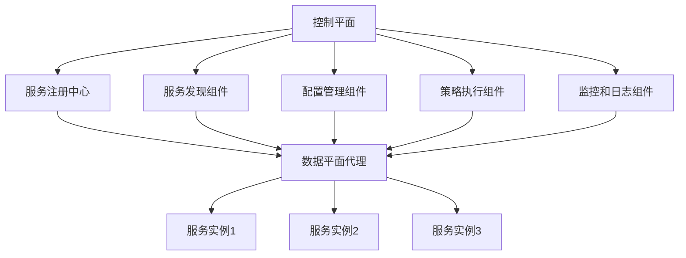

                 


### 第1章: 服务网格(Service Mesh)概述

#### 1.1 服务网格背景与需求

##### 1.1.1 微服务架构的兴起

在过去的几十年中，传统的单体应用程序逐渐暴露出许多问题，如模块间的耦合度太高、代码复杂度增加、部署困难、维护成本高等。为了解决这些问题，微服务架构（Microservices Architecture）应运而生。微服务架构的核心思想是将应用程序拆分为一组小的、独立的、松耦合的服务，每个服务负责一个特定的业务功能。

微服务架构的优点在于：

- **高可扩展性**：每个服务都可以独立部署和扩展，从而提高系统的整体性能。
- **高可用性**：单个服务的故障不会影响整个系统的运行。
- **灵活性**：团队可以独立开发、测试和部署服务，加快开发速度。

然而，微服务架构也带来了一些新的挑战，特别是在服务通信方面。在微服务架构中，服务之间需要进行大量的通信，这些通信不仅要高效，还要可靠和安全。

##### 1.1.2 微服务通信挑战

在微服务架构中，服务之间的通信面临着以下挑战：

- **网络复杂性**：服务数量众多，服务之间的网络拓扑复杂，需要有效的服务发现和负载均衡策略。
- **安全性**：服务之间的通信需要确保数据的安全和隐私。
- **分布式追踪**：需要对服务的调用过程进行监控和追踪，以便快速定位和解决问题。
- **运维管理**：服务的管理和运维变得复杂，需要有效的监控、日志记录和故障处理机制。

##### 1.1.3 服务网格的概念与作用

为了解决微服务通信的挑战，引入了服务网格（Service Mesh）的概念。服务网格是一个基础设施层，它负责管理和控制服务之间的通信。服务网格的主要作用包括：

- **服务发现与负载均衡**：自动发现服务，并根据负载情况智能分配流量。
- **安全通信**：加密服务之间的通信，确保数据的安全和隐私。
- **分布式追踪**：记录服务的调用过程，提供详细的日志和监控信息。
- **运维管理**：提供统一的服务管理接口，简化服务的监控和故障处理。

服务网格的出现，使得微服务架构中的服务通信变得更加高效、可靠和安全。

#### 1.2 服务网格的核心概念

##### 1.2.1 控制平面与数据平面

服务网格由控制平面（Control Plane）和数据平面（Data Plane）两部分组成。

- **控制平面**：负责服务网格的配置管理、流量管理、监控和日志记录等功能。它通常包含一系列的服务，如服务发现、路由规则管理、策略执行等。
- **数据平面**：负责代理服务之间的通信，如拦截和转发请求、执行路由策略和安全策略等。数据平面通常以代理的形式存在于每个服务实例中。

##### 1.2.2 数据平面代理（如Istio、Linkerd）

数据平面代理是服务网格的核心组件，它们负责处理服务之间的通信。目前，常用的数据平面代理包括Istio和Linkerd等。

- **Istio**：由Google、IBM和Lyft共同开发，是一个开源的服务网格平台，提供了丰富的功能，如服务发现、负载均衡、故障注入、监控和日志等。
- **Linkerd**：由Buoyant公司开发，也是一个开源的服务网格平台，专注于性能和安全性，提供了轻量级的数据平面代理和强大的控制平面功能。

##### 1.2.3 服务网格功能模块

服务网格的主要功能模块包括：

- **服务发现**：自动发现服务实例，并将服务名称映射到实际的IP地址和端口号。
- **负载均衡**：根据服务实例的健康状态和负载情况，智能分配流量。
- **故障注入**：模拟服务故障，测试系统的容错能力和恢复能力。
- **监控和日志**：记录服务的调用过程，提供详细的日志和监控信息，帮助快速定位和解决问题。
- **策略执行**：根据预设的策略，对服务之间的通信进行管理和控制。

#### 1.3 服务网格与传统服务管理对比

##### 1.3.1 通信模式对比

传统服务管理通常使用基于消息队列（如RabbitMQ、Kafka）或API网关（如Zuul、 Kong）的通信模式。这些模式存在以下问题：

- **复杂性**：需要额外的组件进行服务发现、负载均衡和日志记录等。
- **单点故障**：消息队列或API网关成为系统的瓶颈，一旦故障，整个系统都会受到影响。
- **性能开销**：额外的通信层会增加系统的性能开销。

相比之下，服务网格的通信模式更加简洁和高效，通过数据平面代理直接处理服务之间的通信，减少了中间层的复杂性。

##### 1.3.2 服务管理机制对比

传统服务管理通常依赖于服务注册中心（如Consul、Zookeeper）和服务发现组件（如Eureka、etcd）。这些机制存在以下问题：

- **高耦合度**：服务与服务注册中心之间紧密耦合，修改服务时需要修改注册中心的配置。
- **分布式问题**：服务注册中心成为系统的单点故障，一旦故障，整个系统都会受到影响。

相比之下，服务网格通过控制平面提供统一的服务管理接口，服务实例无需与控制平面直接交互，降低了服务的耦合度，增强了系统的容错能力。

#### 1.4 服务网格的发展趋势与未来展望

##### 1.4.1 服务网格技术的成熟度

随着微服务架构的广泛应用，服务网格技术也逐渐成熟。目前，Istio和Linkerd等主流服务网格平台已经具备了丰富的功能和完善的支持。

##### 1.4.2 服务网格在多云环境中的应用

随着云计算的普及，多云环境中的应用场景也越来越广泛。服务网格技术可以帮助企业在多云环境中实现服务的高效管理和可靠通信。

##### 1.4.3 服务网格与其他技术结合

服务网格技术可以与其他技术（如容器化技术、云原生技术等）相结合，为企业提供更加灵活和高效的服务管理方案。

#### 1.5 本章小结

本章对服务网格（Service Mesh）进行了概述，介绍了服务网格的背景与需求、核心概念、与传统服务管理的对比以及发展趋势与未来展望。服务网格作为一种新的微服务通信范式，为微服务架构中的服务通信提供了高效、可靠和安全的解决方案。

---

### 第2章: 服务网格的工作原理与架构

#### 2.1 服务网格工作原理

服务网格的工作原理可以分为三个主要部分：数据平面代理、控制平面和服务之间的通信。

##### 2.1.1 服务网格的基本操作

服务网格的基本操作包括：

- **服务注册**：服务实例启动时，会向服务注册中心注册自己的信息，如IP地址、端口号和健康状态等。
- **服务发现**：服务实例需要调用其他服务时，通过服务网格进行服务发现，获取目标服务的地址和端口号。
- **负载均衡**：根据目标服务的负载情况，服务网格会选择最优的服务实例进行调用。
- **通信加密**：服务网格会自动加密服务之间的通信，确保数据的安全和隐私。
- **日志记录**：服务网格会记录服务调用过程中的详细信息，如调用次数、响应时间等，便于监控和故障排查。

##### 2.1.2 数据平面代理的工作机制

数据平面代理是服务网格的核心组件，它负责代理服务之间的通信。数据平面代理的工作机制包括：

- **拦截请求**：数据平面代理会拦截服务之间的请求，并根据路由规则进行转发。
- **执行策略**：数据平面代理会根据预设的策略，如限流、熔断、故障注入等，对请求进行控制和处理。
- **日志记录**：数据平面代理会记录请求的处理过程，如处理时间、响应状态等，便于监控和故障排查。

##### 2.1.3 控制平面的运作

控制平面负责管理服务网格的配置、流量、监控和日志等。控制平面的运作机制包括：

- **配置管理**：控制平面会根据服务网格的配置，生成数据平面代理的配置文件，如路由规则、策略配置等。
- **流量管理**：控制平面会根据流量情况，动态调整数据平面代理的流量分配，如负载均衡、故障转移等。
- **监控和日志**：控制平面会收集数据平面代理的日志和监控数据，如请求次数、响应时间、错误率等，便于监控和故障排查。

#### 2.2 服务网格架构详解

服务网格的架构可以分为控制平面组件和数据平面组件。

##### 2.2.1 控制平面组件

控制平面组件通常包括以下部分：

- **服务注册中心**：负责存储和查询服务实例的信息。
- **服务发现组件**：负责根据服务名称和服务标签，查询服务实例的地址和端口号。
- **配置管理组件**：负责生成和更新数据平面代理的配置文件。
- **策略执行组件**：负责根据预设的策略，对服务之间的通信进行控制和处理。
- **监控和日志组件**：负责收集和展示数据平面代理的日志和监控数据。

##### 2.2.2 数据平面组件

数据平面组件通常包括以下部分：

- **代理**：负责代理服务之间的通信，如拦截请求、执行策略、日志记录等。
- **服务发现**：负责自动发现服务实例，并将服务实例的信息存储在服务注册中心。
- **流量管理**：负责根据流量情况，动态调整代理的流量分配，如负载均衡、故障转移等。
- **安全通信**：负责加密服务之间的通信，确保数据的安全和隐私。

##### 2.2.3 服务网格架构图解

服务网格的架构可以通过以下图解进行说明：



#### 2.3 服务网格与微服务架构的集成

服务网格与微服务架构的集成，可以帮助企业更好地管理和运维微服务，提高系统的性能和可靠性。

##### 2.3.1 服务网格在微服务中的应用

在微服务架构中，服务网格的应用主要包括：

- **服务发现**：自动发现服务实例，简化服务之间的调用。
- **负载均衡**：根据服务实例的负载情况，智能分配流量。
- **安全通信**：加密服务之间的通信，确保数据的安全和隐私。
- **分布式追踪**：记录服务调用过程，便于监控和故障排查。
- **运维管理**：提供统一的服务管理接口，简化服务的监控和故障处理。

##### 2.3.2 服务网格与微服务通信

服务网格与微服务通信的集成，主要通过以下方式进行：

- **代理模式**：每个微服务实例运行一个数据平面代理，负责代理服务之间的通信。
- **边车模式**：在每个微服务实例旁边运行一个数据平面代理，与微服务实例共享同一进程，减少通信开销。

##### 2.3.3 服务网格对微服务架构的影响

服务网格对微服务架构的影响主要包括：

- **降低耦合度**：通过服务网格，服务之间的通信变得更加独立和松耦合，降低了服务的依赖关系。
- **提高性能**：服务网格提供了高效的负载均衡和流量管理机制，提高了系统的性能和响应速度。
- **增强安全性**：服务网格提供了安全通信和访问控制机制，提高了系统的安全性。

#### 2.4 服务网格的性能优化

服务网格的性能优化主要包括以下几个方面：

##### 2.4.1 负载均衡策略

负载均衡策略的选择对服务网格的性能有很大影响，常见的负载均衡策略包括：

- **轮询调度**：将请求依次分配给每个服务实例。
- **最小连接数**：将请求分配给连接数最少的服务实例。
- **最少响应时间**：将请求分配给响应时间最短的服务实例。
- **源地址哈希**：将请求分配给相同源IP的服务实例，确保同一客户端的请求总是分配到同一服务实例。

##### 2.4.2 服务发现机制

服务发现机制的效率对服务网格的性能也有很大影响，常见的服务发现机制包括：

- **基于DNS的服务发现**：通过DNS查询服务实例的地址和端口号。
- **基于API的服务发现**：通过API查询服务实例的地址和端口号。
- **基于配置文件的服务发现**：通过配置文件指定服务实例的地址和端口号。

##### 2.4.3 服务网格性能调优实践

服务网格的性能调优需要结合具体的应用场景和业务需求，以下是一些调优实践：

- **优化代理配置**：根据服务实例的负载情况，调整代理的配置，如连接池大小、超时时间等。
- **优化流量分配**：根据服务实例的响应时间、错误率等指标，动态调整流量分配策略。
- **优化日志记录**：根据监控需求和存储容量，调整日志记录的详细程度和存储位置。

#### 2.5 本章小结

本章详细介绍了服务网格的工作原理和架构，包括数据平面代理、控制平面组件和服务之间的通信。同时，讨论了服务网格与微服务架构的集成，以及服务网格的性能优化策略。通过本章的学习，读者可以更好地理解服务网格的工作原理和优势，为在实际项目中应用服务网格打下基础。

---

### 第3章: Istio——服务网格实践指南

#### 3.1 Istio简介

Istio是一个开源的服务网格平台，由Google、IBM和Lyft共同开发。Istio的目标是提供一种简单、可靠和高效的服务通信和管理方式，帮助企业和开发人员更好地管理和运维微服务架构。

##### 3.1.1 Istio的发展历程

Istio起源于Google的Envoy项目，Google在其内部使用了Envoy作为服务网格的解决方案。随后，IBM和Lyft加入进来，共同推动了Istio的开源项目。Istio在2017年发布了第一个版本，迅速获得了业界的广泛关注和认可。

##### 3.1.2 Istio的核心功能

Istio提供了以下核心功能：

- **服务发现**：自动发现服务实例，并提供服务实例的地址和端口号。
- **负载均衡**：根据服务实例的健康状态和负载情况，智能分配流量。
- **故障注入**：模拟服务故障，测试系统的容错能力和恢复能力。
- **监控和日志**：记录服务调用过程中的详细信息，提供详细的日志和监控信息。
- **安全通信**：加密服务之间的通信，确保数据的安全和隐私。
- **访问控制**：根据用户的身份和权限，控制对服务的访问。

##### 3.1.3 Istio与其他服务网格的比较

与其他服务网格平台（如Linkerd、Consul等）相比，Istio具有以下特点：

- **功能丰富**：Istio提供了丰富的功能，如故障注入、监控和日志等，适用于复杂的微服务架构。
- **兼容性强**：Istio支持多种服务注册中心和通信协议，可以与现有的系统无缝集成。
- **社区活跃**：Istio由多家大型公司共同维护，社区活跃，得到了广泛的应用和认可。

#### 3.2 Istio的安装与配置

##### 3.2.1 环境准备

在安装Istio之前，需要准备以下环境：

- **Kubernetes集群**：版本至少为1.13及以上。
- **Docker**：版本至少为18.06及以上。
- **kubectl**：Kubernetes命令行工具，版本与Kubernetes集群版本匹配。

##### 3.2.2 Istio安装流程

Istio的安装分为以下几个步骤：

1. 下载Istio安装包：
   ```shell
   curl -L https://istio.io/downloadIstio | sh -
   ```
2. 解压安装包：
   ```shell
   tar -xvf istio-1.10.1-linux.tar.gz
   ```
3. 设置环境变量：
   ```shell
   export PATH=$PATH:/path/to/istio-1.10.1/bin
   ```
4. 安装Istio：
   ```shell
   istioctl install --set profile=demo
   ```

##### 3.2.3 Istio配置详解

Istio的配置主要涉及以下几个部分：

- **安装配置**：通过`--set profile`参数指定安装配置，如demo、production等。
- **服务注册中心**：通过`--set values.serviceRegistry=Kubernetes`指定服务注册中心为Kubernetes。
- **控制平面组件**：通过`--set values.controlPlane=true`启用控制平面组件。
- **数据平面组件**：通过`--set values.proxyceiver=true`启用数据平面组件。

#### 3.3 Istio的核心组件

Istio由多个核心组件组成，包括Pilot、Control Plane和数据平面代理。

##### 3.3.1 Pilot

Pilot是Istio的控制平面组件，负责管理服务网格的配置、流量管理和监控。Pilot的主要功能包括：

- **配置管理**：根据服务网格的配置，生成数据平面代理的配置文件。
- **流量管理**：根据流量情况，动态调整数据平面代理的流量分配。
- **监控和日志**：收集数据平面代理的监控数据和日志信息。

##### 3.3.2 Control Plane

Control Plane是Istio的控制平面组件，负责执行服务网格的策略和规则。Control Plane的主要功能包括：

- **策略执行**：根据预设的策略，控制服务之间的通信。
- **认证和授权**：验证用户身份和权限，确保服务之间的安全通信。
- **监控和日志**：收集服务网格的监控数据和日志信息。

##### 3.3.3 Data Plane

Data Plane是Istio的数据平面组件，负责代理服务之间的通信。Data Plane的主要功能包括：

- **代理**：拦截和转发服务之间的请求。
- **服务发现**：自动发现服务实例，并将服务实例的信息存储在服务注册中心。
- **负载均衡**：根据服务实例的负载情况，智能分配流量。
- **安全通信**：加密服务之间的通信，确保数据的安全和隐私。

#### 3.4 Istio的服务管理

Istio提供了丰富的服务管理功能，包括服务定义、服务发现和负载均衡等。

##### 3.4.1 服务定义与配置

在Istio中，服务通过Service对象进行定义。Service对象的主要属性包括：

- **名称**：服务的名称，用于标识服务。
- **标签**：服务的标签，用于区分不同的服务实例。
- **端口**：服务的端口，用于接收和发送请求。

通过Kubernetes的Service对象，可以定义Istio中的服务。以下是一个简单的Service定义示例：

```yaml
apiVersion: v1
kind: Service
metadata:
  name: my-service
spec:
  selector:
    app: my-app
  ports:
    - name: http
      port: 80
      targetPort: 8080
```

##### 3.4.2 服务发现与负载均衡

Istio通过自动服务发现机制，帮助服务实例找到其他服务实例的地址和端口号。在Istio中，服务实例通过Kubernetes的Service对象进行注册，其他服务实例可以通过Service对象发现服务。

Istio的负载均衡机制基于Envoy代理，提供了多种负载均衡策略，如轮询、最小连接数、最少响应时间等。以下是一个简单的负载均衡配置示例：

```yaml
apiVersion: networking.istio.io/v1alpha3
kind: VirtualService
metadata:
  name: my-service
spec:
  hosts:
    - my-service
  http:
    - route:
        - destination:
            name: my-service
            subset: v1
      weight: 90
    - route:
        - destination:
            name: my-service
            subset: v2
      weight: 10
```

##### 3.4.3 服务间的安全通信

Istio提供了丰富的安全通信功能，包括TLS加密、认证和授权等。在Istio中，服务之间的通信默认使用TLS加密，确保数据的安全和隐私。

以下是一个简单的安全通信配置示例：

```yaml
apiVersion: security.istio.io/v1beta1
kind: PeerAuthentication
metadata:
  name: my-service
spec:
  mtls:
    mode: STRICT
```

#### 3.5 Istio的应用案例

Istio在实际项目中有着广泛的应用，以下是一些应用案例：

##### 3.5.1 现有系统迁移到Istio

对于现有的微服务架构系统，可以逐步将服务迁移到Istio。首先，在现有服务的基础上，添加Istio的数据平面代理，然后配置服务发现、负载均衡和安全通信等功能。最后，逐步调整流量，将服务迁移到Istio。

##### 3.5.2 新系统设计中的Istio应用

在新的系统设计中，可以将Istio作为基础设施层，负责服务之间的通信和管理。通过Istio，可以简化服务之间的调用，提高系统的性能和可靠性。

##### 3.5.3 Istio性能调优案例

Istio的性能调优主要涉及代理配置、流量管理和日志记录等方面。以下是一个简单的性能调优案例：

1. 调整代理配置：
   - 增加连接池大小，提高并发处理能力。
   - 调整超时时间，减少请求的处理时间。

2. 调整流量管理：
   - 根据服务实例的负载情况，动态调整流量分配策略。
   - 使用故障注入，测试系统的容错能力和恢复能力。

3. 调整日志记录：
   - 根据监控需求和存储容量，调整日志记录的详细程度和存储位置。

#### 3.6 本章小结

本章详细介绍了Istio的服务网格实践指南，包括Istio的简介、安装与配置、核心组件和服务管理等方面。通过本章的学习，读者可以了解如何使用Istio构建和管理微服务架构，提高系统的性能和可靠性。

---

### 第4章: Linkerd——另一种服务网格解决方案

#### 4.1 Linkerd简介

Linkerd是一个开源的服务网格平台，由Buoyant公司开发。Linkerd旨在为微服务架构提供一种简单、可靠和高效的服务通信和管理方式。

##### 4.1.1 Linkerd的发展历程

Linkerd起源于Buoyant公司的内部项目，该公司在2015年将Linkerd开源，并迅速获得了社区的广泛关注和认可。Linkerd在2017年发布了第一个稳定版本，此后不断更新和完善。

##### 4.1.2 Linkerd的核心特性

Linkerd具有以下核心特性：

- **高性能**：Linkerd采用基于NIO（非阻塞I/O）的架构，具有很高的性能和可扩展性。
- **安全性**：Linkerd提供了完善的TLS加密、认证和授权机制，确保服务之间的通信安全。
- **分布式追踪**：Linkerd集成了OpenTracing标准，提供了强大的分布式追踪功能。
- **故障注入**：Linkerd支持故障注入功能，用于测试系统的容错能力和恢复能力。
- **监控和日志**：Linkerd提供了详细的监控和日志功能，便于快速定位和解决问题。

##### 4.1.3 Linkerd与其他服务网格的比较

与其他服务网格平台（如Istio、Consul等）相比，Linkerd具有以下特点：

- **轻量级**：Linkerd的数据平面代理非常轻量，适合在资源受限的环境中部署。
- **集成性强**：Linkerd与Kubernetes深度集成，可以与现有的Kubernetes集群无缝对接。
- **易于使用**：Linkerd提供了简单、直观的配置和管理方式，降低了使用门槛。

#### 4.2 Linkerd的安装与配置

##### 4.2.1 环境准备

在安装Linkerd之前，需要准备以下环境：

- **Kubernetes集群**：版本至少为1.13及以上。
- **Docker**：版本至少为18.06及以上。
- **kubectl**：Kubernetes命令行工具，版本与Kubernetes集群版本匹配。

##### 4.2.2 Linkerd安装流程

Linkerd的安装分为以下几个步骤：

1. 下载Linkerd安装包：
   ```shell
   curl -L https://github.com/linkerd/linkerd2/releases/download/2.4.1/linkerd2-bundle-darwin-amd64-2.4.1.tar.gz -o linkerd2-bundle.tar.gz
   ```
2. 解压安装包：
   ```shell
   tar -xvf linkerd2-bundle.tar.gz
   ```
3. 设置环境变量：
   ```shell
   export PATH=$PATH:/path/to/linkerd2-bundle/bin
   ```
4. 安装Linkerd：
   ```shell
   linkerd2 install --address=0.0.0.0:4149
   ```

##### 4.2.3 Linkerd配置详解

Linkerd的配置主要涉及以下几个方面：

- **安装配置**：通过`--address`参数指定Linkerd服务的监听地址和端口。
- **服务注册中心**：通过`--proxy.proxy-namespace`参数指定Kubernetes的服务注册中心。
- **控制平面组件**：通过`--control-plan

