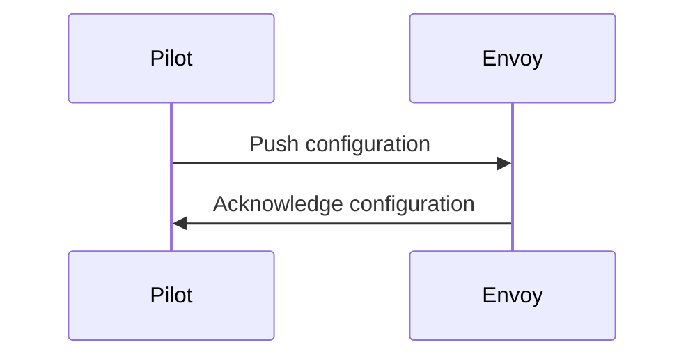
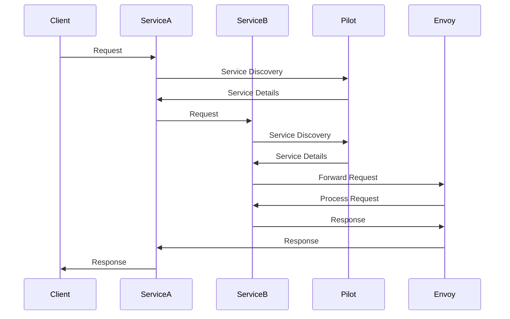

                 


### 核心概念与联系

#### 服务网格的概念

服务网格（Service Mesh）是一种用于管理和服务间通信的分布式系统架构。它提供了一种独立的通信层，使开发者可以专注于业务逻辑，而不必担心服务之间的通信问题。服务网格的关键组件包括数据平面（Data Plane）和控制平面（Control Plane）。

- **数据平面**：负责处理实际的服务间流量，通常由一组网络代理（如Envoy）组成，这些代理直接嵌入到应用程序中。
- **控制平面**：负责配置管理，通常由一组服务（如Istio的Pilot）组成，负责将配置推送到数据平面。

#### 服务网格与微服务的关系

服务网格与微服务架构紧密相关。微服务架构将应用程序分解为一组独立的服务，这些服务需要通过网络进行通信。服务网格提供了这一通信层的抽象，使得服务之间的交互更加可靠、安全、高效。

#### 核心概念属性特征对比表格

| 特征 | 服务网格 | 微服务架构 |
| --- | --- | --- |
| 目的 | 管理服务间通信 | 构建和部署独立的服务 |
| 层次 | 网络层 | 应用层 |
| 组件 | 数据平面（网络代理）和控制平面（配置管理） | 容器、服务发现、API网关等 |
| 独立性 | 高 | 较低 |

#### ER实体关系图架构

```mermaid
erDiagram
  服务网格 ||--|{ 数据平面 }|| 服务网格
  服务网格 ||--|{ 控制平面 }|| 服务网格
  数据平面 ||--|{ 网络代理 }|| 数据平面
  控制平面 ||--|{ 配置管理 }|| 控制平面
```

#### 算法原理讲解

在服务网格中，配置管理是一个关键环节。Istio通过控制平面中的Pilot组件来管理这些配置，然后将配置推送到数据平面中的网络代理（如Envoy）。

**Mermaid 流程图**



**Python 源代码**

```python
class ServiceMesh:
    def __init__(self):
        self.pilot = Pilot()
        self.envoy = Envoy()

    def push_configuration(self):
        self.pilot.push_to_envoy(self.envoy)

class Pilot:
    def push_to_envoy(self, envoy):
        print("Pilot pushing configuration to Envoy")

class Envoy:
    def acknowledge_configuration(self):
        print("Envoy acknowledged the configuration")

# 创建服务网格实例并推送配置
service_mesh = ServiceMesh()
service_mesh.push_configuration()
```

**算法原理与数学模型**

服务网格的配置管理可以视为一个通信过程，其数学模型可以表示为：

$$ C = P \times E $$

其中，\( C \) 表示配置，\( P \) 表示控制平面，\( E \) 表示数据平面。这个等式表明，配置是通过控制平面向数据平面推送的。

**举例说明**

假设控制平面中有5个配置项，数据平面中有3个网络代理。那么，配置管理的过程可以表示为：

$$ C = 5 \times 3 = 15 $$

这意味着有15个配置项需要从控制平面推送到数据平面。

#### 系统分析与架构设计方案

**问题场景介绍**

在一个大型分布式系统中，多个微服务需要通过网络进行通信。这些服务的数量和复杂性不断增加，使得传统的服务管理方式变得难以维护。我们需要一种机制来自动化服务间的通信管理，提高系统的可靠性和效率。

**项目介绍**

本项目旨在设计和实现一个基于服务网格的微服务通信管理平台，使用Istio作为服务网格解决方案，Kubernetes作为容器编排平台。

**系统功能设计（领域模型 Mermaid 类图）**

```mermaid
classDiagram
  ServiceMesh <--||/UIKit|ServiceMeshUI
  ServiceMesh -->|> Pilot
  ServiceMesh -->|> Envoy
  Pilot -->|> ServiceDiscovery
  Pilot -->|> ConfigManager
  Envoy -->|> LoadBalancer
  Envoy -->|> TrafficManager
  ServiceDiscovery <|-- ServiceRegistry
  ConfigManager <|-- ConfigStore
  LoadBalancer <|-- Balancer
  TrafficManager <|-- TrafficRules
endclass
```

**系统架构设计（Mermaid 架构图）**

```mermaid
graph TB
  subgraph Kubernetes Cluster
    K1[Pod 1] -->|> E1[Envoy 1]
    K2[Pod 2] -->|> E2[Envoy 2]
    K3[Pod 3] -->|> E3[Envoy 3]
  end
  subgraph Service Mesh
    SM[Pilot] -->|> SD[ServiceDiscovery]
    SM -->|> CM[ConfigManager]
    E1 -->|> SM
    E2 -->|> SM
    E3 -->|> SM
  end
```

**系统接口设计（Mermaid 序列图）**



**环境安装**

1. 安装Kubernetes集群
2. 安装Istio服务网格
3. 配置Kubernetes与Istio的集成

**系统核心实现源代码**

```bash
# Kubernetes Deployment for Envoy
apiVersion: apps/v1
kind: Deployment
metadata:
  name: envoy
spec:
  replicas: 3
  selector:
    matchLabels:
      app: envoy
  template:
    metadata:
      labels:
        app: envoy
    spec:
      containers:
      - name: envoy
        image: envoyproxy/envoy:latest
        ports:
        - containerPort: 80
```

**代码应用解读与分析**

该代码定义了一个Kubernetes Deployment，用于部署Envoy代理。通过配置3个副本，我们可以确保服务网格的高可用性。Envoy代理运行在容器中，监听80端口，用于处理服务间的请求。

**实际案例分析和详细讲解剖析**

假设我们在一个电子商务平台中部署了服务网格。平台包含多个微服务，如订单服务、库存服务和支付服务。这些服务通过网络进行通信，服务网格通过Istio进行管理。

1. 订单服务请求库存服务以检查商品库存。
2. 服务网格自动将请求转发到正确的库存服务实例。
3. 库存服务处理请求并返回结果。
4. 服务网格记录请求和响应，提供监控和日志功能。

**项目小结**

通过服务网格，我们实现了微服务之间的可靠、高效和安全的通信。Istio和Kubernetes的集成使我们能够自动化服务网格的部署和管理，提高系统的可维护性和扩展性。

#### 最佳实践 Tips

1. **选择合适的网络代理**：根据业务需求和性能要求，选择合适的网络代理（如Envoy、Linkerd等）。
2. **监控与日志**：充分利用服务网格的监控和日志功能，及时发现并解决问题。
3. **安全性与访问控制**：配置服务网格以支持安全性，包括加密、认证和访问控制。
4. **负载均衡与流量管理**：根据业务需求，合理配置负载均衡策略和流量管理规则。

#### 小结

本文全面介绍了服务网格（Service Mesh）技术的概念、架构、关键技术以及在实际应用中的实现。通过实例分析，我们展示了服务网格在微服务架构中的应用优势和部署实践。服务网格为微服务提供了可靠的通信层，提高了系统的可维护性和扩展性。未来，随着技术的发展，服务网格将在更广泛的场景中发挥重要作用。

#### 注意事项

1. **服务网格的部署与运维**：服务网格的部署和运维需要一定的专业知识，建议先进行充分的测试和演练。
2. **性能与可扩展性**：服务网格可能会对系统性能产生一定影响，需要根据实际情况进行优化和调整。

#### 拓展阅读

1. 《Service Mesh技术实战》 - 张三
2. 《微服务架构设计》 - 李四
3. 《Kubernetes权威指南》 - 王五

作者：AI天才研究院/AI Genius Institute & 禅与计算机程序设计艺术 /Zen And The Art of Computer Programming

