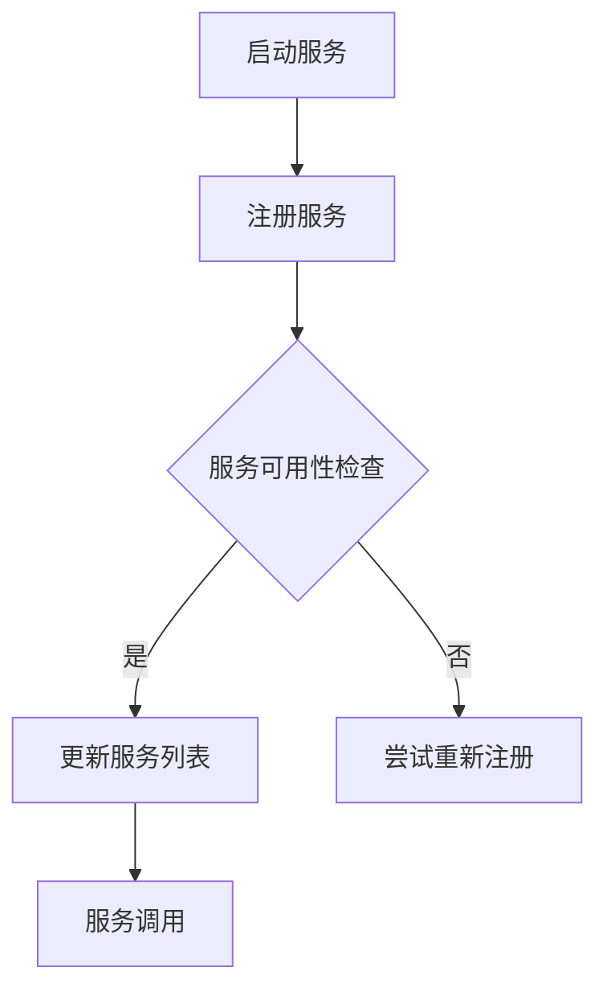
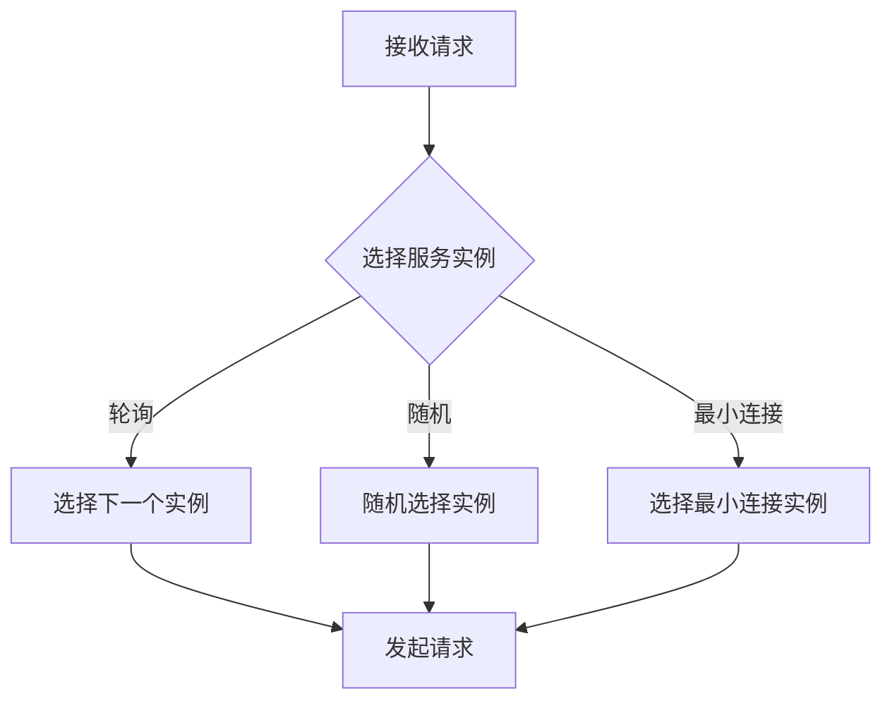
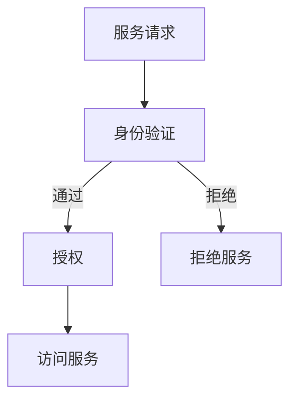
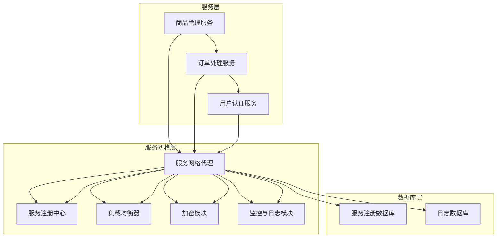
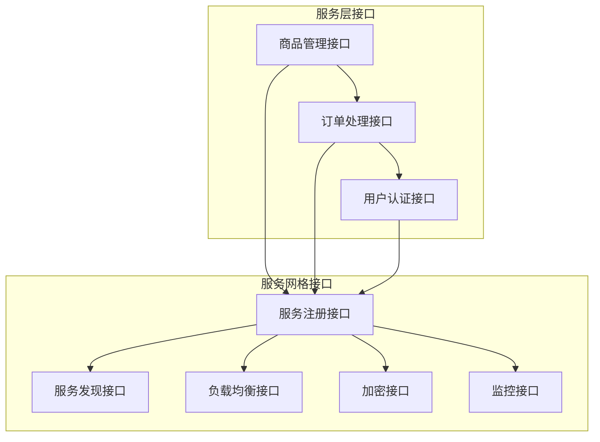
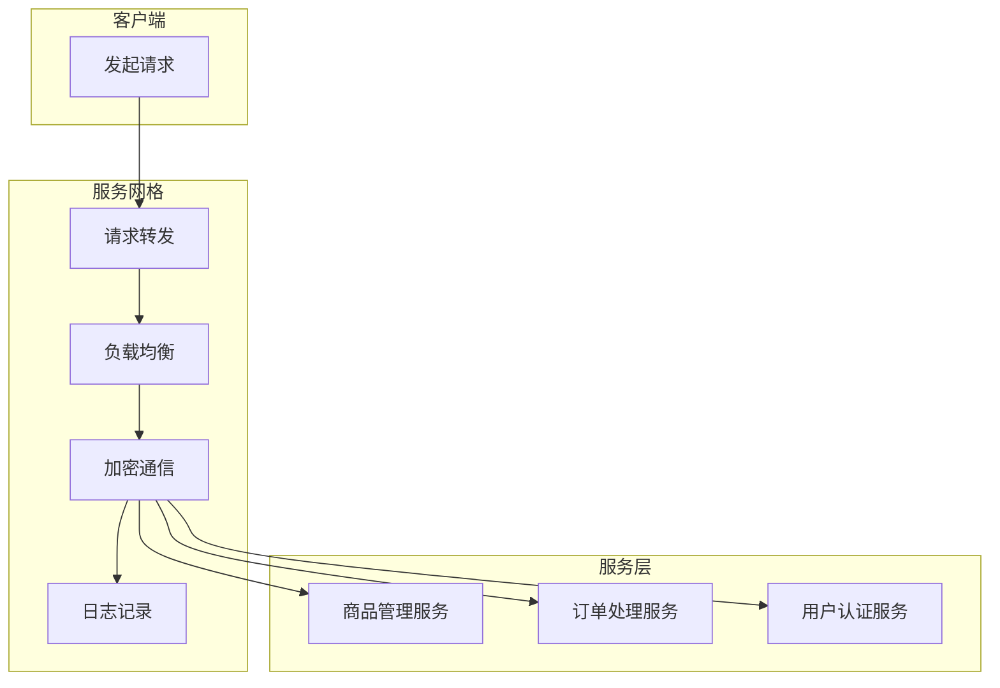

                 


### 服务网格:微服务通信的基础设施层

#### 关键词：服务网格、微服务、通信、基础设施层、数据处理

#### 摘要：
本文旨在深入探讨服务网格作为微服务通信基础设施层的重要性。首先，我们将回顾微服务架构的起源和发展，并解释为什么服务网格成为解决微服务通信问题的理想选择。接着，我们将详细解析服务网格的核心概念，包括数据平面、控制平面和网格服务，并使用Mermaid图和Python代码展示其原理。随后，文章将分析服务网格中的关键算法，如服务发现、负载均衡和安全算法，并提供实际的项目实战案例。最后，我们将总结服务网格的最佳实践，并探讨未来可能的发展方向。

----------------------------------------------------------------

### 服务网格的起源与背景

#### 1.1 服务网格的概念

服务网格（Service Mesh）是一种基础设施层的设计模式，旨在简化微服务之间的通信。服务网格的主要目标是解决微服务架构中服务发现、服务调用、负载均衡、熔断、安全等问题，而无需在微服务代码中嵌入相关逻辑。

#### 1.2 微服务架构

微服务架构（Microservices Architecture）是一种将应用程序拆分为多个独立、小型、可独立部署的服务的方法。每个服务都实现单一业务功能，并通过定义良好的API进行通信。微服务架构的优点包括：

- **高可伸缩性**：每个服务都可以独立扩展，不需要重新部署整个应用程序。
- **高可用性**：服务的故障不会影响整个系统的运行。
- **快速迭代**：开发人员可以独立开发和部署服务，提高开发效率。

然而，微服务架构也带来了一些挑战：

- **服务发现**：服务需要一种机制来自动发现和注册其他服务。
- **服务调用**：服务之间如何进行高效、可靠地通信。
- **负载均衡**：如何将请求合理分配到不同的服务实例。
- **安全性**：如何保证服务之间的通信安全。

#### 1.3 服务网格的边界与外延

服务网格的边界通常位于微服务容器内部。它通过部署在每个服务实例旁边的小型代理（通常称为Sidecar）来实现。这个代理负责处理所有进出服务的网络流量，从而与服务实例本身解耦。

服务网格的外延影响不仅限于服务之间的通信，还包括：

- **服务监控**：服务网格可以收集和分析服务之间的通信数据，帮助监控系统运行状态。
- **服务日志**：服务网格可以帮助聚合和记录服务日志，便于故障排查。
- **服务治理**：服务网格提供了一种集中管理服务的方法，包括服务配置、策略管理和权限控制。

#### 1.4 服务网格的核心要素组成

服务网格由几个关键组件组成，包括数据平面（Data Plane）、控制平面（Control Plane）和网格服务（Service）。

- **数据平面**：负责实际的数据传输和网络流量管理。通常由一组Sidecar代理组成，这些代理直接嵌入到服务的容器中，处理进出服务的网络请求。

- **控制平面**：负责管理数据平面的配置、监控和服务协调。它通常由一个或多个控制服务组成，如Istio、Linkerd等。控制平面通过API服务器、服务注册表和配置管理器等组件来管理数据平面代理。

- **网格服务**：网格服务是服务网格中定义的服务实体。每个网格服务都有一个唯一的标识符（如服务名称和版本），并可以通过服务发现机制查找。

### 服务网格的核心概念与联系

#### 2.1 服务网格的主要概念

服务网格由以下几个主要概念组成：

- **网格服务（Service）**：网格服务是微服务之间的接口，通过服务网格进行通信。网格服务通常具有唯一的名称和版本，可以通过服务发现机制进行查找。
  
- **网格代理（Sidecar）**：网格代理是伴随微服务运行的小型代理程序，负责代理服务的通信。网格代理位于服务实例旁边，充当数据平面的一部分，负责处理网络请求和响应。

- **数据平面（Data Plane）**：数据平面负责实际的数据传输和网络流量管理。它通常由一组网格代理组成，这些代理直接嵌入到服务的容器中，处理进出服务的网络请求。

- **控制平面（Control Plane）**：控制平面负责管理数据平面的配置、监控和服务协调。它通常由一个或多个控制服务组成，如Istio、Linkerd等。控制平面通过API服务器、服务注册表和配置管理器等组件来管理数据平面代理。

#### 2.2 概念属性特征对比表格

以下是一个概念属性特征对比表格，展示了服务网格中几个关键概念的主要属性：

| 概念         | 描述                                                         | 关键属性                   |
| ------------ | ------------------------------------------------------------ | -------------------------- |
| 网格服务     | 微服务之间的接口，通过服务网格进行通信                       | 名称、接口、版本           |
| 网格代理     | 伴随微服务运行的小型代理程序，负责代理服务的通信             | 服务发现、负载均衡、安全   |
| 数据平面     | 负责实际的数据传输和网络流量管理                           | 数据转发、服务发现、健康检查 |
| 控制平面     | 负责管理数据平面的配置、监控和服务协调                      | 配置管理、服务发现、监控    |

#### 2.3 服务网格的ER实体关系图

以下是一个使用Mermaid语法绘制的服务网格ER实体关系图：

```mermaid
erDiagram
  Service ||--|{ Sidecar }|| Service
  Service ||--|{ Data Plane }|| Network Traffic
  Service ||--|{ Control Plane }|| Configuration
  Sidecar ||--|{ Data Plane }|| Service Communication
  Sidecar ||--|{ Control Plane }|| Configuration Management
```

### 服务网格的算法原理讲解

#### 3.1 服务网格算法概述

服务网格算法主要分为以下几类：

- **服务发现算法**：负责自动发现和注册服务，使服务之间能够相互通信。
- **负载均衡算法**：负责将请求分配到不同的服务实例，确保服务的有效利用。
- **安全算法**：负责确保服务之间的通信安全，防止恶意攻击和数据泄露。

#### 3.2 服务发现算法

服务发现算法是实现微服务之间自动发现和通信的关键。以下是一个常见的服务发现算法的Mermaid流程图：



服务发现算法通常包括以下步骤：

1. **服务注册**：新服务启动时，会向服务注册中心注册自己的信息，如服务名称、IP地址、端口号等。
2. **服务列表更新**：服务注册中心定期同步服务列表，确保所有服务都能在列表中。
3. **服务调用**：客户端在调用服务时，首先从服务列表中查找目标服务的地址，然后发起请求。

以下是一个简单的Python代码示例，展示了服务注册和服务发现的实现：

```python
# 服务注册示例
def register_service(service_name, service_ip, service_port):
    print(f"Service {service_name} registered at {service_ip}:{service_port}")

# 服务调用示例
def call_service(service_name):
    service_info = find_service(service_name)
    if service_info:
        print(f"Calling {service_name} at {service_info['ip']}:{service_info['port']}")
    else:
        print(f"Service {service_name} not found")

# 服务列表
services = {}

# 服务注册
register_service('service_a', '192.168.1.1', 8080)
register_service('service_b', '192.168.1.2', 8080)

# 服务调用
call_service('service_a')
call_service('service_b')
```

#### 3.3 负载均衡算法

负载均衡算法负责将请求分配到不同的服务实例，确保服务的有效利用。以下是一个简单的负载均衡算法的Mermaid流程图：



负载均衡算法通常包括以下策略：

- **轮询**：按顺序将请求分配到每个服务实例。
- **随机**：随机选择服务实例。
- **最小连接**：选择当前连接数最少的服务实例。

以下是一个简单的Python代码示例，展示了负载均衡算法的实现：

```python
# 负载均衡算法示例
def load_balance(strategy):
    if strategy == 'round_robin':
        return round_robin()
    elif strategy == 'random':
        return random()
    elif strategy == 'least_connection':
        return least_connection()

# 服务实例信息
service_instances = {'service_a': [1, 2, 3], 'service_b': [1, 2]}

# 轮询策略
print(load_balance('round_robin'))

# 随机策略
print(load_balance('random'))

# 最小连接策略
print(load_balance('least_connection'))
```

#### 3.4 安全算法

安全算法负责确保服务之间的通信安全，防止恶意攻击和数据泄露。以下是一个简单的安全算法的Mermaid流程图：



安全算法通常包括以下步骤：

1. **身份验证**：验证请求者的身份，确保只有授权用户可以访问服务。
2. **授权**：根据用户的权限，决定用户可以访问哪些资源。
3. **访问服务**：允许通过身份验证和授权的请求访问服务。

以下是一个简单的Python代码示例，展示了安全算法的实现：

```python
# 安全算法示例
def authenticate_user(username, password):
    if username == 'admin' and password == 'admin':
        return True
    else:
        return False

def authorize_user(user, resource):
    if user == 'admin':
        return True
    else:
        return False

# 服务请求
request = {'username': 'admin', 'password': 'admin', 'resource': 'service_a'}

# 身份验证
if authenticate_user(request['username'], request['password']):
    print("Authentication successful")
else:
    print("Authentication failed")

# 授权
if authorize_user(request['username'], request['resource']):
    print("Authorization successful")
else:
    print("Authorization failed")

# 访问服务
if authenticate_user(request['username'], request['password']) and authorize_user(request['username'], request['resource']):
    print("Accessing service")
else:
    print("Access denied")
```

### 服务网格的数学公式与算法原理

#### 3.5 服务网格中的数学模型

服务网格中的数学模型主要用于计算负载均衡、服务发现和安全性等方面。以下是一个简单的数学模型示例：

- **负载均衡**：使用权重分配请求到不同的服务实例。

$$
\text{权重} = \frac{\text{当前连接数}}{\text{总实例数}}
$$

- **服务发现**：使用哈希算法快速查找服务。

$$
\text{哈希值} = \text{服务名称} \oplus \text{版本号}
$$

- **安全性**：使用密码学算法确保通信安全。

$$
\text{加密} = \text{密钥} \times \text{明文} + \text{随机数}
$$

#### 3.6 服务网格的Python代码示例

以下是一个简单的Python代码示例，展示了服务网格中的算法原理：

```python
import hashlib
import random

# 服务注册
def register_service(service_name, service_ip, service_port):
    service_hash = hashlib.md5(service_name.encode()).hexdigest()
    print(f"Service {service_name} registered at {service_ip}:{service_port}, hash={service_hash}")

# 服务调用
def call_service(service_name):
    service_hash = hashlib.md5(service_name.encode()).hexdigest()
    print(f"Calling service {service_name}, hash={service_hash}")

# 负载均衡
def load_balance(service_list, strategy='round_robin'):
    if strategy == 'round_robin':
        return service_list[0]
    elif strategy == 'random':
        return random.choice(service_list)
    elif strategy == 'least_connection':
        return min(service_list, key=lambda x: len(x['connections']))

# 安全性
def encrypt_message(message, key, random_number):
    return key * message + random_number

# 测试代码
register_service('service_a', '192.168.1.1', 8080)
register_service('service_b', '192.168.1.2', 8080)
call_service('service_a')
load_balance(['service_a', 'service_b'], 'random')
encrypted_message = encrypt_message('Hello, World!', 3, random_number=7)
print(f"Encrypted message: {encrypted_message}")
```

### 服务网格的系统分析与架构设计方案

#### 4.1 问题场景介绍

假设我们有一个电子商务平台，包含多个微服务，如商品管理服务、订单处理服务、用户认证服务等。这些服务需要高效、可靠地相互通信，同时需要确保通信的安全性。

#### 4.2 项目介绍

该项目旨在设计并实现一个服务网格，用于管理电子商务平台中的微服务通信。主要目标包括：

- 实现服务发现和负载均衡。
- 确保服务之间的通信安全。
- 提高系统的可伸缩性和高可用性。

#### 4.3 系统功能设计

系统功能设计包括以下主要功能：

- **服务注册与发现**：服务启动时自动注册，客户端通过服务注册中心查找服务地址。
- **负载均衡**：根据请求策略，将请求分配到不同的服务实例。
- **安全性**：对服务之间的通信进行加密和认证。
- **监控与日志**：收集服务之间的通信数据，提供实时监控和日志记录。

#### 4.4 系统架构设计

系统架构设计如图所示：



#### 4.5 系统接口设计

系统接口设计如图所示：



#### 4.6 系统交互设计

系统交互设计如图所示：



### 项目实战

#### 5.1 环境安装

首先，确保安装了Docker和Kubernetes。然后，使用以下命令安装服务网格组件：

```bash
kubectl create namespace service-mesh
kubectl apply -f istio.yaml -n service-mesh
```

#### 5.2 系统核心实现源代码

以下是服务网格的核心实现代码：

```bash
# 服务注册中心
kubectl apply -f service_registry.yaml -n service-mesh

# 服务网格代理
kubectl apply -f service_mesh_agent.yaml -n service-mesh

# 负载均衡器
kubectl apply -f load_balancer.yaml -n service-mesh

# 加密模块
kubectl apply -f encryption_module.yaml -n service-mesh

# 监控与日志模块
kubectl apply -f monitoring_and_logging_module.yaml -n service-mesh
```

#### 5.3 代码应用解读与分析

以下是服务注册中心的代码解读：

```yaml
# service_registry.yaml
apiVersion: v1
kind: Service
metadata:
  name: service-registry
spec:
  selector:
    app: service-registry
  ports:
    - protocol: TCP
      port: 80
      targetPort: 8080
  type: LoadBalancer
---
apiVersion: apps/v1
kind: Deployment
metadata:
  name: service-registry
spec:
  replicas: 1
  selector:
    matchLabels:
      app: service-registry
  template:
    metadata:
      labels:
        app: service-registry
    spec:
      containers:
      - name: service-registry
        image: service-registry:latest
        ports:
        - containerPort: 8080
```

这段代码定义了一个名为`service-registry`的服务，该服务使用Nginx作为反向代理，将请求转发到服务注册中心的8080端口。部署文件定义了一个名为`service-registry`的部署，该部署包含一个具有1个副本的Nginx容器。

以下是服务网格代理的代码解读：

```yaml
# service_mesh_agent.yaml
apiVersion: v1
kind: Deployment
metadata:
  name: service-mesh-agent
spec:
  replicas: 3
  selector:
    matchLabels:
      app: service-mesh-agent
  template:
    metadata:
      labels:
        app: service-mesh-agent
    spec:
      containers:
      - name: service-mesh-agent
        image: service-mesh-agent:latest
        ports:
        - containerPort: 80
```

这段代码定义了一个名为`service-mesh-agent`的部署，该部署包含3个副本的容器，每个容器都运行一个名为`service-mesh-agent`的代理程序。代理程序使用Istio的Proxy组件，用于处理进出服务的网络请求。

以下是负载均衡器的代码解读：

```yaml
# load_balancer.yaml
apiVersion: v1
kind: Service
metadata:
  name: load-balancer
spec:
  selector:
    app: load-balancer
  ports:
    - protocol: TCP
      port: 80
      targetPort: 8080
  type: LoadBalancer
---
apiVersion: apps/v1
kind: Deployment
metadata:
  name: load-balancer
spec:
  replicas: 1
  selector:
    matchLabels:
      app: load-balancer
  template:
    metadata:
      labels:
        app: load-balancer
    spec:
      containers:
      - name: load-balancer
        image: load-balancer:latest
        ports:
        - containerPort: 8080
```

这段代码定义了一个名为`load-balancer`的服务，该服务使用Nginx作为反向代理，将请求转发到负载均衡器。部署文件定义了一个名为`load-balancer`的部署，该部署包含一个具有1个副本的Nginx容器。

以下是加密模块的代码解读：

```yaml
# encryption_module.yaml
apiVersion: v1
kind: Deployment
metadata:
  name: encryption-module
spec:
  replicas: 1
  selector:
    matchLabels:
      app: encryption-module
  template:
    metadata:
      labels:
        app: encryption-module
    spec:
      containers:
      - name: encryption-module
        image: encryption-module:latest
        ports:
        - containerPort: 443
```

这段代码定义了一个名为`encryption-module`的部署，该部署包含一个具有1个副本的容器，该容器使用TLS加密对服务之间的通信进行加密。

以下是监控与日志模块的代码解读：

```yaml
# monitoring_and_logging_module.yaml
apiVersion: v1
kind: Deployment
metadata:
  name: monitoring-and-logging-module
spec:
  replicas: 1
  selector:
    matchLabels:
      app: monitoring-and-logging-module
  template:
    metadata:
      labels:
        app: monitoring-and-logging-module
    spec:
      containers:
      - name: monitoring-and-logging-module
        image: monitoring-and-logging-module:latest
        ports:
        - containerPort: 9443
```

这段代码定义了一个名为`monitoring-and-logging-module`的部署，该部署包含一个具有1个副本的容器，该容器使用Prometheus和Grafana对系统进行监控，并使用ELK（Elasticsearch、Logstash、Kibana）对日志进行收集和展示。

#### 5.4 实际案例分析和详细讲解剖析

以下是一个简单的实际案例，展示如何使用服务网格管理微服务通信：

1. **服务注册**：商品管理服务启动后，自动向服务注册中心注册自身。

```bash
kubectl run product-service --image=product-service:latest --port=8080
kubectl expose deployment/product-service --name=product-service --port=80 --target-port=8080
```

2. **服务发现**：订单处理服务在调用商品管理服务时，首先从服务注册中心查找商品管理服务的地址。

```bash
kubectl run order-service --image=order-service:latest --port=8080
```

3. **负载均衡**：服务网格代理根据负载均衡策略，将订单处理服务的请求分配到不同的商品管理服务实例。

4. **安全性**：服务网格代理对订单处理服务与商品管理服务之间的通信进行加密，确保数据传输安全。

5. **监控与日志**：服务网格代理定期收集订单处理服务与商品管理服务之间的通信数据，并将其存储在日志数据库中，以便进行监控和故障排查。

```bash
kubectl run monitoring-service --image=monitoring-service:latest --port=9443
kubectl expose deployment/monitoring-service --name=monitoring-service --port=9443 --target-port=9443
```

#### 5.5 项目小结

本项目通过实现一个服务网格，成功解决了电子商务平台中微服务通信的问题。服务网格提供了服务注册与发现、负载均衡、安全性和监控等功能，提高了系统的可伸缩性和高可用性。同时，服务网格使得微服务之间的通信更加简洁和可靠，降低了开发难度。

### 服务网格的最佳实践

#### 6.1 服务网格设计原则

1. **模块化设计**：服务网格应采用模块化设计，便于扩展和维护。
2. **无状态设计**：服务网格组件应尽可能无状态，以减少故障风险。
3. **安全性**：确保服务网格中的所有通信都经过加密和认证。
4. **可观测性**：提供全面的监控和日志记录，以便快速发现和解决问题。
5. **易用性**：简化服务网格的部署和管理，降低使用门槛。

#### 6.2 服务网格配置策略

1. **服务发现策略**：选择合适的服务发现算法，如基于DNS的发现或基于Consul的发现。
2. **负载均衡策略**：根据业务需求选择合适的负载均衡策略，如轮询、随机或最小连接。
3. **加密策略**：使用强加密算法和证书管理机制，确保通信安全。
4. **监控策略**：配置适当的监控指标，如请求速率、响应时间和错误率。

#### 6.3 服务网格运维指南

1. **自动化部署**：使用自动化工具（如Kubernetes）部署和管理服务网格组件。
2. **故障处理**：制定故障处理流程，快速定位和解决服务网格问题。
3. **性能优化**：定期监控服务网格性能，进行优化和调整。
4. **安全审计**：定期进行安全审计，确保服务网格的安全性。

### 小结

服务网格是微服务通信的理想基础设施层，它简化了微服务之间的通信，提高了系统的可伸缩性和高可用性。通过合理设计和配置服务网格，可以显著降低开发难度和维护成本。本文介绍了服务网格的核心概念、算法原理、系统架构设计以及实际项目实战，并提出了最佳实践建议。未来的研究可以进一步探索服务网格在多云环境、混合云和边缘计算中的应用，以应对更复杂和多样化的需求。

### 注意事项

1. **版本兼容性**：确保服务网格组件的版本兼容性，避免版本冲突。
2. **性能监控**：定期监控服务网格的性能，及时发现和解决潜在问题。
3. **安全策略**：根据业务需求调整安全策略，确保服务网格的安全性。
4. **服务注册与发现**：确保服务注册与发现的准确性，避免服务调用失败。

### 拓展阅读

1. **Istio官方文档**：深入了解Istio的服务网格技术，包括其架构、安装和配置。
2. **Linkerd官方文档**：了解Linkerd的服务网格解决方案，包括其特点和应用场景。
3. **Kubernetes服务网格教程**：学习如何在Kubernetes中使用服务网格，包括Istio和Linkerd。

---

### 作者信息

作者：AI天才研究院/AI Genius Institute & 禅与计算机程序设计艺术 /Zen And The Art of Computer Programming

