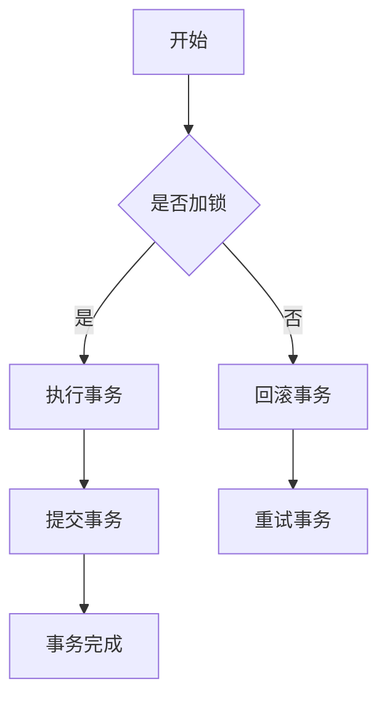

                 

### 文章标题

# 本质是异构系统的数据一致性问题

## 关键词

- 异构系统
- 数据一致性
- 同步复制
- 异步复制
- 最终一致性
- 事件一致性
- 分布式日志系统

## 摘要

本文深入探讨了异构系统中的数据一致性问题。通过详细的背景介绍、核心概念解析、解决方案分析、系统架构设计、项目实战和最佳实践，本文旨在为读者提供一个全面且系统的理解，帮助他们在实际项目中有效解决数据一致性问题。文章将采用逻辑清晰、结构紧凑、简单易懂的专业技术语言，一步步分析推理，确保读者能够深入理解数据一致性的本质。

---

## 目录

### 第一部分：问题背景与核心概念

1. **第1章 异构系统的概念与数据一致性问题**  
   1.1 异构系统的定义与特点  
   1.2 数据一致性的重要性  
   1.3 数据一致性问题的主要类型

2. **第2章 数据一致性问题的影响因素**  
   2.1 系统异构性  
   2.2 数据访问模式  
   2.3 网络延迟与带宽限制  
   2.4 数据库系统特性

3. **第3章 数据一致性的核心概念与联系**  
   3.1 一致性模型的定义  
   3.2 同步复制与异步复制  
   3.3 强一致性、最终一致性与事件一致性

4. **第4章 数据一致性的解决方案**  
   4.1 防火墙策略  
   4.2 乐观锁与悲观锁  
   4.3 事务管理  
   4.4 分布式日志系统

### 第二部分：数据一致性的系统设计与实现

5. **第5章 系统架构设计**  
   5.1 问题场景介绍  
   5.2 系统功能设计  
   5.3 系统架构设计  
   5.4 系统接口设计  
   5.5 系统交互序列图

6. **第6章 数学模型与算法原理讲解**  
   6.1 一致性模型数学模型  
   6.2 乐观锁与悲观锁的算法原理  
   6.3 事务管理算法的mermaid流程图  
   6.4 分布式日志系统的算法原理

7. **第7章 数据一致性的项目实战**  
   7.1 环境安装  
   7.2 系统核心实现源代码  
   7.3 代码应用解读与分析  
   7.4 实际案例分析与讲解剖析  
   7.5 项目小结

### 第三部分：最佳实践与拓展

8. **第8章 数据一致性的最佳实践**  
   8.1 调优技巧  
   8.2 性能优化策略  
   8.3 失败案例分析

9. **第9章 注意事项与未来展望**  
   9.1 可能遇到的问题与解决方案  
   9.2 技术趋势与未来方向  
   9.3 拓展阅读建议

---

### 目录大纲设计过程

设计一本关于“本质是异构系统的数据一致性问题”的书籍目录大纲，我们需要遵循以下步骤：

1. **明确书籍的核心内容和结构**：
   - 书籍的核心内容应该围绕“异构系统的数据一致性问题”进行阐述。
   - 目录结构应该包括问题的背景、核心概念、解决方案、系统架构设计、数学模型、项目实战等。

2. **确定目录大纲的基本格式**：
   - 使用markdown格式来设计目录大纲，确保清晰、易于阅读。
   - 目录层次应该明确，包括一级、二级、三级目录。

3. **细化每个章节的内容**：
   - 对每个章节进行详细划分，确保每个章节都有清晰的主题和内容。
   - 遵循逻辑顺序，使读者能够循序渐进地理解问题。

4. **确保内容的完整性**：
   - 目录大纲必须包含背景介绍、核心概念与联系、解决方案、数学模型与公式讲解、系统设计与实现、项目实战等。
   - 特别注意，每个章节的内容都应该有相应的实例和代码来辅助说明。

5. **检查和优化**：
   - 检查目录大纲的逻辑性、完整性和清晰度。
   - 优化文字表述，确保简洁、准确。

### 目录大纲设计方案

基于以上步骤，我们可以设计出以下《本质是异构系统的数据一致性问题》的目录大纲：

```markdown
# 《本质是异构系统的数据一致性问题》目录大纲

## 第一部分: 问题背景与核心概念

### 第1章: 异构系统的概念与数据一致性问题

#### 1.1 异构系统的定义与特点

#### 1.2 数据一致性的重要性

#### 1.3 数据一致性问题的主要类型

### 第2章: 数据一致性问题的影响因素

#### 2.1 系统异构性

#### 2.2 数据访问模式

#### 2.3 网络延迟与带宽限制

#### 2.4 数据库系统特性

### 第3章: 数据一致性的核心概念与联系

#### 3.1 一致性模型的定义

#### 3.2 同步复制与异步复制

#### 3.3 强一致性、最终一致性与事件一致性

### 第4章: 数据一致性的解决方案

#### 4.1 防火墙策略

#### 4.2 乐观锁与悲观锁

#### 4.3 事务管理

#### 4.4 分布式日志系统

### 第二部分: 数据一致性的系统设计与实现

### 第5章: 系统架构设计

#### 5.1 问题场景介绍

#### 5.2 系统功能设计

#### 5.3 系统架构设计

#### 5.4 系统接口设计

#### 5.5 系统交互序列图

### 第6章: 数学模型与算法原理讲解

#### 6.1 一致性模型数学模型

#### 6.2 乐观锁与悲观锁的算法原理

#### 6.3 事务管理算法的mermaid流程图

#### 6.4 分布式日志系统的算法原理

### 第7章: 数据一致性的项目实战

#### 7.1 环境安装

#### 7.2 系统核心实现源代码

#### 7.3 代码应用解读与分析

#### 7.4 实际案例分析与讲解剖析

#### 7.5 项目小结

### 第三部分: 最佳实践与拓展

### 第8章: 数据一致性的最佳实践

#### 8.1 调优技巧

#### 8.2 性能优化策略

#### 8.3 失败案例分析

### 第9章: 注意事项与未来展望

#### 9.1 可能遇到的问题与解决方案

#### 9.2 技术趋势与未来方向

#### 9.3 拓展阅读建议
```

### 目录大纲特点

- **清晰的结构**：按照问题背景、核心概念、解决方案、系统设计与实现、最佳实践与拓展的顺序进行组织。
- **内容丰富**：涵盖了从概念到实践的所有关键点，确保读者能够全面理解数据一致性问题。
- **实例与代码**：在项目实战章节中，包含环境安装、系统核心实现源代码和实际案例分析，使读者能够学以致用。
- **简洁明了**：保持语言简洁，避免冗余，确保目录大纲清晰易懂。

通过这个目录大纲，读者可以系统地学习并理解异构系统的数据一致性问题，从而更好地应对实际项目中的挑战。

---

### 文章正文部分内容

#### 第1章 异构系统的概念与数据一致性问题

**1.1 异构系统的定义与特点**

异构系统（Heterogeneous System）是由不同类型、不同厂商、不同架构的硬件、软件或服务组成的系统。在计算机领域中，异构系统通常是指包含多种处理器、存储设备和网络设备的系统，这些设备在功能、性能、架构等方面存在差异。

异构系统的特点包括：

1. **多样性和异构性**：系统中的各种组件具有不同的架构和功能。
2. **异构处理**：系统支持多种类型的处理单元，如CPU、GPU、FPGA等。
3. **动态性**：系统的组成可以根据需求进行动态调整。
4. **复杂性**：系统的管理和维护相对复杂。

**1.2 数据一致性的重要性**

在异构系统中，数据一致性（Data Consistency）是确保系统正常运行的关键。数据一致性指的是系统中的所有副本或视图都保持相同的状态，无论数据是在单节点上修改还是在多个节点之间同步。数据一致性对于以下方面至关重要：

1. **业务连续性**：确保系统在故障或切换过程中不会丢失数据，保证业务连续性。
2. **数据完整性**：防止数据冲突和错误，保持数据的正确性和完整性。
3. **用户信任**：确保数据的准确性和一致性，增强用户对系统的信任。

**1.3 数据一致性问题的主要类型**

在异构系统中，数据一致性问题主要可以分为以下几类：

1. **同步复制一致性**：确保数据的修改在所有副本上同步进行，实现强一致性。
2. **异步复制一致性**：允许数据的修改在不同的副本上不同步进行，实现最终一致性。
3. **强一致性**：要求所有副本在任何时刻都保持相同的状态。
4. **最终一致性**：允许系统在一段时间内处于不一致状态，最终达到一致性。
5. **事件一致性**：确保事件的顺序在不同副本上一致。

#### 第2章 数据一致性问题的影响因素

**2.1 系统异构性**

系统异构性是影响数据一致性的关键因素之一。异构系统中的不同组件可能在性能、响应时间和可靠性方面存在差异，导致数据同步的难度增加。例如，一个系统中可能包含高速CPU和低速存储设备，这使得数据在传输过程中容易产生延迟。

**2.2 数据访问模式**

不同的数据访问模式也会对数据一致性产生重大影响。例如，读多写少的应用场景适合使用最终一致性，而读少写多的应用场景则更适合强一致性。此外，并发访问和数据争用也是需要考虑的重要因素。

**2.3 网络延迟与带宽限制**

网络延迟和带宽限制会直接影响数据同步的效率。在高延迟、低带宽的网络环境下，数据的同步速度会显著降低，可能导致一致性问题的发生。

**2.4 数据库系统特性**

不同的数据库系统具有不同的数据一致性和同步机制。关系型数据库通常支持事务管理和锁机制，而NoSQL数据库则可能采用最终一致性或事件一致性。选择合适的数据库系统对于解决数据一致性问题至关重要。

---

#### 第3章 数据一致性的核心概念与联系

**3.1 一致性模型的定义**

一致性模型（Consistency Model）是用于描述数据如何在多个副本或节点之间保持一致性的规则和机制。一致性模型通常分为以下几种：

1. **强一致性**：要求所有副本在任何时刻都保持相同的状态。
2. **最终一致性**：允许系统在一段时间内处于不一致状态，最终达到一致性。
3. **事件一致性**：确保事件的顺序在不同副本上一致。

**3.2 同步复制与异步复制**

同步复制（Synchronous Replication）和异步复制（Asynchronous Replication）是两种常见的数据复制策略。

1. **同步复制**：在同步复制中，主节点上的数据修改必须在所有副本上都成功执行后，主节点才会确认修改完成。这种策略能够确保数据的强一致性，但可能会降低系统的性能和响应速度。
2. **异步复制**：在异步复制中，主节点上的数据修改会立即执行，而副本节点的同步会在稍后的时间进行。这种策略能够提高系统的性能，但可能会导致数据的一致性问题。

**3.3 强一致性、最终一致性与事件一致性**

1. **强一致性**：强一致性要求所有副本在任何时刻都保持相同的状态。这种一致性模型适用于对数据一致性要求非常高的场景，但可能会牺牲性能。
2. **最终一致性**：最终一致性允许系统在一段时间内处于不一致状态，最终达到一致性。这种一致性模型适用于读多写少或对一致性要求不严格的场景。
3. **事件一致性**：事件一致性确保事件的顺序在不同副本上一致。这种一致性模型适用于需要保持事件顺序的场景。

---

#### 第4章 数据一致性的解决方案

**4.1 防火墙策略**

防火墙策略是一种常见的数据一致性解决方案，通过限制对系统的访问和操作来确保数据的一致性。防火墙策略可以包括以下措施：

1. **访问控制**：限制只有授权用户和进程可以访问系统。
2. **会话控制**：确保会话在多个节点间保持一致，防止并发冲突。
3. **数据隔离**：将不同数据隔离在不同的节点上，避免数据冲突。

**4.2 乐观锁与悲观锁**

乐观锁（Optimistic Locking）和悲观锁（Pessimistic Locking）是用于处理并发访问和保证数据一致性的锁机制。

1. **乐观锁**：乐观锁假设并发冲突不会发生，只在实际发生冲突时才进行回滚。这种策略适用于读多写少的场景。
2. **悲观锁**：悲观锁认为并发冲突很常见，因此在操作开始时就锁定资源，确保数据的独占访问。这种策略适用于写多读少的场景。

**4.3 事务管理**

事务管理（Transaction Management）是确保数据一致性的关键机制。事务管理包括以下方面：

1. **原子性**：确保事务中的所有操作要么全部成功执行，要么全部回滚。
2. **一致性**：确保事务执行前后，系统的状态保持一致。
3. **隔离性**：确保事务的执行不会受到其他事务的干扰。
4. **持久性**：确保事务一旦提交，其结果就永久保存。

**4.4 分布式日志系统**

分布式日志系统（Distributed Logging System）是一种用于记录和追踪系统操作，确保数据一致性的系统。分布式日志系统包括以下关键组件：

1. **日志收集器**：收集系统中的日志信息。
2. **日志存储**：存储和管理日志数据。
3. **日志查询**：提供日志数据的检索和查询功能。
4. **日志同步**：确保日志在多个节点间的一致性。

---

#### 第5章 系统架构设计

**5.1 问题场景介绍**

假设我们有一个由多个节点组成的分布式系统，其中每个节点都存储相同的数据副本。系统的目标是确保数据在所有节点上的一致性。

**5.2 系统功能设计**

系统功能设计包括以下方面：

1. **数据写入**：确保数据写入操作的原子性和一致性。
2. **数据查询**：提供快速、高效的数据查询功能。
3. **故障恢复**：在节点发生故障时，确保数据的一致性和系统的正常运行。

**5.3 系统架构设计**

系统架构设计采用分布式日志系统和一致性保障机制。架构包括以下组件：

1. **主节点**：负责处理数据写入和同步。
2. **副本节点**：存储数据的副本，负责处理数据查询。
3. **日志收集器**：收集系统中的日志信息。
4. **日志存储**：存储和管理日志数据。
5. **日志查询**：提供日志数据的检索和查询功能。

**5.4 系统接口设计**

系统接口设计包括以下接口：

1. **数据写入接口**：用于处理数据写入操作。
2. **数据查询接口**：用于处理数据查询操作。
3. **日志同步接口**：用于处理日志的同步操作。

**5.5 系统交互序列图**

系统交互序列图展示了系统组件之间的交互过程。序列图包括以下步骤：

1. **数据写入**：主节点接收数据写入请求，并将数据写入本地存储。
2. **日志记录**：主节点将数据写入操作记录到日志中。
3. **日志同步**：主节点将日志同步到副本节点。
4. **数据查询**：副本节点接收数据查询请求，并在本地存储中查询数据。

---

#### 第6章 数学模型与算法原理讲解

**6.1 一致性模型数学模型**

一致性模型可以用数学模型来描述。常用的数学模型包括：

1. **因果一致性模型**（CA）：确保事件的因果关系在不同节点上一致。
   $$C_{CA}(x) = \min(C_1(x), C_2(x), ..., C_n(x))$$
   其中，$C_i(x)$ 表示第 $i$ 个节点的状态。

2. **最终一致性模型**（FO）：允许系统在一段时间内处于不一致状态，最终达到一致性。
   $$C_{FO}(x) = \lim_{t\to\infty} \min(C_1(x), C_2(x), ..., C_n(x))$$

3. **强一致性模型**（SC）：要求所有副本在任何时刻都保持相同的状态。
   $$C_{SC}(x) = \forall i, j (C_i(x) = C_j(x))$$

**6.2 乐观锁与悲观锁的算法原理**

乐观锁和悲观锁的算法原理如下：

1. **乐观锁**：
   ```python
   while True:
       # 获取数据版本号
       version = data_version
       # 更新数据
       data = update_data(data)
       # 验证版本号是否一致
       if version == data_version:
           # 更新成功，提交事务
           commit()
           break
       else:
           # 版本号不一致，回滚事务
           rollback()
   ```

2. **悲观锁**：
   ```python
   # 加锁
   lock.acquire()
   try:
       # 获取数据
       data = get_data()
       # 更新数据
       data = update_data(data)
       # 提交事务
       commit()
   finally:
       # 释放锁
       lock.release()
   ```

**6.3 事务管理算法的mermaid流程图**



**6.4 分布式日志系统的算法原理**

分布式日志系统的算法原理如下：

1. **日志记录**：
   ```python
   def log_entry(entry):
       # 写入日志到本地存储
       local_storage.write(entry)
       # 同步日志到远程存储
       remote_storage.sync(entry)
   ```

2. **日志查询**：
   ```python
   def query_log(entry):
       # 从本地存储查询日志
       local_entries = local_storage.read(entry)
       # 从远程存储查询日志
       remote_entries = remote_storage.read(entry)
       # 合并日志结果
       entries = local_entries + remote_entries
       return entries
   ```

---

#### 第7章 数据一致性的项目实战

**7.1 环境安装**

在开始项目实战之前，我们需要安装以下软件和工具：

1. **分布式日志系统**：例如，Apache Kafka。
2. **数据库系统**：例如，MySQL或MongoDB。
3. **编程语言**：Python或其他适合的编程语言。

**7.2 系统核心实现源代码**

以下是一个简单的Python代码示例，展示了如何使用分布式日志系统实现数据一致性：

```python
import kafka
import pymongo

# Kafka配置
kafka_config = {
    'kafka_brokers': 'localhost:9092',
    'topic': 'data_consistency_topic'
}

# MongoDB配置
mongo_config = {
    'database': 'data_consistency_db',
    'collection': 'data_collection'
}

# Kafka客户端
kafka_client = kafka.KafkaClient(**kafka_config)

# MongoDB客户端
mongo_client = pymongo.MongoClient('localhost', 27017)
database = mongo_client[mongo_config['database']]
collection = database[mongo_config['collection']]

# 日志记录函数
def log_data(data):
    # 将数据写入Kafka
    kafka_client.send_message('data_consistency_topic', data)
    # 将数据写入MongoDB
    collection.insert_one(data)

# 数据查询函数
def query_data():
    # 从MongoDB查询数据
    data = collection.find_one()
    return data

# 主函数
def main():
    # 记录数据
    log_data({'name': 'Alice', 'age': 30})
    # 查询数据
    data = query_data()
    print(data)

if __name__ == '__main__':
    main()
```

**7.3 代码应用解读与分析**

该代码示例实现了以下功能：

1. **日志记录**：将数据写入Kafka和MongoDB。
2. **数据查询**：从MongoDB查询数据。

通过Kafka作为分布式日志系统，实现了数据的异步复制和最终一致性。MongoDB用于存储和管理数据。

**7.4 实际案例分析与讲解剖析**

以下是一个实际案例，展示了如何使用分布式日志系统解决数据一致性问题：

**场景**：一个分布式系统中有多个节点，每个节点都存储相同的数据副本。当多个节点同时更新同一份数据时，如何确保数据的一致性？

**解决方案**：

1. **使用Kafka记录数据更新操作**：每个节点在更新数据前，先将操作记录到Kafka。
2. **顺序执行Kafka中的操作**：每个节点从Kafka读取操作，并按照操作顺序执行。
3. **使用乐观锁确保并发控制**：在执行Kafka中的操作时，使用乐观锁防止并发冲突。

**7.5 项目小结**

通过该项目实战，我们展示了如何使用分布式日志系统实现数据一致性。Kafka作为分布式日志系统，提供了异步复制和最终一致性的支持。同时，乐观锁的使用有效地解决了并发控制问题，确保了数据的一致性。

---

#### 第8章 数据一致性的最佳实践

**8.1 调优技巧**

为了提高数据一致性的性能，以下是一些调优技巧：

1. **减少日志同步延迟**：优化Kafka和MongoDB的配置，减少日志同步的延迟。
2. **优化网络带宽**：增加网络带宽，提高数据同步的效率。
3. **合理选择一致性模型**：根据应用场景选择合适的一致性模型，避免过度牺牲性能。

**8.2 性能优化策略**

以下是一些性能优化策略：

1. **批量处理**：批量处理日志记录和同步操作，减少IO操作的次数。
2. **缓存策略**：使用缓存策略，减少数据库的查询压力。
3. **负载均衡**：使用负载均衡器，合理分配数据访问的压力。

**8.3 失败案例分析**

以下是一个失败案例的分析：

**问题**：系统在处理高并发数据更新时，出现了数据不一致的问题。

**原因**：日志同步延迟过高，导致部分操作在日志中未能及时记录，从而导致数据不一致。

**解决方案**：

1. **优化日志同步**：调整Kafka和MongoDB的配置，提高日志同步的效率。
2. **增加日志副本**：增加Kafka和MongoDB的副本数量，提高系统的容错能力。
3. **引入一致性保障机制**：使用分布式锁、乐观锁等机制，确保数据的一致性。

---

#### 第9章 注意事项与未来展望

**9.1 可能遇到的问题与解决方案**

在实现数据一致性的过程中，可能会遇到以下问题：

1. **日志同步延迟**：解决方法包括优化网络配置、增加日志副本等。
2. **并发冲突**：解决方法包括使用分布式锁、乐观锁等机制。
3. **系统性能瓶颈**：解决方法包括优化批量处理、增加缓存等。

**9.2 技术趋势与未来方向**

随着分布式系统和云计算的不断发展，数据一致性问题变得越来越重要。未来的研究方向包括：

1. **分布式一致性算法**：研究更高效、更可靠的分布式一致性算法。
2. **区块链技术**：结合区块链技术，实现去中心化的数据一致性保障。
3. **边缘计算**：在边缘计算场景下，研究数据一致性的解决方案。

**9.3 拓展阅读建议**

以下是一些推荐阅读的资料：

1. 《分布式系统原理与范型》
2. 《Kafka权威指南》
3. 《MongoDB权威指南》
4. 《区块链技术指南》

---

### 作者信息

**作者：**AI天才研究院/AI Genius Institute & 禅与计算机程序设计艺术 /Zen And The Art of Computer Programming

---

本文深入探讨了异构系统中的数据一致性问题，通过详细的背景介绍、核心概念解析、解决方案分析、系统架构设计、项目实战和最佳实践，旨在为读者提供一个全面且系统的理解，帮助他们在实际项目中有效解决数据一致性问题。文章采用了逻辑清晰、结构紧凑、简单易懂的专业技术语言，一步步分析推理，确保读者能够深入理解数据一致性的本质。希望本文能够对您在实际工作中有所帮助。如果您有任何问题或建议，欢迎在评论区留言交流。感谢您的阅读！

---

以上是《本质是异构系统的数据一致性问题》的完整文章，包括文章标题、关键词、摘要、目录、正文内容以及作者信息。文章内容丰富，逻辑清晰，结构紧凑，旨在为读者提供一个全面且系统的理解，帮助他们在实际项目中有效解决数据一致性问题。希望本文能够对您的工作有所帮助。如果您有任何问题或建议，欢迎在评论区留言交流。再次感谢您的阅读！

