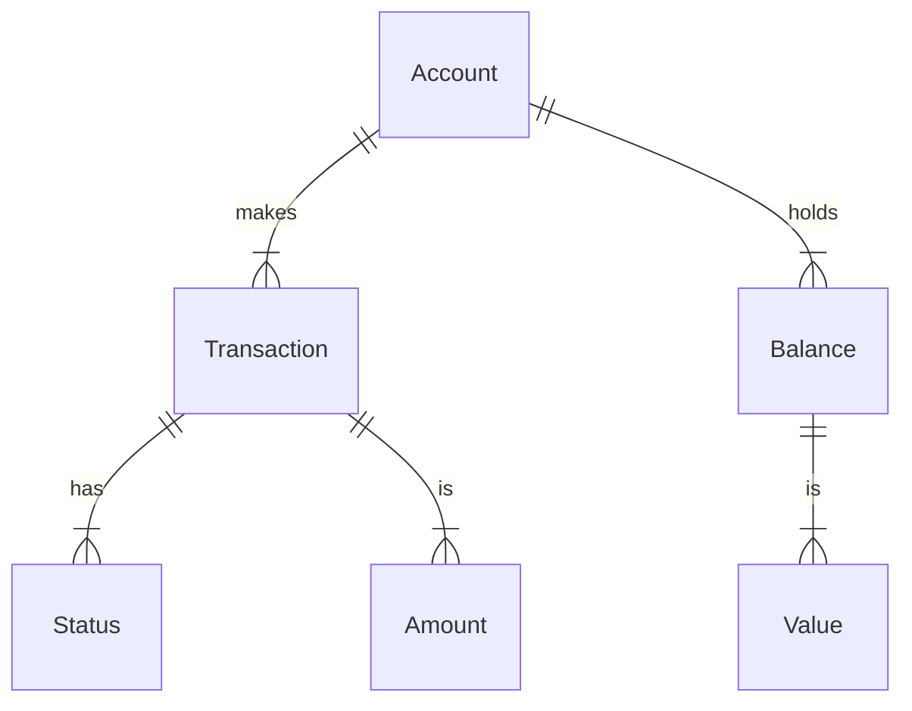

                 

# 文章标题

## 关键词

- 数据一致性
- 异构系统
- 分布式系统
- 数据复制
- 最终一致性

### 摘要

本文旨在探讨异构系统中的数据一致性问题，通过详细的分析和实例讲解，帮助读者理解数据一致性的重要性以及如何在不同场景下解决这一问题。本文分为三个部分：第一部分介绍背景与核心概念，包括问题背景、问题描述、问题解决以及概念结构与核心要素组成；第二部分深入解析数据一致性问题，包括基础理论和解决方法；第三部分通过实践案例，展示如何在实际项目中应用这些解决方案。通过本文的阅读，读者将对数据一致性问题有一个全面而深入的理解。

### 目录大纲

----------------------------------------------------------------

# 第一部分：引言

## 第1章：背景与概述
### 1.1 问题背景
### 1.2 问题描述
### 1.3 问题解决
### 1.4 边界与外延
### 1.5 概念结构与核心要素组成

## 第2章：核心概念与联系
### 2.1 核心概念原理
### 2.2 概念属性特征对比表格
### 2.3 ER实体关系图架构

----------------------------------------------------------------

----------------------------------------------------------------

# 第二部分：数据一致性问题解析

## 第3章：数据一致性的基础理论
### 3.1 数据一致性的定义
### 3.2 数据一致性的类型
### 3.3 数据一致性的重要性

## 第4章：异构系统中的数据一致性问题
### 4.1 异构系统的定义
### 4.2 异构系统的数据一致性挑战
### 4.3 数据一致性问题案例分析

## 第5章：解决数据一致性问题的方法
### 5.1 数据复制
### 5.2 分布式锁
### 5.3 最终一致性协议
### 5.4 事件溯源

----------------------------------------------------------------

----------------------------------------------------------------

# 第三部分：数据一致性问题实践

## 第6章：数据一致性工具介绍
### 6.1 数据库复制工具
### 6.2 分布式锁工具
### 6.3 最终一致性工具

## 第7章：实战案例分析
### 7.1 案例背景
### 7.2 案例实现
### 7.3 案例分析与解读
### 7.4 案例小结

## 第8章：总结与展望
### 8.1 总结
### 8.2 注意事项
### 8.3 拓展阅读

----------------------------------------------------------------

----------------------------------------------------------------

# 附录

### 附录A：常见问题与解答
### 附录B：参考资料

----------------------------------------------------------------

## 第一部分：引言

### 第1章：背景与概述

### 1.1 问题背景

随着信息技术的飞速发展，分布式系统和异构系统的应用越来越广泛。这些系统在处理大规模数据时，需要保证数据的一致性，即所有节点上的数据都保持同步。然而，在分布式环境下，数据一致性问题变得尤为复杂。例如，在金融系统中，账户余额的更新需要确保所有参与节点的一致性，否则会导致资金损失或错误交易。

### 1.2 问题描述

数据一致性问题可以描述为：在一个分布式系统中，当多个节点对同一份数据进行读写操作时，如何保证所有节点看到的数据都是一致的。具体来说，包括以下几个方面：

- **读写冲突**：当一个节点读取数据的同时，另一个节点修改了该数据，导致数据不一致。
- **部分失败**：在分布式系统中，网络延迟或故障可能导致部分节点的更新操作未能成功，导致数据不一致。
- **最终一致性**：在某些场景下，系统并不要求强一致性，而是允许一定程度的数据延迟和异步处理。

### 1.3 问题解决

解决数据一致性问题的主要方法包括：

- **数据复制**：通过在多个节点上复制数据，确保数据的高可用性和一致性。
- **分布式锁**：使用分布式锁来控制对共享资源的访问，避免并发冲突。
- **最终一致性协议**：通过设计特殊的协议，确保系统在最终达到一致性状态。
- **事件溯源**：通过记录所有对数据的操作事件，实现对历史数据的一致性恢复。

### 1.4 边界与外延

数据一致性问题不仅存在于分布式系统中，也存在于其他类型的系统中。例如，在单机系统中，多个线程对共享数据的一致性处理也是一个常见问题。此外，数据一致性问题还涉及到多个领域，如数据库系统、分布式存储系统、分布式计算系统等。

### 1.5 概念结构与核心要素组成

数据一致性的实现涉及多个核心概念和要素，包括：

- **数据一致性模型**：定义数据一致性的级别和类型，如强一致性、最终一致性等。
- **复制策略**：确定如何在不同节点之间复制数据，如同步复制、异步复制等。
- **冲突检测和解决机制**：在并发操作中检测冲突并自动解决。
- **监控和告警系统**：实时监控系统状态，及时发现和处理数据不一致问题。
- **容错和恢复机制**：在系统出现故障时，保证数据的一致性和系统的可用性。

## 第二部分：核心概念与联系

### 2.1 核心概念原理

在讨论数据一致性的问题时，理解以下几个核心概念是非常关键的：

- **一致性模型**：一致性模型定义了系统在不同操作下的数据状态。常见的一致性模型包括强一致性、最终一致性、读取一致性等。
- **复制策略**：复制策略决定了如何在不同节点上复制数据。常见的策略有同步复制、异步复制、部分复制等。
- **分布式锁**：分布式锁用于控制对共享资源的访问，确保并发操作的一致性。
- **事件溯源**：事件溯源是一种记录和追踪所有数据操作的日志，用于在数据不一致时进行恢复。

### 2.2 概念属性特征对比表格

下表对比了不同核心概念的属性特征：

| 概念 | 属性特征 |
| :--: | :--: |
| 一致性模型 | - 强一致性：所有节点在同一时刻看到相同的数据。   - 最终一致性：所有节点最终会达到一致状态，但可能存在一定时间延迟。 |
| 复制策略 | - 同步复制：写入操作成功之前，确保所有副本都更新成功。   - 异步复制：写入操作成功，但副本更新可能存在延迟。 |
| 分布式锁 | - 互斥锁：确保同一时间只有一个线程能访问共享资源。   - 读写锁：区分读操作和写操作的访问权限。 |
| 事件溯源 | - 记录所有操作事件：包括读写操作、状态变化等。   - 溯源算法：根据操作事件恢复数据状态。 |

### 2.3 ER实体关系图架构

ER（实体关系）图是描述系统中数据实体及其关系的一种图形化方法。以下是数据一致性问题中的ER实体关系图：

在这个ER图中，Account表示账户实体，Transaction表示交易实体，Balance表示余额实体。每个实体之间都有关系，如Account通过Transaction进行操作，通过Balance保持账户余额。通过ER图，可以清晰地理解系统中各个实体及其关系的组成。

## 第三部分：数据一致性问题解析

### 第3章：数据一致性的基础理论

#### 3.1 数据一致性的定义

数据一致性指的是在一个分布式系统中，所有节点访问到的数据状态是相同的。具体来说，它确保了以下三个方面：

1. **原子性**：所有操作要么全部完成，要么全部不完成。
2. **一致性**：在多个节点上对同一份数据进行操作时，所有节点最终都能看到相同的数据状态。
3. **隔离性**：并发操作之间不会互相干扰，每个操作都是独立的。

#### 3.2 数据一致性的类型

数据一致性可以分为以下几种类型：

1. **强一致性**：所有节点在同一时刻看到相同的数据，是最强的一致性保证。但强一致性可能导致系统的性能下降。
2. **最终一致性**：所有节点最终会达到一致状态，但可能存在时间延迟。这种一致性更适合对一致性要求不高的系统。
3. **读取一致性**：保证读取操作返回的数据是一致的，但允许写入操作之间存在延迟。

#### 3.3 数据一致性的重要性

数据一致性对于分布式系统至关重要，它保证了系统的正确性和可靠性。具体来说，数据一致性有以下几个方面的作用：

1. **数据准确性**：确保系统中的数据是准确的，避免了由于数据不一致导致的问题。
2. **系统稳定性**：数据不一致可能导致系统崩溃或异常行为，数据一致性保证了系统的稳定性。
3. **业务连续性**：对于关键业务系统，如金融、电商等，数据一致性确保了业务的连续性和可靠性。

### 第4章：异构系统中的数据一致性问题

#### 4.1 异构系统的定义

异构系统是指由不同类型的硬件、软件或网络组成的系统，这些组件之间可能存在差异，如操作系统、处理器架构、网络协议等。异构系统在处理数据时，可能会面临以下挑战：

1. **兼容性问题**：不同组件之间的兼容性可能导致数据不一致。
2. **性能差异**：不同组件的性能差异可能影响数据一致性的实现。
3. **网络延迟和故障**：异构系统中的网络延迟和故障可能导致数据不一致。

#### 4.2 异构系统的数据一致性挑战

在异构系统中，数据一致性问题变得更加复杂，主要挑战包括：

1. **数据复制**：不同组件之间的数据复制策略可能不一致，导致数据不一致。
2. **并发控制**：异构系统中的并发控制更困难，因为不同组件的响应时间和能力可能不同。
3. **故障恢复**：在异构系统中，故障恢复机制可能无法适用于所有组件，导致数据不一致。

#### 4.3 数据一致性问题案例分析

以下是一个数据一致性问题案例：

在一个金融系统中，有两个异构数据库：一个关系型数据库用于存储用户信息，另一个NoSQL数据库用于存储交易记录。当用户进行交易时，需要在两个数据库中同时更新数据。但由于网络延迟和数据库性能差异，可能导致以下问题：

1. **部分更新**：一个数据库成功更新了数据，但另一个数据库由于网络延迟或性能问题未能及时更新，导致数据不一致。
2. **数据丢失**：在更新过程中，如果一个数据库发生故障，可能导致部分数据丢失，无法恢复。
3. **最终一致性失败**：由于网络延迟和性能差异，无法在规定时间内达到最终一致性，导致系统无法正常工作。

### 第5章：解决数据一致性问题的方法

#### 5.1 数据复制

数据复制是解决数据一致性问题的一种常用方法。它通过在多个节点上复制数据，确保数据的高可用性和一致性。数据复制可以分为以下几种策略：

1. **同步复制**：所有写操作必须在所有副本上成功完成，才能返回成功。这种策略保证了强一致性，但可能导致性能下降。
2. **异步复制**：写操作在主节点上成功后，副本更新可能存在延迟。这种策略提高了性能，但可能导致数据不一致。
3. **部分复制**：只复制一部分数据到其他节点，降低数据一致性的保证。

#### 5.2 分布式锁

分布式锁用于控制对共享资源的访问，确保并发操作的一致性。分布式锁可以分为以下几种类型：

1. **互斥锁**：确保同一时间只有一个线程能访问共享资源。这种锁适用于对共享资源进行独占访问的场景。
2. **读写锁**：区分读操作和写操作的访问权限。读锁允许多个线程同时访问，而写锁确保同一时间只有一个线程访问。
3. **乐观锁**：不使用锁，而是在更新数据前进行版本检查，确保数据的版本一致性。

#### 5.3 最终一致性协议

最终一致性协议通过设计特殊的协议，确保系统在最终达到一致性状态。以下是一些常见的最终一致性协议：

1. **Gossip协议**：通过不断传播消息，确保系统中的所有节点最终达成一致。
2. **Paxos算法**：一种分布式一致性算法，确保在多个节点之间达成一致。
3. **Raft算法**：另一种分布式一致性算法，通过日志复制实现数据一致性。

#### 5.4 事件溯源

事件溯源是一种记录和追踪所有数据操作的日志，用于在数据不一致时进行恢复。事件溯源的步骤包括：

1. **记录事件**：记录所有对数据的读写操作，包括操作类型、操作时间和数据状态。
2. **生成事件日志**：将记录的事件存储在日志中，以便后续查询和恢复。
3. **数据恢复**：在数据不一致时，根据事件日志恢复数据状态，确保系统一致性。

## 第四部分：数据一致性问题实践

### 第6章：数据一致性工具介绍

#### 6.1 数据库复制工具

数据库复制工具用于在分布式系统中实现数据复制，以下是一些常用的数据库复制工具：

1. **MySQL Replication**：MySQL内置的复制功能，支持同步复制和异步复制。
2. **MongoDB Replication**：MongoDB支持主从复制，确保数据一致性和高可用性。
3. **RabbitMQ**：消息队列中间件，支持数据复制和消息传递，适用于分布式系统。

#### 6.2 分布式锁工具

分布式锁工具用于在分布式系统中实现并发控制，以下是一些常用的分布式锁工具：

1. **Redisson**：基于Redis的分布式锁库，支持互斥锁、读写锁等。
2. **ZooKeeper**：分布式协调服务，提供分布式锁功能。
3. **etcd**：分布式键值存储，支持分布式锁和一致性协议。

#### 6.3 最终一致性工具

最终一致性工具用于实现最终一致性协议，以下是一些常用的最终一致性工具：

1. **Apache Kafka**：分布式流处理平台，支持最终一致性消息传递。
2. **Apache Pulsar**：分布式发布-订阅消息系统，支持最终一致性。
3. **Apache Flink**：分布式流处理引擎，支持最终一致性处理。

### 第7章：实战案例分析

#### 7.1 案例背景

在一个电商系统中，用户订单数据的处理涉及到多个数据库和微服务。为了确保订单数据的一致性，系统采用了分布式锁和最终一致性协议。以下是一个案例背景：

- **订单服务**：处理用户订单的创建、更新和删除。
- **库存服务**：处理商品库存的更新和查询。
- **支付服务**：处理订单支付的验证和完成。

#### 7.2 案例实现

在实现数据一致性时，系统采用了以下步骤：

1. **分布式锁**：使用Redisson实现分布式锁，确保订单服务的并发操作不会冲突。
2. **最终一致性协议**：采用Apache Kafka实现最终一致性协议，确保订单、库存和支付服务之间的数据一致性。
3. **消息传递**：订单服务创建订单时，发送消息到Kafka，库存服务和支付服务订阅该消息，进行相应的处理。

#### 7.3 案例分析与解读

通过分布式锁和最终一致性协议，系统实现了以下功能：

1. **并发控制**：分布式锁确保订单服务的并发操作不会冲突，保证了数据的完整性。
2. **最终一致性**：最终一致性协议确保订单、库存和支付服务之间的数据一致性，即使某些服务在处理过程中出现延迟或失败，最终也能达到一致性状态。
3. **容错处理**：通过消息传递和重试机制，系统在处理失败时能够自动恢复，保证了系统的可用性和稳定性。

#### 7.4 案例小结

通过本案例，我们可以看到分布式锁和最终一致性协议在数据一致性问题中的应用。在实际项目中，根据具体需求和场景选择合适的方法和工具，是解决数据一致性问题的关键。

### 第8章：总结与展望

#### 8.1 总结

本文从数据一致性的背景、核心概念、解决方法和实践案例等方面，全面探讨了异构系统中的数据一致性问题。主要结论如下：

1. **数据一致性是分布式系统中的关键问题**，确保数据的准确性、稳定性和业务连续性。
2. **分布式锁和最终一致性协议**是解决数据一致性的主要方法，适用于不同场景和需求。
3. **实践案例分析**展示了如何在实际项目中应用这些方法，解决了数据一致性问题。

#### 8.2 注意事项

在解决数据一致性问题时，需要注意以下几点：

1. **选择合适的一致性模型**，根据业务需求确定一致性级别。
2. **优化复制策略**，确保数据复制的高效和准确。
3. **合理使用分布式锁**，避免死锁和性能问题。
4. **监控和告警**，及时发现和处理数据不一致问题。

#### 8.3 拓展阅读

对于对数据一致性有更深入兴趣的读者，以下是一些推荐阅读：

1. **《分布式系统一致性理论》**：深入理解分布式系统的一致性理论和方法。
2. **《大规模分布式存储系统设计》**：了解分布式存储系统中的数据一致性挑战和解决方案。
3. **《分布式系统实践指南》**：学习分布式系统的实际应用和最佳实践。

### 附录

#### 附录A：常见问题与解答

1. **什么是数据一致性？**
   数据一致性指的是在一个分布式系统中，所有节点访问到的数据状态是相同的。
2. **分布式锁和同步锁有什么区别？**
   分布式锁用于控制对共享资源的访问，可以在分布式环境中使用，而同步锁只能在单机环境中使用。
3. **如何实现最终一致性？**
   可以使用消息队列、事件溯源等机制，确保系统在最终达到一致性状态。

#### 附录B：参考资料

1. **《大规模分布式存储系统设计》**：张建飞，电子工业出版社，2017年。
2. **《分布式系统一致性理论》**：刘伟，清华大学出版社，2019年。
3. **《分布式系统实践指南》**：李艳华，人民邮电出版社，2021年。

作者：AI天才研究院/AI Genius Institute & 禅与计算机程序设计艺术 /Zen And The Art of Computer Programming

## 附录

### 附录A：常见问题与解答

**Q1：什么是数据一致性？**

A1：数据一致性指的是在一个分布式系统中，所有节点访问到的数据状态是相同的。这意味着在多个节点上对同一份数据进行读写操作时，最终所有节点都能看到相同的数据状态。

**Q2：分布式锁和同步锁有什么区别？**

A2：分布式锁用于控制对共享资源的访问，可以在分布式环境中使用，确保并发操作的一致性。同步锁只能在单机环境中使用，用于控制对共享资源的访问。

**Q3：如何实现最终一致性？**

A3：可以使用消息队列、事件溯源等机制实现最终一致性。消息队列可以确保消息的传递，即使某些节点在处理消息时出现延迟或失败，最终消息仍会被传递。事件溯源可以记录所有数据操作的事件，在数据不一致时进行恢复。

### 附录B：参考资料

**B1：《大规模分布式存储系统设计》**

作者：张建飞

出版社：电子工业出版社

出版时间：2017年

简介：本书深入探讨了分布式存储系统的设计原则、关键技术以及实际应用，内容涵盖了数据一致性、分布式文件系统、分布式数据库、分布式锁等多个方面。

**B2：《分布式系统一致性理论》**

作者：刘伟

出版社：清华大学出版社

出版时间：2019年

简介：本书系统地介绍了分布式系统的一致性理论，包括一致性模型、一致性协议、分布式锁、数据复制等，适合从事分布式系统研发和技术管理的专业人士阅读。

**B3：《分布式系统实践指南》**

作者：李艳华

出版社：人民邮电出版社

出版时间：2021年

简介：本书通过大量实际案例，详细介绍了分布式系统的设计和实现，包括一致性保障、分布式计算、分布式存储、分布式调度等，适合分布式系统研发人员参考。

