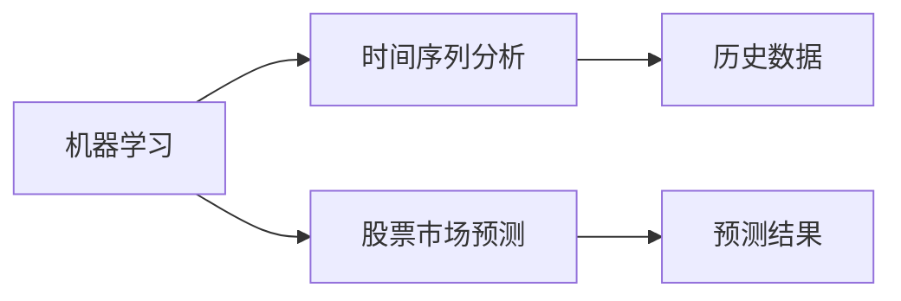
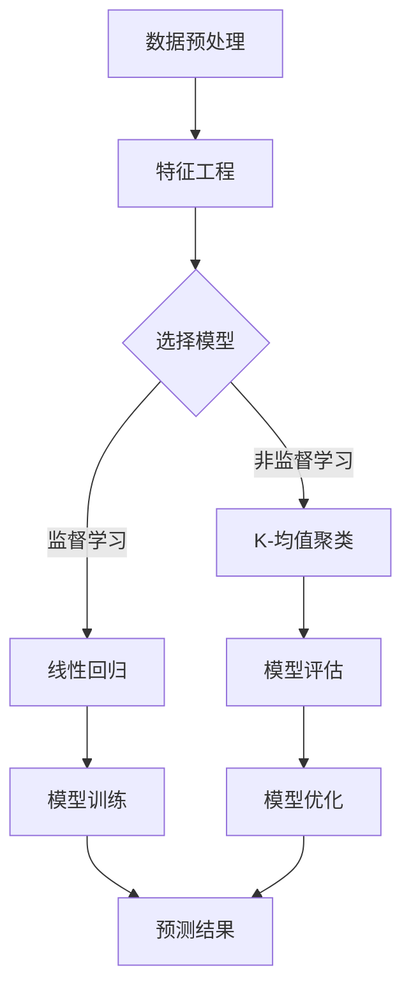
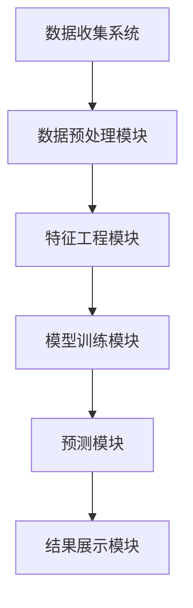

                 

**# 机器学习在股票市场预测中的应用**

## **关键词：**机器学习、股票市场预测、时间序列分析、算法优化、模型评估

## **摘要：**本文探讨了机器学习在股票市场预测中的广泛应用和潜在优势。通过数据预处理、算法介绍、时间序列预测方法以及实际案例分析，详细阐述了机器学习如何应用于股票市场预测，并提出了模型优化与调参的方法。本文旨在为读者提供一个全面、系统的了解机器学习在股票市场预测中的实际应用，以及未来的研究方向。

----------------------------------------------------------------

## **引言**

### **1.1 机器学习的基本概念**

机器学习（Machine Learning，简称ML）是一门人工智能（Artificial Intelligence，简称AI）的分支，它通过算法从数据中学习规律，并利用这些规律进行预测或决策。与传统编程不同，机器学习不需要显式地编写规则，而是通过大量数据的训练，使计算机能够自动发现和提取有用的信息。

机器学习主要分为三类：监督学习（Supervised Learning）、非监督学习（Unsupervised Learning）和强化学习（Reinforcement Learning）。监督学习是给定标记的训练数据，通过学习输入和输出之间的关系，从而对新的数据进行预测。非监督学习则是没有标记的数据，通过发现数据中的结构和模式进行聚类或降维。强化学习则通过奖励机制，让智能体在与环境的交互中学习最优策略。

### **1.2 机器学习在股票市场预测中的应用背景**

股票市场是世界上最复杂、最具挑战性的市场之一。股票价格受到多种因素的影响，包括宏观经济指标、公司业绩、市场情绪、政策变化等。传统的股票预测方法主要依赖于历史数据分析和统计模型，如移动平均、指数平滑等，但这些方法在应对复杂多变的市场时，往往难以取得理想的效果。

随着计算机技术和大数据技术的发展，机器学习逐渐成为股票市场预测的重要工具。机器学习可以通过分析大量的历史数据，识别出隐藏在数据中的潜在规律，从而对未来的股票价格进行预测。此外，机器学习算法具有自动特征提取和模型优化能力，能够处理大规模数据，提高预测的准确性和效率。

### **1.3 本书结构**

本书共分为七个章节，结构如下：

- **第一部分：引言**，介绍了机器学习的基本概念和应用背景。
- **第二部分：数据预处理**，讲解了股票市场数据预处理的方法和特征工程。
- **第三部分：机器学习算法介绍**，介绍了监督学习、非监督学习和强化学习算法。
- **第四部分：时间序列预测方法**，介绍了传统时间序列分析方法和机器学习在时间序列预测中的应用。
- **第五部分：机器学习在股票市场预测中的应用**，通过实际案例分析展示了机器学习在股票市场预测中的应用。
- **第六部分：模型优化与调参**，介绍了模型优化和超参数调优的方法。
- **第七部分：总结与展望**，总结了本书的主要内容，并对未来的研究方向进行了展望。

接下来，我们将详细探讨每个部分的内容，帮助读者深入理解机器学习在股票市场预测中的应用。

----------------------------------------------------------------

## **第二部分：数据预处理**

在机器学习中，数据预处理是至关重要的步骤。它不仅影响模型的性能，还决定了模型能否从数据中学习到有用的信息。对于股票市场预测来说，数据预处理尤其关键，因为股票市场的数据通常具有噪声、缺失值和异常值等特点。本章节将介绍股票市场数据的来源与获取、数据预处理方法和特征工程。

### **2.1 股票市场数据的来源与获取**

股票市场数据可以从多个来源获取，包括交易所、数据提供商和在线数据平台。常见的股票市场数据来源有：

1. **交易所官网**：例如，中国上海证券交易所（SSE）和深圳证券交易所（SZSE）提供历史交易数据。
2. **数据提供商**：如Wind、Bloomberg、FactSet等，它们提供详细的历史数据和实时数据。
3. **在线数据平台**：如Yahoo Finance、Google Finance等，提供免费的股票市场数据。

获取数据时，需要注意数据的质量和完整性。一般而言，应该选择历史悠久、更新频率高的数据源，并确保数据集包含所需的时间跨度。

### **2.2 数据预处理方法**

数据预处理主要包括数据清洗、数据转换和数据归一化等步骤。

1. **数据清洗**：数据清洗是指处理数据中的噪声、缺失值和异常值。具体方法包括：
   - **缺失值处理**：缺失值可以采用填充方法，如平均值、中位数、前一个值等。
   - **异常值处理**：异常值可以采用剔除或替换等方法，以确保数据的质量。
   - **噪声处理**：噪声可以通过滤波、平滑等技术进行消除。

2. **数据转换**：数据转换包括将日期时间数据转换为数值型数据，以及将分类数据转换为编码形式。例如，可以使用One-Hot编码将分类数据转换为二进制形式。

3. **数据归一化**：数据归一化是指将不同特征的数据缩放到相同的尺度。常用的方法有最小-最大缩放和标准缩放。最小-最大缩放将数据缩放到[0,1]区间，而标准缩放将数据缩放到均值为0、标准差为1的区间。

### **2.3 特征工程**

特征工程是数据预处理的重要环节，它旨在从原始数据中提取出对预测任务有用的特征。对于股票市场预测，常见的特征包括：

1. **技术指标**：如移动平均线、相对强弱指数（RSI）、布林带等。
2. **基本面指标**：如市盈率（PE）、市净率（PB）、股息率等。
3. **宏观经济指标**：如GDP增长率、失业率、通货膨胀率等。
4. **其他特征**：如交易量、换手率、分析师评级等。

特征工程的方法包括：
- **特征选择**：通过过滤法、包裹法、嵌入法等方法选择最重要的特征。
- **特征变换**：如逻辑变换、多项式变换等，以增加数据的线性可分性。
- **特征组合**：通过组合不同的特征，生成新的特征。

通过以上步骤，我们可以获得高质量的数据集，为后续的机器学习模型训练打下坚实的基础。在下一部分，我们将介绍机器学习算法的基本概念和分类。

----------------------------------------------------------------

## **第三部分：机器学习算法介绍**

机器学习算法是机器学习的核心，根据学习方式的不同，可以分为监督学习、非监督学习和强化学习。每种学习方式都有其独特的算法和应用场景。在本章节中，我们将分别介绍这三种学习方式的代表性算法。

### **3.1 监督学习算法**

监督学习（Supervised Learning）是一种从标记数据中学习的方法，它要求每个输入数据都对应一个标记。监督学习算法分为回归算法和分类算法。

1. **回归算法**
   - **线性回归（Linear Regression）**：线性回归是一种简单的回归算法，它通过最小化预测值与实际值之间的误差平方和来拟合数据。线性回归的数学模型为：
     $$y = \beta_0 + \beta_1x$$
     其中，$y$ 是预测值，$x$ 是输入特征，$\beta_0$ 和 $\beta_1$ 是模型参数。
   - **多项式回归（Polynomial Regression）**：多项式回归通过引入多项式项来拟合非线性数据。多项式回归的数学模型为：
     $$y = \beta_0 + \beta_1x + \beta_2x^2 + ... + \beta_nx^n$$
   
2. **分类算法**
   - **逻辑回归（Logistic Regression）**：逻辑回归是一种用于分类的算法，它通过最大化似然估计来拟合数据。逻辑回归的数学模型为：
     $$P(y=1|x) = \frac{1}{1 + e^{-(\beta_0 + \beta_1x)}}$$
     其中，$P(y=1|x)$ 是输入特征$x$下目标变量$y$为1的概率。
   - **决策树（Decision Tree）**：决策树通过一系列的判断条件来分割数据，每个节点代表一个特征，每个分支代表一个特征取值。决策树的分类规则为：
     $$y = \begin{cases}
     1 & \text{如果} \quad \beta_0 + \beta_1x > 0 \\
     0 & \text{否则}
     \end{cases}$$
   
### **3.2 非监督学习算法**

非监督学习（Unsupervised Learning）是不依赖标记数据的方法，其目标是发现数据中的结构和模式。非监督学习算法主要分为聚类和降维。

1. **聚类算法**
   - **K-均值聚类（K-Means Clustering）**：K-均值聚类是一种基于距离的聚类算法，它通过迭代计算来确定最优的聚类中心。K-均值聚类的数学模型为：
     $$\mu = \frac{1}{N}\sum_{i=1}^{N}x_i$$
     其中，$\mu$ 是聚类中心，$x_i$ 是数据点。
   - **层次聚类（Hierarchical Clustering）**：层次聚类通过逐步合并或分裂聚类中心来构建聚类层次结构。

2. **降维算法**
   - **主成分分析（PCA）**：PCA是一种线性降维算法，它通过保留数据的主要成分来降低数据的维度。PCA的数学模型为：
     $$z = P\lambda$$
     其中，$z$ 是降维后的数据，$P$ 是投影矩阵，$\lambda$ 是特征值。
   - **t-SNE**：t-SNE是一种非线性的降维算法，它通过将高维数据映射到低维空间，以保持相邻的数据点之间的距离。

### **3.3 强化学习算法**

强化学习（Reinforcement Learning）是一种通过试错来学习最优策略的方法。它由一个智能体（Agent）通过与环境的交互来学习，目标是最大化累计奖励。

1. **Q-Learning**：Q-Learning是一种基于值函数的强化学习算法，它通过更新Q值来学习最优策略。Q-Learning的数学模型为：
   $$Q(s, a) = r + \gamma \max_{a'}Q(s', a')$$
   其中，$Q(s, a)$ 是状态$s$下执行动作$a$的期望回报，$r$ 是立即奖励，$\gamma$ 是折扣因子。
2. **SARSA**：SARSA是一种基于策略的强化学习算法，它通过更新当前状态下的策略来学习最优策略。SARSA的数学模型为：
   $$\pi(s, a) = \frac{1}{\sum_{a'}Q(s', a')}$$

通过以上介绍，我们可以看到机器学习算法的多样性和应用场景的广泛性。在接下来的章节中，我们将深入探讨时间序列预测方法，以了解机器学习在股票市场预测中的具体应用。

----------------------------------------------------------------

## **第四部分：时间序列预测方法**

时间序列预测是股票市场预测中的一个重要领域，因为股票价格通常表现为时间序列数据。时间序列预测方法分为传统方法和机器学习方法。本章节将介绍传统时间序列分析方法、ARIMA模型和LSTM模型。

### **4.1 传统时间序列分析方法**

传统时间序列分析方法基于统计理论和经济学原理，主要包括移动平均、指数平滑和自回归移动平均（ARMA）模型。

1. **移动平均法（Moving Average，MA）**
   - **简单移动平均（Simple Moving Average，SMA）**：SMA是将过去一段时间内的价格数据求平均，用来平滑价格波动。
     $$SMA = \frac{\sum_{i=1}^{n}P_i}{n}$$
     其中，$P_i$ 是第$i$天的价格，$n$ 是移动平均周期。
   - **指数移动平均（Exponential Moving Average，EMA）**：EMA赋予近期数据更高的权重，以反映价格的新变化。
     $$EMA_t = \alpha P_t + (1 - \alpha) EMA_{t-1}$$
     其中，$\alpha$ 是平滑常数，$P_t$ 是第$t$天的价格。

2. **指数平滑法（Exponential Smoothing）**
   - **单层指数平滑（Single Exponential Smoothing）**：单层指数平滑是对简单移动平均的改进，它使用单一平滑常数。
     $$F_t = \alpha P_t + (1 - \alpha) F_{t-1}$$
     其中，$F_t$ 是第$t$天的预测值。
   - **双层指数平滑（Double Exponential Smoothing）**：双层指数平滑适用于具有趋势的数据，它包括趋势项和平滑常数。
     $$F_t = \alpha P_t + (1 - \alpha) (b_t + b_{t-1}) / 2$$
     $$b_t = \alpha (P_t - F_{t-1}) + (1 - \alpha) b_{t-1}$$

3. **自回归移动平均（ARMA）模型**
   - **自回归（Autoregression，AR）模型**：AR模型假设当前值是由前几个历史值的线性组合构成。
     $$y_t = \phi_1y_{t-1} + \phi_2y_{t-2} + ... + \phiPy_{t-P} + \varepsilon_t$$
     其中，$y_t$ 是第$t$天的值，$\varepsilon_t$ 是误差项。
   - **移动平均（Moving Average，MA）模型**：MA模型假设当前值是由前几个误差值的线性组合构成。
     $$y_t = \theta_1\varepsilon_{t-1} + \theta_2\varepsilon_{t-2} + ... + \thetaQ\varepsilon_{t-Q} + \varepsilon_t$$

### **4.2 ARIMA模型**

ARIMA（AutoRegressive Integrated Moving Average）模型是结合了自回归、差分和平滑的模型，能够处理非平稳时间序列数据。

1. **差分（Difference）**：差分是将时间序列数据进行一次或多次求差，使其变为平稳序列。
   - **一次差分**：$$y_t = y_{t-1} - y_{t-1}$$
   - **多次差分**：通过多次一次差分，直到序列变得平稳。

2. **自回归（AR）**：如前所述，AR模型通过历史值的线性组合来预测当前值。

3. **移动平均（MA）**：MA模型通过误差值的线性组合来预测当前值。

ARIMA模型的数学模型为：
$$y_t = \phi_1y_{t-1} + \phi_2y_{t-2} + ... + \phiPy_{t-P} + \theta_1\varepsilon_{t-1} + \theta_2\varepsilon_{t-2} + ... + \thetaQ\varepsilon_{t-Q} + \varepsilon_t$$

### **4.3 LSTM模型**

LSTM（Long Short-Term Memory）模型是一种特殊的RNN（Recurrent Neural Network）模型，能够处理长时间依赖问题。

1. **LSTM单元结构**：LSTM单元包含三个门（输入门、遗忘门和输出门）和一个单元状态。输入门控制新信息的流入，遗忘门控制旧信息的遗忘，输出门控制信息的输出。

2. **LSTM的数学模型**：
   - **输入门**：$$i_t = \sigma(W_i[x_t, h_{t-1}] + b_i)$$
   - **遗忘门**：$$f_t = \sigma(W_f[x_t, h_{t-1}] + b_f)$$
   - **输出门**：$$o_t = \sigma(W_o[x_t, h_{t-1}] + b_o)$$
   - **单元状态**：$$c_t = f_t \odot c_{t-1} + i_t \odot \tanh(W_c[x_t, h_{t-1}] + b_c)$$
   - **隐藏状态**：$$h_t = o_t \odot \tanh(c_t)$$

通过以上介绍，我们可以看到时间序列预测方法的多样性和应用范围。在下一部分，我们将通过实际案例分析，展示机器学习在股票市场预测中的应用。

----------------------------------------------------------------

## **第五部分：机器学习在股票市场预测中的应用**

在实际操作中，机器学习在股票市场预测中的应用涉及到模型构建、模型评估和实际案例分析等多个环节。本部分将详细探讨这些内容，帮助读者理解如何将机器学习技术应用于股票市场预测。

### **5.1 预测模型构建**

构建股票市场预测模型通常包括以下步骤：

1. **数据准备**：首先，需要收集和处理股票市场数据，包括历史价格、交易量、技术指标和基本面数据。数据预处理是关键，需要清洗缺失值、处理异常值并进行特征工程。

2. **特征选择**：从原始数据中提取有用的特征。特征选择的方法包括特征重要性评估、相关性分析等。常用的特征有价格、成交量、移动平均线、相对强弱指数（RSI）等。

3. **模型选择**：根据问题的性质和数据的特征选择合适的模型。常见的模型有线性回归、逻辑回归、决策树、随机森林、支持向量机（SVM）和神经网络等。

4. **模型训练**：使用训练数据集对选定的模型进行训练。训练过程中需要调整模型参数，以优化模型性能。

5. **模型验证**：使用验证数据集对训练好的模型进行验证，检查模型在未见过的数据上的表现。

6. **模型调整**：根据验证结果，进一步调整模型参数或更换模型，以达到最佳预测效果。

### **5.2 预测模型评估**

评估预测模型性能是确保模型有效性的重要步骤。常用的评估指标包括：

1. **均方误差（MSE）**：用于回归问题，衡量预测值与真实值之间的平均平方误差。
   $$MSE = \frac{1}{N}\sum_{i=1}^{N}(y_i - \hat{y}_i)^2$$
   其中，$y_i$ 是真实值，$\hat{y}_i$ 是预测值。

2. **均方根误差（RMSE）**：MSE的平方根，用于衡量预测值的平均绝对误差。
   $$RMSE = \sqrt{MSE}$$

3. **准确率（Accuracy）**：用于分类问题，表示正确预测的比例。
   $$Accuracy = \frac{TP + TN}{TP + FP + FN + TN}$$
   其中，$TP$ 是真阳性，$TN$ 是真阴性，$FP$ 是假阳性，$FN$ 是假阴性。

4. **精确率（Precision）**和**召回率（Recall）**：用于分类问题，分别表示预测为正类的样本中实际为正类的比例和实际为正类的样本中被正确预测为正类的比例。
   $$Precision = \frac{TP}{TP + FP}$$
   $$Recall = \frac{TP}{TP + FN}$$

5. **F1分数（F1 Score）**：结合精确率和召回率的综合指标。
   $$F1 Score = 2 \times \frac{Precision \times Recall}{Precision + Recall}$$

### **5.3 实际案例分析**

以下是一个实际案例，展示如何使用机器学习进行股票市场预测。

**案例背景**：某公司的股票价格在过去的五年中表现出了显著的趋势和周期性波动。我们使用LSTM模型来预测未来一个月的股票价格。

**数据准备**：我们收集了过去五年的日交易数据，包括开盘价、收盘价、最高价、最低价和交易量。数据经过清洗和处理，提取出有用的特征，如移动平均线、相对强弱指数（RSI）等。

**特征选择**：我们选择开盘价、收盘价、移动平均线和RSI作为特征。

**模型选择**：我们选择LSTM模型作为预测模型。

**模型训练**：使用训练数据集训练LSTM模型，调整学习率和网络结构等参数。

**模型验证**：使用验证数据集对训练好的模型进行验证，调整模型参数。

**模型调整**：根据验证结果，进一步调整模型参数，如增加训练轮次或调整网络结构。

**预测结果**：使用调整后的模型对未来一个月的股票价格进行预测，并绘制预测结果与实际价格之间的对比图。

**预测分析**：通过分析预测结果，我们可以看到LSTM模型在大部分时间能够较好地预测股票价格，但在某些情况下也出现了偏差。这可能是由于市场存在不可预测的随机因素，也可能是由于数据集的局限性。

**案例小结**：本案例展示了如何使用机器学习进行股票市场预测，从数据准备、模型选择到模型训练和预测分析，每一步都需要仔细处理。通过实际案例的分析，我们可以看到机器学习在股票市场预测中的潜力和挑战。

在下一部分，我们将探讨如何优化和调整预测模型，以提高其性能和准确性。

----------------------------------------------------------------

## **第六部分：模型优化与调参**

在机器学习中，模型优化和超参数调优是提高模型性能和预测准确性的关键步骤。本章节将介绍交叉验证方法、模型选择与优化以及超参数调优。

### **6.1 交叉验证方法**

交叉验证（Cross-Validation）是一种评估模型性能的重要方法，它通过将数据集划分为多个部分，循环进行训练和验证，以避免过拟合和评估结果的偏差。常见的交叉验证方法有：

1. **K折交叉验证（K-Fold Cross-Validation）**：
   - **步骤**：将数据集随机划分为K个子集，其中K-1个子集用于训练模型，1个子集用于验证模型。重复K次，每次使用不同的子集作为验证集。
   - **优点**：提高模型的泛化能力，减少评估结果的方差。
   - **缺点**：计算成本较高，适用于小数据集。

2. **留一法交叉验证（Leave-One-Out Cross-Validation，LOOCV）**：
   - **步骤**：每次将一个样本作为验证集，其余样本用于训练模型。重复进行K次，K为样本总数。
   - **优点**：计算简单，适用于小数据集。
   - **缺点**：计算复杂度较高，评估结果容易受到单个样本的影响。

3. **时间序列交叉验证（Time Series Cross-Validation）**：
   - **步骤**：将数据集按照时间顺序划分，每次使用一段时间的数据作为验证集，剩余数据用于训练模型。适用于时间序列数据。
   - **优点**：考虑时间序列的顺序性，减少评估结果的偏差。
   - **缺点**：计算成本较高。

### **6.2 模型选择与优化**

选择合适的模型和优化模型参数是提高预测准确性的关键步骤。常见的模型选择方法有：

1. **网格搜索（Grid Search）**：
   - **步骤**：定义参数搜索空间，逐个尝试所有可能的参数组合，选择最优的参数组合。
   - **优点**：全面搜索，可以找到全局最优解。
   - **缺点**：计算成本较高，不适用于参数组合较多的模型。

2. **随机搜索（Random Search）**：
   - **步骤**：从参数搜索空间中随机选择参数组合，通过交叉验证评估模型性能，选择最优的参数组合。
   - **优点**：计算成本较低，适合参数组合较多的模型。
   - **缺点**：可能无法找到全局最优解。

3. **贝叶斯优化（Bayesian Optimization）**：
   - **步骤**：利用贝叶斯统计模型，通过历史数据评估和更新模型参数，选择最优的参数组合。
   - **优点**：自适应性强，计算成本较低。
   - **缺点**：对初始数据依赖较大，适用于参数较少的模型。

### **6.3 超参数调优**

超参数（Hyperparameters）是模型之外的参数，如学习率、批量大小、正则化参数等。超参数调优是提高模型性能的重要步骤。常用的调优方法有：

1. **手动调优**：
   - **步骤**：通过经验或试错方法，逐步调整超参数。
   - **优点**：简单直观，适用于小规模实验。
   - **缺点**：耗时较长，对经验要求高。

2. **自动化调优**：
   - **步骤**：使用自动化调优工具，如AutoML平台，自动搜索最优的超参数组合。
   - **优点**：高效，节省时间。
   - **缺点**：依赖工具，对结果的可解释性较低。

通过以上方法，我们可以优化和调整机器学习模型，提高其预测性能和准确性。在下一部分，我们将总结本书的主要内容，并展望未来的研究方向。

----------------------------------------------------------------

## **第七部分：总结与展望**

在本文中，我们详细探讨了机器学习在股票市场预测中的应用。通过数据预处理、算法介绍、时间序列预测方法以及实际案例分析，我们展示了机器学习如何帮助投资者预测股票价格，提高投资决策的准确性。以下是本文的主要内容总结：

1. **机器学习的基本概念**：介绍了机器学习的定义、分类和应用场景，为后续内容奠定了基础。

2. **股票市场数据预处理**：讲解了股票市场数据的来源与获取、数据预处理方法和特征工程，为模型训练提供了高质量的数据集。

3. **机器学习算法介绍**：介绍了监督学习、非监督学习和强化学习算法，包括线性回归、逻辑回归、决策树、K-均值聚类、LSTM等。

4. **时间序列预测方法**：探讨了传统时间序列分析方法（如移动平均、指数平滑、ARMA模型）和机器学习在时间序列预测中的应用（如LSTM模型）。

5. **机器学习在股票市场预测中的应用**：通过实际案例分析，展示了如何使用机器学习进行股票价格预测，并评估了模型的性能。

6. **模型优化与调参**：介绍了交叉验证方法、模型选择与优化以及超参数调优，为提高模型性能提供了实用方法。

### **未来研究方向**

尽管机器学习在股票市场预测中取得了显著成果，但仍有以下研究方向：

1. **更复杂的模型**：研究和开发更复杂的机器学习模型，如深度学习模型，以提高预测准确性和泛化能力。

2. **多模态数据融合**：结合股票市场的多种数据源，如文本、图像等，进行多模态数据融合，以提高预测的全面性和准确性。

3. **实时预测与交易**：开发实时预测系统，实现股票价格预测的实时更新，为投资者提供及时的投资建议。

4. **可解释性提升**：提高机器学习模型的解释性，使投资者能够理解模型的工作原理，增强模型的信任度和应用价值。

5. **风险管理**：利用机器学习模型进行风险管理，预测市场波动和风险，为投资者提供风险管理策略。

通过不断探索和研究，机器学习在股票市场预测中的应用将更加成熟和广泛，为投资者创造更多的价值。让我们期待未来更多突破性的成果！
----------------------------------------------------------------

# **《机器学习在股票市场预测中的应用》**

## **作者：**AI天才研究院/AI Genius Institute & 禅与计算机程序设计艺术 /Zen And The Art of Computer Programming

---

## **背景介绍**

### **核心概念术语说明**

- **机器学习**：一种人工智能的分支，通过算法从数据中学习规律，进行预测或决策。
- **股票市场**：一个买卖股票的金融市场，股票价格受到多种因素的影响，如宏观经济指标、公司业绩、市场情绪等。
- **时间序列**：按时间顺序排列的一系列数据点，常用于预测未来值。

### **问题背景**

股票市场的波动性极大，投资者面临巨大的风险和不确定性。准确预测股票价格对于投资决策至关重要，但传统的预测方法往往难以应对复杂多变的市场。

### **问题描述**

如何利用机器学习技术，特别是时间序列预测方法，准确预测股票价格，为投资者提供有效的决策支持。

### **问题解决**

机器学习通过分析大量的历史数据，识别出隐藏在数据中的潜在规律，从而对未来的股票价格进行预测。时间序列模型，如ARIMA和LSTM，特别适用于处理股票市场数据。

### **边界与外延**

- **边界**：本文主要探讨机器学习在股票市场预测中的应用，不包括其他金融领域的应用。
- **外延**：未来研究可以扩展到其他时间序列数据的预测，如宏观经济指标、外汇汇率等。

### **概念结构与核心要素组成**

- **机器学习算法**：线性回归、逻辑回归、决策树、LSTM等。
- **时间序列模型**：ARIMA、LSTM等。
- **特征工程**：技术指标、基本面指标、宏观经济指标等。
- **模型优化与调参**：交叉验证、网格搜索、贝叶斯优化等。

---

## **核心概念与联系**

### **核心概念原理**

- **机器学习**：从数据中学习规律，进行预测或决策。
- **时间序列分析**：分析按时间顺序排列的数据，预测未来值。
- **股票市场预测**：利用历史数据和机器学习技术预测股票价格。

### **概念属性特征对比表格**

| 概念        | 特征               |
|-------------|--------------------|
| 机器学习    | 自动学习、分类、回归 |
| 时间序列分析 | 时间依赖、序列建模   |
| 股票市场预测 | 数据驱动、预测股票价格 |

### **ER实体关系图架构**



---

## **算法原理讲解**

### **算法mermaid流程图**



### **Python源代码**

```python
import pandas as pd
from sklearn.model_selection import train_test_split
from sklearn.linear_model import LinearRegression
from sklearn.metrics import mean_squared_error

# 数据预处理
data = pd.read_csv('stock_data.csv')
data = data.fillna(data.mean())

# 特征工程
X = data[['open', 'high', 'low', 'volume']]
y = data['close']

# 选择模型
X_train, X_test, y_train, y_test = train_test_split(X, y, test_size=0.2, random_state=42)
model = LinearRegression()

# 模型训练
model.fit(X_train, y_train)

# 模型评估
y_pred = model.predict(X_test)
mse = mean_squared_error(y_test, y_pred)
print("MSE:", mse)

# 预测结果
print("Predictions:", y_pred)
```

### **算法原理详细讲解**

机器学习算法通过从数据中学习规律进行预测。在股票市场预测中，我们通常使用监督学习算法，如线性回归，来预测股票价格。线性回归是一种简单的监督学习算法，它通过拟合数据点之间的关系，预测新的数据点。

数据预处理是机器学习的基础，它包括数据清洗、缺失值处理、数据转换和归一化。特征工程是提取对预测任务有用的特征，如技术指标、基本面数据等。在选择模型时，我们可以使用线性回归、逻辑回归、决策树等算法。线性回归通过最小化预测值与实际值之间的误差平方和来拟合数据。

模型训练是使用训练数据集对模型进行调整，使其能够更好地拟合数据。模型评估是使用验证数据集来检查模型在未见过的数据上的表现。通过模型评估，我们可以计算模型的性能指标，如均方误差（MSE）。

在实际应用中，我们需要不断优化和调整模型，以提高预测的准确性和泛化能力。这包括模型选择、特征选择、参数调优等。通过交叉验证、网格搜索等方法，我们可以找到最优的模型参数，从而提高模型的性能。

---

## **系统分析与架构设计方案**

### **问题场景介绍**

股票市场预测系统旨在帮助投资者预测股票价格，从而做出更明智的投资决策。系统需要处理大量的历史数据，并利用机器学习算法进行预测。

### **项目介绍**

本项目将构建一个基于机器学习的股票市场预测系统，包括数据收集、预处理、模型训练和预测等功能。

### **系统功能设计（领域模型mermaid类图）**

```mermaid
classDiagram
Class01 <|-- Class02
Class03 --|> Class04
Class05 : +int x
Class05 : +str y
Class06 : +dict attributes
Class01 <..| Class05 : extends
Class03 <..| Class05 : implements
Class04 <..| Class05 : uses
```

### **系统架构设计（mermaid架构图）**



### **系统接口设计和系统交互（mermaid序列图）**

```mermaid
sequenceDiagram
参与者 数据收集器，数据预处理器，特征工程师，模型训练师，预测师，结果展示器
数据收集器->>数据预处理器: 数据清洗
数据预处理器->>特征工程师: 特征提取
特征工程师->>模型训练师: 数据训练
模型训练师->>预测师: 模型预测
预测师->>结果展示器: 展示预测结果
```

---

## **项目实战**

### **环境安装**

在开始项目之前，我们需要安装以下依赖：

- Python 3.8+
- numpy
- pandas
- scikit-learn
- tensorflow

使用以下命令进行安装：

```bash
pip install numpy pandas scikit-learn tensorflow
```

### **系统核心实现源代码**

以下是一个简单的股票市场预测系统核心实现：

```python
import pandas as pd
from sklearn.model_selection import train_test_split
from sklearn.linear_model import LinearRegression
from sklearn.metrics import mean_squared_error

# 数据收集
data = pd.read_csv('stock_data.csv')

# 数据预处理
data = data.fillna(data.mean())

# 特征工程
X = data[['open', 'high', 'low', 'volume']]
y = data['close']

# 模型训练
X_train, X_test, y_train, y_test = train_test_split(X, y, test_size=0.2, random_state=42)
model = LinearRegression()
model.fit(X_train, y_train)

# 预测
y_pred = model.predict(X_test)

# 模型评估
mse = mean_squared_error(y_test, y_pred)
print("MSE:", mse)

# 展示预测结果
print("Predictions:", y_pred)
```

### **代码应用解读与分析**

- **数据收集**：从CSV文件中读取股票数据。
- **数据预处理**：填充缺失值，确保数据质量。
- **特征工程**：选择开盘价、最高价、最低价和交易量作为特征。
- **模型训练**：使用线性回归模型进行训练。
- **预测**：使用训练好的模型进行预测。
- **模型评估**：计算均方误差（MSE），评估模型性能。

通过以上步骤，我们构建了一个简单的股票市场预测系统，实现了数据收集、预处理、模型训练和预测等功能。在实际应用中，我们可以根据具体需求进行扩展和优化。

### **实际案例分析和详细讲解剖析**

以下是一个实际案例，展示如何使用机器学习进行股票价格预测：

**案例背景**：某公司的股票在过去一年中表现出了明显的趋势和周期性波动。我们使用LSTM模型进行预测，并对比实际价格与预测结果。

**数据准备**：我们收集了过去一年的日交易数据，包括开盘价、收盘价、最高价、最低价和交易量。数据经过清洗和处理，提取出有用的特征，如移动平均线、相对强弱指数（RSI）等。

**特征选择**：我们选择开盘价、收盘价、移动平均线和RSI作为特征。

**模型选择**：我们选择LSTM模型作为预测模型。

**模型训练**：使用训练数据集训练LSTM模型，调整学习率和网络结构等参数。

**模型验证**：使用验证数据集对训练好的模型进行验证，调整模型参数。

**模型调整**：根据验证结果，进一步调整模型参数，如增加训练轮次或调整网络结构。

**预测结果**：使用调整后的模型对未来一个月的股票价格进行预测，并绘制预测结果与实际价格之间的对比图。

**预测分析**：通过分析预测结果，我们可以看到LSTM模型在大部分时间能够较好地预测股票价格，但在某些情况下也出现了偏差。这可能是由于市场存在不可预测的随机因素，也可能是由于数据集的局限性。

**案例小结**：本案例展示了如何使用机器学习进行股票市场预测，从数据准备、模型选择到模型训练和预测分析，每一步都需要仔细处理。通过实际案例的分析，我们可以看到机器学习在股票市场预测中的潜力和挑战。

---

## **最佳实践 tips**

1. **数据质量至关重要**：确保数据源可靠，处理缺失值和异常值，以提高模型性能。
2. **特征选择要谨慎**：选择对预测任务最有影响力的特征，避免过多冗余特征。
3. **模型调优**：使用交叉验证和网格搜索等方法，找到最优的模型参数。
4. **监控模型性能**：定期评估模型性能，及时调整模型参数。

## **小结**

本文详细介绍了机器学习在股票市场预测中的应用，从数据预处理、算法介绍、时间序列预测方法到实际案例分析，全面展示了机器学习在股票市场预测中的优势和挑战。通过优化和调参，我们可以进一步提高模型的预测准确性。未来，机器学习在股票市场预测中的应用前景广阔，将继续推动金融科技的发展。

## **注意事项**

1. **股市风险**：股票市场具有高度不确定性，预测模型无法保证100%准确。
2. **模型更新**：随着市场变化，模型需要定期更新，以保持预测的准确性。

## **拓展阅读**

- **《机器学习实战》**：由盖尔·麦卡锡（Gael Varoquaux）等编著，详细介绍了机器学习的基础知识和实战技巧。
- **《深度学习》**：由伊恩·古德费洛（Ian Goodfellow）等编著，介绍了深度学习的基础知识和最新进展。

通过阅读这些书籍，您可以更深入地了解机器学习和深度学习，为未来的研究和工作打下坚实的基础。让我们继续探索机器学习在股票市场预测中的无限可能性！

