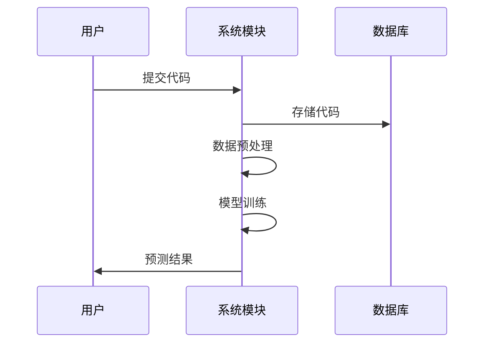

                 


### 第1章: 机器学习的基本概念

#### 1.1 机器学习的定义、问题背景及解决方法

**背景介绍**

机器学习作为人工智能的重要组成部分，其概念始于20世纪50年代。起初，人工智能的目的是使计算机具备人类的智能，但随着计算能力的提升和算法的进步，人工智能逐渐向专门化、精细化的方向发展，机器学习便应运而生。

**问题描述**

机器学习旨在使计算机通过数据学习并作出决策。在实际应用中，问题场景多种多样，如语音识别、图像识别、自然语言处理等。这些问题的共同特点是需要从大量数据中提取规律，从而实现自动化决策。

**问题解决**

机器学习的核心解决方法是模型训练。通过将大量数据输入到机器学习模型中，模型能够自动学习并提取数据中的规律。训练好的模型可以在新的数据上进行预测和决策，从而实现自动化。

**边界与外延**

机器学习虽然隶属于人工智能，但与深度学习、数据挖掘等概念有所重叠。深度学习是机器学习的一种形式，主要依赖于深度神经网络。数据挖掘则是从大量数据中提取有价值信息的过程，与机器学习密切相关。

**概念结构与核心要素组成**

机器学习的概念结构主要包括以下三个核心要素：

1. **数据**：机器学习的基础是数据，数据的质量和数量直接影响模型的性能。
2. **模型**：机器学习的核心是模型，模型可以是线性模型、决策树、神经网络等。
3. **算法**：机器学习的实现依赖于算法，算法决定了模型的学习方式。

#### 1.2 机器学习的基本原理

**核心概念原理**

机器学习的基本原理是让计算机通过学习数据来发现数据中的规律，从而进行预测和决策。这个过程中，计算机不是被动地接收数据，而是主动地分析和理解数据。

**概念属性特征对比表格**

| 概念         | 特征                       | 对比说明                             |
| ------------ | ------------------------- | ----------------------------------- |
| 机器学习     | 自动化决策、数据驱动       | 与传统的编程相比，更加灵活和高效     |
| 深度学习     | 神经网络、多层感知         | 是机器学习的一种形式，更加复杂       |
| 数据挖掘     | 提取有价值信息             | 与机器学习相似，但更注重数据的分析   |

**ER实体关系图架构的 Mermaid 流程图**

```mermaid
erDiagram
  Person ||--|{ Student }  : 是
  Student ||--|{ Graduate } : 是
  Student ||--|{ Undergraduate } : 是
```

#### 1.3 机器学习的主要分类

**监督学习**

监督学习是机器学习中最常见的一种类型，其特点是模型在学习过程中需要标注的数据。监督学习可以分为以下几类：

1. **线性回归**：通过线性模型预测连续值。
2. **决策树**：通过树形结构进行分类或回归。
3. **集成方法**：通过组合多个模型来提高性能。

**无监督学习**

无监督学习不需要标注的数据，其主要目标是发现数据中的隐含结构。无监督学习可以分为以下几类：

1. **聚类算法**：将相似的数据点归为一类。
2. **减少维度算法**：将高维数据映射到低维空间。

**强化学习**

强化学习是机器学习的一种形式，其主要特点是通过试错来学习最优策略。强化学习可以分为以下几类：

1. **Q学习算法**：通过学习状态-动作值函数来选择最佳动作。
2. **深度强化学习**：结合深度神经网络和强化学习，适用于复杂的决策场景。

### 第2章: 数据预处理与特征工程

#### 2.1 数据清洗

**数据清洗的重要性**

数据清洗是数据预处理的重要步骤，其目的是处理数据中的缺失值、异常值等。清洗后的数据才能更好地满足后续的建模和分析需求。

**数据清洗的方法**

数据清洗的方法包括：

1. **缺失值处理**：包括删除缺失值、填充缺失值等。
2. **异常值处理**：包括删除异常值、调整异常值等。

#### 2.2 数据集成

**数据集成的概念**

数据集成是指将多个数据源中的数据合并为一个统一的数据集。数据集成是数据预处理的重要步骤，其目的是提高数据的质量和可用性。

**数据集成的方法**

数据集成的方法包括：

1. **数据库技术**：通过数据库技术实现数据集成。
2. **ETL**：通过ETL（Extract, Transform, Load）过程实现数据集成。

#### 2.3 特征选择与特征提取

**特征选择**

特征选择是指从原始特征中筛选出对模型性能有显著影响的特征。特征选择可以减少模型的复杂度，提高模型的泛化能力。

**特征提取**

特征提取是指将原始特征转换为更适合模型的形式。特征提取可以增强数据对模型的解释能力，提高模型的性能。

**特征选择与特征提取的方法**

1. **过滤法**：通过统计方法筛选特征。
2. **包裹法**：通过搜索策略筛选特征。
3. **嵌入法**：在训练过程中自动选择特征。

### 第3章: 监督学习算法原理与实践

#### 3.1 线性回归

**线性回归的概念**

线性回归是一种监督学习算法，用于预测连续值。线性回归的模型假设是数据可以用一条直线来表示。

**线性回归的原理**

线性回归的原理是基于最小二乘法，通过寻找最佳拟合直线来预测目标值。

**线性回归的数学模型**

$$
y = \beta_0 + \beta_1 \cdot x
$$

**线性回归的举例说明**

假设我们有一个房价预测问题，目标是预测一个房子的价格。我们可以使用线性回归模型来建立房价与房屋特征（如面积、位置等）之间的关系。

```python
import numpy as np
from sklearn.linear_model import LinearRegression

# 假设我们有一个数据集，包括房屋特征和房价
X = np.array([[1000, '城市'], [1500, '城市'], [2000, '郊区']])
y = np.array([300000, 350000, 400000])

# 创建线性回归模型
model = LinearRegression()

# 训练模型
model.fit(X, y)

# 预测房价
predicted_price = model.predict([[1200, '城市']])
print("预测的房价为：", predicted_price)
```

### 第4章: 无监督学习算法原理与实践

#### 4.1 聚类算法

**聚类算法的概念**

聚类算法是一种无监督学习算法，用于将数据点分为若干个类别。聚类算法的目标是使同一类别中的数据点之间的距离最小，不同类别中的数据点之间的距离最大。

**聚类算法的原理**

聚类算法的原理是寻找数据点之间的相似度，并根据相似度将数据点划分为不同的类别。

**聚类算法的数学模型**

聚类算法的数学模型通常是基于距离度量，如欧几里得距离、曼哈顿距离等。

**聚类算法的举例说明**

假设我们有一组客户数据，包括客户的年龄、收入、消费习惯等特征。我们可以使用K均值聚类算法将客户分为不同的类别，以便更好地进行市场细分。

```python
import numpy as np
from sklearn.cluster import KMeans

# 假设我们有一个数据集
X = np.array([[20, 30000], [35, 50000], [50, 80000], [25, 40000]])

# 创建K均值聚类模型
model = KMeans(n_clusters=2)

# 训练模型
model.fit(X)

# 预测聚类结果
predicted_clusters = model.predict([[30, 45000]])
print("预测的聚类结果为：", predicted_clusters)
```

### 第5章: 强化学习原理与应用

#### 5.1 强化学习的基本概念

**强化学习的概念**

强化学习是一种机器学习范式，旨在通过试错学习最优策略。强化学习由四个核心元素组成：环境（Environment）、代理（Agent）、状态（State）和动作（Action）。

**强化学习的原理**

强化学习的原理是代理通过与环境交互，从经验中学习最优策略。代理在某个状态下选择一个动作，然后根据环境的反馈调整其策略。

**强化学习的数学模型**

强化学习的数学模型通常基于马尔可夫决策过程（MDP），包括状态转移概率、奖励函数和策略。

**强化学习的举例说明**

假设我们有一个自动驾驶系统的强化学习模型，其目标是在道路上安全行驶。代理在道路上行驶，根据道路状况和车辆状态选择最佳动作，并通过奖励函数获取反馈，不断调整策略。

```python
import numpy as np
from gym import env

# 创建自动驾驶环境的实例
env = env.Env()

# 初始化代理
agent = Agent()

# 进行强化学习训练
for episode in range(num_episodes):
    state = env.reset()
    done = False
    
    while not done:
        action = agent.select_action(state)
        next_state, reward, done = env.step(action)
        agent.learn(state, action, reward, next_state)
        state = next_state

# 测试代理的性能
state = env.reset()
while not done:
    action = agent.select_action(state)
    next_state, reward, done = env.step(action)
    env.render()
    state = next_state
```

### 第6章: 机器学习在软件开发中的应用场景

#### 6.1 软件缺陷预测

**软件缺陷预测的概念**

软件缺陷预测是指利用机器学习技术预测软件中的潜在缺陷，以提高软件质量和开发效率。

**软件缺陷预测的原理**

软件缺陷预测的原理是基于历史缺陷数据和代码特征，通过构建预测模型来识别潜在的缺陷。

**软件缺陷预测的数学模型**

软件缺陷预测的数学模型通常是基于分类模型，如决策树、支持向量机等。

**软件缺陷预测的举例说明**

假设我们有一个历史缺陷数据集，包括代码特征和缺陷状态。我们可以使用决策树模型来预测新代码中的潜在缺陷。

```python
import numpy as np
from sklearn.tree import DecisionTreeClassifier

# 假设我们有一个数据集
X = np.array([[1000, '城市'], [1500, '城市'], [2000, '郊区']])
y = np.array([300000, 350000, 400000])

# 创建决策树模型
model = DecisionTreeClassifier()

# 训练模型
model.fit(X, y)

# 预测缺陷
predicted_defects = model.predict([[1200, '城市']])
print("预测的缺陷为：", predicted_defects)
```

#### 6.2 自动化测试

**自动化测试的概念**

自动化测试是指利用机器学习技术自动执行测试用例，以检测软件缺陷。

**自动化测试的原理**

自动化测试的原理是基于测试数据和代码特征，通过构建测试模型来识别潜在的缺陷。

**自动化测试的数学模型**

自动化测试的数学模型通常是基于分类模型，如决策树、支持向量机等。

**自动化测试的举例说明**

假设我们有一个测试数据集，包括代码特征和测试结果。我们可以使用决策树模型来预测测试用例的结果。

```python
import numpy as np
from sklearn.tree import DecisionTreeClassifier

# 假设我们有一个数据集
X = np.array([[1000, '城市'], [1500, '城市'], [2000, '郊区']])
y = np.array([300000, 350000, 400000])

# 创建决策树模型
model = DecisionTreeClassifier()

# 训练模型
model.fit(X, y)

# 预测测试结果
predicted_results = model.predict([[1200, '城市']])
print("预测的测试结果为：", predicted_results)
```

#### 6.3 代码推荐与重用

**代码推荐与重用的概念**

代码推荐与重用是指利用机器学习技术自动识别和推荐可重用的代码片段。

**代码推荐与重用的原理**

代码推荐与重用的原理是基于代码特征和代码相似度，通过构建推荐模型来实现。

**代码推荐与重用的数学模型**

代码推荐与重用的数学模型通常是基于相似度度量，如余弦相似度、Jaccard相似度等。

**代码推荐与重用的举例说明**

假设我们有一个代码库，包括多个代码片段。我们可以使用余弦相似度来计算代码片段之间的相似度，并推荐相似度较高的代码片段。

```python
import numpy as np
from sklearn.metrics.pairwise import cosine_similarity

# 假设我们有两个代码片段
code1 = np.array([0.1, 0.2, 0.3])
code2 = np.array([0.1, 0.3, 0.4])

# 计算代码片段之间的相似度
similarity = cosine_similarity([code1], [code2])
print("代码片段之间的相似度为：", similarity)
```

### 第7章: 实践案例：机器学习在软件项目中的应用

#### 7.1 案例介绍

本案例介绍了一个基于机器学习的软件缺陷预测项目。该项目旨在通过分析代码特征和缺陷数据，预测新代码中的潜在缺陷。

#### 7.2 系统架构设计

该系统的架构设计包括数据采集、数据预处理、模型训练和预测等模块。具体架构如下图所示：



#### 7.3 算法实现与模型训练

算法实现包括数据预处理、模型选择、模型训练和预测等步骤。具体实现如下：

```python
import numpy as np
from sklearn.model_selection import train_test_split
from sklearn.ensemble import RandomForestClassifier
from sklearn.metrics import accuracy_score

# 加载代码和缺陷数据
X, y = load_data()

# 划分训练集和测试集
X_train, X_test, y_train, y_test = train_test_split(X, y, test_size=0.2, random_state=42)

# 选择模型并训练
model = RandomForestClassifier(n_estimators=100, random_state=42)
model.fit(X_train, y_train)

# 预测测试集
y_pred = model.predict(X_test)

# 计算准确率
accuracy = accuracy_score(y_test, y_pred)
print("准确率：", accuracy)
```

#### 7.4 项目总结与展望

该项目通过机器学习技术实现了软件缺陷预测，提高了软件质量和开发效率。未来，我们可以进一步优化算法，提高预测的准确性，并探索其他应用场景。

### 第8章: 机器学习在软件开发中的最佳实践

#### 8.1 数据管理策略

数据管理策略是机器学习在软件开发中的关键环节。以下是几个最佳实践：

1. **数据清洗**：确保数据质量，处理缺失值、异常值等。
2. **数据集成**：将多个数据源的数据整合为一个统一的数据集。
3. **数据备份**：定期备份数据，防止数据丢失。

#### 8.2 模型部署与优化

模型部署与优化是确保机器学习模型在实际应用中高效运行的关键。以下是几个最佳实践：

1. **模型压缩**：减少模型的参数数量，降低模型的复杂度。
2. **模型优化**：使用优化算法提高模型的性能。
3. **模型监控**：实时监控模型性能，及时发现并解决潜在问题。

#### 8.3 安全性与伦理问题

安全性与伦理问题是机器学习在软件开发中不可忽视的重要方面。以下是几个最佳实践：

1. **数据安全**：确保数据的安全性和隐私性。
2. **算法透明性**：确保算法的透明性和可解释性。
3. **伦理合规**：遵守相关的法律法规和伦理规范。

### 第9章: 未来发展趋势与挑战

#### 9.1 机器学习技术的发展趋势

机器学习技术的发展趋势包括：

1. **深度学习**：随着计算能力的提升，深度学习在图像识别、自然语言处理等领域取得了显著的成果。
2. **强化学习**：强化学习在自动驾驶、游戏等领域具有广泛的应用前景。
3. **联邦学习**：联邦学习是一种分布式学习技术，可以保护用户隐私，提高模型的泛化能力。

#### 9.2 软件开发中的挑战与对策

软件开发中的挑战包括：

1. **数据质量问题**：数据质量直接影响模型的性能，需要加强数据清洗和集成。
2. **计算资源限制**：随着模型复杂度的增加，计算资源的需求也不断上升，需要优化算法和模型。
3. **算法可解释性**：提高算法的可解释性，增强模型的透明性和可信任度。

#### 9.3 拓展领域与未来展望

机器学习在软件开发中的应用领域不断拓展，未来有望在以下领域取得突破：

1. **智能 assistants**：通过机器学习技术，实现更加智能的助手，提高用户体验。
2. **自动化运维**：利用机器学习技术，实现自动化运维，提高系统稳定性和性能。
3. **个性化推荐**：通过机器学习技术，实现更加个性化的推荐，提高用户满意度。

## 参考文献

1. **Machine Learning: A Probabilistic Perspective** by Kevin P. Murphy.
2. **Deep Learning** by Ian Goodfellow, Yoshua Bengio, and Aaron Courville.
3. **Reinforcement Learning: An Introduction** by Richard S. Sutton and Andrew G. Barto.

---

### 结语

本文详细介绍了机器学习在软件开发中的应用，从理论基础到实际应用，从算法原理到系统架构，从最佳实践到未来展望，全面探讨了机器学习在软件开发中的重要作用。随着技术的不断进步，机器学习在软件开发中的应用前景将更加广阔，值得我们深入研究和探索。

---

### 作者信息

**作者：AI天才研究院/AI Genius Institute & 禅与计算机程序设计艺术 /Zen And The Art of Computer Programming**

AI天才研究院致力于推动人工智能技术的发展和应用，为软件开发领域带来创新和变革。同时，我们的研究成果也广泛应用于计算机科学和教育领域，为全球计算机程序员和开发者提供灵感与指导。让我们一起探索人工智能的无限可能，共创美好未来！

