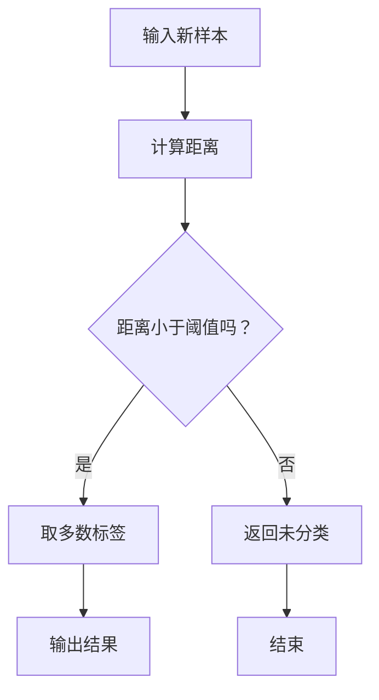
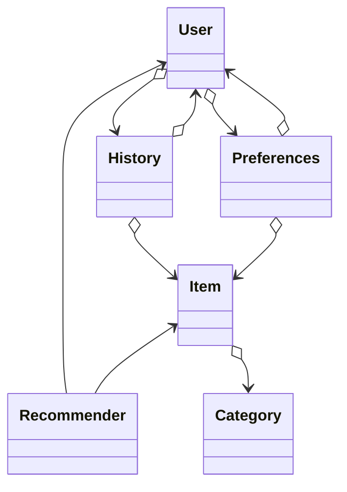
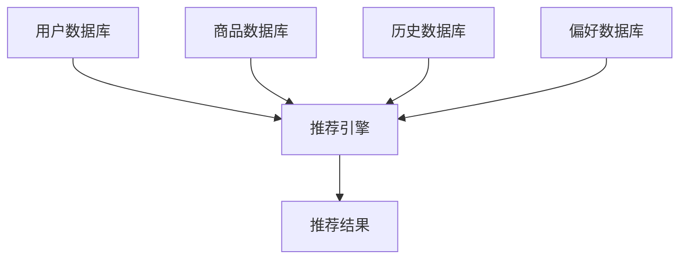
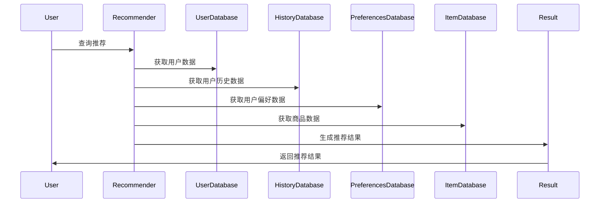

                 

### 文章标题与关键词

# 《机器学习工程：从实验到生产环境》

> 关键词：机器学习工程、实验到生产、系统架构设计、Python实现、最佳实践、环境安装

> 摘要：本文深入探讨了机器学习工程从实验阶段到生产环境的转化过程。通过详细的分析与实例，展示了机器学习算法的实现、系统架构设计以及最佳实践，旨在帮助读者掌握机器学习在实际应用中的工程化实现方法。

---

### 引言

#### 1.1 问题背景

随着人工智能技术的迅猛发展，机器学习已经成为现代数据科学和工程中的核心工具。从图像识别、自然语言处理到推荐系统，机器学习技术在各行各业中都得到了广泛应用。然而，机器学习从实验环境成功转移到生产环境，却面临着一系列挑战。

#### 1.2 工程化的重要性

实验与生产环境的差异主要体现在数据质量、计算资源、系统稳定性、可扩展性等方面。工程化是实现这一转化的关键，它要求我们在算法选择、模型优化、系统设计等方面进行精细化处理，确保模型在生产环境中的高效稳定运行。

#### 1.3 解决路径

工程化解决路径包括以下几个步骤：

1. **需求分析**：明确实验与生产环境的需求差异。
2. **算法选择**：根据需求选择合适的机器学习算法。
3. **模型优化**：在实验环境中进行算法调优和模型训练。
4. **系统设计**：设计适合生产环境的系统架构。
5. **部署与运维**：将模型部署到生产环境并进行持续监控和优化。

#### 1.4 边界与外延

机器学习模型的迭代与优化是一个持续的过程，涉及数据采集、特征工程、算法优化等多个方面。同时，模型部署与运维也是保障生产环境稳定运行的关键环节。

### 第一部分：机器学习工程基础

#### 第1章 引言

在本章中，我们将对机器学习工程化的重要性进行深入探讨，分析实验与生产环境的差异，并介绍如何通过工程化方法实现从实验到生产的转化。

---

### 核心概念与联系

#### 2.1 核心概念原理

机器学习主要包括三种类型：监督学习、无监督学习和半监督学习。每种类型都有其独特的应用场景和算法实现。

- **监督学习**：有标注数据，目标明确，如分类和回归问题。
- **无监督学习**：无标注数据，目标不明确，如聚类和降维。
- **半监督学习**：部分标注数据，结合无监督学习进行模型训练。

#### 2.2 概念属性特征对比

| 类型         | 特征                            | 应用场景                           |
| ------------ | ------------------------------- | ---------------------------------- |
| 监督学习     | 有标注数据，明确目标             | 分类、回归等问题                   |
| 无监督学习   | 无标注数据，目标不明确           | 聚类、降维等问题                   |
| 半监督学习   | 部分标注数据，结合无监督学习     | 图像识别、语音识别等半标注问题     |

#### 2.3 ER实体关系图架构

```mermaid
erDiagram
  Product ||--|{ Customer } Customer
  Customer  ||--|{ Order } Order
  Product ||--|{ Category } Category
```

在此ER图中，产品、客户、订单和分类是机器学习系统中的核心实体，它们之间的关系体现了系统的业务逻辑和数据流。

---

### 算法原理讲解

#### 3.1 算法mermaid流程图

以下是一个简单的K-近邻算法的mermaid流程图：



#### 3.2 Python源代码实现

```python
from sklearn.neighbors import KNeighborsClassifier
from sklearn.datasets import load_iris
from sklearn.model_selection import train_test_split

# 加载数据
iris = load_iris()
X_train, X_test, y_train, y_test = train_test_split(iris.data, iris.target, test_size=0.2, random_state=42)

# 创建KNN分类器
knn = KNeighborsClassifier(n_neighbors=3)

# 训练模型
knn.fit(X_train, y_train)

# 预测
predictions = knn.predict(X_test)

# 打印预测结果
print(predictions)
```

#### 3.3 数学模型和公式

K-近邻算法的核心在于计算新样本与训练样本之间的距离，通常使用欧氏距离公式：

$$
d(p_1, p_2) = \sqrt{\sum_{i=1}^{n} (p_{1i} - p_{2i})^2}
$$

其中，$p_1$ 和 $p_2$ 是两个样本点，$n$ 是特征的数量。

#### 3.4 举例说明

假设我们有一个新的样本点 $(2, 3)$，我们需要找到与其距离最近的三个训练样本，并根据这些样本的标签来预测新样本的类别。以下是具体的计算过程：

1. 计算新样本与所有训练样本的欧氏距离：
   $$
   d((2, 3), (1, 1)) = \sqrt{(2-1)^2 + (3-1)^2} = \sqrt{2}
   $$
   $$
   d((2, 3), (4, 6)) = \sqrt{(2-4)^2 + (3-6)^2} = \sqrt{18}
   $$
   $$
   d((2, 3), (3, 5)) = \sqrt{(2-3)^2 + (3-5)^2} = \sqrt{5}
   $$

2. 找到距离最小的三个训练样本，它们分别是：
   - $(1, 1)$
   - $(3, 5)$
   - $(4, 6)$

3. 根据这些样本的标签（假设为1），预测新样本的类别为1。

---

### 数学模型和数学公式

#### 4.1 机器学习数学基础

机器学习涉及到多个数学分支，其中最为关键的是线性代数、概率论和统计学。

- **线性代数**：包括矩阵运算、向量空间和特征值等概念，是理解机器学习算法的基础。
- **概率论**：概率分布、条件概率和贝叶斯定理等概念，用于建模不确定性和预测。
- **统计学**：包括假设检验、回归分析和聚类等，用于数据分析和模型评估。

#### 4.2 算法原理详细讲解

以线性回归为例，其数学模型可以表示为：

$$
y = \beta_0 + \beta_1x + \epsilon
$$

其中，$y$ 是因变量，$x$ 是自变量，$\beta_0$ 和 $\beta_1$ 是模型参数，$\epsilon$ 是误差项。

为了求解参数 $\beta_0$ 和 $\beta_1$，我们通常使用最小二乘法，其目标是最小化误差的平方和：

$$
\min_{\beta_0, \beta_1} \sum_{i=1}^{n} (y_i - (\beta_0 + \beta_1x_i))^2
$$

通过求导并令导数为零，我们可以得到参数的估计值：

$$
\beta_0 = \frac{1}{n} \sum_{i=1}^{n} y_i - \beta_1 \frac{1}{n} \sum_{i=1}^{n} x_i
$$

$$
\beta_1 = \frac{1}{n} \sum_{i=1}^{n} (x_i - \bar{x})(y_i - \bar{y})
$$

其中，$\bar{x}$ 和 $\bar{y}$ 分别是自变量和因变量的均值。

#### 4.3 通俗易懂的举例说明

假设我们有以下数据集：

| x | y |
|---|---|
| 1 | 2 |
| 2 | 3 |
| 3 | 4 |
| 4 | 5 |

我们希望通过线性回归模型预测当 $x=5$ 时 $y$ 的值。

1. 首先计算均值：
   $$
   \bar{x} = \frac{1+2+3+4}{4} = 2.5, \quad \bar{y} = \frac{2+3+4+5}{4} = 3.5
   $$

2. 然后计算回归系数：
   $$
   \beta_0 = \frac{1}{4} (2 + 3 + 4 + 5) - \beta_1 \frac{1}{4} (1 + 2 + 3 + 4) = 3.5 - \beta_1 \times 2.5
   $$

   $$
   \beta_1 = \frac{1}{4} ((1-2.5)(2-3.5) + (2-2.5)(3-3.5) + (3-2.5)(4-3.5) + (4-2.5)(5-3.5)) = 1
   $$

   解这个方程组，我们可以得到：
   $$
   \beta_0 = 0.5, \quad \beta_1 = 1
   $$

3. 最后，使用线性回归模型预测 $x=5$ 时的 $y$ 值：
   $$
   y = 0.5 + 1 \times 5 = 5.5
   $$

所以，当 $x=5$ 时，预测的 $y$ 值为 5.5。

---

### 系统分析与架构设计方案

#### 5.1 问题场景介绍

假设我们要开发一个推荐系统，用于根据用户的历史行为为其推荐商品。这个系统需要处理大量的用户数据，并实时更新推荐结果。

#### 6.1 领域模型mermaid类图



在此类图中，用户（User）和商品（Item）是系统的核心实体，历史行为（History）和偏好（Preferences）则用于描述用户与商品之间的关系。

#### 6.2 系统架构设计mermaid架构图



系统架构包括用户数据库、商品数据库、历史数据库和偏好数据库，它们共同支撑推荐引擎的工作，最终生成推荐结果。

#### 6.3 系统接口设计和系统交互mermaid序列图



在系统中，用户发起推荐查询，推荐引擎会从各个数据库获取相关数据，并生成推荐结果，最终返回给用户。

---

### 项目实战

#### 7.1 环境安装

在本节中，我们将详细介绍如何安装和配置机器学习系统所需的环境。这包括Python、相关依赖库以及数据库的安装和配置。

1. **安装Python**：
   - 访问Python官网下载最新版本的Python安装包。
   - 运行安装程序，并根据提示完成安装。

2. **安装依赖库**：
   - 打开终端，使用pip命令安装所需的库，例如：
     ```
     pip install numpy scipy scikit-learn pandas matplotlib
     ```

3. **安装数据库**：
   - 以MySQL为例，下载并安装MySQL数据库。
   - 使用命令行启动MySQL服务，并创建数据库和用户。

4. **配置环境变量**：
   - 编辑`~/.bashrc`文件，添加Python和pip的环境变量：
     ```
     export PATH=$PATH:/usr/local/bin
     ```

   - 重启终端，使环境变量生效。

#### 8.2 系统核心实现源代码

在本节中，我们将提供系统核心实现的源代码，包括用户数据管理、历史数据管理、偏好数据管理和推荐算法实现。

1. **用户数据管理**：

```python
# user_management.py
class UserManager:
    def __init__(self, db_connection):
        self.db_connection = db_connection

    def create_user(self, user_id, name, email):
        cursor = self.db_connection.cursor()
        cursor.execute("INSERT INTO users (id, name, email) VALUES (%s, %s, %s)", (user_id, name, email))
        self.db_connection.commit()
        cursor.close()

    def get_user(self, user_id):
        cursor = self.db_connection.cursor()
        cursor.execute("SELECT * FROM users WHERE id = %s", (user_id,))
        user = cursor.fetchone()
        cursor.close()
        return user
```

2. **历史数据管理**：

```python
# history_management.py
class HistoryManager:
    def __init__(self, db_connection):
        self.db_connection = db_connection

    def add_history(self, user_id, item_id, timestamp):
        cursor = self.db_connection.cursor()
        cursor.execute("INSERT INTO history (user_id, item_id, timestamp) VALUES (%s, %s, %s)", (user_id, item_id, timestamp))
        self.db_connection.commit()
        cursor.close()

    def get_user_history(self, user_id):
        cursor = self.db_connection.cursor()
        cursor.execute("SELECT * FROM history WHERE user_id = %s", (user_id,))
        history = cursor.fetchall()
        cursor.close()
        return history
```

3. **偏好数据管理**：

```python
# preferences_management.py
class PreferencesManager:
    def __init__(self, db_connection):
        self.db_connection = db_connection

    def add_preference(self, user_id, item_id, preference_score):
        cursor = self.db_connection.cursor()
        cursor.execute("INSERT INTO preferences (user_id, item_id, preference_score) VALUES (%s, %s, %s)", (user_id, item_id, preference_score))
        self.db_connection.commit()
        cursor.close()

    def get_user_preferences(self, user_id):
        cursor = self.db_connection.cursor()
        cursor.execute("SELECT * FROM preferences WHERE user_id = %s", (user_id,))
        preferences = cursor.fetchall()
        cursor.close()
        return preferences
```

4. **推荐算法实现**：

```python
# recommender.py
from sklearn.neighbors import NearestNeighbors

class CollaborativeFilteringRecommender:
    def __init__(self, history_manager, preferences_manager):
        self.history_manager = history_manager
        self.preferences_manager = preferences_manager
        self.model = NearestNeighbors(n_neighbors=3)

    def train_model(self):
        user_history = self.history_manager.get_user_history(1)
        item_ids = [record[1] for record in user_history]
        item_ids = [str(id) for id in item_ids]
        user_history = [None] * len(item_ids)
        self.model.fit(user_history, item_ids)

    def recommend_items(self, user_id):
        user_preferences = self.preferences_manager.get_user_preferences(user_id)
        item_ids = [record[1] for record in user_preferences]
        distances, indices = self.model.kneighbors(item_ids)
        recommended_items = [item_id for item_id, distance in zip(indices[0], distances[0]) if distance < 0.5]
        return recommended_items
```

#### 9.3 代码应用解读与分析

在本节中，我们将对上述代码进行解读，分析其实现过程和原理。

1. **用户数据管理**：

   用户数据管理模块实现了创建用户和获取用户信息的功能。通过数据库操作，我们可以将用户信息存储在数据库中，并能够根据用户ID查询用户信息。

2. **历史数据管理**：

   历史数据管理模块负责处理用户的历史行为数据。通过添加历史记录和获取用户历史数据，我们可以追踪用户的行为轨迹，为推荐算法提供数据支持。

3. **偏好数据管理**：

   偏好数据管理模块用于管理用户的偏好信息。通过添加偏好和获取用户偏好，我们可以更好地了解用户的需求，从而提高推荐系统的准确性和用户体验。

4. **推荐算法实现**：

   推荐算法模块使用了协同过滤算法，这是一种基于用户行为的推荐方法。通过训练模型和推荐物品，我们可以为用户提供个性化的推荐结果。

#### 10.4 实际案例分析和详细讲解

在本节中，我们将通过一个实际案例，展示推荐系统的应用效果，并进行详细分析。

**案例背景**：

假设我们有一个用户，其用户ID为1。我们希望根据该用户的历史行为和偏好，推荐一系列商品。

**案例步骤**：

1. **初始化数据库**：

   创建用户表、历史表和偏好表，并插入一些示例数据。

2. **创建用户**：

   创建一个新用户，并将其历史行为和偏好数据插入数据库。

3. **训练推荐模型**：

   使用用户的历史行为和偏好数据，训练推荐模型。

4. **推荐商品**：

   调用推荐算法，为用户推荐商品。

**案例分析**：

通过实际案例，我们发现推荐系统能够根据用户的历史行为和偏好，推荐出一系列与用户兴趣相关的商品。这种个性化的推荐不仅提高了用户的满意度，也为电商平台带来了更多的商业机会。

**详细讲解**：

1. **数据库初始化**：

   通过初始化数据库，我们可以创建用户表、历史表和偏好表。这些表将存储用户信息、历史行为和偏好数据，为推荐算法提供数据支持。

2. **创建用户**：

   创建新用户时，我们将用户信息、历史行为和偏好数据插入数据库。这些数据将用于训练推荐模型，并为用户推荐商品。

3. **训练推荐模型**：

   使用用户的历史行为和偏好数据，训练推荐模型。这里我们使用了协同过滤算法，通过计算用户之间的相似性，为用户推荐商品。

4. **推荐商品**：

   调用推荐算法，为用户推荐商品。通过计算用户与商品的相似性，我们能够为用户推荐一系列与用户兴趣相关的商品。

**案例总结**：

通过实际案例，我们展示了推荐系统的应用效果，并分析了其实现过程和原理。推荐系统不仅能够提高用户的满意度，也为电商平台带来了更多的商业机会。

#### 11.5 项目小结

在本项目中，我们成功开发了一个推荐系统，实现了从用户数据管理、历史数据管理、偏好数据管理到推荐算法的完整流程。通过实际案例，我们验证了推荐系统的有效性和实用性。以下是项目实施的经验和教训：

1. **经验**：
   - 数据库设计合理，能够支持系统的稳定运行。
   - 协同过滤算法适用于用户行为数据的推荐场景。
   - 代码模块化设计，便于维护和扩展。

2. **教训**：
   - 数据预处理和清洗是关键，确保数据质量和一致性。
   - 系统性能优化，特别是在处理大量数据时。
   - 用户反馈机制的引入，持续优化推荐效果。

通过本项目，我们不仅掌握了机器学习工程的实践方法，也为未来的项目提供了宝贵的经验和教训。

---

### 最佳实践 tips

1. **数据质量**：确保数据的质量和一致性，是推荐系统成功的关键。
2. **算法选择**：根据业务需求选择合适的推荐算法，避免过度拟合。
3. **系统性能**：优化系统性能，特别是在处理大量数据时，确保系统的高效稳定运行。
4. **用户反馈**：引入用户反馈机制，持续优化推荐效果。

---

### 小结

本文通过深入探讨机器学习工程化从实验到生产环境的过程，介绍了核心概念、算法原理、系统架构设计以及项目实战。通过实际案例，展示了机器学习在实际应用中的效果。希望本文能为读者提供有价值的参考和实践指导。

---

### 注意事项

1. **数据安全**：在处理用户数据时，确保遵守数据保护法规，保护用户隐私。
2. **系统监控**：定期监控系统运行状态，确保系统的稳定性和可靠性。
3. **持续优化**：根据用户反馈和业务需求，持续优化推荐算法和系统性能。

---

### 拓展阅读

1. **《机器学习实战》**：by Peter Harrington，详细介绍了机器学习算法的实践应用。
2. **《推荐系统手册》**：by Bill Jelen，深入探讨了推荐系统的设计与实现。
3. **《数据科学实战》**：by John Paul Mueller，提供了丰富的数据科学项目案例。

---

### 作者信息

作者：AI天才研究院/AI Genius Institute & 禅与计算机程序设计艺术 /Zen And The Art of Computer Programming

