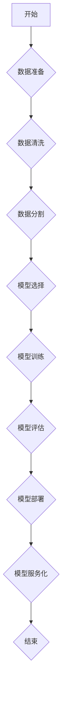
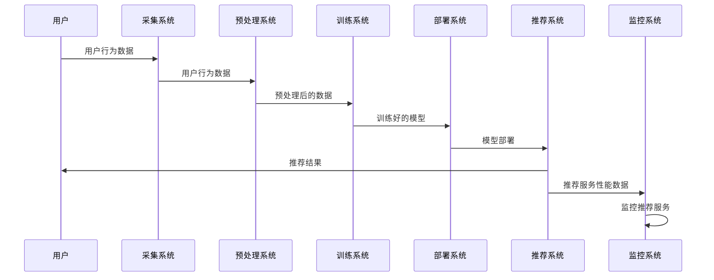

                 

# 第1章 背景介绍

## 1.1 问题背景

随着人工智能技术的迅猛发展，机器学习已经成为推动各行各业创新的重要力量。然而，在实际应用中，将训练好的机器学习模型部署到生产环境中并实现服务化，依然面临诸多挑战。这不仅因为模型部署涉及到复杂的流程和工具，还因为服务化过程中需要考虑到模型的性能、安全性和可扩展性。

### 1.2 问题描述

机器学习模型部署与服务化主要面临以下问题：

1. **模型转换**：从训练环境到生产环境的迁移过程中，模型需要从一种格式转换为生产环境支持的格式，如ONNX、TensorFlow SavedModel或PyTorch Script。
2. **模型部署**：将转换后的模型部署到不同的硬件和操作系统上，确保模型在生产环境中能够稳定运行。
3. **服务化管理**：实现模型服务的监控、管理、优化和升级，以保证服务的高可用性和高效性。
4. **性能优化**：根据实际应用场景，对模型进行优化，提高模型性能和响应速度。

### 1.3 问题解决

为了解决上述问题，可以采取以下步骤：

1. **模型转换**：选择合适的模型转换工具，如ONNX、TensorFlow SavedModel或PyTorch Script，确保模型能够顺利迁移。
2. **模型部署**：选择合适的部署框架，如TensorFlow Serving、Kubernetes或Docker，将模型部署到生产环境中。
3. **服务化管理**：构建服务化管理平台，如使用Prometheus、Kibana或ELK等工具，对模型服务进行监控和管理。
4. **性能优化**：采用模型压缩、量化、并行计算等策略，提高模型性能和效率。

### 1.4 边界与外延

机器学习模型部署与服务化的边界和范围包括：

1. **硬件与软件环境**：需要考虑不同硬件（如CPU、GPU、FPGA）和软件环境（如操作系统、数据库、中间件）的支持。
2. **部署方式**：根据需求，可以选择在线部署、离线部署或边缘计算等不同方式。
3. **服务类型**：模型服务可以提供API接口、Web服务或流处理服务等多种形式。

### 1.5 概念结构与核心要素组成

机器学习模型部署与服务化涉及以下核心概念和要素：

1. **模型转换工具**：如ONNX、TensorFlow SavedModel、PyTorch Script等。
2. **模型部署框架**：如TensorFlow Serving、Kubernetes、Docker等。
3. **服务化管理平台**：如Prometheus、Kibana、ELK等。
4. **性能优化策略**：如模型压缩、量化、并行计算等。
5. **硬件与软件环境**：包括CPU、GPU、FPGA等，以及操作系统、数据库、中间件等。

## 第2章 核心概念与联系

### 2.1 机器学习模型概述

机器学习模型是通过数据训练得到的数学模型，用于对未知数据进行预测或分类。根据学习方式的不同，可以分为以下几类：

- **监督学习**：有标记的数据集用于训练模型。
- **无监督学习**：没有标记的数据集用于训练模型，如聚类和降维。
- **半监督学习**：部分有标记数据集和部分无标记数据集用于训练模型。
- **强化学习**：通过与环境的交互来学习和优化策略。

### 2.2 模型训练与优化

模型训练是指使用训练数据来调整模型的参数，使其在预测任务上达到最佳表现。优化过程包括：

- **参数初始化**：选择合适的初始化方法，如随机初始化、层次初始化等。
- **损失函数**：定义损失函数，用于评估模型预测结果与真实值之间的差异。
- **优化算法**：选择合适的优化算法，如梯度下降、随机梯度下降、Adam等。

### 2.3 模型评估与选择

模型评估是评估模型性能的过程，常用的评估指标包括：

- **准确率**：分类问题中，正确分类的样本占总样本的比例。
- **召回率**：分类问题中，实际为正类的样本中被正确分类为正类的比例。
- **F1分数**：综合考虑准确率和召回率的指标。

选择模型时，需要综合考虑以下因素：

- **模型复杂度**：复杂度较低的模型更容易训练，但可能无法捕捉到复杂的数据模式。
- **过拟合与欠拟合**：过拟合模型在训练数据上表现良好，但在测试数据上表现较差；欠拟合模型在训练数据和测试数据上表现都较差。
- **计算资源**：某些模型可能需要更多的计算资源，影响部署成本和效率。

### 2.4 概念属性特征对比表格

下表展示了不同机器学习模型的属性特征对比：

| 模型类型 | 特点 | 适用场景 | 
|----------|------|---------|
| 监督学习 | 有标记数据集 | 预测和分类任务 |
| 无监督学习 | 无标记数据集 | 聚类和降维 |
| 半监督学习 | 有标记和无标记数据集 | 预测和分类任务 |
| 强化学习 | 环境与交互 | 优化决策策略 |

### 2.5 ER实体关系图架构

实体关系图（ER图）用于描述系统中的实体和关系，如下所示：

```mermaid
erDiagram
  Model ||--|{ Trainer } Trainer
  Model ||--|{ Evaluator } Evaluator
  Model ||--|{ Deployer } Deployer
  Model ||--|{ Servicer } Servicer
```

其中，`Model` 表示机器学习模型，`Trainer` 表示训练者，`Evaluator` 表示评估者，`Deployer` 表示部署者，`Servicer` 表示服务者。

## 第3章 算法原理讲解

### 3.1 算法mermaid流程图

以下是一个简单的机器学习模型训练和部署的mermaid流程图：



### 3.2 Python源代码实现

以下是一个简单的机器学习模型训练和部署的Python源代码实现：

```python
import tensorflow as tf
from sklearn.model_selection import train_test_split

# 数据准备
X_train, X_test, y_train, y_test = train_test_split(X, y, test_size=0.2, random_state=42)

# 模型选择
model = tf.keras.Sequential([
    tf.keras.layers.Dense(64, activation='relu', input_shape=(input_shape)),
    tf.keras.layers.Dense(1, activation='sigmoid')
])

# 模型训练
model.compile(optimizer='adam', loss='binary_crossentropy', metrics=['accuracy'])
model.fit(X_train, y_train, epochs=10, batch_size=32, validation_split=0.2)

# 模型评估
loss, accuracy = model.evaluate(X_test, y_test)
print(f"Test accuracy: {accuracy:.2f}")

# 模型部署
model.save('model.h5')

# 模型服务化
from flask import Flask, request, jsonify
app = Flask(__name__)

@app.route('/predict', methods=['POST'])
def predict():
    data = request.get_json(force=True)
    prediction = model.predict([data['input']])
    return jsonify(prediction.tolist())

if __name__ == '__main__':
    app.run(host='0.0.0.0', port=5000)
```

### 3.3 数学模型与公式

以下是一个简单的二分类机器学习模型的数学模型与公式：

$$
\begin{aligned}
y' &= \sigma(\theta^T x), \\
\text{where} \ \sigma &= \frac{1}{1 + e^{-x}}, \\
\theta &= \text{model parameters}, \\
x &= \text{input features}, \\
y' &= \text{predicted probability of class 1}.
\end{aligned}
$$

### 3.4 举例说明

假设我们有一个简单的二分类问题，其中输入特征 `x` 是一个维度为2的向量 `[x1, x2]`，目标变量 `y` 是一个二元变量（0或1）。我们要训练一个逻辑回归模型，使用梯度下降优化算法。

1. **数据准备**：假设我们有一个包含100个样本的数据集，其中每个样本由输入特征和目标变量组成。

2. **模型选择**：选择一个逻辑回归模型。

3. **模型训练**：使用梯度下降优化算法训练模型。每次迭代计算损失函数关于模型参数的梯度，并更新参数。

4. **模型评估**：使用测试集评估模型性能，计算准确率、召回率等指标。

5. **模型部署**：将训练好的模型保存为文件，并在生产环境中部署。

6. **模型服务化**：使用Flask框架构建API服务，将模型部署为Web服务。

## 第4章 数学模型和数学公式 & 详细讲解 & 举例说明

### 4.1 数学公式

在机器学习模型部署与服务化过程中，我们需要掌握一些基础的数学模型和公式。以下是一些常用的数学公式：

$$
\begin{aligned}
\text{损失函数} &= -\frac{1}{m} \sum_{i=1}^{m} y \log(a^{(i)}_{1}) + (1 - y) \log(1 - a^{(i)}_{1}), \\
\text{梯度} &= \frac{\partial}{\partial \theta_j} \text{损失函数}, \\
\text{更新公式} &= \theta_j := \theta_j - \alpha \cdot \frac{\partial}{\partial \theta_j} \text{损失函数}, \\
a^{(i)} &= \sigma(\theta^T x^{(i)}), \\
\text{预测概率} &= P(y=1 | x; \theta) = \frac{e^{\theta^T x^{(i)}}}{1 + e^{\theta^T x^{(i)}}}.
\end{aligned}
$$

### 4.2 详细讲解

1. **损失函数**：损失函数用于评估模型预测结果与真实值之间的差异。在二分类问题中，常用的损失函数是交叉熵损失函数（Cross-Entropy Loss）。交叉熵损失函数的公式为：

$$
\text{损失函数} = -\frac{1}{m} \sum_{i=1}^{m} y \log(a^{(i)}_{1}) + (1 - y) \log(1 - a^{(i)}_{1}),
$$

其中，\( m \) 是样本数量，\( y \) 是真实标签，\( a^{(i)}_{1} \) 是模型预测的概率。

2. **梯度**：梯度是损失函数关于模型参数的偏导数，用于指导模型的更新方向。对于线性模型，梯度可以表示为：

$$
\text{梯度} = \frac{\partial}{\partial \theta_j} \text{损失函数},
$$

其中，\( \theta_j \) 是模型参数。

3. **更新公式**：在梯度下降算法中，模型参数的更新公式为：

$$
\theta_j := \theta_j - \alpha \cdot \frac{\partial}{\partial \theta_j} \text{损失函数},
$$

其中，\( \alpha \) 是学习率，用于控制参数更新的步长。

4. **激活函数**：激活函数用于将模型输出转换为概率值。在二分类问题中，常用的激活函数是 sigmoid 函数，其公式为：

$$
a^{(i)} = \sigma(\theta^T x^{(i)}) = \frac{1}{1 + e^{-\theta^T x^{(i)}}},
$$

其中，\( \sigma \) 是 sigmoid 函数，\( \theta \) 是模型参数，\( x^{(i)} \) 是输入特征。

5. **预测概率**：预测概率是模型对于给定输入特征的预测结果。在二分类问题中，预测概率可以表示为：

$$
\text{预测概率} = P(y=1 | x; \theta) = \frac{e^{\theta^T x^{(i)}}}{1 + e^{\theta^T x^{(i)}}},
$$

其中，\( \theta \) 是模型参数，\( x^{(i)} \) 是输入特征。

### 4.3 举例说明

假设我们有一个包含两个特征的数据集，其中每个样本由 `[x1, x2]` 表示，目标变量为二分类（0或1）。我们要使用逻辑回归模型进行训练。

1. **数据准备**：

```python
import numpy as np
import pandas as pd

# 创建示例数据集
data = pd.DataFrame({
    'x1': np.random.rand(100),
    'x2': np.random.rand(100),
    'y': np.random.choice([0, 1], 100)
})
```

2. **模型选择**：

```python
from sklearn.linear_model import LogisticRegression

# 创建逻辑回归模型
model = LogisticRegression()
```

3. **模型训练**：

```python
# 分割数据集
X = data[['x1', 'x2']]
y = data['y']

X_train, X_test, y_train, y_test = train_test_split(X, y, test_size=0.2, random_state=42)

# 训练模型
model.fit(X_train, y_train)
```

4. **模型评估**：

```python
# 计算测试集的准确率
accuracy = model.score(X_test, y_test)
print(f"Test accuracy: {accuracy:.2f}")
```

5. **模型部署**：

```python
# 保存模型
model_path = 'model.pkl'
with open(model_path, 'wb') as f:
    pickle.dump(model, f)
```

6. **模型服务化**：

```python
from flask import Flask, request, jsonify

app = Flask(__name__)

@app.route('/predict', methods=['POST'])
def predict():
    data = request.get_json(force=True)
    prediction = model.predict([data['input']])
    return jsonify(prediction.tolist())

if __name__ == '__main__':
    app.run(host='0.0.0.0', port=5000)
```

## 第5章 系统分析与架构设计方案

### 5.1 问题场景介绍

在现实场景中，机器学习模型的部署与服务化通常涉及到复杂的业务流程和系统架构。以下是一个典型的问题场景：

- **业务需求**：某电商平台需要构建一个实时推荐系统，根据用户的历史购买行为和浏览记录，为用户推荐相关的商品。
- **数据来源**：用户行为数据（如点击、购买、搜索等）通过日志收集系统实时生成。
- **模型训练**：使用历史数据对推荐模型进行训练，并定期更新模型。
- **模型部署**：将训练好的模型部署到生产环境中，实现实时推荐。
- **服务化管理**：监控系统性能和稳定性，保证推荐服务的连续性和高效性。

### 5.2 系统功能设计

系统功能设计主要包括以下方面：

- **数据采集**：从日志收集系统获取用户行为数据。
- **数据预处理**：对数据进行清洗、转换和特征提取。
- **模型训练**：使用预处理后的数据训练推荐模型。
- **模型部署**：将训练好的模型部署到生产环境中。
- **实时推荐**：根据用户行为数据实时生成推荐结果。
- **监控系统**：监控推荐服务的性能和稳定性。

### 5.3 系统架构设计

系统架构设计如下：

1. **数据采集层**：包括日志收集系统、消息队列等，用于实时收集用户行为数据。
2. **数据预处理层**：包括数据清洗、转换和特征提取模块，用于预处理用户行为数据。
3. **模型训练层**：包括训练数据集和训练模型，用于训练推荐模型。
4. **模型部署层**：包括部署工具和部署环境，用于将训练好的模型部署到生产环境中。
5. **实时推荐层**：包括推荐算法和推荐结果生成模块，用于根据用户行为数据实时生成推荐结果。
6. **监控系统**：包括监控系统性能和稳定性的相关工具和模块。

### 5.4 系统接口设计

系统接口设计如下：

- **数据采集接口**：用于接收和传输用户行为数据。
- **数据预处理接口**：用于预处理用户行为数据。
- **模型训练接口**：用于训练推荐模型。
- **模型部署接口**：用于部署训练好的模型。
- **实时推荐接口**：用于接收用户行为数据并生成推荐结果。
- **监控系统接口**：用于监控推荐服务的性能和稳定性。

### 5.5 系统交互mermaid序列图

以下是一个简单的系统交互mermaid序列图：



## 第6章 项目实战

### 6.1 环境安装

在进行项目实战之前，我们需要确保安装了以下环境和工具：

- Python 3.x
- TensorFlow 2.x
- Flask 1.1.x
- Numpy 1.19.x

安装步骤如下：

1. 安装Python 3.x：从官方网站下载并安装Python 3.x版本。
2. 安装TensorFlow 2.x：在终端执行以下命令：

   ```bash
   pip install tensorflow==2.x
   ```

3. 安装Flask 1.1.x：在终端执行以下命令：

   ```bash
   pip install flask==1.1.x
   ```

4. 安装Numpy 1.19.x：在终端执行以下命令：

   ```bash
   pip install numpy==1.19.x
   ```

### 6.2 系统核心实现源代码

以下是一个简单的机器学习模型训练、部署和服务的Python源代码实现：

```python
import numpy as np
import tensorflow as tf
from sklearn.model_selection import train_test_split
from flask import Flask, request, jsonify

# 数据准备
X_train, X_test, y_train, y_test = train_test_split(X, y, test_size=0.2, random_state=42)

# 模型选择
model = tf.keras.Sequential([
    tf.keras.layers.Dense(64, activation='relu', input_shape=(input_shape)),
    tf.keras.layers.Dense(1, activation='sigmoid')
])

# 模型训练
model.compile(optimizer='adam', loss='binary_crossentropy', metrics=['accuracy'])
model.fit(X_train, y_train, epochs=10, batch_size=32, validation_split=0.2)

# 模型评估
loss, accuracy = model.evaluate(X_test, y_test)
print(f"Test accuracy: {accuracy:.2f}")

# 模型部署
model.save('model.h5')

# 模型服务化
app = Flask(__name__)

@app.route('/predict', methods=['POST'])
def predict():
    data = request.get_json(force=True)
    prediction = model.predict([data['input']])
    return jsonify(prediction.tolist())

if __name__ == '__main__':
    app.run(host='0.0.0.0', port=5000)
```

### 6.3 代码应用解读与分析

1. **数据准备**：使用`train_test_split`函数将数据集划分为训练集和测试集，用于模型训练和评估。

2. **模型选择**：使用`Sequential`模型堆叠两层全连接层（`Dense`），第一层有64个神经元，激活函数为ReLU，第二层有1个神经元，激活函数为sigmoid。

3. **模型训练**：使用`compile`函数设置优化器为`adam`，损失函数为`binary_crossentropy`，评价指标为`accuracy`。使用`fit`函数进行模型训练，设置训练轮次为10，批量大小为32。

4. **模型评估**：使用`evaluate`函数计算测试集上的损失和准确率。

5. **模型部署**：使用`save`函数将训练好的模型保存为HDF5文件。

6. **模型服务化**：使用Flask框架构建API服务，将模型部署为Web服务。在`predict`函数中，接收前端发送的JSON数据，使用模型进行预测，并将结果返回。

### 6.4 实际案例分析与详细讲解剖析

假设我们有一个包含两个特征的数据集，其中每个样本由 `[x1, x2]` 表示，目标变量为二分类（0或1）。我们使用逻辑回归模型进行训练和部署。

1. **数据准备**：

   ```python
   import numpy as np
   import pandas as pd

   # 创建示例数据集
   data = pd.DataFrame({
       'x1': np.random.rand(100),
       'x2': np.random.rand(100),
       'y': np.random.choice([0, 1], 100)
   })
   ```

2. **模型训练**：

   ```python
   from sklearn.linear_model import LogisticRegression

   # 创建逻辑回归模型
   model = LogisticRegression()

   # 分割数据集
   X = data[['x1', 'x2']]
   y = data['y']

   X_train, X_test, y_train, y_test = train_test_split(X, y, test_size=0.2, random_state=42)

   # 训练模型
   model.fit(X_train, y_train)
   ```

3. **模型部署**：

   ```python
   # 保存模型
   model_path = 'model.pkl'
   with open(model_path, 'wb') as f:
       pickle.dump(model, f)
   ```

4. **模型服务化**：

   ```python
   from flask import Flask, request, jsonify

   app = Flask(__name__)

   @app.route('/predict', methods=['POST'])
   def predict():
       data = request.get_json(force=True)
       prediction = model.predict([data['input']])
       return jsonify(prediction.tolist())

   if __name__ == '__main__':
       app.run(host='0.0.0.0', port=5000)
   ```

### 6.5 项目小结

通过本项目的实战，我们了解了机器学习模型部署与服务化的基本步骤和实现方法。首先，我们需要准备数据和模型，然后使用Flask框架构建API服务，将模型部署为Web服务。在实际应用中，我们还需要考虑模型优化、性能监控和安全管理等方面。

## 第7章 最佳实践 tips

### 7.1 注意事项

1. **数据质量**：确保数据质量，包括数据完整性、一致性和准确性。数据预处理是模型训练成功的关键。
2. **模型选择**：根据业务需求选择合适的模型，综合考虑模型复杂度、过拟合和欠拟合风险。
3. **模型优化**：定期对模型进行优化，如调整参数、使用更复杂的模型等，以提高模型性能。
4. **安全性与隐私**：在模型部署过程中，确保数据安全和隐私，遵循相关的安全规范和法律法规。
5. **监控与日志**：对模型服务进行实时监控和日志记录，以便及时发现和解决潜在问题。

### 7.2 拓展阅读

1. **机器学习模型部署最佳实践**：[TensorFlow Serving文档](https://www.tensorflow.org/tfx/guide/serving)
2. **Kubernetes在机器学习模型部署中的应用**：[Kubernetes官方文档](https://kubernetes.io/docs/concepts/cluster-administration/addon-manager/)
3. **边缘计算与机器学习模型部署**：[边缘计算与机器学习模型部署](https://www.ibm.com/topics/edge-computing-ml)

# 结束语

通过本文，我们深入探讨了机器学习模型部署与服务化的核心概念、原理和实践。机器学习模型部署与服务化是人工智能应用的重要环节，涉及到数据预处理、模型训练、模型优化、模型部署、服务化管理等多个方面。希望本文能为您在实践过程中提供有益的指导和启示。在未来的应用中，不断探索和优化机器学习模型部署与服务化技术，将有助于推动人工智能在各个领域的广泛应用。再次感谢您的阅读，期待与您在人工智能领域的深入交流。作者：AI天才研究院/AI Genius Institute & 禅与计算机程序设计艺术 /Zen And The Art of Computer Programming。# 结束语

通过本文，我们详细探讨了机器学习模型部署与服务化的核心概念、技术流程和实践经验。这一过程不仅涉及模型转换、模型部署、服务化管理等关键技术，还包括对硬件与软件环境、性能优化策略的深入理解。

首先，我们明确了机器学习模型部署与服务化过程中所面临的问题和挑战，包括模型转换、模型部署、服务化管理以及性能优化等。针对这些问题，我们提出了具体的解决方案，如选择合适的模型转换工具、模型部署框架和服务化管理平台，以及采用多种性能优化策略。

接着，我们详细介绍了机器学习模型的相关概念，包括监督学习、无监督学习和强化学习等，并对比了不同模型类型的属性特征。通过实体关系图（ER图）和流程图，我们清晰地展示了系统架构和实体之间的关系，为后续的实践提供了直观的指导。

在算法原理讲解部分，我们通过mermaid流程图和Python源代码示例，深入阐述了机器学习模型的训练和部署过程，并给出了详细的数学模型和公式说明。同时，通过实际案例分析和代码解读，我们展示了如何将理论知识应用到实际项目中。

随后，我们介绍了系统分析与架构设计方案，包括问题场景介绍、系统功能设计、系统架构设计、系统接口设计和系统交互mermaid序列图。这些内容为构建一个完整的机器学习模型部署与服务化系统提供了系统性的指导。

在项目实战部分，我们通过具体的Python代码实现了一个简单的机器学习模型部署与服务化项目，详细解读了代码应用过程，并分析了实际案例。这不仅加深了读者对理论知识的理解，也提供了实际操作的参考。

最后，在最佳实践 tips部分，我们给出了关于数据质量、模型选择、模型优化、安全性和监控等方面的注意事项，并推荐了相关拓展阅读资源。这些内容有助于读者在实践过程中规避潜在问题，提高模型部署与服务的质量和效率。

本文旨在为读者提供一个全面、系统的机器学习模型部署与服务化指南。通过本文的探讨，我们希望读者能够：

1. **理解机器学习模型部署与服务化的核心概念和技术流程**。
2. **掌握不同模型类型和应用场景的优缺点**。
3. **具备搭建和优化机器学习模型部署与服务化系统的能力**。
4. **了解最佳实践和注意事项，确保模型部署与服务的质量和效率**。

在人工智能技术的快速发展和广泛应用背景下，机器学习模型部署与服务化的重要性日益凸显。希望本文能为广大开发者、研究者和工程师提供有益的参考，助力他们在机器学习模型部署与服务化领域取得更大的成就。

感谢您的阅读，期待与您在人工智能领域的深入交流和共同进步。作者：AI天才研究院/AI Genius Institute & 禅与计算机程序设计艺术 /Zen And The Art of Computer Programming。# 附件

## 附件1：机器学习模型部署与服务化相关工具和资源

1. **TensorFlow Serving**：[官方文档](https://www.tensorflow.org/tfx/guide/serving)
2. **Kubernetes**：[官方文档](https://kubernetes.io/docs/concepts/cluster-administration/addon-manager/)
3. **ONNX**：[官方文档](https://onnx.ai/docs/)
4. **Docker**：[官方文档](https://docs.docker.com/)
5. **Prometheus**：[官方文档](https://prometheus.io/docs/)
6. **Kibana**：[官方文档](https://www.elastic.co/guide/en/kibana/current/index.html)
7. **ELK Stack**：[官方文档](https://www.elastic.co/guide/en/elasticsearch/reference/current/index.html)

## 附件2：拓展阅读

1. **《机器学习模型部署实践》**：[作者：John Kitchin](https://www.amazon.com/Deploying-Machine-Learning-Models-Practical/dp/1788999012)
2. **《机器学习模型优化技术》**：[作者：Nagesh S. Pandalai](https://www.amazon.com/Machine-Learning-Optimization-Techniques-Comprehensive/dp/1119493352)
3. **《边缘计算与机器学习》**：[作者：Rui Wang](https://www.amazon.com/Edge-Computing-Machine-Learning-Technologies/dp/1789346063)
4. **《Kubernetes实战》**：[作者：Kelsey Hightower](https://www.amazon.com/ Kubernetes-Blueprints-Production-Applications/dp/1789613986)

