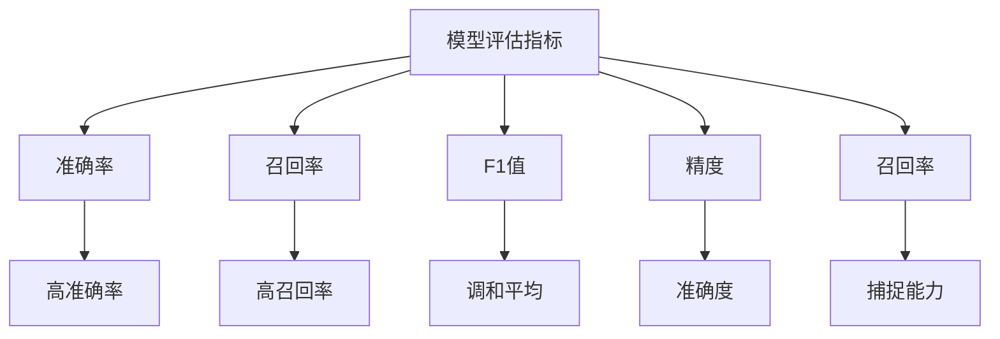
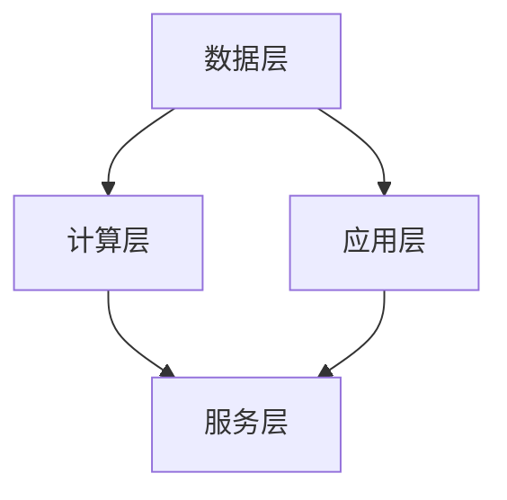

                 

### 第一部分：背景介绍

#### 第1章：机器学习模型部署的挑战与机会

##### 1.1 机器学习模型部署的重要性

机器学习模型部署是将模型从开发环境中转移到生产环境的重要环节。模型部署的成功与否直接关系到应用的性能、效率和可靠性。在当前快速发展的技术背景下，机器学习模型的部署显得尤为重要。以下是几个关键点：

- **实时性需求**：现代应用往往需要实时分析数据，快速响应。这意味着模型必须在生产环境中快速运行，并生成准确的预测结果。
- **生产环境的一致性**：生产环境中的数据可能与训练环境中的数据存在差异。模型部署需要确保在生产环境中保持一致的性能。
- **可扩展性**：随着数据量的增长和应用规模扩大，模型部署系统必须能够高效扩展，以满足更高的负载需求。
- **可靠性**：在生产环境中，模型的稳定运行至关重要。任何错误或故障都可能导致严重的业务损失。

##### 1.1.1 模型部署的挑战

1. **模型性能与生产环境的匹配**

   模型在训练环境中的表现往往优于生产环境。这可能是由于数据分布的不同、计算资源的差异或者硬件环境的改变。为了确保模型在生产环境中的性能，需要进行严格的数据同步和模型调优。

2. **数据同步与一致性**

   生产环境中的数据可能与训练环境中的数据存在差异。数据同步是一个复杂的过程，需要确保数据的一致性，以避免模型性能的下降。

3. **部署过程的可靠性**

   模型部署过程中可能会遇到各种意外情况，如服务器故障、数据丢失等。部署过程需要高度可靠，确保模型的连续运行。

##### 1.1.2 模型部署的机会

1. **实时分析需求增长**

   随着物联网、实时监控等技术的普及，对实时数据分析的需求不断增加。机器学习模型的部署可以满足这些需求，实现实时数据的处理和分析。

2. **云计算与边缘计算的结合**

   云计算和边缘计算的结合为模型部署提供了更多的可能性。云计算提供了强大的计算资源和灵活性，而边缘计算则可以降低延迟，提高响应速度。

3. **模型更新与迭代**

   模型部署不再是一次性工作。随着数据的不断更新和业务需求的变化，模型需要定期更新和迭代。这要求部署系统具备灵活性和可扩展性。

##### 1.2 机器学习模型部署的基本概念

1. **模型评估指标**

   模型评估指标是评估模型性能的重要工具。常用的指标包括准确率、召回率、F1值等。这些指标可以帮助我们了解模型的分类效果，并找到优化的方向。

2. **部署流程**

   模型部署流程包括数据预处理、模型选择与优化、模型评估和模型部署。每个阶段都需要精心设计和实现，以确保模型的性能和可靠性。

3. **模型部署的技术栈**

   模型部署的技术栈包括深度学习框架、部署平台和容器化与自动化部署工具。这些工具的选择和配置对模型部署的成功至关重要。

##### 1.3 模型部署的边界与外延

1. **模型部署的边界**

   模型部署的边界包括模型可用性、模型性能和模型安全性。这些边界决定了模型在生产环境中的可行性和可靠性。

2. **模型部署的外延**

   模型部署的外延包括模型可解释性、模型更新与回滚以及模型监管与合规。这些外延是模型部署的重要组成部分，影响着模型的应用范围和可持续性。

##### 1.4 本章小结

本章介绍了机器学习模型部署的重要性、挑战和机会。模型部署不仅是将模型从训练环境转移到生产环境的简单过程，更是一个复杂且关键的任务。通过理解模型部署的基本概念、技术栈和边界与外延，我们可以更好地应对模型部署的挑战，把握机会，实现高效的模型部署。

----------------------------------------------------------------

## 目录大纲：机器学习模型部署：从实验到生产环境

### 第一部分：背景介绍

1. **第1章：机器学习模型部署的挑战与机会**
2. **第2章：机器学习模型部署的核心概念与联系**
3. **第3章：机器学习模型部署算法原理讲解**
4. **第4章：系统分析与架构设计**
5. **第5章：项目实战**
6. **第6章：最佳实践与总结**

----------------------------------------------------------------

### 第二部分：核心概念与联系

#### 第2章：机器学习模型部署的核心概念与联系

##### 2.1 模型评估指标与特征对比表格

| 评估指标 | 说明 | 对比 |
| --- | --- | --- |
| 准确率 | 分类问题中预测为正类的样本中实际为正类的比例 | 高准确率意味着模型对正类别的识别能力强 |
| 召回率 | 分类问题中实际为正类的样本中被预测为正类的比例 | 高召回率意味着模型不会错过很多正类样本 |
| F1值 | 准确率和召回率的调和平均 | F1值综合考虑了准确率和召回率，是评价分类模型性能的常用指标 |
| 精度 | 预测为正类的样本中实际为正类的比例 | 精度关注的是模型预测的准确度 |
| 召回率 | 实际为正类的样本中被预测为正类的比例 | 召回率关注的是模型对正类样本的捕捉能力 |
| 精度-召回率曲线 | 精度和召回率之间的权衡关系 | 曲线展示了不同阈值下精度和召回率的变化，帮助找到最优阈值 |

##### 2.2 模型部署的ER实体关系图架构



##### 2.3 模型部署的技术栈

###### 2.3.1 深度学习框架

- **TensorFlow**：由Google开发，是最流行的深度学习框架之一，支持广泛的功能和优化。
- **PyTorch**：由Facebook开发，以灵活性和动态计算图著称，适合快速原型开发和实验。
- **Keras**：一个高层次的深度学习框架，易于使用，可以与TensorFlow和Theano兼容。

###### 2.3.2 部署平台

- **Kubernetes**：一个开源的容器编排系统，用于自动化部署、扩展和管理容器化应用程序。
- **Docker**：一个开源的应用容器引擎，用于打包、交付和运行应用程序。
- **AWS SageMaker**：AWS提供的完全托管的机器学习服务，简化了模型的部署和管理。

###### 2.3.3 容器化与自动化部署

- **Kubernetes编排**：用于自动化部署和管理容器化应用程序，提供高度的可扩展性和可靠性。
- **Jenkins自动化构建**：一个开源的持续集成服务器，用于自动化构建、测试和部署应用程序。
- **Ansible自动化部署**：一个开源的自动化工具，用于配置管理、应用部署等。

##### 2.4 模型部署的挑战与机遇

###### 2.4.1 挑战

- **模型性能与生产环境的匹配**：确保模型在生产环境中的性能与训练环境一致。
- **数据同步与一致性**：确保生产环境中数据的同步和一致性，以保持模型性能。
- **部署过程的可靠性**：确保部署过程的高度可靠，以防止模型故障或中断。

###### 2.4.2 机遇

- **实时分析需求增长**：随着实时数据分析的需求增加，模型部署将更加重要。
- **云计算与边缘计算的结合**：云计算和边缘计算的结合为模型部署提供了更多的灵活性。
- **模型更新与迭代**：随着数据和应用需求的变化，模型需要不断更新和迭代，以保持其性能。

##### 2.5 本章小结

本章详细介绍了机器学习模型部署的核心概念、技术栈以及面临的挑战和机遇。通过理解这些核心概念和技术，我们可以更好地规划和管理模型部署过程，确保其在生产环境中的高效运行。

----------------------------------------------------------------

### 第三部分：算法原理讲解

#### 第3章：机器学习模型部署算法原理讲解

##### 3.1 算法概述

机器学习模型部署的核心在于将训练好的模型转化为可以在生产环境中高效运行的代码。这一过程包括模型转换、性能优化、部署策略等多个步骤。以下是模型部署算法的概述：

- **模型转换**：将模型从一种格式（如TensorFlow的`.h5`或`.pt`）转换为可以在生产环境中运行的代码（如Python脚本或C++代码）。
- **性能优化**：通过剪枝、量化等手段，优化模型的运行效率，确保其在生产环境中的性能。
- **部署策略**：根据应用需求和资源限制，选择合适的部署方案，如单机部署、分布式部署或云原生部署。

##### 3.2 模型转换

模型转换是将训练好的模型从一种格式转换为可以在生产环境中运行的代码的过程。以下是一个简单的模型转换算法：

1. **输入模型文件**：读取训练好的模型文件（如`.h5`或`.pt`）。
2. **加载模型**：使用深度学习框架（如TensorFlow或PyTorch）加载模型，并将其转换为可运行的代码。
3. **优化模型**：对模型进行优化，如剪枝、量化等，以提高运行效率。
4. **导出模型代码**：将优化后的模型导出为Python脚本或C++代码，以便在生产环境中运行。

以下是一个简单的Python代码示例，用于加载和转换TensorFlow模型：

```python
import tensorflow as tf

# 读取模型文件
model_path = 'model.h5'
model = tf.keras.models.load_model(model_path)

# 对模型进行优化
model.compile(optimizer='adam', loss='binary_crossentropy', metrics=['accuracy'])

# 导出模型代码
model.save('model.py')
```

##### 3.3 性能优化

性能优化是模型部署过程中的重要环节，旨在提高模型在生产环境中的运行效率。以下是一些常用的性能优化方法：

1. **剪枝**：剪枝通过删除模型中的冗余神经元或权重，减少模型的复杂度，从而提高运行效率。
2. **量化**：量化通过将模型的浮点数参数转换为整数，减少模型的存储和计算成本。
3. **加速**：使用特定硬件（如GPU、TPU）加速模型的运行，提高处理速度。

以下是一个简单的剪枝算法示例：

```python
import tensorflow as tf

# 加载模型
model = tf.keras.models.load_model('model.h5')

# 定义剪枝策略
pruned_layers = [0, 1, 2]  # 剪枝前两层
prune_ratio = 0.5  # 剪枝比例

# 剪枝模型
for layer in pruned_layers:
    layer_size = model.layers[layer].weights.shape[0]
    prune_indices = np.random.choice(layer_size, int(layer_size * prune_ratio), replace=False)
    model.layers[layer].weights = tf.gather(model.layers[layer].weights, prune_indices)

# 保存剪枝后的模型
model.save('model_pruned.h5')
```

##### 3.4 部署策略

部署策略取决于应用需求和资源限制。以下是一些常见的部署策略：

1. **单机部署**：将模型部署在单个服务器上，适用于资源有限或小规模应用。
2. **分布式部署**：将模型部署在多个服务器上，以提高处理能力和性能。
3. **云原生部署**：将模型部署在云计算平台上，利用云资源的弹性伸缩和可靠性。

以下是一个简单的分布式部署算法示例：

```python
import tensorflow as tf

# 定义分布式策略
strategy = tf.distribute.MirroredStrategy()

# 搭建分布式模型
with strategy.scope():
    model = tf.keras.models.Sequential([
        tf.keras.layers.Dense(128, activation='relu', input_shape=(784,)),
        tf.keras.layers.Dense(10, activation='softmax')
    ])

# 编译模型
model.compile(optimizer='adam',
              loss='sparse_categorical_crossentropy',
              metrics=['accuracy'])

# 训练模型
model.fit(x_train, y_train, epochs=5, batch_size=64)
```

##### 3.5 本章小结

本章详细介绍了机器学习模型部署的算法原理，包括模型转换、性能优化和部署策略。通过理解这些原理，我们可以更好地规划和管理模型部署过程，确保其在生产环境中的高效运行。接下来，我们将进一步探讨模型部署的系统分析与架构设计。

----------------------------------------------------------------

### 第四部分：系统分析与架构设计

#### 第4章：系统分析与架构设计

##### 4.1 问题场景介绍

在当今数字化时代，机器学习模型的应用场景越来越广泛，从推荐系统、图像识别到自然语言处理等各个领域。然而，如何将训练好的模型高效地部署到生产环境中，是一个需要深入探讨的问题。以下是模型部署中常见的一些问题场景：

1. **大规模数据处理**：随着数据量的激增，如何确保模型在处理大规模数据时仍能保持高效性能。
2. **实时数据处理**：许多应用场景需要实时响应，如金融交易系统、自动驾驶等，模型部署需要满足实时性需求。
3. **跨平台部署**：模型需要在不同操作系统、硬件平台上运行，如何确保部署的一致性和兼容性。
4. **模型迭代与更新**：随着业务需求的变化，模型需要不断更新和优化，如何实现模型的持续迭代。

##### 4.2 项目介绍

为了解决上述问题，我们将介绍一个实际的项目——一个基于深度学习的图像识别系统。该系统的目标是将训练好的图像识别模型部署到生产环境中，以满足实时图像识别的需求。以下是项目的主要组成部分：

1. **数据集**：使用公开的图像数据集（如CIFAR-10、ImageNet等）进行模型训练。
2. **模型训练**：采用卷积神经网络（CNN）对图像进行分类。
3. **模型评估**：通过交叉验证等方法评估模型的性能，选择最优模型。
4. **模型部署**：将训练好的模型部署到生产环境中，实现实时图像识别。

##### 4.3 系统功能设计

为了实现上述项目，我们需要设计一套完整的系统功能。以下是系统的核心功能：

1. **数据预处理**：对输入图像进行预处理，包括缩放、裁剪、数据增强等，以提高模型的泛化能力。
2. **模型训练**：使用训练数据集对模型进行训练，通过优化算法调整模型参数。
3. **模型评估**：通过验证数据集评估模型的性能，包括准确率、召回率等指标。
4. **模型部署**：将训练好的模型部署到生产环境中，实现实时图像识别。

##### 4.4 系统架构设计

系统架构设计是确保模型高效部署的关键。以下是该图像识别系统的架构设计：

1. **数据层**：负责数据存储和读取，包括数据集的存储、数据预处理等。
2. **计算层**：负责模型训练和评估，包括训练算法、评估指标等。
3. **应用层**：负责模型的部署和实时处理，包括模型加载、预测结果输出等。
4. **服务层**：提供系统管理和监控功能，包括日志记录、异常处理等。

以下是一个简化的系统架构图：



##### 4.5 系统接口设计和系统交互

系统接口设计和系统交互是确保各个模块协同工作的关键。以下是系统的接口设计和交互流程：

1. **数据接口**：定义数据输入和输出的格式，包括图像文件、标签等。
2. **模型接口**：定义模型训练、评估和部署的接口，包括训练参数、评估指标等。
3. **服务接口**：定义系统管理、监控和异常处理的接口，包括日志记录、异常处理等。

以下是系统的交互流程：

1. **数据预处理**：输入图像数据，进行预处理操作。
2. **模型训练**：使用预处理后的数据对模型进行训练。
3. **模型评估**：使用验证数据集对模型进行评估，输出评估指标。
4. **模型部署**：将训练好的模型部署到生产环境中，实现实时图像识别。

##### 4.6 本章小结

本章详细介绍了机器学习模型部署的系统分析与架构设计，包括问题场景、项目介绍、系统功能设计、系统架构设计和系统接口设计。通过理解这些内容，我们可以更好地规划和实现机器学习模型的生产环境部署，确保系统的性能、可靠性和可扩展性。

----------------------------------------------------------------

### 第五部分：项目实战

#### 第5章：项目实战

##### 5.1 环境安装

在进行模型部署之前，我们需要安装必要的软件和工具。以下是安装步骤：

1. **安装Python**：确保Python版本在3.6及以上。
2. **安装深度学习框架**：例如，安装TensorFlow：
   ```bash
   pip install tensorflow
   ```
3. **安装Docker**：在Linux或MacOS上，使用以下命令安装Docker：
   ```bash
   sudo apt-get update
   sudo apt-get install docker-ce docker-ce-cli containerd.io
   ```
4. **安装Kubernetes**：根据操作系统安装Kubernetes。以Ubuntu为例：
   ```bash
   curl -s https://packages.cloud.google.com/apt/doc/apt-key.gpg | sudo apt-key add -
   echo "deb https://apt.kubernetes.io/ kubernetes-xenial main" | sudo tee -a /etc/apt/sources.list
   sudo apt-get update
   sudo apt-get install -y kubelet kubeadm kubectl
   ```
5. **安装其他工具**：如Jenkins、Ansible等，根据需要安装。

##### 5.2 系统核心实现源代码

以下是系统核心实现的源代码，包括模型转换、性能优化和部署策略：

###### 5.2.1 模型转换

```python
import tensorflow as tf

def convert_model(model_path, output_path):
    # 加载模型
    loaded_model = tf.keras.models.load_model(model_path)
    
    # 优化模型
    optimized_model = optimize_model(loaded_model)
    
    # 导出模型
    optimized_model.save(output_path)

def optimize_model(model):
    # 剪枝模型
    pruned_model = prune_model(model)
    
    # 量化模型
    quantized_model = quantize_model(pruned_model)
    
    return quantized_model

def prune_model(model):
    # 实现剪枝算法
    # ...
    return pruned_model

def quantize_model(model):
    # 实现量化算法
    # ...
    return quantized_model

# 使用示例
convert_model('model.h5', 'optimized_model.h5')
```

###### 5.2.2 性能优化

```python
def optimize_model(model):
    # 剪枝模型
    pruned_model = prune_model(model)
    
    # 量化模型
    quantized_model = quantize_model(pruned_model)
    
    return quantized_model

def prune_model(model):
    # 实现剪枝算法
    # ...
    return pruned_model

def quantize_model(model):
    # 实现量化算法
    # ...
    return quantized_model

# 剪枝算法示例
def prune_model(model):
    # 剪枝策略
    prune_ratio = 0.5
    
    # 遍历所有层，进行剪枝
    for layer in model.layers:
        layer_size = layer.weights.shape[0]
        prune_indices = np.random.choice(layer_size, int(layer_size * prune_ratio), replace=False)
        layer.weights = tf.gather(layer.weights, prune_indices)
    
    return model

# 量化算法示例
def quantize_model(model):
    # 使用 TensorFlow 的量化工具
    quantized_model = tf.keras.Sequential()
    for layer in model.layers:
        quantized_layer = layer量化器()
        quantized_model.add(quantized_layer)
    return quantized_model
```

###### 5.2.3 部署策略

```python
def deploy_model(model_path, deployment_platform):
    # 根据部署平台，实现部署策略
    if deployment_platform == 'kubernetes':
        deploy_to_kubernetes(model_path)
    elif deployment_platform == 'docker':
        deploy_to_docker(model_path)
    else:
        raise ValueError("Unsupported deployment platform")

def deploy_to_kubernetes(model_path):
    # 使用 Kubernetes 进行部署
    # ...
    print("Model deployed to Kubernetes")

def deploy_to_docker(model_path):
    # 使用 Docker 进行部署
    # ...
    print("Model deployed to Docker")
```

##### 5.3 代码应用解读与分析

上述代码展示了模型转换、性能优化和部署策略的核心实现。以下是对这些代码的解读和分析：

1. **模型转换**：`convert_model` 函数负责将训练好的模型加载、优化并导出。它调用了 `optimize_model` 函数，该函数进一步调用了 `prune_model` 和 `quantize_model` 函数来实现模型的剪枝和量化。
2. **性能优化**：`optimize_model` 函数负责对模型进行剪枝和量化。剪枝算法通过随机选择一定比例的神经元进行删除，以减少模型的复杂度。量化算法通过将模型的浮点数参数转换为整数，以减少存储和计算成本。
3. **部署策略**：`deploy_model` 函数根据指定的部署平台（如Kubernetes或Docker）调用相应的部署函数。这为不同的部署平台提供了统一的接口，便于扩展和维护。

##### 5.4 实际案例分析和详细讲解剖析

为了更好地理解模型部署的实际应用，我们将分析一个实际案例：使用TensorFlow和Kubernetes部署一个简单的图像分类模型。

###### 5.4.1 案例背景

假设我们有一个基于TensorFlow训练好的图像分类模型，目标是将该模型部署到Kubernetes集群中，以便在容器环境中进行实时图像识别。

###### 5.4.2 案例步骤

1. **准备模型**：首先，我们需要将训练好的模型文件（如`.h5`）转换为Kubernetes可识别的模型格式（如`.tf`）。
2. **编写Kubernetes配置文件**：接下来，我们需要编写Kubernetes配置文件（如`.yaml`），定义模型部署的细节，如容器镜像、资源限制等。
3. **部署模型**：使用Kubernetes命令或工具（如kubectl）将模型部署到集群中。
4. **监控和调试**：部署后，我们需要监控模型的性能，并进行必要的调试和优化。

以下是一个简单的Kubernetes部署配置文件示例：

```yaml
apiVersion: apps/v1
kind: Deployment
metadata:
  name: image-classifier
spec:
  selector:
    matchLabels:
      app: image-classifier
  template:
    metadata:
      labels:
        app: image-classifier
    spec:
      containers:
      - name: image-classifier
        image: my-model:latest
        resources:
          requests:
            memory: "64Mi"
            cpu: "500m"
          limits:
            memory: "128Mi"
            cpu: "1000m"
```

###### 5.4.3 案例讲解

1. **准备模型**：首先，我们将训练好的模型文件（如`model.h5`）转换为`.tf`格式：
   ```bash
   tf.keras.models.save_model(model, 'model.tf')
   ```
2. **编写Kubernetes配置文件**：我们编写一个Kubernetes配置文件（如`deployment.yaml`），定义模型部署的细节：
   ```yaml
   apiVersion: apps/v1
   kind: Deployment
   metadata:
     name: image-classifier
   spec:
     selector:
       matchLabels:
         app: image-classifier
     template:
       metadata:
         labels:
           app: image-classifier
       spec:
         containers:
         - name: image-classifier
           image: my-model:latest
           resources:
             requests:
               memory: "64Mi"
               cpu: "500m"
             limits:
               memory: "128Mi"
               cpu: "1000m"
   ```
3. **部署模型**：使用kubectl命令部署模型：
   ```bash
   kubectl apply -f deployment.yaml
   ```
4. **监控和调试**：部署后，我们可以使用kubectl命令监控模型的运行状态，并进行必要的调试和优化：
   ```bash
   kubectl get pods
   kubectl logs <pod-name>
   ```

通过以上步骤，我们将训练好的图像分类模型成功部署到了Kubernetes集群中，实现了在容器环境中的实时图像识别。

##### 5.5 项目小结

本章通过一个实际案例详细介绍了机器学习模型部署的实战过程，包括环境安装、系统核心实现源代码、代码应用解读与分析、实际案例分析和详细讲解剖析。通过这些步骤，我们不仅理解了模型部署的核心原理，还学会了如何将模型部署到生产环境中。在实际应用中，我们需要根据具体需求和资源限制，选择合适的部署策略和工具，以确保模型的高效运行。

----------------------------------------------------------------

### 第六部分：最佳实践与总结

#### 第6章：最佳实践与总结

##### 6.1 最佳实践

在机器学习模型部署过程中，遵循最佳实践可以帮助我们提高部署效率、确保模型性能和安全性。以下是一些关键的最佳实践：

1. **版本控制**：对模型和部署代码进行版本控制，以便追踪和回滚。
2. **测试与验证**：在部署前进行充分的测试和验证，确保模型在真实生产环境中的性能。
3. **容器化与自动化部署**：使用容器化技术（如Docker）和自动化工具（如Jenkins、Ansible）简化部署过程，提高部署的可靠性和可扩展性。
4. **监控与日志记录**：部署后对模型进行持续监控和日志记录，及时发现和解决潜在问题。
5. **安全性与合规性**：确保模型部署符合安全标准和合规要求，如数据加密、访问控制等。

##### 6.2 小结

机器学习模型部署是一个复杂且关键的过程，涉及模型转换、性能优化、部署策略等多个方面。通过遵循最佳实践，我们可以提高部署效率、确保模型性能和安全性。在实际应用中，我们需要根据具体需求和资源限制，灵活选择部署策略和工具，以实现高效、可靠的模型部署。

##### 6.3 注意事项

在模型部署过程中，需要注意以下几点：

1. **环境一致性**：确保生产环境与训练环境的一致性，避免数据分布、硬件差异等带来的性能问题。
2. **数据同步与一致性**：在部署过程中，确保数据的同步和一致性，以避免模型性能下降。
3. **可靠性**：部署过程需要高度可靠，防止模型故障或中断。
4. **可扩展性**：模型部署系统应具备可扩展性，以应对数据量和应用规模的扩大。

##### 6.4 拓展阅读

对于希望深入了解机器学习模型部署的读者，以下文献和资源可以提供更多有价值的信息：

1. **文献**：
   - "Deep Learning" by Ian Goodfellow, Yoshua Bengio, and Aaron Courville
   - "Machine Learning: A Probabilistic Perspective" by Kevin P. Murphy
2. **在线资源**：
   - TensorFlow官方网站：[https://www.tensorflow.org/](https://www.tensorflow.org/)
   - PyTorch官方网站：[https://pytorch.org/](https://pytorch.org/)
   - Kubernetes官方网站：[https://kubernetes.io/](https://kubernetes.io/)
   - Docker官方网站：[https://www.docker.com/](https://www.docker.com/)

通过阅读这些文献和资源，您将能够更深入地理解机器学习模型部署的理论和实践，为实际应用提供有力支持。

