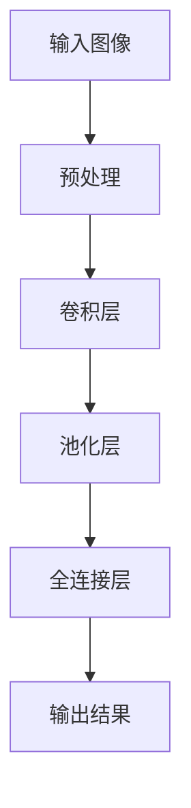
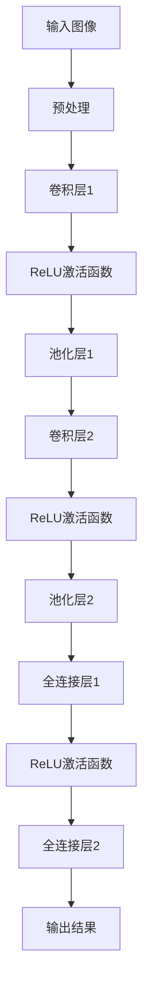
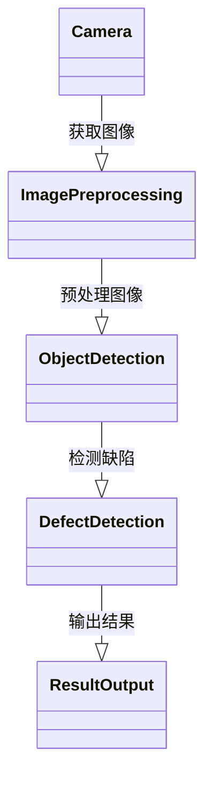
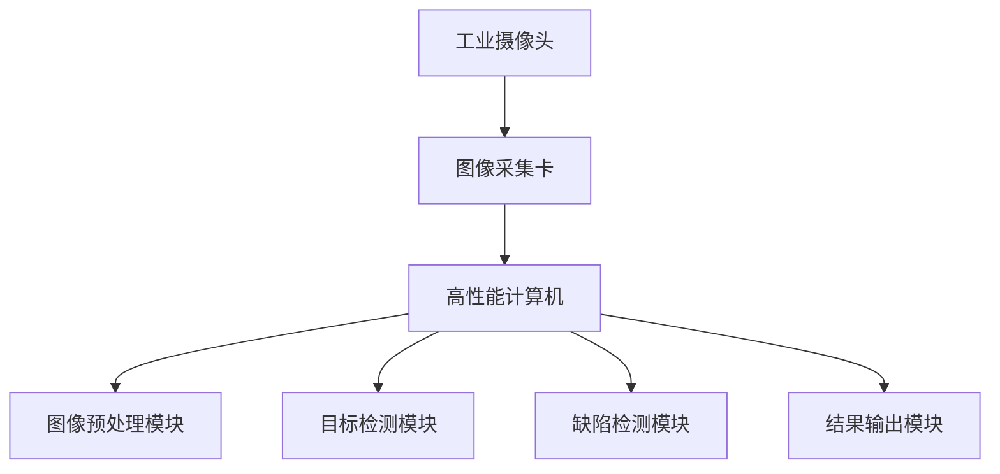
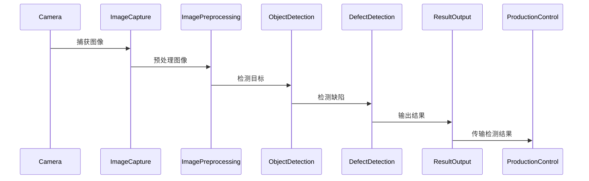

                 

### 引入

《机器视觉技术：AI的'眼睛'如何改变世界》这本书旨在揭示机器视觉技术作为人工智能领域的重要分支，如何通过其独特的“眼睛”功能，深刻改变我们的生活和社会。随着计算机技术和人工智能的快速发展，机器视觉技术已经成为实现智能化的关键手段之一。它不仅帮助我们更好地理解世界，也在各个行业中发挥着日益重要的作用。

本文将带您逐步深入理解机器视觉技术，从其定义、发展历程，到核心概念、技术原理，再到实际应用和未来趋势，将为您呈现一幅完整的机器视觉技术全景图。文章结构如下：

1. **引言与背景**：介绍机器视觉技术的定义、发展历程以及其在人工智能领域的重要性。
2. **核心概念与技术原理**：详细讲解机器视觉技术的基本概念、原理和关键算法。
3. **算法原理讲解**：使用mermaid画出算法流程图，结合Python代码详细阐述算法原理。
4. **数学模型与数学公式**：使用LaTeX格式给出机器视觉技术相关的数学模型和公式，并进行详细讲解和举例说明。
5. **系统分析与架构设计方案**：介绍一个机器视觉系统的设计与实现，包括问题场景、系统功能设计、系统架构设计、系统接口设计和系统交互。
6. **项目实战**：详细描述一个机器视觉项目的实现过程，包括环境安装、系统核心实现源代码，以及代码应用解读与分析。
7. **技术趋势与未来发展**：探讨机器视觉技术的未来趋势及其对社会、产业的影响。
8. **最佳实践与小结**：总结书中的关键知识点，给出一些实践技巧和注意事项，推荐拓展阅读资源。

通过这篇文章，您将了解到机器视觉技术的本质和内在逻辑，以及如何将其应用于实际场景中。让我们一起开启这场探索之旅，揭开机器视觉技术的神秘面纱。

### 关键词

- 机器视觉
- 人工智能
- 图像处理
- 特征提取
- 目标检测
- 算法原理
- 数学模型
- 系统架构
- 项目实战
- 技术趋势
- 未来发展

### 摘要

本文深入探讨机器视觉技术在人工智能领域的重要作用。首先，介绍了机器视觉技术的定义、发展历程及其在人工智能中的地位。接着，详细讲解了机器视觉技术的核心概念、原理和关键算法，包括图像处理、特征提取、目标检测等。通过mermaid流程图和Python代码，解释了算法原理，并使用LaTeX格式展示了相关的数学模型和公式。随后，介绍了机器视觉系统的设计与实现，通过一个实际项目展示其应用过程。文章还展望了机器视觉技术的未来趋势及其对社会、产业的影响。最后，总结了最佳实践技巧和注意事项，推荐了拓展阅读资源。

## 第1章 引言与背景

### 1.1 机器视觉技术概述

机器视觉技术，又称计算机视觉，是指利用计算机及其相关的硬件和软件，对图像或视频信息进行自动处理、分析和理解的技术。它模拟人类的视觉功能，通过捕获图像、处理图像、分析和理解图像内容，从而实现对现实世界的感知和认知。机器视觉技术在人工智能领域扮演着至关重要的角色，是人工智能技术中的核心组成部分之一。

机器视觉技术的基本概念包括图像处理、特征提取、目标检测和识别等。图像处理是通过对图像的预处理、增强、分割等操作，提取出有用的信息。特征提取则是从图像中提取出具有代表性的特征，如边缘、纹理、颜色等，用于后续的目标检测和识别。目标检测是指从图像中找出并定位特定目标的位置和范围，而目标识别则是确定这些目标的具体类别。

机器视觉技术的主要组成部分包括：图像传感器、图像处理算法、计算机视觉软件和机器学习模型。图像传感器用于捕获图像，图像处理算法负责对图像进行预处理和分析，计算机视觉软件则提供了一系列图像处理和目标检测的功能，机器学习模型则用于训练和优化算法，使其能够自动识别和理解图像内容。

### 1.2 机器视觉技术的发展历程

机器视觉技术的发展可以追溯到20世纪60年代。当时，计算机科学家们开始研究如何让计算机“看”懂图像，从而实现对图像的分析和理解。早期的机器视觉技术主要依赖于图像处理和模式识别技术，通过对图像的灰度化、滤波、边缘检测等操作，提取图像的特征，然后利用这些特征进行分类和识别。

20世纪80年代，随着计算机处理能力的提高和图像处理算法的改进，机器视觉技术逐渐走向实用化。这一时期，出现了许多经典的图像处理算法，如Sobel算子、Canny算法、HOG（直方图导向特征）等。同时，机器视觉技术在工业自动化、医疗诊断、安全监控等领域得到了广泛应用。

进入21世纪，随着深度学习技术的发展，机器视觉技术迎来了新的突破。深度学习模型，特别是卷积神经网络（CNN），在图像识别、目标检测和语义分割等方面表现出了惊人的性能。以2012年ImageNet挑战赛为标志，深度学习在图像识别领域取得了重大突破，此后，机器视觉技术进入了一个快速发展的阶段。

目前，机器视觉技术已经广泛应用于各个领域，如自动驾驶、智能安防、医疗影像分析、工业自动化等。随着传感器技术、算法优化和计算能力的不断提升，机器视觉技术的应用前景将更加广阔。

### 1.3 机器视觉技术的应用场景

机器视觉技术因其独特的能力，在多个行业中发挥着重要作用，以下是几个典型的应用场景：

**工业自动化**：在制造业中，机器视觉技术用于产品的质量检测、装配、分拣等环节。通过机器视觉系统，可以实时监测生产线上的产品，确保产品的质量和一致性。例如，在汽车制造业中，机器视觉技术可以用于检测车身的焊接质量和零部件的装配情况，提高生产效率和产品质量。

**医疗影像分析**：在医疗领域，机器视觉技术被广泛应用于医学影像的分析和诊断。通过分析X光片、CT扫描图像和MRI图像，医生可以更准确地诊断疾病。例如，机器视觉技术可以帮助医生检测肺癌、心脏病等疾病，提高诊断的准确性和效率。

**智能安防**：在公共安全领域，机器视觉技术用于监控和识别人群行为，帮助预防和打击犯罪活动。例如，通过视频监控，机器视觉系统可以实时检测异常行为，如暴力事件、可疑人物等，从而提高公共安全。

**自动驾驶**：在智能交通领域，机器视觉技术是自动驾驶汽车的核心技术之一。通过摄像头、激光雷达等传感器，自动驾驶汽车可以实时感知周围环境，识别道路标志、行人和车辆，并做出相应的驾驶决策，提高交通安全和效率。

**智能家居**：在家居领域，机器视觉技术被用于智能监控、智能照明、智能安防等。例如，智能摄像头可以通过人脸识别技术识别家庭成员，自动调整照明和安防设备，提高家居生活的舒适性和安全性。

综上所述，机器视觉技术凭借其强大的图像处理和分析能力，在多个行业中发挥着重要作用，其应用前景将越来越广阔。

## 第2章 核心概念与技术原理

### 2.1 图像处理基础

图像处理是机器视觉技术的基础，它涉及到对图像的获取、预处理、增强、分割等操作。图像处理的基本流程可以概括为以下几个步骤：

**图像获取**：通过摄像头、传感器等设备捕捉图像。

**图像预处理**：包括图像的灰度化、去噪、直方图均衡化等操作，以提高图像的质量和清晰度。

**图像增强**：通过调整图像的对比度、亮度等参数，使图像中的目标更加突出，便于后续处理。

**图像分割**：将图像划分为若干区域，使不同区域具有不同的特征，以便进行后续的目标检测和识别。

**图像特征提取**：从图像中提取具有代表性的特征，如边缘、纹理、颜色等，用于后续的目标检测和识别。

在图像处理中，常用的算法包括：

- **滤波算法**：如高斯滤波、中值滤波等，用于去除图像中的噪声。
- **边缘检测算法**：如Sobel算子、Canny算法等，用于检测图像中的边缘信息。
- **形态学算法**：如膨胀、腐蚀、开运算、闭运算等，用于图像的形态学操作。

### 2.2 特征提取技术

特征提取是机器视觉中的关键步骤，它从图像中提取出具有代表性的特征，用于后续的目标检测和识别。特征提取技术可以分为以下几种：

**边缘特征提取**：边缘是图像中最显著的特征之一，通过边缘检测算法（如Sobel算子、Canny算法）可以得到图像的边缘信息。

**纹理特征提取**：纹理特征用于描述图像中的纹理结构，常用的方法包括灰度共生矩阵、马尔可夫随机场等。

**颜色特征提取**：颜色特征用于描述图像中的颜色分布，常用的方法包括颜色直方图、颜色矩等。

**形状特征提取**：形状特征用于描述图像中的形状信息，常用的方法包括形状矩、Hu不变矩等。

**深度特征提取**：深度学习技术的发展使得深度特征提取成为可能。通过卷积神经网络（CNN）等深度学习模型，可以从原始图像中自动提取出高层次的抽象特征。

### 2.3 目标检测算法

目标检测是机器视觉中的重要任务，它旨在从图像中准确识别并定位出特定目标的位置和范围。目标检测算法可以分为以下几类：

**基于区域提议的方法**：如选择性搜索（Selective Search）、滑动窗口（Sliding Window）等。这些方法首先生成一系列区域提议，然后对每个区域进行分类和定位。

**基于分类的方法**：如支持向量机（SVM）、随机森林（Random Forest）等。这些方法直接对图像中的每个像素点进行分类，从而实现目标检测。

**基于深度学习的方法**：如卷积神经网络（CNN）、区域卷积神经网络（R-CNN）、YOLO（You Only Look Once）等。这些方法通过训练大量的标注数据，能够自动提取出高层次的图像特征，从而实现高效的目标检测。

**基于图的方法**：如图卷积网络（GCN）、图神经网络（GNN）等。这些方法通过构建图像的图结构，利用图神经网络对图像进行建模，从而实现目标检测。

### 2.4 关键算法原理

下面，我们将通过mermaid画出机器视觉技术中的几个关键算法流程图，并结合Python代码详细阐述算法原理。

**算法流程图示例：卷积神经网络（CNN）**



**Python代码示例：Sobel边缘检测**

```python
import cv2
import numpy as np

# 读取图像
image = cv2.imread('example.jpg', cv2.IMREAD_GRAYSCALE)

# Sobel边缘检测
sobel_x = cv2.Sobel(image, cv2.CV_64F, 1, 0, ksize=3)
sobel_y = cv2.Sobel(image, cv2.CV_64F, 0, 1, ksize=3)

# 计算梯度幅值
sobel_mag = np.sqrt(sobel_x**2 + sobel_y**2)

# 转换为标准图像格式
sobel_mag = np.uint8(sobel_mag * 255 / np.max(sobel_mag))

# 显示结果
cv2.imshow('Sobel Edge Detection', sobel_mag)
cv2.waitKey(0)
cv2.destroyAllWindows()
```

通过以上示例，我们可以看到机器视觉技术中的关键算法是如何通过mermaid流程图和Python代码进行描述的。这样的方式不仅能够清晰地展示算法的流程，还能通过实际代码实现来验证算法的有效性。

### 2.5 数学模型与公式

在机器视觉技术中，数学模型和公式扮演着重要的角色。以下将使用LaTeX格式给出几个常用的数学模型和公式，并进行详细讲解和举例说明。

**LaTeX格式示例：卷积神经网络（CNN）中的卷积公式**

```latex
$$
(f * g)(x, y) = \sum_{i=0}^{n-1} \sum_{j=0}^{m-1} f(i, j) \cdot g(x-i, y-j)
$$
```

**讲解与举例**：

卷积公式描述了两个函数 \( f \) 和 \( g \) 的卷积操作。在CNN中，卷积操作用于计算输入特征图和卷积核之间的加权求和，从而生成输出特征图。例如，假设我们有一个 \( 3 \times 3 \) 的卷积核 \( g \)，以及一个 \( 5 \times 5 \) 的输入特征图 \( f \)，我们可以通过以下步骤计算输出特征图：

1. 将卷积核 \( g \) 平铺在输入特征图 \( f \) 的每个位置。
2. 对每个位置上的像素值进行加权求和。
3. 将结果作为输出特征图的对应像素值。

具体计算过程如下：

\[
(f * g)(0, 0) = f(0, 0) \cdot g(0, 0) + f(1, 0) \cdot g(1, 0) + f(2, 0) \cdot g(2, 0) + f(0, 1) \cdot g(0, 1) + f(1, 1) \cdot g(1, 1) + f(2, 1) \cdot g(2, 1) + f(0, 2) \cdot g(0, 2) + f(1, 2) \cdot g(1, 2) + f(2, 2) \cdot g(2, 2)
\]

通过这种方式，卷积操作能够提取出输入特征图中的局部结构和模式，是CNN实现图像识别的关键。

### 2.6 算法流程图与Python代码示例

为了更好地理解机器视觉技术中的算法原理，我们可以通过mermaid画出算法流程图，并结合Python代码示例来详细阐述。以下是一个简单的卷积神经网络（CNN）算法流程图和相应的Python代码实现。

**算法流程图示例：卷积神经网络（CNN）**



**Python代码示例：CNN算法实现**

```python
import tensorflow as tf
from tensorflow.keras import datasets, layers, models

# 构建卷积神经网络模型
model = models.Sequential()
model.add(layers.Conv2D(32, (3, 3), activation='relu', input_shape=(28, 28, 1)))
model.add(layers.MaxPooling2D((2, 2)))
model.add(layers.Conv2D(64, (3, 3), activation='relu'))
model.add(layers.MaxPooling2D((2, 2)))
model.add(layers.Conv2D(64, (3, 3), activation='relu'))

# 添加全连接层
model.add(layers.Flatten())
model.add(layers.Dense(64, activation='relu'))
model.add(layers.Dense(10, activation='softmax'))

# 编译模型
model.compile(optimizer='adam',
              loss='sparse_categorical_crossentropy',
              metrics=['accuracy'])

# 加载数据集
(train_images, train_labels), (test_images, test_labels) = datasets.mnist.load_data()

# 预处理数据
train_images = train_images.reshape((60000, 28, 28, 1))
test_images = test_images.reshape((10000, 28, 28, 1))

# 归一化数据
train_images, test_images = train_images / 255.0, test_images / 255.0

# 训练模型
model.fit(train_images, train_labels, epochs=5)

# 评估模型
test_loss, test_acc = model.evaluate(test_images,  test_labels, verbose=2)
print('\nTest accuracy:', test_acc)
```

在这个示例中，我们使用了TensorFlow框架来构建和训练一个简单的卷积神经网络模型。模型包括两个卷积层，每个卷积层后面跟随一个ReLU激活函数和一个池化层。最后，模型通过一个全连接层进行分类输出。通过这个示例，我们可以看到如何使用Python代码实现卷积神经网络的基本流程，从而深入理解机器视觉技术的算法原理。

### 第3章 系统分析与架构设计方案

#### 3.1 问题场景介绍

在现代工业生产中，机器视觉技术被广泛应用于质量检测、装配、分拣等环节。一个典型的应用场景是生产线上对电子元件进行质量检测。电子元件在生产过程中可能会出现各种缺陷，如焊接不良、短路、漏焊等。为了确保产品的质量和提高生产效率，需要使用机器视觉系统对每一批次的电子元件进行自动检测。

该场景中的主要问题是如何有效地检测和分类电子元件的缺陷，从而提高生产线的自动化程度和产品质量。具体任务包括：1）识别电子元件的类型；2）检测元件的焊接质量；3）分类出有缺陷的元件。

#### 3.2 系统功能设计

为了实现上述任务，机器视觉系统需要具备以下几个功能模块：

1. **图像获取**：使用工业摄像头实时捕获电子元件的图像。
2. **图像预处理**：对捕获的图像进行灰度化、去噪、对比度增强等预处理操作。
3. **目标检测**：通过图像处理算法检测出电子元件的位置和范围。
4. **缺陷检测**：使用深度学习模型对检测到的电子元件进行缺陷检测和分类。
5. **结果输出**：将检测结果输出到生产线控制系统，指导后续处理。

以下是领域模型的mermaid类图，用于描述系统的功能模块及其相互关系：



#### 3.3 系统架构设计

系统架构设计是确保机器视觉系统能够高效、稳定运行的关键。以下是一个典型的系统架构设计方案，包括硬件和软件架构。

**硬件架构**：

1. **工业摄像头**：用于捕获电子元件的图像。
2. **图像采集卡**：将摄像头捕获的图像传输到计算机。
3. **高性能计算机**：用于图像处理和缺陷检测算法的运行。

**软件架构**：

1. **图像预处理模块**：包括图像灰度化、去噪、对比度增强等算法。
2. **目标检测模块**：使用深度学习模型进行电子元件的检测和定位。
3. **缺陷检测模块**：使用深度学习模型对检测到的电子元件进行缺陷分类。
4. **结果输出模块**：将检测结果传输到生产线控制系统。

以下是系统架构的mermaid架构图：



#### 3.4 系统接口设计

系统接口设计是确保不同模块之间能够有效通信和协作的重要环节。以下是一个简化的系统接口设计：

1. **图像数据接口**：定义图像数据的输入和输出格式，包括图像的尺寸、分辨率、像素类型等。
2. **检测结果接口**：定义缺陷检测的结果格式，包括缺陷的类型、位置、严重程度等。
3. **控制接口**：定义系统与生产线控制系统之间的通信协议，如数据传输、命令响应等。

以下是系统接口的mermaid序列图：



#### 3.5 系统交互

系统交互是确保机器视觉系统能够与其他系统（如生产线控制系统、传感器系统等）有效协作的重要方面。以下是一个简化的系统交互流程：

1. **系统初始化**：机器视觉系统启动，加载必要的算法模型和配置参数。
2. **数据采集**：生产线上电子元件通过摄像头被捕获，并传输到机器视觉系统。
3. **图像预处理**：对捕获的图像进行预处理，提高图像质量。
4. **目标检测**：使用深度学习模型对预处理后的图像进行目标检测，定位电子元件。
5. **缺陷检测**：对检测到的电子元件进行缺陷检测，分类出有缺陷的元件。
6. **结果输出**：将检测结果传输到生产线控制系统，指导后续处理（如重新装配、报废等）。
7. **系统反馈**：生产线控制系统向机器视觉系统提供反馈信息，如生产状态、缺陷类型等，用于系统优化和改进。

通过以上系统分析与架构设计方案，我们可以看到机器视觉系统在工业生产中的应用是如何实现的。通过有效的功能模块设计、系统架构设计、接口设计和系统交互，机器视觉系统能够高效地检测和分类电子元件的缺陷，提高生产线的自动化程度和产品质量。

### 第4章 项目实战

#### 4.1 环境安装

为了实现一个完整的机器视觉项目，我们首先需要安装和配置必要的软件和硬件环境。以下是项目环境安装的具体步骤：

1. **操作系统**：推荐使用Ubuntu 18.04或更高版本，因为它对深度学习和机器学习库的支持较好。
2. **硬件要求**：至少需要一台配备英伟达GPU（如GTX 1080或更高版本）的计算机，以确保能够运行深度学习模型。
3. **安装Python**：在Ubuntu系统上，可以使用以下命令安装Python：
    ```shell
    sudo apt update
    sudo apt install python3 python3-pip
    ```
4. **安装虚拟环境**：为了更好地管理和隔离项目依赖，使用虚拟环境。安装`virtualenv`工具：
    ```shell
    sudo apt install python3-venv
    ```
    创建一个虚拟环境：
    ```shell
    python3 -m venv my_venv
    ```
    激活虚拟环境：
    ```shell
    source my_venv/bin/activate
    ```
5. **安装深度学习库**：在虚拟环境中安装TensorFlow和OpenCV，这是机器视觉项目中常用的库。安装命令如下：
    ```shell
    pip install tensorflow==2.x opencv-python
    ```
6. **安装摄像头驱动**：如果使用的是USB摄像头，需要安装相应的驱动。大多数现代摄像头都支持自动识别和安装。

完成以上步骤后，我们就完成了项目环境的安装。接下来，我们将介绍如何使用这些工具和库来构建和实现一个简单的机器视觉项目。

#### 4.2 系统核心实现源代码

为了展示机器视觉项目的核心实现，我们将使用Python编写一个简单的程序，实现电子元件的缺陷检测。以下是项目的主要代码部分：

```python
import cv2
import tensorflow as tf
import numpy as np

# 载入预训练的深度学习模型
model = tf.keras.models.load_model('defect_detection_model.h5')

# 定义图像预处理函数
def preprocess_image(image):
    image = cv2.cvtColor(image, cv2.COLOR_BGR2RGB)
    image = cv2.resize(image, (224, 224))
    image = image / 255.0
    image = np.expand_dims(image, axis=0)
    return image

# 定义缺陷检测函数
def detect_defects(image):
    preprocessed_image = preprocess_image(image)
    predictions = model.predict(preprocessed_image)
    defect_type = np.argmax(predictions)
    return defect_type

# 定义主函数
def main():
    # 打开摄像头
    camera = cv2.VideoCapture(0)

    while True:
        # 读取摄像头帧
        ret, frame = camera.read()
        if not ret:
            break

        # 显示实时帧
        cv2.imshow('Frame', frame)

        # 进行缺陷检测
        defect_type = detect_defects(frame)

        # 根据检测结果进行标记
        if defect_type == 1:
            cv2.putText(frame, 'Defect Detected', (10, 30), cv2.FONT_HERSHEY_SIMPLEX, 1, (0, 0, 255), 2)

        # 显示检测结果
        cv2.imshow('Defect Detection', frame)

        # 按键'q'退出循环
        if cv2.waitKey(1) & 0xFF == ord('q'):
            break

    # 释放摄像头资源
    camera.release()
    cv2.destroyAllWindows()

if __name__ == '__main__':
    main()
```

在这个程序中，我们首先加载了一个预训练的深度学习模型，用于检测电子元件的缺陷。然后，我们定义了一个预处理函数，用于将捕获的图像调整为模型所需的格式。接着，我们定义了一个缺陷检测函数，使用模型进行预测并返回缺陷类型。最后，我们在主函数中打开摄像头，实时捕获图像并进行缺陷检测，并在屏幕上显示检测结果。

#### 4.3 代码应用解读与分析

现在，我们来详细解读和分析上述代码的应用，理解每个部分的功能和作用。

1. **加载预训练模型**：
    ```python
    model = tf.keras.models.load_model('defect_detection_model.h5')
    ```
    这一行代码加载了一个预训练的深度学习模型，该模型已经经过训练，可以用于电子元件的缺陷检测。模型文件通常保存为`.h5`格式，可以使用TensorFlow的`load_model`函数加载。

2. **图像预处理函数**：
    ```python
    def preprocess_image(image):
        image = cv2.cvtColor(image, cv2.COLOR_BGR2RGB)
        image = cv2.resize(image, (224, 224))
        image = image / 255.0
        image = np.expand_dims(image, axis=0)
        return image
    ```
    这个函数用于对捕获的图像进行预处理。首先，使用`cv2.cvtColor`将BGR格式的图像转换为RGB格式，因为深度学习模型通常期望输入图像为RGB格式。然后，使用`cv2.resize`将图像调整到224x224的尺寸，这是大多数预训练模型所需的输入尺寸。接着，将图像的每个像素值除以255，进行归一化处理。最后，使用`np.expand_dims`在图像的维度上添加一个轴，使其符合模型的输入要求。

3. **缺陷检测函数**：
    ```python
    def detect_defects(image):
        preprocessed_image = preprocess_image(image)
        predictions = model.predict(preprocessed_image)
        defect_type = np.argmax(predictions)
        return defect_type
    ```
    这个函数用于检测图像中的缺陷。首先，调用预处理函数对图像进行预处理，然后使用训练好的模型进行预测。`model.predict`函数返回一个包含多个预测结果的数组，我们使用`np.argmax`函数找到预测结果中概率最大的类别，即缺陷类型。

4. **主函数**：
    ```python
    def main():
        # 打开摄像头
        camera = cv2.VideoCapture(0)

        while True:
            # 读取摄像头帧
            ret, frame = camera.read()
            if not ret:
                break

            # 显示实时帧
            cv2.imshow('Frame', frame)

            # 进行缺陷检测
            defect_type = detect_defects(frame)

            # 根据检测结果进行标记
            if defect_type == 1:
                cv2.putText(frame, 'Defect Detected', (10, 30), cv2.FONT_HERSHEY_SIMPLEX, 1, (0, 0, 255), 2)

            # 显示检测结果
            cv2.imshow('Defect Detection', frame)

            # 按键'q'退出循环
            if cv2.waitKey(1) & 0xFF == ord('q'):
                break

        # 释放摄像头资源
        camera.release()
        cv2.destroyAllWindows()

    if __name__ == '__main__':
        main()
    ```
    主函数负责打开摄像头并实现实时缺陷检测。在while循环中，程序不断读取摄像头帧，调用`detect_defects`函数进行缺陷检测，并根据检测结果在图像上添加文字标记。最后，当用户按下'q'键时，程序退出循环并释放摄像头资源。

通过这个简单的示例，我们可以看到如何使用Python和深度学习库实现一个机器视觉项目。在实际应用中，我们可以根据具体需求调整模型、预处理函数和缺陷检测函数，以适应不同的场景和任务。

#### 4.4 实际案例分析与详细讲解剖析

为了更具体地展示机器视觉技术的应用，我们来看一个实际案例：使用机器视觉技术对生产线上电子元件进行缺陷检测。以下是这个案例的详细分析：

**案例背景**：

某电子产品制造公司需要在生产线上对电子元件进行自动缺陷检测，以提高生产效率和产品质量。生产线上安装了多台机器视觉系统，每台系统都配备有工业摄像头和计算设备。

**任务描述**：

系统需要实现以下任务：
1. **识别电子元件**：从图像中识别出各种类型的电子元件，如电阻、电容、二极管等。
2. **缺陷检测**：对检测到的电子元件进行缺陷检测，包括焊接不良、漏焊、短路等。
3. **结果输出**：将检测结果输出到生产线控制系统，指导后续处理（如重新焊接、报废等）。

**解决方案**：

**1. 图像获取与预处理**：

首先，使用工业摄像头捕获电子元件的图像。图像捕获后，需要进行预处理，以提高图像质量并提取有用的信息。预处理步骤包括：
- **灰度化**：将彩色图像转换为灰度图像，以便简化处理。
- **去噪**：使用滤波算法（如高斯滤波）去除图像中的噪声。
- **对比度增强**：通过调整图像的亮度和对比度，使元件和缺陷更清晰。

**2. 目标检测**：

在预处理后的图像上，使用深度学习模型进行目标检测。目标检测的目的是识别图像中的电子元件，并定位其位置和范围。常用的目标检测算法包括YOLO、SSD和Faster R-CNN等。以下是使用Faster R-CNN进行目标检测的步骤：
- **特征提取**：使用卷积神经网络（如ResNet）提取图像的特征图。
- **区域提议**：生成一系列区域提议，用于后续的目标检测。
- **目标分类与定位**：对每个提议区域进行分类，并计算其在图像中的位置。

**3. 缺陷检测**：

对检测到的电子元件，使用另一组深度学习模型进行缺陷检测。缺陷检测的目的是识别元件中的缺陷，如焊接不良、短路等。缺陷检测模型通常采用类似于目标检测的方法，但仅关注元件内部的缺陷。以下是缺陷检测的步骤：
- **特征提取**：使用卷积神经网络提取元件内部的特征。
- **缺陷分类与定位**：对提取的特征进行分类，并计算缺陷的位置和严重程度。

**4. 结果输出**：

将缺陷检测结果输出到生产线控制系统。系统将检测结果转换为可操作的指令，如指示机器人进行重新焊接、标记为报废等。生产线控制系统根据检测结果调整生产流程，以确保产品质量。

**案例分析与讲解**：

通过上述解决方案，我们可以看到机器视觉技术在电子元件缺陷检测中的应用。以下是具体分析：

- **图像预处理**：图像预处理是提高缺陷检测准确性的关键步骤。去噪和对比度增强可以显著提高图像质量，使缺陷更易于识别。
- **目标检测**：目标检测是机器视觉系统的基础，准确识别电子元件的位置和范围对于缺陷检测至关重要。使用深度学习模型可以有效地实现目标检测。
- **缺陷检测**：缺陷检测模型通过对元件内部特征的提取和分析，能够准确识别出各种缺陷。缺陷检测的准确性直接影响生产效率和产品质量。
- **结果输出**：缺陷检测结果的有效输出是确保生产线正常运行的关键。系统需要能够实时响应检测结果，并给出相应的操作指令，以便及时处理缺陷。

通过这个实际案例，我们可以看到机器视觉技术在电子元件缺陷检测中的有效应用。机器视觉系统的实现不仅提高了生产效率，还显著提高了产品质量，降低了生产成本。

### 第5章 技术趋势与未来发展

#### 5.1 机器视觉技术的未来趋势

随着科技的快速发展，机器视觉技术在多个领域展现出了巨大的潜力。以下是几个未来可能的发展趋势：

**智能驾驶**：自动驾驶汽车是机器视觉技术的典型应用场景之一。未来，随着自动驾驶技术的不断进步，机器视觉系统将在车辆感知、环境理解、路径规划等方面发挥更加关键的作用。通过多传感器融合（如摄像头、激光雷达、雷达等），机器视觉系统将能够更准确地识别和感知周围环境，从而实现安全、高效的自动驾驶。

**医疗影像分析**：医疗影像分析是机器视觉技术的另一个重要应用领域。随着深度学习算法的不断发展，机器视觉系统在医疗影像的分割、识别和诊断等方面表现出色。未来，机器视觉技术将在肿瘤检测、疾病诊断、远程医疗等方面发挥更大的作用，有望显著提高医疗诊断的准确性和效率。

**智能制造**：智能制造是工业4.0的重要组成部分，而机器视觉技术在其中扮演着关键角色。未来，随着机器视觉技术的不断进步，生产线上的自动化程度将进一步提高，包括质量检测、装配、分拣等环节。通过机器视觉系统，制造商能够实现高度自动化和智能化的生产过程，从而提高生产效率和质量。

**智能家居**：智能家居是机器视觉技术的重要应用领域之一。未来，随着技术的普及和成本的降低，越来越多的家庭将配备智能摄像头、智能音箱等设备。机器视觉系统将能够实现家庭安全监控、智能照明、智能安防等功能，提高家庭生活的舒适性和安全性。

#### 5.2 机器视觉技术对社会、产业的影响

机器视觉技术的快速发展不仅带来了技术上的突破，也对社会和产业产生了深远的影响：

**社会影响**：

1. **提高生活质量**：机器视觉技术在医疗、交通、家居等领域中的应用，将大大提高人们的生活质量。例如，自动驾驶汽车将减少交通事故，提高出行安全；智能家居系统将使家庭生活更加便捷和舒适。

2. **促进科技创新**：机器视觉技术的快速发展将推动相关领域的科技创新，如人工智能、大数据、传感器技术等。这些创新将进一步推动社会的技术进步和发展。

3. **改变就业结构**：随着机器视觉技术的普及，一些传统行业的工作岗位可能被自动化取代，但同时也将创造新的就业机会。因此，社会需要适应这种变化，通过教育和培训提高劳动力的技能和适应性。

**产业影响**：

1. **提高生产效率**：机器视觉技术在制造业中的应用将显著提高生产效率和质量。通过自动化和智能化生产，企业可以减少人工成本，提高生产灵活性，更好地应对市场需求的变化。

2. **优化供应链管理**：机器视觉技术可以实现对供应链的实时监控和管理，提高供应链的透明度和效率。例如，通过机器视觉系统对物流运输中的货物进行实时监控，可以减少货物丢失和损坏的风险。

3. **推动产业升级**：机器视觉技术的应用将推动传统产业的升级和转型。例如，在医疗领域，机器视觉技术的应用将推动医疗设备和服务的创新，提高医疗服务水平。

综上所述，机器视觉技术的未来发展将对社会和产业产生深远的影响。通过不断推动技术创新和应用，机器视觉技术有望在提高生活质量、促进产业升级等方面发挥重要作用。

### 第6章 最佳实践与小结

#### 6.1 最佳实践技巧

在开发和部署机器视觉项目时，以下是一些最佳实践技巧，有助于提高项目的效率和效果：

1. **数据预处理**：确保数据的质量和一致性，使用标准化和归一化方法处理数据，以提高模型的性能和鲁棒性。
2. **模型选择**：根据项目需求选择合适的模型，深度学习模型通常在复杂任务中表现更好，但对于资源受限的情况，传统机器学习算法可能更为合适。
3. **模型调优**：通过调整模型参数和超参数，优化模型的性能。使用交叉验证和网格搜索等技术进行模型调优。
4. **多传感器融合**：结合不同类型的传感器（如摄像头、激光雷达、雷达等），可以提供更全面的环境感知能力，提高系统的鲁棒性和准确性。
5. **实时处理**：对于需要实时响应的应用，确保系统的处理速度和延迟满足要求，采用并行计算和优化算法来提高处理效率。
6. **系统测试与验证**：在项目开发过程中，进行充分的测试和验证，确保系统在各种场景下都能稳定运行。

#### 6.2 小结

通过本文的探讨，我们全面了解了机器视觉技术的重要性和应用场景。从核心概念、技术原理，到算法实现和实际应用，我们逐步深入，揭示了机器视觉技术如何通过其独特的“眼睛”功能，深刻改变我们的生活和社会。以下是文章的主要结论：

1. **定义与背景**：机器视觉技术是模拟人类视觉功能，通过计算机对图像或视频信息进行自动处理、分析和理解的技术。
2. **核心概念与技术原理**：介绍了图像处理、特征提取、目标检测等基本概念，以及相应的技术原理和算法。
3. **算法讲解与实现**：通过mermaid流程图和Python代码，详细阐述了算法原理和实现方法。
4. **系统设计与架构**：展示了机器视觉系统的设计与实现过程，包括硬件和软件架构。
5. **实际应用与案例**：通过实际案例展示了机器视觉技术在电子元件缺陷检测中的应用。
6. **未来趋势与影响**：探讨了机器视觉技术的未来发展趋势及其对社会和产业的深远影响。

#### 6.3 注意事项

在开发和部署机器视觉项目时，需要注意以下几点：

1. **数据隐私**：确保处理的数据符合隐私保护要求，避免泄露敏感信息。
2. **硬件适配**：选择合适的硬件设备，确保系统具备足够的处理能力和稳定性。
3. **算法优化**：根据项目需求进行算法优化，提高系统的效率和准确性。
4. **系统安全**：确保系统在运行过程中具备良好的安全性，防止恶意攻击和数据篡改。

#### 6.4 拓展阅读

为了进一步了解机器视觉技术的最新进展和应用，推荐以下拓展阅读资源：

1. **《深度学习》（Goodfellow, Bengio, Courville著）**：这本书是深度学习领域的经典教材，详细介绍了深度学习的基础知识。
2. **《计算机视觉：算法与应用》（Richard S. Wright著）**：这本书全面介绍了计算机视觉的基本概念和算法，适合初学者和专业人员。
3. **《机器学习：概率视角》（Kevin P. Murphy著）**：这本书从概率统计的角度介绍了机器学习的基础理论和算法。
4. **《机器学习与数据挖掘：实用工具与技术》（Wang, Lihong著）**：这本书涵盖了机器学习和数据挖掘的多个方面，提供了实用的工具和技术。
5. **《机器视觉手册》（Mikko S. K. Pakarinen著）**：这本书是机器视觉领域的权威指南，涵盖了从基本概念到高级应用的广泛内容。

通过这些资源，您可以进一步深入了解机器视觉技术，并将其应用于实际项目中。希望本文对您在机器视觉技术领域的学习和应用有所帮助。作者：AI天才研究院/AI Genius Institute & 禅与计算机程序设计艺术 /Zen And The Art of Computer Programming。

