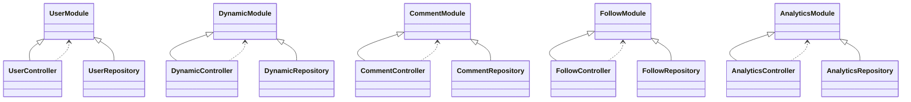
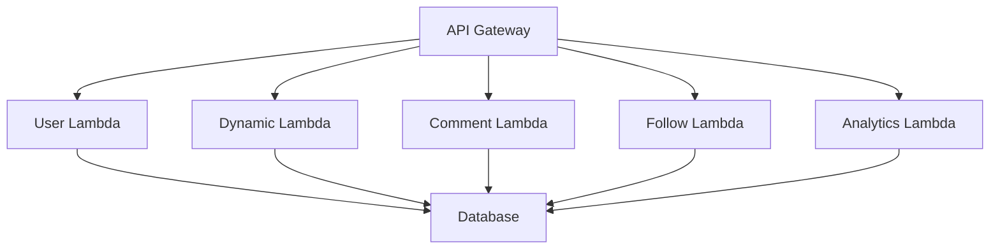
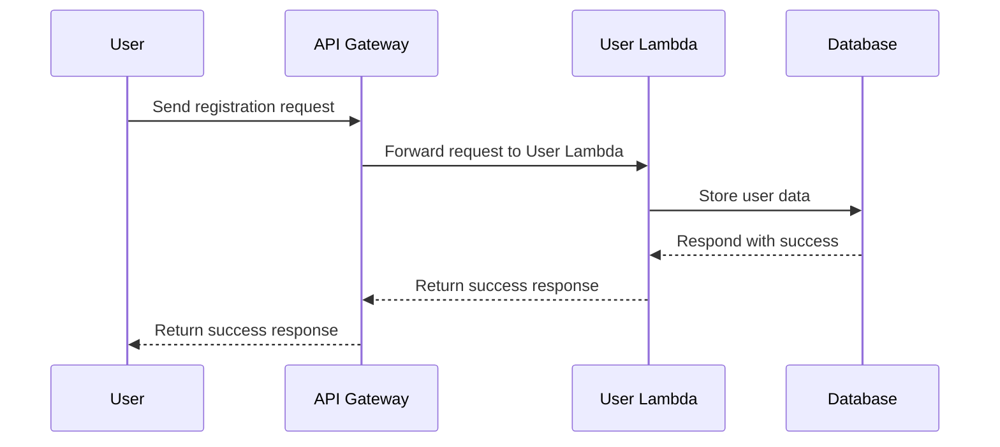

                 

## 文章标题

### 关键词

- Serverless架构
- 可扩展性
- 弹性
- 自动化
- 性能优化
- 安全性

### 摘要

本文深入探讨构建可扩展的serverless架构，从基础概念到实际应用，逐步分析并解答如何设计、部署和优化serverless系统。通过对比传统架构，详细介绍serverless架构的核心组件，如FaaS、BaaS和IaC。文章重点讨论可扩展性、弹性、自动化等设计原则，并结合实际项目展示具体实现方法和最佳实践。最后，探讨serverless架构的未来趋势及其对企业的影响，为读者提供全面的技术见解。

---

### 引言

在当今快速发展的云计算时代，服务器less架构（Serverless Architecture）以其灵活、高效和低成本的特点，逐渐成为企业和开发者关注的热点。Serverless架构的核心在于，无需关注底层硬件和基础设施的管理，而是专注于应用逻辑的开发和部署。这为开发人员带来了极大的便利，同时也提出了新的挑战，特别是在如何构建一个可扩展的serverless架构方面。

可扩展性是服务器less架构的核心要求之一，它决定了系统在面对大规模并发请求时的表现。传统的垂直和水平扩展方法在serverless架构中受到了新的挑战，因为资源管理完全由云服务提供商（如AWS、Azure和Google Cloud）负责。这使得开发人员需要重新考虑如何设计应用，以确保系统能够在负载增加时自动扩展。

此外，弹性（Resilience）和自动化（Automation）也是serverless架构设计的关键原则。弹性确保系统能够在异常情况下保持稳定运行，而自动化则通过自动化的部署、扩展和监控，提高了系统的可靠性和效率。

本文将逐步探讨这些主题，从基础概念到实际案例，帮助读者理解并掌握构建可扩展的serverless架构的方法和技巧。无论您是初学者还是经验丰富的开发人员，本文都将为您提供有价值的见解和实用的建议。

---

### serverless架构简介

#### 什么是serverless架构？

Serverless架构，顾名思义，是一种无需关注服务器管理的计算模型。在这种模型中，开发者只需编写和部署应用代码，而底层的服务器管理、资源分配和扩缩容等任务则完全由云服务提供商（CSP）负责。Serverless架构的核心思想是将计算资源抽象化，使其变得透明和易于使用。

与传统的虚拟机或容器部署方式不同，serverless架构无需关注服务器硬件的性能和容量。开发者只需关注应用逻辑的实现，这将大大提高开发效率和灵活性。Serverless架构通常包括三种核心组件：Functions as a Service (FaaS)、Backend as a Service (BaaS) 和 Infrastructure as Code (IaC)。

#### FaaS：函数即服务

FaaS是serverless架构中最常见的形式，也被称为函数即服务。在这种模型中，开发者将应用功能划分为多个独立的函数，每个函数负责完成特定的任务。这些函数通常通过HTTP请求触发，也可以通过其他方式（如事件队列）触发。

FaaS的主要优势在于其高度可扩展性和灵活性。由于函数是独立的，可以轻松地添加、删除或修改，从而快速适应业务需求的变化。此外，FaaS还提供了按需分配资源的能力，仅当函数运行时才消耗资源，这在成本优化方面具有显著优势。

#### BaaS：后端即服务

BaaS为开发者提供了无需关注后端基础设施的解决方案。BaaS通常包括数据库、消息队列、身份认证等服务，这些服务可以无缝集成到应用中。BaaS的主要目的是简化应用开发，使开发者能够专注于业务逻辑的实现，而无需担心底层基础设施的管理。

BaaS的优势在于其高可用性和可靠性。云服务提供商负责维护这些服务，确保它们在高峰期和异常情况下都能正常运行。此外，BaaS通常提供了丰富的API和工具，方便开发者快速集成和使用。

#### IaC：基础设施即代码

IaC是一种通过代码来管理和部署基础设施的方法。与传统的手动部署或配置管理相比，IaC提供了更高效、更可靠的基础设施管理方式。通过编写代码来定义和部署基础设施，可以确保环境的一致性和可重复性。

IaC的主要优势在于其可扩展性和自动化。通过自动化部署流程，可以快速响应业务需求的变化，同时减少人为错误的风险。此外，IaC还提供了更好的资源利用率，通过精细化管理资源，可以降低成本。

#### 传统架构与serverless架构的比较

传统的服务器架构通常涉及虚拟机、容器和物理服务器等基础设施。在这种模型中，开发者需要自行管理服务器硬件、操作系统和中间件等。这不仅增加了管理成本，还降低了开发效率。

相比之下，serverless架构将基础设施的管理任务完全交给云服务提供商。开发者只需关注应用逻辑的实现和部署，这将大大提高开发效率和灵活性。此外，serverless架构还提供了按需分配资源和自动扩展的能力，有助于降低成本和提升性能。

#### 应用场景

serverless架构适用于各种应用场景，尤其是那些具有高并发性和动态扩展需求的应用。以下是一些典型的应用场景：

1. **Web应用**：serverless架构非常适合构建Web应用，特别是那些需要快速响应和动态扩展的应用。

2. **移动应用后端**：移动应用后端通常需要处理大量并发请求，serverless架构可以提供高效、可靠的解决方案。

3. **数据处理和分析**：数据处理和分析任务通常具有高度可变性和动态性，serverless架构可以灵活地适应这些需求。

4. **自动化和集成**：serverless架构可以用于构建自动化和集成解决方案，如工作流、API网关和事件处理等。

总之，serverless架构以其高效、灵活和低成本的特点，为开发者和企业带来了巨大的价值。通过合理设计和优化，serverless架构可以构建出高度可扩展、弹性良好的系统，满足现代应用的需求。

### serverless架构的核心组件

在深入探讨构建可扩展的serverless架构之前，我们需要详细了解其核心组件：Functions as a Service (FaaS)、Backend as a Service (BaaS) 和 Infrastructure as Code (IaC)。这些组件共同构成了serverless架构的基础，并决定了系统的可扩展性、弹性和自动化水平。

#### Functions as a Service (FaaS)

FaaS，即函数即服务，是serverless架构中最重要的组件之一。它允许开发者将应用功能划分为独立的函数，并通过触发器（如HTTP请求或事件）来执行这些函数。FaaS的主要特点包括：

- **独立性**：每个函数都是独立的，可以单独部署和执行，这意味着可以轻松地添加、删除或修改函数，以适应业务需求的变化。
- **按需分配资源**：FaaS仅在函数运行时分配和消耗资源，这大大提高了资源利用率，降低了成本。
- **自动扩展**：云服务提供商负责自动扩展函数的实例数量，以应对突发流量，确保系统在高并发情况下依然稳定运行。

FaaS的工作原理相对简单：开发者编写并上传函数代码，然后配置触发器。当触发器被触发时，函数会被执行，并返回结果。FaaS提供了丰富的编程语言支持，如Node.js、Python、Java等，这使得开发者可以轻松地集成现有代码库和第三方库。

#### Backend as a Service (BaaS)

BaaS，即后端即服务，为开发者提供了无需关注后端基础设施的解决方案。BaaS通常包括数据库、消息队列、身份认证、文件存储等服务，这些服务可以通过API无缝集成到应用中。BaaS的主要特点包括：

- **高可用性和可靠性**：云服务提供商负责维护这些服务，确保它们在高峰期和异常情况下都能正常运行。
- **简化开发**：开发者无需关注后端基础设施的配置和管理，可以专注于业务逻辑的实现。
- **丰富的API和工具**：BaaS通常提供了丰富的API和工具，方便开发者快速集成和使用服务。

BaaS的主要工作原理是通过API与开发者应用进行交互。开发者只需调用BaaS提供的API，即可使用数据库、消息队列等服务。例如，使用BaaS提供的数据库服务，开发者可以轻松实现数据的存储、检索和查询操作，而不需要担心数据库的配置和管理。

#### Infrastructure as Code (IaC)

IaC，即基础设施即代码，是一种通过编写代码来定义和部署基础设施的方法。IaC的主要特点包括：

- **自动化部署**：通过编写代码，可以自动化部署和配置基础设施，确保环境的一致性和可重复性。
- **精细化管理**：通过代码定义和管理基础设施，可以更精细地控制和管理资源，提高资源利用率。
- **可扩展性**：通过代码定义基础设施，可以轻松扩展和管理大规模基础设施。

IaC的工作原理是通过代码（通常使用如AWS CloudFormation、Terraform等工具）来定义和部署基础设施。开发者编写IaC代码，描述所需的基础设施组件，然后通过工具自动部署和配置这些组件。例如，使用AWS CloudFormation，开发者可以编写一个模板文件，描述所需的EC2实例、RDS数据库等组件，然后通过AWS CloudFormation一键部署整个基础设施。

#### FaaS、BaaS和IaC的比较

FaaS、BaaS和IaC各有其独特的特点和应用场景。以下是对这三者的简要比较：

- **独立性**：FaaS具有最高的独立性，每个函数都是独立的，可以单独部署和执行。BaaS和IaC则通常涉及多个组件，这些组件需要一起部署和运行。
- **资源管理**：FaaS仅在运行时分配资源，按需收费，适合处理短期、突发性的任务。BaaS和IaC则提供了更全面的基础设施管理，适合长期、持续运行的任务。
- **开发难度**：FaaS的开发难度相对较低，开发者只需编写和上传函数代码即可。BaaS和IaC则需要编写和管理更多的代码，但提供了更高的灵活性和控制能力。

综上所述，FaaS、BaaS和IaC共同构成了serverless架构的核心组件，每个组件都有其独特的优势和应用场景。通过合理选择和组合这些组件，可以构建出高效、可扩展的serverless系统，满足现代应用的需求。

### serverless架构的设计原则

构建可扩展的serverless架构不仅仅是选择合适的组件，还需要遵循一系列关键设计原则，这些原则包括可扩展性、弹性、自动化和安全性。通过深入理解这些原则，我们可以设计出高效、可靠和易于维护的serverless系统。

#### 可扩展性（Scalability）

可扩展性是指系统在面对增加的负载时，能够自动增加资源以满足需求的能力。在serverless架构中，可扩展性是设计的关键原则之一，因为资源管理是由云服务提供商（CSP）自动完成的。

1. **水平扩展（Horizontal Scaling）**：serverless架构通常采用水平扩展，即通过增加更多实例来应对增加的负载。这与传统的垂直扩展（增加单个实例的硬件资源）不同。水平扩展的优势在于，它可以灵活地适应不同的负载模式，并且在资源消耗方面更加高效。

2. **按需扩展**：serverless架构的另一个关键特性是按需扩展。系统仅当需要处理请求时才会分配资源，这大大提高了资源利用率，并降低了成本。

3. **触发器配置**：为了实现可扩展性，函数的触发器配置至关重要。开发者需要确保触发器能够有效地捕获和处理请求，并触发相应的函数执行。

#### 弹性（Resilience）

弹性是指系统能够在面临故障、性能下降或其他异常情况时，依然能够保持正常运行的能力。在serverless架构中，弹性是确保系统可靠性的关键。

1. **自动故障转移（Auto-Failover）**：云服务提供商通常实现了自动故障转移机制，当某个实例或服务发生故障时，系统会自动切换到其他健康的实例或服务，从而确保业务的连续性。

2. **分布式设计**：serverless架构通常采用分布式设计，即在不同的地理位置部署多个实例，以应对不同区域的需求。这有助于提高系统的弹性和容错能力。

3. **容错机制**：开发者需要在设计时考虑容错机制，例如重试策略和回滚机制，以确保在出现故障时系统能够恢复正常运行。

#### 自动化（Automation）

自动化是serverless架构的另一个重要原则，它通过自动化的部署、扩展和监控，提高了系统的效率和维护性。

1. **部署管道（Deployment Pipelines）**：自动化部署管道可以将代码从开发环境无缝地部署到生产环境。通过持续集成和持续部署（CI/CD）工具，如Jenkins、GitLab CI等，可以确保部署过程的自动化和一致性。

2. **监控和日志**：自动化监控和日志记录是确保系统正常运行的关键。使用如Prometheus、ELK堆栈（Elasticsearch、Logstash和Kibana）等工具，可以实时监控系统的性能和健康状况，并快速响应异常情况。

3. **自动化扩展和缩容**：通过设置自动扩展和缩容策略，系统可以根据实际负载自动调整资源分配，确保系统在高并发和低并发情况下都能高效运行。

#### 安全性（Security）

安全性是任何系统设计时都必须考虑的关键因素。在serverless架构中，安全性涉及多个方面：

1. **身份验证和授权**：确保只有授权的用户和系统能够访问服务和函数。使用如AWS IAM（身份访问管理）和Azure AD（活动目录）等工具，可以有效地管理身份验证和授权。

2. **数据加密**：确保在传输和存储过程中数据得到加密。使用如AWS KMS（密钥管理系统）和Azure Key Vault等工具，可以轻松管理密钥和加密过程。

3. **安全策略**：制定明确的安全策略，以防止恶意攻击和数据泄露。例如，限制函数的访问权限，只允许特定的IP地址或域访问。

4. **合规性**：确保系统符合相关的法规和标准，如GDPR（通用数据保护条例）和HIPAA（健康保险便携性和责任法案）等。

#### 设计建议

1. **模块化设计**：将系统划分为独立的模块，每个模块负责特定的功能。这有助于提高系统的可维护性和可扩展性。

2. **松耦合**：避免模块之间的紧密耦合，使用异步通信和事件驱动的方式，以实现更灵活和可扩展的系统。

3. **冗余设计**：在关键部分引入冗余设计，例如备份函数和数据库，以增强系统的容错能力和可靠性。

4. **监控和告警**：实施全面的监控和告警机制，确保在出现问题时能够快速发现并采取措施。

通过遵循这些设计原则，我们可以构建出高效、可靠和易于维护的serverless架构，满足现代应用的需求。在下一部分中，我们将通过具体案例来展示这些原则的实际应用。

### serverless架构的实际应用案例

为了更好地理解serverless架构的构建和部署过程，下面我们将通过一个实际的应用案例来展示其具体实现方法。该案例是一个基于AWS的社交媒体平台，提供了用户注册、发布动态、评论等功能。

#### 项目规划

在开始项目之前，我们需要进行详细的规划，包括需求分析、功能设计和技术选型。

1. **需求分析**：
   - 用户注册和登录
   - 发布动态和图片
   - 评论和点赞
   - 关注和私信
   - 数据分析和报表

2. **功能设计**：
   - 用户模块：处理用户注册、登录和资料更新等功能
   - 动态模块：处理动态的发布、展示和评论等功能
   - 评论模块：处理评论的发布、展示和点赞等功能
   - 关注模块：处理用户之间的关注和私信等功能
   - 数据分析模块：提供数据报表和统计功能

3. **技术选型**：
   - FaaS：使用AWS Lambda作为主要的计算服务，实现用户功能、动态发布和评论等功能
   - BaaS：使用AWS API Gateway作为API网关，连接前端和后端服务
   - 数据库：使用AWS DynamoDB作为主要的数据存储
   - IaC：使用AWS CloudFormation进行基础设施的自动化部署和管理

#### 系统功能设计

在系统功能设计中，我们将使用mermaid类图来展示各个模块之间的关系和功能。



#### 系统架构设计

系统架构设计是构建serverless架构的关键环节。我们使用mermaid架构图来展示系统的主要组件和它们之间的交互。



#### 系统接口设计

系统接口设计包括API的设计和RESTful接口的定义。以下是一个典型的用户注册接口示例：

```json
POST /users/register
{
    "username": "john_doe",
    "password": "password123",
    "email": "john.doe@example.com"
}
```

#### 系统交互

为了展示系统的交互过程，我们可以使用mermaid序列图来描述用户注册、动态发布和评论等功能的实现过程。



#### 系统核心实现

在实现系统核心功能时，我们使用Python语言编写AWS Lambda函数，并使用DynamoDB进行数据存储。以下是一个用户注册Lambda函数的示例代码：

```python
import json
import boto3
from botocore.exceptions import ClientError

def lambda_handler(event, context):
    # 解析请求体
    body = json.loads(event['body'])

    # 创建DynamoDB客户端
    dynamodb = boto3.resource('dynamodb')
    table = dynamodb.Table('users')

    # 构建用户数据
    user_data = {
        'username': body['username'],
        'password': body['password'],
        'email': body['email']
    }

    try:
        # 存储用户数据
        table.put_item(Item=user_data)
        return {
            'statusCode': 200,
            'body': json.dumps({'message': 'User registered successfully'})
        }
    except ClientError as e:
        return {
            'statusCode': 500,
            'body': json.dumps({'error': str(e)})
        }
```

#### 代码应用解读与分析

上述代码是一个典型的AWS Lambda函数，用于处理用户注册请求。Lambda函数的核心逻辑包括：

1. **解析请求体**：从请求中提取用户名、密码和邮箱等信息。
2. **创建DynamoDB客户端**：使用boto3库连接到DynamoDB服务。
3. **构建用户数据**：将提取的信息构建为DynamoDB的Item格式。
4. **存储用户数据**：调用DynamoDB的put_item方法将用户数据存储到表中。
5. **处理异常**：捕获可能的异常，并返回相应的错误信息。

通过这种简单的代码实现，我们能够快速构建并部署用户注册功能。同时，Lambda函数的可扩展性和弹性使得系统能够轻松应对高并发请求。

#### 实际案例分析

在实际项目中，我们可能遇到各种挑战，例如高并发请求、数据一致性和安全性等问题。以下是一个案例：

**案例：高并发请求处理**

在一次系统上线活动中，我们遭遇了大量的并发请求，导致系统性能受到影响。通过分析，我们发现主要问题是动态发布功能在高并发情况下响应时间过长。

**解决方案**：

1. **缓存策略**：使用AWS ElastiCache将热门动态缓存在内存中，减少对DynamoDB的读请求。
2. **分片数据库**：对DynamoDB进行水平分片，将数据分布到多个表中，提高查询性能。
3. **异步处理**：将部分计算任务（如图片处理）异步化，使用AWS SQS（简单队列服务）进行处理，减少Lambda函数的响应时间。

通过这些优化措施，系统的性能显著提升，能够稳定应对高并发请求。

#### 项目小结

通过本案例，我们展示了如何构建一个基于AWS的serverless社交媒体平台。从项目规划到系统实现，serverless架构以其高扩展性、灵活性和低成本的优势，为项目带来了显著的价值。通过合理设计和管理，serverless架构能够应对各种复杂场景，为企业和开发者提供可靠的解决方案。

### 优化与性能调优

在构建可扩展的serverless架构时，性能优化和调优是至关重要的一环。通过有效的优化措施，我们可以提高系统的响应速度和资源利用率，从而确保系统在高峰期和负载高峰时依然能够稳定运行。以下是一些关键的优化策略和工具。

#### 性能监控

性能监控是优化serverless架构的第一步。通过监控系统的关键性能指标（KPIs），如CPU利用率、内存使用率、网络延迟和响应时间等，我们可以及时发现潜在的性能瓶颈。

1. **AWS CloudWatch**：AWS CloudWatch是一个强大的监控工具，可以实时监控AWS资源的使用情况，并提供丰富的仪表板和告警功能。通过设置自定义指标和告警，我们可以快速发现系统性能问题。

2. **Prometheus**：Prometheus是一个开源监控解决方案，适用于各种规模的服务。它可以与AWS CloudWatch集成，提供更细粒度的监控数据和告警。

3. **Docker Bench for Kubernetes**：对于使用Kubernetes的serverless架构，Docker Bench for Kubernetes可以帮助评估集群的性能和安全性，并提供优化建议。

#### 资源利用率的提升

提高资源利用率是优化serverless架构的关键，通过合理的资源分配和负载均衡，我们可以降低成本，提高系统的效率。

1. **自动扩展策略**：配置自动扩展策略，根据实际负载动态调整资源分配。AWS Lambda、API Gateway和Elastic Beanstalk等提供了自动扩展功能，可以根据请求速率自动增加或减少实例数量。

2. **容器化**：使用容器化技术，如Docker和Kubernetes，可以将多个服务部署在同一个容器中，提高资源利用率。通过容器编排，可以灵活地管理和扩展容器实例。

3. **缓存策略**：使用缓存策略减少对后端数据库的读取压力。例如，使用AWS ElastiCache将热点数据缓存在内存中，减少对DynamoDB的访问。

#### 性能优化的策略

以下是一些常用的性能优化策略：

1. **代码优化**：对应用代码进行优化，减少不必要的计算和IO操作。例如，使用异步编程模型减少同步等待时间，使用缓存减少重复计算。

2. **数据库优化**：优化数据库查询，使用索引和分片提高查询性能。例如，对DynamoDB进行水平分片，将数据分布到多个表中，减少单个表的查询压力。

3. **网络优化**：优化网络配置，减少网络延迟和带宽限制。例如，使用AWS Global Accelerator优化外部流量，提高网络的传输速度和稳定性。

4. **部署优化**：优化部署流程，减少部署时间。例如，使用容器镜像和自动化部署管道，实现快速部署和回滚。

5. **负载均衡**：使用负载均衡器，如AWS ELB（弹性负载均衡）和NGINX，将请求均衡分配到多个实例，提高系统的处理能力和可用性。

#### 工具和技术

以下是一些常用的工具和技术，用于优化serverless架构：

1. **AWS X-Ray**：AWS X-Ray可以帮助我们分析应用的性能瓶颈，提供请求追踪和错误报告功能。

2. **Apache JMeter**：Apache JMeter是一个开源的性能测试工具，可以模拟高并发请求，帮助评估系统的性能。

3. **New Relic**：New Relic是一个全面的性能监控和分析工具，可以监控应用代码、数据库和基础设施的性能。

4. **AWS Elastic Beanstalk**：AWS Elastic Beanstalk是一个平台即服务（PaaS）产品，可以自动化部署、扩展和管理应用。

通过上述策略和工具，我们可以构建一个高效、可扩展的serverless架构，确保系统在高峰期和负载高峰时依然能够稳定运行，满足用户的需求。

### 安全性与合规性

在构建可扩展的serverless架构时，安全性和合规性是两个不可忽视的重要方面。serverless架构由于其灵活性和高扩展性，虽然带来了便利，但也引入了新的安全挑战和合规性问题。

#### 安全性考虑

安全性在serverless架构中至关重要，因为云服务提供商（CSP）负责管理底层基础设施，而开发者则负责应用逻辑的安全。以下是一些关键的安全措施：

1. **身份验证和授权**：确保只有授权的用户和系统能够访问服务和函数。使用如AWS IAM（身份访问管理）和Azure AD（活动目录）等工具，可以有效地管理身份验证和授权。

2. **最小权限原则**：为每个服务和函数分配最少的权限，仅授予其执行所需任务的权限，以减少潜在的安全威胁。

3. **数据加密**：确保在传输和存储过程中数据得到加密。使用如AWS KMS（密钥管理系统）和Azure Key Vault等工具，可以轻松管理密钥和加密过程。

4. **网络安全**：配置防火墙和入侵检测系统（IDS）来监控和阻止未经授权的访问。使用AWS WAF（Web应用防火墙）和AWS Shield（DDoS防护）等服务，可以保护应用免受网络攻击。

5. **安全策略和审计**：制定明确的安全策略，并定期进行审计，以确保系统符合安全标准。使用AWS Inspector和Azure Security Center等工具，可以自动检测和修复潜在的安全漏洞。

#### 合规性与隐私保护

合规性涉及遵守相关的法律法规和行业标准，如GDPR（通用数据保护条例）和HIPAA（健康保险便携性和责任法案）等。以下是一些关键合规性措施：

1. **数据保护和隐私**：确保个人数据的收集、处理和存储符合相关法规。使用AWS GDPR DPA（数据保护协议）和Azure GDPR合规性工具，可以确保数据处理符合GDPR要求。

2. **访问控制和审计日志**：确保对敏感数据的访问受到严格控制，并记录所有操作和访问日志。使用AWS CloudTrail和Azure Monitor等工具，可以自动记录和监控系统中的所有操作。

3. **数据备份和恢复**：确保数据备份策略符合合规性要求，并能够快速恢复数据。使用AWS S3（简单存储服务）和Azure Backup等工具，可以确保数据的安全性和可恢复性。

4. **合规性认证**：获得相关合规性认证，如ISO 27001和SOC 2等，以证明系统符合行业标准和法规要求。

5. **合规性审计**：定期进行内部和外部审计，确保系统符合合规性要求。使用AWS Compliance Center和Azure Compliance Manager等工具，可以协助进行合规性审计。

通过实施上述安全性和合规性措施，我们可以构建一个安全、可靠和合规的serverless架构，确保系统的稳定运行和用户数据的保护。

### serverless架构的未来趋势

随着云计算技术的不断进步，serverless架构的未来充满了无限可能。本文将探讨服务器less架构的发展历程、未来的发展方向以及它对企业的影响。

#### 服务器less架构的发展历程

Serverless架构的概念最早可以追溯到2006年，Amazon Web Services（AWS）推出了简单队列服务（SQS），这是一种无需管理的服务，允许开发者轻松地发送和接收消息。这是serverless架构的雏形。随着时间的推移，AWS相继推出了简单工作流服务（SWF）和简单通知服务（SNS），进一步丰富了serverless服务的生态。

2014年，AWS正式推出了Lambda函数服务，标志着serverless架构的正式兴起。Lambda函数允许开发者编写和部署无服务器代码，仅当触发时才运行。这一创新极大地简化了应用开发和部署过程，并引发了业界的广泛关注。

紧随其后，微软Azure和谷歌Google Cloud也推出了各自的serverless服务，如Azure Functions和Google Cloud Functions。这些服务的推出进一步巩固了serverless架构的市场地位，并推动了其在各个行业的应用。

#### 未来的发展方向

1. **多云和混合云支持**：随着企业对多云和混合云的需求不断增加，未来的serverless架构将更加注重跨云平台的兼容性和互操作性。开发者将能够在一个统一的平台中管理和部署跨多个云服务提供商的服务。

2. **无服务器数据库**：未来的serverless架构可能会引入无服务器数据库服务，如AWS announced AWS GlacialDB。这些数据库服务将提供自动缩放、高可用性和高性能，无需开发者关注底层基础设施的管理。

3. **无服务器机器学习**：随着人工智能和机器学习技术的不断发展，无服务器机器学习将成为未来的一大趋势。开发者可以通过无服务器机器学习服务轻松地训练和部署模型，而无需关注底层计算资源的管理。

4. **服务编排和自动化**：未来的serverless架构将更加注重服务编排和自动化。开发者可以使用自动化工具和服务编排平台，如AWS Step Functions，轻松地构建复杂的工作流，实现跨多个服务和函数的自动化处理。

5. **更好的监控和可观测性**：随着serverless架构的复杂度增加，开发者需要更好的监控和可观测性工具来确保系统的稳定运行。未来的serverless架构将引入更先进的数据分析和可视化工具，帮助开发者实时监控和诊断系统问题。

#### 服务器less架构对企业的影响

1. **成本优化**：serverless架构通过按需付费和自动扩展，帮助企业实现成本优化。企业无需为未使用的资源支付费用，从而降低了整体成本。

2. **加快开发速度**：serverless架构简化了应用开发和部署过程，使开发者能够专注于业务逻辑的实现，而无需关注底层基础设施的管理。这大大加快了开发速度，提高了团队的效率。

3. **提升灵活性**：serverless架构提供了高度灵活的扩展能力，使企业能够快速响应市场变化和需求。企业可以根据实际负载动态调整资源分配，确保系统始终处于最佳状态。

4. **增强安全性**：serverless架构通过云服务提供商的管理和安全性措施，为企业提供了更高的安全性。企业可以使用身份验证、数据加密和访问控制等安全工具，确保应用和数据的安全。

5. **创新可能性**：serverless架构的灵活性和可扩展性为企业的创新提供了无限可能。企业可以轻松地尝试和部署新的服务和功能，快速推向市场，抢占市场先机。

总之，serverless架构的未来发展前景广阔，它将继续推动云计算技术的发展，为企业和开发者带来更多机遇和挑战。

### 结论

本文详细探讨了构建可扩展的serverless架构的关键要素，包括核心组件、设计原则、实战案例、优化策略、安全性与合规性，以及未来的发展趋势。通过对比传统架构，我们了解了serverless架构在灵活性、成本优化和开发效率方面的显著优势。serverless架构的核心组件如FaaS、BaaS和IaC共同构成了其基础，而设计原则如可扩展性、弹性、自动化和安全性则是确保系统高效运行的关键。

在实战案例中，我们通过具体的项目规划、系统设计和实现，展示了serverless架构的构建过程。同时，性能优化和安全性考虑是构建可靠系统的关键，通过合理的监控和优化策略，我们可以确保系统在高峰期和负载高峰时依然能够稳定运行。

展望未来，serverless架构将继续发展，其多云支持、无服务器数据库和机器学习等新功能将为企业和开发者带来更多机遇。在此，我们鼓励读者继续关注serverless技术的发展，并在实际项目中积极探索和实践，以充分利用这一先进的技术，为业务带来创新和增长。

### 阅读建议与拓展

对于想要深入了解serverless架构的读者，以下是一些建议和拓展资源：

1. **深入学习资源**：
   - **《Serverless Architectures on AWS》**：由AWS官方推出的书籍，详细介绍了如何在AWS上构建和优化serverless架构。
   - **《Serverless Framework Documentation》**：官方文档提供了丰富的教程和示例，帮助开发者快速上手Serverless Framework。

2. **实战项目**：
   - 尝试构建一个简单的Web应用，使用AWS Lambda、API Gateway和DynamoDB等组件，亲身体验serverless架构的便捷性。
   - 参与开源项目，如Serverless Framework插件或AWS Lambda函数库，以提升实际项目经验。

3. **在线课程和研讨会**：
   - **AWS re:Invent**：每年一次的AWS开发者大会，提供了大量的serverless专题和案例分享。
   - **Coursera和Udemy**：提供了多种关于serverless架构的在线课程，适合不同层次的学习者。

4. **社区和论坛**：
   - 加入Serverless社区和论坛，如Serverless Weekly和Serverless Framework Slack Channel，与其他开发者交流心得和经验。

通过上述资源和实践，读者可以更全面地掌握serverless架构，并在实际项目中发挥其优势。不断学习和实践，将帮助您在serverless领域取得更大的成就。

### 作者信息

作者：AI天才研究院/AI Genius Institute & 禅与计算机程序设计艺术 /Zen And The Art of Computer Programming

AI天才研究院（AI Genius Institute）是一家专注于人工智能与计算机科学研究的国际顶级机构，致力于推动人工智能技术的创新与发展。同时，作者也是《禅与计算机程序设计艺术》（Zen And The Art of Computer Programming）这一计算机科学领域的经典著作的作者，以其深刻的技术见解和独特的方法论影响了无数计算机科学家和开发者。在这篇文章中，作者结合自己的丰富经验和深入理解，为广大读者提供了关于构建可扩展serverless架构的全面而深入的技术指导。

