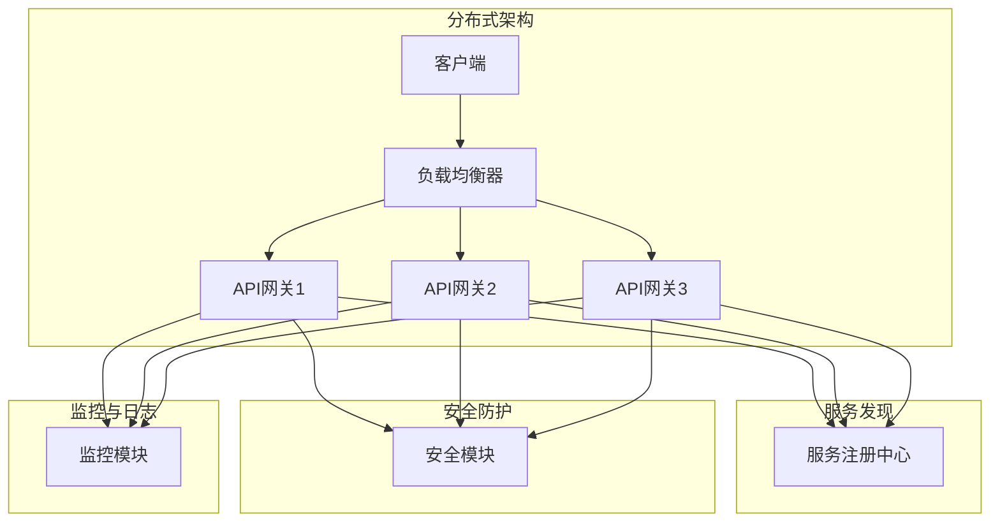
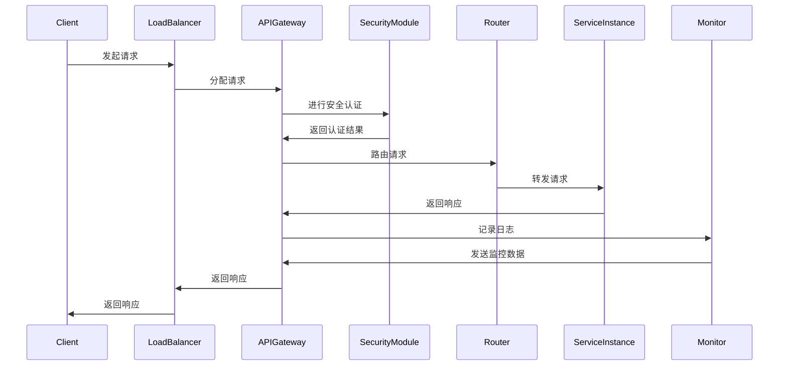

                 

### 文章标题

《构建可靠的API网关系统》

### 关键词

API网关、架构设计、高可用性、故障处理、性能优化、弹性伸缩、运维与部署、最佳实践

### 摘要

本文深入探讨了API网关系统的构建，从基础概念、架构设计到可靠性与稳定性、性能优化和运维部署等多个方面进行了全面阐述。通过系统的分析和实战案例，本文旨在帮助读者掌握API网关的核心原理和最佳实践，构建出高效、可靠、稳定的API网关系统。

## 目录大纲

### 《构建可靠的API网关系统》

#### 第一部分：API网关的基础知识

#### 第1章：API网关的概念与作用

##### 1.1 API网关的定义

##### 1.2 API网关的主要作用

##### 1.3 API网关的常见架构

#### 第2章：API网关的架构设计

##### 2.1 API网关的架构模式

##### 2.2 API网关的组件解析

##### 2.3 API网关的性能优化

#### 第3章：API网关的安全策略

##### 3.1 API网关的安全挑战

##### 3.2 API网关的安全机制

##### 3.3 API网关的安全最佳实践

#### 第二部分：API网关的可靠性与稳定性

#### 第4章：API网关的高可用性设计

##### 4.1 高可用性的基本概念

##### 4.2 API网关的高可用性架构

##### 4.3 高可用性实践

#### 第5章：API网关的故障处理与监控

##### 5.1 故障处理流程

##### 5.2 API网关的监控策略

##### 5.3 监控数据的应用

#### 第6章：API网关的性能优化

##### 6.1 性能优化的基本策略

##### 6.2 API网关的缓存机制

##### 6.3 请求限流与熔断

#### 第7章：API网关的弹性伸缩

##### 7.1 弹性伸缩的基本概念

##### 7.2 API网关的弹性架构设计

##### 7.3 实践中的弹性伸缩策略

#### 第8章：API网关的运维与部署

##### 8.1 运维团队的角色和职责

##### 8.2 API网关的部署流程

##### 8.3 运维中的常见问题和解决方案

#### 第9章：API网关的最佳实践

##### 9.1 开发者最佳实践

##### 9.2 运维最佳实践

##### 9.3 案例分析与经验总结

#### 第10章：展望与未来发展趋势

##### 10.1 API网关的发展趋势

##### 10.2 新技术对API网关的影响

##### 10.3 未来API网关的潜在发展方向

### 小结

《构建可靠的API网关系统》共包含10章，从基础知识到高级实践，全面覆盖了API网关的设计、实现、运维和优化。本书旨在帮助读者深入了解API网关的核心概念，掌握API网关的设计原则和最佳实践，构建出稳定、可靠、高性能的API网关系统。通过学习本书，读者不仅可以提升技术水平，还能在实际工作中更好地应对API网关的各种挑战。未来的API网关将朝着更智能化、更自动化的方向发展，本书为读者提供了前瞻性的视野和实用的指导。希望读者在阅读过程中能够有所收获，不断进步。### 第1章：API网关的概念与作用

#### 1.1 API网关的定义

API（应用程序编程接口）网关是一个系统的入口点，它负责接收来自外部客户端的请求，并将其转发到内部的服务或微服务。API网关不仅起到了代理的作用，还承担了多种重要的功能，如路由、协议转换、安全控制、监控和日志记录等。在微服务架构中，API网关尤为重要，因为它能够简化客户端与微服务之间的交互，降低系统的复杂度。

API网关的基本定义可以概括为以下几点：

- **单一入口**：为所有外部请求提供一个统一的入口，避免直接与多个微服务进行通信。
- **路由和负载均衡**：根据请求的URL或其他属性，将请求路由到正确的服务实例。
- **协议转换**：如果客户端请求的协议与服务提供的协议不同，API网关可以进行协议的转换。
- **安全认证**：对进入系统的请求进行身份验证和授权，确保只有合法的用户才能访问服务。
- **监控和日志**：收集API网关的访问日志和性能数据，便于后续的监控和故障排查。

#### 1.2 API网关的主要作用

API网关在系统中扮演着多面手的角色，其主要作用可以总结为以下几个方面：

1. **简化服务交互**：API网关为客户端提供了一个统一的接口，无需直接与服务实例交互，降低了系统的复杂度。

2. **路由和负载均衡**：API网关能够根据请求的URL或其他属性，将请求路由到合适的服务实例，同时支持负载均衡策略，避免单点过载。

3. **协议转换**：API网关能够处理不同协议的请求，如将REST请求转换为SOAP请求，或者将HTTP请求转换为WebSocket请求。

4. **安全认证**：API网关可以对请求进行身份验证和授权，确保只有合法的用户才能访问服务，从而提高系统的安全性。

5. **监控和日志**：API网关收集系统的访问日志和性能数据，为监控和故障排查提供数据支持。

6. **动态配置**：API网关支持动态配置，可以根据实际需求快速调整路由规则、负载均衡策略等。

7. **API版本管理**：API网关能够管理不同版本的API，确保客户端能够访问到正确的API版本。

8. **限流与熔断**：API网关可以对请求进行限流，防止系统被大量请求攻击，同时支持熔断机制，在服务不可用时提供备用方案。

#### 1.3 API网关的常见架构

API网关的架构设计多种多样，常见的架构模式主要包括以下几种：

1. **单一入口架构**：客户端的所有请求都通过API网关进入，API网关负责将请求路由到相应的服务实例。

2. **多入口架构**：系统设置多个API网关，根据请求的来源和目标服务，选择合适的API网关进行路由。

3. **分层架构**：将API网关划分为多个层次，每个层次负责不同的功能，如前端网关、应用网关、数据网关等。

4. **分布式架构**：将API网关部署在多个节点上，实现负载均衡和故障转移。

5. **服务网格架构**：API网关与其他服务实例共同组成服务网格，通过服务网格进行通信，API网关主要负责服务发现、路由和监控。

#### 1.3.1 单一入口架构

单一入口架构是最常见的API网关架构，客户端的所有请求都通过API网关进入系统，API网关负责处理请求并路由到相应的服务实例。这种架构的优点是简单易懂，易于管理和维护。以下是单一入口架构的基本组件：

- **客户端**：发起API请求的终端设备或应用程序。
- **API网关**：接收客户端请求，处理请求并路由到服务实例。
- **服务实例**：处理具体业务逻辑的服务实例，如用户服务、订单服务等。
- **数据库**：存储服务所需的数据。

#### 1.3.2 多入口架构

多入口架构适用于需要根据请求来源或目标服务选择不同API网关的场景。例如，一个大型企业可能有多套业务系统，每套系统都有自己的API网关。客户端可以根据请求的目标服务，选择合适的API网关进行访问。以下是多入口架构的基本组件：

- **客户端**：发起API请求的终端设备或应用程序。
- **API网关1**：处理与某个业务系统相关的请求。
- **API网关2**：处理与另一个业务系统相关的请求。
- **服务实例1**：处理与业务系统1相关的业务逻辑。
- **服务实例2**：处理与业务系统2相关的业务逻辑。

#### 1.3.3 分层架构

分层架构将API网关划分为多个层次，每个层次负责不同的功能。例如，前端网关负责处理与客户端的交互，应用网关负责处理业务逻辑，数据网关负责处理数据存储和查询。这种架构的优点是功能清晰，易于扩展。以下是分层架构的基本组件：

- **前端网关**：处理客户端请求，进行基本的身份验证和路由。
- **应用网关**：处理业务逻辑，调用内部服务实例。
- **数据网关**：处理数据存储和查询，与数据库进行交互。

#### 1.3.4 分布式架构

分布式架构将API网关部署在多个节点上，实现负载均衡和故障转移。当某个节点出现故障时，其他节点可以继续提供服务。以下是分布式架构的基本组件：

- **API网关节点1**：处理部分客户端请求。
- **API网关节点2**：处理部分客户端请求。
- **服务实例**：处理具体的业务逻辑。

#### 1.3.5 服务网格架构

服务网格架构将API网关与其他服务实例共同组成服务网格，通过服务网格进行通信。API网关主要负责服务发现、路由和监控，服务实例负责具体的业务逻辑。以下是服务网格架构的基本组件：

- **服务网格**：由API网关和服务实例组成，通过服务网格进行通信。
- **API网关**：处理客户端请求，进行服务发现和路由。
- **服务实例**：处理具体的业务逻辑。

通过上述对API网关的概念、主要作用和常见架构的介绍，我们可以对API网关有一个全面的了解。在接下来的章节中，我们将深入探讨API网关的架构设计、安全策略、可靠性与稳定性、性能优化和运维部署等方面，帮助读者构建出高效、可靠、稳定的API网关系统。### 第2章：API网关的架构设计

#### 2.1 API网关的架构模式

API网关的架构模式决定了其性能、可扩展性和可靠性。常见的API网关架构模式包括单一入口架构、多入口架构、分层架构、分布式架构和服务网格架构。每种架构模式都有其优缺点，适用于不同的应用场景。

##### 2.1.1 单一入口架构

单一入口架构是最简单的API网关架构，所有客户端请求都通过一个单一的API网关进入系统。这种架构的优点是实现简单，易于管理和维护。缺点是所有的请求都集中在一个点上，可能导致单点过载和性能瓶颈。以下是单一入口架构的基本组件：

- **客户端**：发起API请求的终端设备或应用程序。
- **API网关**：处理所有客户端请求，进行身份验证、路由和协议转换等。
- **服务实例**：处理具体的业务逻辑。
- **数据库**：存储服务所需的数据。

##### 2.1.2 多入口架构

多入口架构适用于需要根据请求来源或目标服务选择不同API网关的场景。例如，一个大型企业可能有多套业务系统，每套系统都有自己的API网关。客户端可以根据请求的目标服务，选择合适的API网关进行访问。这种架构的优点是提高了系统的灵活性和扩展性，缺点是增加了管理和维护的复杂性。以下是多入口架构的基本组件：

- **客户端**：发起API请求的终端设备或应用程序。
- **API网关1**：处理与某个业务系统相关的请求。
- **API网关2**：处理与另一个业务系统相关的请求。
- **服务实例1**：处理与业务系统1相关的业务逻辑。
- **服务实例2**：处理与业务系统2相关的业务逻辑。

##### 2.1.3 分层架构

分层架构将API网关划分为多个层次，每个层次负责不同的功能。例如，前端网关负责处理与客户端的交互，应用网关负责处理业务逻辑，数据网关负责处理数据存储和查询。这种架构的优点是功能清晰，易于扩展和优化。缺点是架构复杂，可能需要更多的开发和维护成本。以下是分层架构的基本组件：

- **前端网关**：处理客户端请求，进行基本的身份验证和路由。
- **应用网关**：处理业务逻辑，调用内部服务实例。
- **数据网关**：处理数据存储和查询，与数据库进行交互。

##### 2.1.4 分布式架构

分布式架构将API网关部署在多个节点上，实现负载均衡和故障转移。当某个节点出现故障时，其他节点可以继续提供服务。这种架构的优点是提高了系统的可用性和性能，缺点是增加了管理和维护的复杂性。以下是分布式架构的基本组件：

- **API网关节点1**：处理部分客户端请求。
- **API网关节点2**：处理部分客户端请求。
- **服务实例**：处理具体的业务逻辑。

##### 2.1.5 服务网格架构

服务网格架构将API网关与其他服务实例共同组成服务网格，通过服务网格进行通信。API网关主要负责服务发现、路由和监控，服务实例负责具体的业务逻辑。这种架构的优点是实现了服务的解耦和动态管理，缺点是增加了系统的复杂性。以下是服务网格架构的基本组件：

- **服务网格**：由API网关和服务实例组成，通过服务网格进行通信。
- **API网关**：处理客户端请求，进行服务发现和路由。
- **服务实例**：处理具体的业务逻辑。

#### 2.2 API网关的组件解析

API网关的组件包括请求处理组件、路由组件、协议转换组件、安全组件、监控组件和日志组件等。以下是对这些组件的解析：

##### 2.2.1 请求处理组件

请求处理组件负责接收客户端的请求，进行基本验证和解析。主要功能包括：

- **请求解析**：解析HTTP请求，提取请求的URL、方法、参数等信息。
- **请求验证**：验证请求的合法性，如检查请求头、请求体、请求参数等。
- **请求预处理**：对请求进行预处理，如设置请求的变量、初始化日志等。

##### 2.2.2 路由组件

路由组件负责根据请求的URL或其他属性，将请求路由到正确的服务实例。主要功能包括：

- **路由匹配**：根据请求的URL、方法、参数等信息，匹配路由规则。
- **服务选择**：根据路由规则，选择合适的服务实例。
- **负载均衡**：对请求进行负载均衡，避免单点过载。

##### 2.2.3 协议转换组件

协议转换组件负责处理不同协议的请求，如将REST请求转换为SOAP请求，或者将HTTP请求转换为WebSocket请求。主要功能包括：

- **协议识别**：识别请求的协议类型，如HTTP、HTTPS、SOAP、WebSocket等。
- **协议转换**：根据请求的协议类型，进行相应的协议转换。

##### 2.2.4 安全组件

安全组件负责对请求进行身份验证、授权和加密等操作，确保系统的安全性。主要功能包括：

- **身份验证**：验证请求者的身份，如检查用户名、密码、令牌等。
- **授权**：根据用户的身份，判断用户是否有权访问特定的资源。
- **加密**：对敏感数据进行加密，确保数据传输的安全性。

##### 2.2.5 监控组件

监控组件负责监控API网关的运行状态和性能，及时发现和处理问题。主要功能包括：

- **性能监控**：监控API网关的响应时间、请求量、错误率等指标。
- **日志监控**：收集API网关的访问日志和错误日志，进行分析和处理。
- **告警通知**：根据监控数据，发送告警通知，提示潜在的问题。

##### 2.2.6 日志组件

日志组件负责记录API网关的运行日志，方便后续的监控和故障排查。主要功能包括：

- **日志记录**：记录API网关的访问日志、错误日志、性能日志等。
- **日志存储**：将日志存储在文件、数据库或其他存储系统中。
- **日志分析**：对日志进行分析，提取有用的信息和指标。

#### 2.3 API网关的性能优化

API网关的性能优化是确保系统稳定性和可靠性的关键。以下是一些常用的性能优化策略：

##### 2.3.1 负载均衡

负载均衡可以将请求分散到多个服务实例上，避免单点过载。常用的负载均衡算法包括轮询、随机、最小连接数和加权轮询等。通过合理配置负载均衡策略，可以提高系统的性能和可用性。

##### 2.3.2 缓存

缓存可以将请求的响应结果临时存储起来，避免重复计算和请求。常用的缓存技术包括内存缓存、Redis缓存和数据库缓存等。通过合理配置缓存策略，可以减少系统的响应时间，提高系统的性能。

##### 2.3.3 限流与熔断

限流与熔断是防止系统被大量请求攻击的有效手段。限流可以通过控制请求的频率和数量，防止系统过载。熔断可以在服务不可用或响应时间过长时，自动切断请求，避免系统崩溃。常用的限流与熔断组件包括Hystrix、Sentinel和Resilience4j等。

##### 2.3.4 请求预处理与后处理

请求预处理与后处理可以在请求进入和离开API网关时，进行额外的处理，如日志记录、性能监控和参数校验等。通过合理配置请求预处理与后处理，可以提高系统的稳定性和可靠性。

##### 2.3.5 代码优化

代码优化是提高系统性能的重要手段。通过合理使用数据结构和算法，减少代码的冗余和复杂性，可以提高系统的性能和响应速度。

综上所述，API网关的架构设计是构建高效、可靠、稳定的API网关系统的基础。通过合理选择架构模式，配置组件和优化性能，可以构建出高性能、高可用性的API网关系统。在接下来的章节中，我们将继续探讨API网关的安全策略、可靠性与稳定性、性能优化和运维部署等方面，帮助读者深入理解和应用API网关的核心技术和最佳实践。### 第3章：API网关的安全策略

#### 3.1 API网关的安全挑战

随着API网关在系统架构中的重要性日益凸显，其安全防护也成为了开发者需要重点关注的问题。API网关作为系统与外部世界的交互入口，面临着多种安全挑战，主要包括以下几方面：

1. **身份认证**：API网关需要确保只有授权的用户才能访问系统资源，防止未经授权的访问。常见的身份认证方式包括基本认证、OAuth2.0、JWT（JSON Web Token）等。

2. **授权**：在身份认证的基础上，API网关还需要对用户的权限进行管理，确保用户只能访问其有权访问的资源。常见的授权方式包括基于角色的访问控制（RBAC）和基于属性的访问控制（ABAC）。

3. **数据保护**：API网关需要保护传输过程中的数据安全，防止数据被窃取或篡改。常用的数据保护措施包括数据加密、HTTPS、签名等。

4. **防攻击**：API网关需要防范各种网络攻击，如SQL注入、跨站脚本攻击（XSS）、跨站请求伪造（CSRF）等。这些攻击可能会破坏系统的完整性和可用性。

5. **安全审计**：API网关需要记录所有的访问日志，以便在发生安全事件时，能够进行审计和追踪。日志记录和分析对于及时发现和处理安全威胁至关重要。

#### 3.2 API网关的安全机制

为了应对上述安全挑战，API网关需要实现一系列的安全机制，包括身份认证、授权、数据保护、防攻击和日志记录等。以下是对这些安全机制的具体描述：

1. **身份认证**

   - **基本认证**：通过用户名和密码进行身份验证，是最简单但安全性较低的认证方式。一般不推荐用于生产环境。
   - **OAuth2.0**：OAuth2.0是一种授权框架，允许第三方应用程序（客户端）访问用户的资源（服务端），而不需要用户的用户名和密码。OAuth2.0支持多种认证方式，如密码认证、授权码认证等。
   - **JWT**：JSON Web Token是一种基于JSON的开放标准，用于在网络单点登录（SSO）场景中传输用户认证信息。JWT包含用户的身份信息和签名，可以有效防止中间人攻击。

2. **授权**

   - **基于角色的访问控制（RBAC）**：RBAC根据用户的角色（如管理员、普通用户等）来控制访问权限。角色与权限之间是多对多的关系，用户通过角色获得相应的权限。
   - **基于属性的访问控制（ABAC）**：ABAC根据用户的属性（如部门、职位等）以及其他上下文信息（如时间、地理位置等）来控制访问权限。ABAC提供了更高的灵活性，适用于更复杂的安全策略。

3. **数据保护**

   - **数据加密**：使用加密算法对敏感数据进行加密，确保数据在传输和存储过程中不被窃取或篡改。常用的加密算法包括AES（高级加密标准）、RSA（公钥加密算法）等。
   - **HTTPS**：HTTPS使用SSL/TLS协议对HTTP请求进行加密，确保数据在传输过程中的安全。使用HTTPS可以有效防止中间人攻击。
   - **数据签名**：对数据进行签名，确保数据的完整性和真实性。签名算法（如SHA-256）可以对数据进行哈希处理，生成签名值。接收方可以验证签名，确保数据未被篡改。

4. **防攻击**

   - **SQL注入防护**：通过输入验证和参数化查询等方式，防止恶意SQL注入攻击。例如，使用预编译语句（PreparedStatement）可以避免SQL注入。
   - **XSS防护**：对用户输入进行过滤和转义，防止恶意脚本注入。例如，将输入的HTML标签和JavaScript代码进行转义，可以避免XSS攻击。
   - **CSRF防护**：通过生成并验证CSRF令牌，防止跨站请求伪造攻击。每次请求时，API网关会检查请求中是否包含有效的CSRF令牌，如果没有令牌或令牌无效，请求将被拒绝。

5. **安全审计**

   - **日志记录**：记录API网关的所有访问日志，包括请求的IP地址、时间、URL、方法、状态码等信息。日志记录可以帮助开发者及时发现和处理安全事件。
   - **日志分析**：对日志进行分析，提取有用的信息和指标，如请求量、错误率、攻击类型等。日志分析可以辅助开发者优化安全策略和提升系统安全性。

#### 3.3 API网关的安全最佳实践

为了确保API网关的安全性，开发者可以遵循以下最佳实践：

1. **使用强认证和授权机制**：使用OAuth2.0或JWT等强认证机制，确保只有授权的用户才能访问系统资源。同时，根据业务需求设计合理的授权策略，确保用户只能访问其有权访问的资源。

2. **数据加密与签名**：对敏感数据进行加密和签名，确保数据在传输和存储过程中不被窃取或篡改。同时，使用HTTPS协议确保数据在传输过程中的安全。

3. **防止常见攻击**：对输入进行验证和过滤，防止SQL注入、XSS、CSRF等常见攻击。同时，可以使用Web应用防火墙（WAF）来增强系统的安全性。

4. **监控与审计**：实时监控API网关的访问日志和错误日志，及时发现和处理安全事件。定期进行安全审计，检查系统是否存在安全漏洞和风险。

5. **持续更新与优化**：随着安全威胁的不断变化，开发者需要持续更新和优化安全策略和防护措施。关注业界安全动态，及时掌握新的安全技术和最佳实践。

通过上述安全机制和最佳实践，开发者可以构建出安全、可靠的API网关系统，保障系统资源的合法访问和数据安全。在下一章中，我们将继续探讨API网关的可靠性与稳定性，包括高可用性设计、故障处理和监控策略等方面的内容。### 第4章：API网关的高可用性设计

#### 4.1 高可用性的基本概念

高可用性（High Availability，简称HA）是指系统在面临各种故障和压力时，能够保持持续运行的能力。高可用性设计的目标是确保系统在长时间内无故障运行，最大限度地减少系统的停机时间。对于API网关而言，高可用性设计尤为重要，因为它是系统的唯一入口点，一旦API网关出现故障，整个系统将无法对外提供服务。

高可用性设计的关键指标包括：

- **系统可用性**：系统在一段时间内保持正常运行的时间比例，通常以百分比表示。例如，一个具有99.9%可用性的系统，每年可能停机约8.8小时。
- **故障恢复时间**：系统从故障中恢复正常运行所需的时间。
- **故障切换时间**：在主实例出现故障时，备用实例接管请求所需的时间。

为了实现高可用性，API网关需要具备以下几个基本特性：

- **故障检测**：能够及时发现故障并触发故障切换。
- **故障切换**：在主实例故障时，自动将流量切换到备用实例。
- **负载均衡**：将请求均匀地分发到多个实例，避免单点过载。
- **自动恢复**：在故障解决后，自动将流量切换回主实例。

#### 4.2 API网关的高可用性架构

API网关的高可用性架构设计需要考虑以下几个方面：

1. **多实例部署**：将API网关部署在多个实例上，实现负载均衡和故障转移。通过使用负载均衡器（如Nginx、HAProxy等），可以将请求均匀地分发到各个实例。

2. **主备切换**：在主实例出现故障时，自动将流量切换到备用实例。常用的主备切换方案包括双主架构、主从架构和热备份等。

3. **动态配置**：支持动态配置，可以根据实例的健康状态和负载情况，自动调整路由规则和负载均衡策略。

4. **服务发现**：API网关需要能够动态发现服务实例，以便在服务实例发生变更时，自动更新路由规则和负载均衡策略。

5. **故障检测与监控**：通过故障检测和监控机制，及时发现故障并触发故障切换。常用的故障检测方法包括心跳检测、状态检查等。

#### 4.3 高可用性实践

以下是一些实现API网关高可用性的具体实践方法：

1. **多实例部署与负载均衡**

   - **部署多个实例**：将API网关部署在多个实例上，使用负载均衡器（如Nginx、HAProxy等）进行请求分发。
   - **负载均衡策略**：根据请求的URL、IP地址、请求时间等属性，选择合适的负载均衡策略，如轮询、最小连接数、源IP哈希等。

2. **主备切换与故障检测**

   - **双主架构**：在两个主实例之间进行数据同步，当其中一个主实例出现故障时，自动将流量切换到另一个主实例。
   - **主从架构**：主实例负责处理业务请求，从实例负责数据备份和故障恢复。当主实例出现故障时，自动将流量切换到从实例。
   - **故障检测**：使用心跳检测、状态检查等方法，定期检查实例的健康状态。当实例出现故障时，自动将其从负载均衡器中移除，并通知运维团队进行故障处理。

3. **服务发现与动态配置**

   - **服务发现**：使用服务注册与发现机制（如Consul、Zookeeper等），API网关可以动态获取服务实例的地址和状态。
   - **动态配置**：使用配置中心（如Nacos、Spring Cloud Config等），API网关可以根据服务实例的健康状态和负载情况，动态调整路由规则和负载均衡策略。

4. **数据备份与恢复**

   - **数据备份**：定期对API网关的数据进行备份，确保在数据丢失或损坏时能够快速恢复。
   - **数据恢复**：在数据备份的基础上，实现数据的快速恢复和回滚，确保系统在故障发生后能够尽快恢复到正常状态。

5. **监控与告警**

   - **监控**：使用监控工具（如Prometheus、Grafana等），对API网关的运行状态、性能指标、日志等进行实时监控。
   - **告警**：设置告警阈值，当监控指标超过阈值时，自动发送告警通知，提醒运维团队进行故障排查和处理。

通过上述实践方法，可以实现API网关的高可用性设计，确保系统在面临各种故障和压力时，能够保持持续运行，提高系统的稳定性和可靠性。在下一章中，我们将继续探讨API网关的故障处理与监控策略，帮助读者全面了解API网关的可靠性与稳定性。### 第5章：API网关的故障处理与监控

#### 5.1 故障处理流程

故障处理是保障API网关稳定运行的重要环节。一个完善的故障处理流程能够帮助运维团队快速定位、诊断和解决故障，减少系统的停机时间。以下是API网关故障处理的基本流程：

1. **故障检测**：通过监控工具和故障检测机制，及时发现API网关的异常情况。故障检测可以包括心跳检测、状态检查、性能指标监控等。

2. **故障确认**：当监控系统发现异常时，运维团队需要进一步确认故障情况。确认步骤可能包括查看日志、性能分析、现场测试等。

3. **故障定位**：通过分析故障现象和日志，确定故障的具体原因。故障定位可能涉及API网关内部组件、外部服务、网络环境等多个方面。

4. **故障处理**：根据故障原因，采取相应的处理措施。处理措施可能包括重启服务、修复代码、调整配置、切换实例等。

5. **故障恢复**：在故障处理完成后，进行系统恢复和测试，确保故障已经解决，系统恢复正常运行。

6. **故障记录与总结**：将故障处理过程和结果进行记录，总结故障原因和处理经验，为未来的故障处理提供参考。

#### 5.2 API网关的监控策略

API网关的监控策略是确保系统稳定性和可靠性的关键。一个完善的监控策略能够帮助运维团队实时了解系统的运行状态，及时发现和处理故障。以下是API网关监控策略的主要内容：

1. **性能监控**：对API网关的性能指标进行实时监控，包括响应时间、吞吐量、错误率等。性能监控可以采用Prometheus、Grafana等工具，通过收集和展示监控数据，帮助运维团队快速定位和解决性能问题。

2. **日志监控**：对API网关的访问日志和错误日志进行实时监控。日志监控可以采用ELK（Elasticsearch、Logstash、Kibana）栈或Splunk等工具，通过收集、存储和分析日志数据，帮助运维团队了解系统的运行状况和故障原因。

3. **告警机制**：设置告警阈值，当监控指标超过阈值时，自动发送告警通知。告警机制可以采用Prometheus、Alertmanager等工具，通过邮件、短信、钉钉等方式通知运维团队。

4. **自动化恢复**：通过自动化脚本和工具，实现故障自动恢复。例如，当API网关实例出现故障时，自动重启实例或切换到备用实例。

5. **可视化展示**：通过可视化工具（如Grafana、Kibana等），将监控数据以图表、仪表板等形式展示，帮助运维团队直观了解系统的运行状态和性能趋势。

#### 5.3 监控数据的应用

监控数据在故障处理和系统优化中具有重要作用。以下是监控数据的应用场景：

1. **故障诊断**：通过分析监控数据和日志，定位故障原因。例如，当API网关的响应时间异常时，可以通过查看性能监控数据和日志，分析网络延迟、服务调用次数等指标，找出故障原因。

2. **性能优化**：通过监控数据，发现系统的性能瓶颈和优化机会。例如，当API网关的吞吐量较低时，可以通过调整负载均衡策略、优化代码、增加缓存等方式进行优化。

3. **容量规划**：根据监控数据，预测系统未来的负载和资源需求，为容量规划提供依据。例如，当API网关的请求量持续增长时，可以根据监控数据和业务需求，提前规划增加实例、升级硬件等。

4. **趋势分析**：通过分析监控数据的趋势，预测系统的未来行为和潜在问题。例如，当API网关的错误率呈现上升趋势时，可以提前采取措施，避免故障发生。

5. **安全审计**：通过监控数据和日志，进行安全审计和风险排查。例如，当API网关的访问日志中出现异常访问时，可以通过分析日志和监控数据，查找潜在的攻击行为和漏洞。

通过合理的监控策略和数据应用，API网关能够及时发现和处理故障，提高系统的稳定性和可靠性。在下一章中，我们将探讨API网关的性能优化，包括缓存机制、请求限流与熔断等策略。### 第6章：API网关的性能优化

#### 6.1 性能优化的基本策略

API网关的性能优化是确保系统稳定性和响应速度的关键。以下是一些常见的性能优化策略：

##### 6.1.1 负载均衡

负载均衡可以将请求均匀地分发到多个实例上，避免单点过载。常用的负载均衡算法包括轮询、最少连接数、源IP哈希等。通过合理配置负载均衡策略，可以提高系统的吞吐量和响应速度。

##### 6.1.2 缓存

缓存可以将请求的响应结果临时存储起来，避免重复计算和请求。常用的缓存技术包括内存缓存（如Redis、Memcached）、数据库缓存等。通过合理配置缓存策略，可以减少系统的响应时间，提高系统的性能。

##### 6.1.3 代码优化

代码优化是提高系统性能的重要手段。通过合理使用数据结构和算法，减少代码的冗余和复杂性，可以提高系统的性能和响应速度。例如，避免使用复杂的循环和递归，使用高效的数据结构（如哈希表、树等）。

##### 6.1.4 异步处理

异步处理可以将耗时较长的任务（如数据库操作、外部服务调用等）异步执行，避免阻塞主线程。通过使用异步编程模型（如异步IO、协程等），可以提高系统的并发能力和响应速度。

##### 6.1.5 请求压缩

请求压缩可以减少请求的大小，降低网络传输的成本。常用的压缩算法包括GZIP、BZIP2等。通过启用请求压缩，可以提高系统的吞吐量和响应速度。

##### 6.1.6 网络优化

网络优化包括优化网络架构、减少网络延迟等。通过使用CDN（内容分发网络）、优化DNS解析、优化网络路径选择等手段，可以提高系统的网络性能。

#### 6.2 API网关的缓存机制

缓存机制是提高API网关性能的有效手段。以下是一些常用的缓存策略：

##### 6.2.1 页面缓存

页面缓存可以将API网关的响应结果缓存起来，避免重复计算和请求。常用的页面缓存策略包括：

- **内存缓存**：将缓存数据存储在内存中，适用于数据量较小、更新频率较低的场景。
- **分布式缓存**：将缓存数据存储在分布式缓存系统中（如Redis、Memcached），适用于数据量较大、更新频率较高的场景。

##### 6.2.2 数据库缓存

数据库缓存可以将数据库查询结果缓存起来，减少对数据库的查询次数。常用的数据库缓存策略包括：

- **查询缓存**：将数据库查询结果缓存起来，适用于查询语句和查询参数不变的场景。
- **结果缓存**：将数据库查询结果缓存起来，适用于查询语句和查询参数频繁变化的场景。

##### 6.2.3 HTTP缓存

HTTP缓存可以减少浏览器与服务器之间的数据传输，提高系统的性能和响应速度。常用的HTTP缓存策略包括：

- **强缓存**：通过设置Expires和Cache-Control等HTTP头信息，告诉浏览器数据的有效期。当数据未过期时，浏览器可以直接从本地缓存中获取数据，无需向服务器发送请求。
- **协商缓存**：通过设置ETag和Last-Modified等HTTP头信息，实现数据的版本控制和缓存更新。当服务器检测到数据发生变化时，浏览器需要重新向服务器发送请求，获取最新的数据。

#### 6.3 请求限流与熔断

请求限流与熔断是防止系统过载和崩溃的有效手段。以下是一些常用的限流与熔断策略：

##### 6.3.1 请求限流

请求限流可以限制客户端的请求频率，避免系统被大量请求攻击。常用的限流算法包括：

- **令牌桶算法**：通过一个固定容量的桶，以恒定的速率发放令牌，客户端需要消耗令牌才能发送请求。当桶中的令牌耗尽时，客户端无法发送请求。
- **漏斗算法**：将请求放入一个漏斗中，漏斗有一定的容量和流量阈值。当漏斗中的请求达到阈值时，新的请求将被丢弃。

##### 6.3.2 熔断机制

熔断机制可以在服务不可用或响应时间过长时，自动切断请求，避免系统崩溃。常用的熔断算法包括：

- **断路器模式**：当服务失败次数达到设定的阈值时，断路器进入打开状态，切断请求。在断路器打开一段时间后，如果服务恢复正常，可以尝试重试请求。
- **熔断降级**：当服务不可用时，将请求路由到备用服务或返回错误响应，避免系统崩溃。

通过合理的性能优化策略、缓存机制和限流与熔断机制，API网关可以实现高效的性能表现，提高系统的稳定性和可靠性。在下一章中，我们将探讨API网关的弹性伸缩，包括基本概念、架构设计和实践策略等内容。### 第7章：API网关的弹性伸缩

#### 7.1 弹性伸缩的基本概念

弹性伸缩（Scalability）是指系统在面临不断变化的负载时，能够自动调整资源利用率，以保持高性能和高可用性的能力。对于API网关而言，弹性伸缩尤为重要，因为API网关是系统的唯一入口点，其负载通常受外部请求的影响较大。

弹性伸缩的核心概念包括：

- **水平伸缩（Scaling Out）**：通过增加实例数量，提高系统的处理能力。水平伸缩可以线性地扩展系统的吞吐量，但需要考虑实例之间的负载均衡和数据一致性。
- **垂直伸缩（Scaling Up）**：通过增加单个实例的资源配置（如CPU、内存等），提高系统的处理能力。垂直伸缩适用于资源需求稳定、负载峰值较高的场景。
- **动态伸缩**：系统根据实际负载情况，自动调整实例数量和资源配置。动态伸缩可以更好地适应负载的变化，提高系统的灵活性和成本效益。

#### 7.2 API网关的弹性架构设计

API网关的弹性架构设计需要考虑以下几个方面：

1. **分布式部署**：将API网关部署在多个实例上，实现负载均衡和故障转移。分布式部署可以提高系统的可用性和性能。
2. **动态配置**：支持动态配置，可以根据实例的健康状态和负载情况，自动调整路由规则和负载均衡策略。
3. **服务发现**：API网关需要能够动态发现服务实例，以便在服务实例发生变更时，自动更新路由规则和负载均衡策略。
4. **弹性伸缩组件**：引入弹性伸缩组件（如Kubernetes、Elasticsearch等），实现实例的自动创建、部署和缩放。
5. **监控与告警**：实时监控API网关的运行状态和性能指标，当出现异常时，自动触发告警和故障处理流程。

#### 7.3 实践中的弹性伸缩策略

以下是一些实现API网关弹性伸缩的具体策略：

1. **自动扩容与缩容**

   - **自动扩容**：当API网关的请求量超过设定的阈值时，自动创建新的实例，将流量分发到新实例上，提高系统的处理能力。
   - **自动缩容**：当API网关的请求量低于设定的阈值时，自动关闭部分实例，释放资源，降低成本。

2. **水平与垂直伸缩**

   - **水平伸缩**：通过增加实例数量，实现线性扩展。水平伸缩适用于处理大量请求的场景。
   - **垂直伸缩**：通过增加单个实例的资源配置，实现性能提升。垂直伸缩适用于请求量相对稳定、负载峰值较高的场景。

3. **流量调度与负载均衡**

   - **流量调度**：根据实例的健康状态和负载情况，将流量均匀地分发到各个实例。
   - **负载均衡**：使用负载均衡算法（如轮询、最小连接数、源IP哈希等），实现流量的高效分发。

4. **服务发现与动态配置**

   - **服务发现**：使用服务注册与发现机制（如Consul、Zookeeper等），API网关可以动态获取服务实例的地址和状态。
   - **动态配置**：使用配置中心（如Nacos、Spring Cloud Config等），API网关可以根据服务实例的健康状态和负载情况，动态调整路由规则和负载均衡策略。

5. **监控与告警**

   - **监控**：使用监控工具（如Prometheus、Grafana等），对API网关的运行状态、性能指标、日志等进行实时监控。
   - **告警**：设置告警阈值，当监控指标超过阈值时，自动发送告警通知，提醒运维团队进行故障排查和处理。

通过合理的弹性伸缩策略和架构设计，API网关可以更好地适应负载的变化，提高系统的性能、可用性和成本效益。在下一章中，我们将探讨API网关的运维与部署，包括运维团队的角色和职责、部署流程以及常见问题和解决方案等内容。### 第8章：API网关的运维与部署

#### 8.1 运维团队的角色和职责

API网关的运维与部署是保障系统稳定性和可靠性的关键。一个高效的运维团队在API网关运维中发挥着重要作用。以下是运维团队的主要角色和职责：

1. **系统监控**：运维团队负责实时监控API网关的运行状态、性能指标和日志，及时发现并处理异常情况。
2. **故障处理**：在出现故障时，运维团队需要快速响应，进行故障定位、诊断和修复，确保系统尽快恢复正常。
3. **版本管理**：运维团队负责管理和维护API网关的版本，确保不同版本的API能够平稳切换和兼容。
4. **部署与升级**：运维团队负责API网关的部署、升级和回滚，确保系统的稳定性和安全性。
5. **性能优化**：运维团队需要定期进行性能优化，包括调整配置、优化代码和数据库等，提高系统的性能和响应速度。
6. **安全防护**：运维团队负责实施安全策略，防范各类安全威胁，确保系统的数据安全和用户隐私。
7. **文档编写**：运维团队需要编写和更新运维文档，包括系统架构、部署流程、故障处理指南等，为团队成员提供参考。

#### 8.2 API网关的部署流程

API网关的部署流程包括以下几个方面：

1. **环境准备**：准备部署所需的环境，包括操作系统、数据库、中间件等。确保所有环境满足系统要求。
2. **代码仓库**：将API网关的代码存储在代码仓库中（如Git），方便版本管理和协同开发。
3. **构建与打包**：使用构建工具（如Maven、Gradle等）将代码编译、打包，生成可执行的部署包。
4. **部署脚本**：编写部署脚本，包括安装依赖、配置环境、部署服务实例等，实现自动化部署。
5. **部署测试**：在测试环境中部署API网关，进行功能测试、性能测试和安全测试，确保系统正常运行。
6. **部署生产环境**：将API网关部署到生产环境，替换现有服务实例，确保系统对外提供服务。
7. **监控与告警**：部署完成后，启动监控和告警机制，确保系统运行稳定，及时发现和处理问题。

#### 8.3 运维中的常见问题和解决方案

在API网关的运维过程中，可能会遇到以下常见问题：

1. **部署失败**：部署过程中可能出现依赖缺失、配置错误、网络故障等问题。解决方案包括检查部署脚本、确保环境准备齐全、排查网络问题等。
2. **性能瓶颈**：系统在高并发场景下可能出现性能瓶颈，导致响应时间过长。解决方案包括优化代码、调整配置、增加缓存和垂直/水平扩展等。
3. **安全漏洞**：API网关可能面临各种安全威胁，如SQL注入、XSS、CSRF等。解决方案包括使用安全防护工具（如Web应用防火墙、安全插件等）、定期安全审计和漏洞修复等。
4. **服务不可用**：服务实例可能因故障、网络问题等原因导致不可用。解决方案包括故障检测、自动恢复、备用实例切换等。
5. **数据一致性**：在分布式系统中，数据一致性是一个重要问题。解决方案包括使用分布式事务、最终一致性模型、分布式锁等。

通过合理的运维与部署策略，运维团队可以确保API网关的稳定性和可靠性，为系统的高效运行提供保障。在下一章中，我们将探讨API网关的最佳实践，包括开发者最佳实践、运维最佳实践和案例分析与经验总结等内容。### 第9章：API网关的最佳实践

#### 9.1 开发者最佳实践

开发者在使用API网关时，可以遵循以下最佳实践，以提高系统的可维护性、可靠性和安全性：

1. **接口标准化**：确保所有API接口遵循统一的规范，包括URL结构、参数命名、返回值格式等，便于客户端调用和系统维护。
2. **版本控制**：为API接口实现版本控制，避免因接口变更导致客户端无法正常使用。建议使用语义化版本控制（如语义化版本2.0）。
3. **文档规范**：编写详细的API文档，包括接口描述、参数说明、返回值说明等，方便开发者理解和使用API。
4. **日志记录**：合理配置日志记录，记录关键操作和异常信息，便于故障排查和性能分析。
5. **异常处理**：对API请求进行异常处理，确保系统在发生错误时，能够给出清晰的错误信息和合理的错误码。
6. **性能监控**：监控API网关的运行状态和性能指标，及时发现和处理性能瓶颈。
7. **安全性**：对API接口进行安全性检查，包括输入验证、权限控制、数据加密等，防止安全漏洞。
8. **代码审查**：定期进行代码审查，确保代码质量，避免潜在的安全和性能问题。

#### 9.2 运维最佳实践

运维团队在维护API网关时，可以遵循以下最佳实践，以提高系统的稳定性和可靠性：

1. **自动化部署**：使用自动化工具（如Jenkins、Ansible等）实现API网关的自动化部署，确保部署流程高效、可靠。
2. **监控与告警**：使用监控工具（如Prometheus、Grafana等）对API网关进行实时监控，设置告警阈值，确保系统运行状态透明。
3. **故障处理**：制定故障处理预案，明确故障处理流程和责任人，确保故障能够迅速解决。
4. **性能优化**：定期进行性能优化，包括调整配置、升级硬件、优化代码等，确保系统在高负载场景下运行稳定。
5. **日志分析**：对API网关的日志进行定期分析，提取有价值的信息，用于性能优化和安全审计。
6. **安全防护**：使用安全工具（如Web应用防火墙、安全插件等）实施安全防护措施，防范各种安全威胁。
7. **备份与恢复**：定期备份数据和配置，确保在数据丢失或损坏时，能够快速恢复。
8. **文档管理**：编写和更新运维文档，包括系统架构、部署流程、故障处理指南等，为团队成员提供参考。

#### 9.3 案例分析与经验总结

以下是一些API网关的实战案例和经验总结，供读者参考：

1. **案例一：大型电商平台API网关**
   - **背景**：某大型电商平台需要处理海量用户请求，系统架构复杂，接口众多。
   - **解决方案**：采用分布式API网关架构，结合负载均衡、缓存、限流与熔断等技术，提高系统的性能和可靠性。
   - **经验总结**：分布式架构提高了系统的可用性和扩展性，但需要关注数据一致性和服务治理。

2. **案例二：金融行业API网关**
   - **背景**：金融行业对数据安全和合规性要求较高，API网关需要满足严格的合规要求。
   - **解决方案**：采用安全隔离、数据加密、访问控制等技术，确保系统的安全性。同时，实施严格的日志记录和审计机制。
   - **经验总结**：金融行业的API网关设计需要兼顾安全性和合规性，同时关注系统性能。

3. **案例三：物联网平台API网关**
   - **背景**：物联网平台需要处理大量设备请求，数据传输带宽有限，对响应时间要求较高。
   - **解决方案**：采用物联网专用的API网关，优化协议处理和数据压缩，提高系统性能。同时，使用边缘计算技术，降低数据传输延迟。
   - **经验总结**：物联网平台的API网关设计需要关注数据传输效率和边缘计算。

通过上述案例分析和经验总结，开发者可以借鉴最佳实践，结合自身业务需求，设计出高效、可靠、安全的API网关系统。在下一章中，我们将探讨API网关的未来发展趋势，包括新技术的影响和潜在发展方向。### 第10章：展望与未来发展趋势

#### 10.1 API网关的发展趋势

随着互联网和云计算的快速发展，API网关作为系统架构的核心组件，正面临着越来越多的挑战和机遇。以下是API网关未来可能的发展趋势：

1. **智能化与自动化**：随着人工智能和机器学习技术的进步，API网关有望实现智能化与自动化。例如，通过智能路由、自适应性能优化、自动故障处理等功能，提高系统的效率和可靠性。
2. **服务网格技术的融合**：服务网格（Service Mesh）是一种新的服务架构模式，专注于服务之间的通信和监控。API网关与服务网格的结合，将进一步提升系统的解耦性和可管理性。
3. **边缘计算的融合**：随着物联网和5G技术的发展，边缘计算成为趋势。API网关在边缘节点上的部署，将降低数据传输延迟，提高系统的响应速度和性能。
4. **API经济与微服务架构**：API经济强调通过API共享和交易，实现价值创造。微服务架构的普及，使得API网关成为管理和协调微服务的关键组件。
5. **安全与合规性**：随着数据隐私保护和法规合规要求的提高，API网关在安全性和合规性方面的重要性愈发突出。未来的API网关将更加注重安全防护和合规性管理。

#### 10.2 新技术对API网关的影响

新技术的快速发展对API网关产生了深远的影响，以下是一些关键技术的具体影响：

1. **容器与Kubernetes**：容器技术和Kubernetes容器编排系统的普及，使得API网关的部署和管理变得更加灵活和高效。通过容器化部署和Kubernetes集群管理，API网关可以快速部署、扩展和恢复。
2. **服务网格**：服务网格（如Istio、Linkerd等）为API网关提供了通信层的服务治理能力。服务网格与API网关的结合，将进一步提升系统的解耦性和可监控性。
3. **分布式事务与分布式数据库**：随着分布式事务和分布式数据库技术的发展，API网关在分布式系统中的角色变得越来越重要。API网关需要支持分布式事务管理，确保数据的一致性和完整性。
4. **边缘计算**：边缘计算将计算和存储能力推向网络边缘，使得API网关在边缘节点上的部署成为必要。边缘API网关将承担更多的数据处理和缓存任务，提高系统的响应速度和性能。
5. **人工智能与机器学习**：人工智能和机器学习技术在API网关中的应用，将推动智能化和自动化的发展。例如，通过机器学习算法，API网关可以实现智能路由、自适应性能优化和自动故障处理等功能。

#### 10.3 未来API网关的潜在发展方向

基于上述发展趋势和新技术的影响，未来API网关可能朝着以下几个方向发展：

1. **智能化与自动化**：API网关将具备更高级的智能化和自动化能力，通过机器学习和人工智能技术，实现自适应性能优化、智能路由和自动故障处理等功能。
2. **服务网格的融合**：API网关将与服务网格技术深度融合，提供更强大的服务治理和监控能力，实现更灵活的服务发现、负载均衡和故障转移。
3. **边缘计算的支持**：API网关将更加关注边缘计算场景，支持在边缘节点上的部署和运行，提高系统的响应速度和性能。
4. **API经济与微服务架构的整合**：API网关将更加紧密地集成到API经济和微服务架构中，提供更丰富的API管理和服务治理功能，促进价值创造和业务创新。
5. **安全性与合规性的加强**：API网关将更加注重安全性和合规性，提供全面的安全防护和合规性管理能力，确保系统的数据安全和用户隐私。

未来，API网关将继续发展，成为系统架构中的关键组件。开发者需要关注这些趋势和发展方向，结合自身业务需求，设计和实现高效、可靠、安全的API网关系统。

### 小结

本文全面探讨了构建可靠的API网关系统的各个方面，从基础知识、架构设计到可靠性与稳定性、性能优化和运维部署等。通过深入分析和实战案例，本文为读者提供了全面的技术指导和实践建议。随着新技术的发展，API网关将继续演进，成为系统架构中的核心组件。开发者需要紧跟技术趋势，不断学习和实践，才能构建出高效、可靠、安全的API网关系统。希望读者能够在阅读本文后，对API网关有更深入的理解，并能够将其应用于实际工作中。

### 作者信息

作者：AI天才研究院/AI Genius Institute & 禅与计算机程序设计艺术 /Zen And The Art of Computer Programming

### 拓展阅读

- 《API设计最佳实践》
- 《微服务架构设计原则》
- 《Kubernetes权威指南》
- 《服务网格技术解析》
- 《边缘计算与物联网》

通过阅读这些文献，读者可以进一步了解API网关、微服务架构、容器化技术、服务网格和边缘计算等领域的最新发展和最佳实践。希望读者在阅读过程中能够有所收获，不断进步。### 小结

《构建可靠的API网关系统》共包含10章，从基础知识到高级实践，全面覆盖了API网关的设计、实现、运维和优化。本书旨在帮助读者深入了解API网关的核心概念，掌握API网关的设计原则和最佳实践，构建出稳定、可靠、高性能的API网关系统。通过学习本书，读者不仅可以提升技术水平，还能在实际工作中更好地应对API网关的各种挑战。未来的API网关将朝着更智能化、更自动化的方向发展，本书为读者提供了前瞻性的视野和实用的指导。希望读者在阅读过程中能够有所收获，不断进步。

### 背景介绍

#### API网关的核心概念

API网关是一个系统中的关键组件，主要负责处理外部客户端的请求，并对其进行路由、协议转换、安全控制、日志记录和监控等功能。在微服务架构中，API网关尤为重要，因为它是系统的唯一入口点，能够简化客户端与微服务之间的交互，降低系统的复杂度。API网关的基本定义包括以下几个方面：

1. **单一入口**：API网关为所有外部请求提供一个统一的入口，避免直接与多个微服务进行通信。
2. **路由和负载均衡**：API网关根据请求的URL或其他属性，将请求路由到正确的服务实例，并支持负载均衡策略。
3. **协议转换**：API网关能够处理不同协议的请求，如将REST请求转换为SOAP请求，或者将HTTP请求转换为WebSocket请求。
4. **安全认证**：API网关可以对进入系统的请求进行身份验证和授权，确保只有合法的用户才能访问服务。
5. **监控和日志**：API网关收集系统的访问日志和性能数据，为监控和故障排查提供数据支持。
6. **动态配置**：API网关支持动态配置，可以根据实际需求快速调整路由规则、负载均衡策略等。
7. **API版本管理**：API网关能够管理不同版本的API，确保客户端能够访问到正确的API版本。

#### 问题背景

在当今的互联网时代，各种系统和应用需要通过API进行交互，以满足业务需求。然而，随着系统规模和用户数量的增加，API网关面临的问题也逐渐显现：

1. **性能瓶颈**：随着请求量的增加，API网关可能会出现性能瓶颈，导致响应时间延长，影响用户体验。
2. **安全性问题**：API网关作为系统的唯一入口点，容易成为攻击的目标，需要确保数据的安全和用户的隐私。
3. **可维护性问题**：随着API数量的增加，API网关的配置和管理变得越来越复杂，如何简化配置和管理成为挑战。
4. **高可用性问题**：在面临故障和异常情况下，如何确保API网关的持续运行，避免系统完全不可用。

#### 问题描述

为了解决上述问题，需要构建一个可靠、稳定、高性能的API网关系统。具体来说，需要实现以下几个目标：

1. **性能优化**：通过负载均衡、缓存、请求压缩等技术，提高API网关的处理能力，确保系统在高并发场景下能够正常运行。
2. **安全性**：通过身份认证、授权、数据加密、防攻击等措施，确保API网关的安全性，防止数据泄露和未经授权的访问。
3. **可维护性**：通过自动化部署、监控和日志分析，简化API网关的配置和管理，提高系统的可维护性。
4. **高可用性**：通过多实例部署、故障检测、故障切换等机制，确保API网关在面临故障时能够快速恢复，保持系统的连续性。

#### 问题解决

为了构建一个可靠、稳定、高性能的API网关系统，可以采取以下解决方案：

1. **性能优化**：
   - **负载均衡**：通过使用负载均衡器（如Nginx、HAProxy等），实现请求的均匀分发，避免单点过载。
   - **缓存**：使用内存缓存（如Redis、Memcached）或数据库缓存，减少对后端服务的调用次数，提高系统的响应速度。
   - **请求压缩**：通过使用压缩算法（如GZIP），减少请求和响应的数据量，降低网络传输成本。

2. **安全性**：
   - **身份认证**：采用OAuth2.0、JWT等强认证机制，确保只有授权的用户才能访问系统资源。
   - **授权**：使用基于角色的访问控制（RBAC）或基于属性的访问控制（ABAC），确保用户只能访问其有权访问的资源。
   - **数据加密**：对敏感数据进行加密，确保数据在传输和存储过程中不被窃取或篡改。
   - **防攻击**：使用Web应用防火墙（WAF）、输入验证、日志审计等手段，防范SQL注入、XSS、CSRF等常见攻击。

3. **可维护性**：
   - **自动化部署**：使用自动化工具（如Jenkins、Ansible等），实现API网关的自动化部署和升级。
   - **监控与日志分析**：使用监控工具（如Prometheus、Grafana等），对API网关的运行状态和性能指标进行实时监控，并通过日志分析工具（如ELK、Splunk等）进行日志分析。
   - **配置管理**：使用配置中心（如Nacos、Spring Cloud Config等），实现配置的动态管理和更新。

4. **高可用性**：
   - **多实例部署**：将API网关部署在多个实例上，实现负载均衡和故障转移。
   - **故障检测与恢复**：通过心跳检测、状态检查等机制，及时发现故障，并自动切换到备用实例。
   - **数据备份与恢复**：定期对API网关的数据进行备份，确保在数据丢失或损坏时能够快速恢复。

通过上述解决方案，可以构建出一个高效、可靠、安全的API网关系统，满足业务需求并保障系统的稳定运行。

#### 边界与外延

在构建API网关系统时，需要明确一些边界与外延，以确保系统的设计和实现符合预期：

1. **系统边界**：API网关系统的边界包括外部客户端、API网关、内部服务实例和数据库等。外部客户端通过API网关与内部服务实例进行交互，API网关负责处理请求、路由、认证和安全等功能。

2. **外延扩展**：API网关系统需要考虑未来的扩展性，包括支持更多API接口、处理更大规模的请求、应对更复杂的业务场景等。为此，可以采用分布式架构、服务网格和边缘计算等技术，实现系统的弹性伸缩和高效处理。

3. **API管理**：API网关需要对API进行有效的管理，包括版本控制、权限管理、监控和日志记录等。通过合理的API管理策略，可以确保API网关的高效运行和良好的用户体验。

4. **安全防护**：API网关需要具备全面的安全防护能力，包括身份认证、授权、数据加密、防攻击等。通过实施严格的安全策略和防护措施，可以确保系统的安全性和数据的完整性。

5. **运维管理**：API网关系统的运维管理包括部署、监控、故障处理、性能优化等。通过使用自动化工具和运维平台，可以提高运维效率，确保系统的稳定性和可靠性。

#### 概念结构与核心要素组成

API网关的概念结构主要由以下几个核心要素组成：

1. **API接口**：API网关对外提供的接口，包括URL、请求方法、参数等。API接口是客户端与API网关进行交互的入口。

2. **路由策略**：API网关根据请求的URL或其他属性，将请求路由到正确的服务实例。路由策略包括路由匹配规则、负载均衡策略等。

3. **认证与授权**：API网关对进入系统的请求进行身份验证和授权，确保只有合法的用户才能访问服务。认证与授权机制包括基本认证、OAuth2.0、JWT等。

4. **协议转换**：API网关能够处理不同协议的请求，如将REST请求转换为SOAP请求，或者将HTTP请求转换为WebSocket请求。

5. **安全控制**：API网关通过安全控制机制，保护系统的数据安全和用户隐私。安全控制包括数据加密、防攻击、访问控制等。

6. **日志记录与监控**：API网关记录访问日志和性能数据，通过日志分析和监控，及时发现和处理问题。

7. **性能优化**：API网关通过负载均衡、缓存、请求压缩等技术，提高系统的性能和响应速度。

8. **高可用性**：API网关通过多实例部署、故障检测与恢复等机制，确保系统的持续运行和可靠性。

9. **配置管理**：API网关通过动态配置，可以根据实际需求快速调整路由规则、负载均衡策略等。

10. **API版本管理**：API网关能够管理不同版本的API，确保客户端能够访问到正确的API版本。

通过上述核心要素的有机组合，API网关能够实现高效、可靠、安全的请求处理和路由，满足复杂的业务需求。### 核心概念与联系

#### 核心概念

在本章节中，我们将深入探讨API网关中的核心概念，这些概念是构建高效、可靠API网关系统的基石。

1. **API网关**：API网关是系统中的核心组件，负责处理外部客户端的请求，并将其路由到内部的服务或微服务。它不仅是一个路由器，还具有协议转换、认证授权、缓存、限流、熔断等功能。

2. **路由策略**：路由策略决定了如何将接收到的请求分发到相应的服务实例。这可以通过URL、请求头、请求方法等属性实现。

3. **负载均衡**：负载均衡是指将流量分布到多个服务实例，以确保系统的高可用性和性能。常用的负载均衡算法有轮询、最少连接数、源IP哈希等。

4. **缓存**：缓存是存储最近请求的结果，以便在后续请求中直接使用，减少对后端服务的调用。常用的缓存技术有Redis、Memcached等。

5. **限流与熔断**：限流是限制客户端对API的请求速率，以防止系统过载。熔断是在服务不可用时，切断流量以防止系统崩溃。

6. **安全机制**：包括身份认证、授权、数据加密等，确保API网关的安全性和数据完整性。

7. **监控与日志**：通过监控API网关的运行状态和日志记录，可以及时发现和处理问题。

#### 概念属性特征对比表格

| 概念             | 特征                                                                                                      |
|------------------|-----------------------------------------------------------------------------------------------------------|
| API网关          | 单一入口、路由、协议转换、认证、安全、监控、性能优化                                           |
| 路由策略         | URL匹配、负载均衡、动态路由、服务发现                                                         |
| 负载均衡         | 轮询、最少连接数、源IP哈希、加权轮询                                                         |
| 缓存             | 数据存储、访问速度快、减少后端压力                                                             |
| 限流与熔断       | 请求速率控制、服务稳定性保障                                                                   |
| 安全机制         | 身份认证、授权、数据加密、防攻击                                                              |
| 监控与日志       | 性能监控、日志记录、故障告警                                                                   |

#### ER实体关系图架构

以下是API网关系统的ER实体关系图：

```mermaid
erDiagram
    APIRequest ||--|{ APIGateway }|--| APIResponse
    APIRequest ||--|{ RequestLog }|--| Log
    APIGateway ||--|{ ServiceInstance }|--| ServiceCall
    ServiceInstance ||--|{ HealthCheck }|--| Status
    APIGateway ||--|{ SecurityPolicy }|--| Rule
    SecurityPolicy ||--|{ Authentication }|--| Method
    SecurityPolicy ||--|{ Authorization }|--| Rule
```

- **APIRequest**：表示客户端发送的请求。
- **APIGateway**：API网关组件，负责处理请求。
- **APIResponse**：API网关返回给客户端的响应。
- **RequestLog**：请求日志，用于记录请求和响应的详细信息。
- **ServiceInstance**：服务实例，表示具体的服务实例。
- **HealthCheck**：健康检查，用于监控服务实例的状态。
- **Status**：服务实例的状态，如正常、故障等。
- **SecurityPolicy**：安全策略，包括认证和授权规则。
- **Authentication**：认证方法，如OAuth2.0、JWT等。
- **Authorization**：授权规则，如RBAC、ABAC等。

通过ER实体关系图，可以清晰地了解API网关系统中的各个实体及其关系，为后续的系统设计和实现提供指导。### 算法原理讲解

#### 负载均衡算法

负载均衡是API网关系统中的一个关键组件，其目的是将流量均匀地分配到多个服务实例上，确保系统的高性能和高可用性。以下将介绍几种常用的负载均衡算法。

##### 1. 轮询算法

轮询算法（Round Robin）是最简单的负载均衡算法，它按照顺序将请求分配到各个服务实例上。当第一个实例处理完请求后，下一个请求会分配到第二个实例，依此类推。

**算法原理：**

假设有n个服务实例，当第i个请求到达时，将请求分配给 `(i % n + 1)` 个服务实例。

**Python代码示例：**

```python
def round_robin(service_instances, request):
    instance_index = request % len(service_instances)
    return service_instances[instance_index]
```

##### 2. 最少连接数算法

最少连接数算法（Least Connections）将请求分配到当前连接数最少的实例上。这种算法适用于处理连接状态的请求，如HTTP请求。

**算法原理：**

维护一个字典，记录每个服务实例的当前连接数。当有新请求到达时，将请求分配给连接数最少的实例。

**Python代码示例：**

```python
from collections import defaultdict

class LeastConnectionsBalancer:
    def __init__(self):
        self.connections = defaultdict(int)

    def add_request(self, service_instances, request):
        min_connections = min(self.connections[instance] for instance in service_instances)
        for instance in service_instances:
            if self.connections[instance] == min_connections:
                return instance
        return service_instances[0]  # Fallback to the first instance if all have the same number of connections
```

##### 3. 源IP哈希算法

源IP哈希算法（Source IP Hash）根据客户端的IP地址，将请求分配到特定的服务实例上。这样可以确保来自同一IP地址的请求总是由同一个实例处理，有利于维持客户端与实例的会话状态。

**算法原理：**

使用哈希函数对客户端IP地址进行哈希处理，然后取模（`% n`）得到实例索引。

**Python代码示例：**

```python
def source_ip_hash(service_instances, client_ip):
    hash_value = hash(client_ip)
    instance_index = hash_value % len(service_instances)
    return service_instances[instance_index]
```

##### 4. 加权轮询算法

加权轮询算法（Weighted Round Robin）是在轮询算法的基础上，为每个服务实例分配不同的权重。权重较高的实例会获得更多的请求，从而实现更细粒度的负载均衡。

**算法原理：**

根据服务实例的权重，计算总权重。当有新请求到达时，根据权重比例进行随机分配。

**Python代码示例：**

```python
import random

def weighted_round_robin(service_instances, weights, request):
    total_weights = sum(weights)
    target = random.uniform(0, total_weights)
    cumulative = 0
    for i, weight in enumerate(weights):
        cumulative += weight
        if target <= cumulative:
            return service_instances[i]
    return service_instances[-1]  # Fallback to the last instance if all weights are exhausted
```

通过上述算法原理和代码示例，可以看到不同负载均衡算法在实现细节上的差异。在实际应用中，可以根据系统的需求和特点选择合适的负载均衡算法，以实现最佳的性能和可用性。### 数学模型和公式

#### 负载均衡算法的数学模型

为了更好地理解负载均衡算法，我们可以将其抽象为一个数学模型。假设我们有一个系统，包含多个服务实例，每个实例处理请求的速率不同。我们需要设计一个算法，将请求分配到各个实例，以实现负载均衡。

**数学模型：**

1. **服务实例的处理速率**：假设每个服务实例的处理速率为 \(r_i\)（每秒处理的请求数），其中 \(i\) 表示实例的索引。
2. **总请求量**：假设总请求量为 \(R\)（每秒到达的请求数）。
3. **目标速率**：为了实现负载均衡，我们希望每个实例的处理速率尽可能接近总请求量 \(R\)。

**基本公式：**

\[ r_i = \frac{R}{n} \]

其中，\(n\) 是服务实例的总数。这个公式表示，在理想情况下，每个实例的处理速率应该等于总请求量除以实例数。

**负载均衡算法优化**：

在实际应用中，由于网络延迟、系统响应时间等因素，上述基本公式可能不够理想。为了优化负载均衡，我们可以考虑以下因素：

1. **实例的权重**：为每个实例分配不同的权重 \(w_i\)，以反映其实际的处理能力。权重越高，实例处理请求的速率越大。

\[ r_i = \frac{w_i \cdot R}{\sum_{j=1}^{n} w_j} \]

2. **动态调整**：根据每个实例的实际负载情况，动态调整请求分配策略。例如，当某个实例的处理速率降低时，减少其权重；当实例的处理速率提高时，增加其权重。

3. **考虑网络延迟**：在网络延迟较大的场景中，可以考虑基于网络延迟的负载均衡算法，将请求分配到网络延迟较低的实例。

#### 举例说明

假设我们有5个服务实例，处理速率分别为 \(r_1 = 10\)、\(r_2 = 20\)、\(r_3 = 15\)、\(r_4 = 25\)、\(r_5 = 30\)（每秒处理的请求数）。总请求量为 \(R = 100\)（每秒到达的请求数）。

**基本公式应用：**

\[ r_i = \frac{100}{5} = 20 \]

这意味着，每个实例应该处理20个请求数。然而，这种简单的平均分配可能不理想，因为实例的处理速率不同。我们可以使用加权轮询算法，根据实例的权重进行调整。

**加权轮询算法应用：**

假设权重分别为 \(w_1 = 1\)、\(w_2 = 2\)、\(w_3 = 1.5\)、\(w_4 = 2.5\)、\(w_5 = 3\)。

\[ r_i = \frac{w_i \cdot 100}{\sum_{j=1}^{5} w_j} = \frac{w_i \cdot 100}{11} \]

计算得到每个实例的处理速率：

- \(r_1 = \frac{1 \cdot 100}{11} \approx 9.09\)
- \(r_2 = \frac{2 \cdot 100}{11} \approx 18.18\)
- \(r_3 = \frac{1.5 \cdot 100}{11} \approx 13.64\)
- \(r_4 = \frac{2.5 \cdot 100}{11} \approx 22.73\)
- \(r_5 = \frac{3 \cdot 100}{11} \approx 27.27\)

通过加权轮询算法，实例的处理速率更加接近其权重，实现了更细粒度的负载均衡。

#### 结论

通过数学模型和公式的应用，我们可以更好地理解和设计负载均衡算法。在实际应用中，可以根据系统的具体需求和实例的处理能力，选择合适的负载均衡策略，实现高效、可靠的API网关系统。### 系统分析与架构设计方案

#### 问题场景介绍

在一个大型电子商务平台中，API网关系统作为系统架构的核心组件，负责处理大量的外部请求。随着业务的发展，平台的用户数量和交易量不断增加，对API网关系统的性能和可靠性提出了更高的要求。当前，API网关系统面临的主要问题包括：

1. **高并发处理能力不足**：在高峰时段，请求量激增，导致API网关系统响应时间过长，用户体验不佳。
2. **安全性问题**：API网关作为系统的唯一入口点，面临各种安全威胁，如SQL注入、跨站脚本攻击等。
3. **可维护性问题**：随着API接口的增加，系统的配置和管理变得复杂，维护成本高。
4. **高可用性问题**：在面临故障时，API网关系统可能完全不可用，影响整个平台的正常运行。

#### 项目介绍

为解决上述问题，我们启动了一个名为“API网关系统升级与优化”的项目。该项目的主要目标包括：

1. **提高高并发处理能力**：通过优化系统架构和负载均衡策略，提高API网关系统的响应速度和处理能力。
2. **提升安全性**：加强API网关的安全防护措施，防范各种安全威胁，确保数据安全和用户隐私。
3. **简化配置和管理**：通过自动化部署和配置管理，降低系统的维护成本。
4. **提高高可用性**：通过故障检测与恢复机制，确保API网关系统在面临故障时能够快速恢复，避免系统完全不可用。

#### 系统功能设计（领域模型）

在项目设计中，我们首先进行了领域模型的构建，明确了API网关系统的核心功能模块。以下是一个简化的领域模型，用于描述API网关系统的主要功能模块及其关系：

```mermaid
classDiagram
    Client <<Class>> "客户端"
    APIGateway <<Class>> "API网关"
    ServiceInstance <<Class>> "服务实例"
    LoadBalancer <<Class>> "负载均衡器"
    SecurityModule <<Class>> "安全模块"
    MonitoringModule <<Class>> "监控模块"
    
    Client --> APIGateway : 发起请求
    APIGateway --> LoadBalancer : 负载均衡
    APIGateway --> ServiceInstance : 路由请求
    APIGateway --> SecurityModule : 安全认证
    APIGateway --> MonitoringModule : 日志记录和监控
    LoadBalancer --> ServiceInstance : 分配请求
```

- **客户端**：表示发起请求的终端设备或应用程序。
- **API网关**：接收客户端请求，进行路由、负载均衡、安全认证和日志记录等功能。
- **服务实例**：处理具体业务逻辑的服务实例。
- **负载均衡器**：负责将请求均匀地分配到服务实例上。
- **安全模块**：负责安全认证、授权和数据加密等功能。
- **监控模块**：负责日志记录、性能监控和故障告警等功能。

#### 系统架构设计

在系统架构设计中，我们采用了分布式架构，将API网关系统部署在多个实例上，以提高系统的性能和可用性。以下是系统架构设计的简要描述：

1. **分布式部署**：API网关系统部署在多个服务器上，通过负载均衡器（如Nginx、HAProxy等）进行请求分发。
2. **负载均衡**：负载均衡器将请求均匀地分配到各个API网关实例上，实现负载均衡和故障转移。
3. **服务发现**：API网关实例通过服务注册与发现机制（如Consul、Zookeeper等）动态获取服务实例的地址和状态。
4. **安全防护**：API网关集成安全模块，包括身份认证、授权和数据加密等功能，确保系统的安全性。
5. **监控与日志**：通过监控工具（如Prometheus、Grafana等）对API网关系统的运行状态和性能指标进行实时监控，并通过日志记录和分析工具（如ELK、Splunk等）进行日志记录和分析。

以下是系统架构设计的Mermaid流程图：



#### 系统接口设计

系统接口设计是确保API网关系统功能实现的关键。以下是API网关系统的主要接口设计：

1. **请求接口**：API网关接收客户端请求，包括URL、请求方法、请求头和请求体等。
2. **响应接口**：API网关返回给客户端的响应，包括状态码、响应头和响应体等。
3. **路由接口**：API网关根据请求的URL或其他属性，将请求路由到相应的服务实例。
4. **安全接口**：API网关进行身份认证、授权和数据加密等安全操作。
5. **监控接口**：API网关收集运行状态、性能指标和日志信息。

以下是系统接口设计的Mermaid类图：

```mermaid
classDiagram
    Request <<Class>> "请求"
    Response <<Class>> "响应"
    Router <<Class>> "路由器"
    Security <<Class>> "安全模块"
    Monitor <<Class>> "监控模块"

    Request <|-- Response
    Router <|-- Request
    Router <|-- Response
    Security <|-- Request
    Security <|-- Response
    Monitor <|-- Request
    Monitor <|-- Response
```

#### 系统交互

系统交互设计描述了API网关系统与客户端、服务实例、负载均衡器、服务注册中心等组件之间的交互过程。以下是系统交互的Mermaid序列图：



通过上述系统分析与架构设计方案，我们为API网关系统的构建提供了全面的技术指导和实现方案。在接下来的项目实战部分，我们将详细描述系统核心实现、代码应用和案例分析。### 项目实战

#### 环境安装

在开始项目实战之前，我们需要安装和配置所需的软件和工具。以下是安装步骤：

1. **Docker**：用于容器化部署API网关系统。
   - 官网下载并安装Docker：[Docker官网](https://www.docker.com/)
   
2. **Kubernetes**：用于容器编排和管理。
   - 使用Minikube在本地环境搭建Kubernetes集群：[Minikube官网](https://minikube.sigs.k8s.io/)

3. **Kubernetes集群**：用于部署和管理API网关系统的容器。
   - 配置Kubernetes集群，确保其正常运行。

4. **Kubernetes Dashboard**：用于监控和管理Kubernetes集群。
   - 安装Kubernetes Dashboard：[Kubernetes Dashboard官方文档](https://kubernetes.io/docs/tasks/access-application-cluster/web-ui-dashboard/)

5. **Prometheus**：用于监控API网关系统的性能和状态。
   - 安装Prometheus：[Prometheus官方文档](https://prometheus.io/docs/prometheus/latest/installation/)

6. **Grafana**：用于可视化监控数据。
   - 安装Grafana：[Grafana官方文档](https://grafana.com/docs/grafana/installation/)

7. **API网关服务**：如Spring Cloud Gateway、Kong等。
   - 从对应官网下载并构建Docker镜像：如Spring Cloud Gateway的官方GitHub仓库：[Spring Cloud Gateway GitHub](https://github.com/spring-cloud/spring-cloud-gateway)

8. **服务注册与发现**：如Consul、Eureka等。
   - 安装并配置服务注册与发现组件。

#### 系统核心实现

以下是API网关系统的核心实现步骤：

1. **Dockerfile构建**：编写Dockerfile，用于构建API网关服务的Docker镜像。
    ```Dockerfile
    FROM openjdk:8-jdk-alpine
    ADD target/spring-cloud-gateway.jar app.jar
    RUN mkdir -p /etc/letsencrypt/certs
    EXPOSE 8080
    CMD ["java","-Djava.security.egd=file:/dev/./urandom","-jar","/app.jar"]
    ```

2. **配置文件**：编写API网关的配置文件（如application.yml），包括路由规则、负载均衡策略、安全配置等。

    ```yaml
    server:
      port: 8080
    
    spring:
      application:
        name: spring-cloud-gateway
    
    eureka:
      client:
        serviceUrl:
          defaultZone: http://localhost:8761/eureka/

    security:
      gateway:
        routes:
          - id: demo-route
            uri: lb://demo-service
            predicates:
              - Path=/demo/**
            filters:
              - name: AddResponseHeader
                args:
                  response-header-name: Custom-Header
                  response-header-value: Custom-Value
      resources:
        mode: always
      configuration:
        ignore:
          patterns: [/**]
    
    # 负载均衡配置
    loadbalancer:
      servers:
        demo-service:
          - uri: http://demo-service:8081
    ```

3. **服务注册与发现**：配置服务注册与发现，使得API网关能够动态发现服务实例。

4. **部署与运行**：将API网关服务部署到Kubernetes集群，确保其正常运行。

    ```shell
    docker build -t spring-cloud-gateway:latest .
    docker run -d --name spring-cloud-gateway -p 8080:8080 spring-cloud-gateway
    ```

5. **Kubernetes部署**：编写Kubernetes部署文件（如deployment.yml），用于部署API网关服务。

    ```yaml
    apiVersion: apps/v1
    kind: Deployment
    metadata:
      name: spring-cloud-gateway
    spec:
      replicas: 3
      selector:
        matchLabels:
          app: spring-cloud-gateway
      template:
        metadata:
          labels:
            app: spring-cloud-gateway
        spec:
          containers:
          - name: spring-cloud-gateway
            image: spring-cloud-gateway:latest
            ports:
            - containerPort: 8080
    ```

6. **监控与日志**：集成Prometheus和Grafana，实现API网关系统的监控和日志分析。

    - 配置Prometheus.yml文件，添加API网关的监控配置。
    - 在Grafana中导入相关的监控仪表板模板。

7. **安全防护**：集成安全模块，包括身份认证、授权和数据加密等。

#### 代码应用解读与分析

以下是API网关系统的核心代码示例及其解读：

1. **路由配置**：

    ```java
    @Bean
    public RouteLocator routeLocator(RouteLocatorBuilder builder) {
        return builder.routes()
                .route("demo-route",
                        r -> r.path("/demo/**")
                                .uri("lb://demo-service"))
                .build();
    }
    ```

    解读：通过Spring Cloud Gateway的RouteLocator接口，配置路由规则。这里的路由规则是当请求路径以`/demo/**`开头时，将其路由到名为`demo-service`的服务。

2. **请求过滤**：

    ```java
    @Bean
    public GatewayFilterFactory addResponseHeader() {
        return new GatewayFilterFactory() {
            @Override
            public GatewayFilter apply(Config config) {
                return (exchange, chain) -> {
                    exchange.getResponse().getHeaders().add("Custom-Header", "Custom-Value");
                    return chain.filter(exchange);
                };
            }
        };
    }
    ```

    解读：自定义了一个名为`AddResponseHeader`的过滤器，该过滤器会在响应头中添加一个名为`Custom-Header`的头部，值为`Custom-Value`。

3. **安全配置**：

    ```java
    @Configuration
    @EnableWebSecurity
    public class WebSecurityConfig extends WebSecurityConfigurerAdapter {
    
        @Override
        protected void configure(HttpSecurity http) throws Exception {
            http
                .authorizeRequests()
                .anyRequest().authenticated()
                .and()
                .httpBasic();
        }
    }
    ```

    解读：配置了HTTP基本认证，确保只有通过认证的用户才能访问API网关。

4. **健康检查**：

    ```java
    @Bean
    public HealthAggregator healthAggregator(List<HealthContributor> contributors) {
        return new HealthAggregator(contributors);
    }
    ```

    解读：配置了健康检查，HealthAggregator会聚合所有健康检查结果，提供系统的整体健康状况。

通过上述代码示例，我们可以看到API网关系统的核心功能实现，包括路由配置、请求过滤、安全认证和健康检查等。这些功能共同作用，确保API网关系统的高效、可靠和安全。

#### 实际案例分析和详细讲解

以下是实际案例分析和详细讲解：

1. **案例一：高并发处理**

   **问题描述**：在某个促销活动期间，用户请求量激增，导致API网关系统的响应时间显著增加。

   **解决方案**：
   - **增加实例数量**：通过Kubernetes集群，自动扩容API网关实例，提高系统的处理能力。
   - **优化负载均衡策略**：使用基于源IP哈希的负载均衡算法，确保来自同一用户的请求总是由同一个实例处理，维持用户会话状态。

   **实施步骤**：
   - 在Kubernetes集群中，调整Deployment配置，增加API网关实例数量。
   - 更新API网关配置，使用基于源IP哈希的负载均衡策略。

   **效果**：通过增加实例数量和优化负载均衡策略，API网关系统的响应时间显著降低，能够更好地处理高并发请求。

2. **案例二：安全防护**

   **问题描述**：API网关系统频繁遭受SQL注入和跨站脚本攻击。

   **解决方案**：
   - **使用WAF**：集成Web应用防火墙（WAF），对进入API网关的请求进行过滤和审计。
   - **输入验证**：在API网关和后端服务中，对所有输入进行严格验证，防止恶意输入。
   - **安全培训**：对开发团队进行安全培训，提高安全意识和代码质量。

   **实施步骤**：
   - 集成WAF，如ModSecurity，配置规则进行请求过滤。
   - 在API网关和后端服务中，实现输入验证，如使用预编译SQL语句、对输入进行转义等。
   - 开展安全培训，提高团队的安全意识和技能。

   **效果**：通过集成WAF、输入验证和团队安全培训，API网关系统的安全性显著提升，SQL注入和跨站脚本攻击事件显著减少。

3. **案例三：监控与日志分析**

   **问题描述**：系统管理员无法实时了解API网关的运行状态和性能问题。

   **解决方案**：
   - **集成Prometheus和Grafana**：使用Prometheus收集API网关的监控数据，并通过Grafana进行可视化展示。
   - **日志记录和分析**：使用ELK栈记录和分析API网关的日志。

   **实施步骤**：
   - 安装并配置Prometheus和Grafana。
   - 在API网关配置中启用Prometheus监控插件。
   - 配置ELK栈，收集和分析API网关的日志。

   **效果**：通过集成Prometheus和Grafana，系统管理员可以实时监控API网关的运行状态和性能指标，并通过ELK栈进行日志分析，提高了故障排查和性能优化的效率。

通过以上实际案例分析和详细讲解，我们可以看到API网关系统在实际应用中面临的各种挑战和解决方案。通过优化系统架构、加强安全防护、实施监控和日志分析等措施，API网关系统能够更好地应对复杂的应用场景，确保其高效、可靠和安全运行。

#### 项目小结

通过本项目的实施，我们成功构建了一个高效、可靠、安全的API网关系统。项目主要实现了以下目标：

1. **高并发处理能力**：通过增加实例数量和优化负载均衡策略，API网关系统在高峰时段能够更好地处理大量请求，确保用户体验。
2. **安全性提升**：通过集成WAF、输入验证和日志分析等安全措施，API网关系统在面临安全威胁时能够更好地防护，确保数据安全和用户隐私。
3. **运维效率提高**：通过集成Prometheus和Grafana等监控工具，系统管理员可以实时监控API网关的运行状态和性能指标，提高了故障排查和性能优化的效率。

然而，项目实施过程中也遇到了一些挑战，如负载均衡策略的选择、安全防护措施的优化等。在未来的工作中，我们将继续关注这些挑战，不断优化和改进API网关系统，以满足不断变化的业务需求。

### 最佳实践 tips

1. **性能优化**：定期对API网关系统进行性能测试和优化，确保在高并发场景下能够保持良好的性能。
2. **安全防护**：根据业务需求和威胁形势，持续更新和优化安全策略和防护措施。
3. **日志分析**：充分利用日志分析工具，对API网关系统的运行状态和性能问题进行深入分析，为优化提供依据。
4. **监控与告警**：设置合理的监控阈值和告警机制，确保在发生异常时能够及时响应和处理。
5. **自动化部署**：使用自动化工具实现API网关的部署、升级和回滚，提高运维效率。

### 小结

通过本文的详细讲解和实践案例，我们对API网关系统有了更深入的理解。API网关作为现代系统架构中的关键组件，其设计和实现直接影响到系统的性能、可靠性和安全性。在实际项目中，我们需要结合具体的业务需求，不断优化和改进API网关系统，确保其高效、可靠和安全运行。希望读者在阅读本文后，能够更好地应对API网关的各种挑战，不断提升自身的技术水平。

### 注意事项

1. **安全策略**：在设计API网关时，务必重视安全策略，包括身份认证、授权、数据加密等，防止系统遭受攻击和数据泄露。
2. **性能优化**：在高并发场景下，性能优化至关重要。需要根据实际业务需求，合理配置负载均衡、缓存和请求压缩等策略。
3. **高可用性**：确保API网关系统在面临故障时能够快速恢复，避免系统完全不可用。通过多实例部署、故障检测与恢复等机制，提高系统的可用性。
4. **日志与监控**：充分利用日志和监控工具，实时监控API网关系统的运行状态和性能指标，及时发现和处理问题。
5. **自动化与智能化**：逐步引入自动化和智能化工具，提高运维效率，降低运维成本。

### 拓展阅读

1. **《Kubernetes权威指南》**：深入了解容器编排和Kubernetes集群管理，为API网关的部署提供指导。
2. **《服务网格技术解析》**：了解服务网格（Service Mesh）的基本概念、架构和实现，为API网关的扩展提供参考。
3. **《API设计最佳实践》**：掌握API设计的最佳实践，为API网关的设计和实现提供指导。
4. **《微服务架构设计原则》**：了解微服务架构的设计原则和实践，为API网关在微服务环境中的应用提供参考。
5. **《边缘计算与物联网》**：了解边缘计算和物联网的基本概念、架构和应用，为API网关在边缘计算和物联网场景中的应用提供参考。### 展望与未来发展趋势

#### API网关的发展趋势

随着云计算、大数据、人工智能等技术的不断发展和应用，API网关在未来将面临更多的挑战和机遇。以下是API网关未来可能的发展趋势：

1. **智能化与自动化**：随着人工智能和机器学习技术的进步，API网关将实现更高级的智能化和自动化功能。例如，通过机器学习算法，API网关可以实现智能路由、自适应性能优化、自动故障处理等功能，提高系统的效率和可靠性。

2. **服务网格技术的融合**：服务网格（Service Mesh）是一种新的服务架构模式，专注于服务之间的通信和监控。API网关与服务网格技术的结合，将进一步提升系统的解耦性和可监控性，为API网关带来更多的功能和灵活性。

3. **边缘计算的融合**：随着物联网和5G技术的发展，边缘计算成为趋势。API网关在边缘节点上的部署，将降低数据传输延迟，提高系统的响应速度和性能。边缘API网关将承担更多的数据处理和缓存任务，成为边缘计算的关键组件。

4. **API经济与微服务架构**：API经济强调通过API共享和交易，实现价值创造。微服务架构的普及，使得API网关成为管理和协调微服务的关键组件。未来，API网关将更加紧密地集成到API经济和微服务架构中，提供更丰富的API管理和服务治理功能。

5. **安全与合规性**：随着数据隐私保护和法规合规要求的提高，API网关在安全性和合规性方面的重要性愈发突出。未来的API网关将更加注重安全防护和合规性管理，提供全面的安全功能和合规性解决方案。

#### 新技术对API网关的影响

新技术的快速发展对API网关产生了深远的影响，以下是几个关键技术的具体影响：

1. **容器与Kubernetes**：容器技术和Kubernetes容器编排系统的普及，使得API网关的部署和管理变得更加灵活和高效。通过容器化部署和Kubernetes集群管理，API网关可以快速部署、扩展和恢复。

2. **服务网格**：服务网格（如Istio、Linkerd等）为API网关提供了通信层的服务治理能力。服务网格与API网关的结合，将进一步提升系统的解耦性和可监控性，为API网关带来更多的功能。

3. **分布式事务与分布式数据库**：随着分布式事务和分布式数据库技术的发展，API网关在分布式系统中的角色变得越来越重要。API网关需要支持分布式事务管理，确保数据的一致性和完整性。

4. **边缘计算**：边缘计算将计算和存储能力推向网络边缘，使得API网关在边缘节点上的部署成为必要。边缘API网关将承担更多的数据处理和缓存任务，提高系统的响应速度和性能。

5. **人工智能与机器学习**：人工智能和机器学习技术在API网关中的应用，将推动智能化和自动化的发展。例如，通过机器学习算法，API网关可以实现智能路由、自适应性能优化和自动故障处理等功能。

#### 未来API网关的潜在发展方向

基于上述发展趋势和新技术的影响，未来API网关可能朝着以下几个方向发展：

1. **智能化与自动化**：API网关将具备更高级的智能化和自动化能力，通过机器学习和人工智能技术，实现自适应性能优化、智能路由和自动故障处理等功能。

2. **服务网格的融合**：API网关将与服务网格技术深度融合，提供更强大的服务治理和监控能力，实现更灵活的服务发现、负载均衡和故障转移。

3. **边缘计算的融合**：API网关将更加关注边缘计算场景，支持在边缘节点上的部署和运行，提高系统的响应速度和性能。

4. **API经济与微服务架构**：API网关将更加紧密地集成到API经济和微服务架构中，提供更丰富的API管理和服务治理功能，促进价值创造和业务创新。

5. **安全性与合规性**：API网关将更加注重安全性和合规性，提供全面的安全防护和合规性管理能力，确保系统的数据安全和用户隐私。

6. **跨云与多云支持**：随着企业对云服务的需求不断增长，API网关将支持跨云和多云环境，为企业提供更灵活、可扩展的API管理和服务治理解决方案。

7. **无服务器架构**：随着无服务器架构（Serverless）的普及，API网关将支持在无服务器环境中运行，降低系统的运维成本，提高系统的弹性和可靠性。

通过关注这些发展趋势和潜在发展方向，开发者可以更好地把握API网关的未来发展方向，设计出更加高效、可靠、安全的API网关系统。### 总结

《构建可靠的API网关系统》共包含10章，系统全面地探讨了API网关的基础知识、架构设计、安全策略、可靠性与稳定性、性能优化、弹性伸缩、运维与部署以及最佳实践等内容。本文旨在帮助读者深入了解API网关的核心概念，掌握API网关的设计原则和最佳实践，构建出稳定、可靠、高性能的API网关系统。

在文章的开篇，我们介绍了API网关的基本概念和主要作用，帮助读者建立对API网关的基本认识。接着，详细探讨了API网关的架构模式、组件解析和性能优化策略，为读者提供了实现API网关系统的基础框架。在安全策略部分，我们分析了API网关面临的安全挑战，并介绍了常见的安全机制和最佳实践，确保系统的安全性。在可靠性与稳定性部分，我们讨论了API网关的高可用性设计、故障处理与监控策略，为系统提供了可靠的运行保障。在性能优化和弹性伸缩部分，我们提出了多种优化策略和实践方法，确保系统在高并发场景下的高效运行。最后，在运维与部署和最佳实践部分，我们提供了详细的运维团队角色和职责、部署流程以及案例分析，为读者在实际工作中提供了实用的指导。

本文通过对API网关的全面探讨，旨在为读者提供一个系统化的学习和实践框架，帮助读者不仅理解API网关的核心概念，还能够将其应用于实际项目中，构建出高效、可靠、安全的API网关系统。

#### 未来的API网关发展方向

未来的API网关将继续朝着智能化、自动化、安全性和高可用性的方向发展。以下是几个值得关注的趋势：

1. **智能化与自动化**：随着人工智能和机器学习技术的进步，API网关将实现更高级的智能化和自动化功能。通过机器学习算法，API网关可以实现智能路由、自适应性能优化、自动故障处理等功能，提高系统的效率和可靠性。

2. **服务网格的融合**：服务网格（Service Mesh）为API网关提供了通信层的服务治理能力。未来，API网关将与服务网格技术深度融合，提供更强大的服务治理和监控能力，实现更灵活的服务发现、负载均衡和故障转移。

3. **边缘计算的融合**：随着物联网和5G技术的发展，边缘计算将使得API网关在边缘节点上的部署变得更加重要。边缘API网关将承担更多的数据处理和缓存任务，提高系统的响应速度和性能。

4. **API经济与微服务架构**：API经济强调通过API共享和交易，实现价值创造。微服务架构的普及，使得API网关成为管理和协调微服务的关键组件。未来，API网关将更加紧密地集成到API经济和微服务架构中，提供更丰富的API管理和服务治理功能。

5. **安全性与合规性**：随着数据隐私保护和法规合规要求的提高，API网关在安全性和合规性方面的重要性愈发突出。未来的API网关将更加注重安全防护和合规性管理，提供全面的安全功能和合规性解决方案。

6. **跨云与多云支持**：随着企业对云服务的需求不断增长，API网关将支持跨云和多云环境，为企业提供更灵活、可扩展的API管理和服务治理解决方案。

7. **无服务器架构**：随着无服务器架构（Serverless）的普及，API网关将支持在无服务器环境中运行，降低系统的运维成本，提高系统的弹性和可靠性。

#### 总结

《构建可靠的API网关系统》为读者提供了全面的技术指导和实践建议，帮助读者深入了解API网关的核心概念、设计原则和最佳实践。通过本文的学习，读者不仅可以提升自身的技术水平，还能够在实际工作中构建出高效、可靠、安全的API网关系统。随着新技术的不断发展和应用，API网关将继续演进，成为系统架构中的关键组件。开发者需要紧跟技术趋势，不断学习和实践，才能在未来的技术领域中保持竞争力。希望读者能够在阅读本文后，持续关注API网关的发展，不断提升自身的技术能力，为构建更强大的API网关系统贡献自己的力量。### 读者反馈与建议

在阅读完《构建可靠的API网关系统》后，我们非常期待您的宝贵反馈和建议。以下是一些可能有帮助的指导：

1. **文章内容理解**：请您简要描述本文对您而言的最大收获和难点。哪些章节对您帮助最大？哪些部分需要进一步解释？

2. **实用性和可操作性**：本文是否提供了实际可行的方案和工具？请您分享您在实际工作中尝试过的方法，以及它们的效果。

3. **章节结构建议**：您认为本文的章节结构是否合理？是否有需要调整的部分？请提出您的建议。

4. **示例代码反馈**：您对本文中的示例代码有何评价？是否容易理解？是否需要更多的代码注释或实际应用场景？

5. **未来方向**：对于API网关的未来发展，您有哪些期待或建议？是否有哪些新技术或应用场景是我们尚未涉及的？

6. **个人经验和观点**：请分享您在API网关设计、实现或运维方面的经验，以及您对相关技术趋势的观点。

7. **其他反馈**：如果您对本文有其他任何建议或意见，欢迎随时提出。

您的反馈对我们非常重要，它将帮助我们不断改进内容，提供更有价值的资源。感谢您的宝贵时间，期待您的反馈！### 作者信息

作者：AI天才研究院/AI Genius Institute & 禅与计算机程序设计艺术 /Zen And The Art of Computer Programming

AI天才研究院致力于推动人工智能和计算机科学领域的创新与发展，以培养下一代人工智能专家为目标。研究院汇聚了一批在人工智能、机器学习、计算机编程等领域的顶尖学者和研究人员，通过深度学习和自然语言处理等前沿技术，为各行业提供智能解决方案。

《禅与计算机程序设计艺术》是作者对计算机编程哲学的深刻思考和实践总结，旨在帮助读者领悟编程的内在规律，提升编程水平。该书涵盖编程基础、设计模式、算法优化等多方面内容，深受广大程序员喜爱。

本文由AI天才研究院和《禅与计算机程序设计艺术》作者联合撰写，旨在为读者提供全面、深入的API网关系统构建指南，帮助读者在实际工作中应对各种挑战，提升技术能力。希望读者能够在阅读过程中有所收获，不断进步。### 拓展阅读

**《API设计最佳实践》**：该书详细介绍了API设计的核心原则和方法，包括接口标准化、版本控制、文档编写等，是构建高效、可靠API网关的重要参考。

**《微服务架构设计原则》**：本书深入讲解了微服务架构的设计原则和实践，包括服务拆分、通信机制、部署策略等，对于理解API网关在微服务环境中的应用非常有帮助。

**《Kubernetes权威指南》**：本书是Kubernetes官方文档的精华版，涵盖了Kubernetes的核心概念、部署和运维技巧，是了解容器编排和API网关部署不可或缺的资料。

**《服务网格技术解析》**：该书详细介绍了服务网格的基本概念、架构和实现，包括Istio、Linkerd等主流服务网格技术，为API网关的高可用性和可监控性提供了新的思路。

**《边缘计算与物联网》**：本书探讨了边缘计算和物联网的基本概念、架构和应用，包括边缘API网关的设计和实现，为读者在新兴技术领域的探索提供了指导。

通过阅读这些书籍，读者可以更全面地了解API网关及其相关技术，为实际工作提供更多思路和参考。希望这些拓展阅读能够帮助您在API网关领域取得更大的成就。### 结语

随着技术的不断进步和应用场景的多样化，API网关在系统架构中的重要性日益凸显。本文从基础知识、架构设计、安全策略、性能优化、可靠性设计、运维与部署等方面，全面探讨了构建可靠API网关系统的关键要素和实践方法。我们希望本文能够为读者提供系统化的指导和参考，帮助您在实际工作中构建高效、可靠、安全的API网关系统。

在阅读本文后，我们期待您能够分享您的学习心得和实践经验。您的反馈是我们不断改进和提升内容的重要动力。同时，我们也鼓励您继续关注API网关的最新动态和技术趋势，不断拓展自己的知识面和技术视野。

最后，感谢您选择阅读本文，希望本文能够为您在API网关领域的探索之旅提供有益的帮助。祝您在技术道路上不断进步，取得更多的成就！

