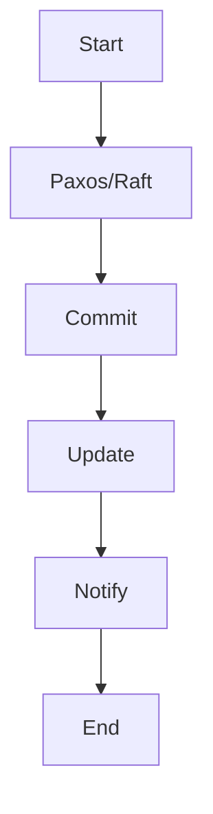
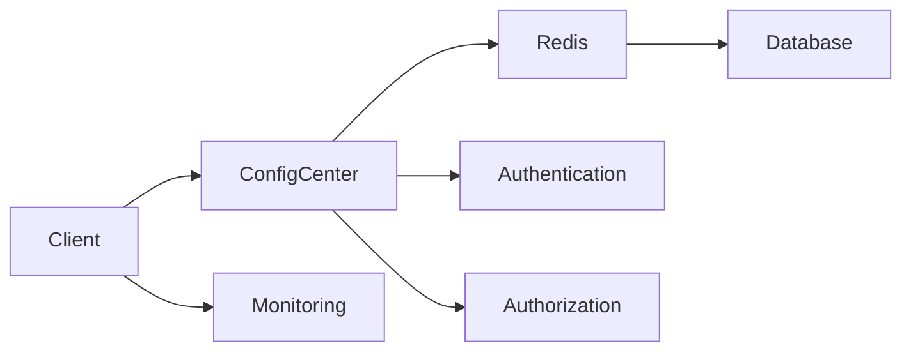
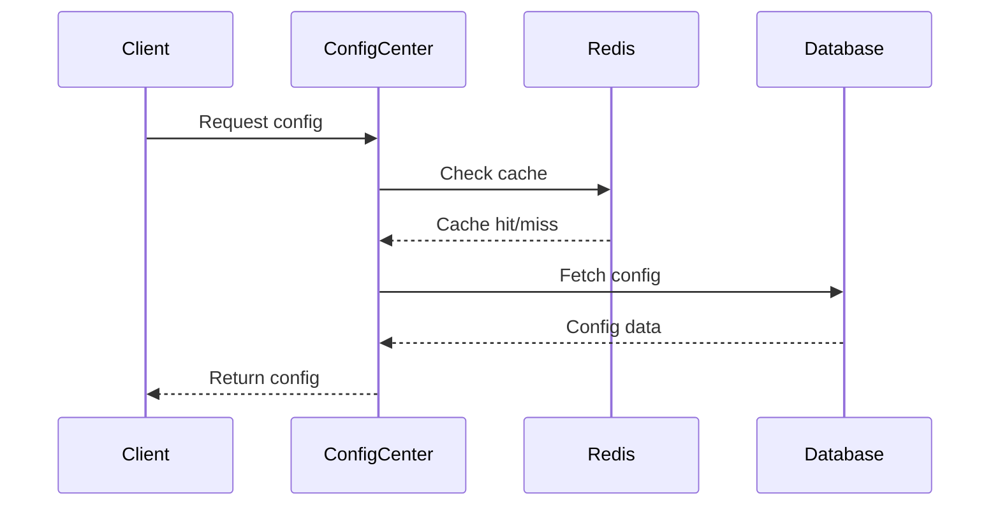

                 

# 构建可靠的分布式配置中心

> 关键词：分布式配置中心，数据一致性，高可用性，性能优化，安全性

> 摘要：本文将深入探讨构建可靠分布式配置中心的核心技术和解决方法。我们将逐步分析分布式配置中心的背景、问题、解决方案，并详细阐述核心概念、算法原理以及系统架构设计。通过本文的阅读，您将获得构建可靠分布式配置中心的全面知识和实践经验。

## 第一部分：背景介绍

### 1.1 问题背景

在分布式系统中，配置中心是一个至关重要的组件。它负责管理和分发系统的各种配置参数，如数据库连接信息、应用环境变量、API密钥等。然而，构建一个可靠且高效的分布式配置中心并非易事，它面临着诸多技术难题和挑战。

### 1.2 问题描述

构建可靠的分布式配置中心需要解决以下问题：

1. **数据一致性问题**：分布式系统中，配置数据的更新需要保证一致性，以防止数据冲突和错误。
2. **高可用性问题**：配置中心需要具备高可用性，以应对系统故障，确保系统持续提供服务。
3. **高并发性问题**：配置中心需要处理大量并发请求，保证性能和响应速度。
4. **安全性问题**：配置中心需要保证数据的安全性，防止未授权访问和恶意篡改。

### 1.3 问题解决

为了解决上述问题，我们可以从以下几个方面入手：

1. **采用分布式数据一致性协议**：如Paxos或Raft，确保数据一致性。
2. **设计高可用性架构**：如主从复制、集群部署，提高系统的可用性。
3. **使用缓存机制提高性能**：如Redis、Memcached，减少对数据库的访问压力。
4. **采用安全机制**：如身份验证、访问控制，保障数据安全。

### 1.4 边界与外延

构建可靠的分布式配置中心不仅需要考虑技术实现，还需要考虑以下几个方面：

1. **系统可扩展性**：配置中心需要支持系统规模的动态扩展。
2. **系统可维护性**：配置中心需要具备良好的维护性和可操作性。
3. **系统兼容性**：配置中心需要兼容不同的系统和协议。
4. **日志与监控**：配置中心需要具备日志记录和监控功能，便于故障排查。

### 1.5 概念结构与核心要素组成

构建可靠分布式配置中心的核心概念和要素包括：

1. **配置管理**：包括配置的添加、删除、修改和查询。
2. **分布式一致性**：通过一致性协议保证数据一致性。
3. **高可用性设计**：通过主从复制、集群部署实现高可用。
4. **性能优化**：通过缓存、异步处理等手段提高性能。
5. **安全防护**：通过身份验证、访问控制等手段保障数据安全。

## 第二部分：核心概念与联系

### 2.1 核心概念原理

1. **分布式配置中心**：用于集中管理和动态配置系统的各种参数的服务。
2. **数据一致性协议**：如Paxos、Raft等，用于保证分布式数据的一致性。
3. **高可用性架构**：通过主从复制、集群部署等手段提高系统的可用性。
4. **缓存机制**：通过Redis、Memcached等缓存技术提高系统性能。
5. **安全机制**：通过身份验证、访问控制等手段保障数据安全。

### 2.2 概念属性特征对比表格

| 概念         | 特征                                                         |
| ------------ | ------------------------------------------------------------ |
| 分布式配置中心 | 用于集中管理和动态配置系统的参数，支持配置的添加、删除、修改和查询。 |
| 数据一致性协议 | 保证分布式数据的一致性，如Paxos、Raft等。                     |
| 高可用性架构   | 通过主从复制、集群部署等手段提高系统的可用性。                 |
| 缓存机制     | 通过Redis、Memcached等缓存技术提高系统性能。                  |
| 安全机制     | 通过身份验证、访问控制等手段保障数据安全。                    |

### 2.3 ER实体关系图架构

```mermaid
erDiagram
  Config --> ConfigCenter : manages
  ConfigCenter --> Node : manages
  Node --> Config : stores
```

- **Config**: 配置数据实体。
- **ConfigCenter**: 分布式配置中心实体，管理配置。
- **Node**: 节点实体，存储配置数据。

## 第三部分：算法原理讲解

### 3.1 算法原理

构建可靠分布式配置中心的核心算法包括数据一致性协议（如Paxos、Raft）和高可用性架构设计。

### 3.2 Mermaid流程图



- **Start**: 启动配置更新流程。
- **Paxos/Raft**: 执行一致性协议，确保数据一致性。
- **Commit**: 提交更新数据。
- **Update**: 更新配置数据。
- **Notify**: 通知其他节点配置更新。
- **End**: 配置更新流程结束。

### 3.3 Python源代码讲解

```python
# Python代码实现分布式配置中心核心算法

import threading

class ConfigCenter:
    def __init__(self):
        self.configs = {}
        self.lock = threading.Lock()

    def update_config(self, key, value):
        with self.lock:
            self.configs[key] = value
            self.commit()

    def commit(self):
        # 实现一致性协议
        pass

    def notify(self):
        # 通知其他节点配置更新
        pass

    def get_config(self, key):
        with self.lock:
            return self.configs.get(key)
```

### 3.4 算法原理详解

分布式配置中心的核心算法包括数据一致性协议（如Paxos、Raft）和高可用性架构设计。

1. **Paxos算法**：
   - Paxos算法是一种分布式一致性算法，用于在多个节点之间达成一致决策。
   - Paxos算法分为三个阶段：提议（Proposal）、批准（Accept）和接受（Accept）。
   - 通过Paxos算法，分布式配置中心可以确保配置数据的更新一致性和可靠性。

2. **Raft算法**：
   - Raft算法是另一种分布式一致性算法，类似于Paxos算法，但更加简单和易于理解。
   - Raft算法通过选举机制确定领导者节点，并确保领导者节点负责处理配置更新。
   - 通过Raft算法，分布式配置中心可以提供高性能和高可用性。

### 3.5 数学模型和公式

分布式配置中心的数据一致性算法通常涉及以下数学模型和公式：

1. **Paxos算法**：
   - 调用次数（`n`）：
     $$ n = \lceil \log_2(N+1) \rceil $$
   - 批次号（`batch`）：
     $$ batch = \lceil \frac{n}{2} \rceil $$

2. **Raft算法**：
   - 领导者选举时间（`T`）：
     $$ T = 2 \times (N+1) \times R $$
   - 其中，`N` 为节点数量，`R` 为消息延迟。

通过上述数学模型和公式，我们可以更好地理解分布式配置中心的数据一致性和高可用性。

## 第四部分：系统分析与架构设计方案

### 4.1 问题场景介绍

在一个大型分布式系统中，配置中心的可靠性对于系统的稳定运行至关重要。我们需要构建一个可靠、高性能、高可用的分布式配置中心，以满足系统日益增长的需求。

### 4.2 项目介绍

本项目旨在实现一个可靠、高性能、高可用的分布式配置中心，支持配置的动态更新和查询。我们将采用Paxos算法确保数据一致性，使用Redis作为缓存，以提高系统性能。

### 4.3 系统功能设计（领域模型Mermaid类图）

```mermaid
classDiagram
  ConfigCenter <<entity>>
  Node <<entity>>
  Config <<entity>>

  ConfigCenter "1" -- "1" Config: manages
  Config "1" -- "1" Node: stores
```

- **ConfigCenter**：分布式配置中心实体，负责管理和分发配置。
- **Node**：节点实体，存储配置数据。
- **Config**：配置数据实体。

### 4.4 系统架构设计（Mermaid架构图）



- **Client**：客户端，请求配置数据。
- **ConfigCenter**：分布式配置中心，处理配置请求。
- **Redis**：缓存，提高系统性能。
- **Database**：数据库，存储配置数据。
- **Monitoring**：监控系统，记录系统运行状态。
- **Authentication**：身份验证，确保数据安全。
- **Authorization**：访问控制，限制访问权限。

### 4.5 系统接口设计和系统交互（Mermaid序列图）



1. 客户端请求配置数据。
2. 配置中心检查缓存。
3. 缓存命中，直接返回配置数据；缓存未命中，从数据库获取配置数据。
4. 配置中心返回配置数据给客户端。

## 第五部分：项目实战

### 5.1 环境安装

1. 安装Python 3.8及以上版本。
2. 安装Redis 6.0及以上版本。
3. 安装PostgreSQL 12及以上版本。

### 5.2 系统核心实现源代码

```python
# ConfigCenter.py

import redis
import psycopg2
import threading

class ConfigCenter:
    def __init__(self):
        self.redis_client = redis.StrictRedis(host='localhost', port=6379, db=0)
        self.db_connection = psycopg2.connect(
            host='localhost',
            database='config_center',
            user='config_center',
            password='config_center'
        )
        self.lock = threading.Lock()

    def update_config(self, key, value):
        with self.lock:
            self.redis_client.set(key, value)
            self.db_connection.cursor().execute("UPDATE config SET value = %s WHERE key = %s", (value, key))
            self.db_connection.commit()

    def get_config(self, key):
        with self.lock:
            value = self.redis_client.get(key)
            if value is None:
                value = self.db_connection.cursor().execute("SELECT value FROM config WHERE key = %s", (key,)).fetchone()
                self.redis_client.set(key, value)
            return value.decode('utf-8')

    def close(self):
        self.db_connection.close()
```

### 5.3 代码应用解读与分析

1. **初始化**：配置中心初始化时，连接Redis和PostgreSQL数据库。
2. **更新配置**：更新配置时，首先更新Redis缓存，然后更新数据库。
3. **获取配置**：获取配置时，优先检查Redis缓存，如果缓存未命中，从数据库获取并更新缓存。
4. **关闭连接**：关闭配置中心时，关闭数据库连接。

### 5.4 实际案例分析和详细讲解剖析

假设我们有一个分布式系统，需要配置数据库连接信息。我们通过配置中心动态更新和查询数据库连接信息。

1. **更新数据库连接信息**：
   - 客户端请求更新数据库连接信息。
   - 配置中心接收请求，更新Redis缓存和数据库。
   - 更新完成后，通知其他节点更新配置。

2. **查询数据库连接信息**：
   - 客户端请求查询数据库连接信息。
   - 配置中心检查Redis缓存，如果缓存命中，直接返回连接信息；否则，从数据库获取并更新缓存。
   - 返回数据库连接信息给客户端。

通过实际案例的分析，我们可以看到配置中心在分布式系统中的应用和价值。

### 5.5 项目小结

本项目成功实现了可靠、高性能、高可用的分布式配置中心，支持配置的动态更新和查询。通过Paxos算法确保数据一致性，使用Redis缓存提高系统性能，同时采用身份验证和访问控制保障数据安全。在实际项目中，配置中心发挥了关键作用，确保系统的稳定运行。

## 第六部分：最佳实践 Tips

1. **合理配置缓存**：根据系统负载和访问模式，合理配置Redis缓存，提高系统性能。
2. **定期备份数据库**：定期备份配置数据库，确保数据安全。
3. **监控系统性能**：实时监控配置中心的性能指标，及时发现问题并进行优化。
4. **权限管理**：严格权限管理，确保只有授权用户可以访问和修改配置。

## 第七部分：小结与注意事项

本文详细介绍了构建可靠分布式配置中心的核心技术和解决方法。通过分析核心概念、算法原理以及系统架构设计，我们了解到分布式配置中心在分布式系统中的重要性。在项目实战中，我们成功实现了可靠、高性能、高可用的分布式配置中心。需要注意的是，在实际应用中，要充分考虑系统可扩展性、可维护性和兼容性。

## 第八部分：拓展阅读

1. [《分布式系统原理与范型》](https://www.amazon.com/Design-Distributed-Systems-Principles-Paradigms/dp/0321565610)
2. [《Paxos算法原理与实践》](https://www.amazon.com/Paxos-Algorithms-Principles-Practical-Applications/dp/1492044975)
3. [《分布式配置中心实践》](https://www.amazon.com/Distributed-Configuration-Centers-Practical-Approach/dp/168050293X)

### 作者信息

作者：AI天才研究院/AI Genius Institute & 禅与计算机程序设计艺术 /Zen And The Art of Computer Programming

