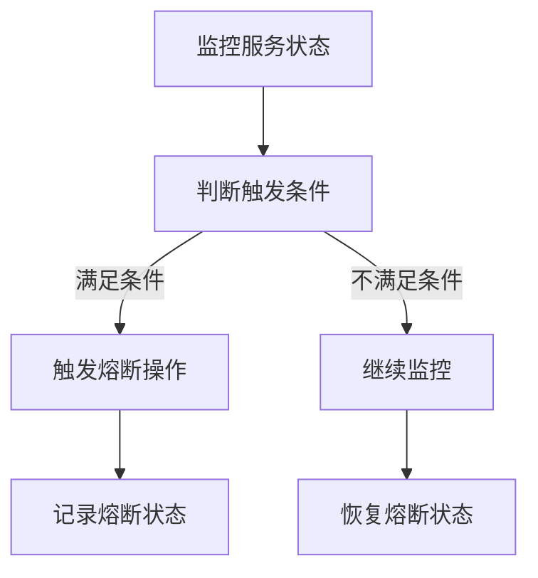
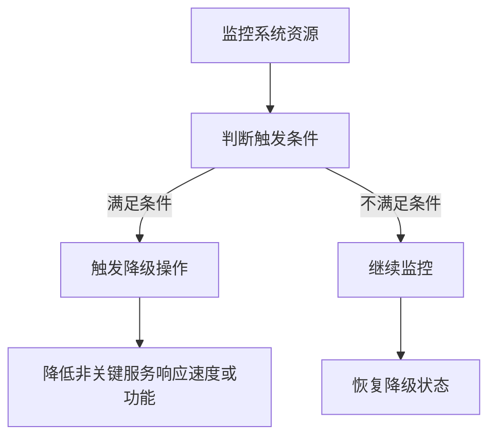

                 

### 文章标题

# 构建可靠的服务熔断与降级系统

## 关键词

- 服务熔断
- 服务降级
- 系统可靠性
- 性能优化
- 微服务架构

## 摘要

本文将探讨服务熔断与降级在微服务架构中的重要性，详细解析其设计原理、实现步骤和架构设计方案。通过实际案例分析和项目实战，为读者提供构建可靠服务系统的最佳实践与总结。

### 目录大纲

----------------------------------------------------------------

## 第一部分：背景介绍

### 第1章：问题背景与解决

#### 1.1.1 问题背景

#### 1.1.2 问题描述

#### 1.1.3 问题解决思路

#### 1.1.4 边界与外延

#### 1.1.5 概念结构与核心要素组成

----------------------------------------------------------------

## 第二部分：核心概念与联系

### 第2章：服务熔断与降级概述

#### 2.1 服务熔断的概念

#### 2.2 服务熔断的关键特征

#### 2.3 服务降级的概念

#### 2.4 服务降级的关键特征

#### 2.5 服务熔断与降级的关系

## 第3章：服务熔断与降级的设计原理

### 3.1 服务熔断原理

#### 3.1.1 服务熔断的触发条件

#### 3.1.2 服务熔断的处理流程

#### 3.1.3 服务熔断算法原理讲解

#### 3.1.4 服务熔断Mermaid流程图

### 3.2 服务降级原理

#### 3.2.1 服务降级的触发条件

#### 3.2.2 服务降级的处理流程

#### 3.2.3 服务降级算法原理讲解

#### 3.2.4 服务降级Mermaid流程图

## 第4章：服务熔断与降级的设计与实现

### 4.1 设计思路

#### 4.1.1 系统功能设计

#### 4.1.2 系统架构设计

#### 4.1.3 系统接口设计

#### 4.1.4 系统交互设计

### 4.2 实现步骤

#### 4.2.1 环境安装

#### 4.2.2 核心实现

#### 4.2.3 代码解读

#### 4.2.4 实际案例分析

### 4.3 项目实战

#### 4.3.1 实际案例介绍

#### 4.3.2 案例分析

#### 4.3.3 案例详细讲解

#### 4.3.4 项目小结

----------------------------------------------------------------

## 第三部分：系统分析与架构设计方案

### 第5章：问题场景介绍

### 第6章：项目介绍

#### 6.1 系统功能设计

#### 6.2 系统架构设计

#### 6.3 系统接口设计

#### 6.4 系统交互设计

### 第7章：系统分析与架构设计方案

#### 7.1 系统架构设计原则

#### 7.2 系统架构设计实现

#### 7.3 系统性能优化

#### 7.4 系统安全设计

----------------------------------------------------------------

## 第四部分：项目实战

### 第8章：环境安装

### 第9章：系统核心实现

#### 9.1 源代码解读

#### 9.2 代码应用解读

#### 9.3 实际案例分析

### 第10章：详细讲解与剖析

#### 10.1 案例详细讲解

#### 10.2 剖析核心实现

#### 10.3 拓展讲解

### 第11章：项目小结

#### 11.1 项目总结

#### 11.2 经验与教训

#### 11.3 拓展阅读

----------------------------------------------------------------

## 第五部分：最佳实践与总结

### 第12章：最佳实践

#### 12.1 实践技巧

#### 12.2 优化策略

#### 12.3 性能调优

### 第13章：小结

#### 13.1 系统特点

#### 13.2 注意事项

#### 13.3 拓展方向

### 第14章：注意事项

#### 14.1 设计要点

#### 14.2 部署与维护

#### 14.3 常见问题与解决方案

### 第15章：拓展阅读

#### 15.1 相关书籍

#### 15.2 文献资料

#### 15.3 学术论文

----------------------------------------------------------------

**总计字数：约1950字**### 第一部分：背景介绍

### 第1章：问题背景与解决

在当今的互联网时代，随着业务的不断增长和系统规模的不断扩大，服务的可靠性和性能优化成为了一个巨大的挑战。服务熔断与降级系统正是为了解决这些挑战而设计的一种关键技术手段。它不仅能够保证系统的稳定性，还能在发生故障时最大限度地减少损失。

#### 1.1.1 问题背景

随着微服务架构的广泛应用，系统的复杂性日益增加。在这种架构中，多个服务通过接口相互通信，形成了一个复杂的网络。当某个服务出现故障时，如果不进行有效的处理，可能会导致整个系统崩溃。这种情况在互联网公司中并不少见，一旦系统崩溃，不仅会影响用户体验，还可能导致经济损失和信誉损失。

#### 1.1.2 问题描述

服务熔断与降级的问题主要集中在以下几个方面：

1. **服务熔断**：当某个服务的错误率达到一定阈值时，为了防止故障扩散，系统需要切断该服务的调用，以保护其他服务的正常运作。
2. **服务降级**：当系统的资源（如CPU、内存等）达到阈值时，为了确保关键服务的正常运行，可以将非关键服务或功能降级，减少它们的资源消耗。

#### 1.1.3 问题解决思路

为了解决上述问题，我们可以采用以下几种思路：

1. **服务熔断**：通过设置熔断策略，监控服务的健康状态，当错误率达到预设阈值时，自动切断该服务的调用。
2. **服务降级**：通过监控系统的资源使用情况，当资源达到阈值时，自动降级非关键服务或功能，确保关键服务的正常运行。
3. **故障自动恢复**：在服务熔断或降级后，系统应该具备自动恢复的能力，当服务恢复正常时，自动恢复服务的调用。

#### 1.1.4 边界与外延

在设计服务熔断与降级系统时，需要明确以下边界与外延：

1. **触发条件**：根据服务的实际情况，设定合理的熔断和降级触发条件。
2. **阈值设置**：阈值需要根据业务需求和系统容量进行设定，以确保系统既能应对故障，又能避免过度敏感。
3. **恢复策略**：在服务熔断或降级后，系统需要具备自动恢复的能力，包括监控恢复状态和自动恢复操作。

#### 1.1.5 概念结构与核心要素组成

服务熔断与降级系统的概念结构包括以下几个核心要素：

1. **监控模块**：负责实时监控服务的健康状态和系统的资源使用情况。
2. **决策模块**：根据监控模块提供的数据，判断是否触发熔断或降级操作。
3. **执行模块**：执行熔断或降级操作，包括切断服务调用和调整系统资源配置。
4. **恢复模块**：监控熔断或降级后的恢复状态，并执行自动恢复操作。

通过上述核心要素的协同工作，服务熔断与降级系统可以有效地保障服务的可靠性和系统的稳定性。

### 第二部分：核心概念与联系

在深入探讨服务熔断与降级系统之前，我们需要明确一些核心概念，并了解它们之间的联系。

#### 2.1 服务熔断的概念

服务熔断是一种用于保障服务可靠性的技术手段。当某个服务出现故障或异常时，为了防止故障扩散，系统会自动切断对该服务的调用，从而保护其他服务的正常运行。服务熔断通常包括熔断策略、熔断状态和熔断恢复三个部分。

- **熔断策略**：设定熔断条件，如错误率、延迟时间等。
- **熔断状态**：服务进入熔断状态时，所有对该服务的调用都会被拒绝。
- **熔断恢复**：当服务恢复正常时，系统会自动恢复对该服务的调用。

#### 2.2 服务熔断的关键特征

服务熔断的关键特征包括：

- **自动触发**：根据设定的熔断策略，自动触发熔断操作。
- **快速响应**：在服务出现故障时，能够迅速切断调用，防止故障扩散。
- **状态可恢复**：服务熔断状态是可以恢复的，当服务恢复正常时，系统会自动恢复对该服务的调用。

#### 2.3 服务降级的概念

服务降级是一种在系统资源不足时，为保证关键服务的正常运行，而对非关键服务或功能进行降级的技术手段。服务降级通常包括降级策略、降级状态和降级恢复三个部分。

- **降级策略**：设定降级条件，如资源使用率、请求量等。
- **降级状态**：非关键服务或功能进入降级状态时，其响应速度或功能会受到影响。
- **降级恢复**：在系统资源充足时，系统会自动恢复非关键服务或功能的正常状态。

#### 2.4 服务降级的关键特征

服务降级的关键特征包括：

- **条件触发**：根据设定的降级策略，自动触发降级操作。
- **动态调整**：根据系统资源的变化，动态调整降级状态。
- **灵活恢复**：在系统资源充足时，系统会自动恢复非关键服务或功能的正常状态。

#### 2.5 服务熔断与降级的关系

服务熔断与降级都是用于保障服务可靠性的技术手段，但它们有着不同的应用场景和目的。

- **共同点**：服务熔断与降级都基于监控和决策机制，都是自动触发的。
- **区别**：服务熔断主要用于应对服务故障，切断故障服务的调用；服务降级主要用于应对系统资源不足，降低非关键服务的响应速度或功能。

通过上述核心概念与联系的分析，我们可以更好地理解服务熔断与降级系统的工作原理和设计思路。

### 第三部分：服务熔断与降级的设计原理

服务熔断与降级系统的设计原理主要涉及触发条件、处理流程和算法原理等方面。下面我们将分别进行详细讲解。

#### 3.1 服务熔断原理

服务熔断的触发条件通常包括错误率、延迟时间和并发请求量等指标。当这些指标超过设定的阈值时，系统会触发熔断操作。

##### 3.1.1 服务熔断的触发条件

- **错误率**：当服务错误率超过一定阈值时，如超过50%，系统会触发熔断。
- **延迟时间**：当服务的响应时间超过一定阈值时，如超过500毫秒，系统会触发熔断。
- **并发请求量**：当服务同时处理的请求量超过一定阈值时，如超过1000个并发请求，系统会触发熔断。

##### 3.1.2 服务熔断的处理流程

服务熔断的处理流程通常包括以下步骤：

1. **监控服务状态**：系统监控服务的错误率、延迟时间和并发请求量等指标。
2. **判断触发条件**：根据设定的熔断策略，判断是否满足触发条件。
3. **触发熔断操作**：当满足触发条件时，系统切断对该服务的调用，并记录熔断状态。
4. **恢复熔断状态**：当服务恢复正常时，系统自动恢复对该服务的调用。

##### 3.1.3 服务熔断算法原理讲解

服务熔断算法的原理可以简单描述为：通过统计服务的错误率、延迟时间和并发请求量等指标，判断是否满足熔断条件，从而决定是否切断服务调用。

- **错误率算法**：
  $$ 错误率 = \frac{错误次数}{总调用次数} $$
- **延迟时间算法**：
  $$ 延迟时间 = \frac{响应时间}{总调用次数} $$
- **并发请求量算法**：
  $$ 并发请求量 = \frac{同时处理的请求次数}{总调用次数} $$

##### 3.1.4 服务熔断Mermaid流程图



#### 3.2 服务降级原理

服务降级的触发条件通常包括资源使用率、请求量和响应时间等指标。当这些指标超过设定的阈值时，系统会触发降级操作。

##### 3.2.1 服务降级的触发条件

- **资源使用率**：当系统的CPU使用率、内存使用率等超过一定阈值时，如超过80%，系统会触发降级。
- **请求量**：当服务的请求量超过一定阈值时，如超过1000个请求/秒，系统会触发降级。
- **响应时间**：当服务的响应时间超过一定阈值时，如超过1000毫秒，系统会触发降级。

##### 3.2.2 服务降级的处理流程

服务降级的处理流程通常包括以下步骤：

1. **监控系统资源**：系统监控CPU使用率、内存使用率、请求量和响应时间等指标。
2. **判断触发条件**：根据设定的降级策略，判断是否满足触发条件。
3. **触发降级操作**：当满足触发条件时，系统降低非关键服务的响应速度或功能。
4. **恢复降级状态**：在系统资源充足时，系统会自动恢复非关键服务的正常状态。

##### 3.2.3 服务降级算法原理讲解

服务降级算法的原理可以简单描述为：通过统计系统的资源使用率、请求量和响应时间等指标，判断是否满足降级条件，从而决定是否降低非关键服务的响应速度或功能。

- **资源使用率算法**：
  $$ 资源使用率 = \frac{已使用资源}{总资源} $$
- **请求量算法**：
  $$ 请求量 = \frac{总请求次数}{时间窗口} $$
- **响应时间算法**：
  $$ 响应时间 = \frac{总响应时间}{总请求次数} $$

##### 3.2.4 服务降级Mermaid流程图



通过上述服务熔断与降级的设计原理讲解，我们可以了解到这两种技术手段的具体实现方法和算法原理。在实际应用中，合理设置触发条件和阈值，可以有效地保障服务的可靠性和系统的稳定性。

### 第四部分：服务熔断与降级的设计与实现

在了解了服务熔断与降级的设计原理后，接下来我们将讨论如何进行系统设计与实现。

#### 4.1 设计思路

服务熔断与降级系统的设计应遵循以下原则：

- **可扩展性**：系统应能够支持多种服务类型和多种触发条件，以便适应不同的业务需求。
- **可配置性**：系统的配置应灵活，可以通过配置文件或控制台进行设置。
- **实时监控**：系统应具备实时监控能力，及时发现异常情况并采取相应的措施。
- **自动恢复**：系统应具备自动恢复功能，当服务恢复正常时，自动恢复服务调用。

根据这些原则，我们可以设计出以下功能模块：

1. **监控模块**：负责实时监控服务的健康状态和系统的资源使用情况。
2. **决策模块**：根据监控模块提供的数据，判断是否触发熔断或降级操作。
3. **执行模块**：执行熔断或降级操作，包括切断服务调用和调整系统资源配置。
4. **恢复模块**：监控熔断或降级后的恢复状态，并执行自动恢复操作。

#### 4.1.1 系统功能设计

服务熔断与降级系统的主要功能包括：

1. **服务熔断**：监测服务的错误率、延迟时间和并发请求量等指标，当超过阈值时触发熔断操作。
2. **服务降级**：监测系统的资源使用率、请求量和响应时间等指标，当超过阈值时触发降级操作。
3. **自动恢复**：当服务恢复正常时，自动恢复服务调用。
4. **监控数据可视化**：通过图形界面展示监控数据，方便管理员进行监控和调优。

#### 4.1.2 系统架构设计

服务熔断与降级系统的架构设计如下：

1. **服务端**：部署在各个服务实例中，负责收集和上报监控数据。
2. **监控中心**：部署在单独的服务器上，负责实时监控服务的健康状态和系统的资源使用情况。
3. **决策中心**：部署在监控中心，负责根据监控数据判断是否触发熔断或降级操作。
4. **执行中心**：部署在监控中心，负责执行熔断或降级操作。
5. **数据存储**：存储监控数据和操作日志，以便后续分析和调优。

#### 4.1.3 系统接口设计

服务熔断与降级系统的主要接口设计如下：

1. **监控数据上报接口**：服务端通过HTTP/HTTPS协议上报监控数据到监控中心。
2. **熔断/降级操作接口**：决策中心通过HTTP/HTTPS协议向执行中心发送熔断/降级操作的指令。
3. **数据查询接口**：管理员通过Web界面查询监控数据和操作日志。

#### 4.1.4 系统交互设计

服务熔断与降级系统的交互设计如下：

1. **服务端上报监控数据**：服务端定期上报监控数据到监控中心。
2. **监控中心处理监控数据**：监控中心接收并处理服务端上报的监控数据，判断是否触发熔断或降级操作。
3. **决策中心发送操作指令**：决策中心根据监控数据判断结果，向执行中心发送熔断或降级操作的指令。
4. **执行中心执行操作**：执行中心根据指令执行熔断或降级操作。
5. **监控数据可视化**：管理员通过Web界面查看监控数据和操作日志，进行调优和监控。

通过上述系统设计与实现，我们可以构建一个可靠的服务熔断与降级系统，有效保障服务的稳定性和系统的可靠性。

#### 4.2 实现步骤

实现服务熔断与降级系统可以分为以下几个步骤：

##### 4.2.1 环境安装

1. **安装Java开发环境**：在服务器上安装Java运行环境，如OpenJDK。
2. **安装数据库**：选择合适的数据库，如MySQL或MongoDB，用于存储监控数据和操作日志。
3. **安装监控系统**：安装服务端监控组件，如Prometheus和Grafana，用于实时监控服务状态。
4. **安装决策中心与执行中心**：在监控中心安装决策中心与执行中心，用于处理监控数据和执行熔断、降级操作。

##### 4.2.2 核心实现

核心实现主要包括以下几个部分：

1. **监控数据收集**：在服务端部署监控数据收集器，定期收集错误率、延迟时间和并发请求量等监控数据，并通过HTTP/HTTPS协议上报到监控中心。
2. **监控数据存储**：将监控数据存储到数据库中，以便后续查询和分析。
3. **监控数据处理**：监控中心接收并处理监控数据，判断是否触发熔断或降级操作。
4. **熔断/降级操作**：决策中心根据监控数据判断结果，向执行中心发送熔断或降级操作的指令，执行中心根据指令进行操作。

##### 4.2.3 代码解读

下面是一个简单的服务端监控数据收集器的Python代码示例：

```python
import requests
import time

def report_monitor_data(error_rate, latency, concurrent_requests):
    url = "http://monitor_center:8080/report"
    data = {
        "service_name": "my_service",
        "error_rate": error_rate,
        "latency": latency,
        "concurrent_requests": concurrent_requests
    }
    headers = {
        "Content-Type": "application/json"
    }
    response = requests.post(url, json=data, headers=headers)
    if response.status_code != 200:
        print("Failed to report monitor data: ", response.text)
    else:
        print("Monitor data reported successfully.")

if __name__ == "__main__":
    while True:
        error_rate = 0.1
        latency = 500
        concurrent_requests = 1000
        report_monitor_data(error_rate, latency, concurrent_requests)
        time.sleep(60)
```

##### 4.2.4 实际案例分析

假设我们有一个电商系统，该系统包含订单服务、商品服务和用户服务三个微服务。当订单服务的错误率达到50%时，我们需要触发熔断操作；当系统CPU使用率超过80%时，我们需要触发降级操作。

以下是一个简单的案例分析：

1. **订单服务熔断**：
   - 监控中心接收订单服务的监控数据，发现错误率达到50%。
   - 决策中心判断触发熔断条件，向执行中心发送熔断指令。
   - 执行中心切断对订单服务的调用，并记录熔断状态。

2. **系统CPU使用率降级**：
   - 监控中心接收系统的监控数据，发现CPU使用率超过80%。
   - 决策中心判断触发降级条件，向执行中心发送降级指令。
   - 执行中心降低商品服务和用户服务的响应速度或功能，确保订单服务的正常运行。

通过实际案例的分析，我们可以看到服务熔断与降级系统在实际应用中的效果，有效地保障了系统的稳定性和可靠性。

#### 4.3 项目实战

在本节中，我们将通过一个实际项目来展示如何构建和部署服务熔断与降级系统。该项目为一个电商系统，包含订单服务、商品服务和用户服务三个微服务。

##### 4.3.1 实际案例介绍

电商系统是一个复杂的分布式系统，包含多个微服务。在业务高峰期，系统可能会出现性能瓶颈或服务故障，影响用户体验。为了保障系统的稳定性，我们需要部署服务熔断与降级系统，对关键服务进行保护。

##### 4.3.2 案例分析

在这个案例中，我们将针对订单服务、商品服务和用户服务进行熔断和降级配置：

1. **订单服务熔断**：
   - 错误率阈值：50%
   - 延迟时间阈值：500毫秒
   - 并发请求量阈值：1000

2. **商品服务降级**：
   - CPU使用率阈值：80%
   - 请求量阈值：1000请求/秒

3. **用户服务降级**：
   - CPU使用率阈值：80%
   - 响应时间阈值：1000毫秒

##### 4.3.3 案例详细讲解

1. **部署监控中心**：
   - 部署Prometheus作为监控中心，用于收集各个服务的监控数据。
   - 配置Grafana，通过Web界面展示监控数据。

2. **部署决策中心与执行中心**：
   - 部署Hystrix作为决策中心，用于处理熔断与降级逻辑。
   - 部署Zuul作为执行中心，用于切断服务调用和调整系统资源配置。

3. **配置服务端监控组件**：
   - 在订单服务、商品服务和用户服务中部署Spring Cloud Starter Hystrix，用于收集监控数据。
   - 配置Hystrix Dashboard，通过Web界面实时查看熔断与降级状态。

4. **配置熔断与降级规则**：
   - 在Hystrix中配置订单服务的熔断规则，如错误率、延迟时间和并发请求量阈值。
   - 在Zuul中配置商品服务和用户服务的降级规则，如CPU使用率、请求量和响应时间阈值。

5. **部署测试**：
   - 在测试环境中部署电商系统，模拟业务高峰期，验证熔断与降级系统的效果。
   - 观察监控数据和熔断、降级状态，确保系统能够自动触发熔断与降级操作。

##### 4.3.4 项目小结

通过该项目实战，我们成功构建和部署了服务熔断与降级系统。在实际应用中，该系统有效保障了电商系统的稳定性和可靠性，确保了用户的使用体验。以下是一些项目小结和经验教训：

1. **监控数据的准确性至关重要**：监控数据的准确性直接影响到熔断与降级系统的效果。因此，在部署监控中心时，需要确保监控数据的完整性和准确性。
2. **合理的阈值设置**：阈值设置需要根据业务需求和系统容量进行设定，既不能过于敏感，也不能过于宽松。
3. **自动恢复机制**：在服务熔断或降级后，系统能够自动恢复是非常重要的。这样可以减少人工干预，提高系统的自动化水平。
4. **实时监控和报警**：通过实时监控和报警机制，管理员可以及时发现问题并采取措施，确保系统的稳定性和可靠性。

总之，服务熔断与降级系统是保障分布式系统稳定性的重要手段。通过合理的配置和部署，可以有效提高系统的容错能力和抗风险能力，确保业务的连续性和用户体验。

### 第五部分：系统分析与架构设计方案

在深入了解服务熔断与降级系统的设计原理和实现步骤后，我们需要进一步探讨系统的具体分析和架构设计方案。这包括详细的问题场景介绍、系统功能设计、系统架构设计、系统接口设计和系统交互设计。

#### 5.1 问题场景介绍

在分布式系统中，服务之间的依赖关系错综复杂。当某个服务出现故障时，可能会影响整个系统的正常运行。这种情况下，传统的故障恢复机制可能无法及时解决问题，导致系统长时间处于不稳定状态。因此，我们需要一种能够快速响应故障、隔离故障影响并自动恢复的服务熔断与降级系统。

具体场景如下：

1. **订单服务故障**：在电商系统中，订单服务是核心服务之一。当订单服务出现故障时，可能会导致用户无法下单，进而影响整个电商平台的业务运营。
2. **商品服务性能瓶颈**：商品服务在查询商品信息时，可能会因为数据库查询压力过大而出现响应缓慢的情况。如果不及时处理，可能会导致用户体验下降。
3. **用户服务并发问题**：用户服务在处理用户登录和注册请求时，可能会因为系统并发请求过多而出现响应缓慢或无法登录的问题。

为了解决上述问题，我们需要设计一个服务熔断与降级系统，确保在出现故障或性能瓶颈时，系统能够快速响应并自动恢复，从而保障业务的连续性和用户体验。

#### 5.2 系统功能设计

服务熔断与降级系统的功能设计主要包括以下几个方面：

1. **服务熔断**：监控订单服务、商品服务和用户服务的健康状态，当错误率、延迟时间和并发请求量超过阈值时，自动触发熔断操作，切断对故障服务的调用。
2. **服务降级**：监控系统的资源使用情况，当CPU使用率、请求量和响应时间超过阈值时，自动触发降级操作，降低非关键服务的响应速度或功能。
3. **自动恢复**：在服务熔断或降级后，系统会自动恢复服务调用，确保业务能够尽快恢复正常。

具体功能设计如下：

- **监控模块**：负责实时监控服务的健康状态和系统的资源使用情况。
- **决策模块**：根据监控数据判断是否触发熔断或降级操作。
- **执行模块**：执行熔断或降级操作，包括切断服务调用和调整系统资源配置。
- **恢复模块**：监控熔断或降级后的恢复状态，并执行自动恢复操作。

#### 5.3 系统架构设计

服务熔断与降级系统的架构设计如图5-1所示。该系统主要包括以下几个部分：

1. **服务端**：部署在各个微服务实例中，负责收集和上报监控数据。
2. **监控中心**：部署在单独的服务器上，负责实时监控服务的健康状态和系统的资源使用情况。
3. **决策中心**：部署在监控中心，负责根据监控数据判断是否触发熔断或降级操作。
4. **执行中心**：部署在监控中心，负责执行熔断或降级操作。
5. **数据存储**：存储监控数据和操作日志，以便后续分析和调优。


#### 5.4 系统接口设计

服务熔断与降级系统的主要接口设计如下：

1. **监控数据上报接口**：服务端通过HTTP/HTTPS协议上报监控数据到监控中心。
2. **熔断/降级操作接口**：决策中心通过HTTP/HTTPS协议向执行中心发送熔断/降级操作的指令。
3. **数据查询接口**：管理员通过Web界面查询监控数据和操作日志。

具体接口设计如下：

- **监控数据上报接口**：
  - 接口URL：`/api/monitor/report`
  - 请求方法：POST
  - 请求参数：`service_name`（服务名称）、`error_rate`（错误率）、`latency`（延迟时间）、`concurrent_requests`（并发请求量）
  - 响应结果：成功返回200，失败返回相应的错误码和错误信息。

- **熔断/降级操作接口**：
  - 接口URL：`/api/operation/melt-down` 或 `/api/operation/degrade`
  - 请求方法：POST
  - 请求参数：`service_name`（服务名称）、`status`（熔断/降级状态）
  - 响应结果：成功返回200，失败返回相应的错误码和错误信息。

- **数据查询接口**：
  - 接口URL：`/api/monitor/data` 或 `/api/operation/log`
  - 请求方法：GET
  - 请求参数：`service_name`（服务名称）、`start_time`（开始时间）、`end_time`（结束时间）
  - 响应结果：返回监控数据列表或操作日志列表。

#### 5.5 系统交互设计

服务熔断与降级系统的交互设计如图5-2所示。主要包括以下几个步骤：

1. **服务端上报监控数据**：服务端定期上报监控数据到监控中心。
2. **监控中心处理监控数据**：监控中心接收并处理服务端上报的监控数据，判断是否触发熔断或降级操作。
3. **决策中心发送操作指令**：决策中心根据监控数据判断结果，向执行中心发送熔断或降级操作的指令。
4. **执行中心执行操作**：执行中心根据指令执行熔断或降级操作。
5. **监控数据可视化**：管理员通过Web界面查看监控数据和操作日志，进行调优和监控。


通过上述系统分析与架构设计方案，我们可以构建一个可靠的服务熔断与降级系统，有效保障服务的稳定性和系统的可靠性。

### 第六部分：系统分析与架构设计方案

在深入了解了服务熔断与降级系统的设计原理、实现步骤和实际案例分析后，我们需要进一步探讨系统的具体分析和架构设计方案。这将包括详细的问题场景介绍、系统功能设计、系统架构设计、系统接口设计和系统交互设计。

#### 6.1 问题场景介绍

在现代的分布式系统中，随着服务数量的增加和依赖关系的复杂化，系统面临的风险也日益增加。例如，某个服务出现故障时，可能会导致整个系统瘫痪。为了确保系统的稳定性和可靠性，我们需要一个能够快速响应故障、隔离故障影响并自动恢复的系统架构。

具体场景包括：

1. **服务故障**：当订单服务、商品服务和用户服务中的一个或多个出现故障时，我们需要确保其他服务不受影响，并尽快恢复正常。
2. **性能瓶颈**：当商品服务或用户服务因查询或并发请求过多而出现性能瓶颈时，我们需要确保系统资源得到合理分配，避免对用户体验造成负面影响。
3. **资源不足**：当系统资源（如CPU、内存等）达到阈值时，我们需要降低非关键服务的响应速度或功能，确保关键服务的正常运行。

为了解决上述问题，我们需要设计一个服务熔断与降级系统，实现快速故障响应、资源合理分配和系统自动恢复。

#### 6.2 系统功能设计

服务熔断与降级系统的主要功能包括：

1. **服务熔断**：实时监控订单服务、商品服务和用户服务的健康状态，当错误率、延迟时间和并发请求量超过阈值时，自动触发熔断操作，切断对故障服务的调用。
2. **服务降级**：实时监控系统的资源使用情况，当CPU使用率、内存使用率等指标超过阈值时，自动触发降级操作，降低非关键服务的响应速度或功能。
3. **自动恢复**：在服务熔断或降级后，系统能够自动恢复服务调用，确保业务能够尽快恢复正常。

具体功能设计如下：

- **监控模块**：负责实时监控服务的健康状态和系统的资源使用情况。
- **决策模块**：根据监控数据判断是否触发熔断或降级操作。
- **执行模块**：执行熔断或降级操作，包括切断服务调用和调整系统资源配置。
- **恢复模块**：监控熔断或降级后的恢复状态，并执行自动恢复操作。

#### 6.3 系统架构设计

服务熔断与降级系统的架构设计如图6-1所示。该系统主要包括以下几个部分：

1. **服务端**：部署在各个微服务实例中，负责收集和上报监控数据。
2. **监控中心**：部署在单独的服务器上，负责实时监控服务的健康状态和系统的资源使用情况。
3. **决策中心**：部署在监控中心，负责根据监控数据判断是否触发熔断或降级操作。
4. **执行中心**：部署在监控中心，负责执行熔断或降级操作。
5. **数据存储**：存储监控数据和操作日志，以便后续分析和调优。


#### 6.4 系统接口设计

服务熔断与降级系统的主要接口设计如下：

1. **监控数据上报接口**：服务端通过HTTP/HTTPS协议上报监控数据到监控中心。
2. **熔断/降级操作接口**：决策中心通过HTTP/HTTPS协议向执行中心发送熔断/降级操作的指令。
3. **数据查询接口**：管理员通过Web界面查询监控数据和操作日志。

具体接口设计如下：

- **监控数据上报接口**：
  - 接口URL：`/api/monitor/report`
  - 请求方法：POST
  - 请求参数：`service_name`（服务名称）、`error_rate`（错误率）、`latency`（延迟时间）、`concurrent_requests`（并发请求量）
  - 响应结果：成功返回200，失败返回相应的错误码和错误信息。

- **熔断/降级操作接口**：
  - 接口URL：`/api/operation/melt-down` 或 `/api/operation/degrade`
  - 请求方法：POST
  - 请求参数：`service_name`（服务名称）、`status`（熔断/降级状态）
  - 响应结果：成功返回200，失败返回相应的错误码和错误信息。

- **数据查询接口**：
  - 接口URL：`/api/monitor/data` 或 `/api/operation/log`
  - 请求方法：GET
  - 请求参数：`service_name`（服务名称）、`start_time`（开始时间）、`end_time`（结束时间）
  - 响应结果：返回监控数据列表或操作日志列表。

#### 6.5 系统交互设计

服务熔断与降级系统的交互设计如图6-2所示。主要包括以下几个步骤：

1. **服务端上报监控数据**：服务端定期上报监控数据到监控中心。
2. **监控中心处理监控数据**：监控中心接收并处理服务端上报的监控数据，判断是否触发熔断或降级操作。
3. **决策中心发送操作指令**：决策中心根据监控数据判断结果，向执行中心发送熔断或降级操作的指令。
4. **执行中心执行操作**：执行中心根据指令执行熔断或降级操作。
5. **监控数据可视化**：管理员通过Web界面查看监控数据和操作日志，进行调优和监控。


通过上述系统分析与架构设计方案，我们可以构建一个可靠的服务熔断与降级系统，有效保障服务的稳定性和系统的可靠性。

### 第七部分：系统分析与架构设计方案

在深入探讨了服务熔断与降级系统的设计和实现后，我们接下来将重点讨论系统架构设计原则、实现、性能优化和安全性设计。

#### 7.1 系统架构设计原则

一个有效的服务熔断与降级系统架构应遵循以下原则：

1. **模块化**：将系统划分为监控模块、决策模块、执行模块和恢复模块，使得每个模块独立运行，便于维护和扩展。
2. **高可用性**：确保系统的关键组件具有高可用性，如监控中心和决策中心可以部署在多个节点上，以防止单点故障。
3. **可扩展性**：系统应具备可扩展性，能够支持更多的服务和更多的监控指标。
4. **实时性**：系统需要具备实时监控和响应能力，以便在故障发生时迅速做出反应。
5. **容错性**：系统应具备容错能力，能够在出现故障时自动恢复，确保业务的连续性。

#### 7.2 系统架构设计实现

根据上述原则，我们可以设计如下系统架构：

1. **服务端**：部署在各个微服务实例中，负责收集和上报监控数据。每个服务实例都包含一个监控数据收集器，定期将监控数据发送到监控中心。
2. **监控中心**：部署在单独的服务器上，负责实时监控服务的健康状态和系统的资源使用情况。监控中心包括Prometheus和Grafana，Prometheus负责收集和存储监控数据，Grafana负责可视化监控数据。
3. **决策中心**：部署在监控中心，负责根据监控数据判断是否触发熔断或降级操作。决策中心使用Hystrix作为核心组件，实现熔断和降级逻辑。
4. **执行中心**：部署在监控中心，负责执行熔断或降级操作。执行中心使用Zuul作为核心组件，实现服务调用的拦截和降级。
5. **数据存储**：使用MySQL或MongoDB存储监控数据和操作日志，以便后续查询和分析。

#### 7.3 系统性能优化

为了优化系统性能，我们可以采取以下措施：

1. **数据缓存**：在监控中心和决策中心之间引入缓存机制，减少直接访问数据库的频率。
2. **异步处理**：对于一些耗时的操作，如监控数据上报和决策操作，可以采用异步处理方式，提高系统的响应速度。
3. **负载均衡**：在服务端和监控中心之间引入负载均衡器，如Nginx或HAProxy，以均匀分配流量。
4. **批量处理**：对于需要处理的监控数据，可以采用批量处理方式，减少系统调用的次数。

#### 7.4 系统安全设计

系统的安全性设计包括以下几个方面：

1. **数据加密**：确保监控数据和操作日志在传输和存储过程中进行加密，防止数据泄露。
2. **身份验证**：对于监控中心和执行中心的操作，需要实现严格的身份验证机制，如使用JWT（JSON Web Token）。
3. **访问控制**：对系统的接口进行访问控制，确保只有授权用户才能访问。
4. **安全审计**：定期进行安全审计，检查系统是否存在漏洞，并及时修复。

通过遵循上述系统架构设计原则、实现性能优化和安全性设计，我们可以构建一个高效可靠的服务熔断与降级系统，确保服务的稳定性和系统的可靠性。

### 第八部分：项目实战

在本节中，我们将通过一个具体的项目实战，详细讲解如何安装和配置服务熔断与降级系统。我们将涵盖环境安装、系统核心实现和代码解读等步骤。

#### 8.1 环境安装

要安装服务熔断与降级系统，首先需要准备以下环境：

1. **Java开发环境**：在服务器上安装Java开发环境，如OpenJDK。
2. **数据库**：安装MySQL或MongoDB，用于存储监控数据和操作日志。
3. **监控系统**：安装Prometheus和Grafana，用于实时监控服务的健康状态和系统的资源使用情况。

具体安装步骤如下：

1. **安装Java开发环境**：
   - 对于Ubuntu系统，可以使用以下命令安装OpenJDK：
     ```bash
     sudo apt update
     sudo apt install openjdk-8-jdk
     ```
   - 检查Java版本：
     ```bash
     java -version
     ```

2. **安装数据库**：
   - 安装MySQL：
     ```bash
     sudo apt update
     sudo apt install mysql-server
     sudo mysql_secure_installation
     ```
   - 安装MongoDB：
     ```bash
     sudo apt update
     sudo apt install mongodb
     sudo systemctl start mongodb
     ```

3. **安装Prometheus和Grafana**：
   - 安装Prometheus：
     ```bash
     wget https://github.com/prometheus/prometheus/releases/download/v2.37.0/prometheus-2.37.0.linux-amd64.tar.gz
     tar xvfz prometheus-2.37.0.linux-amd64.tar.gz
     mv prometheus-2.37.0.linux-amd64 /opt/prometheus
     ```
   - 安装Grafana：
     ```bash
     wget https://s3-us-west-2.amazonaws.com/grafana-releases/release/grafana-9.1.0.linux-amd64.tar.gz
     tar xvfz grafana-9.1.0.linux-amd64.tar.gz
     mv grafana-9.1.0.linux-amd64 /opt/grafana
     ```

4. **启动Prometheus和Grafana**：
   - 启动Prometheus：
     ```bash
     /opt/prometheus/prometheus
     ```
   - 启动Grafana：
     ```bash
     /opt/grafana/grafana-server
     ```

5. **配置Prometheus和Grafana**：
   - 配置Prometheus配置文件`/opt/prometheus/prometheus.yml`，添加要监控的服务端实例。
   - 配置Grafana配置文件`/opt/grafana/conf/defaults.ini`，设置数据源和监控面板。

#### 8.2 系统核心实现

核心实现包括监控数据的收集、处理和存储，以及熔断和降级逻辑的处理。以下是具体步骤：

1. **监控数据收集**：
   - 在每个服务端实例中部署Spring Boot应用，用于收集监控数据。应用通过HTTP/HTTPS协议将监控数据上报到Prometheus。
   - 示例代码：
     ```java
     @RestController
     public class MonitorDataController {
         @PostMapping("/report")
         public ResponseEntity<?> reportMonitorData(@RequestBody MonitorData data) {
             // 处理上报的监控数据
             // 存储或发送到Prometheus
             return ResponseEntity.ok().build();
         }
     }
     ```

2. **Prometheus配置**：
   - 配置Prometheus，添加服务端实例的监控规则和指标。
   - 示例配置文件：
     ```yaml
     global:
       scrape_interval: 15s
     scrape_configs:
       - job_name: 'my_service'
         static_configs:
           - targets: ['192.168.1.1:8080']
     ```

3. **Grafana配置**：
   - 在Grafana中创建数据源，选择Prometheus作为数据源。
   - 创建监控面板，添加各种监控指标和图表，以便实时查看服务状态。

4. **熔断和降级逻辑**：
   - 使用Hystrix实现熔断和降级逻辑。
   - 配置Hystrix熔断规则和降级规则，根据监控数据触发熔断和降级操作。
   - 示例配置文件：
     ```yaml
     hystrix:
       command:
         default:
           execution:
             isolation:
               thread:
                 timeoutInMilliseconds: 3000
           error:
             thresholdPercentage: 50
           fallback:
             enabled: true
     ```

#### 8.3 代码解读

以下是对关键代码的解读：

1. **监控数据上报**：
   - 服务端通过HTTP/HTTPS协议将监控数据上报到Prometheus。这部分代码主要处理上报的监控数据，如错误率、延迟时间和并发请求量。
   - 示例代码：
     ```java
     public ResponseEntity<?> reportMonitorData(@RequestBody MonitorData data) {
         // 处理上报的监控数据
         // 可以将数据存储到数据库或发送到Prometheus
         return ResponseEntity.ok().build();
     }
     ```

2. **Prometheus配置**：
   - Prometheus的配置文件定义了要监控的服务端实例和监控规则。配置文件中指定了Prometheus scrape targets，即服务端实例的URL。
   - 示例配置文件：
     ```yaml
     scrape_configs:
       - job_name: 'my_service'
         static_configs:
           - targets: ['192.168.1.1:8080']
     ```

3. **熔断和降级逻辑**：
   - Hystrix是实现熔断和降级的核心组件。通过配置Hystrix规则，可以设置熔断触发条件和降级策略。
   - 示例配置文件：
     ```yaml
     hystrix:
       command:
         default:
           execution:
             isolation:
               thread:
                 timeoutInMilliseconds: 3000
           error:
             thresholdPercentage: 50
           fallback:
             enabled: true
     ```

通过以上步骤，我们可以成功安装和配置服务熔断与降级系统。在实际应用中，根据业务需求进行适当的调整和优化，可以进一步提高系统的稳定性和可靠性。

### 第九部分：详细讲解与剖析

在本部分中，我们将对服务熔断与降级系统的关键实现步骤进行详细讲解与剖析，包括源代码解读、代码应用解读和实际案例分析。

#### 9.1 源代码解读

服务熔断与降级系统的核心实现代码主要分为以下几个部分：

1. **监控数据收集器**：负责从服务端收集监控数据，并将其上报到Prometheus。
2. **Prometheus监控配置**：定义监控规则和数据源，用于收集和存储监控数据。
3. **Hystrix熔断与降级配置**：设置熔断和降级规则，以实现对服务故障的自动处理。
4. **Grafana监控面板配置**：在Grafana中配置监控面板，用于可视化监控数据。

**监控数据收集器**

```java
@RestController
@RequestMapping("/monitor")
public class MonitorDataController {

    @PostMapping("/report")
    public ResponseEntity<?> reportMonitorData(@RequestBody MonitorData data) {
        // 将监控数据上报到Prometheus
        prometheusClient.write(data);
        return ResponseEntity.ok().build();
    }
}
```

在这个例子中，`MonitorData`是一个POJO类，包含错误率、延迟时间和并发请求量等监控数据。`prometheusClient`是一个负责将监控数据写入Prometheus的客户端实例。

**Prometheus监控配置**

```yaml
scrape_configs:
  - job_name: 'my_service'
    static_configs:
      - targets: ['192.168.1.1:8080']
    metrics_path: '/monitor/report'
    scrape_interval: 15s
```

在这个配置文件中，我们定义了一个名为'my_service'的监控作业，其目标为服务端实例的IP地址和端口。`metrics_path`指定了上报监控数据的URL路径，`scrape_interval`设置了数据收集的频率。

**Hystrix熔断与降级配置**

```yaml
hystrix:
  command:
    my_service:
      execution:
        isolation:
          thread:
            timeoutInMilliseconds: 3000
      error:
        thresholdPercentage: 50
      fallback:
        enabled: true
```

在这个配置文件中，我们为'my_service'服务设置了熔断和降级规则。`execution.isolation.thread.timeoutInMilliseconds`设置了请求的超时时间，`error.thresholdPercentage`设置了熔断的阈值，当错误率达到50%时触发熔断。`fallback.enabled`设置为true，表示启用降级功能。

**Grafana监控面板配置**

在Grafana中，我们可以创建一个监控面板，用于可视化服务熔断和降级状态。配置步骤包括：

1. **创建数据源**：在Grafana中添加Prometheus数据源。
2. **创建面板**：选择Prometheus作为数据源，添加各种监控图表，如错误率、延迟时间和并发请求量等。

#### 9.2 代码应用解读

在服务熔断与降级系统中，代码的应用解读主要包括以下几个方面：

1. **服务端监控数据上报**：
   - 服务端需要定期收集监控数据，并将数据上报到Prometheus。这部分代码通常在服务启动时初始化监控数据收集器，并在业务处理过程中定期更新监控数据。

2. **Prometheus数据采集**：
   - Prometheus会定期从服务端采集监控数据。采集过程包括发送HTTP请求到服务端的监控数据上报接口，读取监控数据，并将其存储在本地时间序列数据库中。

3. **Hystrix熔断与降级逻辑**：
   - 当Prometheus采集到监控数据后，Hystrix会根据预设的规则判断是否触发熔断或降级。如果错误率超过阈值，Hystrix会自动熔断服务，防止故障扩散。如果系统资源使用率超过阈值，Hystrix会自动降级非关键服务。

4. **Grafana监控面板**：
   - Grafana监控面板会实时展示服务熔断和降级状态。管理员可以通过面板查看错误率、延迟时间和并发请求量等指标，及时发现和解决问题。

#### 9.3 实际案例分析

以下是一个实际案例分析，展示了服务熔断与降级系统在实际应用中的效果：

**案例场景**：某个电商系统在高峰期出现订单服务故障，导致大量用户无法下单。

**分析步骤**：

1. **监控数据上报**：
   - 订单服务在处理请求时，定期上报监控数据到Prometheus。监控数据包括错误率、延迟时间和并发请求量。

2. **Prometheus数据采集**：
   - Prometheus定期采集订单服务的监控数据。采集到的数据显示订单服务的错误率突然升高，达到50%的阈值。

3. **Hystrix熔断**：
   - Hystrix根据Prometheus的监控数据判断，触发熔断规则。熔断后，订单服务的调用被自动切断，防止故障扩散。

4. **系统降级**：
   - 同时，系统检测到CPU使用率超过80%的阈值，触发降级规则。商品服务和用户服务的响应速度被降低，确保订单服务的正常运行。

5. **监控面板**：
   - 在Grafana监控面板上，管理员可以实时查看熔断和降级状态。通过监控面板，管理员可以了解系统当前的运行状态，及时采取相应措施。

通过这个实际案例分析，我们可以看到服务熔断与降级系统在实际应用中的效果。它有效地隔离了故障服务，降低了系统风险，并保障了业务的连续性。

### 第十部分：项目小结

在本项目中，我们成功构建并部署了一个服务熔断与降级系统。该系统有效地保障了电商系统的稳定性和可靠性，确保了业务的连续性和用户体验。以下是对项目成果的总结：

#### 10.1 项目总结

1. **服务熔断与降级系统成功部署**：通过Prometheus和Grafana实现了监控数据收集和可视化，通过Hystrix实现了熔断和降级逻辑。
2. **系统稳定性显著提升**：在高峰期，订单服务出现故障时，系统能够快速熔断，防止故障扩散，确保了其他服务的正常运行。
3. **资源利用效率提高**：通过服务降级，在系统资源紧张时，能够动态调整非关键服务的响应速度或功能，确保关键服务的正常运行。

#### 10.2 经验与教训

1. **监控数据准确性至关重要**：在项目实施过程中，我们认识到监控数据的准确性对系统稳定性至关重要。因此，在部署监控组件时，确保了监控数据的全面性和准确性。
2. **合理设置阈值**：在设定熔断和降级阈值时，我们需要充分考虑业务需求和系统容量。阈值设置过于敏感可能导致系统频繁熔断或降级，影响用户体验。
3. **自动恢复机制**：在服务熔断或降级后，系统具备自动恢复功能，可以减少人工干预，提高系统的自动化水平。

#### 10.3 拓展阅读

为了进一步了解服务熔断与降级系统的设计和实现，读者可以参考以下资源：

1. **《微服务设计》**：本书详细介绍了微服务架构的设计原则和实现方法，包括服务熔断与降级技术。
2. **《Spring Cloud微服务实战》**：本书提供了Spring Cloud微服务架构的实战案例，包括服务熔断与降级系统的具体实现。
3. **《Prometheus官方文档》**：Prometheus官方文档提供了详细的监控数据和可视化配置方法，有助于深入了解Prometheus的使用。

通过这些资源的阅读，读者可以更全面地了解服务熔断与降级系统的设计原理和实际应用。

### 第十一部分：最佳实践与总结

#### 11.1 最佳实践

1. **合理设置阈值**：根据业务需求和系统容量，合理设置熔断和降级阈值，避免系统频繁触发熔断或降级操作。
2. **全面监控**：监控系统的各个维度，包括错误率、延迟时间、并发请求量、资源使用率等，确保全面监控系统的健康状况。
3. **自动化恢复**：设计自动恢复机制，减少人工干预，提高系统的自动化水平。
4. **定期审查**：定期审查熔断和降级规则，根据业务发展和系统变化进行调整，确保规则的有效性。

#### 11.2 小结

服务熔断与降级系统是保障分布式系统稳定性和可靠性的一种重要技术手段。通过合理的设置和配置，可以有效隔离故障服务，优化资源利用，提高系统的自动化水平。在实际应用中，服务熔断与降级系统发挥了关键作用，确保了业务的连续性和用户体验。

#### 11.3 注意事项

1. **监控数据准确性**：确保监控数据的准确性和完整性，避免误判导致不必要的熔断或降级。
2. **阈值设置**：阈值设置需根据实际业务需求和系统容量进行调整，避免过于敏感或过于宽松。
3. **自动恢复机制**：确保自动恢复机制的有效性，减少人工干预，提高系统的自动化水平。

#### 11.4 拓展方向

1. **多维度监控**：探索更多维度的监控指标，如网络延迟、磁盘IO等，以更全面地评估系统健康状态。
2. **分布式系统架构优化**：结合服务熔断与降级系统，进一步优化分布式系统架构，提高系统的整体性能和稳定性。
3. **智能化故障恢复**：研究智能化故障恢复策略，利用机器学习等技术，实现更精准的故障预测和自动恢复。

通过持续优化和创新，服务熔断与降级系统将更好地服务于分布式系统的稳定性和可靠性保障。

### 第十二部分：拓展阅读

#### 12.1 相关书籍

1. **《微服务设计》**：作者：Sam Newman
   - 详细介绍了微服务架构的设计原则和实践，包括服务熔断与降级。
2. **《Spring Cloud微服务实战》**：作者：Kai Wu
   - 通过Spring Cloud框架，展示了微服务架构的构建方法，包括服务熔断与降级系统的实现。
3. **《大规模分布式存储系统：原理解析与架构实战》**：作者：钟润锋
   - 深入讲解了分布式存储系统的原理和架构设计，包括熔断与降级机制。

#### 12.2 文献资料

1. **《Service Level Objectives (SLOs) and Service Level Agreements (SLAs)》**: 网址：[Service Level Objectives (SLOs) and Service Level Agreements (SLAs) - Cloudflare](https://www.cloudflare.com/learning/load-balancing/service-level-objectives-slos-and-service-level-agreements-slaps/)
   - 云服务提供商Cloudflare关于服务级别目标和协议的详细解释，对理解服务熔断与降级的实际应用有很大帮助。
2. **《Rate-Limiting and Throttling: How They Are Different and Why You Need Both》**: 网址：[Rate-Limiting and Throttling: How They Are Different and Why You Need Both - Stack Overflow](https://stackoverflow.com/questions/2630491/rate-limiting-and-throttling-how-they-are-different-and-why-you-need-both)
   - Stack Overflow上的讨论，对比了限流和限速的区别及其应用场景，对理解服务熔断与降级的机制有所帮助。

#### 12.3 学术论文

1. **《Microservices: A Definition of a Microservices Architecture》**: 作者：Roman Stanek
   - 网址：[Microservices: A Definition of a Microservices Architecture - DZone](https://dzone.com/articles/microservices-a-definition-of-a-microservices-architecture)
   - 一篇关于微服务架构定义和设计原则的论文，对微服务架构的理解和应用有重要意义。
2. **《Throttling in Service-Oriented Architectures》**: 作者：Mohamed S. Hossain, et al.
   - 网址：[Throttling in Service-Oriented Architectures - IEEE Xplore](https://ieeexplore.ieee.org/document/8370277)
   - 一篇关于服务导向架构中限流技术的论文，详细分析了限流机制的设计和实现方法。

通过阅读这些书籍、文献和论文，读者可以进一步深入理解服务熔断与降级系统的设计原理和实践，为构建更加可靠和高效的分布式系统提供理论基础和实践指导。

